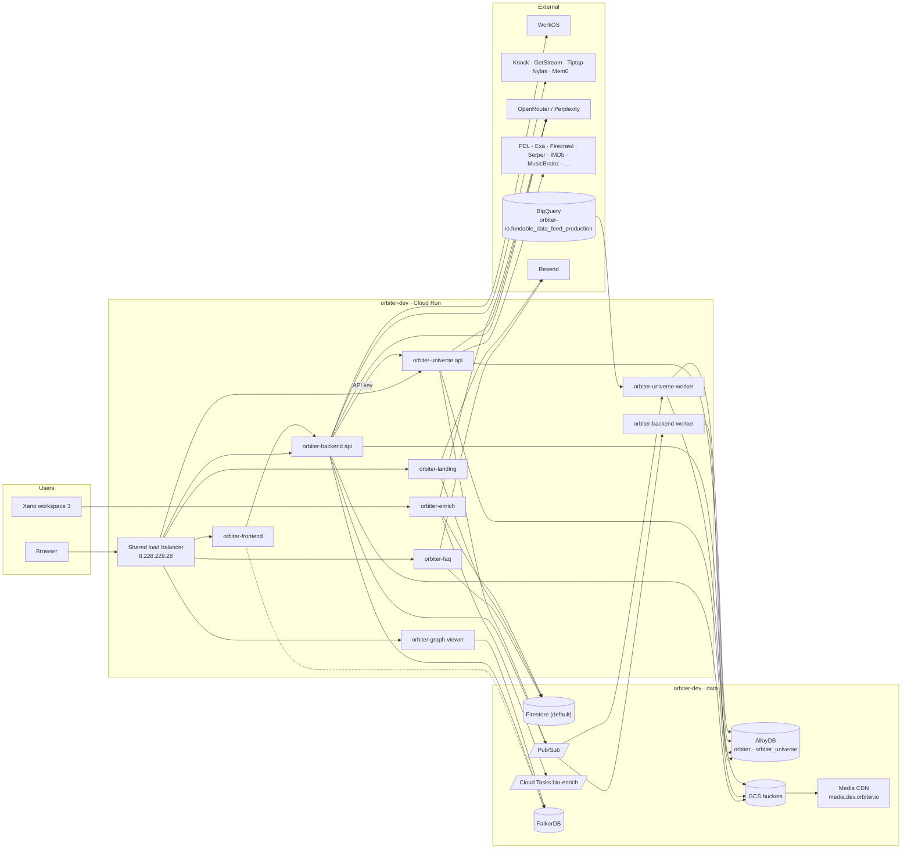

Snapshot as of September 2026, taken from `orbiter-infra` and the application repos. One Google Cloud environment is live, `orbiter-dev` (`us-central1`); `orbiter-staging` and `orbiter-prod` are named in places but do not exist. Everything user-facing is a Cloud Run service behind one shared load balancer. Ticket: [PLT-57](https://linear.app/orbiter-io/issue/PLT-57).

## System

## Services

All in project `orbiter-dev`, region `us-central1`, images in `us-central1-docker.pkg.dev/orbiter-shared/apps/<name>`. Terraform roots are under `orbiter-infra/environments/dev/`.

| Service | Hostname | Repo | Runtime | Terraform root | Talks to |
| --- | --- | --- | --- | --- | --- |
| `orbiter-landing` | `orbiter.io`, `www.orbiter.io` | `orbiter-landing-page` | Next.js 16 | `orbiter-landing` | Firestore `waitlist_entries`, Dub, Resend |
| `orbiter-frontend` | `dev.orbiter.io` | `orbiter-frontend` | TanStack Start (Node) | `orbiter-frontend` | backend `/v1`, FalkorDB (server side), Knock, GetStream, Tiptap, Nylas, Sentry |
| `orbiter-backend` | `backend-dev.orbiter.io` | `orbiter-backend` | Go, chi | `orbiter-backend` | AlloyDB `orbiter`, GCS, Pub/Sub, FalkorDB, universe, WorkOS, Knock, GetStream, Tiptap, Mem0, Nylas, Resend, OpenRouter |
| `orbiter-backend-worker` | none (Pub/Sub push only) | `orbiter-backend` | Go | `orbiter-backend` | AlloyDB, GCS |
| `orbiter-universe` | `universe-dev.orbiter.io` | `orbiter-universe` | Go, chi | `orbiter-universe` | AlloyDB `orbiter_universe`, GCS, Pub/Sub, enrichment providers, OpenRouter |
| `orbiter-universe-worker` | none (Pub/Sub push only) | `orbiter-universe` | Go | `orbiter-universe` | AlloyDB, GCS, BigQuery |
| `orbiter-graph-viewer` | `graph.orbiter.io` | `orbiter-graph-viewer` | TanStack Start (Node) | `orbiter-graph-viewer` | any FalkorDB the signed-in user points it at; Google OAuth |
| `orbiter-faq` | `dd.faq.orbiter.io`, `faq.manager.orbiter.io` | `orbiter-faq` | Node, no framework | `orbiter-faq` | Secret Manager, Firestore `faq_investors`, Resend |
| `orbiter-enrich` | none (`*.run.app` URL) | `orbiter-queue` | Python, FastAPI | `orbiter-enrich` | Cloud Tasks, Firestore `bio_enrich_jobs`, OpenRouter |

Cloud Run jobs: `orbiter-backend-migrate` and `orbiter-universe-migrate` (goose migrations, run by CD before each deploy), `orbiter-universe-fundables-sync` (weekly BigQuery mirror).

Direction of calls between Orbiter services: frontend → backend → universe. Universe never calls the backend; it is a data product consumed through its `publish` API with an API key. `orbiter-enrich` is called by Xano and returns results by webhook.

## Data stores

| Store | Where | Used by | Terraform |
| --- | --- | --- | --- |
| AlloyDB cluster `orbiter-dev` (private, IAM auth) | databases `orbiter`, `orbiter_universe` | backend, universe | `dev/foundation` |
| Firestore `(default)` | collections `bio_enrich_jobs`, `faq_investors`, `waitlist_entries` | enrich, faq, landing | `dev/orbiter-enrich` |
| GCS `orbiter-backend-478907224215` | private files | backend | `dev/orbiter-backend` |
| GCS `orbiter-universe-478907224215` | media, served through Cloud CDN at `media.dev.orbiter.io` | universe | `dev/orbiter-universe` |
| FalkorDB (hosted) | graph `live` | backend, frontend, graph-viewer | not in Terraform |
| FalkorDB VM `orbiter-dev-falkordb` | `falkordb.dev.orbiter.io`, VPC only, e2-standard-2 | nothing yet; replacement for the hosted instance | `dev/orbiter-falkordb` |
| BigQuery `fundable_data_feed_production` | legacy project `orbiter-io` | universe fundables sync (read only) | none |
| Pub/Sub | backend: 8 event topics + DLQ, `nylas-gmail-realtime`; universe: `enrichment`, `publish`, `fundables` + DLQ | push to the two workers | `dev/orbiter-backend`, `dev/orbiter-universe` |
| Cloud Tasks `bio-enrich` | | enrich | `dev/orbiter-enrich` |
| Cloud Scheduler | 18 universe sweep jobs (2 min to hourly), fundables daily and weekly | universe | `dev/orbiter-universe` |

Database access from a laptop goes through the IAP bastion (`orbiter-infra/scripts/dev-db.sh`). No Cloud SQL, no Memorystore.

## Network and DNS

- One global load balancer, `orbiter-lb` (`dev/orbiter-load-balancer`), holds every public hostname as a host rule and certificate. Each service root contributes only its serverless NEG, backend service and certificate. Unknown hosts redirect to `orbiter.io`.
- Exception: the media CDN has its own address (`8.233.185.78`) in front of the universe bucket.
- Zone `orbiter.io` lives in project `orbiter-shared` (`environments/shared/dns_records.tf`), registrar GoDaddy. `dev.orbiter.io` is delegated to a child zone in `orbiter-dev` (`dev/foundation/dns.tf`).
- Mail: Google Workspace MX on the apex; Resend sending domains `orbiter.io` (FAQ, waitlist), `faq.manager.orbiter.io`, `updates.orbiter.io` (backend identity review). DMARC is `p=none`. Clerk CNAME records remain from the previous auth provider.

## Projects

| Project | Role |
| --- | --- |
| `orbiter-shared` | Terraform state, provisioner SA, GitHub Workload Identity pool, Artifact Registry `apps`, `orbiter.io` DNS zone |
| `orbiter-logging` | central logging sink |
| `orbiter-dev` | the workload project: VPC, AlloyDB, bastion, every Cloud Run service, Firestore, FalkorDB VM |
| `orbiter-io` (legacy) | BigQuery fundables feed, OAuth credentials; exempt from org policies; being retired |
| `graph-viewer-494719`, `orbiter-frontend-dev`, `orbiter-backend` (legacy) | earlier per-app projects, marked for decommission |

## Deployment

- **Applications:** each repo's GitHub Actions workflow authenticates with Workload Identity (no keys), builds the image into Artifact Registry, and runs `gcloud run deploy` with the new image only. Terraform owns the service shape; CD only moves the image. Backend and universe run their migrate job first and stop if it fails. Triggers: `main` for backend, universe, landing, graph-viewer, faq; `dev` for frontend.
- **Infrastructure:** PRs to `orbiter-infra` get a plan comment per changed root. A member comments `/apply <root>` to apply; the workflow re-plans and aborts if the plan changed. `bootstrap/` is applied by hand.
- **Secrets:** Secret Manager in `orbiter-dev`, mounted as env vars, values created by a human and never in Terraform.

## Migration state

- **Xano** (workspace 3, `OrbiterV2`) still serves parts of the product. The Go backend is the target; Xano functions are reference contracts, and the backend's `gcpseed` maps Xano ids into AlloyDB. Frontend endpoints not yet on GCP return 501 `gcpNotImplemented`.
- **Auth:** WorkOS is the identity provider; the frontend authenticates through the backend. Clerk is gone from the code; its DNS records are not.
- **Hosting:** everything under `orbiter.io` resolves to the shared load balancer. `orbiter-frontend` still carries a Netlify config (`orbiter-beta`, `orbiter-staging`) and `orbiter-queue` a Fly.io config; neither is what DNS serves.
- **FalkorDB:** applications use the hosted instance. The self-hosted VM is provisioned and unused until a cutover.
- **Xano-era repo docs** in `orbiter-queue` (Redis/RQ) and `orbiter-landing-page` (Fly.io, Clerk) describe earlier designs; the code and Terraform above are current.
