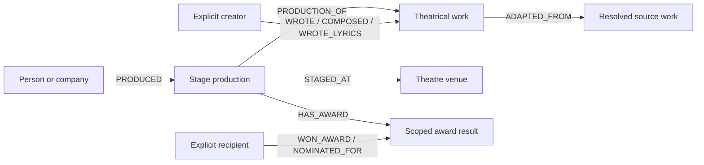

Core graph edge relationship types plus enrichment-specific edge sets, organized by logical group.

Most core entries on this page are generated from the live `util.template_engine` (and `api.lambda`-built) Cypher blocks inside Xano workspace 3. Compact enrichment inventories, such as MusicBrainz, point to the deeper pipeline-specific implementation pages. Entries include:

- One-click copyable **function path + ID** so you can jump straight to the source.
- For generated core sections, the **actual MERGE/CREATE Cypher snippet** that writes the edge — copied verbatim from the function (Twig templating preserved, so you can see exactly which properties are conditional).
- The **edge pattern**, **weight** (lower = more important), and the **inputs** the writer reads.

**Weight convention:** Lower numbers indicate stronger / more important relationships. Every edge uses the integer 1–100 scale (identity bridges at 1, hub damping at 100) — the IMDB film/TV edges' old sub-1 weights were raised to 30–40 by the §3.6 audit (2026-05-31); never write sub-1 weights.

**Deployment convention:** an edge name shown in <span style={{ color: "#16a34a", fontWeight: 600 }}>green</span> is specified on this page but has no live writer yet — see [Person Relationship Edges](#person-relationship-edges) and [Enrichment Engine v1.2 Edges](#enrichment-engine-v12-edges). The colour comes off when the writer ships.

<Note>
  **Historical writer audit: 2026-07-09** — the original patterns and quoted Cypher describe the legacy writers. **Theatre specification revised: 2026-09-06** — [Go theatre edges](#theatre-edges), endpoint rules and property examples are proposed development contracts, not deployed writers. This addition does not re-audit unrelated sections.
</Note>

---

## Work Relationships

Edges connecting people to companies through employment and professional roles.

<Card icon="cloud-arrow-up">

```
mvp/edges/create-work-edges — #2800
```

**v2.12 (2026-07-08).** Single Cypher MERGEs Person \+ Company stubs, then writes the work-edge types in one pass via per-edge `FOREACH (CASE WHEN ...)` guards. Reads grouped `work_experience` rows joined by `master_person_id` + `master_company_id`. Every edge gets a stable `uuid = coalesce(r.uuid, randomUUID())`, `created_at` (coalesce) + `updated_at`, and a deterministic fallback `description`; the LLM description writers always run inline after graph creation (the `write_descriptions` input is retained but ignored since v2.12).

**Inputs:** grouped work-experience records via `$var.cypher` (a lambda-built map containing `person_uuid`, `company_uuid`, `is_founder`, `founder_title`, `is_board_member`, `is_advisor`, `is_investor`, `is_member`, `is_works_at`, `works_at_weight`, `works_at_seniority`, plus per-edge `valid_from` / `valid_to` / `title` / `description`). The v2.x classifier: founder evidence ORs in Fundable structured `is_founder` and Company_LLM founder rows (with a phantom-founder guard against title-only fakes), advisory/board/member titles are excluded from `WORKS_AT`, generic placeholder companies get no edges, and **`isInvestor` is hardcoded `false` (v2.5)** — see `INVESTED_IN` below.

</Card>

### FOUNDED

A person founded or co-founded a company.

| | |
|---|---|
| **Pattern** | `(Person)-[FOUNDED]->(Company)` |
| **Weight** | **5** (highest importance) |
| **Writer** | `mvp/edges/create-work-edges` (#2800) |

```cypher
FOREACH (x IN CASE WHEN g.is_founder = true THEN [1] ELSE [] END |
  MERGE (p)-[r:FOUNDED]->(c)
  SET r.created_at = coalesce(r.created_at, timestamp()),
      r.updated_at = timestamp(),
      r.title = g.founder_title,
      r.weight = 5,
      r.description = CASE
        WHEN toLower(g.founder_title) CONTAINS 'co-founder'
          OR toLower(g.founder_title) CONTAINS 'cofounder'
        THEN CASE
          WHEN g.founder_start_year IS NOT NULL AND toString(g.founder_start_year) <> ''
          THEN p.name + ' co-founded ' + c.name + ' in ' + toString(g.founder_start_year) + '.'
          ELSE p.name + ' is the Co-Founder of ' + c.name + '.'
        END
        ELSE CASE
          WHEN g.founder_start_year IS NOT NULL AND toString(g.founder_start_year) <> ''
          THEN p.name + ' founded ' + c.name + ' in ' + toString(g.founder_start_year) + '.'
          ELSE p.name + ' is the Founder of ' + c.name + '.'
        END
      END,
      r.valid_from = g.founder_valid_from,
      r.valid_to = g.founder_valid_to,
      r.uuid = coalesce(r.uuid, randomUUID())
)
```

| Property | Description |
|----------|-------------|
| `uuid` | Stable edge identifier (re-run-safe via `coalesce`) |
| `title` | Founder title (e.g. "Co-Founder & CEO") |
| `description` | Auto-generated sentence — distinguishes `founded` vs `co-founded` and appends the year when known |
| `valid_from` / `valid_to` | Start / end (null = still active) |
| `weight` | Always `5` |

---

### WORKS_AT

Standard employment relationship. Weight varies by seniority level (computed upstream in `create-work-edges` v1).

| | |
|---|---|
| **Pattern** | `(Person)-[WORKS_AT]->(Company)` |
| **Weight** | **dynamic** (`g.works_at_weight` — seniority-tier ladder) |
| **Writer** | `mvp/edges/create-work-edges` (#2800) |

```cypher
FOREACH (x IN CASE WHEN g.is_works_at = true THEN [1] ELSE [] END |
  MERGE (p)-[r:WORKS_AT]->(c)
  SET r.created_at = coalesce(r.created_at, timestamp()),
      r.updated_at = timestamp(),
      r.title = g.works_at_title,
      r.description = CASE
        WHEN r.description IS NOT NULL AND toString(r.description) <> '' THEN r.description
        WHEN g.works_at_title IS NOT NULL AND toString(g.works_at_title) <> '' THEN p.name + ' works at ' + c.name + ' as ' + g.works_at_title + '.'
        ELSE p.name + ' works at ' + c.name + '.'
      END,
      r.weight = g.works_at_weight,
      r.seniority_level = g.works_at_seniority,
      r.valid_from = g.valid_from,
      r.valid_to = g.valid_to,
      r.total_roles = g.total_roles,
      r.role_history = g.role_history,
      r.uuid = coalesce(r.uuid, randomUUID())
)
```

| Property | Description |
|----------|-------------|
| `title` | Current job title |
| `seniority_level` | Pre-computed bucket (e.g. "founder", "exec", "senior", "mid") |
| `weight` | Pre-computed by seniority bucket |
| `valid_from` / `valid_to` | Start / end (null = currently employed) |
| `total_roles` | Count of roles held at this company |
| `role_history` | Serialized history of all roles |

---

### BOARD_MEMBER_OF

Person serves on a company's board.

| | |
|---|---|
| **Pattern** | `(Person)-[BOARD_MEMBER_OF]->(Company)` |
| **Weight** | **8** |
| **Writer** | `mvp/edges/create-work-edges` (#2800) |

```cypher
FOREACH (x IN CASE WHEN g.is_board_member = true THEN [1] ELSE [] END |
  MERGE (p)-[r:BOARD_MEMBER_OF]->(c)
  SET r.created_at = coalesce(r.created_at, timestamp()),
      r.updated_at = timestamp(),
      r.title = g.board_title,
      r.weight = 8,
      r.description = CASE
        WHEN g.board_description IS NOT NULL AND toString(g.board_description) <> '' THEN g.board_description
        ELSE p.name + ' is a board member of ' + c.name + '.'
      END,
      r.valid_from = g.board_valid_from,
      r.valid_to = g.board_valid_to,
      r.uuid = coalesce(r.uuid, randomUUID())
)
```

<Note>
**Filing-sourced variant (IRS 990, decided 2026-09-06).** Trustee and director rows from Form 990 Part VII reuse THIS edge at weight 8 — no `NONPROFIT_BOARD_MEMBER_OF` fork — so nonprofit board service scores through existing machinery. The 990 writer (`graph.MergePersonEdge`, [Phase 1 990 adapter](/guides/open-work/roadmap/990-fec-form-d/phase-1-990-adapter)) stamps `source: "irs_990"` and the same provenance set as [`OFFICER_OF`](#officer_of), **additively beside** the live `title` (never replacing it, so #2800's readers keep working; a thinner source never blanks a richer one):

| Property | Type | Req | Description |
|---|---|---|---|
| `title_as_filed` | string | ✓ | Verbatim Part VII title (also copied to `title`) |
| `compensation_usd` | integer |  | `ReportableCompFromOrgAmt`, when reported |
| `valid_from` / `valid_to` | date | ✓ / opt | Filing-year span from all mentions of the pair; `valid_to` NULL while on the latest filing |
| `filing_refs` | id\[\] | ✓ | Contributing filings |
| `mention_ref`, `source_urls`, `confidence` | | ✓ | Audit \+ provenance |

Description template: `{Person} is a board member of {Org} ({title_as_filed}, FY{valid_from}–FY{valid_to}).` / `…was a board member of…` once `valid_to` closes. Institutional trustees (`BusinessName` rows) are stored relationally and get **no edge** — the pattern is Person → Company only (990 lane D8).
</Note>

---

### ADVISOR_TO

Person serves as a formal advisor.

| | |
|---|---|
| **Pattern** | `(Person)-[ADVISOR_TO]->(Company)` |
| **Weight** | **12** |
| **Writer** | `mvp/edges/create-work-edges` (#2800) |

```cypher
FOREACH (x IN CASE WHEN g.is_advisor = true THEN [1] ELSE [] END |
  MERGE (p)-[r:ADVISOR_TO]->(c)
  SET r.created_at = coalesce(r.created_at, timestamp()),
      r.updated_at = timestamp(),
      r.title = g.advisor_title,
      r.weight = 12,
      r.description = CASE
        WHEN g.advisor_description IS NOT NULL AND toString(g.advisor_description) <> '' THEN g.advisor_description
        ELSE p.name + ' advises ' + c.name + '.'
      END,
      r.valid_from = g.advisor_valid_from,
      r.valid_to = g.advisor_valid_to,
      r.uuid = coalesce(r.uuid, randomUUID())
)
```

---

### INVESTED_IN (Person → Company)

Two variants exist on this pattern:

- **Work-derived (w15, #2800) — dead branch since v2.5 (2026-07-05):** the `FOREACH (… g.is_investor …)` block below is still in the work-edge Cypher, but the classifier hardcodes `isInvestor: false`, so work-history titles never fire it ("Angel Investor at Acme" is a work-history relationship now). Legacy w15 edges linger in the graph.
- **Angel portfolio, direct (w25, `process-person-phase-9` #12830, 2026-07-02 D-series) — live:** per `fundable_angel_investments` row, phase 9 MERGEs `(Person:Angel)-[r:INVESTED_IN {weight: 25}]->(Company)` against the canonical `master_company_node_uuid` (ON CREATE stamps a self-healing Company stub), with an LLM-or-deterministic description. Default-on for depth-0 angels (`allow_investor_network_cascade|first_notnull:true`); no `Funding_Round` is materialized on this path. The round-scoped variants live in the [Funding](#funding) section.

| | |
|---|---|
| **Pattern** | `(Person)-[INVESTED_IN]->(Company)` |
| **Weight** | **15** (work-derived, defunct) · **25** (direct angel portfolio) |
| **Writers** | `mvp/edges/create-work-edges` (#2800 — dead branch) · `mvp/enrich/process-person-phase-9` (#12830 — live) |

```cypher
FOREACH (x IN CASE WHEN g.is_investor = true THEN [1] ELSE [] END |
  MERGE (p)-[r:INVESTED_IN]->(c)
  SET r.created_at = coalesce(r.created_at, timestamp()),
      r.updated_at = timestamp(),
      r.title = g.investor_title,
      r.weight = 15,
      r.description = CASE
        WHEN g.investor_description IS NOT NULL AND toString(g.investor_description) <> '' THEN g.investor_description
        ELSE p.name + ' is an investor in ' + c.name + '.'
      END,
      r.valid_from = g.investor_valid_from,
      r.valid_to = g.investor_valid_to,
      r.uuid = coalesce(r.uuid, randomUUID())
)
```

---

### MEMBER_OF

Person is a member of an organization (e.g. club, society) but not via employment.

| | |
|---|---|
| **Pattern** | `(Person)-[MEMBER_OF]->(Company)` |
| **Weight** | **20** |
| **Writer** | `mvp/edges/create-work-edges` (#2800) |

```cypher
FOREACH (x IN CASE WHEN g.is_member = true THEN [1] ELSE [] END |
  MERGE (p)-[r:MEMBER_OF]->(c)
  SET r.created_at = coalesce(r.created_at, timestamp()),
      r.updated_at = timestamp(),
      r.title = g.member_title,
      r.weight = 20,
      r.description = CASE
        WHEN g.member_description IS NOT NULL AND toString(g.member_description) <> '' THEN g.member_description
        ELSE p.name + ' is a member of ' + c.name + '.'
      END,
      r.valid_from = g.member_valid_from,
      r.valid_to = g.member_valid_to,
      r.uuid = coalesce(r.uuid, randomUUID())
)
```

---

## Mentorship

<Card icon="cloud-arrow-up">

```
mvp/yc/process-yc-people — #12700
```

**v3.5 (2026-07-02, Twig Cypher).** Y Combinator partner → batch founder mentorship edges. The function processes every YC batch member of a freshly-enriched master_company. When a `yc_partner` is set on the company's YC record, the partner is `MERGE`'d as a `MENTOR` of every founder created by the same function (the multi-founder branch routes `FOUNDED` w5 through the `Entity:contextFounded` hub \+ `WAS_FOUNDED` w1 — accepted by design). Also referenced from the user-facing Known mentorship flow for declared mentorships.

</Card>

### MENTOR

| | |
|---|---|
| **Pattern** | `(Mentor:Person)-[MENTOR]->(Mentee:Person)` |
| **Weight** | **14** |
| **Writer (v1, production)** | `mvp/yc/process-yc-people` (#12700) — YC partner → batch founder |
| **Full schema reference** | [Known — MENTOR edge](/guides/known/schema-design/edges#mentor-directed-coaching-relationship) |

```cypher
MATCH (mentor:Person {uuid: $ycPartnerUuid})
MERGE (mentor)-[m:MENTOR {
  company_uuid: $companyUuid,
  valid_from: $foundedYear || '1970-01-01T00:00:00Z'
}]->(founder)
ON CREATE SET
  m.uuid                = randomUUID(),
  m.description         = mentor.name + ' mentored ' + founder.name + ' as the Y Combinator partner for ' + $companyName + '.',
  m.company_name        = $companyName,
  m.valid_to            = null,
  m.source              = 'inferred',
  m.formality           = 'formal',
  m.domain              = 'accelerator',
  m.created_by          = 'mvp/yc/process-yc-people',
  m.created_at          = timestamp(),
  m.invalidation_reason = null,
  m.invalidated_by      = null,
  m.weight              = 14
ON MATCH SET
  m.description  = mentor.name + ' mentored ' + founder.name + ' as the Y Combinator partner for ' + $companyName + '.',
  m.company_name = $companyName
```

| Property | Description |
|----------|-------------|
| `company_uuid` | Context: the company where the mentorship occurred (part of MERGE key) |
| `valid_from` | Mentorship start (defaults to company-founded year) |
| `formality` | `formal` (YC partner) or `informal` (LLM-classified, v2 Known) |
| `domain` | Always `accelerator` for the v1 YC writer |
| `source` | `inferred` or `user_declared` |
| `weight` | Always `14` |

---

## Education

<Card icon="cloud-arrow-up">

```
mvp/edges/create-education-edges — #1898
```

**v1.2 (FalkorDB-safe; hardened 2026-07-04/07).** Resolves `education_experience` rows into a Person→School `ATTENDED` edge, then derives `ATTENDED_TOGETHER` and `STUDIED_UNDER` from overlapping `ATTENDED` / `TAUGHT_AT` patterns in the graph. Dynamic strings are JSON-encoded, every merged edge is guaranteed `uuid` / `description` / `source: "education_experience"`, duplicate same-name-school `ATTENDED` edges are cleaned up, and the writer runs idempotently over **all** resolved rows so descriptions self-repair. Called from `mvp/resolve/resolve-edges-education` (#12560 v1.13) after `master_company_id` resolution.

</Card>

### ATTENDED

Person attended a school.

| | |
|---|---|
| **Pattern** | `(Person)-[ATTENDED]->(Company)` |
| **Weight** | **40** |
| **Writer** | `mvp/edges/create-education-edges` (#1898) |

```cypher
MATCH (person {uuid: {{$var.cyEducationStrings.personUuid}}})
MATCH (school {uuid: {{$var.cyEducationStrings.schoolUuid}}})
MERGE (person)-[r:ATTENDED]->(school)

WITH person, r, school,
     {{$var.cyEducationStrings.description}} AS descripStr,
     {{$var.cyEducationStrings.field}} AS fieldOfStudyStr,
     {{$var.cyEducationStrings.degree}} AS degreeStr,
     {{$var.cyEducationStrings.activities}} AS activitiesStr,
     {{$var.cyEducationStrings.validFrom}} AS validFromStr,
     {{$var.cyEducationStrings.validTo}} AS validToStr,
     {{$var.cyEducationStrings.sourceSchoolName}} AS sourceSchoolName

SET r.description = CASE
      WHEN descripStr <> "" THEN descripStr
      ELSE coalesce(person.name, "This person") + " attended " + coalesce(school.name, sourceSchoolName) END
FOREACH (x IN CASE WHEN descripStr <> "" THEN [1] ELSE [] END |
  SET r.description_generated_at = timestamp()
)
FOREACH (x IN CASE WHEN fieldOfStudyStr <> "" THEN [1] ELSE [] END | SET r.field_of_study = fieldOfStudyStr)
FOREACH (x IN CASE WHEN degreeStr <> "" THEN [1] ELSE [] END | SET r.degree = degreeStr)
FOREACH (x IN CASE WHEN activitiesStr <> "" THEN [1] ELSE [] END | SET r.activities_societies = activitiesStr)
FOREACH (x IN CASE WHEN validFromStr <> "" THEN [1] ELSE [] END | SET r.valid_from = validFromStr)
FOREACH (x IN CASE WHEN validToStr <> "" AND toInteger(substring(validToStr, 0, 4)) <= {{$var.currentYear}} THEN [1] ELSE [] END | SET r.valid_to = validToStr)

SET r.uuid = coalesce(r.uuid, randomUUID()),
    r.created_at = coalesce(r.created_at, timestamp()),
    r.updated_at = timestamp(),
    r.source = "education_experience",
    r.weight = 40

WITH person, r, school, sourceSchoolName
OPTIONAL MATCH (person)-[duplicateAttended:ATTENDED]->(duplicateSchool)
WHERE duplicateSchool <> school
  AND toLower(coalesce(duplicateSchool.name, "")) = toLower(coalesce(sourceSchoolName, ""))
DELETE duplicateAttended
```

| Property | Description |
|----------|-------------|
| `degree` / `field_of_study` / `activities_societies` | Optional, all `FOREACH`-gated so an empty string never overwrites a previous value |
| `description` | Always present — generated text, or the deterministic "X attended Y" fallback |
| `source` | Always `"education_experience"` |
| `valid_to` | Gated to `toInteger(substring(...,0,4)) <= currentYear` — drops future end-dates that LinkedIn sometimes emits |
| `weight` | Always `40` |

---

### ATTENDED_TOGETHER

Two people who attended the same school with overlapping date ranges. Derived in the same Cypher as `ATTENDED` — runs after the MERGE, scans for peers, and creates the peer edge if dates overlap.

| | |
|---|---|
| **Pattern** | `(Person)-[ATTENDED_TOGETHER]-(Person)` (undirected) |
| **Weight** | **35 / 70** (same `field_of_study` / overlap only) |
| **Writer** | `mvp/edges/create-education-edges` (#1898) — derived after ATTENDED |

```cypher
OPTIONAL MATCH (person)-[myAttended:ATTENDED]->(school)<-[theirAttended:ATTENDED]-(peer:Person)
WHERE person <> peer
  AND myAttended.valid_from IS NOT NULL AND myAttended.valid_to IS NOT NULL
  AND theirAttended.valid_from IS NOT NULL AND theirAttended.valid_to IS NOT NULL
  AND myAttended.valid_from <= theirAttended.valid_to
  AND myAttended.valid_to >= theirAttended.valid_from

FOREACH (x IN CASE WHEN peer IS NOT NULL THEN [1] ELSE [] END |
  MERGE (person)-[at:ATTENDED_TOGETHER]-(peer)
  ON CREATE SET at.uuid = randomUUID()
  SET at.created_at = coalesce(at.created_at, timestamp()),
      at.updated_at = timestamp(),
      at.school = schoolName,
      at.overlap_start = CASE WHEN myAttended.valid_from > theirAttended.valid_from THEN myAttended.valid_from ELSE theirAttended.valid_from END,
      at.overlap_end = CASE WHEN myAttended.valid_to < theirAttended.valid_to THEN myAttended.valid_to ELSE theirAttended.valid_to END,
      at.valid_from = CASE WHEN myAttended.valid_from > theirAttended.valid_from THEN myAttended.valid_from ELSE theirAttended.valid_from END,
      at.valid_to = CASE WHEN myAttended.valid_to < theirAttended.valid_to THEN myAttended.valid_to ELSE theirAttended.valid_to END,
      at.same_degree = CASE WHEN myAttended.degree IS NOT NULL AND theirAttended.degree IS NOT NULL AND myAttended.degree = theirAttended.degree THEN true ELSE false END,
      at.same_major = CASE WHEN myAttended.field_of_study IS NOT NULL AND theirAttended.field_of_study IS NOT NULL AND myAttended.field_of_study = theirAttended.field_of_study THEN true ELSE false END,
      at.same_field = CASE WHEN myAttended.field_of_study IS NOT NULL AND theirAttended.field_of_study IS NOT NULL AND myAttended.field_of_study = theirAttended.field_of_study THEN true ELSE false END,
      at.relationship_strength = CASE
        WHEN myAttended.field_of_study IS NOT NULL AND theirAttended.field_of_study IS NOT NULL AND myAttended.field_of_study = theirAttended.field_of_study THEN 3
        ELSE 1 END,
      at.weight = CASE
        WHEN myAttended.field_of_study IS NOT NULL AND theirAttended.field_of_study IS NOT NULL AND myAttended.field_of_study = theirAttended.field_of_study THEN 35
        ELSE 70 END,
      at.context = CASE
        WHEN myAttended.field_of_study IS NOT NULL AND theirAttended.field_of_study IS NOT NULL AND myAttended.field_of_study = theirAttended.field_of_study
        THEN "Same field (" + toString(myAttended.field_of_study) + ")"
        ELSE "Overlapped at " + schoolName END,
      at.description = person.name + " and " + peer.name + " studied together at " + schoolName
)
```

| Property | Description |
|----------|-------------|
| `school` / `overlap_start` / `overlap_end` / `valid_from` / `valid_to` | Where + when the overlap occurred |
| `same_degree` / `same_major` / `same_field` | Booleans — `same_major` and `same_field` are both computed from `field_of_study` in the live Cypher |
| `relationship_strength` | `3` (same field of study), `1` (overlap only) — **the old middle tier is gone** |
| `weight` | `35` (same field) / `70` (overlap only) |
| `context` | Auto-generated label (e.g. "Same field (Computer Science)") |

---

### STUDIED_UNDER

Student → Instructor when a `TAUGHT_AT` edge exists on the same school with overlapping dates and matching field/department.

| | |
|---|---|
| **Pattern** | `(Student:Person)-[STUDIED_UNDER]->(Instructor:Person)` |
| **Weight** | **10** |
| **Writer** | `mvp/edges/create-education-edges` (#1898) — derived after ATTENDED |

```cypher
OPTIONAL MATCH (person)-[myAttended:ATTENDED]->(school)<-[taught:TAUGHT_AT]-(instructor:Person)
WHERE myAttended.valid_from IS NOT NULL AND myAttended.valid_to IS NOT NULL
  AND taught.valid_from IS NOT NULL AND taught.valid_to IS NOT NULL
  AND myAttended.valid_from <= taught.valid_to
  AND myAttended.valid_to >= taught.valid_from
  AND (myAttended.field_of_study IS NULL OR taught.department IS NULL
       OR myAttended.field_of_study = taught.department)

FOREACH (x IN CASE WHEN instructor IS NOT NULL THEN [1] ELSE [] END |
  MERGE (person)-[su:STUDIED_UNDER]->(instructor)
  ON CREATE SET su.uuid = randomUUID()
  SET su.created_at = coalesce(su.created_at, timestamp()),
      su.updated_at = timestamp(),
      su.school = schoolName,
      su.department = taught.department,
      su.overlap_start = CASE WHEN myAttended.valid_from > taught.valid_from THEN myAttended.valid_from ELSE taught.valid_from END,
      su.overlap_end = CASE WHEN myAttended.valid_to < taught.valid_to THEN myAttended.valid_to ELSE taught.valid_to END,
      su.weight = 10,
      su.description = person.name + " studied under " + instructor.name + " at " + schoolName
)
```

---

## Credentials

<Card icon="cloud-arrow-up">

```
mvp/resolve/resolve-edges-certifications — #12578
```

**v2.6 (2026-07-07, canonical writer).** Per certification: `MERGE` a `Certification` node → link `HAS_CERTIFICATION` to person → optionally `GRANTED_BY` and `CERTIFIED_BY` to the issuing company. Series-cert weight is `15`, all other certs are `20`; every node and edge stamps `created_at` (coalesce) \+ `updated_at`, and all three edges carry LLM-or-fallback descriptions (normalized before write since v2.6). Also wired into the QA path via `qa/resolve-edges-certifications` (#12719) and the older mirror at `mvp/certifications/resolve-certifications` (#4572).

</Card>

### HAS_CERTIFICATION

Person holds a professional certification.

| | |
|---|---|
| **Pattern** | `(Person)-[HAS_CERTIFICATION]->(Certification)` |
| **Weight** | **15** for Series 6/7/63 — **20** otherwise |
| **Writer** | `mvp/resolve/resolve-edges-certifications` (#12578) |

```cypher
MERGE (certification:Entity:Certification {name: "{{$var.certName}}"})
SET certification += {
issue_date: "{{$var.item.issue_date}}",
description: "{{$var.certDescription}}",
issued_by: "{{$var.orgName}}",
  uuid: CASE WHEN certification.uuid IS NULL THEN randomUUID() ELSE certification.uuid END,
  created_at: coalesce(certification.created_at, timestamp()),
  updated_at: timestamp()
}
SET certification.name_embedding = vecf32({{$var.embeddingArray}})

WITH certification
MATCH (person:Person {uuid: "{{$var.masterPerson.node_uuid}}"})
MERGE (person)-[has_cert:HAS_CERTIFICATION]->(certification)
SET has_cert += {
  uuid: CASE WHEN has_cert.uuid IS NULL THEN randomUUID() ELSE has_cert.uuid END,
  created_at: coalesce(has_cert.created_at, timestamp()),
  updated_at: timestamp(),
  weight: 1520
,valid_from: "{{$var.item.issue_date}}"
,description: CASE
  WHEN {{$var.cyHasCertEdgeDescription}} <> "" THEN {{$var.cyHasCertEdgeDescription}}
  ELSE certification.description
END
}
```

| Property | Description |
|----------|-------------|
| `valid_from` | Issue date (currency derived from `valid_to IS NULL`) |
| `description` | Normalized LLM edge description, falling back to the certification's own description |
| `weight` | `15` for `Series …` certs, `20` for everything else |

---

### GRANTED_BY

Certification was granted by a specific organization.

| | |
|---|---|
| **Pattern** | `(Certification)-[GRANTED_BY]->(Organization:Company)` |
| **Weight** | **10** |
| **Writer** | `mvp/resolve/resolve-edges-certifications` (#12578) |

```cypher
MATCH (organization:Company {uuid: "{{$var.masterCompany.node_uuid}}"})
SET organization:Organization,
    organization.updated_at = timestamp()

MERGE (certification)-[granted:GRANTED_BY]->(organization)
SET granted += {
  uuid: CASE WHEN granted.uuid IS NULL THEN randomUUID() ELSE granted.uuid END,
  created_at: coalesce(granted.created_at, timestamp()),
  updated_at: timestamp(),
  weight: 10,
  description: CASE
    WHEN {{$var.cyGrantedByEdgeDescription}} <> "" THEN {{$var.cyGrantedByEdgeDescription}}
    ELSE certification.name + ' was granted by ' + organization.name + '.'
  END
}
```

The writer adds the `Organization` label to the Company node so traversal can target `:Organization` directly.

---

### CERTIFIED_BY

Direct Person→Organization shortcut for certification queries. Avoids the two-hop `HAS_CERTIFICATION → GRANTED_BY` traversal.

| | |
|---|---|
| **Pattern** | `(Person)-[CERTIFIED_BY]->(Organization:Company)` |
| **Weight** | **25** |
| **Writer** | `mvp/resolve/resolve-edges-certifications` (#12578) |

```cypher
MERGE (person)-[certified:CERTIFIED_BY {cert_type: "{{$var.certName}}"}]->(organization)
ON CREATE SET
  certified.uuid = randomUUID(),
  certified.weight = 25,
  certified.certification_count = 1,
  certified.certifications = ["{{$var.certName}}"],
  certified.first_certified = "{{$var.item.issue_date}}"
ON MATCH SET
  certified.weight = 25,
  certified.certification_count = certified.certification_count + 1,
  certified.certifications = CASE
    WHEN NOT "{{$var.certName}}" IN certified.certifications
    THEN certified.certifications + "{{$var.certName}}"
    ELSE certified.certifications
  END,
  certified.most_recent = CASE
    WHEN "{{$var.item.issue_date}}" > coalesce(certified.most_recent, "")
    THEN "{{$var.item.issue_date}}" ELSE certified.most_recent
  END
SET certified.created_at = coalesce(certified.created_at, timestamp()),
    certified.updated_at = timestamp(),
    certified.description = CASE
      WHEN {{$var.cyCertifiedByEdgeDescription}} <> "" THEN {{$var.cyCertifiedByEdgeDescription}}
      ELSE person.name + ' was certified by ' + organization.name + ' for ' + certification.name + '.'
    END
```

| Property | Description |
|----------|-------------|
| `cert_type` | Part of MERGE key — separate edge per cert type |
| `certification_count` | Bumped on re-merge |
| `certifications` | Array of cert names (deduped on re-merge) |
| `first_certified` / `most_recent` | Earliest issue date on create · latest issue date maintained on re-merge |

---

## Honors

<Card icon="cloud-arrow-up">

```
mvp/resolve/resolve-edges-honor — #4574
```

**v4 (2026-06-23, production).** Creates a fresh `Honor` node per honor row (with timestamps), attaches it to the person via `RECEIVED_HONOR`, and (when an issuer node is resolved) connects the honor to the issuing organization via `ISSUED_BY` — both edges stamp timestamps and carry LLM-or-fallback descriptions. Mirror at `qa/resolve-edges-honor` (#12715) emits identical Cypher with safer pre-conditions (no company creation).

</Card>

### RECEIVED_HONOR

Person received an honor / award.

| | |
|---|---|
| **Pattern** | `(Person)-[RECEIVED_HONOR]->(Honor)` |
| **Weight** | **20** |
| **Writer** | `mvp/resolve/resolve-edges-honor` (#4574) |

```cypher
MATCH (p:Person {uuid: {{ $var.personNodeUUID | json_encode | raw }}})
CREATE (h:Honor {
  uuid: randomUUID(),
  created_at: timestamp(),
  updated_at: timestamp(),
  title: {{ $var.honorTitle | json_encode | raw }}
  , description: {{ $var.honorDescription | json_encode | raw }}
  , issued_on_year: {{ $var.honorIssueYear }}
  , issued_on_month: {{ $var.honorIssueMonth }}
  , issued_on_day: {{ $var.honorIssueDay }}
  , issuer_name: {{ $var.honorIssuerName | json_encode | raw }}
})
CREATE (p)-[r:RECEIVED_HONOR {weight: 20, uuid: randomUUID(), created_at: timestamp(), updated_at: timestamp()}]->(h)
SET r.description = CASE
      WHEN {{$var.cyReceivedHonorDescription}} <> "" THEN {{$var.cyReceivedHonorDescription}}
      ELSE p.name + ' received ' + h.title + '.'
    END
```

| Property | Description |
|----------|-------------|
| `uuid` | Edge identifier |
| `description` | LLM-or-fallback sentence (`description_generated_at` stamped when LLM text landed) |
| `weight` | Always `20` |

The Honor node carries `title`, `description`, `issued_on_year/month/day`, `issuer_name`, and timestamps.

---

### ISSUED_BY

The honor was issued by a specific organization.

| | |
|---|---|
| **Pattern** | `(Honor)-[ISSUED_BY]->(Organization)` |
| **Weight** | **25** |
| **Writer** | `mvp/resolve/resolve-edges-honor` (#4574) — only fires when `issuerNodeUUID` resolves |

```cypher
WITH h, r
OPTIONAL MATCH (o:Organization {uuid: {{ $var.issuerNodeUUID | json_encode | raw }}})
FOREACH (_ IN CASE WHEN o IS NOT NULL THEN [1] ELSE [] END |
  CREATE (h)-[issued:ISSUED_BY {weight: 25, uuid: randomUUID(), created_at: timestamp(), updated_at: timestamp()}]->(o)
  SET issued.description = CASE
        WHEN {{$var.cyIssuedByDescription}} <> "" THEN {{$var.cyIssuedByDescription}}
        ELSE h.title + ' was issued by ' + o.name + '.'
      END
)
```

---

## Work Products

<Card icon="cloud-arrow-up">

```
mvp/resolve/resolve-edges-projects-publications — #12579
```

**v8 (2026-07-07).** Two Cypher blocks: one for `Entity:Work:Project` nodes + `CONTRIBUTED_TO` edges (weight scales with recency), one for `Entity:Work:Publication` nodes + `AUTHORED` + optional `PUBLISHED_BY` edges. Since v6 (2026-07-04) the resolver processes existing project rows (repair instead of self-skip) and stamps `display_label`s \+ descriptions on nodes and edges; publication re-run protection still lives in the relational rows.

</Card>

### CONTRIBUTED_TO

Person contributed to a project (work product).

| | |
|---|---|
| **Pattern** | `(Person)-[CONTRIBUTED_TO]->(Work:Project)` |
| **Weight** | **dynamic: 40 / 35 / 30 / 25 / 20 / 15** by project recency |
| **Writer** | `mvp/resolve/resolve-edges-projects-publications` (#12579) |

```cypher
WITH
  CASE WHEN "{{$var.project.end_year}}" = "" THEN null ELSE toInteger("{{$var.project.end_year}}") END AS end_year,
  {{current_year}} AS current_year
WITH end_year, current_year,
  CASE
    WHEN end_year IS NULL OR end_year >= current_year THEN 40
    WHEN current_year - end_year <= 1 THEN 35
    WHEN current_year - end_year <= 2 THEN 30
    WHEN current_year - end_year <= 3 THEN 25
    WHEN current_year - end_year <= 4 THEN 20
    ELSE 15
  END AS weight,
  CASE WHEN end_year IS NULL OR end_year >= current_year THEN true ELSE false END AS is_current

MATCH (p:Person {uuid: "{{$var.project.person.node_uuid}}"})
CREATE (proj:Entity:Work:Project {uuid: randomUUID(), created_at: timestamp(), updated_at: timestamp()})
SET proj.display_label = "Project",
    proj.name = "{{$var.project.title}}", proj.title = "{{$var.project.title}}",
    proj.description = "{{$var.project.description}}",
    proj.start_day = …, proj.start_month = …, proj.start_year = …,
    proj.end_day = …, proj.end_month = …, proj.end_year = …

CREATE (p)-[r:CONTRIBUTED_TO {
  uuid: randomUUID(),
  weight: weight,
  is_current: is_current,
  created_at: timestamp(),
  updated_at: timestamp()
}]->(proj)
SET r.description = CASE
  WHEN {{$var.cyProjectEdgeDescription}} <> "" THEN {{$var.cyProjectEdgeDescription}}
  WHEN proj.title IS NOT NULL THEN p.name + ' contributed to ' + proj.title + '.'
  ELSE p.name + ' contributed to a project.'
END
```

| Recency | Weight |
|---|---|
| Current (no end_year or end_year ≥ current_year) | **40** |
| Within 1 year | **35** |
| Within 2 years | **30** |
| Within 3 years | **25** |
| Within 4 years | **20** |
| 5+ years ago | **15** |

---

### AUTHORED

Person authored a publication-shaped work.

| | |
|---|---|
| **Pattern** | `(Person)-[AUTHORED]->(Work:Publication)` |
| **Weight** | **dynamic: 25 / 22 / 18 / 15** by recency |
| **Writer** | `mvp/resolve/resolve-edges-projects-publications` (#12579) |

```cypher
WITH
  CASE WHEN "{{$var.publication.published_on_year}}" = "" THEN null ELSE toInteger("{{$var.publication.published_on_year}}") END AS pub_year,
  {{current_year}} AS current_year
WITH pub_year, current_year,
  CASE
    WHEN pub_year IS NULL OR pub_year >= current_year THEN 25
    WHEN current_year - pub_year <= 2 THEN 22
    WHEN current_year - pub_year <= 4 THEN 18
    ELSE 15
  END AS authored_weight

MATCH (p:Person {uuid: "{{$var.masterPerson.node_uuid}}"})
CREATE (pub:Entity:Work:Publication {uuid: randomUUID(), created_at: timestamp(), updated_at: timestamp()})
SET pub.display_label = "Publication",
    pub.name = …, pub.description = …, pub.publisher = …, pub.publication_url = …,
    pub.published_on_day = …, pub.published_on_month = …, pub.published_on_year = …

CREATE (p)-[r1:AUTHORED {uuid: randomUUID(), weight: authored_weight, created_at: timestamp(), updated_at: timestamp()}]->(pub)
SET r1.description = CASE
  WHEN {{$var.cyAuthoredEdgeDescription}} <> "" THEN {{$var.cyAuthoredEdgeDescription}}
  WHEN pub.name IS NOT NULL THEN p.name + ' authored ' + pub.name + '.'
  ELSE p.name + ' authored a publication.'
END
```

---

### PUBLISHED_BY

Publication-shaped work was published by a specific company.

| | |
|---|---|
| **Pattern** | `(Work:Publication)-[PUBLISHED_BY]->(Company)` |
| **Weight** | **20** |
| **Writer** | `mvp/resolve/resolve-edges-projects-publications` (#12579) — fires only when a `publication.company.node_uuid` is set |

```cypher
WITH pub, r1
OPTIONAL MATCH (c:Company {uuid: "{{$var.publication.company.node_uuid}}"})
WHERE "{{$var.publication.company.node_uuid}}" <> ""

FOREACH (_ IN CASE WHEN c IS NOT NULL THEN [1] ELSE [] END |
  CREATE (pub)-[:PUBLISHED_BY {
    uuid: randomUUID(),
    weight: 20,
    description: CASE
      WHEN {{$var.cyPublishedByEdgeDescription}} <> "" THEN {{$var.cyPublishedByEdgeDescription}}
      ELSE pub.name + ' was published by ' + c.name + '.'
    END,
    created_at: timestamp(),
    updated_at: timestamp()
  }]->(c)
)
```

---

## Volunteering

<Card icon="cloud-arrow-up">

```
mvp/resolve/resolve-edges-volunteering — #4575
```

**v1.** `MERGE`s an `Organization:Company` node by name (creates a fresh one if no master_company match), then `CREATE`s a per-row `VOLUNTEERED_AT` edge to the person. Weight depends on whether the volunteering role is current (no `endYear`) — current roles outrank past ones (`38` vs `50` — lower is stronger). Mirror at `qa/resolve-edges-volunteering` (#12716).

</Card>

### VOLUNTEERED_AT

| | |
|---|---|
| **Pattern** | `(Person)-[VOLUNTEERED_AT]->(Organization:Company)` |
| **Weight** | **38** (current) — **50** (past) |
| **Writer** | `mvp/resolve/resolve-edges-volunteering` (#4575) |

```cypher
MERGE (org:Organization:Company {name: "{{$var.volCoName}}"})
ON CREATE SET
  org.uuid = randomUUID(),
  org.created_at = timestamp(),
  org.updated_at = timestamp()
ON MATCH SET
  org.updated_at = timestamp()

WITH org
MATCH (p:Person {uuid: "{{$var.personUUID}}"})

CREATE (p)-[va:VOLUNTEERED_AT {
  uuid: randomUUID(),
  title: "{{ $var.volTitle }}",
  weight: 5038,
  startMonth: {{ $var.volStartMonth }}null,
  startYear: {{ $var.volStartYear }}null,
  endMonth: {{ $var.volEndMonth }}null,
  endYear: {{ $var.volEndYear }}null,
  isCurrent: falsetrue,
  created_at: timestamp(), updated_at: timestamp()
}]->(org)
```

| Property | Description |
|----------|-------------|
| `title` | Role at the org |
| `isCurrent` | `true` when no `endYear` |
| `weight` | `38` when current, `50` when past |

---

## Location

<Card icon="cloud-arrow-up">

```
mvp/node/primary-location-nodes-edges_v2— #4690
```

**v1.5 (2026-07-04).** Single function that resolves Country → Region → City nodes (with embeddings + descriptions — the location nodes write a canonical `description` since v1.3–v1.5), then writes the location chain to FalkorDB. Four branches depending on which of `city`, `region`, `country` resolved (city+region+country / city+country / region+country / country-only at LOCATED_IN w80); every edge stamps `created_at` (coalesce) + `updated_at`. The snippets below are from the city + region + country branch.

</Card>

### LOCATED_IN

Person is located in a city.

| | |
|---|---|
| **Pattern** | `(Person)-[LOCATED_IN]->(City)` |
| **Weight** | **70** to City / Region / State; **80** direct-to-Country *(§3.6 — was 10/50 pre-audit)* |
| **Writer** | `mvp/node/primary-location-nodes-edges_v2` (#4690) — company side: `mvp/node/location-nodes-edges-company` (#4528) |

```cypher
MATCH (person:Entity {uuid: "{{$var.masterPerson.node_uuid}}"})
MATCH (city:Entity {uuid: "{{$var.cityRecord.node_uuid}}"})

MERGE (person)-[relates1:LOCATED_IN]->(city)
  ON CREATE SET
    relates1.uuid = randomUuid(),
    relates1.description = person.name + ' is located in ' + city.name,
    relates1.weight = 70,
    relates1.name = "LOCATED_IN",
    relates1.valid_from = "{{'now'|date('Y-m')}}"
  SET relates1.created_at = coalesce(relates1.created_at, timestamp()), relates1.updated_at = timestamp()
```

---

### IN_REGION

City sits in a region (state/province).

| | |
|---|---|
| **Pattern** | `(City)-[IN_REGION]->(Region)` |
| **Weight** | **25** |
| **Writer** | `mvp/node/primary-location-nodes-edges_v2` (#4690) |

```cypher
MATCH (city:Entity {uuid: "{{$var.cityRecord.node_uuid}}"})
MATCH (region:Entity {uuid: "{{$var.regionRecord.node_uuid}}"})

MERGE (city)-[relates2:IN_REGION]->(region)
  ON CREATE SET
    relates2.uuid = randomUuid(),
    relates2.description = city.name + ' is a city located in ' + region.name,
    relates2.weight = 25,
    relates2.name = "IN_REGION"
  SET relates2.created_at = coalesce(relates2.created_at, timestamp()), relates2.updated_at = timestamp()
```

---

### IN_COUNTRY

Region sits in a country.

| | |
|---|---|
| **Pattern** | `(Region)-[IN_COUNTRY]->(Country)` (or `(City)-[IN_COUNTRY]->(Country)` when no region) |
| **Weight** | **50** |
| **Writer** | `mvp/node/primary-location-nodes-edges_v2` (#4690) |

```cypher
MATCH (region:Entity {uuid: "{{$var.regionRecord.node_uuid}}"})
MATCH (country:Entity {uuid: "{{$var.countryRecord.node_uuid}}"})

MERGE (region)-[relates3:IN_COUNTRY]->(country)
  ON CREATE SET
    relates3.uuid = randomUuid(),
    relates3.description = CASE
      WHEN country.name = 'United States'
        THEN region.name + ' is a state located in the United States'
      WHEN country.name ENDS WITH 's'
        THEN region.name + ' is a region located in the ' + country.name
      ELSE region.name + ' is a region located in ' + country.name
    END,
    relates3.weight = 50,
    relates3.name = "IN_COUNTRY"
  SET relates3.created_at = coalesce(relates3.created_at, timestamp()), relates3.updated_at = timestamp()
```

---

## Film & TV

<Card icon="cloud-arrow-up">

```
mvp/edge/add-node-edge-imdb-award — #2334
```

**v1.12 (2026-07-09).** Writes Film_TV + Film_TV_Award nodes, plus four edges: `HAS_AWARD`, `WORKED_ON` (award context), `WON_AWARD`, `NOMINATED_FOR` — §3.6 weights (40/30/30/35). Split into Query A (always — node MERGEs + HAS_AWARD) and Query B (only when `hasPerson` AND Query A returned a uuid — Person edges). v1.5 added honorary handling (`hasFilm = false` → Award node keyed on `person_uuid` instead of `film_tv_imdb_url`); v1.6 added a three-tier bulletproof chain (MERGE → retry → MATCH-only fallback) so empty-RETURN edge cases don't leave `node_uuid` null; the v1.7–v1.12 wave (2026-07-08/09) supports title-level award rows with no linked person, stamps award-node display metadata (`name`, `title`, `display_label`, `source`) and edge `uuid`/`updated_at`, writes the Film_TV graph uuid back to `film_tv.node_uuid`, uses deterministic (non-LLM) descriptions on this hot path, and registers created node uuids in `node_registry`.

</Card>

<Card icon="cloud-arrow-up">

```
mvp/imdb/add-credit-edges-from-person — #13013
mvp/imdb/add-credit-edges-from-title  — #13015
```

**v1.0 (2026-05-16 / 2026-05-17).** Symmetric pair of `WORKED_ON` edge writers built via `api.lambda` UNWIND Cypher (template_engine avoided to dodge the markdown-autolinker risk on property accessors). #13013 walks `imdb_person.json.credits[]` and creates Person→Film_TV edges for every credit whose film has a stamped `node_uuid`; #13015 mirrors it from the title side. Both silently skip endpoints whose other side hasn't been enriched — once both sides exist, the edge appears regardless of which processed first.

</Card>

### WORKED_ON

Person worked on a film/TV title (cast/crew credit, or via an award row).

| | |
|---|---|
| **Pattern** | `(Person)-[WORKED_ON]->(Film_TV)` |
| **Weight** | **30** *(§3.6 — was 0.5 pre-audit)* |
| **Writers** | `add-credit-edges-from-person` (#13013 v1.5), `add-credit-edges-from-title` (#13015 v1.5), `add-node-edge-imdb-award` (#2334) |

```cypher
-- #13013 — person-side UNWIND writer (lambda-built)
MATCH (p:Person {uuid: <personUuid>})
UNWIND <credits> AS credit
MATCH (f:Film_TV {uuid: credit.film_uuid})
MERGE (p)-[w:WORKED_ON]->(f)
ON CREATE SET
  w.uuid = randomUUID(),
  w.created_at = <now>,
  w.updated_at = <now>,
  w.description = credit.description,
  w.description_generated_at = <now>,
  w.role = credit.role,
  w.year = credit.year,
  w.weight = 30,
  w.source = 'imdb.com'
ON MATCH SET
  w.updated_at = <now>,
  w.description = credit.description,
  w.description_generated_at = <now>,
  w.role = credit.role,
  w.year = credit.year,
  w.source = 'imdb.com'
RETURN count(w) AS edges_written
```

```cypher
-- #13015 — title-side UNWIND mirror (same envelope, crew.person_uuid side)
MATCH (f:Film_TV {uuid: <filmUuid>})
UNWIND <crew> AS crew
MATCH (p:Person {uuid: crew.person_uuid})
MERGE (p)-[w:WORKED_ON]->(f)
ON CREATE SET
  w.uuid = randomUUID(), w.created_at = <now>, w.updated_at = <now>,
  w.description = crew.description, w.description_generated_at = <now>,
  w.role = crew.role, w.weight = 30, w.source = 'imdb.com'
ON MATCH SET
  w.updated_at = <now>, w.description = crew.description,
  w.description_generated_at = <now>, w.role = crew.role, w.source = 'imdb.com'
RETURN count(w) AS edges_written
```

```cypher
-- #2334 Query B — award-context writer, hasFilm-gated
MERGE (p)-[w:WORKED_ON]->(f)
ON CREATE SET
  w.uuid = randomUUID(),
  w.created_at = {{ $var.lit.now }},
  w.updated_at = {{ $var.lit.now }},
  w.valid_from = {{ $var.lit.validFrom }},
  w.weight = 30,
  w.description = {{ $var.lit.workedOnDescription }},
  w.description_generated_at = {{ $var.lit.now }},
  w.source = {{ $var.lit.source }}
ON MATCH SET
  w.uuid = coalesce(w.uuid, randomUUID()),
  w.updated_at = {{ $var.lit.now }},
  w.weight = 30,
  w.source = {{ $var.lit.source }}
```

| Property | Description |
|----------|-------------|
| `role` | Job role on the credit (director, writer, cinematographer, producer, executive producer, cast). Role precedence on conflict: `directors > writers > cinematographers > producers > cast` (first match wins per MERGE key). Award-context writer doesn't set `role` |
| `year` | Year of the credit (when present in `imdb_person.json.credits[]`) |
| `description` / `description_generated_at` | LLM-or-deterministic credit sentence, stamped by the credit writers since v1.1 (2026-07-08) |
| `source` | Always `'imdb.com'` for credit writers; the award writer uses the source passed into `#2334` |
| `weight` | Always `30` |

---

### HAS_AWARD

A film/TV title has an award.

| | |
|---|---|
| **Pattern** | `(Film_TV)-[HAS_AWARD]->(Film_TV_Award)` |
| **Weight** | **40** *(§3.6 — was 0.5 pre-audit)* |
| **Writer** | `mvp/edge/add-node-edge-imdb-award` (#2334) — Query A, only when `hasFilm = true` |

```cypher
-- Query A — gated on hasFilm (JSON-quoted literals)
MERGE (f:Film_TV { imdb_url: {{ $var.lit.imdbUrl }} })
ON CREATE SET
  f.uuid = randomUUID(), f.created_at = {{ $var.lit.now }}, f.updated_at = {{ $var.lit.now }},
  f.display_label = 'Film_TV', f.title = …, f.type = …, f.description = …, f.year = …, f.source = …
ON MATCH SET
  f.uuid = coalesce(f.uuid, randomUUID()), f.updated_at = {{ $var.lit.now }}, f.title = …, f.source = …
SET f:Movie / :TV_Series / :TV_Movie / :TV_Mini_Series / :Short_Film / :Documentary / :TV_Special
WITH f

MERGE (a:Film_TV_Award {
  year: {{ $var.lit.awardYearInt }},
  award_type: {{ $var.lit.awardType }},
  award_description: {{ $var.lit.awardDescription }},
  film_tv_imdb_url: {{ $var.lit.projectImdbUrl }}   // person_uuid instead when hasFilm = false
})
ON CREATE SET
  a.uuid = randomUUID(),
  a.created_at = {{ $var.lit.now }},
  a.updated_at = {{ $var.lit.now }},
  a.name = {{ $var.lit.awardNodeName }},
  a.title = {{ $var.lit.awardNodeTitle }},
  a.display_label = 'Film_TV_Award',
  a.description = {{ $var.lit.awardText }},
  a.nominee_or_winner = {{ $var.lit.nomineeOrWinner }},
  a.source = {{ $var.lit.source }},
  a.project_title = {{ $var.lit.projectTitle }},
  a.name_embedding = vecf32({{ $var.awardEmbeddingArray }})
ON MATCH SET …   // same display metadata refreshed (v1.8)

SET a:Winner / :Nominee

MERGE (f)-[h:HAS_AWARD]->(a)
ON CREATE SET
  h.uuid = randomUUID(),
  h.created_at = {{ $var.lit.now }},
  h.updated_at = {{ $var.lit.now }},
  h.valid_from = {{ $var.lit.validFrom }},
  h.weight = 40,
  h.description = {{ $var.lit.hasAwardDescription }},
  h.description_generated_at = {{ $var.lit.now }},
  h.source = {{ $var.lit.source }}
ON MATCH SET
  h.uuid = coalesce(h.uuid, randomUUID()),
  h.updated_at = {{ $var.lit.now }},
  h.weight = 40,
  h.description = {{ $var.lit.hasAwardDescription }},
  h.description_generated_at = {{ $var.lit.now }},
  h.source = {{ $var.lit.source }}
```

| Property | Description |
|----------|-------------|
| `valid_from` | Award year |
| `description` | Deterministic award sentence (LLM generation removed from this hot path in v1.11) |
| `source` | Source of the award row (typically `'imdb.com'`) |
| `weight` | Always `40` |

For **honorary awards** (`hasFilm = false`), the Film_TV node + HAS_AWARD edge are skipped entirely and the Award node's MERGE key swaps `film_tv_imdb_url` → `person_uuid` to keep per-person uniqueness.

---

### WON_AWARD

Person won an award. Always created when the award row has `nominee_or_winner = 'winner'`.

| | |
|---|---|
| **Pattern** | `(Person)-[WON_AWARD]->(Film_TV_Award)` |
| **Weight** | **30** *(§3.6 — was 0.3 pre-audit)* |
| **Writer** | `mvp/edge/add-node-edge-imdb-award` (#2334) — Query B, when `isWinner` |

```cypher
MERGE (p)-[r:WON_AWARD]->(a)
ON CREATE SET
  r.uuid = randomUUID(),
  r.created_at = {{ $var.lit.now }},
  r.updated_at = {{ $var.lit.now }},
  r.valid_from = {{ $var.lit.validFrom }},
  r.valid_to = {{ $var.lit.validTo }},
  r.weight = 30,
  r.description = {{ $var.lit.edgeDescription }},
  r.source = {{ $var.lit.source }}
ON MATCH SET
  r.uuid = coalesce(r.uuid, randomUUID()),
  r.updated_at = {{ $var.lit.now }},
  r.weight = 30,
  r.description = {{ $var.lit.edgeDescription }},
  r.source = {{ $var.lit.source }}
```

---

### NOMINATED_FOR

Person was nominated for an award (no win).

| | |
|---|---|
| **Pattern** | `(Person)-[NOMINATED_FOR]->(Film_TV_Award)` |
| **Weight** | **35** *(§3.6 — was 0.7 pre-audit)* |
| **Writer** | `mvp/edge/add-node-edge-imdb-award` (#2334) — Query B, when not `isWinner` |

```cypher
MERGE (p)-[r:NOMINATED_FOR]->(a)
ON CREATE SET
  r.uuid = randomUUID(),
  r.created_at = {{ $var.lit.now }},
  r.updated_at = {{ $var.lit.now }},
  r.valid_from = {{ $var.lit.validFrom }},
  r.valid_to = {{ $var.lit.validTo }},
  r.weight = 35,
  r.description = {{ $var.lit.edgeDescription }},
  r.source = {{ $var.lit.source }}
ON MATCH SET
  r.uuid = coalesce(r.uuid, randomUUID()),
  r.updated_at = {{ $var.lit.now }},
  r.weight = 35,
  r.description = {{ $var.lit.edgeDescription }},
  r.source = {{ $var.lit.source }}
```

---

## Expertise

<Card icon="cloud-arrow-up">

```
mvp/expertise/resolve-person-expertise-v2 — #12926
mvp/expertise/upsert-person-has-expertise — #12925
```

**Locked-spec chain (#12926 v2.8, 2026-07-08 / #12925 v1.2).** Person-side: LLM identifies domains of expertise via `mvp/expertise/llm-identify-person-expertise` (#12666 — which first deletes the person's existing `HAS_EXPERTISE` edges **and** their `person_has_expertise` mirror rows), then calls #12926 per signal. #12926 vector-searches `expert_embeddings` against existing `Entity:SubDomainExpertise` / `Entity:DomainExpertise` nodes (3-way guard band \< 0.15 / 0.15–0.25 / \> 0.25), creates a new node only on a guard-band miss, and `MERGE`s the `HAS_EXPERTISE` edge with persisted `r.weight` — stamping the full metadata envelope (`uuid`, timestamps, `source`) since v2.8. Successful graph MERGE triggers #12925 to dual-write into `person_has_expertise` (Xano table 711). Companies use a parallel path: `mvp/expertise/resolve-company-specialties` (#12746 v1.8) writes `SPECIALIZES_IN`. The hierarchical `HAS_SUBDOMAIN` edge is written by the relational sync (#12663), forward-path parent attach (#13142), and taxonomy seeder (#13161); all three stamp the full edge metadata envelope.

</Card>

### HAS_EXPERTISE

Person has expertise in a domain or sub-domain.

| | |
|---|---|
| **Pattern** | `(Person)-[HAS_EXPERTISE]->(DomainExpertise \| SubDomainExpertise)` |
| **Weight** | **dynamic** — matched: `min(round(10 + match_score × 160), 50)` (10 best, 50 worst, integer); created-node edges: fixed **10** |
| **Writer** | `mvp/expertise/resolve-person-expertise-v2` (#12926 v2.8) |

```cypher
-- matched branch (v2.8 — full metadata envelope; the created branch mirrors it with match_type: "created")
MATCH (p:Entity:Person {uuid: "{{$input.person_node_uuid}}"})
MATCH (e:Entity {uuid: "{{$var.bestUuid}}"})
MERGE (p)-[r:HAS_EXPERTISE]->(e)
ON CREATE SET
  r.uuid = randomUUID(),
  r.created_at = timestamp(),
  r.updated_at = timestamp(),
  r.source = "llm_identify_person_expertise",
  r.confidence = {{$var.item.confidence}},
  r.evidence = "{{$var.cleanEvidence}}",
  r.identified_as = "{{$var.cleanArea}}",
  r.signal_type = "{{$var.item.signal_type}}",
  r.depth = "{{$var.item.depth}}",
  r.recency = "{{$var.item.recency}}",
  r.match_score = {{$var.safeBestScore}},
  r.weight = {{$var.edgeWeight}},
  r.expertise_strength = {{$var.expertiseStrength}},
  r.match_type = "matched"
ON MATCH SET
  r.uuid = coalesce(r.uuid, randomUUID()),
  r.created_at = coalesce(r.created_at, timestamp()),
  r.updated_at = timestamp(),
  r.source = coalesce(r.source, "llm_identify_person_expertise"),
  r.evidence = r.evidence + " | " + "{{$var.cleanEvidence}}",
  r.identified_as = r.identified_as + " | " + "{{$var.cleanArea}}",
  r.signal_type = r.signal_type + " | " + "{{$var.item.signal_type}}",
  r.confidence = CASE WHEN {{$var.item.confidence}} > r.confidence THEN {{$var.item.confidence}} ELSE r.confidence END,
  r.depth = CASE
    WHEN r.depth = "creator" OR "{{$var.item.depth}}" = "creator" THEN "creator"
    WHEN r.depth = "expert" OR "{{$var.item.depth}}" = "expert" THEN "expert"
    WHEN r.depth = "practitioner" OR "{{$var.item.depth}}" = "practitioner" THEN "practitioner"
    ELSE "familiar"
  END,
  r.recency = CASE
    WHEN r.recency = "current" OR "{{$var.item.recency}}" = "current" THEN "current"
    WHEN r.recency = "recent" OR "{{$var.item.recency}}" = "recent" THEN "recent"
    ELSE "historical"
  END,
  r.match_score = CASE WHEN {{$var.safeBestScore}} < r.match_score THEN {{$var.safeBestScore}} ELSE r.match_score END,
  r.weight = CASE WHEN {{$var.edgeWeight}} < r.weight THEN {{$var.edgeWeight}} ELSE r.weight END,
  r.expertise_strength = CASE WHEN {{$var.expertiseStrength}} > r.expertise_strength THEN {{$var.expertiseStrength}} ELSE r.expertise_strength END
```

| Property | Description |
|----------|-------------|
| `uuid` / `created_at` / `updated_at` / `source` | Metadata envelope stamped at MERGE time (v2.8); `source` is `"llm_identify_person_expertise"` |
| `confidence` | LLM-output 0–1 |
| `evidence` | LLM-extracted snippet justifying the expertise (concatenated with ` \| ` on re-merge) |
| `identified_as` | The raw text the LLM identified (e.g. "agentic AI infra") — concatenated |
| `signal_type` | Source signal (e.g. `bio`, `headline`, `social_post`) — concatenated |
| `depth` | Promotion ladder: `familiar < practitioner < expert < creator` — only ever escalates |
| `recency` | Promotion ladder: `historical < recent < current` — only ever escalates |
| `match_score` | Vector-match distance — only ever decreases (better); exact-name matches carry `0` |
| `match_type` | `matched` or `created` |
| `weight` | Only ever decreases (better) — created edges start at the strongest value, flat `10` |
| `expertise_strength` | Separate **0–100, higher = stronger** signal (depth \+ recency \+ duration × confidence) — decoupled from the path weight; only ever increases |
| `description` | LLM-written sentence (15–30 words) describing this person's expertise in this domain — written inline by `write-expertise-edge-description-to-graph` (#13020 v2.3) after each MERGE; catch-up drain is `backfill-has-expertise-descriptions-v2` #13046 via inactive Task #177 (Task #176 was deleted) |
| `description_generated_at` | Timestamp when `description` was last written; used as the idempotency guard to skip already-described edges |

When no SubDomain node matches the vector search, the function creates a new one via `CREATE (s:Entity:SubDomainExpertise {...})` and writes to `sub_domain_expertise` (Xano table) for dual-storage.

---

### SPECIALIZES_IN

Company has a specialty area.

| | |
|---|---|
| **Pattern** | `(Company)-[SPECIALIZES_IN]->(SubDomainExpertise)` |
| **Weight** | **dynamic** — matched: `min(round(10 + match_score*160), 50)`; created-node edges: fixed `10` *(#12746 v1.8, live-verified 2026-07-02)* |
| **Writer** | `mvp/expertise/resolve-company-specialties` (#12746) |

```cypher
-- v2 — written after speciality_join row has been vector-matched
MATCH (c:Entity:Company {uuid: $companyNodeUuid})
MATCH (e:Entity {uuid: $bestUuid})
MERGE (c)-[r:SPECIALIZES_IN]->(e)
ON CREATE SET
  r.specialty = $cleanSpecialty,
  r.weight = $edgeWeight,
  r.match_score = $bestScore,
  r.match_type = "matched"
ON MATCH SET
  r.specialty = r.specialty + " | " + $cleanSpecialty,
  r.weight = CASE WHEN $edgeWeight < r.weight THEN $edgeWeight ELSE r.weight END,
  r.match_score = CASE WHEN $bestScore < r.match_score THEN $bestScore ELSE r.match_score END
```

When no SubDomain node matches, `#12746` first generates a generic 2-3 sentence description via LLM, embeds it, creates the node, then writes the edge with `match_type = "created"`.

The function also DELETEs all prior `SPECIALIZES_IN` edges on the company before re-running — every refresh is full-rewrite, not incremental.

---

### HAS_SUBDOMAIN

Hierarchical parent→child link between expertise nodes.

| | |
|---|---|
| **Pattern** | `(DomainExpertise)-[HAS_SUBDOMAIN]->(SubDomainExpertise)` |
| **Weight** | **100** *(§3.6 — deliberate hub damping, not closeness; see [Edge Weights → Weight audit](/guides/ontology/edge-weights#weight-audit--applied-adjustments))* |
| **Writers** | `mvp/node/sync-domain-expertise-nodes` (#12663), `mvp/expertise/attach-subdomain-parent` (#13142), `mvp/expertise/seed-expertise-graph-batch` (#13161) |

```cypher
-- #13142 (forward-path attach) — also clears the parent_unresolved review flag
MATCH (d:Entity:DomainExpertise {uuid: "{{$var.domainUuidForEdge}}"})
MATCH (s:Entity:SubDomainExpertise {uuid: "{{$input.sub_node_uuid}}"})
MERGE (d)-[r:HAS_SUBDOMAIN]->(s)
ON CREATE SET
  r.uuid = randomUUID(),
  r.created_at = timestamp(),
  r.updated_at = timestamp(),
  r.weight = 100,
  r.description = CASE
    WHEN {{$var.cyHasSubdomainDescription}} <> "" THEN {{$var.cyHasSubdomainDescription}}
    ELSE coalesce(d.name, 'Domain') + ' includes ' + coalesce(s.name, 'subdomain')
  END,
  r.description_generated_at = CASE
    WHEN {{$var.cyHasSubdomainDescription}} <> "" THEN timestamp()
    ELSE r.description_generated_at
  END
ON MATCH SET
  r.uuid = coalesce(r.uuid, randomUUID()),
  r.created_at = coalesce(r.created_at, timestamp()),
  r.updated_at = timestamp(),
  r.weight = coalesce(r.weight, 100),
  r.description = CASE
    WHEN {{$var.cyHasSubdomainDescription}} <> "" THEN {{$var.cyHasSubdomainDescription}}
    ELSE coalesce(r.description, coalesce(d.name, 'Domain') + ' includes ' + coalesce(s.name, 'subdomain'))
  END,
  r.description_generated_at = CASE
    WHEN {{$var.cyHasSubdomainDescription}} <> "" THEN timestamp()
    ELSE r.description_generated_at
  END
SET
  s.parent_unresolved = NULL,
  s.parent_unresolved_at = NULL,
  s.updated_at = timestamp()
RETURN d.uuid AS domain_uuid
```

`HAS_SUBDOMAIN` is a taxonomy backbone, not a semantic closeness edge. The weight is intentionally **100** so domain rollups remain available without making two people close just because their expertise maps through the same broad domain. The description is deterministic, not LLM-generated; #12663 / #13161 use the wording `SubDomain is a subdomain of Domain.`, while #13142 uses `Domain includes SubDomain`.

| Property | Description |
|----------|-------------|
| `uuid` | Stable edge identifier; backfilled or preserved with `coalesce` on re-runs |
| `created_at` / `updated_at` | FalkorDB server timestamps |
| `weight` | Always `100` |
| `description` | Deterministic taxonomy sentence; required to be non-empty for graph QA |
| `description_generated_at` | Timestamp stamped by the writer when the deterministic description is written |

As of **2026-07-04**, all three live writers stamp this envelope. A one-time sandbox repair also backfilled metadata on existing `HAS_SUBDOMAIN` edges created before the envelope was standardized.

---

## Funding

<Card icon="cloud-arrow-up">

```
mvp/funding/add-fundable-deal-node     — #12701
mvp/fundable/resolve-investors-edges   — #12702
mvp/investor/cascade-deal-participants — #12856
```

#12701 (v1.17, 2026-07-09) materializes the `Funding_Round` node from `fundable_deals` (adding the `:Entity` base label since v1.10) + writes the company-side `RAISED` edge. #12702 (v1.17, 2026-07-07) walks every institutional investor + angel on the deal and writes investor-side edges (`LEAD_INVESTED_IN`, `INVESTED_IN`, `FOLLOW_ON_INVESTED_IN`, `INVESTMENT_PARTNER_IN`, `INVESTMENT_PARTNER_AT`) — every edge stamping timestamps \+ a description, and the participant node names repaired from Fundable source names. #12856 (v1.10, 2026-07-07) is the single source of truth that orchestrates both — called from `add-all-fundable-deals` (#12703 v2.3, **company side only**; the person phase 9 writes direct angel portfolio edges instead since the 2026-07-02 D-series). Deals processed in the 2026-06-23 → 07-02 depth-coercion outage carry `Funding_Round` \+ `RAISED` only (accepted as historical). See [Company Edges](/guides/enrichment/waterfall/company-edges).

</Card>

### RAISED

Company raised a funding round.

| | |
|---|---|
| **Pattern** | `(Company)-[RAISED]->(Funding_Round)` |
| **Weight** | **10** |
| **Writer** | `mvp/funding/add-fundable-deal-node` (#12701) |

```cypher
MATCH (c:Company {uuid: '{{$var.organizationMasterCompanyNodeUuid}}'})
MATCH (fr:Funding_Round {uuid: '{{$var.dealId}}'})
MERGE (c)-[raised:RAISED]->(fr)
SET raised.created_at = coalesce(raised.created_at, {{$var.announcedMillis}}timestamp()),
    raised.updated_at = timestamp(),
    raised.uuid = coalesce(raised.uuid, '{{$var.organizationMasterCompanyNodeUuid}}-{{$var.dealId}}'),
    raised.weight = 10
  , raised.announced_date = {{$var.cyAnnouncedDate}}
  , raised.company_name = {{$var.cyCompanyName}}
  , raised.description = CASE
      WHEN {{$var.cyRaisedEdgeDescription}} <> "" THEN {{$var.cyRaisedEdgeDescription}}
      ELSE {{$var.cyShortDescription}}ELSE raised.description
    END
```

---

### LEAD_INVESTED_IN

Investor (VC firm or angel) led the round.

| | |
|---|---|
| **Pattern** | `(Investor)-[LEAD_INVESTED_IN]->(Funding_Round)` |
| **Weight** | **15** *(§3.6)* |
| **Writer** | `mvp/fundable/resolve-investors-edges` (#12702) |

```cypher
-- VC firm lead-investor branch (v1.16 — JSON-encoded description vars, node-name repair)
MATCH (vc:Company {uuid: '{{$var.investorNodeUuid}}'})
SET vc:VC_Firm,
    vc.updated_at = timestamp(),
    vc.name = {{ $var.safeInvestorOrgName | json_encode | raw }},
    vc.company_name = {{ $var.safeInvestorOrgName | json_encode | raw }}
WITH vc
MATCH (fr:Funding_Round {uuid: '{{$var.deal.funding_round_node_uuid}}'})
MERGE (vc)-[r:LEAD_INVESTED_IN]->(fr)
SET r.created_at = coalesce(r.created_at, timestamp()),
    r.updated_at = timestamp(),
    r.uuid = '{{$var.investorNodeUuid}}-{{$var.deal.funding_round_node_uuid}}',
    r.description = CASE
      WHEN {{ $var.leadInstitutionalDescription | json_encode | raw }} <> "" THEN {{ $var.leadInstitutionalDescription | json_encode | raw }}
      ELSE '{{$var.safeInvestorOrgName}} led the {{$var.safeFundedCoName}} {{$var.safeFinancingType}} funding round.'
    END,
    r.is_lead_investor = true,
    r.weight = 15
```

```cypher
-- Angel lead-investor branch
MATCH (p:Person {uuid: '{{$var.angelNodeUuid}}'})
SET p:Angel,
    p.name = {{ $var.safeAngelName | json_encode | raw }},
    p.updated_at = timestamp()
WITH p
MATCH (fr:Funding_Round {uuid: '{{$var.deal.funding_round_node_uuid}}'})
MERGE (p)-[r:LEAD_INVESTED_IN]->(fr)
SET r.created_at = coalesce(r.created_at, timestamp()),
    r.updated_at = timestamp(),
    r.uuid = '{{$var.angelNodeUuid}}-{{$var.deal.funding_round_node_uuid}}',
    r.description = CASE
      WHEN {{ $var.leadAngelDescription | json_encode | raw }} <> "" THEN {{ $var.leadAngelDescription | json_encode | raw }}
      ELSE '{{$var.safeAngelName}} led the {{$var.safeFundedCoName}} {{$var.safeFinancingType}} funding round as an angel investor.'
    END,
    r.is_lead_investor = true,
    r.weight = 15
```

The VC writer adds the `VC_Firm` label and the angel writer adds the `Angel` label on the same MERGE pass.

---

### INVESTED_IN (Funding)

Investor participated in the round as a non-lead.

| | |
|---|---|
| **Pattern** | `(Investor)-[INVESTED_IN]->(Funding_Round)` |
| **Weight** | **20** (VC), **25** (Angel) |
| **Writer** | `mvp/fundable/resolve-investors-edges` (#12702) |

```cypher
-- VC firm non-lead branch — only fires when no earlier round exists; else creates FOLLOW_ON_INVESTED_IN
MATCH (vc:Company {uuid: '{{$var.investorNodeUuid}}'})
SET vc:VC_Firm, vc.updated_at = timestamp(),
    vc.name = {{ $var.safeInvestorOrgName | json_encode | raw }},
    vc.company_name = {{ $var.safeInvestorOrgName | json_encode | raw }}
WITH vc
MATCH (fr:Funding_Round {uuid: '{{$var.deal.funding_round_node_uuid}}'})
With vc, fr
MATCH (fundedCompany:Company {uuid: '{{$var.fundedCompanyOrg.master_company_node_uuid}}'})
OPTIONAL MATCH (fundedCompany)-[:RAISED]->(earlierRound:Funding_Round)
  <-[earlierInvestment]-(vc)
WHERE earlierRound.announced_date < '{{$var.formattedDate}}'
  AND type(earlierInvestment) IN ['LEAD_INVESTED_IN', 'INVESTED_IN', 'FOLLOW_ON_INVESTED_IN']
WITH vc, fr, COUNT(earlierRound) > 0 AS hasEarlierInvestment

FOREACH (_ IN CASE WHEN NOT hasEarlierInvestment THEN [1] ELSE [] END |
  MERGE (vc)-[r:INVESTED_IN]->(fr)
  SET r.created_at = coalesce(r.created_at, timestamp()),
      r.updated_at = timestamp(),
      r.uuid = '{{$var.investorNodeUuid}}-{{$var.deal.funding_round_node_uuid}}',
      r.description = CASE
        WHEN {{ $var.institutionalDescription | json_encode | raw }} <> "" THEN {{ $var.institutionalDescription | json_encode | raw }}
        ELSE '{{$var.safeInvestorOrgName}} invested in the {{$var.safeFundedCoName}} {{$var.safeFinancingType}} funding round.'
      END,
      r.is_lead_investor = false,
      r.weight = 20
)
```

```cypher
-- Angel non-lead branch — flat (no follow-on detection on the angel path)
MATCH (p:Person {uuid: '{{$var.angelNodeUuid}}'})
SET p:Angel,
    p.name = {{ $var.safeAngelName | json_encode | raw }},
    p.updated_at = timestamp()
With p
MATCH (fr:Funding_Round {uuid: '{{$var.deal.funding_round_node_uuid}}'})
MERGE (p)-[inv:INVESTED_IN]->(fr)
SET inv.created_at = coalesce(inv.created_at, timestamp()),
    inv.updated_at = timestamp(),
    inv.uuid = '{{$var.angelNodeUuid}}-{{$var.deal.funding_round_node_uuid}}',
    inv.description = CASE
      WHEN {{ $var.angelInvestmentDescription | json_encode | raw }} <> "" THEN {{ $var.angelInvestmentDescription | json_encode | raw }}
      ELSE '{{$var.safeAngelName}} invested in the {{$var.safeFundedCoName}} {{$var.safeFinancingType}} funding round as an angel investor.'
    END,
    inv.is_lead_investor = false,
    inv.weight = 25
```

The Person → Company variants (not tied to a funding round) live in [Work Relationships](#invested_in-person-company) above: the #2800 w15 work-derived branch is defunct since v2.5, and the live path is phase 9's direct angel portfolio edge at **w25** (#12830).

---

### FOLLOW_ON_INVESTED_IN

VC firm made a follow-on investment in a company they had previously invested in (detected via the same `OPTIONAL MATCH (fundedCompany)-[:RAISED]->(earlierRound)<-[earlierInvestment]-(vc)` lookup as `INVESTED_IN`).

| | |
|---|---|
| **Pattern** | `(VC_Firm)-[FOLLOW_ON_INVESTED_IN]->(Funding_Round)` |
| **Weight** | **20** *(§3.6)* |
| **Writer** | `mvp/fundable/resolve-investors-edges` (#12702) |

```cypher
FOREACH (_ IN CASE WHEN hasEarlierInvestment THEN [1] ELSE [] END |
  MERGE (vc)-[r:FOLLOW_ON_INVESTED_IN]->(fr)
  SET r.created_at = coalesce(r.created_at, timestamp()),
      r.updated_at = timestamp(),
      r.uuid = '{{$var.investorNodeUuid}}-{{$var.deal.funding_round_node_uuid}}',
      r.description = CASE
        WHEN {{ $var.followOnInstitutionalDescription | json_encode | raw }} <> "" THEN {{ $var.followOnInstitutionalDescription | json_encode | raw }}
        ELSE '{{$var.safeInvestorOrgName}} made a follow-on investment in the {{$var.safeFundedCoName}} {{$var.safeFinancingType}} funding round.'
      END,
      r.is_lead_investor = false,
      r.weight = 20
)
```

(Angel investors don't get FOLLOW_ON — the writer's follow-on detection is VC-firm-only.)

---

### INVESTMENT_PARTNER_IN

A VC partner (Person) represented their VC firm in a specific round.

| | |
|---|---|
| **Pattern** | `(Person)-[INVESTMENT_PARTNER_IN]->(Funding_Round)` |
| **Weight** | **15** |
| **Writer** | `mvp/fundable/resolve-investors-edges` (#12702) — fires when `fundable_institutional_investments_person` row resolves a partner |

```cypher
MATCH (p:Person {uuid: '{{$var.partnerNodeUuid}}'})
SET p.name = {{ $var.safePartnerName | json_encode | raw }},
    p.updated_at = timestamp()
WITH p
MATCH (fr:Funding_Round {uuid: '{{$var.deal.funding_round_node_uuid}}'})
MATCH (vc:Company {uuid: '{{$var.investorNodeUuid}}'})

MERGE (p)-[dr:INVESTMENT_PARTNER_IN]->(fr)
SET dr.created_at = coalesce(dr.created_at, timestamp()),
    dr.updated_at = timestamp(),
    dr.uuid = '{{$var.partnerNodeUuid}}-{{$var.deal.funding_round_node_uuid}}',
    dr.description = CASE
      WHEN {{ $var.partnerInDescription | json_encode | raw }} <> "" THEN {{ $var.partnerInDescription | json_encode | raw }}
      ELSE '{{$var.safePartnerName}} was an investment partner in the {{$var.safeFundedCoName}} {{$var.safeFinancingType}} funding round, representing {{$var.safeInvestorOrgName}}.'
    END,
    dr.weight = 15
```

---

### INVESTMENT_PARTNER_AT

A VC partner (Person) has a direct partnership relationship with the VC firm — created alongside `INVESTMENT_PARTNER_IN` in the same Cypher.

| | |
|---|---|
| **Pattern** | `(Person)-[INVESTMENT_PARTNER_AT]->(VC_Firm:Company)` |
| **Weight** | **20** |
| **Writer** | `mvp/fundable/resolve-investors-edges` (#12702) |

```cypher
MERGE (p)-[dv:INVESTMENT_PARTNER_AT]->(vc)
SET dv.created_at = coalesce(dv.created_at, timestamp()),
    dv.updated_at = timestamp(),
    dv.uuid = '{{$var.partnerNodeUuid}}-{{$var.investorNodeUuid}}-deal_partner',
    dv.description = CASE
      WHEN {{ $var.partnerAtDescription | json_encode | raw }} <> "" THEN {{ $var.partnerAtDescription | json_encode | raw }}
      ELSE '{{$var.safePartnerName}} represented {{$var.safeInvestorOrgName}} as an investment partner in the {{$var.safeFundedCoName}} {{$var.safeFinancingType}} funding round.'
    END,
    dv.weight = 20
```

---

## MusicBrainz

MusicBrainz edges are produced by the [Music Industry Waterfall](/guides/enrichment/waterfall/music-waterfall). This section is the canonical graph contract for music edge patterns, weights, properties, examples, and writer status. The waterfall pages should link here instead of redefining edge schemas.

<Note>
`Artist` below means either `Person:Music_Artist` or `Music_Group`. Either can perform, release, headline, or receive credits. `MEMBER_OF` is the exception: it is always `(Person:Music_Artist)->(Music_Group)`. Genres remain node properties, not `HAS_GENRE` edges.
</Note>

<Warning>
Live audit as of 2026-07-01, forward path only: the music edge-description allowlist contains 25 edge types. Forward docs treat 21 as actively emitted today. `COLLABORATED_WITH`, `SUPPORTING_MUSICIAN_FOR`, and `TRIBUTE_TO` are design/allowlist entries without forward writers. `FROM_AREA` is excluded until it is wired directly into ingest instead of sweep-only behavior.
</Warning>

<a id="music-standard-edge-envelope"></a>

### Standard Music Edge Envelope

Every live music edge carries the standard relationship envelope. Structural writers stamp `uuid`, `weight`, `created_at`, `updated_at`, and semantic-null `description` / `description_generated_at`; the async edge describer later fills a GOOD generated description.

```cypher
MERGE (a)-[r:EDGE_TYPE]->(b)
SET r.uuid                     = coalesce(r.uuid, randomUUID()),
    r.weight                   = <band weight>,
    r.created_at               = coalesce(r.created_at, timestamp()),
    r.updated_at               = timestamp(),
    r.description              = <generated sentence | null>,
    r.description_generated_at = <timestamp | null>
    // edge-specific properties
```

| Field | Type | Required | Notes |
| --- | --- | :--: | --- |
| `uuid` | string | Yes | Stable across reruns through `coalesce` |
| `weight` | int | Yes | From the canonical [edge weight scale](/guides/ontology/edge-weights) |
| `created_at` | timestamp | Yes | Set once with `coalesce(r.created_at, timestamp())` |
| `updated_at` | timestamp | Yes | Bumped every write |
| `description` | string/null | Yes | One factual sentence or semantic null until async description runs |
| `description_generated_at` | timestamp/null | Yes | Async description guard |

<a id="music-edge-writer-set"></a>

### Music Edge Writer Set

<Card icon="music">

```
mb/run-base-artist-enrich — #13094
mb/run-base-recording-enrich — #13100
mb/run-base-work-enrich — #13101
mb/run-base-release-group-enrich — #13099
mb/run-base-label-enrich — #13091
mb/run-base-event-enrich — #13105
mvp/music/backfill-on-record-label-edges — #13131
mb/resolve-and-link-label-owner — #13133
```

These writers create the structural graph edges. Description generation is handled separately by the generic music edge description trio. (`mb/tool/backfill-genre-area-edges` #13103 is an excluded backfill sweep, not part of the forward-path writer set — genres are properties, and `FROM_AREA` remains a forward gap.)

</Card>

<a id="music-membership-artist-relationships"></a>

### Membership & Artist Relationships

| Edge | Pattern | Weight | Edge-specific parameters | Sample description |
| --- | --- | :--: | --- | --- |
| `MEMBER_OF` | `(Person:Music_Artist)->(Music_Group)` | **5** current / **12** past | `instruments`, `begin`, `end`, `ended`, `original` | "Kurt Cobain was a member of Nirvana from 1987-1994, performing guitar and lead vocals." |
| `COLLABORATED_WITH` | `(Artist)<->(Artist)` | **15** | `project`, `begin`, `end` | Deferred/unwired. Example: Kurt Cobain and William S. Burroughs on *The "Priest" They Called Him*. |
| `SUPPORTING_MUSICIAN_FOR` | `(Person:Music_Artist)->(Artist)` | **18** | `instruments`, `vocal` | Deferred/unwired. Example: Pat Smear as touring/supporting guitarist for Nirvana. |
| `TRIBUTE_TO` | `(Artist)->(Artist)` | **40** | — | Deferred/unwired. Example: Elvana as a Nirvana tribute act. |

<a id="music-creative-credits"></a>

### Creative Credits

| Edge | Pattern | Weight | Edge-specific parameters | Sample description |
| --- | --- | :--: | --- | --- |
| `COMPOSED` | `(Artist)->(Work)` | **8** | — | "Kurt Cobain composed the work 'Smells Like Teen Spirit'." |
| `WROTE_LYRICS` | `(Artist)->(Work)` | **12** | — | "Kurt Cobain wrote the lyrics to 'Smells Like Teen Spirit'." |
| `WROTE` | `(Artist)->(Work)` | **10** | `role` | "Krist Novoselic co-wrote the work 'Smells Like Teen Spirit'." |
| `PERFORMED` | `(Artist)->(Recording)` | **10** | `guest` | "Nirvana performed the recording 'Smells Like Teen Spirit'." |
| `PLAYED_ON` | `(Artist)->(Recording)` | **20** | `instruments`, `vocal` | "Dave Grohl played drums on the recording 'Smells Like Teen Spirit'." |
| `PRODUCED` | `(Artist)->(Recording)` | **18** | — | "Butch Vig produced the recording 'Smells Like Teen Spirit'." |
| `ENGINEERED` | `(Artist)->(Recording)` | **22** | `role` | "Andy Wallace mixed the recording 'Smells Like Teen Spirit'." |

Recording relationship credits are type-aware in `mb/run-base-recording-enrich` (#13100): person credits land on `Person:Music_Artist`; group credits land on `Music_Group`.

<a id="music-structural-labels"></a>

### Structural Music and Labels

| Edge | Pattern | Weight | Edge-specific parameters | Sample description |
| --- | --- | :--: | --- | --- |
| `RECORDING_OF` | `(Recording)->(Work)` | **30** | `live`, `partial`, `cover` | "This recording is a studio performance of the work 'Smells Like Teen Spirit'." |
| `RELEASED` | `(Artist)->(Release_Group)` | **10** | `joinphrase` | "Nirvana released the album 'Nevermind' in 1991." |
| `RELEASE_OF` | `(Release)->(Release_Group)` | **30** | — | "This 1991 CD is the canonical official release of the album 'Nevermind'." |
| `APPEARS_ON` | `(Recording)->(Release)` | **45** | `track_number`, `position`, `disc` | "'Smells Like Teen Spirit' appears as track 1 on the 'Nevermind' release." |
| `RELEASED_ON` | `(Release)->(Company:Music_Label)` | **50** | `catalog_number` | "The 'Nevermind' release was issued on DGC Records (cat. DGCD-24425)." |
| `ON_RECORD_LABEL` | `(Recording)->(Company:Music_Label)` | **55** | `via_release`, `catalog_number` | "'Smells Like Teen Spirit' was released by DGC Records (cat. DGCD-24425)." |
| `SUBSIDIARY_OF` | `(Company:Music_Label)->(Company:Music_Label)` | **15** | `begin`, `end` | "Sub Pop Records is partly owned by Warner Music Group." |

`ON_RECORD_LABEL` is a derived convenience edge, not a fresh MusicBrainz lookup. MusicBrainz labels belong to releases, so `(Release)-[:RELEASED_ON]->(Company:Music_Label)` remains authoritative. `ON_RECORD_LABEL` materializes the one-hop shortcut `(Recording)-[:APPEARS_ON]->(Release)-[:RELEASED_ON]->(Company:Music_Label)` onto the recording, sourced from the canonical release. It is weight **55**, weaker than `RELEASED_ON` at **50**, because it is derived and indirect.

<a id="music-events-places-geography"></a>

### Events, Places & Geography

| Edge | Pattern | Weight | Edge-specific parameters | Sample description |
| --- | --- | :--: | --- | --- |
| `HEADLINED` | `(Artist)->(Event:Music_*)` | **35** | — | "Nirvana headlined the Reading Festival 1992." |
| `PERFORMED_AT` | `(Artist)->(Event:Music_*)` | **45** | `role` | "Mudhoney performed at the Reading Festival 1992." |
| `HELD_AT` | `(Event:Music_*)->(Place)` | **30** | — | "The Reading Festival 1992 was held at Little John's Farm in Reading." |
| `RECORDED_AT` | `(Recording)->(Place)` | **35** | — | "'Smells Like Teen Spirit' was recorded at Sound City Studios in Van Nuys." |
| `FROM_AREA` | `(Artist / Company:Music_Label / Place)->(Country / Region / City)` | **70** | `area_type` | Forward gap. Example: "Nirvana is from the United States." |

<a id="music-identity-ownership-bridges"></a>

### Identity & Ownership Bridges

| Edge | Pattern | Weight | Edge-specific parameters | Sample description |
| --- | --- | :--: | --- | --- |
| `SAME_AS` | `(Company:Music_Label)->(Company)` and `(Person:Music_Artist)->(Person)` | **1** | `match_method`, `confidence` where available | "Sub Pop Records is the same entity as the Orbiter company profile for Sub Pop." |
| `OWNED_BY` | `(Company:Music_Label)->(Company)` | **15** | `match_method`, `confidence`, `source` | "Matador, a US indie rock label, is owned by the Beggars Group." |
| `ACQUIRED_BY` | `(Company:Music_Label)->(Company)` | **25** | `match_method` (`acquisition_text`), `confidence`, `source`, `acquisition_date`, `acquisition_year` | "Sun Records was acquired by Primary Wave in 2021." |

`SAME_AS` uses identity weight **1**. `OWNED_BY` captures the owning company of a label, distinct from `SAME_AS` and `SUBSIDIARY_OF`. It is resolved by `mb/resolve-and-link-label-owner` (#13133): MusicBrainz label-relation parent first, then Exa/LLM owner discovery when the MusicBrainz parent does not resolve to a real company. `ACQUIRED_BY` (added 2026-07-01, #13133 v1.5+) records an acquisition event with its date evidence — written when acquisition evidence is found in MusicBrainz relations or Exa acquisition announcements. It **coexists** with `OWNED_BY`: when no independent current owner resolves, the acquirer also becomes the `OWNED_BY` target.

<a id="music-edge-descriptions"></a>

### Music Edge Descriptions

Music edge descriptions use one generic trio, keyed on edge `uuid`, rather than one writer per edge type:

<Card icon="wrench">

```
mb/edge/create-music-edge-description — #13095
mb/edge/write-music-edge-description — #13096
mb/edge/write-missing-music-edge-descriptions-for-mbid — #13158
mb/tool/backfill-music-edge-descriptions — #13097
```

- Create: builds one factual 15-30 word sentence from structured edge properties and endpoint names.
- Write: sets `description` and `description_generated_at`; empty or rejected descriptions no-op.
- In-band describe (#13158): bounded, mbid-scoped — called by every live edge writer immediately after its edge phase, so normal new edges get descriptions in-band.
- Async describe (#13097): drains edges where `description_generated_at IS NULL`, selected by the edge-type allowlist.

</Card>

**Forward behavior as of 2026-07-01:** the primary path is in-band via #13158; Task 181 `backfill-music-edge-descriptions` is pinned to the `sandbox` datasource as the async fallback drain (leftovers, retries, historical edges, inline failures). GOOD-or-null applies to edge descriptions too: the value is a clean factual sentence or `null`, never a refusal, meta-commentary echo, or placeholder.

<a id="music-edge-summary"></a>

### Summary — All MusicBrainz Edges

| # | Edge | Weight | Envelope | Edge-specific |
| :--: | --- | :--: | --- | --- |
| 1 | `MEMBER_OF` | 5 / 12 | `uuid`, `weight`, timestamps, description fields | `instruments`, `begin`, `end`, `ended`, `original` |
| 2 | `COLLABORATED_WITH` | 15 | same | `project`, `begin`, `end` |
| 3 | `SUPPORTING_MUSICIAN_FOR` | 18 | same | `instruments`, `vocal` |
| 4 | `TRIBUTE_TO` | 40 | same | — |
| 5 | `COMPOSED` | 8 | same | — |
| 6 | `WROTE_LYRICS` | 12 | same | — |
| 7 | `WROTE` | 10 | same | `role` |
| 8 | `PERFORMED` | 10 | same | `guest` |
| 9 | `PLAYED_ON` | 20 | same | `instruments`, `vocal` |
| 10 | `PRODUCED` | 18 | same | — |
| 11 | `ENGINEERED` | 22 | same | `role` |
| 12 | `RECORDING_OF` | 30 | same | `live`, `partial`, `cover` |
| 13 | `RELEASED` | 10 | same | `joinphrase` |
| 14 | `RELEASE_OF` | 30 | same | — |
| 15 | `APPEARS_ON` | 45 | same | `track_number`, `position`, `disc` |
| 16 | `RELEASED_ON` | 50 | same | `catalog_number` |
| 17 | `ON_RECORD_LABEL` | 55 | same | `via_release`, `catalog_number` |
| 18 | `SUBSIDIARY_OF` | 15 | same | `begin`, `end` |
| 19 | `HEADLINED` | 35 | same | — |
| 20 | `PERFORMED_AT` | 45 | same | `role` |
| 21 | `HELD_AT` | 30 | same | — |
| 22 | `RECORDED_AT` | 35 | same | — |
| 23 | `FROM_AREA` | 70 | same | forward gap; `area_type` |
| 24 | `SAME_AS` | 1 | same | `match_method`, `confidence` where available |
| 25 | `OWNED_BY` | 15 | same | `match_method`, `confidence`, `source` |
| 26 | `ACQUIRED_BY` | 25 | same | `match_method`, `confidence`, `source`, `acquisition_date`, `acquisition_year` |

<a id="music-edge-examples"></a>

### Music Edge Examples

| Edge | Real example |
| --- | --- |
| `MEMBER_OF` | Kurt Cobain -> Nirvana, guitar/vocals, 1987-1994. |
| `COLLABORATED_WITH` | Deferred: Kurt Cobain &lt;-&gt; William S. Burroughs on *The "Priest" They Called Him*. |
| `SUPPORTING_MUSICIAN_FOR` | Deferred: Pat Smear -> Nirvana as touring/supporting guitarist. |
| `TRIBUTE_TO` | Deferred: Elvana -> Nirvana as a tribute act. |
| `COMPOSED` | Kurt Cobain -> Work `Smells Like Teen Spirit`. |
| `WROTE_LYRICS` | Kurt Cobain -> Work `Smells Like Teen Spirit`. |
| `WROTE` | Krist Novoselic / Dave Grohl -> Work `Smells Like Teen Spirit`, role `writer`. |
| `PERFORMED` | Nirvana -> Recording `Smells Like Teen Spirit`. |
| `PLAYED_ON` | Dave Grohl -> Recording `Smells Like Teen Spirit`, instruments `drums`. |
| `PRODUCED` | Butch Vig -> Recording `Smells Like Teen Spirit`. |
| `ENGINEERED` | Andy Wallace -> Recording `Smells Like Teen Spirit`, role `mix`. |
| `RECORDING_OF` | Recording `Smells Like Teen Spirit` -> Work `Smells Like Teen Spirit`. |
| `RELEASED` | Nirvana -> Release_Group `Nevermind`. |
| `RELEASE_OF` | Canonical Release `Nevermind` -> Release_Group `Nevermind`. |
| `APPEARS_ON` | Recording `Smells Like Teen Spirit` -> canonical Release `Nevermind`, track 1 / disc 1. |
| `RELEASED_ON` | Canonical Release `Nevermind` -> DGC Records, catalog `DGCD-24425`. |
| `ON_RECORD_LABEL` | Recording `Smells Like Teen Spirit` -> DGC Records, via canonical Release `Nevermind`. |
| `SUBSIDIARY_OF` | Sub Pop Records -> Warner Music Group / parent label relationship when present. |
| `HEADLINED` | Nirvana -> Reading Festival 1992. |
| `PERFORMED_AT` | Mudhoney -> Reading Festival 1992. |
| `HELD_AT` | Reading Festival 1992 -> Little John's Farm. |
| `RECORDED_AT` | Recording `Smells Like Teen Spirit` -> Sound City Studios. |
| `FROM_AREA` | Forward gap: Nirvana / Sub Pop Records -> Country `United States`. |
| `SAME_AS` | Sub Pop Records -> canonical Orbiter Company; Kurt Cobain Music_Artist -> master-person Person. |
| `OWNED_BY` | Matador Records -> Beggars Group, by MusicBrainz parent fallback or Exa/LLM owner discovery. |

---

## Live Events

<Info>
**Status:** Spec locked 2026-09-05 (proposal reviewed 2026-07-09; all open questions resolved — see [Design decisions](#design-decisions)) — companion to the [`Event:Live_*` node model](/guides/ontology/nodes#live_event). The node itself shipped on 2026-04-18; these edges are not yet implemented, with one exception: **`REGISTERED_FOR`** is live — `(Person)-[:REGISTERED_FOR]->(Live_Event)` at weight **65**, written by the LSI registration path (`temp/add-lsi-edges` #12864). Indexes for `SPONSORS` and `ATTENDED_EVENT` were materialized on 2026-07-06, but the full writers are pending.
</Info>

Live-event edges connect conferences, summits, trade shows, workshops, and similar real-world gatherings to the people, companies, and locations around them. Direction convention follows the rest of this page: subject-first when a person or company acts on the event (`HOSTS`, `SPONSORS`, `ATTENDED_EVENT`), event-first when the edge describes the event's own structure or context (`HELD_IN`, `SUCCEEDS`, `SUB_EVENT_OF`, `FOCUSES_ON`).

All live-event edges should carry the standard relationship envelope: `uuid`, `created_at`, `updated_at`, `weight`, and a factual `description`. The tables below list only the edge-specific properties.

### Organizing & sponsorship

Edges from the organization or company *acting on* the event.

#### HOSTS

The organization that owns and runs the event. Multi-host events get one `HOSTS` edge per host, distinguished by `role`. "Presented by X" / "powered by X" language on a session, reception, or track is sponsorship, not hosting — write `SPONSORS` with `sponsored_scope` instead.

| | |
|---|---|
| **Pattern** | `(Organization\|Company)-[HOSTS]->(Event:Live_*)` |
| **Weight** | **5** |
| **Writer** | TBD |

| Property | Type | Description |
|---|---|---|
| `uuid` | string | Edge identifier |
| `role` | string | `"organizer"` (owns the brand; usually exactly one) or `"co_host"` (shares ownership) |
| `valid_from` | string | When hosting relationship started (often = series start year) |
| `valid_to` | string | Null if still hosting |
| `weight` | integer | Always `5` |

#### PRODUCES

A production company or agency that executes the event on behalf of the host. Distinct from `HOSTS` — the producer is hired, the host owns the brand.

| | |
|---|---|
| **Pattern** | `(Company)-[PRODUCES]->(Event:Live_*)` |
| **Weight** | **8** |
| **Writer** | TBD |

| Property | Type | Description |
|---|---|---|
| `uuid` | string | Edge identifier |
| `valid_from` | string | Contract start |
| `valid_to` | string | Contract end |
| `weight` | integer | Always `8` |

#### SPONSORS

A company, fund, or firm providing financial or in-kind sponsorship. Weight is derived from the published sponsorship tier; when the event does not publish tiers (most sponsor "thank you" pages list partners without one), the writer uses `default`.

| | |
|---|---|
| **Pattern** | `(Company\|VC_Firm)-[SPONSORS]->(Event:Live_*)` |
| **Weight** | **20–32** by tier; **30** when tier unknown |
| **Writer** | TBD (indexes materialized 2026-07-06) |

| `tier` value | Weight | Examples |
|---|---|---|
| `title` | **20** | Named/title sponsor — logo in the event or track name ("Startup Battlefield, powered by MongoDB") |
| `platinum` | **22** | Top-tier branded sponsor |
| `gold` | **25** | Mid-tier sponsor |
| `silver` | **28** | Standard tier (e.g. TechCrunch's exhibitor package includes "Silver Tier sponsor branding") |
| `default` | **30** | Tier not published — the writer's fallback |
| `bronze` | **32** | Entry tier |

| Property | Type | Description |
|---|---|---|
| `uuid` | string | Edge identifier |
| `tier` | string | Sponsorship tier (see table above) |
| `in_kind` | boolean | `true` when the sponsorship is non-cash (venue, catering, swag, media). Orthogonal to `tier` — a venue partner can be both platinum and in-kind |
| `sponsored_scope` | string | Optional — what the sponsor is attached to when narrower than the whole event (e.g. `"Startup Battlefield"`, `"Lunch Reception"`) |
| `amount_usd` | number | Cash value of sponsorship, when known |
| `valid_from` | string | When sponsorship was committed |
| `valid_to` | string | Event end date |
| `weight` | integer | Derived from `tier` |

### People participation

Edges connecting individual humans to events.

#### SPOKE_AT

Person appeared on stage as a speaker — keynote, panel, fireside, or interview. Strongest individual participation signal. **Boundary rule:** any stage session where the *person* is the subject is `SPOKE_AT`, even if they talk mostly about their own company. Only pitch-competition entries, demos, and product launches — sessions where the *company* is the subject and a `Company` edge is written alongside — use `PRESENTED_AT`.

| | |
|---|---|
| **Pattern** | `(Person)-[SPOKE_AT]->(Event:Live_*)` |
| **Weight** | **15**; **45** hub-damped when the event's speaker count is at or above the hub threshold (default 50) |
| **Writer** | orbiter-universe Deep Bio appearance replay (`person_appearance_replay.go`, 2026-09-07): `works[].type = talk` → `live_event_participants` → this edge; the event node is MERGEd on `event_key` (shared with the Xano `live_events` #702 seed) |

<Note>
**Deep Bio talks map here (2026-09-05).** The Deep Bio ledger's `works[].type = talk` rows become `SPOKE_AT` to the event the talk was given at — `session_title` from the row title, `role` from the row (`"speaker"` unless the source bills a keynote, panel, fireside or lightning talk), `session_date` from the row year, the event resolved from `venue` / `url` (a webinar is `Event:Live_Webinar`). Provenance travels as `source_urls` and `evidence_refs` per the [ledger contract](#shared-contract-for-ledger-written-edges). Reconciled with the media lane on 2026-09-05: speaking is **15** at events below the speaker-count hub threshold (webinars, panels, meetups — every Deep Bio talk so far) and **45** at or above it (large conferences), the bigger-hub-weaker-tie rule `LOCATED_IN` (70/80) and `DONOR_TO` (30/40) already follow. [`APPEARED_IN {role: speaker}`](#appeared_in) uses the same two values, so the two pages no longer disagree.
</Note>

| Property | Type | Description |
|---|---|---|
| `uuid` | string | Edge identifier |
| `session_title` | string | Name of the session/panel |
| `role` | string | `"keynote"`, `"panelist"`, `"fireside"`, `"interview"`, `"lightning_talk"`, `"speaker"` (generic billing — the Deep Bio default) |
| `topic` | string | Session topic/theme |
| `session_date` | string | ISO date of the specific session |
| `valid_from` | string | Session start |
| `valid_to` | string | Session end |
| `weight` | integer | `15`, or `45` when the event is hub-scale (speaker count ≥ threshold) |

#### MODERATED

Person moderated a panel or session. Similar signal strength to speaking.

| | |
|---|---|
| **Pattern** | `(Person)-[MODERATED]->(Event:Live_*)` |
| **Weight** | **15** |
| **Writer** | TBD |

| Property | Type | Description |
|---|---|---|
| `uuid` | string | Edge identifier |
| `session_title` | string | Panel/session name |
| `topic` | string | Session topic |
| `session_date` | string | ISO date |
| `valid_from` | string | Session start |
| `valid_to` | string | Session end |
| `weight` | integer | Always `15` |

#### EMCEED

Person hosted the event as emcee / master of ceremonies — the public face of the event.

| | |
|---|---|
| **Pattern** | `(Person)-[EMCEED]->(Event:Live_*)` |
| **Weight** | **12** |
| **Writer** | TBD |

| Property | Type | Description |
|---|---|---|
| `uuid` | string | Edge identifier |
| `role_description` | string | Scope of emcee role |
| `valid_from` | string | Event start |
| `valid_to` | string | Event end |
| `weight` | integer | Always `12` |

#### JUDGED_AT

Person served as a judge at a pitch competition, hackathon, or award category.

| | |
|---|---|
| **Pattern** | `(Person)-[JUDGED_AT]->(Event:Live_*)` |
| **Weight** | **18** |
| **Writer** | TBD |

| Property | Type | Description |
|---|---|---|
| `uuid` | string | Edge identifier |
| `category` | string | What they judged (e.g. `"Best Medtech Pitch"`) |
| `valid_from` | string | Judging start |
| `valid_to` | string | Judging end |
| `weight` | integer | Always `18` |

#### MENTORED_AT

Person served as a mentor (common at accelerator events, hackathons, demo days).

| | |
|---|---|
| **Pattern** | `(Person)-[MENTORED_AT]->(Event:Live_*)` |
| **Weight** | **20** |
| **Writer** | TBD |

| Property | Type | Description |
|---|---|---|
| `uuid` | string | Edge identifier |
| `expertise_area` | string | Mentoring focus |
| `valid_from` | string | Mentorship start |
| `valid_to` | string | Mentorship end |
| `weight` | integer | Always `20` |

#### PRESENTED_AT

A company pitched, demoed, or launched a product at the event — the *company* is the subject of the session. Distinct from `SPOKE_AT`, which covers every keynote / panel / fireside / interview where the *person* is the subject. One label, one schema, two subject types: the writer always emits the `Company` edge and, when a named presenter is known, a paired `Person` edge, so "Slate Auto unveiled its truck at Disrupt" is traversable from either node. Filter by subject label (`:Person` / `:Company`) when you want only one side. A person who both pitches in a competition and sits on a panel carries both `PRESENTED_AT` and `SPOKE_AT`.

| | |
|---|---|
| **Pattern** | `(Person\|Company)-[PRESENTED_AT]->(Event:Live_*)` |
| **Weight** | **15** |
| **Writer** | TBD |

| Property | Type | Description |
|---|---|---|
| `uuid` | string | Edge identifier |
| `presentation_type` | string | `"pitch"`, `"demo"`, `"product_launch"` |
| `session_title` | string | Presentation / pitch title |
| `session_date` | string | ISO date |
| `representing_company_uuid` | string | Person edge only — the `Company` node the person presented for |
| `stage` | string | Company edge only — funding/company stage at time of presentation |
| `valid_from` | string | Presentation start |
| `valid_to` | string | Presentation end |
| `weight` | integer | Always `15` |

#### ATTENDED_EVENT

Person attended the event — confirmed post-event participation. **Distinct from `ATTENDED`** (which targets schools) to avoid ambiguous target-label filtering in queries. Weaker signal than school attendance: short duration, often passive. When this edge is written, the writer also closes any open `REGISTERED_FOR` on the same pair by setting its `valid_to` to the event end date — both edges are kept, so "registered but no-show" stays visible as an open-ended `REGISTERED_FOR` with no matching `ATTENDED_EVENT`.

| | |
|---|---|
| **Pattern** | `(Person)-[ATTENDED_EVENT]->(Event:Live_*)` |
| **Weight** | **55** |
| **Writer** | TBD (indexes materialized 2026-07-06) |

| Property | Type | Description |
|---|---|---|
| `uuid` | string | Edge identifier |
| `attendance_source` | string | How we know — `"registration_list"`, `"public_post"`, `"photo"`, `"bio_mention"` |
| `confidence` | number | 0–1 confidence score |
| `checked_in` | boolean | Whether we have confirmed check-in |
| `valid_from` | string | Event start |
| `valid_to` | string | Event end |
| `weight` | integer | Always `55` |

#### REGISTERED_FOR

Person registered/applied to attend — pre-event intent, not confirmed participation. Stays on the graph after the event: the `ATTENDED_EVENT` writer closes it by setting `valid_to` when attendance is confirmed, so an open-ended `REGISTERED_FOR` past the event date reads as a no-show.

| | |
|---|---|
| **Pattern** | `(Person)-[REGISTERED_FOR]->(Event:Live_*)` |
| **Weight** | **65** (weakest people-event signal — intent only) |
| **Writer** | `temp/add-lsi-edges` (#12864) — **live**; currently stamps `registration_status` and `valid_from` only |

| Property | Type | Description |
|---|---|---|
| `uuid` | string | Edge identifier |
| `registration_status` | string | `"registered"`, `"waitlist"`, `"cancelled"` — **written today** |
| `valid_from` | string | Registration date — **written today** |
| `valid_to` | string | Set by the `ATTENDED_EVENT` writer (event end) or on cancellation; null while open |
| `registered_at` | string | ISO timestamp of registration — *proposed, not yet written* |
| `ticket_tier` | string | `"vip"`, `"standard"`, `"early_bird"`, `"press"`, `"speaker"` — *proposed, not yet written* |
| `weight` | integer | Always `65` |

### Company participation

Company-only participation. Company pitches use the shared `PRESENTED_AT` edge above.

#### EXHIBITED_AT

Company had a booth or exhibit presence. Weaker than presenting.

| | |
|---|---|
| **Pattern** | `(Company)-[EXHIBITED_AT]->(Event:Live_*)` |
| **Weight** | **30** |
| **Writer** | TBD |

| Property | Type | Description |
|---|---|---|
| `uuid` | string | Edge identifier |
| `booth_number` | string | Exhibit booth ID, when known |
| `exhibit_type` | string | `"booth"`, `"showcase"`, `"lounge"` |
| `valid_from` | string | Event start |
| `valid_to` | string | Event end |
| `weight` | integer | Always `30` |

### Location

#### HELD_IN

Event took place in a city. A distinct edge (not `LOCATED_IN`) so event location keeps its own weight without colliding with the Person/Company `LOCATED_IN` scale (70/80) — the same pattern MusicBrainz uses with `HELD_AT` for `Event:Music_* → Place`. Only chain to `City`; the city handles its own `IN_REGION` / `IN_COUNTRY` hops.

| | |
|---|---|
| **Pattern** | `(Event:Live_*)-[HELD_IN]->(City)` |
| **Weight** | **30** |
| **Writer** | TBD |

| Property | Type | Description |
|---|---|---|
| `uuid` | string | Edge identifier |
| `venue_name` | string | Specific venue within the city |
| `valid_from` | string | Event start |
| `valid_to` | string | Event end |
| `weight` | integer | Always `30` |

### Event-to-event relationships

#### SUCCEEDS

Temporal chain between editions of the same series. Always points from newer to older edition.

| | |
|---|---|
| **Pattern** | `(Event:Live_*)-[SUCCEEDS]->(Event:Live_*)` |
| **Weight** | **5** |
| **Writer** | TBD |

| Property | Type | Description |
|---|---|---|
| `uuid` | string | Edge identifier |
| `edition_gap_years` | integer | Years between editions (usually `1`) |
| `weight` | integer | Always `5` |

#### SUB_EVENT_OF

Sub-event or satellite event nested within a larger event. Points from child to parent. Named `SUB_EVENT_OF` rather than `PART_OF` so it never collides with the reserved Project `PART_OF` edge in [User Graph Edges](#user-graph-edges).

| | |
|---|---|
| **Pattern** | `(Event:Live_*)-[SUB_EVENT_OF]->(Event:Live_*)` |
| **Weight** | **5** |
| **Writer** | TBD |

| Property | Type | Description |
|---|---|---|
| `uuid` | string | Edge identifier |
| `relationship_type` | string | `"satellite"`, `"track"`, `"pre_event"`, `"afterparty"` |
| `weight` | integer | Always `5` |

### Topical

#### FOCUSES_ON

A live-event `Event` covers a specific domain of expertise. Links to existing `DomainExpertise` nodes.

| | |
|---|---|
| **Pattern** | `(Event:Live_*)-[FOCUSES_ON]->(DomainExpertise\|SubDomainExpertise)` |
| **Weight** | **25** |
| **Writer** | TBD |

| Property | Type | Description |
|---|---|---|
| `uuid` | string | Edge identifier |
| `primary` | boolean | `true` if this is the primary focus (only one per event) |
| `weight` | integer | Always `25` |

### Real example — TechCrunch Disrupt 2025

<Note>
Event facts are from public pages: the Moscone Center listing states TechCrunch Disrupt 2025 was in-person at Moscone West, San Francisco, October 27–29, 2025, hosted by TechCrunch; the TechCrunch sponsor page lists partners and session sponsors; the Disrupt Stage post lists speakers and Startup Battlefield judges. Where a public page did not explicitly identify a given edge (producer, moderator, emcee, mentor, generic exhibitor, attendee), the values are simulated but plausible.
</Note>

<Accordion title="Simulated event graph — TechCrunch Disrupt 2025">
```json
[
  {
    "edge": "HOSTS",
    "pattern": "(TechCrunch)-[:HOSTS]->(TechCrunch Disrupt 2025)",
    "properties": {
      "uuid": "a1b2c3d4-hosts-0001-abcd-ef0123456789",
      "role": "organizer",
      "valid_from": "2010",
      "valid_to": null,
      "weight": 5,
      "description": "TechCrunch hosts TechCrunch Disrupt 2025."
    }
  },
  {
    "edge": "PRODUCES",
    "pattern": "(Production Partner)-[:PRODUCES]->(TechCrunch Disrupt 2025)",
    "properties": {
      "uuid": "b2c3d4e5-prod-0001-bcde-f01234567890",
      "valid_from": "2025-08-01",
      "valid_to": "2025-10-29",
      "weight": 8,
      "description": "Production Partner produced TechCrunch Disrupt 2025 on behalf of TechCrunch."
    }
  },
  {
    "edge": "SPONSORS",
    "pattern": "(MongoDB)-[:SPONSORS]->(TechCrunch Disrupt 2025)",
    "properties": {
      "uuid": "c3d4e5f6-spon-0001-cdef-012345678901",
      "tier": "title",
      "in_kind": false,
      "sponsored_scope": "Startup Battlefield",
      "amount_usd": null,
      "valid_from": "2025-06-01",
      "valid_to": "2025-10-29",
      "weight": 20,
      "description": "MongoDB is the title sponsor of the Startup Battlefield at TechCrunch Disrupt 2025."
    }
  },
  {
    "edge": "SPONSORS",
    "pattern": "(Google for Startups)-[:SPONSORS]->(TechCrunch Disrupt 2025)",
    "properties": {
      "uuid": "d4e5f6a7-spon-0002-def0-123456789012",
      "tier": "platinum",
      "in_kind": false,
      "sponsored_scope": null,
      "amount_usd": null,
      "valid_from": "2025-07-01",
      "valid_to": "2025-10-29",
      "weight": 22,
      "description": "Google for Startups is a platinum partner of TechCrunch Disrupt 2025."
    }
  },
  {
    "edge": "SPONSORS",
    "pattern": "(Electronic Frontier Foundation)-[:SPONSORS]->(TechCrunch Disrupt 2025)",
    "properties": {
      "uuid": "d4e5f6a7-spon-0003-def0-123456789012",
      "tier": "default",
      "in_kind": true,
      "sponsored_scope": null,
      "amount_usd": null,
      "valid_from": null,
      "valid_to": "2025-10-29",
      "weight": 30,
      "description": "The Electronic Frontier Foundation was a partner of TechCrunch Disrupt 2025. (Listed on the thank-you page with no tier — writer falls back to `default`; nonprofit partner assumed in-kind.)"
    }
  },
  {
    "edge": "EMCEED",
    "pattern": "(Emcee Name)-[:EMCEED]->(TechCrunch Disrupt 2025)",
    "properties": {
      "uuid": "e5f6a7b8-emce-0001-ef01-234567890123",
      "role_description": "Main stage emcee for the Disrupt Stage.",
      "valid_from": "2025-10-27",
      "valid_to": "2025-10-29",
      "weight": 12,
      "description": "Emcee Name emceed TechCrunch Disrupt 2025."
    }
  },
  {
    "edge": "SPOKE_AT",
    "pattern": "(Kevin Scott)-[:SPOKE_AT]->(TechCrunch Disrupt 2025)",
    "properties": {
      "uuid": "f6a7b8c9-spok-0001-f012-345678901234",
      "session_title": "Inside Microsoft's AI Bet with CTO Kevin Scott",
      "role": "fireside",
      "topic": "AI revolution, developer tools, frontier models",
      "session_date": "2025-10-28",
      "valid_from": "2025-10-28T10:00:00Z",
      "valid_to": "2025-10-28T10:40:00Z",
      "weight": 15,
      "description": "Kevin Scott spoke at TechCrunch Disrupt 2025 about Microsoft's AI bet."
    }
  },
  {
    "edge": "MODERATED",
    "pattern": "(Moderator Name)-[:MODERATED]->(TechCrunch Disrupt 2025)",
    "properties": {
      "uuid": "a7b8c9d0-mod-0001-0123-456789012345",
      "session_title": "Startup Battlefield Final Round",
      "topic": "Startup pitches",
      "session_date": "2025-10-29",
      "valid_from": "2025-10-29T13:00:00Z",
      "valid_to": "2025-10-29T15:00:00Z",
      "weight": 15,
      "description": "Moderator Name moderated the Startup Battlefield final round at TechCrunch Disrupt 2025."
    }
  },
  {
    "edge": "JUDGED_AT",
    "pattern": "(Aileen Lee)-[:JUDGED_AT]->(TechCrunch Disrupt 2025)",
    "properties": {
      "uuid": "b8c9d0e1-judg-0001-1234-567890123456",
      "category": "Startup Battlefield 200 Final Round",
      "valid_from": "2025-10-29",
      "valid_to": "2025-10-29",
      "weight": 18,
      "description": "Aileen Lee judged the Startup Battlefield 200 final round at TechCrunch Disrupt 2025."
    }
  },
  {
    "edge": "MENTORED_AT",
    "pattern": "(Mentor Name)-[:MENTORED_AT]->(TechCrunch Disrupt 2025)",
    "properties": {
      "uuid": "c9d0e1f2-ment-0001-2345-678901234567",
      "expertise_area": "founder go-to-market",
      "valid_from": "2025-10-27",
      "valid_to": "2025-10-29",
      "weight": 20,
      "description": "Mentor Name mentored founders at TechCrunch Disrupt 2025."
    }
  },
  {
    "edge": "SPOKE_AT",
    "pattern": "(Phoebe Gates)-[:SPOKE_AT]->(TechCrunch Disrupt 2025)",
    "properties": {
      "uuid": "d0e1f2a3-spok-0002-3456-789012345678",
      "session_title": "Storming the Gates: Scaling Consumer AI",
      "role": "fireside",
      "topic": "Gen Z commerce, scaling consumer AI",
      "session_date": "2025-10-29",
      "valid_from": "2025-10-29T14:00:00Z",
      "valid_to": "2025-10-29T14:30:00Z",
      "weight": 15,
      "description": "Phoebe Gates spoke at TechCrunch Disrupt 2025 about scaling Phia. (Fireside about her company is SPOKE_AT, not PRESENTED_AT — the person is the subject.)"
    }
  },
  {
    "edge": "PRESENTED_AT",
    "pattern": "(Slate Auto)-[:PRESENTED_AT]->(TechCrunch Disrupt 2025)",
    "properties": {
      "uuid": "e1f2a3b4-cpre-0001-4567-890123456789",
      "presentation_type": "product_launch",
      "session_title": "Slate Auto's Electric Truck: See It Here First",
      "session_date": "2025-10-28",
      "stage": "pre-launch",
      "valid_from": "2025-10-28T16:00:00Z",
      "valid_to": "2025-10-28T16:30:00Z",
      "weight": 15,
      "description": "Slate Auto unveiled its first customizable electric truck at TechCrunch Disrupt 2025."
    }
  },
  {
    "edge": "EXHIBITED_AT",
    "pattern": "(Qualcomm Technologies, Inc.)-[:EXHIBITED_AT]->(TechCrunch Disrupt 2025)",
    "properties": {
      "uuid": "f2a3b4c5-exhi-0001-5678-901234567890",
      "booth_number": "E-12",
      "exhibit_type": "booth",
      "valid_from": "2025-10-27",
      "valid_to": "2025-10-29",
      "weight": 30,
      "description": "Qualcomm Technologies, Inc. exhibited at TechCrunch Disrupt 2025."
    }
  },
  {
    "edge": "ATTENDED_EVENT",
    "pattern": "(Jane Doe)-[:ATTENDED_EVENT]->(TechCrunch Disrupt 2025)",
    "properties": {
      "uuid": "a3b4c5d6-atte-0001-6789-012345678901",
      "attendance_source": "registration_list",
      "confidence": 0.95,
      "checked_in": true,
      "valid_from": "2025-10-27",
      "valid_to": "2025-10-29",
      "weight": 55,
      "description": "Jane Doe attended TechCrunch Disrupt 2025."
    }
  },
  {
    "edge": "REGISTERED_FOR",
    "pattern": "(Jane Doe)-[:REGISTERED_FOR]->(TechCrunch Disrupt 2025)",
    "properties": {
      "uuid": "b4c5d6e7-regi-0001-7890-123456789012",
      "registration_status": "registered",
      "valid_from": "2025-09-15",
      "valid_to": "2025-10-29",
      "weight": 65,
      "description": "Jane Doe registered for TechCrunch Disrupt 2025. (Closed by the ATTENDED_EVENT writer — valid_to set to event end.)"
    }
  },
  {
    "edge": "REGISTERED_FOR",
    "pattern": "(John Smith)-[:REGISTERED_FOR]->(TechCrunch Disrupt 2025)",
    "properties": {
      "uuid": "b4c5d6e7-regi-0002-7890-123456789012",
      "registration_status": "registered",
      "valid_from": "2025-10-01",
      "valid_to": null,
      "weight": 65,
      "description": "John Smith registered for TechCrunch Disrupt 2025. (Still open after the event with no ATTENDED_EVENT — reads as a no-show.)"
    }
  },
  {
    "edge": "HELD_IN",
    "pattern": "(TechCrunch Disrupt 2025)-[:HELD_IN]->(San Francisco [City])",
    "properties": {
      "uuid": "c5d6e7f8-held-0001-8901-234567890123",
      "venue_name": "Moscone West",
      "valid_from": "2025-10-27",
      "valid_to": "2025-10-29",
      "weight": 30,
      "description": "TechCrunch Disrupt 2025 was held in San Francisco at Moscone West."
    }
  },
  {
    "edge": "SUCCEEDS",
    "pattern": "(TechCrunch Disrupt 2025)-[:SUCCEEDS]->(TechCrunch Disrupt 2024)",
    "properties": {
      "uuid": "d6e7f8a9-succ-0001-9012-345678901234",
      "edition_gap_years": 1,
      "weight": 5,
      "description": "TechCrunch Disrupt 2025 succeeds TechCrunch Disrupt 2024."
    }
  },
  {
    "edge": "SUB_EVENT_OF",
    "pattern": "(Startup Battlefield 200 at TechCrunch Disrupt 2025)-[:SUB_EVENT_OF]->(TechCrunch Disrupt 2025)",
    "properties": {
      "uuid": "e7f8a9b0-subv-0001-0123-456789012345",
      "relationship_type": "track",
      "weight": 5,
      "description": "Startup Battlefield 200 is a sub-event of TechCrunch Disrupt 2025."
    }
  },
  {
    "edge": "FOCUSES_ON",
    "pattern": "(TechCrunch Disrupt 2025)-[:FOCUSES_ON]->(Artificial Intelligence [DomainExpertise])",
    "properties": {
      "uuid": "f8a9b0c1-focu-0001-1234-567890123456",
      "primary": true,
      "weight": 25,
      "description": "TechCrunch Disrupt 2025 focuses on Artificial Intelligence."
    }
  }
]
```
</Accordion>

### Design decisions

Every question raised by the original proposal, and how it was settled. Kept here so implementers can see *why* the schema above looks the way it does.

<AccordionGroup>
  <Accordion title="1. `ATTENDED_EVENT` vs reusing `ATTENDED` — resolved">
    **Decision:** use `ATTENDED_EVENT` (distinct edge name). Avoids ambiguous target-label filtering when querying `(p:Person)-[:ATTENDED]->(x)`. Weight set to **55** — weaker than school `ATTENDED` (40) because event attendance is shorter and often passive.
  </Accordion>

  <Accordion title="2. Event location edge vs `LOCATED_IN` — resolved">
    **Decision (2026-09-05):** events use a distinct `HELD_IN` edge at weight **30** rather than reusing `LOCATED_IN`. The Person/Company `LOCATED_IN` scale (70 / 80) stays untouched, `(x)-[:LOCATED_IN]->(city)` queries never mix people and events, and the pattern mirrors the MusicBrainz `HELD_AT` edge.
  </Accordion>

  <Accordion title="3. `PRESENTED_AT` for Person and Company subjects — resolved">
    **Decision (2026-09-05):** one `PRESENTED_AT` label with one unified property schema for both subject types. The writer emits the `Company` edge and a paired `Person` edge (with `representing_company_uuid`) whenever the presenter is known. Mixed results from "who presented at X?" are correct; filter by `:Person` / `:Company` when only one side is wanted.
  </Accordion>

  <Accordion title="4. Sub-event edge vs reserved project `PART_OF` — resolved">
    **Decision (2026-09-05):** sub-events use `SUB_EVENT_OF` (weight **5**). `PART_OF` stays reserved for the Project edges in [User Graph Edges](#user-graph-edges), so event and project hierarchies never share a label across Universe and user graphs.
  </Accordion>

  <Accordion title="5. `SPOKE_AT` vs `PRESENTED_AT` boundary — resolved">
    **Decision (2026-09-05):** mechanical rule, no judgment call. `PRESENTED_AT` is written only for pitch-competition entries, demos, and product launches — sessions where the company is the subject and a `Company` edge is emitted alongside. Every keynote, panel, fireside, or interview is `SPOKE_AT`, even when the speaker talks mainly about their own company. `"fireside"` was removed from the `PRESENTED_AT` `presentation_type` enum. The same person can carry both edges when they genuinely do both.
  </Accordion>

  <Accordion title="6. Sponsorship tier weight spread — resolved">
    **Decision (2026-09-05):** keep the 20–32 ladder (`title` 20 · `platinum` 22 · `gold` 25 · `silver` 28 · `bronze` 32) — it sits sensibly against neighbouring edges and there is no ingest data yet to tune against. Two changes: a `default` tier at **30** so the writer stays deterministic when an event does not publish tiers (the common case), and `in_kind` moved off the ladder to a boolean property because it is orthogonal to prominence. Revisit the spread once a handful of events are live.
  </Accordion>

  <Accordion title="7. `REGISTERED_FOR` and `ATTENDED_EVENT` lifecycle — resolved">
    **Decision (2026-09-05):** both edges are kept. When `ATTENDED_EVENT` is written, the writer sets `REGISTERED_FOR.valid_to` to the event end date — the same "relationship closed" idiom every other temporal edge on this page uses, so `valid_to IS NULL` filters work without a special case. Registration and attendance have different provenance (organizer list vs. check-in / public post), and an open-ended `REGISTERED_FOR` past the event date is itself a useful "registered, no-show" signal. `registration_status` does **not** gain an `attended` value (would double-store the fact). `registered_at` and `ticket_tier` remain proposed — the live LSI writer stamps only `registration_status` + `valid_from`.
  </Accordion>

  <Accordion title="8. `HOSTS` role cardinality — resolved">
    **Decision (2026-09-05):** `role` is enough — each co-host gets its own `HOSTS` edge with `role: "co_host"`; no separate `CO_HOSTS` edge. `presenting_host` was removed from the vocabulary: "Presented by X" on a reception or "powered by X" on a track is sponsorship and belongs on `SPONSORS` (with `sponsored_scope`), not on a weight-5 host edge. Enum normalised to underscore form (`co_host`) to match the rest of the page.
  </Accordion>
</AccordionGroup>

---

## Person Relationship Edges

<Info>
**Status: specified 2026-09-05, not deployed.** Edge names shown in <span style={{ color: "#16a34a", fontWeight: 600 }}>green</span> on this page are in the spec but have no live writer yet — the colour is the deployment flag, and it comes off when a writer lands. Source: the Deep Bio relationship ledger (orbiter-universe `deep_bio` agent, prompt v4.26), which stamps every row with the edge it becomes and an `edge_status` of `live`, `planned` or `proposed`. The first 30-person production batch (2026-09-05) produced 405 ledger rows: 314 already map to live edges, 76 to planned edges the inventory carried but had never specified, 14 to edges the ontology had not named, and 1 carried a relationship the gate did not recognize (no edge). Of the 14, `REPORTED_TO` and `SUCCEEDED_BY` are specified here for the first time, and the talk and podcast rows were mapped onto edges other lanes had already specified (`SPOKE_AT`, `APPEARED_IN`). The gate (`deepbio/edges.go`) now stamps every edge specified on this page as `planned`. Weights follow the [Edge Weights](/guides/ontology/edge-weights#weight-scale) scale (lower = closer) and were derived against the deployed values, never guessed; the values this page introduces (`REPORTED_TO` 15/25, `COLLEAGUES_AT` 16/24 and 28, `SUCCEEDED_BY` 30, the `POLITICAL_DONOR_TO` rename, the hub-damped speaking tier) were set with Mark on 2026-09-05 and, like `DONOR_TO`, are **pending §3.6 ratification** with Denis.
</Info>

Person-to-person relationships that a public source states outright — "X and Y co-founded Z", "X reported to Y", "X was succeeded by Y as CMO". They differ from the structural pairs the v1.2 lanes derive through a shared node (co-board, co-producer, co-donor) in one way that decides whether an edge is written: **a source names the two people together.** Structural co-tenure stays derived at score time; an attested tie is materialized.

### Ledger → edge mapping

What the Deep Bio gate emits per `people[].relationship` and `works[].type`. Live edges are documented in their own sections above; planned and proposed edges are specified below or noted as still unspecified.

| Ledger `relationship` / `type` | Edge | Direction (subject-relative) | Status |
| --- | --- | --- | --- |
| `co_founder` | <span style={{ color: "#16a34a", fontWeight: 600 }}>COFOUNDED_WITH</span> | symmetric | specified below |
| `colleague`, `board_peer` | <span style={{ color: "#16a34a", fontWeight: 600 }}>COLLEAGUES_AT</span> | symmetric | specified below |
| `manager` / `direct_report` | <span style={{ color: "#16a34a", fontWeight: 600 }}>REPORTED_TO</span> | subject → manager / report → subject | specified below |
| `collaborator` | <span style={{ color: "#16a34a", fontWeight: 600 }}>COLLABORATORS</span> | symmetric | specified below |
| `co_investor` | <span style={{ color: "#16a34a", fontWeight: 600 }}>CO_INVESTORS</span> | symmetric | specified below |
| `predecessor` / `successor` | <span style={{ color: "#16a34a", fontWeight: 600 }}>SUCCEEDED_BY</span> | predecessor → subject / subject → successor | specified below |
| `spouse` | <span style={{ color: "#16a34a", fontWeight: 600 }}>MARRIED_TO</span> | symmetric | specified below |
| `parent` / `child` | <span style={{ color: "#16a34a", fontWeight: 600 }}>PARENT_OF</span> | parent → subject / subject → child | specified below |
| `former_spouse` | `PREVIOUSLY_MARRIED_TO` (10) | symmetric | planned — [Family](/guides/ontology/edge-weights#family) |
| `sibling`, `step_sibling`, `identical_twin` | `SIBLING` (3), `STEP_SIBLING` (5), `IDENTICAL_TWINS` (1) | symmetric | planned — [Family](/guides/ontology/edge-weights#family) |
| `*_in_law`, `aunt_uncle`, `niece_nephew`, `cousin` | `RELATED_TO` (8) | symmetric | planned — [Family](/guides/ontology/edge-weights#family) |
| `mentor` / `mentee` | `MENTOR` (14) | mentor → mentee | live — [Mentorship](#mentorship) |
| `classmate`, `teacher` | `ATTENDED_TOGETHER`, `STUDIED_UNDER` | see [Education](#education) | live |
| `advisor` / `advisee` | `ADVISOR_OF` | advisor → advisee | proposed by the ledger, not yet specified |
| `partner`, `former_partner`, `step_parent` / `step_child`, `grandparent` / `grandchild` | `PARTNER_OF`, `FORMER_PARTNER_OF`, `STEP_PARENT_OF`, `GRANDPARENT_OF` | — | proposed by the ledger, not yet specified |
| works `talk` | `SPOKE_AT` (15) | subject → `Event:Live_*` | reuses the Live Events [SPOKE_AT](#spoke_at) (decided 2026-09-05): `session_title` = the row's title, `role` = the row's role, the event resolved from `venue` / `url` — a webinar lands on `Event:Live_Webinar` |
| works `podcast` | <span style={{ color: "#16a34a", fontWeight: 600 }}>APPEARED_IN</span> (15) | subject → `MediaAppearance` | adopts the v1.2 media lane's [APPEARED_IN](#appeared_in) (decided 2026-09-05); the ledger's interim `APPEARED_ON` name is retired |
| works `patent`, locations `birthplace` | `INVENTOR_OF`, `BORN_IN` | — | proposed by the ledger, not yet specified |

### Shared contract for ledger-written edges

Every edge in this section carries the standard envelope plus the ledger's provenance, including the cited evidence text itself. `description` is mandatory and is a plain-English sentence a reader could quote — the deterministic template is given per edge, and the LLM description writers may replace it later exactly as they do for `WORKS_AT`.

| Property | Type | Req | Description |
| --- | --- | --- | --- |
| `uuid` | string | ✓ | `coalesce(r.uuid, randomUUID())` |
| `description` | string | ✓ | Natural-language statement of the relationship (template per edge below). Never empty. |
| `description_generated_at` | timestamp | ✓ | 2026-07-04 envelope standard |
| `weight` | integer | ✓ | Per the edge's tier table; recomputed on re-run when a tenure closes |
| `relationship` | string | ✓ | The ledger subtype that produced the edge (`colleague`, `board_peer`, `manager`, …) |
| `via_organization` | string | org-scoped edges | Organization name as the ledger recorded it |
| `via_entity_uuid` | uuid | when resolved | The shared `Company` / `Organization` node the tie runs through; `null` until it resolves |
| `via_key` | string | org-scoped edges | Shape-stable idempotency component: the resolved node's `uuid`, else the canonical `via_domain`, else the lowercased `via_organization`. A later resolution rewrites it to the uuid and sets `via_entity_uuid` |
| `via_domain` | string |  | Canonical bare host of that organization (`lagalaxy.com`) |
| `valid_from` / `valid_to` | integer year | ✓ / opt | From the ledger `time_period`: `"2023-2026"` → `2023` / `2026`; `"2022-present"` → `2022` / `null` |
| `confidence` | enum `confirmed` \| `likely` | ✓ | The ledger `strength`. `INFERRED` rows are never written. |
| `source_urls` | string\[\] | ✓ | Citation URLs resolved from the row's `citation_ids` |
| `source_names` | string\[\] | ✓ | The citations' `source_name` titles, same order |
| `evidence` | string\[\] | ✓ | The cited text that supports the tie, one entry per source in the same order: the citation's matching `claims_supported[].claim` (a verbatim quote when the citation marks it `verbatim: true`), else its `snippet`. Stored on the edge so the graph is self-describing — a reader never needs the payload to see why the edge exists |
| `source_published` | string\[\] | ✓ | The citations' `publication_date` (ISO date or `null`), same order |
| `provider` | `agent:deep_bio` | ✓ | Matches `enrichment_payloads.provider` |
| `evidence_refs` | string\[\] | ✓ | `deep_bio:<payload id>:<section>[<index>]` per ledger row that supports the edge (audit link, the lanes' `mention_ref` analogue) |
| `created_at` / `updated_at` | timestamp | ✓ | Envelope |

**Writer rules** (shared; the per-edge sections add only what differs):

1. **Counterparts resolve through `entity_identifiers`, never by name.** A row whose counterpart carries a strong key (`linkedin_url`, `imdb_url`, `mbid`) resolves through it. A name-only counterpart is a candidate only when a live affiliation edge (`WORKS_AT`, `FOUNDED`, `BOARD_MEMBER_OF`, `ADVISOR_TO`, `INVESTED_IN`) already ties exactly one Person of that name to `via_entity_uuid`. Anything else stays in the ledger, unwritten, until a later run resolves it.
2. **Strength gate.** `CONFIRMED` and `LIKELY` rows are written (as `confidence`); `INFERRED` rows are evidence only.
3. **Symmetric edges are written once per pair**, from the lower `uuid` to the higher (the `CO_MENTIONED_WITH` convention), and matched undirected at query time. `REPORTED_TO`, `SUCCEEDED_BY` and `PARENT_OF` are directed as patterned.
4. **Idempotency key** is (pair, edge type, `via_key`) for organization-scoped edges and (pair, edge type) for family edges; a re-run updates `valid_to`, `weight`, `confidence` and provenance in place.
5. **Family edges carry a public-context gate.** The ledger stamps family rows with `public_professional_context`; only `true` rows (a spouse who co-founded the company, a parent who chairs the board) are written. `false` rows stay in the ledger as evidence — both family rows in the first batch were `false`.
6. **Attested, not structural.** Two people who merely overlap at the same company are *not* given `COLLEAGUES_AT`; that pair is derived through the shared `Company` node at score time, exactly as the v1.2 lanes derive co-board and co-producer pairs. The edge is written only when the row's `evidence` names the counterpart **and** the source either states that the two worked together or lists both as members of one bounded, named group at the same time — a leadership team, a board, a founding team, a panel — of at most twelve people. A staff directory or a general team page does not qualify.
7. **Writers re-derive the edge.** The `edge` / `edge_status` stamped on a stored ledger row are informational; the writer re-derives them from `relationship` / `type` through the gate vocabulary (`deepbio/edges.go`) at write time, so stored payloads never need a backfill when the vocabulary moves (the first thirty dev payloads still say `APPEARED_ON` and `proposed`).

### <span style={{ color: "#16a34a", fontWeight: 600 }}>COFOUNDED_WITH</span>

Two people founded the same company. Identity-defining, so it takes the floor of the scale and never decays — a co-founding bond does not become "past" when one founder leaves. Pairs with each founder's own `FOUNDED` (5) edge to the company.

| | |
|---|---|
| **Pattern** | `(Person)-[COFOUNDED_WITH]->(Person)` — symmetric, written once per pair |
| **Weight** | **1** *(planned value, unchanged)* |
| **Writer** | TBD — Deep Bio ledger `people[].relationship = co_founder` |

**Description template:** `{A} and {B} co-founded {Org} ({valid_from}–present).`

| Property | Type | Description |
|---|---|---|
| `via_organization`, `via_entity_uuid`, `via_domain` | | The company they founded — required for this edge |
| `valid_from` | integer | Founding year, when the source states it |
| `valid_to` | integer | Always `null` — the bond does not expire; a founder's departure lives on their `FOUNDED` / `WORKS_AT` edges |
| *shared contract* | | `description`, `weight`, `relationship`, `confidence`, `source_urls`, `source_names`, `evidence`, `source_published`, `provider`, `evidence_refs`, envelope |

**Example** — real ledger row, 2026-09-05 batch (counterpart resolves through the strong key `https://www.linkedin.com/in/maxdeichmann`):

```json
{
  "description": "Marc Klingen and Max Deichmann co-founded Langfuse (2022–present).",
  "relationship": "co_founder",
  "via_organization": "Langfuse",
  "via_domain": "langfuse.com",
  "via_entity_uuid": "<Company uuid resolved from langfuse.com>",
  "valid_from": 2022,
  "valid_to": null,
  "weight": 1,
  "confidence": "confirmed",
  "source_urls": ["https://www.ycombinator.com/companies/langfuse", "https://langfuse.com/about"],
  "source_names": ["Y Combinator Langfuse company page", "Langfuse About page"],
  "evidence": [
    "Active Founders: Marc Klingen (Co-Founder & CEO), Max Deichmann, Clemens Rawert.",
    "Marc Klingen | Co-Founder & CEO | Max Deichmann | Co-Founder & CTO | Clemens Rawert | Co-Founder & COO"
  ],
  "source_published": [null, null],
  "provider": "agent:deep_bio",
  "evidence_refs": ["deep_bio:01a070f3-7231-7542-ba46-b0ffeaf138cf:people[0]"]
}
```

---

### <span style={{ color: "#16a34a", fontWeight: 600 }}>COLLEAGUES_AT</span>

Two people a source names as working together at the same organization — the same leadership team in a press release, the same board in an appointment notice. Tiered by the kind of seat and by whether the overlap is current. The board-peer tier equals the derived co-board path (`BOARD_MEMBER_OF` 8 \+ 8 = 16), so an attested board pair never out-ranks the structural one — the same path-neutral rule `DONOR_TO` applies to its trustee bridge. The instructors-at-the-same-school case that the planned inventory already carried at **20** is the `colleague` tier with a `School` as `via_entity_uuid`.

| | |
|---|---|
| **Pattern** | `(Person)-[COLLEAGUES_AT]->(Person)` — symmetric, written once per pair per organization |
| **Weight** | **16 / 24** board peers (current / past) · **20 / 28** colleagues (current / past) |
| **Writer** | TBD — Deep Bio ledger `people[].relationship = colleague \| board_peer` |

| `relationship` | Overlap | Weight | Anchor |
|---|---|---|---|
| `board_peer` | both seats current | **16** | = derived co-board path (8 \+ 8); Strong band |
| `board_peer` | either seat ended | **24** | past-role stride (\+8), still Strong |
| `colleague` | both roles current | **20** | planned value; `MEMBER_OF` / `INVESTMENT_PARTNER_AT` grade |
| `colleague` | either role ended | **28** | Moderate band, past-role territory — above past `WORKS_AT` (25–40) because two people are named, not one |

**Description templates:** `{A} and {B} work together at {Org} ({valid_from}–present).` · `{A} and {B} worked together at {Org} ({valid_from}–{valid_to}).` · `{A} and {B} serve together on the board of {Org} ({valid_from}–present).` · `{A} and {B} served together on the board of {Org} ({valid_from}–{valid_to}).`

```cypher
WITH CASE WHEN $subject_id < $counterpart_id THEN $subject_id ELSE $counterpart_id END AS lo_id,
     CASE WHEN $subject_id < $counterpart_id THEN $counterpart_id ELSE $subject_id END AS hi_id
MATCH (a:Person {uuid: lo_id}), (b:Person {uuid: hi_id})
OPTIONAL MATCH (c:Company {uuid: $via_entity_id})
MERGE (a)-[r:COLLEAGUES_AT {via_key: coalesce(c.uuid, $via_domain, toLower($via_organization))}]->(b)
SET r.created_at = coalesce(r.created_at, timestamp()),
    r.updated_at = timestamp(),
    r.relationship = $relationship,
    r.via_entity_uuid = c.uuid,
    r.via_organization = $via_organization,
    r.via_domain = $via_domain,
    r.valid_from = $valid_from,
    r.valid_to = $valid_to,
    r.weight = $weight,
    r.confidence = $confidence,
    r.description = $description,
    r.description_generated_at = timestamp(),
    r.source_urls = $source_urls,
    r.source_names = $source_names,
    r.evidence = $evidence,
    r.source_published = $source_published,
    r.provider = 'agent:deep_bio',
    r.evidence_refs = $evidence_refs,
    r.uuid = coalesce(r.uuid, randomUUID())
```

| Property | Type | Description |
|---|---|---|
| `relationship` | enum `colleague` \| `board_peer` | Drives the tier |
| `via_organization`, `via_entity_uuid`, `via_domain` | | Required — the organization the tie runs through |
| `valid_from` / `valid_to` | integer | Overlap window from the ledger `time_period` |
| *shared contract* | | `description`, `weight`, `confidence`, `source_urls`, `source_names`, `evidence`, `source_published`, `provider`, `evidence_refs`, envelope |

**Examples** — real ledger rows, 2026-09-05 batch:

```json
{
  "description": "Will Misselbrook and Dan Beckerman worked together at LA Galaxy (2023–2026).",
  "relationship": "colleague",
  "via_organization": "LA Galaxy",
  "via_domain": "lagalaxy.com",
  "via_key": "lagalaxy.com",
  "via_entity_uuid": null,
  "valid_from": 2023,
  "valid_to": 2026,
  "weight": 28,
  "confidence": "confirmed",
  "source_urls": [
    "https://www.lagalaxy.com/news/la-galaxy-announce-restructuring-and-new-business-operations-executive-leadershi",
    "https://www.linkedin.com/in/willmisselbrook"
  ],
  "source_names": [
    "LA Galaxy press release - Restructuring and new business operations executive leadership",
    "Will Misselbrook LinkedIn post - departure from LA Galaxy"
  ],
  "evidence": [
    "Braun, Martinez and Chief Creative and Brand Officer Will Misselbrook will comprise the LA Galaxy senior management team.",
    "Thanked Dan Beckerman, Chris Klein, Will Kuntz, and Adam Duvendeck"
  ],
  "source_published": ["2023-09-06", "2026-01-01"],
  "provider": "agent:deep_bio",
  "evidence_refs": ["deep_bio:01a070ef-9842-7495-b6a8-5d070869925c:people[1]"]
}
```

```json
{
  "description": "Tom Thiel and Andrew Finkelstein serve together on the board of ES Bancshares Inc. (2024–present).",
  "relationship": "board_peer",
  "via_organization": "ES Bancshares Inc.",
  "via_domain": "esbna.com",
  "valid_from": 2024,
  "valid_to": null,
  "weight": 16,
  "confidence": "confirmed",
  "source_urls": ["https://esbna.com/202401"],
  "source_names": ["ES Bancshares and Empire State Bank Appoint Tom Thiel to Board - GlobeNewswire"],
  "evidence": [
    "Andrew Finkelstein, the Chairman of the board of ES Bancshares, Inc. today announced the appointment of Tom Thiel to the boards of directors"
  ],
  "source_published": ["2024-01-03"],
  "provider": "agent:deep_bio",
  "evidence_refs": ["deep_bio:01a070ef-bedf-774f-bb92-fa1d645d9bf7:people[1]"]
}
```

---

### <span style={{ color: "#16a34a", fontWeight: 600 }}>REPORTED_TO</span>

A direct reporting line: the report worked under the manager at a named organization. Daily, assigned interaction — the closest working tie short of founding together. Sits one step behind `MENTOR` (14), a chosen developmental tie, and ahead of a peer `COLLEAGUES_AT` (20). Past reporting lines keep the Strong band because the relationship was direct, not incidental.

| | |
|---|---|
| **Pattern** | `(Person report)-[REPORTED_TO]->(Person manager)` — directed |
| **Weight** | **15** current · **25** past |
| **Writer** | TBD — Deep Bio ledger `people[].relationship = manager` (subject → counterpart) or `direct_report` (counterpart → subject) |

**Description templates:** `{Report} reports to {Manager} at {Org} ({valid_from}–present).` · `{Report} reported to {Manager} at {Org} ({valid_from}–{valid_to}).`

```cypher
MATCH (report:Person {uuid: $report_id}), (manager:Person {uuid: $manager_id})
OPTIONAL MATCH (c:Company {uuid: $via_entity_id})
MERGE (report)-[r:REPORTED_TO {via_key: coalesce(c.uuid, $via_domain, toLower($via_organization))}]->(manager)
SET r.created_at = coalesce(r.created_at, timestamp()),
    r.updated_at = timestamp(),
    r.relationship = $relationship,
    r.title = $title,
    r.via_entity_uuid = c.uuid,
    r.via_organization = $via_organization,
    r.via_domain = $via_domain,
    r.valid_from = $valid_from,
    r.valid_to = $valid_to,
    r.weight = CASE WHEN $valid_to IS NULL THEN 15 ELSE 25 END,
    r.confidence = $confidence,
    r.description = $description,
    r.description_generated_at = timestamp(),
    r.source_urls = $source_urls,
    r.source_names = $source_names,
    r.evidence = $evidence,
    r.source_published = $source_published,
    r.provider = 'agent:deep_bio',
    r.evidence_refs = $evidence_refs,
    r.uuid = coalesce(r.uuid, randomUUID())
```

| Property | Type | Description |
|---|---|---|
| `relationship` | enum `manager` \| `direct_report` | Which side the researched subject was on (the edge direction is always report → manager) |
| `title` | string | The report's title under this manager, when the source states it |
| `via_organization`, `via_entity_uuid`, `via_domain` | | Required |
| `valid_from` / `valid_to` | integer | Reporting window |
| *shared contract* | | `description`, `weight`, `confidence`, `source_urls`, `source_names`, `evidence`, `source_published`, `provider`, `evidence_refs`, envelope |

**Example** — real ledger row, 2026-09-05 batch:

```json
{
  "description": "Andrew Haire reported to Max Lynch at Ionic (2017–2023).",
  "relationship": "manager",
  "title": "VP of Marketing",
  "via_organization": "Ionic",
  "via_domain": "ionic.io",
  "valid_from": 2017,
  "valid_to": 2023,
  "weight": 25,
  "confidence": "confirmed",
  "source_urls": ["https://outsystems.com/news/outsystems-acquires-ionic", "https://ionic.io/blog/author/andrewhaire"],
  "source_names": ["OutSystems Acquires Ionic press release", "Ionic blog - Andrew Haire author page"],
  "evidence": [
    "'I'm extremely proud of what Iionic [sic] and our community have accomplished' - Max Lynch, Co-founder and CEO of Iionic [sic]",
    "Andrew Haire, Author at Ionic Blog. Andrew Haire. VP of Marketing."
  ],
  "source_published": ["2022-11-07", null],
  "provider": "agent:deep_bio",
  "evidence_refs": ["deep_bio:01a070f1-7a66-7654-881e-8f697fd04b90:people[0]"]
}
```

---

### <span style={{ color: "#16a34a", fontWeight: 600 }}>COLLABORATORS</span>

Two people who produced something together — co-presented a session, co-wrote a paper, co-hosted a series, worked the same film. Project-scoped, so the tie runs through the work or the sponsoring organization rather than a shared employer. The planned value **15** is kept; the v1.2 media lane pegged its interview host↔guest pair to this class.

| | |
|---|---|
| **Pattern** | `(Person)-[COLLABORATORS]->(Person)` — symmetric, written once per pair per context |
| **Weight** | **15** *(planned value, unchanged)* |
| **Writer** | TBD — Deep Bio ledger `people[].relationship = collaborator` |

**Description template:** `{A} and {B} collaborated on {context} ({valid_from}).` — `context` is the work title when the row names one, else `via_organization`.

| Property | Type | Description |
|---|---|---|
| `context` | string | What they collaborated on — a work title or the sponsoring organization |
| `via_organization`, `via_entity_uuid`, `via_domain` | | When the collaboration ran through an organization |
| `work_uuid` | uuid | When the collaboration resolves to a `Work` node (`AUTHORED` / `CONTRIBUTED_TO` target) |
| `valid_from` / `valid_to` | integer | Collaboration window |
| *shared contract* | | `description`, `weight`, `confidence`, `source_urls`, `source_names`, `evidence`, `source_published`, `provider`, `evidence_refs`, envelope |

**Example** — real ledger row, 2026-09-05 batch (two `INFERRED` rows in the same batch, "Angel Squad" members at one fund, were held under the strength gate):

```json
{
  "description": "Andrew Haire and Eugenia Sorotokin collaborated on the OutSystems webinar \"Top Tech Trends for IT Leaders That Will Define 2024\" (2024).",
  "relationship": "collaborator",
  "context": "Top Tech Trends for IT Leaders That Will Define 2024",
  "via_organization": "OutSystems",
  "via_domain": "outsystems.com",
  "valid_from": 2024,
  "valid_to": 2024,
  "weight": 15,
  "confidence": "confirmed",
  "source_urls": ["https://www.outsystems.com/webinars/top-tech-trends"],
  "source_names": ["OutSystems webinar - Top Tech Trends for IT Leaders"],
  "evidence": [
    "Speakers: Tiago Azevedo, CIO, OutSystems; Andrew Haire, VP Product Marketing, OutSystems; Eugenia Sorotokin, Executive Director Digital, Baker Hughes."
  ],
  "source_published": [null],
  "provider": "agent:deep_bio",
  "evidence_refs": ["deep_bio:01a070f1-7a66-7654-881e-8f697fd04b90:people[3]"]
}
```

---

### <span style={{ color: "#16a34a", fontWeight: 600 }}>CO_INVESTORS</span>

Two people who both invested in the same company. Keeps the planned two-tier value: **20** when a source places both in the same round, **25** otherwise. The ledger rarely knows the round, so the default is the weaker tier — the same create-at-the-weakest-default rule `KNOWS` follows.

| | |
|---|---|
| **Pattern** | `(Person)-[CO_INVESTORS]->(Person)` — symmetric, written once per pair per company |
| **Weight** | **20** same round attested · **25** round unknown or different *(planned values, unchanged)* |
| **Writer** | orbiter-universe structural derivation (`person/co_investors.go`, 2026-09-07) from the Fundable mirror — see below; Deep Bio `people[].relationship = co_investor` rows are a supplement for the subject's own angel ties |

<Warning>
**Gate rule the first batch exposed.** All four `co_investor` rows in the 2026-09-05 batch (three from Alessandro Chesser, one from Marc Klingen) paired a *founder* with an investor in his own company — a founder is not a co-investor. The writer must require that the subject also carries an `INVESTED_IN` edge (or an `investor` ledger row) to `via_entity_uuid`; otherwise the row is the counterpart's `INVESTED_IN` → company (a live edge), not a pair edge. The ledger gate (orbiter-universe `deepbio/ledger.go`) strips the pair edge from such a row and audits it as `co_investor_unbacked`; the row stays as evidence for the derived-pairs rule below.
</Warning>

**Description templates:** `{A} and {B} both invested in {Company}.` · `{A} and {B} invested in {Company}'s {round} round ({valid_from}).`

| Property | Type | Description |
|---|---|---|
| `via_organization`, `via_entity_uuid`, `via_domain` | | Required — the company both invested in |
| `round` | string | Funding round name when attested (`"Seed"`, `"Series A"`); drives the 20 tier |
| `funding_round_uuid` | uuid | Set by the structural writer when the two investments are the SAME deal: the mirror deal id is looked up in `funding_rounds.external_deal_id` and the row's `graph_node_uuid` is stamped, so a consumer jumps from the pair to the `Funding_Round` node. Null when the pair shares the company through different rounds, or the round node is not written yet |
| `valid_from` | integer | Year of the (latest) shared investment |
| *shared contract* | | `description`, `weight`, `confidence`, `source_urls`, `source_names`, `evidence`, `source_published`, `provider`, `evidence_refs`, envelope |

**Structural derivation (confirmed 2026-09-07).** The source of truth is the Fundable mirror, not a narrative: two people who each hold an angel investment (`angel_investments`) or a partner seat on an institutional investment (`institutional_investments_person`) into the same organization are co-investors. The pair is written once per pair per company on the subject's `person_relations` ledger with `provider = fundable`, `round` = the deal's financing type and weight **20** when the two investments are the same deal, **25** otherwise, `valid_from` = the year of the latest shared deal, `evidence_refs = fundable:deal:<id>`, and `funding_round_uuid` = the shared deal's `Funding_Round` node when the investments are the same deal. It runs at the end of a person's angel step and from the admin sweep `POST /v1/admin/enrichment/persons/co-investors/derive`. Both people must already be entities; a counterpart not yet in the estate is skipped, not minted.

**Derived pairs from a founder's rows.** Rows that fail the founder gate still attest that each counterpart invested in `via_organization`. The writer may write `CO_INVESTORS` between two such counterparts when one source names both as investors in the same company — the pair is then attested, not structural — with `evidence_refs` pointing at both rows.

**Example** — real sources, 2026-09-05 batch. The founder-centred rows were held under the gate above; the pair edge the same rows support, under the derivation rule, is between two investors they name:

```json
{
  "description": "Sophia Amoruso and Bill Ackman both invested in Dynasty.",
  "relationship": "co_investor",
  "via_organization": "Dynasty",
  "via_domain": "getdynasty.com",
  "round": null,
  "valid_from": 2024,
  "weight": 25,
  "confidence": "confirmed",
  "source_urls": ["https://sacra.com/c/dynasty", "https://app.dealroom.co/companies/dynasty_"],
  "source_names": ["Sacra - Dynasty funding page", "Dealroom - Dynasty company"],
  "evidence": [
    "The company's backers also include Jerry Murdock, Soma Capital, Original Capital, Crossbeam, Sophia Amoruso, Liu Jiang, and Henry Ward.",
    "Dynasty has the backing of over 50 investors, including influential figures like finance billionaire Bill Ackman, Carta CEO Henry Ward."
  ],
  "source_published": [null, null],
  "provider": "agent:deep_bio",
  "evidence_refs": ["deep_bio:01a070f2-1fd4-732a-bf62-27175b785981:people[3]", "deep_bio:01a070f2-1fd4-732a-bf62-27175b785981:people[4]"]
}
```

---

### <span style={{ color: "#16a34a", fontWeight: 600 }}>SUCCEEDED_BY</span>

One person took over another's seat at an organization. The seat is shared; the people often are not — a successor may never have overlapped with the predecessor — so the edge sits in the Moderate band with the shared-credit edges (`WORKED_ON` 30), weaker than a past colleague (28) and far weaker than a reporting line.

| | |
|---|---|
| **Pattern** | `(Person predecessor)-[SUCCEEDED_BY]->(Person successor)` — directed |
| **Weight** | **30** |
| **Writer** | TBD — Deep Bio ledger `people[].relationship = successor` (subject → counterpart) or `predecessor` (counterpart → subject) |

**Description template:** `{Predecessor} was succeeded by {Successor} as {title} at {Org} ({valid_from}).`

| Property | Type | Description |
|---|---|---|
| `relationship` | enum `successor` \| `predecessor` | Which side the researched subject was on (direction is always predecessor → successor) |
| `title` | string | The seat that changed hands, when stated — `"old → new"` when the successor's title differs |
| `via_organization`, `via_entity_uuid`, `via_domain` | | Required |
| `valid_from` | integer | Year of the transition |
| *shared contract* | | `description`, `weight`, `confidence`, `source_urls`, `source_names`, `evidence`, `source_published`, `provider`, `evidence_refs`, envelope |

**Example** — real ledger row, 2026-09-05 batch:

```json
{
  "description": "Will Misselbrook was succeeded by Jessica Jacobi at LA Galaxy (2026): her Chief Marketing Officer role replaced his Chief Brand & Creative Officer position.",
  "relationship": "successor",
  "title": "Chief Brand & Creative Officer → Chief Marketing Officer",
  "via_organization": "LA Galaxy",
  "via_domain": "lagalaxy.com",
  "valid_from": 2026,
  "weight": 30,
  "confidence": "confirmed",
  "source_urls": [
    "https://www.sportsbusinessjournal.com/Articles/2026/04/13/galaxy-hire-aspen-ski-resort-exec-jessica-jacobi-as-cmo",
    "https://www.sportsbusinessjournal.com/Articles/2026/04/14/sports-business-daily-executive-transactions-april-14-2026"
  ],
  "source_names": ["Sports Business Journal - Galaxy hire Jessica Jacobi as CMO", "Sports Business Journal - Exec Transactions April 14 2026"],
  "evidence": [
    "Jacobi's CMO role replaces the Chief Brand & Creative Officer position previously held by Will Misselbrook, who left the organization earlier this year to join Platinum Equity.",
    "Jacobi's CMO role replaces the Chief Brand & Creative Officer position previously held by WILL MISSELBROOK, who left the organization earlier this year to join Platinum Equity."
  ],
  "source_published": ["2026-04-13", "2026-04-14"],
  "provider": "agent:deep_bio",
  "evidence_refs": ["deep_bio:01a070ef-9842-7495-b6a8-5d070869925c:people[8]"]
}
```

---

### <span style={{ color: "#16a34a", fontWeight: 600 }}>MARRIED_TO</span>

Current spouses. Family bonds out-rank every professional tie except co-founding, per the scale's first principle; the planned value **4** is kept (`PREVIOUSLY_MARRIED_TO` stays 10). Written only when the ledger marks the relationship as part of the public professional record — see writer rule 5.

| | |
|---|---|
| **Pattern** | `(Person)-[MARRIED_TO]->(Person)` — symmetric, written once per pair |
| **Weight** | **4** *(planned value, unchanged)* |
| **Writer** | TBD — Deep Bio ledger `people[].relationship = spouse`, gated on `public_professional_context = true` |

**Description template:** `{A} is married to {B}.` — with `, who {professional context}` appended when the ledger supplies it (`"…, who co-founded the firm with him"`).

| Property | Type | Description |
|---|---|---|
| `public_professional_context` | boolean | Always `true` on a written edge; the gate that admitted it |
| `valid_from` | integer | Marriage year, when a source states it |
| *shared contract* | | `description`, `weight`, `confidence`, `source_urls`, `source_names`, `evidence`, `source_published`, `provider`, `evidence_refs`, envelope (no `via_*`) |

**Example** — the one `spouse` row in the 2026-09-05 batch (family members' given names reduced to initials and elided from the evidence text on this page; the ledger holds them as published). `public_professional_context` is `false` (a team-bio "lives with his wife" line), so this row is **evidence only — not written**:

```json
{
  "description": "Tom Thiel is married to C. Thiel.",
  "relationship": "spouse",
  "public_professional_context": false,
  "weight": 4,
  "confidence": "confirmed",
  "source_urls": ["https://jwttinc.com/team_bios/tom-thiel"],
  "source_names": ["JWTT Inc. - Tom Thiel Team Bio"],
  "evidence": [
    "Thiel is married to C. with one daughter, […]"
  ],
  "source_published": [null],
  "provider": "agent:deep_bio",
  "evidence_refs": ["deep_bio:01a070ef-bedf-774f-bb92-fa1d645d9bf7:people[5]"],
  "_written": false
}
```

---

### <span style={{ color: "#16a34a", fontWeight: 600 }}>PARENT_OF</span>

Parent and child. The strongest family bond after identical twins; the planned value **2** is kept. Same public-context gate as `MARRIED_TO`, and the same rule the Deep Bio prompt already enforces upstream: minors are never named in the ledger unless a source presents them in a professional capacity.

| | |
|---|---|
| **Pattern** | `(Person parent)-[PARENT_OF]->(Person child)` — directed |
| **Weight** | **2** *(planned value, unchanged)* |
| **Writer** | TBD — Deep Bio ledger `people[].relationship = child` (subject → counterpart) or `parent` (counterpart → subject), gated on `public_professional_context = true` |

**Description template:** `{Parent} is the parent of {Child}.` — with the professional context appended when supplied (`"…, who succeeded him as CEO of {Org}"`).

| Property | Type | Description |
|---|---|---|
| `relationship` | enum `child` \| `parent` | Which side the researched subject was on (direction is always parent → child) |
| `public_professional_context` | boolean | Always `true` on a written edge |
| *shared contract* | | `description`, `weight`, `confidence`, `source_urls`, `source_names`, `evidence`, `source_published`, `provider`, `evidence_refs`, envelope (no `via_*`) |

**Example** — the one `child` row in the 2026-09-05 batch, from the same team bio as the `MARRIED_TO` row above; `public_professional_context` is `false`, so it is **evidence only — not written** (same redaction as above):

```json
{
  "description": "Tom Thiel is the parent of S. Thiel.",
  "relationship": "child",
  "public_professional_context": false,
  "weight": 2,
  "confidence": "confirmed",
  "source_urls": ["https://jwttinc.com/team_bios/tom-thiel"],
  "source_names": ["JWTT Inc. - Tom Thiel Team Bio"],
  "evidence": [
    "Thiel is married to C. with one daughter, […]"
  ],
  "source_published": [null],
  "provider": "agent:deep_bio",
  "evidence_refs": ["deep_bio:01a070ef-bedf-774f-bb92-fa1d645d9bf7:people[6]"],
  "_written": false
}
```

---

## Enrichment Engine v1.2 Edges

<Info>
**Status: specified in the v1.2 build plans (2026-08-21 cross-lane §3.6 sitting; `DONOR_TO` 2026-08-25), not deployed.** Folded onto this page 2026-09-05 so the ontology has one inventory; the lane pages remain the build specs — [Broadway co-producers](/guides/open-work/roadmap/broadway-co-producers), [Media co-occurrence](/guides/open-work/roadmap/media-co-occurrence), [990 / FEC / Form D](/guides/open-work/roadmap/990-fec-form-d), [Donors](/guides/open-work/roadmap/donors). <span style={{ color: "#16a34a", fontWeight: 600 }}>Green</span> names follow the same convention as the section above: in the spec, no live writer.
</Info>

Three design rules the lanes share, restated once here because every entry below assumes them:

- **Pairs derive, credits materialize.** Co-producers, co-board members, co-donors and co-officers are never written as pair edges; they are composed at score time through the shared node from two credit edges. Only the credit edge itself is specified.
- **Hub targets sit in the Moderate band or below — never stronger than 30.** Institutions, committees and conferences connect thousands of people, so their edges never compete with the structural bonds (`FOUNDED` 5, family 1–10) — the 2026-05-31 audit rule; `WON_AWARD` (30) is the ceiling and most hub edges land in Weak. Same wording as [Edge Weights → Principles](/guides/ontology/edge-weights) (aligned 2026-09-06). A **hub threshold** is a per-edge, measured count that flips the edge to its damped weight: `SPOKE_AT` / `APPEARED_IN {role: speaker}` use speaker count ≥ 50 (15 → 45); foundation `DONOR_TO` uses **> 200 grants in the 4-year filing window** (30 → 40, derived trustee edges 38 → 48; Donors lane default, Phase 0 may tune it).
- **Evidence-layer edges carry `layer: "evidence"` and `excluded_from_scoring: true`** and a traversal weight in the Weak band. They exist for corroboration and research, not for closeness.

Every edge carries the 2026-07-04 envelope (`uuid`, `created_at`, `updated_at`, `weight`, `description`, `description_generated_at`) **plus `source`** — the writing lane or provider (`irs_990`, `deep_bio`, `media.youtube`, `fundable`, …; the live person-edge writer already stamps it on every `WORKS_AT` / `BOARD_MEMBER_OF` / `FOUNDED`). `source` says *who wrote this*; the per-edge `source_urls` say *where the evidence is* — public-source variants require both and they are not interchangeable. The theatre submission-only pilot variant may omit public URLs, while retaining mandatory source names and immutable evidence/provenance references under its [specific contract](#theatre-edges). QA queries scope a lane's edges by `r.source`. (Added to the envelope 2026-09-06, Mark.) `description` is the deterministic sentence given per edge. Property tables below list only the edge-specific fields.

<a id="theatre-edges" />

### Theatre relationships — proposed Go contract

<Info>
  **Graph build contract — synchronized 2026-09-07; no theatre writer is built.** This replaces the earlier stage-as-`Film_TV` proposal. Endpoints follow [Node Types → Theatre](/guides/ontology/nodes#theatre-nodes); delivery follows the [Go build plan](/guides/open-work/roadmap/broadway-co-producers). The property examples below are synthetic contract examples, not records written to any graph.
</Info>

The [closed build output manifest](/guides/open-work/roadmap/broadway-co-producers#theatre-graph-output-manifest) is the developer checklist; every relationship below has complete property data, with reused endpoint ownership documented in Node Types.

**Three new relationship names are proposed:** `PRODUCTION_OF`, `STAGED_AT` and `ADAPTED_FROM`. Existing names cover producing, creative authorship and awards. Reusing a name does not make its current movie/music writer valid for new endpoint types.

| Relationship | Allowed direction / endpoints | Weight | Initial scoring / release |
| --- | --- | --- | --- |
| **`PRODUCED`** — stage extension | `Person or Company → Stage_Production` | Agreed **12 / 16 / 22 / 28 / 35** | Direct credit; first-release backbone |
| **`PRODUCTION_OF`** — new | `Stage_Production → Work:Theatrical_Work` | Proposed **50** | Evidence context, excluded; optional work slice |
| **`STAGED_AT`** — new | `Stage_Production → Place:Venue:Theatre` | Proposed **50** | Evidence context, excluded; optional venue slice |
| **`ADAPTED_FROM`** — new | `Work:Theatrical_Work → independently resolved source work` | Proposed **55** | Evidence context, excluded; later work-lineage slice |
| **`WROTE`** — theatre extension | `Person or Music_Group → Work:Theatrical_Work` | Proposed **10**, existing music precedent | Authorship context, excluded initially |
| **`COMPOSED`** — theatre extension | Same creator endpoints → `Work:Theatrical_Work` | Proposed **8**, existing music precedent | Authorship context, excluded initially |
| **`WROTE_LYRICS`** — theatre extension | Same creator endpoints → `Work:Theatrical_Work` | Proposed **12**, existing music precedent | Authorship context, excluded initially |
| **`HAS_AWARD`** — theatre extension | `Stage_Production → Stage_Award` | Proposed **40**, existing award precedent | Recognition context, excluded; later awards slice |
| **`WON_AWARD`** — theatre extension | Explicit `Person or Company → Stage_Award:Winner` | Proposed **30**, existing award precedent | Named recognition, excluded initially |
| **`NOMINATED_FOR`** — theatre extension | Explicit `Person or Company → Stage_Award:Nominee` | Proposed **35**, existing award precedent | Named recognition, excluded initially |

The seven new endpoint contracts and three new names are proposals; only the direct-credit billing bands were already agreed. The context weights are conservative positive traversal costs on the [1–100 scale](/guides/ontology/edge-weights), not claims of social closeness. No new `WON`, `CO_PRODUCED_WITH`, theatre-specific person/company, automatic spouse, or company-principal copy edges are introduced.

The current Go [music edge registry](https://github.com/Orbiterio/orbiter-universe/blob/a377c44/internal/platform/graph/music_edges.go) restricts creative credits to `Music_Work`; the [film award writer](https://github.com/Orbiterio/orbiter-universe/blob/a377c44/internal/platform/graph/film_tv_award.go) uses `HAS_AWARD`, `WON_AWARD` and `NOMINATED_FOR` at 40/30/35. Add theatre-owned endpoint dispatch and replay, preserving those existing families and owners.



Only the `PRODUCED` branch contributes to the initial theatre co-credit policy; the other branches provide separately gated context.

#### Shared theatre edge envelope

All visible theatre edges carry the existing graph envelope plus the following proposed ownership/evidence fields. Graph endpoints must already exist with the allowed labels and current canonical IDs. An edge never creates a speculative person, company or work node.

| Property | Type / requirement | Contract |
| --- | --- | --- |
| `uuid` | UUID string · required | Stable owner-ledger projection identity; preserved on retries, billing changes and source election |
| `created_at`, `updated_at` | epoch-ms integer · required | System materialization times, not relationship dates |
| `weight` | integer · required | 1–100; selected by the endpoint-specific policy below |
| `description`, `description_generated_at` | string, epoch-ms integer · required | Deterministic evidence-based sentence and its generation time; no per-edge LLM call |
| `source` | string · required | Writing lane `stage`; exact source of evidence is recorded separately |
| `source_names` | string[] · required, nonempty | Actual providers/submission sources supporting the selected claim |
| `source_urls` | string[] · conditional, nonempty when present | Permitted public evidence URLs when available. Omit for a submission-only pilot credit; `evidence_refs` and `provenance_ref` still identify its reviewed immutable evidence. Never invent a URL or expose a private attachment path. |
| `evidence_refs` | string[] · required, nonempty | Durable references to immutable snapshot/claim locations; raw text remains in SQL/GCS |
| `provenance_ref` | UUID string · required | Durable owner checkpoint/evidence manifest, including the selected claim and projection inputs |
| `projection_revision` / `policy_version` | integer, string · required | Monotonic owner revision and pinned mapping/weight policy |
| `active` | boolean · required | True for current accepted support; false for a retained tombstone. All theatre readers exclude inactive edges. Durable SQL deletion state also prevents stale resurrection if an owner physically removes an edge. |
| `chosen_fact_id` | UUID string · conditional | Required for canonical-to-canonical credit/work edges whose relationship fact is elected |
| `support_claim_ref` | UUID string · conditional | Required instead for venue/award support edges; their targets are not canonical entities and cannot use an entity-target fact |
| `layer` | enum · required | `credit`, `evidence` or `recognition`, as assigned above |
| `excluded_from_scoring` | boolean · required | Initially false only for accepted direct stage `PRODUCED`; true for every other theatre edge |
| `observed_at` | epoch-ms integer · required | Observation time of the selected evidence; never a fabricated effective start |
| `source_finality` | enum · required | `complete`, `partial`, `provisional` or `unknown` for the selected source scope; distinct from confidence in identity |
| `valid_from` / `valid_to` | ISO date string · optional | Only explicit relationship-effective dates. Omitted graph property means unknown, not automatically current. |
| `temporal_basis` | enum · required | `explicit_credit_interval`, `production_context`, `source_effective_interval`, `award_edition`, `multiple_intervals` or `unknown`, restricted by edge below |

An empty/missing optional field does not erase another source's accepted value. Explicit correction/retraction does remove a stale graph property when the elected current claim no longer supports it. Persist revision/tombstone state in SQL; a late event cannot resurrect an old edge.

**Copyable examples:** every per-family JSON example below contains its full required property envelope. `edge_type`, `from` and `to` are writer/fixture metadata; only the nested `properties` object is stored on the relationship. Endpoint UUIDs refer to the [synthetic node and reused-endpoint examples](/guides/ontology/nodes#theatre-nodes). Canonical endpoint IDs remain DTO fields, not duplicate scalar properties on the edge. Source IDs/URLs are never the endpoint identity.

#### Identity, correction and scoring gates

- **Canonical credit/work edges:** one current edge per owner + family + canonical endpoint pair. Keep multiple source claims, roles and periods in SQL. Role, URL, billing order and weight are not identity keys. Resolve merged IDs, then merge duplicate ledger pairs and reconcile their stable graph identity.
- **Venue engagements:** one `STAGED_AT` edge per durable engagement-association row, allowing separately evidenced returns to the same venue. Use `association_id` in projection identity; never regenerate it from dates that may be corrected.
- **Award recipient edges:** one current outcome-family edge per recipient and durable award entry. Outcome transitions replace the incompatible current relationship; nomination history remains in the support ledger.
- **Replay:** canonical edges require the current elected fact and matching metadata; support edges require the owner's current accepted claim. Recheck revision and endpoint identity under the same fenced projection lease immediately before mutation. The graph mutation must also enforce the revision/fencing token, including deletion/tombstone semantics; a SQL check before a delayed network call is insufficient. Missing endpoints leave durable pending work.
- **Scoring:** the flag alone is not enforcement. Every candidate/path/scoring reader must apply the source/family/endpoint allowlist and exclude flagged edges. Until verified, keep context graph writes disabled. No path through a shared venue, underlying work, adaptation, or award can be reported as a direct co-producing connection.
- **Pair derivation:** accepted producing credits on the same production permit a co-credit explanation. Counts of sources, credit roles and joint-group mentions do not multiply the pair's evidence. A two-edge raw cost is the sum of the selected billing weights, before existing score normalization/hub policy; it is not a claim that the people know each other.

<a id="stage-produced" />

### <span style={{ color: "#16a34a", fontWeight: 600 }}>PRODUCED</span> (stage)

**Pattern:** `Person or Company → PRODUCED → Entity:Stage_Production`. **Go owner:** proposed stage credit replay and stage graph writer; not the IMDb or music writer. A literal credited producing role is required. Source basis: explicit production-role rows in the preferred [BroadwayWorld directory evaluation](https://www.broadwayworld.com/shows/creative.php?showid=334560), reviewed official programmes/pilot submissions, and other source adapters only when enabled. [Tony nominee lists](https://www.tonyawards.com/press/2024-tony-award-nominations/) add coverage candidates; IBDB collection remains separately gated in the plan.

| `billing_tier` | Weight | Admission |
| --- | --- | --- |
| `lead_producer` | **12** | Explicit lead designation or separately accepted evidence of that role; not first position alone |
| `producer` | **16** | Explicit untiered production credit, such as a production staff row “Producer” or source block “Produced by”. A generic Tony nominee-list heading “Producers” does not by itself establish this tier. |
| `co_producer` | **22** | Explicit co-producing role |
| `associate_producer` / `executive_producer` | **28** | Preserve which role the source actually states |
| `in_association` | **35** | Explicit association credit; not inferred from a slash in a name |

Role context is part of the mapping: explicit “Produced by” is `producer`, not `lead_producer`; generic award-list membership stays `unclassified_producing` in SQL until tier evidence or review supports a mapped role. It creates no tiered `PRODUCED` edge by itself. Billing is not evidence of an investment amount, ownership stake or individual service interval.

| Property | Type / requirement | Additional contract |
| --- | --- | --- |
| `credit_id` / `chosen_fact_id` | UUID string · required | Canonical producer/production ledger pair and the current elected relationship fact |
| `stage_credit_version` | integer · required, positive | Current `stage_credit.desired_version`; equals this direct edge's `projection_revision`. These are the same revision, not separately advanced counters. Fence replay and retained tombstones with this value. |
| `mention_ref` / `credit_group_id` | UUID string · required | Selected literal member mention and billed group; all supporting references remain in SQL |
| `billing_tier` / `source_role` | enum, string · required | Normalized explicit role and source wording; no promotion from prominence |
| `billing_order` / `member_order` | integer · required | 1-based billed-group position within the selected role block; separate member ordinal within that group |
| `group_credit` | boolean · required | Whether the selected source group contains multiple credited members; does not mean married |
| `market` | enum · required | `broadway` or `west_end`, from the resolved production |
| `identity_confidence` | number 0–1 · required | Recorded identity decision, not a billing-strength multiplier; use the build plan's corroboration/review gate |
| `resolution_method` | enum · required | `approved_alias`, `corroborated_auto_link` or `reviewed_link` |
| `production_opening_date` / `production_closing_date` | ISO date string · optional | Context copied from elected production data; never silently written into relationship `valid_from/to` |

For several roles in the elected source, retain every accepted role in SQL; choose the lowest-weight explicitly supported tier, then earliest order in that tier. Source election happens first: never pick a disputed source because its billing would give a stronger weight. Single explicit credit intervals may populate `valid_from/to`; disjoint periods use `temporal_basis = multiple_intervals` and remain separately represented in SQL, without a fabricated min/max span.

No `via_entity_uuid` copy to a company's principals. No spouse flag derived from punctuation; any separately proven family relationship belongs to its own evidence and owner.

**Synthetic property example** — one independently resolved member of a joint co-producing credit:

```json
{
  "edge_type": "PRODUCED",
  "from": {
    "node_uuid": "00000000-0000-4000-8000-000000000011",
    "entity_id": "00000000-0000-4000-8000-000000000011",
    "node_family": "Person"
  },
  "to": {
    "node_uuid": "00000000-0000-4000-8000-000000000001",
    "entity_id": "00000000-0000-4000-8000-000000000001",
    "node_family": "Stage_Production"
  },
  "properties": {
    "uuid": "00000000-0000-4000-8000-000000000101",
    "created_at": 1704067200000,
    "updated_at": 1704067200000,
    "description_generated_at": 1704067200000,
    "source": "stage",
    "source_names": [
      "fixture_programme"
    ],
    "source_urls": [
      "https://example.org/programmes/example-musical"
    ],
    "evidence_refs": [
      "fixture:snapshot:101:claim:1"
    ],
    "provenance_ref": "00000000-0000-4000-8000-000000010101",
    "projection_revision": 1,
    "policy_version": "stage-edges-proposal-v1",
    "active": true,
    "observed_at": 1704067200000,
    "source_finality": "partial",
    "weight": 22,
    "layer": "credit",
    "excluded_from_scoring": false,
    "temporal_basis": "production_context",
    "credit_id": "00000000-0000-4000-8000-000000000103",
    "chosen_fact_id": "00000000-0000-4000-8000-000000000104",
    "mention_ref": "00000000-0000-4000-8000-000000000105",
    "credit_group_id": "00000000-0000-4000-8000-000000000106",
    "stage_credit_version": 1,
    "billing_tier": "co_producer",
    "source_role": "Co-Produced by",
    "billing_order": 7,
    "member_order": 2,
    "group_credit": true,
    "market": "broadway",
    "identity_confidence": 0.96,
    "resolution_method": "corroborated_auto_link",
    "description": "Example Writer is explicitly credited as a co-producer of Example Musical (Broadway)."
  }
}
```

<a id="stage-produced-private-example" />

**Complete private-pilot company-credit example:** a reviewed submission has no public URL, so `source_urls` is omitted. Evidence/identity/election requirements still apply; private pilot routing and publication isolation are enforced outside this property envelope.

```json
{
  "edge_type": "PRODUCED",
  "from": {
    "node_uuid": "00000000-0000-4000-8000-000000000012",
    "entity_id": "00000000-0000-4000-8000-000000000012",
    "node_family": "Company"
  },
  "to": {
    "node_uuid": "00000000-0000-4000-8000-000000000001",
    "entity_id": "00000000-0000-4000-8000-000000000001",
    "node_family": "Stage_Production"
  },
  "properties": {
    "uuid": "00000000-0000-4000-8000-000000000111",
    "created_at": 1704067200000,
    "updated_at": 1704067200000,
    "description_generated_at": 1704067200000,
    "source": "stage",
    "source_names": [
      "pilot_submission"
    ],
    "evidence_refs": [
      "fixture:submission:pilot-1:revision:2:group:1"
    ],
    "provenance_ref": "00000000-0000-4000-8000-000000010111",
    "projection_revision": 1,
    "policy_version": "stage-edges-proposal-v1",
    "active": true,
    "observed_at": 1704067200000,
    "source_finality": "partial",
    "weight": 16,
    "layer": "credit",
    "excluded_from_scoring": false,
    "temporal_basis": "production_context",
    "credit_id": "00000000-0000-4000-8000-000000000113",
    "chosen_fact_id": "00000000-0000-4000-8000-000000000114",
    "mention_ref": "00000000-0000-4000-8000-000000000115",
    "credit_group_id": "00000000-0000-4000-8000-000000000116",
    "stage_credit_version": 1,
    "billing_tier": "producer",
    "source_role": "Produced by",
    "billing_order": 1,
    "member_order": 1,
    "group_credit": false,
    "market": "broadway",
    "identity_confidence": 1.0,
    "resolution_method": "reviewed_link",
    "description": "Example Producing Company is explicitly credited as a producer of Example Musical in the reviewed pilot submission."
  }
}
```

<a id="stage-production-of" />

### <span style={{ color: "#16a34a", fontWeight: 600 }}>PRODUCTION_OF</span>

**New. Pattern:** `Entity:Stage_Production → PRODUCTION_OF → Entity:Work:Theatrical_Work`. **Proposed weight: 50; evidence layer, excluded from scoring.** Owner: stage work-link mapping → facts election → dedicated stage work replay.

The source must identify which dramatic work/version the production stages. Explicit programme/creative credits plus independently resolved work identity can support it; a title-only match cannot. Each production has at most one accepted primary dramatic-work target in this initial contract. Multi-work programmes remain reviewable SQL evidence until programme-item modelling is specified.

| Property | Type / requirement | Contract |
| --- | --- | --- |
| `chosen_fact_id` | UUID string · required | Elected production-to-work relationship |
| `work_version_ref` | string · optional | Source-backed version/edition designation, not a substitute entity ID |
| `identity_basis` | enum · required | `verified_work_identifier` or `reviewed_work_link`; actual review evidence retained |
| `temporal_basis` | enum · required | `unknown` unless the relationship itself has a sourced effective interval |

**Synthetic property example:**

```json
{
  "edge_type": "PRODUCTION_OF",
  "from": {
    "node_uuid": "00000000-0000-4000-8000-000000000001",
    "entity_id": "00000000-0000-4000-8000-000000000001",
    "node_family": "Stage_Production"
  },
  "to": {
    "node_uuid": "00000000-0000-4000-8000-000000000002",
    "entity_id": "00000000-0000-4000-8000-000000000002",
    "node_family": "Theatrical_Work"
  },
  "properties": {
    "uuid": "00000000-0000-4000-8000-000000000201",
    "created_at": 1704067200000,
    "updated_at": 1704067200000,
    "description_generated_at": 1704067200000,
    "source": "stage",
    "source_names": [
      "fixture_programme"
    ],
    "source_urls": [
      "https://example.org/programmes/example-musical"
    ],
    "evidence_refs": [
      "fixture:snapshot:201:claim:1"
    ],
    "provenance_ref": "00000000-0000-4000-8000-000000010201",
    "projection_revision": 1,
    "policy_version": "stage-edges-proposal-v1",
    "active": true,
    "observed_at": 1704067200000,
    "source_finality": "partial",
    "weight": 50,
    "layer": "evidence",
    "excluded_from_scoring": true,
    "temporal_basis": "unknown",
    "chosen_fact_id": "00000000-0000-4000-8000-000000000202",
    "identity_basis": "reviewed_work_link",
    "work_version_ref": "Example licensed stage edition",
    "description": "The example Broadway production stages the independently identified dramatic work Example Musical."
  }
}
```

<a id="stage-staged-at" />

### <span style={{ color: "#16a34a", fontWeight: 600 }}>STAGED_AT</span>

**New. Pattern:** `Entity:Stage_Production → STAGED_AT → Place:Venue:Theatre`. **Proposed weight: 50; evidence layer, excluded from scoring.** Owner: accepted stage venue-association ledger plus the shared-place owner's public seam/support replay. The existing `HELD_AT` is scoped to events; do not send a production to its music-event writer.

The production page/programme must associate the run with a resolved physical venue. [IBDB theatre history](https://www.ibdb.com/theatre/bernard-b-jacobs-theatre-1346) and [the operator's page](https://shubert.nyc/theatres/bernard-b-jacobs) support venue identity; the mere appearance of a show title in a venue site's navigation is insufficient.

| Property | Type / requirement | Contract |
| --- | --- | --- |
| `association_id` / `support_claim_ref` | UUID string · required | Durable engagement-association identity and accepted current support claim |
| `venue_name_as_billed` | string · required | Name for this sourced engagement; a later venue rename does not rewrite historical billing |
| `engagement_sequence` | integer · optional | Explicit or reviewed ordering of venue engagements; not a guessed tour itinerary |
| `valid_from` / `valid_to` | ISO date string · optional | Actual source-defined venue occupancy/performance interval; preview/booking dates not silently substituted |
| `interval_scope` | enum · required | `performance_engagement` or `unknown`; distinguish from a legal lease |
| `temporal_basis` | enum · required | `source_effective_interval` when actual dates are supported, otherwise `unknown` |

**Synthetic property example** — a past, explicitly dated engagement:

```json
{
  "edge_type": "STAGED_AT",
  "from": {
    "node_uuid": "00000000-0000-4000-8000-000000000001",
    "entity_id": "00000000-0000-4000-8000-000000000001",
    "node_family": "Stage_Production"
  },
  "to": {
    "node_uuid": "00000000-0000-4000-8000-000000000003",
    "row_id": "00000000-0000-4000-8000-000000000003",
    "node_family": "Place"
  },
  "properties": {
    "uuid": "00000000-0000-4000-8000-000000000301",
    "created_at": 1704067200000,
    "updated_at": 1704067200000,
    "description_generated_at": 1704067200000,
    "source": "stage",
    "source_names": [
      "fixture_programme"
    ],
    "source_urls": [
      "https://example.org/programmes/example-musical"
    ],
    "evidence_refs": [
      "fixture:snapshot:301:claim:1"
    ],
    "provenance_ref": "00000000-0000-4000-8000-000000010301",
    "projection_revision": 1,
    "policy_version": "stage-edges-proposal-v1",
    "active": true,
    "observed_at": 1704067200000,
    "source_finality": "partial",
    "weight": 50,
    "layer": "evidence",
    "excluded_from_scoring": true,
    "temporal_basis": "source_effective_interval",
    "association_id": "00000000-0000-4000-8000-000000000303",
    "support_claim_ref": "00000000-0000-4000-8000-000000000302",
    "venue_name_as_billed": "Example Theatre",
    "engagement_sequence": 1,
    "valid_from": "2023-03-01",
    "valid_to": "2023-06-30",
    "interval_scope": "performance_engagement",
    "description": "Example Musical played at Example Theatre during its documented 2023 engagement."
  }
}
```

If a source defines a transfer as a new production, create a separate canonical production through admission; do not attach it as a venue move on the old production merely because the titles match.

<a id="stage-adapted-from" />

### <span style={{ color: "#16a34a", fontWeight: 600 }}>ADAPTED_FROM</span>

**New, later optional slice. Pattern:** `Entity:Work:Theatrical_Work → ADAPTED_FROM → resolved source work`. **Proposed weight: 55; evidence layer, excluded from scoring.** Owner: facts-elected work-lineage claim and stage work replay.

An explicit adaptation attribution, such as the [official Tony description's distinction between a source book and a film](https://www.tonyawards.com/shows/the-outsiders/), supports a candidate lineage claim. It does not make those objects identical.

Initial target allowlist: an independently resolved `Entity:Film_TV` or `Entity:Work:Theatrical_Work`; additional creative-work types require their owning canonical type/identifier contract. A source novel stays SQL evidence until a supported book/publication identity is established. Do not invent a book entity, force it into an unrelated publication type, or use `SAME_AS` for adaptation.

| Property | Type / requirement | Contract |
| --- | --- | --- |
| `chosen_fact_id` | UUID string · required | Elected adapted-work → source-work relation; multiple distinct source works may each have their own edge |
| `source_credit_text` | string · optional | Permitted short attribution; full source text stays in the immutable snapshot |
| `adaptation_kind` | enum · required | `stage_from_film` or `stage_from_stage_work` initially; unsupported source kinds remain pending evidence |
| `source_work_version_ref` | string · optional | Explicit version/edition being adapted |
| `temporal_basis` | enum · required | `unknown`; don't use the Broadway opening date as the work's adaptation date |

**Synthetic property example** — target is a separately resolved film entity:

```json
{
  "edge_type": "ADAPTED_FROM",
  "from": {
    "node_uuid": "00000000-0000-4000-8000-000000000002",
    "entity_id": "00000000-0000-4000-8000-000000000002",
    "node_family": "Theatrical_Work"
  },
  "to": {
    "node_uuid": "00000000-0000-4000-8000-000000000014",
    "entity_id": "00000000-0000-4000-8000-000000000014",
    "node_family": "Film_TV"
  },
  "properties": {
    "uuid": "00000000-0000-4000-8000-000000000401",
    "created_at": 1704067200000,
    "updated_at": 1704067200000,
    "description_generated_at": 1704067200000,
    "source": "stage",
    "source_names": [
      "fixture_programme"
    ],
    "source_urls": [
      "https://example.org/programmes/example-musical"
    ],
    "evidence_refs": [
      "fixture:snapshot:401:claim:1"
    ],
    "provenance_ref": "00000000-0000-4000-8000-000000010401",
    "projection_revision": 1,
    "policy_version": "stage-edges-proposal-v1",
    "active": true,
    "observed_at": 1704067200000,
    "source_finality": "partial",
    "weight": 55,
    "layer": "evidence",
    "excluded_from_scoring": true,
    "temporal_basis": "unknown",
    "chosen_fact_id": "00000000-0000-4000-8000-000000000402",
    "adaptation_kind": "stage_from_film",
    "description": "Example Musical is explicitly credited as a stage adaptation of the separate film Example Film."
  }
}
```

<a id="stage-wrote" />
<a id="stage-composed" />
<a id="stage-wrote-lyrics" />

### <span style={{ color: "#16a34a", fontWeight: 600 }}>WROTE / COMPOSED / WROTE_LYRICS</span> (theatrical work)

**Existing names, new theatre endpoints; optional work slice.** Accepted creators use existing `Person` or `Music_Group` identities, targeting `Entity:Work:Theatrical_Work`. A producing company, publisher or rights holder is not automatically a creator. Unresolved groups stay literal source groups; do not fan them into guessed individuals.

Source basis: [official creative credits](https://outsidersmusical.com/cast-creative/), corroborated by programme and IBDB evidence. Book, music and lyrics are different contributions; actor/director/production-team roles are not mapped into these work edges.

| Edge | Required `role` | Proposed weight | Other properties |
| --- | --- | --- | --- |
| `WROTE` | `playwright`, `book_writer`, `adapter` or `translator`, as explicitly stated | **10** | `source_role`, `billed_name`, `chosen_fact_id`, `mention_ref`; optional `work_version_ref` |
| `COMPOSED` | `composer` | **8** | Same evidence fields; not inferred from producing a score/recording |
| `WROTE_LYRICS` | `lyricist` | **12** | Same evidence fields; never inferred from performing a song |

Use `layer = credit`, `excluded_from_scoring = true` initially and `temporal_basis = unknown` unless actual authorship-effective dates are sourced. These weights follow direct-authorship music precedents; they do not turn every producer of a later revival into a collaborator of its original writers.

**Complete synthetic examples** — every edge has its own full envelope, elected `chosen_fact_id`, `mention_ref` and description. Wrapper fields select the endpoints; they are not graph properties.

```json
[
  {
    "edge_type": "WROTE",
    "from": {
      "node_uuid": "00000000-0000-4000-8000-000000000011",
      "entity_id": "00000000-0000-4000-8000-000000000011",
      "node_family": "Person"
    },
    "to": {
      "node_uuid": "00000000-0000-4000-8000-000000000002",
      "entity_id": "00000000-0000-4000-8000-000000000002",
      "node_family": "Theatrical_Work"
    },
    "properties": {
      "uuid": "00000000-0000-4000-8000-000000000501",
      "created_at": 1704067200000,
      "updated_at": 1704067200000,
      "description_generated_at": 1704067200000,
      "source": "stage",
      "source_names": [
        "fixture_programme"
      ],
      "source_urls": [
        "https://example.org/programmes/example-musical"
      ],
      "evidence_refs": [
        "fixture:snapshot:501:claim:1"
      ],
      "provenance_ref": "00000000-0000-4000-8000-000000010501",
      "projection_revision": 1,
      "policy_version": "stage-edges-proposal-v1",
      "active": true,
      "observed_at": 1704067200000,
      "source_finality": "partial",
      "weight": 10,
      "layer": "credit",
      "excluded_from_scoring": true,
      "temporal_basis": "unknown",
      "chosen_fact_id": "00000000-0000-4000-8000-000000001501",
      "mention_ref": "00000000-0000-4000-8000-000000002501",
      "role": "book_writer",
      "source_role": "Book",
      "billed_name": "Example Writer",
      "description": "Example Writer is credited with the book of Example Musical."
    }
  },
  {
    "edge_type": "COMPOSED",
    "from": {
      "node_uuid": "00000000-0000-4000-8000-000000000013",
      "entity_id": "00000000-0000-4000-8000-000000000013",
      "node_family": "Music_Group"
    },
    "to": {
      "node_uuid": "00000000-0000-4000-8000-000000000002",
      "entity_id": "00000000-0000-4000-8000-000000000002",
      "node_family": "Theatrical_Work"
    },
    "properties": {
      "uuid": "00000000-0000-4000-8000-000000000502",
      "created_at": 1704067200000,
      "updated_at": 1704067200000,
      "description_generated_at": 1704067200000,
      "source": "stage",
      "source_names": [
        "fixture_programme"
      ],
      "source_urls": [
        "https://example.org/programmes/example-musical"
      ],
      "evidence_refs": [
        "fixture:snapshot:502:claim:1"
      ],
      "provenance_ref": "00000000-0000-4000-8000-000000010502",
      "projection_revision": 1,
      "policy_version": "stage-edges-proposal-v1",
      "active": true,
      "observed_at": 1704067200000,
      "source_finality": "partial",
      "weight": 8,
      "layer": "credit",
      "excluded_from_scoring": true,
      "temporal_basis": "unknown",
      "chosen_fact_id": "00000000-0000-4000-8000-000000001502",
      "mention_ref": "00000000-0000-4000-8000-000000002502",
      "role": "composer",
      "source_role": "Music",
      "billed_name": "Example Ensemble",
      "description": "Example Ensemble is explicitly credited with composing the music for Example Musical."
    }
  },
  {
    "edge_type": "WROTE_LYRICS",
    "from": {
      "node_uuid": "00000000-0000-4000-8000-000000000011",
      "entity_id": "00000000-0000-4000-8000-000000000011",
      "node_family": "Person"
    },
    "to": {
      "node_uuid": "00000000-0000-4000-8000-000000000002",
      "entity_id": "00000000-0000-4000-8000-000000000002",
      "node_family": "Theatrical_Work"
    },
    "properties": {
      "uuid": "00000000-0000-4000-8000-000000000503",
      "created_at": 1704067200000,
      "updated_at": 1704067200000,
      "description_generated_at": 1704067200000,
      "source": "stage",
      "source_names": [
        "fixture_programme"
      ],
      "source_urls": [
        "https://example.org/programmes/example-musical"
      ],
      "evidence_refs": [
        "fixture:snapshot:503:claim:1"
      ],
      "provenance_ref": "00000000-0000-4000-8000-000000010503",
      "projection_revision": 1,
      "policy_version": "stage-edges-proposal-v1",
      "active": true,
      "observed_at": 1704067200000,
      "source_finality": "partial",
      "weight": 12,
      "layer": "credit",
      "excluded_from_scoring": true,
      "temporal_basis": "unknown",
      "chosen_fact_id": "00000000-0000-4000-8000-000000001503",
      "mention_ref": "00000000-0000-4000-8000-000000002503",
      "role": "lyricist",
      "source_role": "Lyrics",
      "billed_name": "Example Writer",
      "description": "Example Writer is credited with the lyrics of Example Musical."
    }
  }
]
```

One person may hold all three families. Several `WROTE` roles remain one pair/family edge with the full role set in SQL; select a deterministic display role from the current accepted claim, never create duplicate edges merely for a second source or role.

<a id="stage-has-award" />
<a id="stage-won-award" />
<a id="stage-nominated-for" />

### <span style={{ color: "#16a34a", fontWeight: 600 }}>HAS_AWARD / WON_AWARD / NOMINATED_FOR</span> (stage)

**Existing names, new Stage_Award target; later awards slice.** Owner: accepted stage award/recipient support ledger and bounded replay. Source authority: [Tony official results](https://www.tonyawards.com/shows/the-outsiders/) and [Olivier official archive](https://officiallondontheatre.com/olivier-awards/year/olivier-awards-2025/).

| Edge | Exact meaning | Proposed weight / required extra fields |
| --- | --- | --- |
| `Stage_Production → HAS_AWARD → Stage_Award` | The result is associated with this exact engagement, either for the production or a named participant | **40**; `award_ref`, `support_claim_ref`, `award_year`, `award_credit_scope = production_result or associated_recipient_result` |
| `Person or Company → WON_AWARD → Stage_Award:Winner` | This explicitly named, independently resolved party is a recipient of the winning entry | **30**; fields above except scope, plus `recipient_ref` and `recipient_basis = explicitly_named` |
| `Person or Company → NOMINATED_FOR → Stage_Award:Nominee` | This explicitly named, independently resolved party belongs to the nominated entry and no later accepted win supersedes it | **35**; same recipient evidence fields |

All use `layer = recognition`, `excluded_from_scoring = true`, `temporal_basis = award_edition`. `award_ref`, `recipient_ref` and `support_claim_ref` are durable UUID references. `award_year` is an integer, not a date padded to January 1. Optional `ceremony_date` requires its own source.

A production-only result gets `HAS_AWARD` with its outcome on the award node; it does not get an extra duplicate production-to-result `WON_AWARD`. A person-winning result may also have a `HAS_AWARD` context link from its associated production, but that link's scope must not imply the production itself won that category. No automatic propagation from a best-production result to every co-producer, or from a company recipient to its principals.

**Complete synthetic examples** — these target the three distinct hypothetical result nodes in Node Types. Every edge includes the full envelope and its own accepted support claim; named-party edges additionally carry the resolved recipient-ledger reference.

```json
[
  {
    "edge_type": "HAS_AWARD",
    "from": {
      "node_uuid": "00000000-0000-4000-8000-000000000001",
      "entity_id": "00000000-0000-4000-8000-000000000001",
      "node_family": "Stage_Production"
    },
    "to": {
      "node_uuid": "00000000-0000-4000-8000-000000000004",
      "row_id": "00000000-0000-4000-8000-000000000004",
      "node_family": "Stage_Award"
    },
    "properties": {
      "uuid": "00000000-0000-4000-8000-000000000601",
      "created_at": 1704067200000,
      "updated_at": 1704067200000,
      "description_generated_at": 1704067200000,
      "source": "stage",
      "source_names": [
        "fixture_award_archive"
      ],
      "source_urls": [
        "https://example.org/awards/2023/entry-1"
      ],
      "evidence_refs": [
        "fixture:snapshot:601:claim:1"
      ],
      "provenance_ref": "00000000-0000-4000-8000-000000010601",
      "projection_revision": 1,
      "policy_version": "stage-edges-proposal-v1",
      "active": true,
      "observed_at": 1704067200000,
      "source_finality": "partial",
      "weight": 40,
      "layer": "recognition",
      "excluded_from_scoring": true,
      "temporal_basis": "award_edition",
      "award_ref": "00000000-0000-4000-8000-000000000004",
      "support_claim_ref": "00000000-0000-4000-8000-000000002601",
      "award_year": 2023,
      "description": "Example Musical is the production named in this synthetic 2023 award result.",
      "award_credit_scope": "production_result"
    }
  },
  {
    "edge_type": "WON_AWARD",
    "from": {
      "node_uuid": "00000000-0000-4000-8000-000000000011",
      "entity_id": "00000000-0000-4000-8000-000000000011",
      "node_family": "Person"
    },
    "to": {
      "node_uuid": "00000000-0000-4000-8000-000000000005",
      "row_id": "00000000-0000-4000-8000-000000000005",
      "node_family": "Stage_Award"
    },
    "properties": {
      "uuid": "00000000-0000-4000-8000-000000000602",
      "created_at": 1704067200000,
      "updated_at": 1704067200000,
      "description_generated_at": 1704067200000,
      "source": "stage",
      "source_names": [
        "fixture_award_archive"
      ],
      "source_urls": [
        "https://example.org/awards/2023/entry-2"
      ],
      "evidence_refs": [
        "fixture:snapshot:602:claim:1"
      ],
      "provenance_ref": "00000000-0000-4000-8000-000000010602",
      "projection_revision": 1,
      "policy_version": "stage-edges-proposal-v1",
      "active": true,
      "observed_at": 1704067200000,
      "source_finality": "partial",
      "weight": 30,
      "layer": "recognition",
      "excluded_from_scoring": true,
      "temporal_basis": "award_edition",
      "award_ref": "00000000-0000-4000-8000-000000000005",
      "support_claim_ref": "00000000-0000-4000-8000-000000002602",
      "award_year": 2023,
      "description": "Example Writer is explicitly named as a winner in this synthetic 2023 directing award result.",
      "recipient_ref": "00000000-0000-4000-8000-000000003602",
      "recipient_basis": "explicitly_named"
    }
  },
  {
    "edge_type": "NOMINATED_FOR",
    "from": {
      "node_uuid": "00000000-0000-4000-8000-000000000011",
      "entity_id": "00000000-0000-4000-8000-000000000011",
      "node_family": "Person"
    },
    "to": {
      "node_uuid": "00000000-0000-4000-8000-000000000006",
      "row_id": "00000000-0000-4000-8000-000000000006",
      "node_family": "Stage_Award"
    },
    "properties": {
      "uuid": "00000000-0000-4000-8000-000000000603",
      "created_at": 1704067200000,
      "updated_at": 1704067200000,
      "description_generated_at": 1704067200000,
      "source": "stage",
      "source_names": [
        "fixture_award_archive"
      ],
      "source_urls": [
        "https://example.org/awards/2023/entry-3"
      ],
      "evidence_refs": [
        "fixture:snapshot:603:claim:1"
      ],
      "provenance_ref": "00000000-0000-4000-8000-000000010603",
      "projection_revision": 1,
      "policy_version": "stage-edges-proposal-v1",
      "active": true,
      "observed_at": 1704067200000,
      "source_finality": "partial",
      "weight": 35,
      "layer": "recognition",
      "excluded_from_scoring": true,
      "temporal_basis": "award_edition",
      "award_ref": "00000000-0000-4000-8000-000000000006",
      "support_claim_ref": "00000000-0000-4000-8000-000000002603",
      "award_year": 2023,
      "description": "Example Writer is explicitly named as a nominee in this synthetic 2023 design award result.",
      "recipient_ref": "00000000-0000-4000-8000-000000003603",
      "recipient_basis": "explicitly_named"
    }
  }
]
```

**Outcome correction is a deliberate theatre contract.** Current movie award identity includes outcome, so its unchanged writer would make nomination and win separate award nodes. Theatre instead keeps one durable entry: an accepted win revises the result, replaces its current `Nominee` modifier with `Winner`, retracts the superseded `NOMINATED_FOR` edge and writes `WON_AWARD` for each explicit recipient. `HAS_AWARD` stays stable. Execute the result/edge transition in one fenced graph mutation, or keep the consumer revision pending until the entire state converges. A correction back to a nomination, or removal of an erroneous recipient, must reconcile the reverse transition without reviving stale edges. Special `honoree` results remain evidence until their recipient-edge mapping is specified.

#### Scope exclusions and acceptance examples

Owner/operator/lease claims stay in the shared-place ledger for now; this waterfall does not require new venue ownership edges. Cast, direction, touring lineage, individual performances, rights/licensing and investment edges need separate endpoint/evidence contracts before expansion. Read existing [OFFICER_OF](#officer_of), [BOARD_MEMBER_OF](#board_member_of), and other affiliations only through their owning feature. This stage build emits no new principal-affiliation edges. The documented 990 officer variant is not a general Companies House officer/PSC contract; UK roles remain SQL evidence until their owner defines the source-specific mapping. No affiliation supplies a substitute stage-producing credit.

Before enabling any theatre graph slice, verify:

| Fixture | Required result |
| --- | --- |
| Two accepted producers on one production | Two stable `PRODUCED` edges; one derived co-credit path; no pair edge |
| Same title, different Broadway/West End engagements | Separate production nodes/rosters; shared work only after its own identity gate |
| Two shows in one venue or based on one work | Context visible when enabled; no extra closeness/co-producing path |
| Explicit “Producer”/“Produced by”, generic Tony list, or corrected billing | Explicit production producing maps to 16; generic nominee-list heading alone stays unclassified/no tiered edge. A supported tier correction updates the same edge with retained history. |
| Joint source group with one unresolved member | Project only the accepted member; no spouse or principal-copy inference |
| Two disjoint venue engagements | Separate stable association edges, with corrected dates preserving association identity |
| Work links or adaptation links corrected | Targeted fact retraction/re-election; no changes to other productions or music/film relationships |
| Nomination later becomes a win | One award node, stable context edge, one current outcome edge per named recipient, retained nomination history |
| Production award with no named recipient | Context result only; no award edges copied to the producer roster |
| Redelivery, merge, late revision and partial source | Idempotent output; merged IDs converge; stale revisions cannot restore retracted links; partial absence is not deletion |
| Context flag unsupported by any reader | That context writer stays disabled; a high weight alone is not an exclusion mechanism |

---

## Media edges

<a id="media-edges" />

**Go proposal revised 2026-09-06; no writer is implemented by this documentation pass.** [Media build plan](/guides/open-work/roadmap/media-co-occurrence) · [Node contracts](/guides/ontology/nodes#media-appearances). Keep the 15/20/45 appearance and 55 news bands; propose `SESSION_OF` at 30 to resolve the old media `PART_OF` collision with the settled project reservation. All source/graph/scoring flags start disabled.

### Shared media edge envelope

All three contracts below require this envelope. Examples show edge-specific properties **in addition** to it. Use deterministic descriptions, bounded scalar arrays and permitted evidence; full JSON claims, source text and per-group role history remain SQL-side.

| Property | Type / requirement | Contract |
| --- | --- | --- |
| `uuid` | UUID string · required | Stable relationship identity. Never keyed by title, current role, weight, URL or retry. |
| `created_at`, `updated_at` | RFC3339 UTC strings · required | Preserve creation time; update when accepted material inputs change. |
| `description`, `description_generated_at` | string/timestamp · required | Explain the supported relationship without asserting contact, friendship or endorsement. Timestamp changes when the description is regenerated. |
| `weight` | integer · required | Locked 1–100 convention; weights alone do not authorize scoring. |
| `source`, `source_names`, `source_urls` | string / bounded string arrays · required | `source=media` or `media_news`; actual permitted supporting sources and URLs retained separately. |
| `evidence_refs`, `provenance_ref` | bounded string array / string · required | Accepted mention/article evidence and a revisioned manifest for complete permitted detail. |
| `chosen_fact_id`, `projection_revision`, `policy_version` | UUID string / integer / string · required | Elected entity-to-entity claim, desired data revision and applied policy. |
| `source_observed_at` | timestamp · required | Observation time, not inferred appearance time. |
| `layer`, `excluded_from_scoring` | enum / boolean · required | `appearance` for verified participation or `evidence` for context. Every media edge initially excluded; only approved interaction memberships may later change eligibility. |
| `temporal_basis`, `valid_from`, `valid_to` | enum / date or timestamp · basis required; dates optional | `source_occurrence|source_publication|unknown`. Actual precision carried in `date_precision`; never turn an upload/capture time or year-only evidence into attendance dates. |
| `date_precision` | enum · required when temporal dates are present | `timestamp|day|month|year`; partial date strings retain their source precision. Omit dates when unknown. |

**Synthetic shared envelope:**

```json
{
  "uuid": "00000000-0000-4000-8000-000000000201",
  "created_at": "2026-09-06T12:00:00Z",
  "updated_at": "2026-09-06T12:05:00Z",
  "description": "Example Guest appeared in Example publisher interview as guest.",
  "description_generated_at": "2026-09-06T12:05:00Z",
  "weight": 15,
  "source": "media",
  "source_names": ["example_publisher"],
  "source_urls": ["https://publisher.example/episodes/42"],
  "evidence_refs": ["media-mention:example-guest"],
  "provenance_ref": "media:membership:201:revision:7",
  "chosen_fact_id": "00000000-0000-4000-8000-000000000301",
  "projection_revision": 7,
  "policy_version": "media-v1-proposed",
  "source_observed_at": "2026-09-06T12:00:00Z",
  "layer": "appearance",
  "excluded_from_scoring": true,
  "temporal_basis": "source_publication",
  "valid_from": "2026-08-12",
  "date_precision": "day"
}
```

### <span style={{ color: "#16a34a", fontWeight: 600 }}>APPEARED_IN</span>

<a id="appeared_in" />

| | |
|---|---|
| **Pattern** | `(Person)-[APPEARED_IN]->(MediaAppearance)` |
| **Weight** | **15** interview host / guest · **20** panelist · **45** conference speaker (**15** when the event is below the speaker-count hub threshold, default 50) |
| **Writer** | orbiter-universe Deep Bio appearance replay (`person_appearance_replay.go`, 2026-09-07) for `works[].type = podcast` rows → `media_appearance_participants` → this edge, `MediaAppearance` MERGEd on `media_key = podcast::<episode url>`; the [Media co-occurrence lane](/guides/open-work/roadmap/media-co-occurrence) will share the node |

| Property | Type / requirement | Meaning |
| --- | --- | --- |
| `membership_id`, `mention_ref` | UUID/string · required | Durable membership and chosen supporting mention. Other corroborating mentions remain in `evidence_refs`/manifest. |
| `role`, `roles` | enum / enum array · required | `host|guest|panelist|moderator|speaker`. Moderator is a proposed explicit addition. Preserve raw source roles relationally. Primary role chosen deterministically from current accepted role claims; group-specific roles govern pair scoring. |
| `appearance_kind`, `occurrence_status` | enum / `confirmed` · required | Kind from Node Types; scheduled/unknown/cancelled billing does not emit this edge. |
| `interaction_group_refs` | bounded string array · required, may be empty | Verified shared interaction groups. Empty means no eligible pair. Never infer a group from being in one compilation or on one conference roster. |
| `identity_confidence`, `identity_basis` | float / enum · required | Separate identity result: `verified_identifier|adjudicated|reviewed`. Name-only or model confidence alone cannot pass. |
| `speaker_count`, `speaker_count_complete`, `speaker_hub_threshold` | integer/boolean/integer · required for speaker band selection when applicable | Event-level deduplicated count; threshold 50. Unknown or partial count uses 45; verified complete count below 50 uses 15. |
| `pair_policy_version` | string · required | Pair-aware reader policy, independent of raw edge weight. |

| Role/context | Weight | Eligible pair only after reader/source release gates |
| --- | --- | --- |
| Interview host or guest | 15 | Host ↔ guest in the same confirmed interaction group; two hops total 30. No guest clique or cohost inference. |
| Panelist or panel moderator | 20 | Panelist ↔ panelist or moderator ↔ panelist in the same confirmed group; two hops total 40. |
| Speaker / solo talk | 15 below a complete verified 50-speaker event threshold; otherwise 45 | No inferred close pair with other speakers. Conference-wide adjacency stays evidence. |

For multiple accepted roles, use the lowest applicable band from supported role claims as the primary edge weight, with deterministic role-name ordering for ties. **This is display/traversal metadata only:** pair eligibility and per-role pair weights come from the two accepted group memberships, so an interview role cannot cheapen a separate panel or create a cross-segment tie.

Proposed scoring group cap: 12 confirmed participants; unknown completeness/oversized groups remain evidence pending a scoped rule. All flags start excluded. Generic paths must exclude raw media paths unless they implement these rules; only the pair-aware adapter may expose eligible encounters. `SESSION_OF` is always excluded from scoring, so neither small nor large conference hubs produce cross-session shortcuts.

**Deep Bio mapping:** `works[].type=podcast` remains an `APPEARED_IN` candidate, with its original ledger reference preserved. Verify a specific episode anchor, participant role and occurrence first. The former Will Misselbrook example used show-level Apple/iHeart URLs: those are discovery references, not sufficient episode IDs. A year-only ledger date stays year-only. Talk rows remain the Live Events owner's `SPOKE_AT` candidates. No code vocabulary changes are made here.

**Synthetic edge-specific example**, combined with the shared envelope above:

```json
{
  "membership_id": "00000000-0000-4000-8000-000000000201",
  "mention_ref": "media-mention:example-guest",
  "role": "guest",
  "roles": ["guest"],
  "appearance_kind": "interview",
  "occurrence_status": "confirmed",
  "interaction_group_refs": ["appearance:41:interview:1"],
  "identity_confidence": 0.97,
  "identity_basis": "adjudicated",
  "pair_policy_version": "media-pairs-v1-proposed",
  "weight": 15,
  "layer": "appearance",
  "excluded_from_scoring": true,
  "description": "Example Guest appeared in Example publisher interview as guest."
}
```

### <span style={{ color: "#16a34a", fontWeight: 600 }}>SESSION_OF</span>

<a id="session_of" />
<a id="part_of" />

**New proposed name replacing the unbuilt media `PART_OF` proposal.** The old anchor is retained for existing documentation links. User-graph project `PART_OF` remains unchanged; `SUB_EVENT_OF` still connects one live event to another.

**Pattern:** `Entity:MediaAppearance → SESSION_OF → Entity:Event:Live_*`. **Weight: 30; evidence only, always excluded from scoring.** A source must identify the exact session and edition; a video recorded at a conference does not automatically identify a session. The media event-association ledger and event owner resolve the target, then chosen-fact replay writes the edge.

| Property | Type / requirement | Meaning |
| --- | --- | --- |
| `association_id` | UUID string · required | Durable session/edition relationship identity and revision fence. |
| `session_ref`, `event_source_ref` | strings · required | Exact source-scoped session and edition anchors; names/year alone insufficient. |
| `association_basis` | enum · required | `organizer_session_id|verified_session_page|reviewed_association`. |
| `source_capture_at` | timestamp · optional | Archive capture time when applicable; not event date. |

**Synthetic properties**, plus the shared envelope with this edge's source and fact references:

```json
{
  "association_id": "00000000-0000-4000-8000-000000000401",
  "session_ref": "example-organizer::london-2026::session-12",
  "event_source_ref": "example-organizer::london-2026",
  "association_basis": "organizer_session_id",
  "weight": 30,
  "layer": "evidence",
  "excluded_from_scoring": true,
  "temporal_basis": "unknown",
  "description": "Example panel was a session at Example Summit — London 2026."
}
```

### <span style={{ color: "#16a34a", fontWeight: 600 }}>CO_MENTIONED_WITH</span>

<a id="co_mentioned_with" />

**Pattern:** `Person → CO_MENTIONED_WITH → Person`, symmetric evidence stored once in canonical UUID order, no self-pair. **Weight: 55; `layer=evidence`, `excluded_from_scoring=true` always in v1.** Writer is facts-elected media news replay over accepted article contributions. Both canonical people must predate the frozen batch index; no person creation or entity-enrichment queue admission.

[GDELT is a candidate index](/guides/open-work/roadmap/media-co-occurrence#closed-world-news-verification-and-aggregation), not identity evidence on its own. Both article-person matches require independent verification; names plus an employer anywhere in the document are insufficient. Canonical URLs/articles, syndicated story clusters and verified publisher groups prevent duplicated reporting from satisfying the floor.

| Property | Type / requirement | Meaning |
| --- | --- | --- |
| `rollup_id`, `index_version` | UUID/string · required | Durable pair rollup and frozen tracked-person index lineage. |
| `article_count`, `source_domain_count` | integers · required | At least 3 accepted distinct canonical articles and 2 registrable domains. Repeated GKG records/offsets do not increase them. |
| `independent_story_count`, `publisher_group_count` | integers · required | Proposed additional floors 3 and 2; hold ambiguous independence in review. |
| `window`, `window_start`, `window_end` | string / timestamps · required | `24mo`; exact UTC half-open interval using 24 calendar months. |
| `window_counts_json` | serialized JSON string · required | Bounded quarter counts; arbitrary JSON objects are not graph-native property maps. Relational/API contract exposes typed `window_counts`. |
| `first_seen`, `last_seen`, `date_basis` | dates / enum · required | Accepted article publication bounds; `publisher_verified|gdelt_reported|mixed`. Observation time is separate; unknown dates do not enter rollups. |
| `top_source_domains` | bounded string array · required | Evidence display, not the full domain-count authority; complete manifest in SQL. |
| `coverage` | enum · required | `complete|partial|unknown` for the admitted discovery window; incomplete discovery is not absence. |

**Synthetic properties**, plus the shared envelope (source `media_news`, rollup evidence refs and chosen fact):

```json
{
  "rollup_id": "00000000-0000-4000-8000-000000000501",
  "index_version": "news-index-fixture-4",
  "article_count": 4,
  "source_domain_count": 2,
  "independent_story_count": 3,
  "publisher_group_count": 2,
  "window": "24mo",
  "window_start": "2024-09-06T00:00:00Z",
  "window_end": "2026-09-06T00:00:00Z",
  "window_counts_json": "{\"2026-Q2\":1,\"2026-Q3\":3}",
  "first_seen": "2026-06-10",
  "last_seen": "2026-08-28",
  "date_basis": "publisher_verified",
  "top_source_domains": ["publisher-a.example", "publisher-b.example"],
  "coverage": "partial",
  "weight": 55,
  "layer": "evidence",
  "excluded_from_scoring": true,
  "temporal_basis": "source_publication",
  "description": "Example A and Example B were both mentioned in four verified articles from two publisher groups between June and August 2026."
}
```

Window expiry, identity corrections, publisher clustering changes and source removals recompute desired counts; they do not add/subtract untracked counters. A pair below any gate is retracted with a surviving revision fence. Daily expiry continues when ingestion is paused. The 60-day/100-pair/90%-precision audit is a prerequisite for a separate future scoring decision; it never flips the flag automatically. Narratives must describe coverage, not infer a personal tie or endorsement.

**Replay acceptance for every media edge:** creation time/UUID stable on retry; target-scoped claim correction preserves unrelated evidence; both endpoints canonicalized on merge; missing endpoints defer; expired workers cannot write old revisions; deleted edges cannot be resurrected by stale replay; consumer packages carry the current revision/tombstone and source policy. No source text or per-edge LLM is needed to build deterministic descriptions.

---

### <span style={{ color: "#16a34a", fontWeight: 600 }}>OFFICER_OF</span>

An officer or key employee of a nonprofit as filed on Form 990 Part VII. Trustee and director rows do **not** use this edge — they reuse the live `BOARD_MEMBER_OF` (8) with the same filing-provenance properties ([variant note](#board_member_of)), so nonprofit board service scores through existing machinery. Co-officer pairs derive through the shared node.

**Target and source rules (ratified 2026-09-06, 990 lane D2/D4/D8 + open Q2):** the target is the nonprofit as a `Company:Organization` entity keyed by the strong, company-scoped `ein` identifier — `nonprofit: true` (and `foundation: true` for 990-PF filers) are node properties set from facts; the filing's website is stored as a `website` fact only and is **never** attached as a strong `domain` key on create. The person endpoint exists only through a strong key (an Exa-surfaced LinkedIn URL) or an adjudicated match — never minted from a bare Part VII name — so an unresolved name stays a relational mention with no edge. Institutional trustees get no edge.

| | |
|---|---|
| **Pattern** | `(Person)-[OFFICER_OF]->(Company {nonprofit: true})` |
| **Weight** | **14** officer · **20** key employee |
| **Writer** | TBD — [990 / FEC / Form D lane](/guides/open-work/roadmap/990-fec-form-d) |

**Description template:** `{Person} is an officer of {Org} ({title_as_filed}, FY{valid_from}–FY{valid_to}).` / `…was an officer of…` once `valid_to` closes.

| Property | Type | Req | Description |
|---|---|---|---|
| `role` | enum `officer` \| `key_employee` | ✓ | From the Part VII title mapping; drives the weight |
| `title_as_filed` | string | ✓ | Verbatim |
| `compensation_usd` | integer |  | When reported |
| `valid_from` / `valid_to` | date | ✓ / opt | Filing-year span, extended by consecutive filings, closed when a roster drops the name |
| `filing_refs` | id\[\] | ✓ | Source filings |
| `mention_ref`, `source_urls`, `confidence` | | ✓ | Audit \+ provenance |

**Example** — illustrative values (the lane has not run; names are placeholders):

```json
{
  "description": "A. Rivera is an officer of Riverbend Community Foundation (Executive Director, FY2022–FY2024).",
  "role": "officer",
  "title_as_filed": "EXECUTIVE DIRECTOR",
  "compensation_usd": 142000,
  "valid_from": "2022-01-01",
  "valid_to": "2024-12-31",
  "weight": 14,
  "confidence": "confirmed",
  "filing_refs": ["990:2022:<object id>", "990:2023:<object id>", "990:2024:<object id>"],
  "source_urls": ["https://projects.propublica.org/nonprofits/organizations/<ein>"]
}
```

---

### <span style={{ color: "#16a34a", fontWeight: 600 }}>POLITICAL_DONOR_TO</span>

An individual's FEC-reported contributions to a committee, aggregated per person-committee-cycle. **Evidence layer, excluded from scoring**, and Weak-band traversal (**60**) because committees are thousand-donor hubs. Written only for closed-world identity matches passing the uniqueness \+ employer gate; the `employer_as_reported` / `occupation_as_reported` pair is the corroboration payload for other lanes.

<Note>
**Renamed from `CONTRIBUTED_TO` on 2026-09-05.** The lane's original name collided with the live `(Person)-[CONTRIBUTED_TO]->(Work:Project)` edge (15–40, recency-graded, #12579), so a query for someone's project contributions would have returned their campaign money. `POLITICAL_DONOR_TO` parallels `DONOR_TO` (philanthropy); the lane page carries the same rename.
</Note>

| | |
|---|---|
| **Pattern** | `(Person)-[POLITICAL_DONOR_TO]->(Company {fec_committee_id})` |
| **Weight** | **60** *(traversal only; `excluded_from_scoring: true`; 60-day scoring review)* |
| **Writer** | TBD — [990 / FEC / Form D lane](/guides/open-work/roadmap/990-fec-form-d) |

**Description template:** `{Person} contributed ${amount_total_usd} to {Committee} across {contribution_count} contributions in the {cycle} cycle.`

| Property | Type | Req | Description |
|---|---|---|---|
| `cycle` | string | ✓ | Election cycle (`"2024"`) |
| `amount_total_usd` | integer | ✓ | Aggregated per person-committee-cycle; per-row detail stays relational |
| `contribution_count` | integer | ✓ | |
| `employer_as_reported`, `occupation_as_reported` | string | ✓ | The corroboration payload |
| `layer` | `evidence` | ✓ | |
| `excluded_from_scoring` | boolean `true` | ✓ | Hard flag |
| `evidence_refs` | id\[\] | ✓ | Rows in the contribution rollup table |

---

### <span style={{ color: "#16a34a", fontWeight: 600 }}>RELATED_PERSON_OF</span>

A person listed as a related person — executive officer, director or promoter — on an issuer's Form D. Anchored to the EDGAR accession, so one filing yields one edge per named person; co-related-persons on one issuer derive through the shared node, tier-weighted.

| | |
|---|---|
| **Pattern** | `(Person)-[RELATED_PERSON_OF]->(Company {is_issuer: true})` |
| **Weight** | **15** executive officer / director · **20** promoter |
| **Writer** | TBD — [990 / FEC / Form D lane](/guides/open-work/roadmap/990-fec-form-d) |

**Description template:** `{Person} is a related person of {Issuer} ({role}, Form D filed {valid_from}).`

| Property | Type | Req | Description |
|---|---|---|---|
| `role` | enum `executive_officer` \| `director` \| `promoter` | ✓ | As filed; drives the weight |
| `filing_accession` | string | ✓ | EDGAR anchor; idempotency key with the person |
| `offering_amount_usd` | integer |  | From the filing |
| `valid_from` | date | ✓ | Filing date |
| `mention_ref`, `source_urls`, `confidence` | | ✓ | Standard |

**Example** — illustrative values (placeholders):

```json
{
  "description": "J. Okafor is a related person of Northwind Robotics Inc. (executive_officer, Form D filed 2025-03-14).",
  "role": "executive_officer",
  "filing_accession": "0001234567-25-000123",
  "offering_amount_usd": 8500000,
  "valid_from": "2025-03-14",
  "weight": 15,
  "confidence": "confirmed",
  "source_urls": ["https://www.sec.gov/Archives/edgar/data/<cik>/<accession>/"]
}
```

---

### <span style={{ color: "#16a34a", fontWeight: 600 }}>DONOR_TO</span>

A named philanthropic gift from a person, couple, foundation or company to an institution (universities today; other nonprofits later). Recipient institutions are thousand-donor hubs, so every variant sits in the Moderate band or below and none competes with `INVESTED_IN` (15). Per-gift detail stays relational under `donation_mention`; the edge is the aggregate per donor–institution pair. Weight scheme derived 2026-08-25 — see [Edge Weights → philanthropy](/guides/ontology/edge-weights#person--company--institution-philanthropy) — pending §3.6 ratification.

| | |
|---|---|
| **Pattern** | `(Person)-[DONOR_TO]->(Company)` · `(Company)-[DONOR_TO]->(Company)` |
| **Weight** | **30 / 33 / 36** person by amount · **30** or **40** foundation (hub-damped) · **38** or **48** person via foundation (derived) · **35** corporate · **50** honor-roll (reserved) |
| **Writer** | TBD — [Donors lane](/guides/open-work/roadmap/donors) |

| Relationship class | Weight | Anchor |
|---|---|---|
| Person, direct named gift ≥ \$10M | **30** | Ceiling = `WON_AWARD` (30), the strongest hub-target edge |
| Person, direct named gift ≥ \$1M | **33** | Amount gradation, the house idiom |
| Person, direct named gift ≥ floor (\$100K) | **36** | Weakest named-gift tier, still above `ATTENDED` (40) |
| Foundation → institution | **30**; **40** past the grant-count hub threshold (**> 200 grants in the 4-year filing window**, Donors lane default) | Mega-grantmakers are donor-side hubs (the `LOCATED_IN` 70/80 precedent) |
| Person via foundation (trustee bridge, derived) | **38**; **48** when the foundation is hub-damped | Path-neutral: `BOARD_MEMBER_OF` 8 \+ foundation edge |
| Company (corporate donor) | **35** | Diffuse, PR-driven giving |
| Honor-roll-only | **50** *(reserved; no edges in v1)* | ≈ `VOLUNTEERED_AT` ended |

**Description template:** `{Donor} is a donor to {Institution} ({gift_count} gifts, {first_gift_year}–{last_gift_year}, {purpose}).`

| Property | Type | Req | Description |
|---|---|---|---|
| `donor_type` | enum `person` \| `couple` \| `foundation` \| `company` | ✓ | Anonymous mentions never become edges |
| `gift_count` | integer | ✓ | Aggregate per donor–institution pair |
| `total_usd_known` | integer |  | Sum of gifts with stated amounts only |
| `first_gift_year` / `last_gift_year` | integer |  | From per-gift rows |
| `purpose` | string |  | Building, scholarship, professorship, campaign — most recent or largest gift |
| `gift_types` | enum\[\] |  | `cash` \| `pledge` \| `bequest` \| `in_kind` \| `unknown` |
| `via_foundation_uuid` | uuid |  | Set on derived person-level edges from the trustee bridge |
| `is_alumni` | boolean |  | `true` when an `ATTENDED` edge to the same institution corroborates — no weight bonus |
| `mention_ref`, `source_urls`, `confidence` | | ✓ | Audit \+ provenance |

**Example** — illustrative values (placeholders):

```json
{
  "description": "M. Castellanos is a donor to Lakeshore University (3 gifts, 2019–2025, engineering scholarship endowment).",
  "donor_type": "person",
  "gift_count": 3,
  "total_usd_known": 2500000,
  "first_gift_year": 2019,
  "last_gift_year": 2025,
  "purpose": "engineering scholarship endowment",
  "gift_types": ["cash", "pledge"],
  "is_alumni": true,
  "weight": 33,
  "confidence": "confirmed",
  "source_urls": ["https://<institution>.edu/giving/honor-roll-2025"]
}
```

---

## Weight Reference

Quick scan of all edge weights, sorted strongest → weakest. One integer scale (1–100, lower = stronger) — the film/TV edges' old sub-1 values were raised by the §3.6 audit. Rows in <span style={{ color: "#16a34a", fontWeight: 600 }}>green</span> are specified, not deployed.

| Edge | Weight |
|------|-------:|
| `SAME_AS` (music label→company · music artist→person) | **1** |
| <span style={{ color: "#16a34a", fontWeight: 600 }}>COFOUNDED_WITH</span> (Person ↔ Person) | **1** |
| <span style={{ color: "#16a34a", fontWeight: 600 }}>PARENT_OF</span> (Person → Person) | **2** |
| <span style={{ color: "#16a34a", fontWeight: 600 }}>MARRIED_TO</span> (Person ↔ Person) | **4** |
| `FOUNDED` | **5** |
| `HOSTS` (Organization\|Company → `Event:Live_*`) | **5** |
| `MEMBER_OF` (music current) | **5** |
| `SUB_EVENT_OF` (`Event:Live_*` → `Event:Live_*` parent) | **5** |
| `SUCCEEDS` (`Event:Live_*` → `Event:Live_*` prior edition) | **5** |
| `BOARD_MEMBER_OF` | **8** |
| `COMPOSED` | **8** |
| `PRODUCES` (Company → `Event:Live_*`) | **8** |
| `STUDIED_UNDER` | **10** |
| `WORKS_AT` | dynamic (seniority-tiered, integer) |
| `RAISED` | **10** |
| `GRANTED_BY` | **10** |
| `WROTE` | **10** |
| `PERFORMED` | **10** |
| `RELEASED` | **10** |
| `ADVISOR_TO` | **12** |
| <span style={{ color: "#16a34a", fontWeight: 600 }}>PRODUCED</span> (stage; Person\|Company → `Stage_Production`) | **12 / 16 / 22 / 28 / 35** by billing tier |
| `WROTE_LYRICS` | **12** |
| `EMCEED` (Person → `Event:Live_*`) | **12** |
| `MEMBER_OF` (music past) | **12** |
| `MENTOR` | **14** |
| <span style={{ color: "#16a34a", fontWeight: 600 }}>OFFICER_OF</span> (Person → nonprofit Company) | **14** officer · **20** key employee |
| `AUTHORED` | 15-25 (recency-tiered) |
| `CONTRIBUTED_TO` | 15-40 (recency-tiered) |
| `INVESTED_IN` (person→company, work-derived — defunct #2800 branch) | **15** |
| `INVESTMENT_PARTNER_IN` | **15** |
| `LEAD_INVESTED_IN` | **15** |
| `COLLABORATED_WITH` | **15** |
| `SUBSIDIARY_OF` | **15** |
| `OWNED_BY` | **15** |
| `HAS_CERTIFICATION` (Series 6/7/63) | **15** |
| `MODERATED` (Person → `Event:Live_*`) | **15** |
| `PRESENTED_AT` (Person\|Company → `Event:Live_*`) | **15** |
| `SPOKE_AT` (Person → `Event:Live_*`) | **15** · **45** hub-damped (speaker count ≥ 50) |
| <span style={{ color: "#16a34a", fontWeight: 600 }}>REPORTED_TO</span> (Person report → Person manager) | **15** current · **25** past |
| <span style={{ color: "#16a34a", fontWeight: 600 }}>COLLABORATORS</span> (Person ↔ Person) | **15** |
| <span style={{ color: "#16a34a", fontWeight: 600 }}>RELATED_PERSON_OF</span> (Person → issuer Company) | **15** officer / director · **20** promoter |
| <span style={{ color: "#16a34a", fontWeight: 600 }}>APPEARED_IN</span> (Person → `MediaAppearance`) | **15** interview · **20** panelist/moderator · **45** speaker (15 below a verified complete hub threshold; pair-aware policy required) |
| <span style={{ color: "#16a34a", fontWeight: 600 }}>COLLEAGUES_AT</span> (Person ↔ Person) | **16 / 24** board peers · **20 / 28** colleagues (current / past) |
| `SUPPORTING_MUSICIAN_FOR` | **18** |
| `JUDGED_AT` (Person → `Event:Live_*`) | **18** |
| `PRODUCED` | **18** |
| `HAS_CERTIFICATION` (other) | **20** |
| `INVESTED_IN` (VC→funding round) | **20** |
| `FOLLOW_ON_INVESTED_IN` | **20** |
| `RECEIVED_HONOR` | **20** |
| `INVESTMENT_PARTNER_AT` | **20** |
| `PUBLISHED_BY` | **20** |
| `MEMBER_OF` | **20** |
| <span style={{ color: "#16a34a", fontWeight: 600 }}>CO_INVESTORS</span> (Person ↔ Person) | **20** same round · **25** default |
| `MENTORED_AT` (Person → `Event:Live_*`) | **20** |
| `PLAYED_ON` | **20** |
| `SPONSORS` (Company\|VC_Firm → `Event:Live_*`) | **20–32** by tier · **30** default |
| `ENGINEERED` | **22** |
| `HAS_EXPERTISE` | 10-50 (dynamic — matched `min(round(10 + match_score×160), 50)`; created-node edges fixed **10**) |
| `SPECIALIZES_IN` | 10-50 (dynamic — matched `min(round(10 + match_score×160), 50)`; created-node edges fixed **10**) |
| `IN_REGION` | **25** |
| `INVESTED_IN` (Angel→funding round) | **25** |
| `INVESTED_IN` (Angel→company, direct portfolio — #12830) | **25** |
| `CERTIFIED_BY` | **25** |
| `FOCUSES_ON` (`Event:Live_*` → DomainExpertise) | **25** |
| `ISSUED_BY` | **25** |
| `WON_AWARD` | **30** *(§3.6 — was 0.3)* |
| `WORKED_ON` (credit \+ award contexts) | **30** *(§3.6 — was 0.5)* |
| `RECORDING_OF` | **30** |
| `RELEASE_OF` | **30** |
| `EXHIBITED_AT` (Company → `Event:Live_*`) | **30** |
| `HELD_AT` | **30** |
| `HELD_IN` (`Event:Live_*` → City) | **30** |
| <span style={{ color: "#16a34a", fontWeight: 600 }}>SESSION_OF</span> (`MediaAppearance` → `Event:Live_*`) | **30** |
| <span style={{ color: "#16a34a", fontWeight: 600 }}>SUCCEEDED_BY</span> (Person predecessor → Person successor) | **30** |
| <span style={{ color: "#16a34a", fontWeight: 600 }}>DONOR_TO</span> (Person\|Company → institution) | **30 / 33 / 36** person by amount · **30–40** foundation · **35** corporate · **38 / 48** derived · **50** reserved |
| `HEADLINED` | **35** |
| `RECORDED_AT` | **35** |
| `NOMINATED_FOR` | **35** *(§3.6 — was 0.7)* |
| `ATTENDED_TOGETHER` | 35 / 70 (same field / overlap only) |
| `VOLUNTEERED_AT` | 38 (current) / 50 (past) |
| `ATTENDED` | **40** |
| `HAS_AWARD` | **40** *(§3.6 — was 0.5)* |
| `TRIBUTE_TO` | **40** |
| `APPEARS_ON` | **45** |
| `PERFORMED_AT` | **45** |
| `IN_COUNTRY` | **50** |
| `RELEASED_ON` | **50** |
| `ON_RECORD_LABEL` | **55** |
| <span style={{ color: "#16a34a", fontWeight: 600 }}>CO_MENTIONED_WITH</span> (Person ↔ Person, evidence layer) | **55** |
| `ATTENDED_EVENT` (Person → `Event:Live_*`) | **55** |
| <span style={{ color: "#16a34a", fontWeight: 600 }}>POLITICAL_DONOR_TO</span> (Person → committee Company, evidence layer) | **60** |
| `REGISTERED_FOR` (Person → `Event:Live_*`) | **65** (live-event registration, LSI path #12864) |
| `FROM_AREA` | **70** |
| `LOCATED_IN` | **70** to City / Region / State; **80** direct-to-Country *(§3.6)* |
| `HAS_SUBDOMAIN` | **100** *(§3.6 hub damping)* |

**Proposed theatre additions (2026-09-06):** endpoint-specific contracts; no live theatre writer. Only `PRODUCED` participates in the first-release co-credit scoring policy. These rows are also tracked in [Edge Weights → Theatre](/guides/ontology/edge-weights#theatre-weights).

| Theatre family / target | Proposed weight | Initial scoring |
| --- | --- | --- |
| `PRODUCTION_OF` → `Theatrical_Work` | **50** | Excluded; evidence context |
| `STAGED_AT` → `Place:Venue:Theatre` | **50** | Excluded; evidence context |
| `ADAPTED_FROM` → resolved source work | **55** | Excluded; evidence context |
| `WROTE` / `COMPOSED` / `WROTE_LYRICS` → `Theatrical_Work` | **10 / 8 / 12** | Excluded initially; authorship context |
| `HAS_AWARD` / `WON_AWARD` / `NOMINATED_FOR` → `Stage_Award` | **40 / 30 / 35** | Excluded initially; recognition context |


## User Graph Edges

<Info>
**Specified 2026-08-09 — Edge Sync build scope, not yet live.** Unlike the Universe sections above (extracted from live writers), these edges are the committed design for the per-user graphs; writers land with the [User Graph Nodes & Edges](/guides/open-work/edge-sync) workstreams. Weight convention is unchanged: integer 1–100, lower = stronger.
</Info>

**The weight rules, in full:**

1. **Only relationship edges carry weight.** Platform-fact edges (`CONNECTED_ON_*`), content edges (`CREATED`, `RECEIVED`, `UPLOADED`, `SAVED`), and context edges (`ABOUT`, `ATTACHED_TO`, `COLLECTED`) have none.
2. **KNOWS carries two formula-linked fields** *(ratified 2026-08-04; adopted for all pages 2026-08-09)*: `strength` (human-intuitive, **higher = stronger**, 0–100) and `weight` (path-traversal cost, **lower = stronger**, derived at write: `weight = 25 + 35 × (1 − strength/100)`, range 25–60). Initial strength by `origination_source`: `user_add` **100**/w25 · `email_history` / `calendar_history` (incl. meeting-participation creation) **75**/w≈34 · `orbiter_connect` **50**/w≈43 · `linkedin_import` **15**/w≈55 *(amended 2026-08-09: LinkedIn connections often don't actually know each other — the connection instead enters the scoring formula as a corroboration factor, a small strength bonus applied by the nightly pass when interaction evidence exists)*. The nightly scoring pass recomputes `strength` from `contacts_interaction_log` and re-derives `weight` (recompute-not-increment; counts never live on the edge). Also on the edge: `origination` (the bootstrap memory text), `origination_source`, `last_interaction_at`. Known scoring internals stay closed.
3. **Sign-up copies preserve Universe weights verbatim.** The user's own 1-hop edges (`WORKS_AT` seniority ladder, `FOUNDED` 5, `BOARD_MEMBER_OF` 8, `ADVISOR_TO` 12, `ATTENDED` 40, `LOCATED_IN` 70, …) arrive with the weights the Universe writers assigned.
4. **FOLLOWS weight is derived**: `min(contributing contacts' KNOWS weights)`, recomputed on contact churn *(launch default, tunable)*.
5. **Org-graph shared edges carry the contributor's materialized KNOWS weight**, push-updated by the owner's Known recompute.

| Edge | Pattern | Weight | Created by |
|---|---|---|---|
| `KNOWS` | `(User)-[:KNOWS]->(Person)` | **Two fields**: `strength` 0–100 higher=stronger + derived `weight` 25–60 lower=stronger (`25 + 35×(1−strength/100)`); init by source: user_add 100/25 · email/calendar 75/≈34 · orbiter_connect 50/≈43 · linkedin_import 15/≈55 (+corroboration factor once interaction exists) | CREATE-CONTACT-PERSON — all twelve [entry points](/guides/open-work/edge-sync) |
| `CONNECTED_ON_ORBITER` | `(User)-[:CONNECTED_ON_ORBITER]->(Person)` | None | In-app connect ([detail](/guides/open-work/edge-sync/connected-on-orbiter-in-user-graph)) |
| `CONNECTED_ON_LINKEDIN` | `(User)-[:CONNECTED_ON_LINKEDIN]->(Person)` | None | LinkedIn import ([detail](/guides/open-work/edge-sync/connected-on-linkedin-in-user-graph)) |
| `FOLLOWS` | `(User)-[:FOLLOWS]->(Company)` | **Derived** — min of contributing KNOWS weights | FOLLOWS derivation / manual add / note-file intent |
| `WORKS_AT`, `FOUNDED`, `BOARD_MEMBER_OF`, `ADVISOR_TO`, … | `(User)-[:…]->(Company)` | **Copied verbatim** from Universe (see sections above) | Sign-up 1-hop copy |
| `ATTENDED` | `(User)-[:ATTENDED]->(School)` | **40** (copied) | Sign-up 1-hop copy |
| `LOCATED_IN` | `(User)-[:LOCATED_IN]->(City)` | **70** (copied) | Sign-up 1-hop copy |
| `CREATED` / `RECEIVED` | `(User)-[:…]->(Note)` | None | Note flows ([detail](/guides/open-work/edge-sync/notes-in-user-graph)) |
| `UPLOADED` / `SAVED` | `(User)-[:…]->(Document)` | None | File flows ([detail](/guides/open-work/edge-sync/files-in-user-graph)) |
| `ABOUT` / `ATTACHED_TO` | Note / Document → Person \| Company | None | Note & file flows |
| `COLLECTED` | `(User)-[:COLLECTED]->(Any entity)` | None — **not a path anchor** | Collections ([detail](/guides/open-work/edge-sync/collections-in-user-graph)) |
| `OWNS` / `INVOLVES` / `PART_OF` | Project edges | Reserved | *Projects not deployed* |
| User-defined edges (`RELATED_TO`, `MARRIED_TO`, custom types) | `(User)-[:…]->(Person \\| …)` | To be specced | *Future scope — exist only in the user's graph, never Universe/org* |
