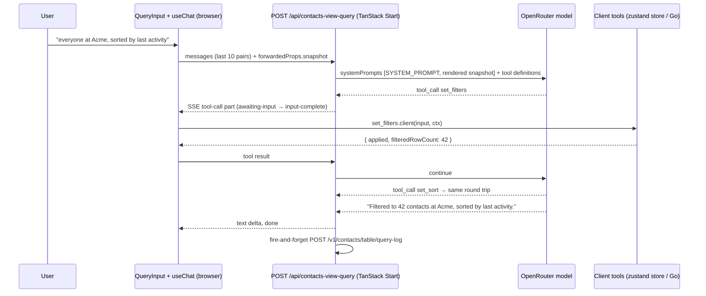

<Info>
Companion to [Contacts Table View](/guides/open-work/contacts-table-view). Decisions 4, 5, 6 and 11 on that page govern this harness: the model may drive view state, create fields, bulk-set values and hand rows to collections or outreach; the loop runs in the TanStack Start server; conversation state is in memory per view session; every many-row or cross-feature write needs an explicit Apply. Version numbers below are the ones installed in `orbiter-frontend` on `dev` (2026-09-16): `@tanstack/ai` 0.38.0, `@tanstack/ai-react` 0.16.0, `@tanstack/ai-client` 0.19.0, `@tanstack/ai-openrouter` 0.15.4.
</Info>

## Shape of the harness

The query bar is a tool-calling loop with **no server-side tool execution**. The server route only runs the model; every tool is a client tool that executes in the browser against the table store, or calls Go with the user's own session. Nothing about the conversation is persisted; the Go query log is telemetry.



A write tool (`bulk_set_field_values`, `add_to_collection`, `open_outreach`) has `needsApproval: true`. The stream pauses with the tool-call part in state `approval-requested`; the browser renders the approval card; `addToolApprovalResponse({ id, approved })` resumes the loop, and only an approved call runs the client implementation.

## Files

| File | Purpose |
| --- | --- |
| `src/features/contacts-view/tools/definitions.ts` | `toolDefinition()` list. Imported by the server route (definitions only) and by the client tools. |
| `src/features/contacts-view/tools/client-tools.ts` | `.client()` implementations bound to a typed context. |
| `src/features/contacts-view/lib/snapshot.ts` | `contactsViewSnapshotSchema`, `buildSnapshot()`, `renderSnapshot()`. |
| `src/features/contacts-view/lib/preview.ts` | `previewFor(toolName, input, rows)` for approval cards. Pure. |
| `src/features/contacts-view/prompts/contacts-view-system.md` | The system prompt text (below). Loaded at build time like other `prompts/` files, or inlined as a constant. |
| `src/routes/api/contacts-view-query.ts` | The server route. |
| `src/features/contacts-view/components/query-bar.tsx` | `QueryInput` + `useChat` + response strip + approval card. |
| `src/features/contacts-view/tests/golden-prompts.test.ts` | The golden set below, recorded and live modes. |

## Tool definitions

Copy as written. Every tool has an `inputSchema` and an `outputSchema`; outputs are what the model reads next, so they carry counts and short messages, never row data.

```ts src/features/contacts-view/tools/definitions.ts
import { toolDefinition } from "@tanstack/ai";
import { z } from "zod";

const columnId = z.string().min(1).max(80).describe("A column id from the snapshot");
const uuid = z.string().uuid();

export const filterOp = z.enum([
  "includes", "equals", "in", "not_in",
  "gt", "gte", "lt", "lte", "between",
  "before", "after",
  "is_empty", "not_empty",
]);

export const filterValue = z.union([
  z.string(),
  z.number(),
  z.boolean(),
  z.array(z.string()).max(50),
  z.tuple([z.number(), z.number()]),
  z.tuple([z.string(), z.string()]),
]).optional().describe(
  "Omit for is_empty / not_empty. Strings for includes/equals/before/after (dates as YYYY-MM-DD). " +
  "Arrays for in/not_in (option ids for select columns). Two-element tuples for between.",
);

export const filterSpec = z.object({ columnId, op: filterOp, value: filterValue });

export const target = z.union([
  z.literal("filtered").describe("Every row matching the current filters and search"),
  z.literal("selected").describe("Only rows the user has checked"),
  z.object({ contactIds: z.array(uuid).min(1).max(2000) }),
]);

const applied = z.object({
  applied: z.boolean(),
  filteredRowCount: z.number().int(),
  message: z.string().optional(),
});

export const describeTable = toolDefinition({
  name: "describe_table",
  description: "Re-read the current table snapshot: columns, options, active state, counts, top values.",
  inputSchema: z.object({}),
  outputSchema: z.object({ snapshot: z.string() }),
});

export const setFilters = toolDefinition({
  name: "set_filters",
  description: "Change column filters. mode 'add' keeps existing filters, 'replace' drops them, 'remove' removes filters for the listed column ids, 'clear' removes all.",
  inputSchema: z.object({
    mode: z.enum(["replace", "add", "remove", "clear"]),
    filters: z.array(filterSpec).max(10).default([]),
  }),
  outputSchema: applied,
});

export const setSort = toolDefinition({
  name: "set_sort",
  description: "Replace the sort order. Earlier entries take precedence.",
  inputSchema: z.object({
    sorting: z.array(z.object({ columnId, desc: z.boolean() })).max(3),
  }),
  outputSchema: applied,
});

export const setGrouping = toolDefinition({
  name: "set_grouping",
  description: "Group rows by one or more columns, outermost first. Empty array ungroups.",
  inputSchema: z.object({ columnIds: z.array(columnId).max(2) }),
  outputSchema: applied,
});

export const setColumns = toolDefinition({
  name: "set_columns",
  description: "Show, hide, reorder or pin columns. Only the provided keys change.",
  inputSchema: z.object({
    show: z.array(columnId).optional(),
    hide: z.array(columnId).optional(),
    order: z.array(columnId).optional().describe("Full desired order of visible columns"),
    pinStart: z.array(columnId).optional(),
    pinEnd: z.array(columnId).optional(),
  }),
  outputSchema: applied,
});

export const setSearch = toolDefinition({
  name: "set_search",
  description: "Set the quick-search text applied across name, title, company, location, email and note. Empty string clears.",
  inputSchema: z.object({ query: z.string().max(200) }),
  outputSchema: applied,
});

export const selectRows = toolDefinition({
  name: "select_rows",
  description: "Check rows. 'filtered' selects every visible row, 'all' every row, 'none' clears.",
  inputSchema: z.object({
    scope: z.union([z.enum(["filtered", "all", "none"]), z.object({ contactIds: z.array(uuid).min(1).max(2000) })]),
  }),
  outputSchema: z.object({ selectedCount: z.number().int() }),
});

export const resetView = toolDefinition({
  name: "reset_view",
  description: "Return to the default view: no filters, default sort, default columns.",
  inputSchema: z.object({}),
  outputSchema: applied,
});

export const saveView = toolDefinition({
  name: "save_view",
  description: "Save the current filters, sort, grouping and columns as a named view.",
  inputSchema: z.object({
    name: z.string().min(1).max(60),
    overwrite: z.boolean().default(false).describe("Overwrite an existing view with this name"),
  }),
  outputSchema: z.object({ viewId: z.string(), created: z.boolean() }),
});

export const createField = toolDefinition({
  name: "create_field",
  description: "Create a custom column. For select and multi_select provide the options.",
  inputSchema: z.object({
    label: z.string().min(1).max(60),
    fieldType: z.enum(["text", "number", "date", "checkbox", "select", "multi_select", "url"]),
    options: z.array(z.object({ label: z.string().min(1).max(60), color: z.string().optional() })).max(100).optional(),
  }),
  outputSchema: z.object({
    fieldId: z.string(),
    columnId: z.string(),
    options: z.array(z.object({ id: z.string(), label: z.string() })),
  }),
});

export const bulkSetFieldValues = toolDefinition({
  name: "bulk_set_field_values",
  description: "Set custom-field values on many rows. Requires user approval. Values are keyed by field id; null clears.",
  needsApproval: true,
  inputSchema: z.object({
    target,
    values: z.record(z.string(), z.union([z.string(), z.number(), z.boolean(), z.array(z.string()), z.null()])).refine(
      (v) => Object.keys(v).length > 0 && Object.keys(v).length <= 5,
      "Provide between 1 and 5 fields",
    ),
  }),
  outputSchema: z.object({ updated: z.number().int(), cancelled: z.boolean().default(false) }),
});

export const addToCollection = toolDefinition({
  name: "add_to_collection",
  description: "Add the target rows' people to a collection. Requires user approval. Give collectionId from the snapshot or a newCollectionName.",
  needsApproval: true,
  inputSchema: z.object({
    target,
    collectionId: uuid.optional(),
    newCollectionName: z.string().min(1).max(80).optional(),
  }).refine((v) => !!v.collectionId !== !!v.newCollectionName, "Exactly one of collectionId or newCollectionName"),
  outputSchema: z.object({ added: z.number().int(), collectionId: z.string(), cancelled: z.boolean().default(false) }),
});

export const openOutreach = toolDefinition({
  name: "open_outreach",
  description: "Open the Email Outreach Composer with the target rows' people as recipients. Requires user approval.",
  needsApproval: true,
  inputSchema: z.object({ target }),
  outputSchema: z.object({ recipients: z.number().int(), cancelled: z.boolean().default(false) }),
});

export const CONTACTS_VIEW_TOOL_DEFINITIONS = [
  describeTable, setFilters, setSort, setGrouping, setColumns, setSearch,
  selectRows, resetView, saveView, createField, bulkSetFieldValues,
  addToCollection, openOutreach,
] as const;
```

Validation the client implementation must add on top of the schema, returning a tool **error** (not a thrown exception) so the model can correct itself: unknown column id; op not valid for the column type (for example `before` on a text column); option id not on the definition; `between` tuple out of order; target `selected` with zero selected rows.

## Client implementations

`ctx.context` is the typed context passed through `createChatClientOptions({ context })`. It is built once per mount in `query-bar.tsx`.

```ts src/features/contacts-view/tools/client-tools.ts — three shown, the rest follow the same shape
import { clientTools } from "@tanstack/ai-client";
import * as def from "./definitions";
import type { ContactsViewToolContext } from "./context";
import { validateFilters } from "../lib/filters";
import { resolveTarget } from "../lib/preview";

export const setFiltersClient = def.setFilters.client<ContactsViewToolContext>((input, { context }) => {
  const { store, table, columnsById } = context;
  const problem = validateFilters(input.filters, columnsById);
  if (problem) return { applied: false, filteredRowCount: table.getRowModel().rows.length, message: problem };
  store.getState().pushUndo();
  store.getState().applyFilters(input.mode, input.filters);
  return { applied: true, filteredRowCount: table.getRowModel().rows.length };
});

export const createFieldClient = def.createField.client<ContactsViewToolContext>(async (input, { context }) => {
  const created = await context.mutations.createFieldDef.mutateAsync({
    label: input.label,
    field_type: input.fieldType,
    options: input.options ?? [],
  });
  await context.queryClient.invalidateQueries({ queryKey: ["contact-field-defs"] });
  context.store.getState().showColumn(`cf_${created.id}`);
  return {
    fieldId: created.id,
    columnId: `cf_${created.id}`,
    options: created.options.map((o) => ({ id: o.id, label: o.label })),
  };
});

export const bulkSetFieldValuesClient = def.bulkSetFieldValues.client<ContactsViewToolContext>(async (input, { context }) => {
  // Runs only after addToolApprovalResponse({ approved: true }).
  const ids = resolveTarget(input.target, context.table);
  if (ids.length === 0) return { updated: 0, cancelled: false };
  let updated = 0;
  for (let i = 0; i < ids.length; i += 2000) {
    const res = await context.mutations.bulkSetFieldValues.mutateAsync({
      contact_ids: ids.slice(i, i + 2000),
      values: input.values,
    });
    updated += res.updated;
  }
  context.patchRowsCache(ids, input.values);
  return { updated, cancelled: false };
});

export const contactsViewClientTools = clientTools(
  describeTableClient, setFiltersClient, setSortClient, setGroupingClient, setColumnsClient,
  setSearchClient, selectRowsClient, resetViewClient, saveViewClient, createFieldClient,
  bulkSetFieldValuesClient, addToCollectionClient, openOutreachClient,
);
```

`resolveTarget` maps `"filtered"` to `table.getRowModel().rows` (post filter, sort and search), `"selected"` to `table.getSelectedRowModel().rows`, and an explicit id list to the intersection with rows the user owns. The same function feeds `previewFor`, so the preview and the write always agree.

## Snapshot

The model sees the table through one compact text block rendered from a typed object. It is rebuilt from the store on every send and passed as `forwardedProps.snapshot`; the server validates it with the same zod schema and renders it into the second system prompt.

```ts src/features/contacts-view/lib/snapshot.ts — schema
export const contactsViewSnapshotSchema = z.object({
  today: z.string().regex(/^\d{4}-\d{2}-\d{2}$/),
  rowCount: z.number().int(),
  filteredRowCount: z.number().int(),
  selectedCount: z.number().int(),
  columns: z.array(z.object({
    id: z.string(),
    label: z.string(),
    type: z.enum(["text", "number", "date", "checkbox", "select", "multi_select", "url", "person"]),
    visible: z.boolean(),
    pinned: z.enum(["start", "end"]).optional(),
    custom: z.boolean().default(false),
    options: z.array(z.object({ id: z.string(), label: z.string() })).max(100).optional(),
    top: z.array(z.object({ value: z.string(), count: z.number().int() })).max(20).optional(),
  })).max(60),
  state: z.object({
    sorting: z.array(z.object({ id: z.string(), desc: z.boolean() })),
    columnFilters: z.array(z.object({ id: z.string(), value: z.object({ op: filterOp, value: z.unknown().optional() }) })),
    grouping: z.array(z.string()),
    globalFilter: z.string(),
  }),
  savedViews: z.array(z.object({ id: z.string(), name: z.string() })).max(50),
  collections: z.array(z.object({ id: z.string(), name: z.string() })).max(100),
});
```

`renderSnapshot()` output, which is what the prompt's `{{snapshot}}` becomes:

```text Rendered snapshot — example
today: 2026-09-16
rows: 8410 total · 42 after filters · 0 selected
columns (id · label · type · notes):
  name · Name · text · pinned start
  current_title · Title · text · top: CTO(210) CEO(180) Partner(96) Founder(90) VP Sales(44)
  company_name · Company · text · top: Acme(120) Globex(88) Initech(51) Hooli(33)
  location_formatted · Location · text · top: London, United Kingdom(310) New York, NY(280)
  primary_email · Email · text
  last_activity_at · Last activity · date
  last_activity_kind · Kind · select · options: email "Email", calendar_event "Meeting"
  momentum · Momentum · select · options: cold "Cold", warming "Warming", hot "Hot"
  total_emails · Emails · number
  total_meetings · Meetings · number
  connected_at · Connected · date
  note · Note · text · hidden
  nickname · Nickname · text · hidden
  visibility · Visibility · select · hidden · options: visible "Shared", private "Personal"
  organization_name · Org · text · hidden · top: Orbiter(4100) Diamond Bros(300)
  created_at · Added · date
  cf_0192c8b0-…-1 · Tier · select · custom · options: tier-1 "Tier 1", tier-2 "Tier 2", tier-3 "Tier 3"
  cf_0192c8b0-…-2 · Deal size · number · custom
state:
  sorting: last_activity_at desc
  filters: company_name in [Acme]
  grouping: none
  search: ""
saved views: 0192…-a "Warm investors", 0192…-b "Q4 targets"
collections: 0192…-c "Q4 outreach", 0192…-d "Advisors"
```

Budget rules: `top` values only for `text` and `select` columns with at most 200 distinct values, computed from `getFacetedUniqueValues()` on the **unfiltered** row model, capped at 20 entries; the whole rendered block is capped at 6,000 characters, dropping `top` lists first, then hidden columns' notes.

## Server route

```ts src/routes/api/contacts-view-query.ts
import { chat, chatParamsFromRequest, toServerSentEventsResponse } from "@tanstack/ai";
import { openRouterText } from "@tanstack/ai-openrouter";
import { createFileRoute } from "@tanstack/react-router";
import { z } from "zod";
import { env } from "@/env";
import { CONTACTS_VIEW_TOOL_DEFINITIONS } from "@/features/contacts-view/tools/definitions";
import { contactsViewSnapshotSchema, renderSnapshot } from "@/features/contacts-view/lib/snapshot";
import { CONTACTS_VIEW_SYSTEM_PROMPT } from "@/features/contacts-view/prompts/contacts-view-system";
import {
  createTanstackAiChatErrorLogMiddleware,
  createTanstackAiChatOtelMiddleware,
} from "@/features/tanstack-ai-chat/server/otel.server";
import { newTraceId, requireBearerToken } from "@/features/tanstack-ai-chat/server/request";
import { internalError, normalizeRouteError, unauthenticated } from "@/features/tanstack-ai-chat/server/errors";
import { getGcpAuth } from "@/integrations/auth/server";

const DEFAULT_MODEL_ID = "anthropic/claude-sonnet-4.5";
const MAX_PAIRS = 10;
const MAX_BODY_BYTES = 64 * 1024;

const forwardedPropsSchema = z.object({ snapshot: contactsViewSnapshotSchema }).strict();

export const Route = createFileRoute("/api/contacts-view-query")({
  server: { handlers: { POST: async ({ request }) => handle(request) } },
});

async function handle(request: Request) {
  const traceId = newTraceId();
  const startedAt = Date.now();
  try {
    const contentLength = Number(request.headers.get("content-length") ?? 0);
    if (contentLength > MAX_BODY_BYTES) throw normalizeRouteError(new Error("Body too large"), traceId);

    const { user } = getGcpAuth();
    if (!user?.id) throw unauthenticated("Missing session.");
    const bearer = requireBearerToken(request);            // used only for the query-log write

    const params = await chatParamsFromRequest(request);
    const { snapshot } = forwardedPropsSchema.parse(params.forwardedProps);
    const messages = keepLastPairs(params.messages, MAX_PAIRS);
    const lastUserText = latestUserText(messages);

    if (!env.OPENROUTER_API_KEY) throw internalError("Contacts View model provider is not configured.");
    const modelId = env.CONTACTS_VIEW_QUERY_MODEL ?? env.TANSTACK_AI_CHAT_MODEL ?? DEFAULT_MODEL_ID;

    const stream = chat({
      adapter: openRouterText(modelId),
      messages,
      systemPrompts: [
        CONTACTS_VIEW_SYSTEM_PROMPT,
        `TABLE SNAPSHOT\n${renderSnapshot(snapshot)}`,
      ],
      tools: [...CONTACTS_VIEW_TOOL_DEFINITIONS],        // definitions only: every tool runs in the browser
      // Verify in Phase 0 that the installed adapter accepts OpenRouter provider
      // preferences here; if not, set them through the adapter config instead.
      modelOptions: { provider: { sort: "throughput" } },
      middleware: [
        createTanstackAiChatOtelMiddleware({ traceId, surface: "contacts_view" }),
        createTanstackAiChatErrorLogMiddleware({ traceId }),
      ],
    });

    return toServerSentEventsResponse(stream, {
      headers: { "X-Orbiter-Trace-Id": traceId },
      onFinish: (final) => void logQuery({ bearer, prompt: lastUserText, modelId, final, startedAt }),
    });
  } catch (error) {
    return normalizeRouteError(error, traceId);
  }
}

function keepLastPairs(messages: Array<unknown>, pairs: number) {
  // Walk backwards counting user turns; keep from the (pairs)-th most recent user turn.
  let seen = 0;
  for (let i = messages.length - 1; i >= 0; i--) {
    const m = messages[i] as { role?: string };
    if (m.role === "user" && ++seen === pairs) return messages.slice(i);
  }
  return messages;
}

async function logQuery(input: { bearer: string; prompt: string; modelId: string; final: unknown; startedAt: number }) {
  try {
    await fetch(`${env.VITE_GCP_API_URL.replace(/\/+$/, "")}/v1/contacts/table/query-log`, {
      method: "POST",
      headers: { "Content-Type": "application/json", Authorization: `Bearer ${input.bearer}` },
      body: JSON.stringify({
        prompt: input.prompt.slice(0, 2000),
        model: input.modelId,
        tool_calls: extractToolCalls(input.final),
        applied: true,
        latency_ms: Date.now() - input.startedAt,
      }),
    });
  } catch {
    // telemetry only
  }
}
```

Rate limit: 20 turns per user per minute, enforced in the route with the same in-memory limiter the chat BFF uses (or a header check if none exists; note it in the Phase 5 gate). The `latestUserText`, `extractToolCalls` helpers mirror those in `tanstack-ai-chat.ts`. `toServerSentEventsResponse` options must be checked against the installed signature; if it exposes no `onFinish`, wrap the stream with a middleware that records the final message instead.

<Note>
The installed `openRouterText(model, config?)` reads `OPENROUTER_API_KEY` from the environment, the same as the chat BFF. `createOpenRouterText(model, apiKey, config?)` exists when the key must be passed explicitly. The adapter's `modelOptions` type is `ProviderPreferences` from `text-provider-options.d.ts`, which is the OpenRouter `provider` object; confirm `sort: "throughput"` passes through untouched.
</Note>

## System prompt

Save as `src/features/contacts-view/prompts/contacts-view-system.md` and load it into `CONTACTS_VIEW_SYSTEM_PROMPT`. The `{{snapshot}}` placeholder is not part of this file: the rendered snapshot is passed as the second entry of `systemPrompts`, so it can be cached separately from the static prompt.

```text contacts-view-system.md
You operate a table of one user's contacts. You have tools that change how the
table is displayed, create custom columns, set values on rows, and hand rows to
other features. You never answer questions about the contacts from your own
knowledge; everything you know about them is in the TABLE SNAPSHOT system
message that follows this one. The snapshot is refreshed on every turn.

## What you can and cannot do
- You CAN filter, sort, group, search, show/hide/reorder/pin columns, select
  rows, reset, save the current view, create custom columns, set custom-field
  values on rows, add people to a collection, and open the outreach composer.
- You CANNOT edit a person's name, title, company or any core column, delete
  contacts, send email, or look anything up outside the table. If asked, say
  so in one sentence and suggest Akira for the rest.

## How to act
1. Act with tools, then reply in one sentence. Do not describe what you are
   about to do.
2. Only use column ids that appear in the snapshot. Match the user's words to
   labels case-insensitively ("company" -> company_name, "added" -> created_at,
   "last touched" -> last_activity_at). If nothing matches and the user clearly
   wants a new attribute ("tag them as VIP"), call create_field first, then
   continue. If nothing matches and intent is unclear, ask ONE short question
   and call no tools.
3. Filters:
   - "also", "and", "plus", "who are also" -> mode "add".
   - "only", "just", "instead", "switch to" -> mode "replace".
   - "clear", "reset", "everyone", "all contacts" -> mode "clear" (or
     reset_view if sort and columns should reset too).
   - When unsure between add and replace, use add.
   - "at / from / in <company or place>" -> op "in" with the matching value(s)
     from the column's top list when available, else "includes".
   - "before / after / since / in the last N days / this year" -> "before" or
     "after" with a YYYY-MM-DD date computed from today in the snapshot.
   - "no / without / missing / empty" -> "is_empty". "has / with" -> "not_empty".
   - "more than / over / above" -> "gt"; "less than / under / below" -> "lt";
     "between X and Y" -> "between".
   - For select and multi_select columns pass option ids, never labels. If
     the label has no option, say so and offer to add it; do not guess.
   - "personal / private / not shared / just mine" -> visibility in
     ["private"]. "shared / org contacts / what the team sees" -> visibility
     in ["visible"]. "my <Org> contacts / added under <Org>" ->
     organization_name in ["<Org>"] using the top list. "all my contacts"
     removes the visibility and organization_name filters.
4. Sorting: "newest / most recent / latest" means desc on a date column.
   "A to Z" means asc on a text column. Keep at most three sort keys.
5. Columns: "show / add the X column" -> set_columns show; "hide" -> hide;
   "put X first / next to Y" -> order; "freeze / pin" -> pinStart.
6. Writes that touch rows (bulk_set_field_values, add_to_collection,
   open_outreach) require the user's approval in the UI. Call the tool ONCE
   with the exact target ("filtered" when the user means the rows currently
   shown, "selected" when they mean checked rows) and the exact change. Never
   say the write happened until the tool returns a result. If the result has
   cancelled: true, reply "Cancelled, nothing changed." and stop.
7. After a change, reply with one sentence stating what changed and the
   resulting count, for example: "Filtered to 42 contacts at Acme, sorted by
   last activity." or "Set Tier to Tier 1 on 42 contacts." No lists, no
   markdown, no follow-up questions unless one is required to proceed.
8. Never call more than five tools in one turn. Never combine reset_view with
   set_filters in the same turn. Never call describe_table unless a tool
   result told you the snapshot is stale.
9. Undo requests ("undo", "go back", "never mind") are handled by the UI; reply
   "Use Undo above the bar." and call no tools.

## Examples
User: everyone at Acme
-> set_filters { mode: "replace", filters: [{ columnId: "company_name", op: "in", value: ["Acme"] }] }
-> "Filtered to 120 contacts at Acme."

User: also the ones I haven't talked to since June
-> set_filters { mode: "add", filters: [{ columnId: "last_activity_at", op: "before", value: "2026-06-01" }] }
-> "Added: last activity before 2026-06-01. 37 contacts."

User: sort by most recent and show their email
-> set_sort { sorting: [{ columnId: "last_activity_at", desc: true }] }
-> set_columns { show: ["primary_email"] }
-> "Sorted by last activity, newest first, with Email shown. 37 contacts."

User: add a Tier column with options 1, 2 and 3
-> create_field { label: "Tier", fieldType: "select", options: [{ label: "1" }, { label: "2" }, { label: "3" }] }
-> "Added a Tier column with options 1, 2 and 3."

User: make all of these tier 1
-> bulk_set_field_values { target: "filtered", values: { "<Tier field id>": "<option id for 1>" } }
-> (after approval) "Set Tier to 1 on 37 contacts."

User: who should I email this week?
-> "This bar only changes the table; ask Akira for recommendations. I can
   filter to contacts you haven't touched recently if that helps."

User: group by company and save this as Acme follow-ups
-> set_grouping { columnIds: ["company_name"] }
-> save_view { name: "Acme follow-ups" }
-> "Grouped by Company and saved as Acme follow-ups."
```

## Client wiring

```tsx src/features/contacts-view/components/query-bar.tsx — essentials
import { createChatClientOptions, fetchServerSentEvents, useChat } from "@tanstack/ai-react";
import QueryInput from "@/components/global/query-input";
import { contactsViewClientTools } from "../tools/client-tools";
import { buildSnapshot } from "../lib/snapshot";
import { previewFor } from "../lib/preview";

export function QueryBar({ table, store, queryClient, mutations, navigate }: QueryBarProps) {
  const context = useMemo(
    () => ({ table, store, queryClient, mutations, navigate, columnsById: indexColumns(table), patchRowsCache }),
    [table, store, queryClient, mutations, navigate],
  );

  // Rebuilt on every render so each send carries the current table state.
  // Phase 0 must verify the hook forwards the latest forwardedProps per send;
  // if it snapshots at mount, move the snapshot into sendMessage's body.
  const snapshot = buildSnapshot(table, store.getState(), defs, views, collections);

  const chatOptions = createChatClientOptions({
    connection: fetchServerSentEvents("/api/contacts-view-query", { headers: authHeaders }),
    tools: contactsViewClientTools,
    context,
    forwardedProps: { snapshot },
  });

  const { messages, sendMessage, isLoading, addToolApprovalResponse } = useChat(chatOptions);

  const pendingApproval = findPendingApproval(messages);   // last tool-call part with state "approval-requested"

  return (
    <div className="sticky bottom-0 mt-auto pt-4">
      <ResponseStrip messages={messages} onUndo={() => store.getState().undo()} />
      {pendingApproval && (
        <ApprovalCard
          preview={previewFor(pendingApproval.name, JSON.parse(pendingApproval.arguments), table)}
          onApply={() => addToolApprovalResponse({ id: pendingApproval.approval.id, approved: true })}
          onCancel={() => addToolApprovalResponse({ id: pendingApproval.approval.id, approved: false })}
        />
      )}
      <QueryInput
        hideFilters
        floatOverlay
        placeholder="Filter, sort, group, or add a column…"
        isLoading={isLoading}
        loadingHint={isLoading ? <LoadingVerb /> : undefined}
        onSubmit={(text) => void sendMessage(text)}
      />
    </div>
  );
}
```

- `findPendingApproval` scans the last assistant message's parts for `type === "tool-call"` with `state === "approval-requested"`; the part carries `approval.id`, `name` and `arguments` (a JSON string). This is the 0.38 API; later releases expose the same thing as `interrupts` with `resolveInterrupt`, and the switch is mechanical.
- The approval card always renders from `previewFor`, never from model text: affected row count, up to five names, the exact field and value (with option labels), or the collection name, or the recipient count.
- `ResponseStrip` shows the final assistant sentence and one chip per completed tool call with `applied: true`; a chip's × calls the store's targeted undo for that change.
- Bearer for the route: the same header the chat BFF requires (`requireBearerToken`), supplied by the existing auth helpers.
- Unmount clears the transcript; there is no thread id.

## Golden prompts

Fixture for `tests/golden-prompts.test.ts`. Each case starts from the snapshot above unless a "given" column says otherwise. "Expected calls" lists tool names with the arguments that matter; the assertion is on tool name, `mode`/`op`/column ids and target, not on exact wording. In recorded mode the model stream is replayed from `tests/fixtures/golden/*.sse`; in live mode (`GOLDEN_LIVE=1`) the real route is hit and the recordings are refreshed.

| # | Prompt | Expected calls | Reply must mention |
| --- | --- | --- | --- |
| 1 | everyone at Acme | `set_filters` replace, company_name in [Acme] | count |
| 2 | also in London | `set_filters` add, location_formatted in [London, United Kingdom] | count |
| 3 | only the ones I haven't talked to since June | `set_filters` replace, last_activity_at before 2026-06-01 | count |
| 4 | people with no email | `set_filters` add, primary_email is_empty | count |
| 5 | more than 10 emails | `set_filters` add, total_emails gt 10 | count |
| 6 | sort by most recent | `set_sort` last_activity_at desc | "last activity" |
| 7 | A to Z by company | `set_sort` company_name asc | "company" |
| 8 | show email and note, hide nickname | `set_columns` show [primary_email, note], hide [nickname] | columns |
| 9 | freeze the company column | `set_columns` pinStart includes company_name | "pinned" or "frozen" |
| 10 | group by momentum | `set_grouping` [momentum] | "grouped" |
| 11 | ungroup | `set_grouping` [] | "ungrouped" |
| 12 | search for lovelace | `set_search` "lovelace" | count |
| 13 | clear everything | `reset_view` | "reset" or "all contacts" |
| 14 | add a Tier column with options 1, 2, 3 | `create_field` select, three options | "Tier" |
| 15 | tag these as tier 1 (given: Tier exists) | `bulk_set_field_values` target filtered, values Tier → option id of "1", approval pending | nothing until approval |
| 16 | after Cancel on 15 | no further calls | "Cancelled" |
| 17 | select all of them | `select_rows` filtered | selected count |
| 18 | add these to Q4 outreach | `add_to_collection` target filtered, collectionId of "Q4 outreach", approval pending | nothing until approval |
| 19 | email them | `open_outreach` target filtered, approval pending | nothing until approval |
| 20 | who should I email this week? | none | "Akira" |
| 21 | save this as Acme follow-ups | `save_view` name "Acme follow-ups" | "saved" |
| 22 | hot contacts (given: momentum options cold/warming/hot) | `set_filters` add, momentum in [hot] (option id, not label) | count |
| 23 | mark them as VIP (given: no VIP column) | `create_field` checkbox "VIP", then `bulk_set_field_values` target filtered, approval pending | nothing until approval |
| 24 | undo | none | "Undo" |
| 25 | only my personal contacts | `set_filters` replace, visibility in [private] | count |
| 26 | shared contacts I added under Orbiter | `set_filters` replace, visibility in [visible] and organization_name in [Orbiter] | count |
| 27 | all my contacts again | `set_filters` remove [visibility, organization_name] | count |

Pass criteria for the Phase 5 gate: cases 1–14, 17, 20–22 and 24–27 pass in recorded mode and at least 90 percent pass in three consecutive live runs. Cases 15, 16, 18, 19 and 23 belong to the Phase 6 gate.

## Model, cost and rails

- **Model:** `CONTACTS_VIEW_QUERY_MODEL`, defaulting to the chat BFF default `anthropic/claude-sonnet-4.5` through OpenRouter with provider sort `throughput`. Candidates for the Phase 5 bake-off, scored on the golden set at three runs each: `z-ai/glm-5.3-flash` (the house default for prose after the August bake-off), `google/gemini-2.5-flash`, and the default. Tool-call accuracy decides; cost is the tie-break.
- **Per-turn budget:** about 2,500 input tokens (prompt 900, snapshot up to 1,500, history) and under 200 output tokens. Target under 2.5 seconds to the first tool call.
- **Rails:** at most five tool calls per turn (enforce with the agent-loop strategy in `@tanstack/ai`, not only in the prompt); zod validation on every input; unknown column ids return a tool error the model can read; no free-text SQL or Go query params derived from model output; writes only through the three approval-gated tools; bodies over 64 KiB rejected; 20 turns per user per minute.
- **Telemetry:** the otel middleware tags `surface=contacts_view`; the query log records prompt, model, tool calls, approval outcome and latency.
