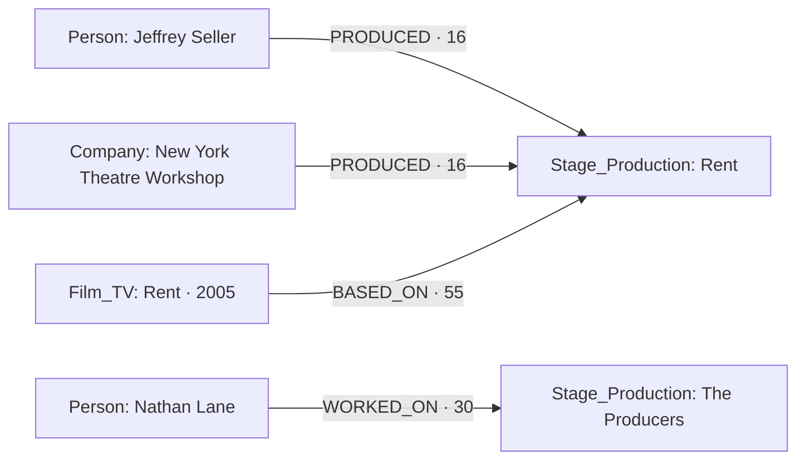

This is the stage waterfall reference for developers maintaining the Person, Company, Movie and Music waterfalls. It follows the same Universe pipeline: **resolve → enrich → normalize → distill → graph → publish**.

Implementation reference: [orbiter-universe PR #89](https://github.com/Orbiterio/orbiter-universe/pull/89), commit [`a2b8674`](https://github.com/Orbiterio/orbiter-universe/tree/a2b8674779c38f1542037b125c5e5d73d1b1bb08). The behavior below describes that code; deployment and feature enablement are environment-specific.

## Entry points and scheduling priority

Stage intake converges on a canonical `stage_production`. Discovery can start with a person, a cast recording or a typed production reference. The gate records the source job and lineage before queueing the production.

| Entry point | Implemented behavior | Priority |
| --- | --- | --- |
| **Full Person waterfall** | The `stage_discovery` step reads resolved theatre expertise or a held `playbill_party` / `theatricalia_party` key. It seeds one durable person discovery root. A model's `theatre_industry` flag alone does not qualify. | Person root: `p0`, depth 0. Discovered productions: `p1`, depth 1. |
| **Music cast-recording discovery** | Music inspects release groups, including catalogue results before ranking. Eligible Broadway / West End cast recordings become durable observations. Stage first looks for an existing production; otherwise it locates, fetches and verifies a source page before admission. | Observations and admitted productions: `p1`, with Music seed/root/parent lineage. The `music_root` accounting row is parked at `p2`. |
| **Operator production seed** | `POST /v1/admin/enrichment/stage/productions` admits a source-specific engagement ID through the normal gate. The `enrichment.stage_requested` event reaches the same gate. | Caller selects `p0`, `p1` or `p2`; default `p1`. |
| **Structured submission** | `POST /v1/admin/enrichment/stage/submissions` accepts a reviewed, versioned credit list with a `stage_registry` production key. It is ledgered and extracted through the same pipeline as a web source. | Bounded production admission through the stage gate. |
| **Production refresh** | The admission request accepts `refresh_mode: "if_due"` or `"force"`. An unchanged fresh production returns `fresh_existing`; an already queued production returns `already_pending`. | Uses the requested intake class. |
| **Film / stage adaptation discovery** | The adaptation pass reads Wikidata derivation statements, resolves the counterpart through the owning film or stage gate, then files a `based_on` claim on the derivative. | Bounded adaptation pass, independently enabled. |
| **Review and replay** | A mention review resumes resolution/facts work. Node readiness and worker passes retry pending credits and publication from their ledgers. | Resumes the existing obligation; does not create a new enrichment root. |

**Intake classes map to queue behavior:** `p0` → tier 0; `p1` → tier 1; `p2` → historical inventory, with no production queue entry. Repeated discovery of a pending production is a no-op, so it does not repeatedly promote the row. Stage drains its own `stage_production` partition of `enrichment_queue`.

The Person trigger runs only on the full depth-0 path. IMDb/Music reduced person runs and cascade people do not start a paid theatre root. Music has its own cast-recording handoff. Credited companies resolve through the Company identity/gate conventions; this PR does not add a Company-orchestrator theatre-discovery step or automatic season, Tony/Olivier, or shingle sweeps.

### Admission and lineage

The gate validates the source, object kind, market, enabled sources, depth, root allowance and population cap. It resolves the source identifier through `entitiespub`, reuses the canonical entity where possible, and records the admission in `stage_source_job`. A work or party reference cannot be used as a production reference.

Children retain `root_job_id`, `parent_job_id`, `seed_entity_id`, `seed_entity_type` and `depth`. Defaults are **50 productions per root** and **maximum depth 2**. The drain re-reads the canonical entity type before dispatch; a mislabeled queue row cannot fall through to IMDb or Company enrichment. Conditional queue deletion preserves a request that arrives while an older run is finishing.

For a concrete gate request, this predicts admission of the existing Rent engagement without fetching or writing:

```http
POST /v1/admin/enrichment/stage/productions
Content-Type: application/json
Authorization: Bearer <staff-token>
```

```json
{
  "source": "playbill",
  "object_kind": "production",
  "source_id": "rent-nederlander-theatre-vault-0000002708",
  "source_url": "https://playbill.com/production/rent-nederlander-theatre-vault-0000002708",
  "display_name": "Rent",
  "market": "broadway",
  "scheduling_class": "p0",
  "refresh_mode": "if_due",
  "dry_run": true
}
```

The response's `action` is one of `queued`, `parked`, `already_pending`, `fresh_existing`, `awaiting_dependency` or `refused`; `reason` explains a hold or refusal. See the [gate](https://github.com/Orbiterio/orbiter-universe/blob/a2b8674/internal/features/enrichment/stage/gate.go) and [admission HTTP contract](https://github.com/Orbiterio/orbiter-universe/blob/a2b8674/api/enrichment.openapi.yaml).

## How it fits the existing Go waterfalls

Stage is a sibling pipeline under `internal/features/enrichment/stage`, wired into the existing API and worker. It uses the same feature ownership and public seams as Person, Company, Film/TV and Music.

| Existing convention | Stage implementation |
| --- | --- |
| Identifier-first get/add and canonical merge handling | `stage.Gate` uses `entitiespub`; source IDs are aliases, and names only nominate candidates. |
| Shared queue, depth/cap checks and seed lineage | `stage_drain.go` owns the typed partition and both normal/manual stage dispatch. |
| Run and step receipts | The extraction run uses provider `base_stage_enrich`, `enrichment_attempts`, `enrichment_stages`, shared `failure` classification and a 60-second debounce. |
| Raw provider envelope before normalization | Source fetches and derived claims land in `enrichment_payloads`; stage snapshots, groups and mentions preserve the extraction evidence. |
| Facts own truth; typed tables cache chosen values | `stage_production_profile` is rebuilt by distill. Enrichment submits profile and relationship claims rather than directly authoring that cache. |
| Relationship election before graph edges | `stage_produced`, `stage_worked_on` and `based_on` facts must be chosen before their corresponding edge replay. |
| Pending-credit replay waits for graph endpoints | `stage_credit`, `stage_person_credits` and `stage_adaptations` keep work pending until its prerequisites exist. |
| Universe's publish feature is the consumer boundary | `stage_production_projection.v1` is returned through the existing projection endpoint. |
| Shared image re-hosting | The worker uses the existing converter/uploader and media tick for production posters. |

```mermaid
flowchart TD
  person[Full Person run] --> discovery[Person-page discovery]
  music[Music cast recording] --> observation[Music observation and verified lookup]
  seed[Production seed or submission] --> gate[Stage gate]
  discovery --> gate
  observation --> gate
  gate --> queue[Shared queue: stage_production]
  queue --> extraction[Load input → snapshot → extract → closeout]
  extraction --> resolution[Resolve credit mentions]
  resolution --> claims[Land profile and relation claims]
  claims --> facts[Normalize → distill → chosen facts]
  facts --> graph[Node sync and elected edge replay]
  graph --> publish[Stage production projection]
```

The extraction orchestrator has four required steps: `load_input`, `snapshot`, `extract`, `closeout`. Resolution, facts, graph and publish are separate durable obligations in `stage_work_checkpoint`. Extraction success therefore does not mean every identity is resolved or every edge is ready.

The shared queue tick drives bounded stage drain, resolution, fact publication, graph reconciliation, person discovery and publish passes behind their respective switches. Dedicated events and staff endpoints use the same service methods. No new service or separate workflow engine is introduced.

## Source adapters and identity

| Input | What the code reads | What it supplies |
| --- | --- | --- |
| **Playbill** | Production page and production-team list through Firecrawl; person pages for discovery and personal credits. | Engagement identity, dates, synopsis, cover image, literal producing groups and person roles. A page without a team list can have partial credit coverage. |
| **Theatricalia** | Production and person pages through its client and adapter. | Production IDs, venue/date context, producing credits and person roles. Engagement checks distinguish West End from other UK productions. |
| **`pilot_submission`** | Reviewed JSON with stable submission/record/revision identity, production registry key, credit blocks and completeness. | Structured evidence through the same extraction and resolution path. A repeated revision is idempotent; conflicting content under that revision is rejected. |
| **Parallel** | Bounded corroboration searches for unresolved identities and source-page discovery. | Candidates and supporting evidence; search output alone is not a producing credit. |
| **Wikidata** | Stage-work matching and P144/P4969 derivation statements in both directions. | Adaptation evidence connecting supported film and stage endpoints. |

Production identifiers include `playbill_production`, `theatricalia_production` and `stage_registry`. Party identifiers include `playbill_party`, `theatricalia_party` and `theatricalia_company`. Identifier registration and adapter availability are separate: an identifier/source constant does not imply a fetcher is wired for it.

A `stage_production` is **one credited engagement**. Broadway and West End runs, revivals and transfers keep distinct production identities. The same title is insufficient to merge them. Cross-source discovery verifies engagement context before attaching an alias.

Producing evidence is stored as **block → billed group → member mention**. Literal text, headings, ordering, source-party references and extraction spans survive normalization. Ambiguous compound billing remains reviewable; a group identifier is not copied onto each person as a unique identity.

Resolution first reuses approved aliases and strong references, then checks local candidates, then uses the enabled corroboration search. The default auto-link threshold is `0.85`; name-only evidence is capped at `0.59`. Ambiguity stays in review. New Person/Company creation is separately gated and goes through the owning gates, rather than creating a node from a bare billed name.

Producing claims come from the production roster. A person's own page supports the separate `WORKED_ON` path. A credited company keeps its company credit; the waterfall does not copy that credit to its officers or infer an investment, amount or ownership share.

## Nodes and images

The new graph family is **`Entity:Stage_Production`**. The other endpoint families retain their existing ownership:

| Node family | Stage's use | Identity / write ownership |
| --- | --- | --- |
| `Entity:Stage_Production` | The production hub: title, market, dates, synopsis, poster and coverage. | Canonical SQL type `stage_production`; graph `entity_type: "Stage_Production"`. Node sync merges on `entity_id`, with `uuid` equal to that canonical ID. |
| `Entity:Person` | Resolved producers and people with selected personal stage credits. | Existing Person gate, facts and node sync. |
| `Entity:Company` | A directly credited producing company. Existing modifiers such as `Organization` remain intact. | Existing Company gate, facts and node sync. |
| `Entity:Film_TV` | A source or derivative in a verified adaptation relationship. | Existing film identity/gate and node writer. |

The writer uses `form` as a property; it does not add `Play` or `Musical` labels. Underlying theatrical-work, venue and award nodes are not emitted by this implementation. Venue and award evidence can remain in source/credit records without creating those graph families. Source jobs, snapshots, groups and mentions are SQL records, not graph nodes.

### Real production images

These images are the `poster_url` values read from the local development graph. The examples throughout this page are selected development records observed on **September 8, 2026**; their IDs and coverage values are examples, not production-environment totals.

<Columns cols={2}>
  <div>
    
    <p><strong>The Producers</strong><br />Broadway · opened 2001-04-19<br />Stored coverage: complete</p>
  </div>
  <div>
    
    <p><strong>Bonnie &amp; Clyde</strong><br />West End · opened 2022-04-19<br />Stored coverage: partial</p>
  </div>
</Columns>

Artwork is displayed as stored; engagement identity comes from the production identifiers and dates.

Source records: [The Producers](https://playbill.com/production/the-producers-st-james-theatre-vault-0000004170), [Bonnie & Clyde](https://playbill.com/production/bonnie-clyde-london-arts-theatre-2022). A production can have a title, dates and artwork while its producer roster is incomplete. The Bonnie & Clyde example has `accepted_credit_count: 0` and `credit_coverage: "partial"`.

### Production node example

The `1984` production in graph notation, including its description, embedding metadata and audit timestamps. The embedding is abbreviated: eight of the 1,536 values are shown.

```text
(:Entity:Stage_Production {
  entity_id: "01a081f5-e797-736b-b4d3-2e37ad9f4cbf",
  uuid: "01a081f5-e797-736b-b4d3-2e37ad9f4cbf",
  entity_type: "Stage_Production",
  source: "playbill",
  visibility: true,
  title: "1984",
  name: "1984",
  form: "play",
  production_kind: "original",
  market: "broadway",
  first_preview_date: "2017-05-18",
  opening_date: "2017-06-22",
  closing_date: "2017-10-08",
  accepted_credit_count: 12,
  credit_coverage: "complete",
  source_names: ["playbill"],
  source_urls: ["https://playbill.com/production/1984-hudson-theatre-2017-2018"],
  poster_url: "https://storage.googleapis.com/orbiter-sandbox/avatars/playbill/01a081f5-e797-736b-b4d3-2e37ad9f4cbf/8aa22fead8ed.webp",
  description: "Winston Smith works for the Ministry of Truth, rewriting newspaper articles so that history always supports the views of the Party. But when Winston has a thought, writes a diary and falls in love, he does so under the ever watchful eye of Big Brother.",
  embeddings: vecf32([0.038027, -0.002140, 0.030437, -0.008395, -0.007783, -0.012633, -0.025938, 0.024869, … 1528 more]),
  embedding_model: "google/gemini-embedding-2",
  embedding_dimensions: 1536,
  created_at: 1788887028298,
  updated_at: 1788893208329
})
```

`source` is stamped when the node is created; `source_names` reflects the distilled source set. `name` mirrors `title` for shared search/projection readers. Available profile fields also include `production_kind`, `season_label`, run status, official website, preview/press-night/announced-closing/booking dates and description. Dates are ISO days; a booking horizon is distinct from a closing date. The graph sync optionally embeds the title, market, opening date and description with the shared embedder.

### Reused endpoint examples

These are selected identity properties from the same development graph, showing all three reused endpoint families:

```json
[
  {
    "labels": ["Entity", "Person"],
    "entity_id": "01a07e83-f95e-7bb4-8652-7c2227f075b7",
    "uuid": "01a07e83-f95e-7bb4-8652-7c2227f075b7",
    "entity_type": "Person",
    "name": "Jeffrey Seller"
  },
  {
    "labels": ["Entity", "Company", "Organization"],
    "entity_id": "01a07e84-1fbb-75d4-b5e2-5ff7257fdd5f",
    "uuid": "01a07e84-1fbb-75d4-b5e2-5ff7257fdd5f",
    "entity_type": "Organization",
    "name": "New York Theatre Workshop"
  },
  {
    "labels": ["Entity", "Film_TV"],
    "entity_id": "01a0811d-2538-7451-bbe0-4f7b663824e2",
    "uuid": "01a0811d-2538-7451-bbe0-4f7b663824e2",
    "entity_type": "Film_TV",
    "title": "Rent",
    "imdb_id": "tt0294870",
    "source": "imdb.com"
  }
]
```

### Poster storage and delivery

Distill owns `poster_source_url`. The re-host worker preserves the portrait aspect ratio, converts to WebP and writes under `<GCS_AVATAR_PREFIX>/<source>/<production-id>/<hash>.webp`; the default prefix is `avatars`, with `playbill` as the source directory for Playbill covers. It stamps `poster_url`, `poster_storage_key` and re-host bookkeeping, then requests node sync.

Both the node and the consumer package prefer the re-hosted `poster_url` and fall back to `poster_source_url`. This drain runs on the shared media tick with `MEDIA_REHOST_*` limits. It requires the worker's GCS uploader and image converter; the staff posters route does no work when those dependencies are absent. See [poster re-hosting](https://github.com/Orbiterio/orbiter-universe/blob/a2b8674/internal/features/enrichment/stage_poster_gcs.go).

## Edges created

The complete stage-owned edge inventory in this PR is **`PRODUCED`, `WORKED_ON`, and `BASED_ON`**. The diagrams show stored edge direction. Multiple producers connect through a shared production; no `CO_PRODUCED_WITH` edge is materialized.



### PRODUCED — person or company to production

One edge per producer/production pair. An accepted mention supplies the identity and literal billing; fact election authorizes the relationship. Replay requires both graph endpoints. The graph writer's endpoint allowlist is `Person` or `Company` → `Stage_Production`.

| Billing tier | Weight |
| --- | --- |
| `lead_producer` | 12 |
| `producer` | 16 |
| `co_producer` | 22 |
| `associate_producer` / `executive_producer` | 28 |
| `in_association` | 35 |

Generic “Produced by” remains `producer`. Billing weights describe the credit tier, not an investment amount. Multiple accepted mentions for the same pair reconcile into one current credit with retained supporting evidence.

Actual person-credit example, with selected edge properties:

```json
{
  "from": "01a07e83-f95e-7bb4-8652-7c2227f075b7",
  "type": "PRODUCED",
  "to": "01a07e83-6194-7a9a-9532-35623670a0f6",
  "properties": {
    "uuid": "01a07e85-263d-7b85-bdcc-f1862d63d423",
    "role": "producer",
    "weight": 16,
    "active": true,
    "stage_credit_version": 1,
    "source": "stage",
    "source_name": "pilot_submission",
    "source_role": "Produced by",
    "market": "broadway",
    "description": "Jeffrey Seller produced Rent.",
    "description_generated_at": 1788829050430
  }
}
```

The company path uses the same writer. In the development data, New York Theatre Workshop (`01a07e84-1fbb-75d4-b5e2-5ff7257fdd5f`) has a `PRODUCED` edge to the same Rent node: edge UUID `01a07e85-2639-72e2-8a06-76e577f5e966`, `role: "producer"`, `weight: 16`, `source_name: "pilot_submission"`, `active: true`, version `1`, and description “New York Theatre Workshop produced Rent.”

`stage_credit_version` fences updates to role, weight, active state and supplied credit metadata. Retraction writes `active: false` at a newer version and keeps the edge. The detailed mention/election/evidence chain lives in SQL; the current `PRODUCED` graph writer does not copy every ledger field onto the edge.

### WORKED_ON — person's own stage credit

Person-page discovery files roles in `stage_person_credits`, coalesces overlapping source rows and ranks the person's combined credit set. Selection uses award wins/nominations, original versus replacement billing, a named character and opening-date recency. Gala/ceremony appearances and rows with neither character nor billing are excluded from notable selection. The default cap is **12 personal credits**.

Selected rows file `stage_person_credit` payloads and `stage_worked_on` facts on the Person. Replay draws an edge only after election and endpoint readiness. The key is **person + production + role + character**; two parts in one show can produce two edges. The weight uses the existing `WORKED_ON` value, **30**.

Actual example: Nathan Lane → The Producers.

```json
{
  "from": "01a08046-4fa7-725d-bf32-1f4d61ca8afe",
  "type": "WORKED_ON",
  "to": "01a0804c-5839-787b-a3ff-3aeb829cd926",
  "properties": {
    "uuid": "01a0808f-e98c-73b1-b23e-66858df966e5",
    "role": "performer",
    "character_name": "Max Bialystock",
    "billing": "original",
    "weight": 30,
    "source": "stage",
    "source_name": "playbill",
    "award_wins": 3,
    "award_nominations": 0,
    "description": "Nathan Lane played Max Bialystock in The Producers, winning the 2001 Drama Desk Award for Outstanding Actor in a Musical.",
    "description_generated_at": 1788863310222
  }
}
```

Award counts and the sentence are edge metadata; this path does not create award nodes. Unlike `PRODUCED`, this writer has no `stage_credit_version` or `active` property. A later ranking demotion stops a new claim/edge from being selected but retains an edge that was already drawn.

### BASED_ON — derivative to source

Wikidata P144 (“based on”) and P4969 (“derivative work”) establish direction; the graph always points **derivative → source**. The pass handles stage/film and film/film derivations through the `Stage_Production` and `Film_TV` endpoint families. A stage-work item is matched to a compatible production using title, market and first-performance context; it does not create a separate theatrical-work node.

The adaptation ledger files a `based_on` relation on the derivative. A model can locate a registry counterpart or describe an evidenced relationship; a located page must be fetched, ledgered and verified before admission. The model cannot replace Wikidata evidence or fact election.

Actual example: the 2005 Rent film → the Broadway Rent production. Description and timestamps are omitted here to emphasize the identity and evidence fields.

```json
{
  "from": "01a0811d-2538-7451-bbe0-4f7b663824e2",
  "type": "BASED_ON",
  "to": "01a07e83-6194-7a9a-9532-35623670a0f6",
  "properties": {
    "uuid": "01a0811d-d91c-7c19-bfb7-fd6c3aab813c",
    "weight": 55,
    "source": "stage",
    "source_names": ["wikidata"],
    "layer": "evidence",
    "excluded_from_scoring": true,
    "active": true,
    "derivation_type": "adaptation",
    "fidelity": "faithful",
    "source_property": "wikidata:P144",
    "source_qid": "Q1049095",
    "target_qid": "Q553890",
    "source_year": 1996,
    "derivative_year": 2005,
    "chosen_fact_id": "01a0818b-c6fa-703a-97c5-3d4d0608ecfd",
    "provenance_ref": "01a0811d-255c-7a50-8995-c662a362ffba",
    "source_urls": [
      "https://www.wikidata.org/wiki/Q1049095#P144",
      "https://www.wikidata.org/wiki/Q553890#P4969"
    ]
  }
}
```

The graph's `source_qid` names the **edge's starting/derivative item**; `target_qid` names the original work item. This differs from `source_year`, which is the original work's year. Derivation types include `adaptation`, `remake`, `sequel`, `retelling` and `translation`. The writer stamps `layer: "evidence"` and `excluded_from_scoring: true`; readers should preserve that distinction. It has no `stage_credit_version` fence.

All three writers add edge UUID and audit timestamps and can store a description with `description_generated_at`. Their exact property sets and update rules differ; the [graph writers](https://github.com/Orbiterio/orbiter-universe/blob/a2b8674/internal/platform/graph/stage.go) are the reference for those differences.

## Facts, persistence and recovery

| Owned records | Purpose |
| --- | --- |
| `stage_source_job`, `stage_source_record` | Intake, root/parent lineage, typed source aliases, discovery state and leases. |
| `stage_production` | Production lifecycle and active input/extraction revisions. |
| `stage_source_snapshot` | Immutable source observations, normalized text and extraction provenance. |
| `stage_credit_group`, `stage_credit_mention`, `stage_credit_resolution_attempts` | Literal billing, member candidates, accepted identities, review state and attempt history. |
| `stage_credit`, `stage_credit_evidence` | One desired direct credit per pair, supporting claims, desired/applied versions and graph reconciliation. |
| `stage_work_checkpoint` | Durable `resolve`, `facts`, `graph`, `publish` obligations and lease/generation state. |
| `stage_production_profile` | Facts-owned cache of the chosen production fields, plus poster re-host bookkeeping owned by the image drain. |
| `stage_person_credits` | Personal roles, characters, awards, opening dates, ranks and edge receipts. |
| `stage_adaptations`, `adaptation_checks` | Derivation evidence, counterpart IDs, claims, edge receipts and bounded discovery/re-description state. |

The shared `enrichment_payloads`, `entity_facts`, attempts, stages, identifiers and queue remain the common infrastructure. Payload providers distinguish `stage_production_profile`, `stage_credit`, `stage_person_credit` and `wikidata:based_on`; their relation fields are `stage_produced`, `stage_worked_on` and `based_on`.

Extraction commits its groups/mentions, revision advance and resolve obligation together. Downstream workers claim work with leases and generation checks, and acknowledge the version they actually applied. A new input revision survives an older worker's completion. Missing chosen facts or graph endpoints leave a replay obligation pending.

Direct-credit reconciliation folds the latest extracted roster for each source into the desired producer/production pairs. A pair supported by an accepted mention on any selected roster stays active; a previously active pair absent from the desired set is withdrawn. Source completeness is reported separately, so it should not be read as a guarantee about retention of every historical credit. Entity merges repoint stage references, retain canonical identity and request reconciliation. Recovery releases expired leases and rebuilds pending work from durable state.

Two implementation limits matter when operating this code: root admission uses a count-before-admit allowance rather than an atomic last-slot reservation; paid-work ceilings read completed payload-ledger spend, so simultaneous in-flight calls are not reserved against the daily total. These are operational semantics, not guarantees of strict concurrent quotas.

## Consumer package

`GET /v1/entities/{id}/projection` uses the existing consumer API-key flow and requires `projections:pull`. A stage entity returns **`stage_production_projection.v1`** once its profile is distilled and `STAGE_PUBLISH_ENABLED` is open; otherwise it returns 404. IDs resolve through the canonical merge chain; the package uses `universe_production_uuid` and `universe_node_uuid`.

| Package field | Contents |
| --- | --- |
| `schema_version`, `run_id`, source/generated timestamps | Versioning and idempotent application, using the existing projection conventions. |
| `production` | Title, market, form, production kind, dates, run status, website, poster, description, sources, visibility and tombstone. |
| `credits` | Producing roster with producer UUID/type/name, billing tier, source role, description, confidence, active/version state, graph status and evidence. |
| `coverage` | Source coverage/finality, input and extraction revisions, accepted/review/unresolved/rejected mention counts, graph readiness and pending-credit count. |
| `derivative_works` | Films or productions based on this production, with canonical IDs, derivation metadata, Wikidata references and graph status. |
| `based_on` | The source works this production derives from, using the same adaptation evidence model. |

`credits` is the producing roster; it is not an array of all `WORKED_ON` edges. Graph statuses are `written`, `pending` or `retracted` for direct credits, and `written` or `pending` for adaptations. Source completeness, identity resolution and graph readiness remain separate fields. The publish obligation settles when the profile and required direct-credit graph state are ready.

Consumers use the [published contract](https://github.com/Orbiterio/orbiter-universe/blob/a2b8674/api/publish.openapi.yaml) and [package builder](https://github.com/Orbiterio/orbiter-universe/blob/a2b8674/internal/features/publish/stage_production_projection.go), following the same boundary as Person and Company. There is no direct dependency on App display tables.

## Staff controls and configuration

All paths below are under **`/v1/admin/enrichment/stage`** and require staff authentication. They provide bounded controls over the same services the worker uses.

| Method / suffix | Operation |
| --- | --- |
| `POST /productions`, `POST /submissions` | Admit a typed production or reviewed credit submission. |
| `GET /productions/{id}` | Inspect source, extraction, mention, credit and checkpoint state. |
| `POST /drain` | Run one named queue row or a bounded stage batch. |
| `POST /discovery`, `POST /music` | Process person discovery roots or Music observations. |
| `GET /mentions`, `POST /mentions/{id}/review` | Inspect and review unresolved identities. |
| `POST /resolve`, `POST /facts`, `POST /graph` | Run the corresponding durable phase/replay. |
| `POST /credits`, `POST /adaptations` | Replay personal credits or run the adaptation pass. |
| `POST /publish`, `POST /posters` | Settle publication readiness or re-host available covers. |

The event family includes `enrichment.stage_requested`, `stage_queue_drain_requested`, `stage_recovery_requested`, `stage_resolution_requested`, `stage_facts_requested`, `stage_graph_requested`, `stage_discovery_requested`, `stage_publish_requested`, `stage_adaptations_requested` and `stage_music_requested` (each with the `enrichment.` prefix). Image re-hosting also rides `media.rehost_requested`; personal-credit replay rides the shared credit-edge tick.

| Configuration | Default / effect |
| --- | --- |
| `STAGE_ENABLED` | `false`; wires the stage gate, runner and supporting services when enabled. |
| `STAGE_MARKETS`, `STAGE_SOURCES` | Empty allowlists. Markets are `broadway`, `west_end`; enable the sources whose adapters/inputs are configured. |
| `STAGE_DRAIN_ENABLED`, `STAGE_DISCOVERY_ENABLED` | `false`; automatic production draining and person discovery. |
| `STAGE_RESOLUTION_ENABLED` | `false`; resolver wiring and automatic resolution/facts/graph phase work. |
| `STAGE_EDGE_WRITES_ENABLED`, `STAGE_PUBLISH_ENABLED` | `false`; edge writes, and stage-package availability plus automatic publish-obligation settlement. |
| `STAGE_MUSIC_DISCOVERY_ENABLED`, `STAGE_ADAPTATION_ENABLED` | `false`; the additional discovery paths. |
| `STAGE_LLM_ENABLED`, `STAGE_NEW_ENTITIES_ENABLED` | `false`; optional model work and new Person/Company admission. |
| `STAGE_TICK_MAX_PRODUCTIONS` | `10`; bounded pass size. |
| `STAGE_MAX_PRODUCTIONS_PER_ROOT`, `STAGE_MAX_DEPTH` | `50` productions and depth `2`. |
| `STAGE_MAX_PERSON_CREDITS` | `12`; selected personal credits. |
| `STAGE_MAX_UNRESOLVED_GROUPS_PER_TICK` | `10`. |
| `STAGE_MAX_SEARCH_QUERIES_PER_MENTION`, `STAGE_MAX_CANDIDATES_PER_MENTION` | `2` queries, `5` candidates. |
| `STAGE_AUTO_LINK_THRESHOLD`, `STAGE_NAME_ONLY_CAP` | `0.85` and `0.59`. |
| `STAGE_MAX_CALLS_PER_RUN`, `STAGE_MAX_CALLS_PER_DAY`, `STAGE_MAX_COST_USD_PER_DAY` | All `0`; paid-work eligibility requires positive ceilings. |
| `STAGE_NO_MATCH_TTL` | `720h` (30 days). |

Worker-event switches and staff controls are distinct: some staff phase endpoints intentionally invoke a pass regardless of its automatic tick switch, while dependency and edge-write gates still apply. `STAGE_PUBLISH_ENABLED` gates stage-package availability and automatic obligation settlement; the consumer still needs its normal scope. It does not establish a separate pilot dataset. Configure the API and worker from their respective sections of [`.env.example`](https://github.com/Orbiterio/orbiter-universe/blob/a2b8674/.env.example); inspect [composition-root wiring](https://github.com/Orbiterio/orbiter-universe/blob/a2b8674/internal/features/enrichment/module.go) before treating a parsed setting as an active control.

## Code map for maintenance

All links below are pinned to the PR's implementation revision.

| Area | Main files |
| --- | --- |
| Admission and extraction | [stage/gate.go](https://github.com/Orbiterio/orbiter-universe/blob/a2b8674/internal/features/enrichment/stage/gate.go), [stage/orchestrator.go](https://github.com/Orbiterio/orbiter-universe/blob/a2b8674/internal/features/enrichment/stage/orchestrator.go), [stage/extract.go](https://github.com/Orbiterio/orbiter-universe/blob/a2b8674/internal/features/enrichment/stage/extract.go) |
| Queue and worker dispatch | [stage_drain.go](https://github.com/Orbiterio/orbiter-universe/blob/a2b8674/internal/features/enrichment/stage_drain.go), [stage_worker.go](https://github.com/Orbiterio/orbiter-universe/blob/a2b8674/internal/features/enrichment/stage_worker.go), [queue_drain.go](https://github.com/Orbiterio/orbiter-universe/blob/a2b8674/internal/features/enrichment/queue_drain.go) |
| Person and Music handoffs | [person/steps_stage_discovery.go](https://github.com/Orbiterio/orbiter-universe/blob/a2b8674/internal/features/enrichment/person/steps_stage_discovery.go), [stage_discovery.go](https://github.com/Orbiterio/orbiter-universe/blob/a2b8674/internal/features/enrichment/stage_discovery.go), [music/steps_stage_discovery.go](https://github.com/Orbiterio/orbiter-universe/blob/a2b8674/internal/features/enrichment/music/steps_stage_discovery.go), [stage_music_discovery.go](https://github.com/Orbiterio/orbiter-universe/blob/a2b8674/internal/features/enrichment/stage_music_discovery.go) |
| Adapters and fixtures | [stage/playbill](https://github.com/Orbiterio/orbiter-universe/tree/a2b8674/internal/features/enrichment/stage/playbill), [stage/theatricalia](https://github.com/Orbiterio/orbiter-universe/tree/a2b8674/internal/features/enrichment/stage/theatricalia), [submission fixture](https://github.com/Orbiterio/orbiter-universe/blob/a2b8674/internal/features/enrichment/stage/testdata/submissions/example-musical.json) |
| Resolution and review | [stage/resolve.go](https://github.com/Orbiterio/orbiter-universe/blob/a2b8674/internal/features/enrichment/stage/resolve.go), [stage/search.go](https://github.com/Orbiterio/orbiter-universe/blob/a2b8674/internal/features/enrichment/stage/search.go), [stage_resolve.go](https://github.com/Orbiterio/orbiter-universe/blob/a2b8674/internal/features/enrichment/stage_resolve.go) |
| Facts and projection | [mapping_stage.go](https://github.com/Orbiterio/orbiter-universe/blob/a2b8674/internal/features/facts/mapping_stage.go), [distill_stage_production.go](https://github.com/Orbiterio/orbiter-universe/blob/a2b8674/internal/features/facts/distill_stage_production.go), [stage_production_projection.go](https://github.com/Orbiterio/orbiter-universe/blob/a2b8674/internal/features/publish/stage_production_projection.go) |
| Node sync and direct-credit replay | [graph/stage_sync.go](https://github.com/Orbiterio/orbiter-universe/blob/a2b8674/internal/features/graph/stage_sync.go), [stage_graph.go](https://github.com/Orbiterio/orbiter-universe/blob/a2b8674/internal/features/enrichment/stage_graph.go), [platform/graph/stage.go](https://github.com/Orbiterio/orbiter-universe/blob/a2b8674/internal/platform/graph/stage.go) |
| Personal credits and adaptations | [stage_person_credits.go](https://github.com/Orbiterio/orbiter-universe/blob/a2b8674/internal/features/enrichment/stage_person_credits.go), [stage_adaptation.go](https://github.com/Orbiterio/orbiter-universe/blob/a2b8674/internal/features/enrichment/stage_adaptation.go), [stage_adaptation_films.go](https://github.com/Orbiterio/orbiter-universe/blob/a2b8674/internal/features/enrichment/stage_adaptation_films.go) |
| Storage, leases and merges | [queries/stage.sql](https://github.com/Orbiterio/orbiter-universe/blob/a2b8674/internal/features/enrichment/queries/stage.sql), [stage_lease_repo.go](https://github.com/Orbiterio/orbiter-universe/blob/a2b8674/internal/features/enrichment/stage_lease_repo.go), [stage_merge.go](https://github.com/Orbiterio/orbiter-universe/blob/a2b8674/internal/features/enrichment/stage_merge.go) |

The package-local tests cover adapters, extraction, gates, identity, replay, projection, Music discovery and recovery. [stage_qa_regressions_test.go](https://github.com/Orbiterio/orbiter-universe/blob/a2b8674/internal/features/enrichment/stage_qa_regressions_test.go) contains the cross-cutting regression cases; database tests require their configured test database. Use those fixtures when changing source parsing, credit ranking or revision behavior.
