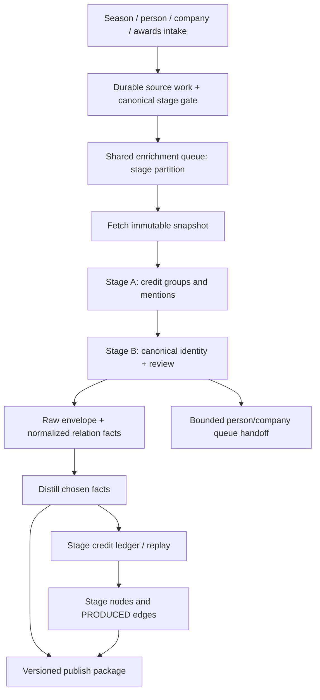

import BakeOffRules from '/snippets/bake-off-rules.mdx';

**Status — 2026-09-06: revised development plan; the stage waterfall is not built.** Add Broadway and West End producing credits as another waterfall in **`orbiter-universe`**. This revision is grounded in the actual movie and music implementations through commit `a377c44`, the 990 build record in Basic Memory, and the current source page for the worked example. It supersedes the 2026-08-21 implementation brief while preserving the two-market scope, production-hub model and agreed weight bands. **Mark’s September 6 correction supersedes the old label decision: theatre needs its own entity types.** The proposals and source-based property contracts are now documented in [Graphs → Node Types](/guides/ontology/nodes#theatre-nodes). This pass edits documentation only; no runtime schema or application changes have been made.

<Note>
  **Go on GCP only, including fixtures, evaluation commands and smoke tests. No Xano.** This page specifies future work; this review implements no service, migration, worker, provider call path or deployment. New names below are proposed contracts unless explicitly marked existing.
</Note>

## Outcome and scope

Capture **who is publicly credited with producing a specific stage production**, the exact billing, and the evidence behind the identity match. Resolve people and companies onto the same canonical Universe entities used by the movie, music and company waterfalls. Materialize accepted credits; derive co-producing paths through their shared production.

A production credit is **not proof of a personal investment, amount invested, ownership share, recoupment or a personal relationship between every pair of producers**. Billing is a role and traversal-cost signal. Investment claims require their own evidence and owning pipeline. Company officers, show-company principals and a credited company's producers are distinct assertions.

| Included in v1 | Separately gated or deferred |
| --- | --- |
| Broadway and West End productions; all explicit producing tiers; direct person and company credits | Off-Broadway, regional productions and national tours |
| Production intake, source snapshots, extraction, resolution, facts, graph replay and correction | Casting, creative crew, employment inferred from a credit, cap tables, grosses and recoupment |
| Person/expertise/movie crossover discovery; company/shingle discovery; season and awards intake | Recursive expansion without budgets; bulk profile enrichment for every name |
| Company identity and independently evidenced principal affiliations | Automatic person-level copies of a company's `PRODUCED` credits |
| Universe consumer contract for stage titles and credits | App UI implementation; direct writes into Orbiter Backend display tables |

**Deliver the direct-credit backbone first.** UK coverage is part of v1 but can be enabled independently after its fixtures pass. Filings, company-principal research and awards improve evidence; their absence must not prevent a well-sourced direct credit from being recorded.

## What the code changes about the old plan

| Verified implementation / finding | Broadway consequence |
| --- | --- |
| `entitiespub` exposes `FindByStrong`, `Candidates`, `Canonical` and `CreateWithIdentifiers`. Universe owns `entities` and `entity_identifiers`. | No `master_person` / `master_company` lookup or legacy function dependency. Soft names nominate candidates; identifiers and evidence resolve them. |
| `filmtv/gate.go` validates an IMDb **title** before creation; its normal dedup is permanent. | Add a stage-specific gate. Never pass IBDB IDs to the IMDb gate. Stage sources need explicit revision and refresh behavior. |
| Film/TV and music write run/step receipts before work. Music refuses a successful freshness stamp after a degraded run. | Reuse receipts and lineage; distinguish extraction success, resolution coverage, fact election and graph readiness. |
| `queue_drain.go` routes `film_tv` to IMDb and currently falls through other unhandled types to the company runner. Its normal picker admits only tiers 0–1; deletion checks the enqueue count. | Add an explicit `stage_production` type and dispatch branch before enqueueing. Unknown types must fail closed. A P2 backfill is not automatically drainable. |
| `dispatch_variant` is currently a person-run restriction; queue upsert can clear it when requests disagree. | Route by the new canonical `stage_production` entity type, not a person variant or a Film/TV discriminator. |
| `film_tv_credit_replay.go` and `music_credit_replay.go` defer edges until chosen facts and both graph endpoints exist. | Add a stage credit ledger and replay. Stage B does not draw graph edges. |
| `facts/repo.go:planFactDeletes` replaces relationship claims only for the targets in a payload; scalar replacement is broader. | Incremental credits need not erase the producer's other shows. An omitted target does **not** retract an old relation; implement explicit retraction. |
| Film/TV graph creation/sync stamps IMDb provenance. Music `PRODUCED` targets `Recording` at weight 18. | Add `Stage_Production` node sync and a dedicated stage edge writer; preserve the two existing pipelines. |
| `publish.Service.Projection` currently handles person/company packages. | Add a stage-production package; its contract is not an existing Film/TV package to turn on. |
| The 990 adapter uses durable mentions, bounded resolution, chosen-fact IDs and a separate edge gate. | Reuse the pattern and public seams. Do not import its repo or assume its planned Form D reader exists. |
| The current IBDB example includes compound credit links and a notice that credits are not finalized. | Source party IDs can identify groups; completeness and source version must be recorded. Old simulated counts are not goldens. |

### Source manifest for the developer

Review baseline: local `/Users/markpederson/dev_work/orbiter-universe`, clean at inspection, commit **`a377c44`**. These are code references, not claims that a particular environment has deployed the code.

| Read in this order | Contract to reuse or extend |
| --- | --- |
| [`CLAUDE.md`](https://github.com/Orbiterio/orbiter-universe/blob/a377c44/CLAUDE.md) | Modular monolith, feature ownership, public seams, identifier-first identity, facts → distill → graph → publish |
| [`enrichment/filmtv/gate.go`](https://github.com/Orbiterio/orbiter-universe/blob/a377c44/internal/features/enrichment/filmtv/gate.go), [`filmtv/orchestrator.go`](https://github.com/Orbiterio/orbiter-universe/blob/a377c44/internal/features/enrichment/filmtv/orchestrator.go) | Gate, lineage, receipt lifecycle and credit handoff |
| [`enrichment/music/orchestrator.go`](https://github.com/Orbiterio/orbiter-universe/blob/a377c44/internal/features/enrichment/music/orchestrator.go), [`music/identity.go`](https://github.com/Orbiterio/orbiter-universe/blob/a377c44/internal/features/enrichment/music/identity.go), [`music/pacer.go`](https://github.com/Orbiterio/orbiter-universe/blob/a377c44/internal/features/enrichment/music/pacer.go) | Fail-closed completion, source aliases/redirects, shared rate reservations |
| [`enrichment/queries/pipeline.sql`](https://github.com/Orbiterio/orbiter-universe/blob/a377c44/internal/features/enrichment/queries/pipeline.sql), [`queue_drain.go`](https://github.com/Orbiterio/orbiter-universe/blob/a377c44/internal/features/enrichment/queue_drain.go) | Actual queue selection, upsert/promotion, locks and conditional deletion |
| [`enrichment/film_tv_credit_replay.go`](https://github.com/Orbiterio/orbiter-universe/blob/a377c44/internal/features/enrichment/film_tv_credit_replay.go), [`music_credit_replay.go`](https://github.com/Orbiterio/orbiter-universe/blob/a377c44/internal/features/enrichment/music_credit_replay.go) | Pending credits, chosen-fact gates and endpoint readiness |
| [`facts/repo.go`](https://github.com/Orbiterio/orbiter-universe/blob/a377c44/internal/features/facts/repo.go), [`facts/factspub/factspub.go`](https://github.com/Orbiterio/orbiter-universe/blob/a377c44/internal/features/facts/factspub/factspub.go) | Replacement scope and `ElectedRelationFacts` |
| [`graph/film_tv_sync.go`](https://github.com/Orbiterio/orbiter-universe/blob/a377c44/internal/features/graph/film_tv_sync.go), [`platform/graph/film_tv.go`](https://github.com/Orbiterio/orbiter-universe/blob/a377c44/internal/platform/graph/film_tv.go), [`platform/graph/music_edges.go`](https://github.com/Orbiterio/orbiter-universe/blob/a377c44/internal/platform/graph/music_edges.go) | Source-aware stage sync, canonical node key, separate endpoint/weight policy |
| [`enrichment/fanoutlimit/enrichment_fanout_limit.go`](https://github.com/Orbiterio/orbiter-universe/blob/a377c44/internal/features/enrichment/fanoutlimit/enrichment_fanout_limit.go), [`enrichment/cap.go`](https://github.com/Orbiterio/orbiter-universe/blob/a377c44/internal/features/enrichment/cap.go) | Admission before creation, seed/depth accounting and population caps |
| [`entities/merge_inventory.go`](https://github.com/Orbiterio/orbiter-universe/blob/a377c44/internal/features/entities/merge_inventory.go), [`publish/service.go`](https://github.com/Orbiterio/orbiter-universe/blob/a377c44/internal/features/publish/service.go) | Merge-safe references and the actual consumer package boundary |
| [`filings/irs990_resolve.go`](https://github.com/Orbiterio/orbiter-universe/blob/a377c44/internal/features/filings/irs990_resolve.go), [`filings/irs990_edges.go`](https://github.com/Orbiterio/orbiter-universe/blob/a377c44/internal/features/filings/irs990_edges.go) | Recent working mention/resolution/election pattern; verify comments against current facts code |

Basic Memory used: [ORBIT-1862 build record and September 6 follow-up](https://app.basicmemory.com/notes?id=cloud%7Cff28d60c-fe10-40cb-8b13-5ce1fd2406b7%7C2fe7811d-03e2-4b25-870e-57976803f110%7C5aed36ef-2ddd-41a8-a76f-9d4c80ecfd85&explorer=project%3Acloud%7Cff28d60c-fe10-40cb-8b13-5ce1fd2406b7%7C2fe7811d-03e2-4b25-870e-57976803f110). Its later correction on relationship replacement takes precedence over its earlier whole-source description; current code is the final check.

Companion docs: [Go migration architecture](/guides/open-work/orbiter-univers-standalone/enrichment-gcp-migration), [Movie rebuild contract](/guides/enrichment/waterfall/imdb-go-rebuild-spec), [Music rebuild contract](/guides/enrichment/waterfall/music-go-rebuild-spec), [Projection Pattern](/guides/open-work/orbiter-univers-standalone/projection-pattern), [Universe Lookup Tables](/guides/open-work/orbiter-univers-standalone/universe-lookup-tables), [stage ontology](/guides/ontology/edges#produced-stage), [Edge Weights](/guides/ontology/edge-weights), [Donors](/guides/open-work/roadmap/donors). Older design sketches explain intent; do not copy obsolete table names or queue mechanics over current code.

## Decisions and invariants

| Decision | Development contract |
| --- | --- |
| One production hub | Proposed Universe `entity_type = stage_production`, graph `Entity:Stage_Production` with controlled `Play`/`Musical` subtypes. Each credited engagement is its own hub. It is not a Film/TV title. |
| One canonical object per production | Source IDs are aliases; graph identity is canonical `entity_id`. A revival, Broadway transfer and West End original are separate productions. |
| One direct credit edge per producer/production | Preserve multiple supporting mentions and billing roles in SQL; select deterministic current edge metadata. No edge per source, role or retry. |
| Existing weights | Lead 12; producer 16; co-producer 22; associate/executive 28; in-association 35. Lower is stronger. Do not change the music weight of 18. |
| Credit meaning | Preserve literal source role and map it by versioned rules. `Produced by` alone maps to `producer`, not `lead_producer`; first position alone does not prove lead status. |
| Group credits | Retain a group plus independently resolvable members; `group_credit` describes joint billing only. A conjunction does not prove marriage. Separately proven family relationships belong to their own evidence and owner. |
| Shingle bridge | Materialize the company's actual credit. Use evidenced, time-relevant affiliations to traverse to principals; no automatic synthetic personal credit. |
| One fact-authorized write path | Snapshot → mentions → accepted identity → payload/facts → distill → credit ledger → graph replay → publish. |
| No name-only entity creation | Unresolved names remain mentions. Admit any new person/company only through the owning identifier gate, population cap and fanout budget. |
| Reproducibility | Pin source snapshot, parser, mapping, prompt/model and policy revisions. A retry of one revision uses stored artifacts. An intentional refresh creates a new revision. |
| Corrections are first-class | Preserve historical evidence; explicitly supersede/retract current claims and reconcile graph and consumer state. |
| No unbounded cascade | Credit completion never waits for enrichment of every producer. Discovery and paid work have independent limits. |

**Ontology alignment:** [Node Types](/guides/ontology/nodes#theatre-nodes), [Edge Types](/guides/ontology/edges#theatre-edges) and [Edge Weights](/guides/ontology/edge-weights#theatre-weights) now document the same proposed theatre contract. `Stage_Production` replaces the old film/TV target; direct-credit weights stay unchanged. Runtime/API registration and reader enforcement remain implementation work. Do not reintroduce the old inherited credit dates, confidence string, spouse inference or principal-copy behavior.

## Proposed theatre node types

**Proposal requested by Mark, 2026-09-06.** Use [Graphs → Node Types → Master Label List](/guides/ontology/nodes#master-label-list) as the conceptual vocabulary: `Entity` for canonical objects, `Work` for underlying creative works, `Place` for locations, and existing `Person`/`Company` identities. Theatre gets a dedicated production family. A production is neither a screen title nor one dated performance event.

The schema page describes the older graph estate; current Go differs in two relevant places: music works use `Music_Work` to protect ownership/wipe boundaries, and music `Place` nodes are support rows without a canonical `entities` row or `Entity` label. The plan must reconcile those differences explicitly, not assume the master's labels imply an existing Go type.

| Proposed node | What one node means | Go / relational identity | Release scope |
| --- | --- | --- | --- |
| **`Entity:Stage_Production`**, optional `:Play` / `:Musical` | One source-defined, credited production/engagement: e.g. a particular Broadway run, its revival, or its West End original | **New canonical `entity_type = stage_production`**; `entities` + identifiers + stage profile/control records | Required for the direct-credit v1 |
| **`Entity:Work:Theatrical_Work`**, optional `:Play` / `:Musical` | The underlying dramatic work shared by distinct productions; not its cast recording, film adaptation or original novel | **New canonical `entity_type = theatrical_work`**; facts-owned `theatrical_work` cache; reviewed source work identifiers | Optional v1 linking when identity is established; absence never blocks a production |
| **`Place:Venue:Theatre`** | The physical theatre/venue, independent of its owner, operator, brand and productions | Reuse/extend the current **support-place** pattern and source aliases; stable place row/node UUID, not a new company | Venue-context slice; preserve an existing music place rather than minting a rival |
| **`Stage_Award`**, optional `:Winner` / `:Nominee` | One named award result for a specific production or explicitly named recipient, category and award year | Proposed **support record**, like film award rows; no automatic enrichment queue/entity type | Later award slice; metadata/discovery can ship earlier |

These are new graph/domain types, but **only `stage_production` and `theatrical_work` require new canonical Go entity types** in this recommendation. Venues/award results follow the existing support-row architecture. If venues later need their own canonical entity lifecycle, `Entity:Place:Venue:Theatre` is a separate shared-place migration, preserving every existing node UUID and cross-source alias; it is not an incidental stage-waterfall change.

### Production versus work versus performance

- **Production:** the scope of one producing credit block. Broadway and West End versions, revivals and distinct source engagements get different production IDs. A venue rename or corrected date does not mint a new production. A source-defined venue move can add a dated venue association to the same production; a newly defined engagement stays separate.
- **Theatrical work:** the play/musical as a creative object. Connect independently identified productions of the same work without combining their producers. A musical based on a novel is not the novel; a stage adaptation and a movie with the same title are not the same work.
- **Individual performance:** a dated showing within a production. Defer these nodes because the co-producer waterfall does not need thousands of performance instances. If attendance/ticketing later requires them, propose `Entity:Event:Theatre_Performance`, linked to its production and venue, following the master's `Event` family.
- **Venue:** the building or distinct performance space. Its owner/operator is a `Company`; a producing organization of the same name is still a different object. Addresses and names nominate place matches; verified source identity and compatible physical-location evidence establish one.
- **Person/company:** keep the canonical `Person` and `Company` across theatre, movies and music. Store producing role, shingle classification and legal vehicle type as evidence-backed attributes/relationships; no parallel `Theatre_Person` or `Theatre_Company` identity silo.

For theatrical works, do not merge into an existing `music_work` by title or reuse a score/recording MBID as a whole-show identifier. A verified equivalence or adaptation requires an explicit typed relation and reviewed ownership policy. Production/work subtype labels come from a closed whitelist, never arbitrary provider strings. Shared words such as `Play` and `Musical` are modifiers; routing, indexes and wipe predicates always include the owning family/type.

### Proposed structural relationships

| Relationship | Meaning / gate | Scoring policy |
| --- | --- | --- |
| `Person/Company → PRODUCED → Stage_Production` | Accepted direct producing credit | Existing agreed 12/16/22/28/35 bands; new target replaces the old Film/TV proposal |
| `Stage_Production → PRODUCTION_OF → Theatrical_Work` | Explicitly resolved underlying work | New name; proposed 50, evidence context excluded from scoring |
| `Stage_Production → STAGED_AT → Place:Venue:Theatre` | Sourced venue engagement with dates and provenance | New name; proposed 50, evidence context excluded; not the existing event-only `HELD_AT` writer |
| `Theatrical_Work → ADAPTED_FROM → resolved source work` | Explicit attribution and independently resolved target; later optional work slice | New name; proposed 55, evidence context excluded; unsupported novel/book identity remains SQL evidence |
| `Person/Music_Group → WROTE/COMPOSED/WROTE_LYRICS → Theatrical_Work` | Explicit work-level author/composer/lyricist claims; optional slice | Reuse names with dedicated theatre endpoints; proposed 10/8/12, excluded initially |
| `Stage_Production → HAS_AWARD → Stage_Award` | Exact engagement's production or associated-recipient award context | Proposed 40, excluded initially; distinguish the result scope |
| `Explicit Person/Company → WON_AWARD/NOMINATED_FOR → Stage_Award` | Only explicitly named, independently resolved award recipients | Proposed 30/35, excluded initially; no `WON` alias or award copy to every co-producer |

The first release needs only `PRODUCED`. The other weights are proposals, including reused movie/music precedents. [Edge Types contains full property examples and the shared envelope](/guides/ontology/edges#theatre-edges). Co-producing evidence joins on **the same production ID**. Context writes remain disabled until the owning contracts are ratified and every candidate/path/scoring reader enforces `excluded_from_scoring`; retain SQL evidence meanwhile. A property flag or a high weight without reader enforcement cannot prevent shortcuts through a shared work, venue or award.

### Identity, properties and display contracts

The detailed field types, required/optional rules, primary-source mappings and graph-versus-SQL boundary live in [Node Types → Theatre nodes](/guides/ontology/nodes#theatre-nodes). Treat that section as the proposed property contract for this plan. It distinguishes booking horizons, announced closes and confirmed final performances; preserves capacity disputes and dated venue history; and scopes award entries to explicitly named recipients/productions. Primary source mappings were inspected; adapter contracts remain future work.

- `Stage_Production`: canonical production identity, title/form/market, sourced run dates/status, season, optional work ID, venue evidence, source coverage/finality and standard provenance envelope. Strong aliases identify a production, never just a title.
- `Theatrical_Work`: canonical work identity, title/aliases, form, language, description and independently sourced creator/adaptation evidence. Unknown authors or work dates remain unknown. Source work IDs are typed separately from production, music-work and film IDs; title plus author/year is candidate context, not a silently strong key.
- Theatre venue: stable support identity, name/aliases, source venue IDs, address/location/coordinates when supplied, evidence and dated venue-name history. Existing music place matches are mediated by an owner-provided seam, not direct writes to `music_places`. Until a safe shared-place lookup/alias seam exists, preserve `venue_pending` evidence instead of creating a duplicate graph place. One source's thin venue observation cannot blank another's richer data.
- `Stage_Award`: awarding body, award year, category, outcome, production and/or explicitly named recipient, source record and snapshot. A nomination later upgraded to a win is a revision of the same scoped result; an award ceremony is an `Event`, not this result node.
- Production gets a proposed **`stage_production_display`** card contract. Theatrical works may fit existing `work_product_display`; venues and awards remain context by default. A new graph type does not automatically require another standalone card.

The graphical `Entity` label and a row in `universe.entities` must not be conflated. Canonical production/work nodes merge by proposed canonical `entity_id`; support venue/award nodes by their durable owner row IDs. All source identifiers are aliases. Those uniqueness rules, admission semantics and migration/reconciliation behavior are reviewed together before any writer is implemented.

### Go registration checklist for the new types

Before queue admission, add explicit canonical type constants/validation, source identifier strength and type scoping, schema constraints, typed profile caches, facts mapping/distill switches, node-sync dispatch, graph writer whitelists/indexes, merge inventory and generic repair/purge guards. Add type-aware population caps and fanout policy, queue dispatch/manual-drive handling, event/OpenAPI DTOs, publish package dispatch, search/subgraph/path mapping and consumer contract tests.

The theatrical-work type does not inherit a music or IMDb runner; its initial enrichment uses the approved local source payload and its own facts/sync path. Venues and award support records consume separate bounded support replay, not the person/company/production queue. Migrate shared-place identity only in its owner-reviewed slice. **This pass updates this plan and the theatre proposals in Node Types, Edge Types and Edge Weights. Runtime schema, Go registration, graph writers and API changes remain future implementation work.**

## Go architecture and ownership

Build a sibling of `enrichment/filmtv` and `enrichment/music` under **`internal/features/enrichment/stage`**. Reuse the existing API/worker binaries, pgx/sqlc repositories, Pub/Sub registry, GCS client, telemetry, `stages`, `fanoutlimit`, `httpx` and LLM registry. A new deployment or generic workflow engine is unnecessary.



| Owner / proposed location | Responsibility |
| --- | --- |
| `enrichment/stage/{gate,orchestrator,types,parse,resolve}.go` | Pure extraction, typed contracts, resolution ladder and orchestrator decisions |
| `enrichment/stage_gate.go`, `stage_repo.go`, `queries/stage.sql` | Adapt parent repo and public dependencies into narrow stage interfaces; sqlc owns generated code |
| `enrichment/stage_credit_replay.go`, `stage_reconcile.go` | Durable desired credit state, replay and revision recovery |
| `clients/ibdb`, `clients/playbill`, UK adapters | Fetch and decode sources; retries through `platform/httpx`; no entity or graph writes |
| `facts/mapping_stage.go`, `distill_stage_production.go`, stage view | New canonical type, source/field vocabulary, current claims and typed-cache winners |
| `graph/stage_sync.go`, `platform/graph/stage_edges.go` | Stage-aware node synchronization and the sole stage `PRODUCED` writer |
| `publish/stage_production_projection.go` + `enrichment/stage_production_projection_reads.go` | Stage production/credit package and public read seam; no App table access |
| `internal/app` | Construct dependencies and register HTTP/workers only |

Names are proposed, not files created by this plan. Declare narrow interfaces in their consuming packages and share cross-feature DTOs through `entitiespub`, `factspub`, `graphpub`, `enrichmentpub` and any filings-owned public seam. Never import a sibling feature's private service/repo. Update depguard, sqlc configuration, OpenAPI and merge inventory alongside any new surface.

## Entry points and scheduling priority

Every route requests **productions**, or discovery work that finds productions. Only Stage A creates credit mentions. An imported source-person page is a discovery index, not authority to bypass the production's credit block.

| # | Entry point | Behavior | Scheduling class |
| --- | --- | --- | --- |
| 1 | Expertise-domain trigger | A chosen theatre/performing-arts domain requests a source-person lookup. Freeze qualifying stable taxonomy IDs in fixtures; do not hard-code an old taxonomy count. | P0 |
| 2 | Person enrichment signal | Explicit stage-producing evidence requests the same lookup. Generic `producer` or a music/film role alone is not a confirmed theatre identity. | P0 |
| 3 | Movie crossover sweep | Existing producing-credit holders become bounded candidates. Resolve the source-person identity before accepting its productions. | P0, batch quota |
| 4 | Discover result / admin request | Carry an approved source ref or evidence-backed candidate. Unknown/ambiguous results stay in discovery review. | P0 |
| 5 | Season backfill | Recent/current seasons before older seasons; save inventory and cursor by market/year. | P1 recent, P2 historical intake |
| 6 | Recurring refresh | Weekly inventory/new openings and refresh of open/unfinalized productions; closing/correction checks are explicit refreshes. | P1 |
| 7 | Tony / Olivier sweep | Discover missing productions and store award source/year/category/status. A win does not confer an individual credit on every producer. | P1 |
| 8 | Shingle expansion | Resolve a company first; enumerate its source production references across both markets. Visited-set and seed budget prevent cycles. | P1, bounded |

**P0/P1/P2 are intake classes, not an assertion that all shared-queue tiers drain.** Submit P0/P1 canonical stage work at tiers 0/1. Keep P2 in the historical source inventory until an explicit bounded backfill batch admits it at tier 1; never widen the global picker to run everyone's tier-4 backlog. Promotion from repeated discovery is disabled for stage work. A repeated unchanged intake is an admission no-op, not a paid-work promotion.

A new source-person lookup needs its own typed source-party reference. A grouped IBDB party page must not be attached as a unique identifier to each member. Negative lookup caches are keyed by source, canonical person, identity-evidence revision and query policy; use a proposed 30-day TTL, invalidated by identity changes or explicit refresh.

## Production and source identity

### Canonical production

The proposed `stage_production.entity_id` points to one canonical `universe.entities` row of type **`stage_production`**. Its chosen title, market, dates and optional work reference live in a facts-owned `stage_production_profile` cache. Stage pipeline control/snapshot state remains stage-owned. Do not create or write a `film_tv` row for a theatre production.

Proposed identifier vocabulary, added through the entities feature with normalization and collision tests:

| Key | Scope and admission |
| --- | --- |
| `ibdb_production:537824` | A validated IBDB production reference; never accepted as an IMDb `tt` identifier |
| `ibdb_party:<id>` | One source party record. Attach to a person/company only after its single-entity type is proven. Group IDs remain on the source group. |
| `theatricalia_production:<id>` | UK production alias only after Phase 0 establishes its production granularity and stability |
| `theatricalia_party:<id>` | Same single-entity/type gate as IBDB |
| Playbill / official UK source record | Typed source alias after adapter validation; canonical URL alone must not collapse multiple engagements |
| UK manual registry key | Reviewed opaque stable ID if no suitable source production ID exists; retain source URLs and matching context |

Use structured `(kind, normalized_value)` storage, not an overloaded string parser scattered through the code. Source namespace and object kind prevent an identical numeric person/production ID from colliding. A corrected URL or source redirect becomes an alias to the same production, following the music identity-healing pattern.

**Never use `(title, theatre, opening-year)` as a strong production key.** It nominates candidates only: venues change, dates are corrected, and distinct engagements can share those values. Cross-source aliases require exact compatible production context plus an unambiguous match or review. One title can have several canonical productions. A separately resolved `Theatrical_Work` connects those productions through `PRODUCTION_OF`; that shared work never merges the production identities or their producer rosters.

Do not populate `imdb_id`, classify the stage production as a `Movie`, or send it to an IMDb fetcher. Record source disagreements and refuse a cross-market/source collision rather than auto-merging unrelated engagements.

### People and companies

1. Canonicalize every stored entity reference through `merged_into` at read/dispatch time.
2. Reuse an already approved typed source-party → entity link if it remains undisputed and type-compatible.
3. Use existing strong identifiers for deterministic lookup, but independently validate that a **newly discovered** profile belongs to the credited party before attaching it.
4. Names, company names, aliases, domains, locations and credit overlap nominate candidates. None silently becomes a strong identifier.
5. On a conflicting strong key, use the existing collision/review flow. Do not swallow uniqueness errors or create a second node.
6. Company source records are companies; shareholders, PSCs, officers and managing members are separate people/companies with separately sourced roles.

A bare source ID is only strong within the source's actual record semantics. The reviewed single-person/company predicate is part of admission, not an LLM confidence shortcut.

## Sources and access contracts

| Source | Intended use | Readiness / restrictions |
| --- | --- | --- |
| IBDB | Broadway production identity and explicit ordered producing blocks | Primary candidate; tested on the live worked page during this review. Source notice/finality must be retained. Full coverage and automated-use posture still require Phase 0 validation. |
| Playbill Vault | Independent Broadway cross-check / fallback | Validate current page structure, coverage and production aliasing on the same fixtures; not a guaranteed drop-in substitute. |
| Official London Theatre / SOLT | West End production discovery | Inventory does not imply a complete producer roster. |
| Theatricalia + official production/programme sources | UK credit evidence | Validate IDs, completeness, production granularity and historical depth. Missing credits mean unknown coverage. |
| Tony / Olivier sources | Award metadata and additional discovery | Distinguish production award, named recipient and producing role. |
| SEC Form D | Optional show-entity/related-person corroboration | No assumption that every show has a located filing; related-person status is not a list of investors. Consume a filings-owned contract when available. |
| Companies House | UK company identity, officer/PSC evidence | Preserve company number, role and appointment/resignation dates. An officer record does not itself establish a stage credit. |
| OpenCorporates / official shingle sites / reputable reporting | Optional company/principal corroboration | No mandatory credential or dependency for the direct-credit backbone; evaluate access/licensing before enabling. |

Public readability is not proof of permitted bulk reuse or complete coverage. Phase 0 records source access rules, attribution, caching/retention constraints and the permitted fetch budget. Do not assume sources or vendor enrichment are free.

For deployment, reuse workload identity for AlloyDB/GCS/Pub/Sub and managed secrets for configured providers. `COMPANIES_HOUSE_API_KEY` is required only when that adapter is enabled; search uses the selected provider's key; LLM calls use the existing OpenRouter client/config seam. EDGAR requests belong to its adapter and carry its declared contact User-Agent. Provider keys are not required to run offline fixture tests. [Companies House authentication](https://developer.company-information.service.gov.uk/get-started), [SEC access guidance](https://www.sec.gov/search-filings/edgar-search-assistance/accessing-edgar-data).

### Fetching, caching and completeness

- Use one shared rate reservation **per source host/account across all workers and discovery paths**. Initial scrape ceiling: at most one request/second, or a lower source requirement. Reuse music's reservation/backoff pattern; do not create a process-local limiter and call it global.
- Centralize retry policy in `httpx`. Respect `Retry-After`, timeouts and shared cooldown. A pacer refusal consumes no provider attempt and releases/reschedules work; an unavailable limiter fails closed.
- Persist exact response bytes to GCS before parsing. Record final URL, requested typed ref, fetch time, status, content type, hash, object key, ETag/Last-Modified when supplied, adapter revision and source notices. Commit the snapshot row only after durable storage succeeds.
- Keep immutable **fetch observations** even when bytes deduplicate by hash. Identical HTML at two times is the same content, not the same observation. Parser/model revisions are independent of fetch revision.
- Explicit refresh may refetch/conditionally fetch. Retry/reparse of a committed revision reads its pinned snapshot; never use `LatestPayload(provider)` where endpoint or snapshot matters.
- Classify `complete`, `partial`, `provisional`, `empty_confirmed`, `blocked`, `not_found` and `parse_failed`. A challenge page or layout drift returning HTTP 200 is not an empty roster.
- A provisional page can support an explicit observed credit with a provisional marker, but cannot authorize absence-based removals or claim exhaustive coverage. `empty_confirmed` requires a valid expected page/section and an explicit empty result, not a missing selector.
- Parse coverage and completeness are separate: all visible credit tokens can be parsed while the source says its roster is unfinished.
- Fetch only allowlisted provider hosts/ref forms; validate redirects and bound bytes/decompression. Provider text is data and cannot instruct the model to write records, reveal secrets or bypass gates.

## Stage A — extraction contract

The deterministic parser finds the production's **producing sections**, preserving original role headings, block order, linked party IDs and literal strings. It excludes venue ownership, general management, creative roles, world-premiere credits for a different engagement and unrelated replacement sections. Those can remain in the raw snapshot; they do not become this production's `PRODUCED` credits.

Represent three levels:

1. **Credit block**: source heading, original block text, source location and production/snapshot.
2. **Credit group**: one billed unit/link, possibly containing several people or companies; shared source-party ref belongs here until proven individual.
3. **Mention**: one candidate person/company/member, carrying its exact evidence span, group ID, position and extraction status. Unsplit ambiguity remains a group awaiting review.

Every span is validated against the stored normalized source text with byte offsets; retain the normalized-text hash and original HTML hash. Normalization is deterministic and versioned. Names for display remain literal; normalized search names and inferred expansions are separate fields.

### Compound strings

Use linked structure and deterministic rules first. An LLM handles only unresolved token boundaries or entity typing; it cannot resolve identity, create IDs or assign stronger billing. Company suffixes are hints, not proof. Do not split `A & B Productions` merely at `&`.

For `John and Jane Smith`, `John` is the literal fragment and `John Smith` is a candidate expansion requiring corroboration. Two names in one string do not prove a couple. A slash can be a grouped credit; it does not automatically imply `in_association`. Preserve the enclosing heading's role.

Illustrative **synthetic** extraction contract, not a frozen source fixture:

```json
{
  "schema_version": 1,
  "raw_text": "John and Jane Smith",
  "source_role": "Co-Produced by",
  "billing_tier": "co_producer",
  "billing_order": 7,
  "group_kind": "joint_credit",
  "mentions": [
    {
      "member_order": 1,
      "name_as_billed": "John",
      "candidate_name": "John Smith",
      "name_expansion_inferred": true,
      "entity_type_candidate": "person",
      "evidence_quote": "John",
      "span_start": 0,
      "span_end": 4
    },
    {
      "member_order": 2,
      "name_as_billed": "Jane Smith",
      "candidate_name": "Jane Smith",
      "name_expansion_inferred": false,
      "entity_type_candidate": "person",
      "evidence_quote": "Jane Smith",
      "span_start": 9,
      "span_end": 19
    }
  ],
  "unconsumed_fragments": [],
  "requires_review": true
}
```

**Validation:** strict schema; approved enums; unique positive member ordinals; source spans in range; no invented text/URLs/identifiers; no unexplained dropped name-bearing fragments; no entity merge across groups. Truncated/invalid output is a failed extraction, never an empty success. Retain the rejected raw output. One configured fallback pass is allowed after its own evaluation; then park the group.

Cache an accepted split by `(normalized group text, role/context hash, parser version, prompt/config version)`. Persist accepted output and replay it. Temperature zero is not a guarantee of byte-identical model responses.

**Reconcile counts separately:** blocks, billed groups, member mentions, ambiguous groups, excluded roles and accepted distinct producer entities. Never compare “42 tokens” with “42 people” or require two graph edges before both group members resolve. One accepted member can be projected while its peer remains unresolved; group membership remains auditable.

## Stage B — resolution and review

Run the cheapest eligible step first, once per typed party/evidence revision per run. Cache candidate reads and prior accepted source aliases. A repeated name in different groups/productions is not automatically the same person.

| Step | Evidence / action | Stop condition |
| --- | --- | --- |
| 1. Approved source alias | Existing verified, single-entity party mapping; follow canonical merges | Reuse unless disputed, incompatible type or contradicted |
| 2. Existing canonical candidates | Identifier lookup; exact/normalized name and known stage/movie/music/company context nominate candidates | Accept only one unambiguous corroborated candidate; otherwise retain competing candidates |
| 3. Source/official corroboration | Previously stored biography, official shingle page or production-linked evidence | No circular proof from a credit this resolver just inferred |
| 4. Search | Provider-neutral profile/page search with the mention's actual context | Bound queries/results; retain candidates and evidence, not just the top hit |
| 5. Adjudication | Structured verdict over candidate IDs and cited evidence spans | Programmatic identity gate, independent of model self-confidence |
| 6. Review / unresolved | Preserve evidence, candidates, contradiction and reason | No graph write or name-only creation |

**Automatic new links require all of:** compatible entity type; one candidate; no hard contradiction; confidence at least **0.85**; and at least **two independent corroboration categories** beyond the name. Examples are a directly sourced production association plus a separately established company affiliation. City/country are one geography category; syndicated copies of one article are one source; two model-generated statements are zero evidence. An already approved strong alias is a deterministic reuse, not a fresh probabilistic match.

Name-only confidence is capped at **0.59** regardless of model output. Ambiguity or conflicting candidates goes to `needs_review`; no candidate remains `unresolved`. Reject a candidate with contrary evidence without declaring that the mention can never be resolved. Review records include all candidate IDs, provider/prompt/config, source links and quotes, independent categories, numeric scores, decision reason and reviewer/audit identity.

New people are optional, separately gated **strong-key leaves**, proposed tier 4 and depth 1, with the production seed/source lineage. A validated individual source-party or independently confirmed profile can qualify; a bare name or joint-party ID cannot. Add any new identifier kind to the entities feature's strength/type policies before using it. Apply `fanoutlimit.Bound.Offer` **before** entity creation and check the owning population cap. Leave unfunded/refused creation as a mention, not an invisible orphan. Do not call the full person/company run inline.

The shared queue currently promotes some repeated enqueues. For stage-created leaves, use one durable admission record and no-op repeated discoveries; protect the tier-4 parking policy until an explicit independent request promotes the entity. Ordinary person/company requests retain their existing semantics.

### Company principals and filings

Resolve the credited company itself first. Query a filings-owned public reader only when it exists; the inspected 990 implementation does not prove a Form D reader exists. UK registry research is an optional adapter with its own evidence, budget and evaluation.

An officer/PSC/related-person entry supports that stated affiliation at its stated time. It does not prove ownership, a personal check or a personal producing credit. Prefer the honest path **person → evidenced affiliation → credited company → production**. Preserve every intermediate entity and provenance; do not manufacture a person `PRODUCED` edge to shorten the path. A personal credit explicitly printed by a source goes through ordinary extraction/resolution. `via_entity_uuid` remains reserved for a future separately reviewed derived-credit contract, disabled in v1.

## State, storage and transaction boundaries

All new durable tables below are proposed in **`universe.*`**; UUIDs use the house UUIDv7 helper and timestamps are `TIMESTAMPTZ`. Dates use `DATE` plus precision/basis, not invented UTC instants. A single resolved `entity_id` replaces mutually exclusive person/company foreign keys.

| Proposed table | Identity / contents |
| --- | --- |
| `stage_source_job` | Durable discovery/inventory work before a production is known: source, kind, typed ref or season, policy revision, class, cursor, next attempt, lease/generation. One active job per logical key. It never enriches known entities itself. |
| `stage_production` | Unique canonical `entity_id` of type `stage_production`; primary source record, active extraction revision, refresh/finality and lifecycle control. No competing author of chosen facts. |
| `stage_production_profile` | Facts-owned rebuildable cache of chosen production fields and optional theatrical-work identity; distinct from pipeline control state |
| `stage_source_record` | Unique `(source, object_kind, source_id)` or reviewed registry key; aliases to a production or a source party/group; cross-source mapping evidence |
| `stage_source_snapshot` | Immutable observation: source record, fetch key/time/status, body/text hashes, GCS key, headers, completeness and source notices; optional canonical entity/payload link |
| `stage_credit_group` | Unique `(snapshot_id, parser_version, block_ordinal, group_ordinal)`; raw role/text/link, group kind, extraction output/config and review status |
| `stage_credit_mention` | Unique `(group_id, member_ordinal)`; literal/normalized/candidate names, type, spans, source-party ref, resolution state, current accepted entity and revision |
| `stage_credit_resolution_attempts` | Append-only step/verdict/review log by mention and evidence/policy revision; candidates, citations, timing, outcome, provider usage/cost |
| `stage_credit` | Unique `(canonical producer_entity_id, production_entity_id)`; elected fact reference, current role metadata, desired version/hash, graph version/UUID and reconciliation status |
| `stage_credit_evidence` | Unique `(credit_id, mention_id)`; accepted support, source/identity revision and active/superseded/retracted state. Preserves all sources and roles behind one edge. |
| `stage_work_checkpoint` | Durable phase obligations by `(production, input_revision, phase)`; run/payload IDs, cursor, desired/completed version, next attempt and fenced lease |

Use existing `enrichment_payloads`, `enrichment_attempts`, `enrichment_stages`, `enrichment_queue`, `entity_facts` and curation review infrastructure. Stage source/mention tables are evidence and work state; typed display/cache rows are rebuilt by distill.

**Constraints/indexes to include:** valid markets/roles/states; positive ordinals; scores in `[0,1]`; valid span bounds; no accepted mention without a type-compatible canonical entity; no empty stable source key; uniqueness above; pending indexes on `(next_attempt_at, id)` scoped to lane/source/phase; unresolved lookup on normalized name plus type; credit indexes on both endpoints; active evidence lookup per production/revision. Distinguish SQL `NULL`, unknown and an explicitly cleared value.

Every new entity reference must enter `entities/merge_inventory.go`: current resolution/credit/queue references repoint with deduplication; immutable historical attempts retain the originally evaluated IDs and canonicalize at read time. Test producer merges that collapse two credits, production alias merges, collision review and loser tombstones. Recompute graph keys/consumer output after merge; do not lose evidence in a uniqueness conflict.

### Independent state machines

| State machine | Allowed behavior |
| --- | --- |
| Source work | `queued → fetching → snapshot_stored → extracted`; retryable error → `retry_wait`; access/layout failure → `blocked`; exhausted attempted work → `dead_letter` |
| Mention identity | `unresolved → auto_linked / needs_review / rejected`; reviewer can set `review_linked` or `rejected`; an accepted mapping may become `disputed` on a correction |
| Source membership | `active → superseded / retracted` by an explicit accepted source revision; history remains |
| Credit projection | `awaiting_identity → awaiting_fact → awaiting_nodes → ready → written`; correction → `reconcile_pending`; explicit removal → `retract_pending → retracted` |

`needs_review` and `disputed` never auto-approve on a timer. A reviewed rejection is sticky for that candidate/evidence pair, not a ban on different future evidence. A new snapshot may supersede a mention while retaining its history. `edge_written` is not an identity-resolution state.

### Commit and recovery rules

1. Stage A commits a complete extraction revision, groups/mentions, snapshot linkage and downstream checkpoint in **one transaction**. A crashed half-parse never becomes the active roster. GCS-first may leave an unreferenced object, never a committed row pointing to discarded bytes.
2. Stage B commits its attempt and current decision together. Accepting a decision records a durable fact-publication obligation. Entity creation through its owner and stage writes may not share a transaction: retry by stable identifier/admission key to recover the already created entity.
3. Publish normalization requests only after durable payload/checkpoint state. Pub/Sub is a wake-up, not the source of truth. A scheduled recovery sweep republishes pending obligations if publish/ack is lost. Reuse an owner-provided transactional outbox if one exists at build time; this plan does not assume one already exists.
4. Normalize/distill are asynchronous. Mark the obligation complete only when its revision is applied. A stale delivered revision must not overwrite a newer one; enforce monotonic revision/CAS at the facts boundary for stage payloads.
5. Store a desired graph version/hash before writing. Serialize reconciliation per credit with a fenced lease; graph application must reject older versions, and SQL acknowledges only the same desired version/lease. A graph write followed by a lost SQL acknowledgement is safe to replay.
6. Recovery can always derive unfinished work from SQL without receiving the original event. Missing configured dependencies are `awaiting_dependency`, not successful completion or silent loss.

## Queue and worker integration

**Two different kinds of work:** source inventory/discovery before a canonical production exists, and enrichment of a known production. Use `stage_source_job` for the first and the **existing `enrichment_queue`** for the second. Mention resolution and graph reconciliation drain indexed checkpoints/credit ledgers; they are not additional person/company enrichment queues.

Before enabling any intake:

- Add `entitiespub.TypeStageProduction = stage_production` and a dedicated stage lane/picker using that canonical entity type. The existing Film/TV picker remains `film_tv`. Stage selection works independently of IMDb enablement; neither lane may hold or delete the other’s row. Reject a queue row whose type disagrees with its canonical entity.
- Route all named/manual/direct entry points through an explicit `stage_production` dispatcher branch. Re-read canonical type, source ref and active revision from SQL; a message’s old label/ref is not authoritative. Unhandled types never fall through to company/IMDb enrichment. Theatrical works, venues and awards do not get a paid production run merely because they have a node.
- Keep one queue row per canonical entity and the current count/generation conditional-delete protection. Also fence stage lease releases/completions so a reaped old worker cannot complete a newly leased row. A 60-second debounce is an optimization, not concurrency correctness.
- Check enablement, budgets, source cooldown, attempt limit and dependency wiring **before selecting**, and again before each external-call/create/write boundary. A nil stage runner leaves work pending.
- Retain seed and immediate-parent lineage across enqueue and drain. Track visited typed source records per expansion root. Duplicate admissions consume neither a new entity budget nor a new provider budget.
- Never lower cascade depth by turning a discovered person/company into a fresh root. Movie/music ownership of those entities continues normally.

Proposed event types, registered in the existing worker registry (logical types do not require one physical topic per stage):

| Event | Purpose |
| --- | --- |
| `enrichment.stage_discovery_requested` | Persist/resume a typed person/company/season lookup job |
| `enrichment.stage_requested` | Admit a source production through the stage gate |
| `enrichment.stage_queue_drain_requested` | Drain a bounded canonical stage partition |
| `enrichment.stage_resolution_requested` | Resolve a production/revision or bounded due unresolved mentions |
| `enrichment.stage_credit_replay_requested` | Reconcile chosen direct credits and pending retractions |
| `enrichment.stage_recovery_requested` | Resume lost-publication/expired-lease/checkpoint work |

Register handlers only with their dependencies and flags; producers preserve a durable pending request when a consumer is disabled. Validate event schema/version and scope. Malformed messages fail/quarantine; do not copy the older replay behavior that widens invalid JSON into an unscoped sweep.

A run completes extraction when required source/parse commits succeeded; it may report unresolved credits and pending graph projection. It does not mark all downstream work successful because the Go function returned `nil`. Required-step failure prevents a freshness stamp. A provider failure retries the affected phase, not the full extraction/provider ladder.

## Facts, election and correction

Proposed provider/field vocabulary must be registered and tested in `facts` before use:

- Raw source provider names are distinct (`ibdb`, `playbill`, and validated UK sources). A derived extraction/resolution envelope identifies its actual provider, snapshot, parser and policy; it never masquerades as IMDb or MusicBrainz.
- Production scalar claims belong to `entity_type = stage_production`: title, controlled `form`, market, optional `work_entity_id`, source-qualified season, distinct run dates/status, `production_kind` and `credit_coverage`, using the Node Types property names. Venue evidence remains a dated support association. Unknown kind is absent, not a false revival assertion. Add stage-specific mapping, distill, chosen view and node-sync dispatch rather than extending the Film/TV typed cache.
- Direct relationship field **`stage_produced`** lives on the producer entity and targets the production. Extend both person and company relationship election; one unsupported entity type must not silently drop all company credits.
- Keep billing order/roles, evidence and identity confidence per credit in the stage ledger. Do not flatten them into one scalar on a person or company.
- Use `ElectedRelationFacts` as the existing starting seam. Stage replay additionally needs the chosen fact's provenance/revision so it cannot project metadata from a losing source. Add a narrow facts-owned stage election view rather than assuming target membership alone licenses any source row.

An incremental relation claim for one show must preserve the producer's other shows and scalar profile facts. Empty extraction or an omitted target **does not mean delete all stage relations**. Add a facts-owned targeted replace/retract operation for `(producer, source, field, production)`; it removes only that source's claim, re-distills remaining evidence, and schedules reconciliation. Do not write/delete `entity_facts` directly from stage.

**Source selection policy:** retain each source's independent claims. For a field/credit, prefer the reviewed authoritative source for that market and production; use fallback only where the primary has no usable statement. A later observation supersedes only the same source's earlier observation after completeness/parse checks. Contradictory identity or billing remains reviewable. Do not choose the strongest weight across disagreeing sources merely because it makes a better path.

**Removal policy:** an explicit source correction or reviewed complete replacement can retire a credit. Absence from a partial/provisional/challenge page cannot. Withdraw supporting evidence, recompute the pair, and retract the edge only when no elected accepted support remains. Changes to producer identity, billing tier, dates, source choice and production aliases all invalidate the desired projection hash.

**Prevent stale resurrection:** keep a durable tombstone and monotonic desired version for removed stage credits. The proposed stage graph writer stores `stage_credit_version` and `active`; older replay cannot reactivate a newer tombstone. All stage-aware traversal/publish paths must filter inactive edges before this approach is enabled. Historical audit reads expose the retraction explicitly. A retained inactive edge is not a current credit.

## Graph and time contract

### Production node

Use **`Entity:Stage_Production`**, optionally `:Play` or `:Musical` from a closed, evidence-backed vocabulary. Proposed merge key is the **canonical Universe `entity_id`**, with the house `uuid` mapping; all keys/writers remain proposals until the implementation contract is reviewed. Add dedicated stage node sync. Source-ID correction changes aliases, not the graph identity.

| Property | Rule |
| --- | --- |
| `entity_type`, `form` | `stage_production` with graph label `Stage_Production`; form `play/musical/other`, unknown absent. No `Film_TV` label or `stage` discriminator. |
| `title`, `market`, `season_label`, `season_scheme` | Chosen values; required market; season source/derivation retained |
| `work_entity_id` and venue associations | Optional resolved work cache; venue names/IDs/periods remain in support records and proposed `STAGED_AT`, not a destructive single-venue property |
| Run dates and status | Exact fields from [Node Types](/guides/ontology/nodes#stage-production): separate preview/opening/press night, announced/actual close, booking horizon, `run_status`/`run_status_as_of` |
| `production_kind`, `credit_coverage` | Explicit original/revival/return-engagement context and scoped coverage; unknown remains unknown. Award results use separate support records. |
| `ibdb_production_id`, `source_url`, `source_names` | Verified alias projection and selected evidence summary; not graph identity; other typed source aliases remain in their registry |
| Metadata envelope | Stable UUID, entity ID, timestamps, chosen provenance/manifest, projection revision and display policy from Node Types; never invent a node weight from edge tiers |
| Embeddings, if used | Shared embedder and `embedding_model`/`embedding_dimensions`; stable description input, no per-retry embedding calls |

Register the new type in facts/view/sync/publish, generic repair, cap/fanout policy, search/subgraph/path readers, wipe/rebuild allowlists and API schemas. A stage repair never fetches IMDb or stamps IMDb provenance; a movie/music wipe never selects theatre nodes via a shared subtype such as `Musical` or `Play`.

### Direct credit edge

Pattern: **Person or Company → `PRODUCED` → Stage_Production**. Implement a separate closed-whitelist writer/DTO for stage endpoints and tiers. Preserve music's recording-target writer and weight 18.

| Tier | Weight |
| --- | --- |
| `lead_producer` | 12 |
| `producer` | 16 |
| `co_producer` | 22 |
| `associate_producer`, `executive_producer` | 28 |
| `in_association` | 35 |

Require stable credit/edge UUID, producer/production canonical IDs, chosen fact ID, `mention_ref`, billing tier, original source role, 1-based billed-group order, market, source URLs, numeric `identity_confidence`, provenance/version, description and timestamps. Group/member identity stays available through `credit_group_id` and `member_order`; multiple supporting mention IDs remain in SQL. Description: `{Producer} is credited as {source role} on {Title} ({market}, {season}).`

For one producer credited in multiple accepted roles in the selected source, retain all roles and select the lowest-weight **explicitly supported** tier, then the earliest order within that tier. A changed selected tier recomputes the stage edge weight under the pinned policy version; do not copy music's create-only weight behavior for mutable billing metadata. A policy-wide weight change is a separate migration decision.

Do not write `CO_PRODUCED_WITH`. Pair paths use the two direct edges and the existing scoring policy; do not promise that old `WORKED_ON`-specific readers automatically understand them. Add stage-specific reader tests. Larger rosters create more possible paths, not stronger pairwise evidence. Preserve hub/temporal treatment in the scoring owner; do not invent a new weight formula here.

### Time and historical truth

Opening/closing dates describe the **production**, not automatically the producer's service, investment, or relationship period. Store those dates separately from explicitly sourced credit begin/end dates. `valid_from`/`valid_to` on a stage credit are nullable unless the credit's own interval is stated; `observed_at` and source revision remain mandatory. Direct credits use `temporal_basis = explicit_credit_interval | production_context | multiple_intervals | unknown`; retain disjoint intervals in SQL without flattening them into one span. Venue and award variants use their own restricted temporal basis in Edge Types.

A shared production is a historical co-credit signal even if exact contemporaneous involvement is unknown. Closing the show does not delete that signal or prove an investment ended. Correcting/reopening a closing date needs an explicit clear operation; omission alone must not erase a value. Track observation/supersession timestamps independently from domain dates—two date fields alone are not bitemporal history.

## Consumer and admin contracts

All proposed external data access goes through the existing **publish feature**, authenticated and scoped like current `/v1` reads. No new direct-to-DB App dependency. Return canonical `id` plus `requested_id` after merges and a versioned package. Preserve person/company packages; add an explicit **stage-production** package and credit sections where requested by the API contract.

A stage response must carry title/market, source coverage/finality, as-of/input revision, production dates, accepted direct credits, group/order/role, identity/provenance, and graph projection state. Pending resolution is represented by counts/status, not public speculative person identities. Add tombstone/correction semantics and stable pagination. Full raw snapshots, unaccepted candidates and review notes are admin-only.

Do not mark a package graph-ready until its required node/current accepted-credit projections match the desired revision. Resolution can be partial without being a technical failure; publish explicit coverage and pending counts. Propose App Backend `stage_production_display` for the production card and public credit sections; theatrical works can reuse `work_product_display` if their card contract fits. Venue/award support nodes do not require new standalone card tables. This is read-model planning only; the App implementation is separate.

Proposed admin surface under the existing enrichment module, using existing user/admin middleware and validated DTOs:

| Operation | Contract |
| --- | --- |
| `POST /v1/admin/enrichment/stage/productions` | Typed source/ref + market; optional scheduling class and refresh mode; durable admission and job/canonical ID result |
| `GET /v1/admin/enrichment/stage/productions/{id}` | Snapshot/extraction/resolution/fact/graph counts and revision; independent completion states |
| `POST /v1/admin/enrichment/stage/drain` | Optional one production ID or bounded batch; no implicit uncapped sweep |
| `GET /v1/admin/enrichment/stage/mentions` | Filtered keyset pagination by state/market/production |
| Review action through curation | Accept/reject/revoke with expected decision revision; stale review returns conflict |
| Explicit reparse / re-resolve / refresh / replay modes | Distinct operations: stored HTML, stored mentions, new fetch, or elected graph repair; none bypasses admission/write gates |

Illustrative production admission (proposed wire contract):

```json
{
  "source": "ibdb",
  "object_kind": "production",
  "source_id": "537824",
  "market": "broadway",
  "scheduling_class": "P1",
  "refresh_mode": "if_due"
}
```

Return `202` only after durable admission, with `action = queued | already_pending | fresh_existing | awaiting_dependency`, job ID and canonical production ID when available. Invalid ref/type/market is `400`; a contradictory existing source mapping is `409`; disabled intake is a clear unavailable response. An inspection/dry-run mode explicitly performs no provider calls, entity creation, queue mutation or graph write.

## Configuration, limits and observability

All `STAGE_*` names below are **proposed additions** to the typed Go config and `.env.example`, not existing switches. Validate them at startup and show effective non-secret values on the admin status response.

| Proposed control | Initial behavior |
| --- | --- |
| `STAGE_ENABLED`, `STAGE_DISCOVERY_ENABLED`, `STAGE_DRAIN_ENABLED` | False until the corresponding slice passes |
| `STAGE_RESOLUTION_ENABLED`, `STAGE_LLM_ENABLED` | Deterministic resolution can run without LLM/search; disabled optional steps record deferred reasons |
| `STAGE_EDGE_WRITES_ENABLED`, `STAGE_PUBLISH_ENABLED` | False; edges and consumer release have independent gates |
| `STAGE_NEW_ENTITIES_ENABLED`, `STAGE_PRINCIPAL_RESEARCH_ENABLED` | False for the first direct-credit cohort |
| Market/source enables | Independent US/UK source validation and rollback |
| Batch / time budgets | First source canary at most 50 productions; proposed routine tick at most 10 productions and 120 seconds, whichever comes first |
| Resolution / expansion budgets | Proposed at most 10 unresolved groups per production per paid tick; at most 2 search queries and 5 candidates per mention; 1 LLM fallback; at most 50 newly admitted productions per expansion root and depth 2 |
| Provider/spend budgets | Per-source cooldown plus per-run/day call and cost ceilings. Paid work fails closed until an explicit budget is configured. Store reserved/actual usage so overlapping workers cannot each spend the full cap. |

Budgets pause/checkpoint **remaining** work; they never truncate the stored roster or report it complete. Exact count/time defaults are provisional engineering choices to calibrate on fixtures. Add an explicit `stage_production` population/admission cap. Do not inherit Film/TV’s person-cap mapping or let the new type fail silently because its cap row is absent. The owning person/company caps still apply to leaves; work/venue/award budgets are separate and initially disabled.

Operational counters: inventories discovered/covered, snapshots by completeness, groups/members parsed, unresolved/review/linked by method, canonical entities reused/created/refused, facts pending/elected/retracted, active edges pending/written/retracted, oldest pending age, retries/dead letters, lease recovery, source cooldown and provider cost. Emit `run_id`, production/seed IDs, snapshot hash, parser/resolver version, attempted phase and categorized error. Log references/counters rather than full raw bodies or secrets.

Alert on a zero-credit/layout anomaly, coverage collapse, hard identity contradiction, unexpected duplicate admission/paid calls, stale fact/edge backlog or exhausted budget. Display `pending_no_node`, `pending_not_elected`, `awaiting_dependency`, `source_blocked` and `budget_deferred` separately. One row's provider failure must not poison the next production.

## Real fixtures and evaluations

<BakeOffRules />

Use **Go fixture and evaluation commands in this repository**. No legacy test harness and no paid evaluations during this planning pass. Every search task compares Exa and Parallel on identical real queries; every LLM call site compares the proposed model plus at least four alternatives—five distinct models minimum. Another lane's winner is only a candidate.

| Call site, only if needed | Task-specific metric |
| --- | --- |
| Source production/person/company page discovery | Correct exact record and market/engagement, false-page rate, bounded query count |
| Producer profile discovery | Correct person/company, wrong-name collision rate, downstream gate errors |
| Shingle/registry corroboration | Correct legal entity and time-relevant role; reject credit/investment inference |
| Compound splitting / type ambiguity | Exact evidence spans, complete group coverage, no fabricated names or group-ID reuse |
| Billing classification residue | Preserve literal headings; no unsupported promotion to lead/association |
| Identity adjudication and any fallback | Held-out false auto-links, calibrated gate outcomes, review coverage and contradiction rejection |

Keep source/query settings, raw outputs, prompt/config/model IDs, prices at run time, token usage, latency and quality scores. Split train/tuning and held-out fixtures by production/producer group to reduce leakage. Predeclare quality tolerance; wrong-identity auto-links and unsupported credit creation are release-blocking. Deterministic descriptions and deterministic happy-path extraction have no LLM call site to evaluate.

### Worked example: The Outsiders

The [IBDB production page](https://www.ibdb.com/broadway-production/the-outsiders-537824) was inspected on **2026-09-06**. It supplies production ID `537824`, opening date `2024-04-11`, the Bernard B. Jacobs Theatre, separate produced/co-produced headings, compound billed units, and an explicit notice that opening-night credits are not finalized. Use it to exercise source fidelity; do not reuse the old simulated “42 mentions” or presumed graph matches.

Observed structural controls include a shared credit for Sue Gilad and Larry Rogowsky, a slash-separated mixed credit, venue ownership outside the producing block, and a world-premiere credit belonging to an earlier production. Those facts establish parser cases, not accepted personal identities, spouse relationships or finalized totals. [Source credit block](https://www.ibdb.com/broadway-production/the-outsiders-537824).

Expected **invariants** for the frozen fixture:

- All producing groups in the chosen snapshot are represented; exclusions have explicit reason codes; the parser records provisional finality.
- The generic produced heading maps to `producer` unless additional evidence explicitly establishes lead status. No fixed lead count from the old simulation.
- A multi-name source-party ID stays on the group. Each accepted member resolves independently, and ambiguous members remain visible in review.
- The venue-owner appearance generates no additional credit. A world-premiere credit does not create an edge on this Broadway engagement.
- The source notice prevents absence-based removal when comparing revisions. Resolution against a deliberately seeded fixture store has exact expected results; there is no assertion about today's production graph population.
- With the edge gate closed there are zero new graph writes. With elected facts/endpoints and the gate open, one current edge per accepted producer/production; repeating the revision produces the same semantic rows and no extra paid calls.

Keep a saved HTML fixture, manifest hash, normalized text, reviewed groups/members, exclusions and goldens under proposed `enrichment/stage/testdata`. The page observation above is not yet that committed fixture set.

### Required fixture matrix

| Case | Required assertion |
| --- | --- |
| The Outsiders source snapshot | Compound/group typing, provisional roster, mixed roles and venue exclusion |
| Pre-2010 production + modern production | Format drift; no silently empty success |
| Revival / same-title separate engagements | Distinct production entities and correct aliases |
| West End original + Broadway transfer | Two production IDs; no title/company-name merge |
| Official UK roster + sparse index-only page | Coverage distinction; no invented producer block |
| Ampersand company, two people, shared surname, initials, diacritics | Exact spans; no invented spouse status; no group identifier attached to several entities |
| Individual source ID with same-name person/company conflict | Typed identifiers, contradiction gate and review |
| Direct company credit + officer before/after the show | Company credit retained; no unlicensed personal credit |
| Changed billing, removed source credit, corrected closing/reopening | Supersession, targeted retraction and explicit clearing |
| Primary/fallback disagreement | Reproducible evidence selection; no strongest-weight cherry-picking |
| HTTP 200 challenge, 403, 404, 429, timeout, changed layout | Correct non-success states, retry/cooldown and no destructive roster replacement |
| Two workers, redelivery, crash after GCS/SQL/publish/graph boundaries | One admission, fenced completion, durable continuation, no duplicate paid work where recoverable |
| Delayed old normalize/replay after new correction | Monotonic facts/graph versions; no stale resurrection |
| Merge after accepted credit / merge both producers on one show | Deduped current edge with all evidence retained, loser references heal |
| P2 intake, tier-4 person leaf, IMDb and stage rows mixed | Only explicitly admitted work drains; no variant leakage or cross-lane starvation |
| Existing movie `WORKED_ON` and music recording `PRODUCED` | Existing routing/provenance/weights preserved; no stage source fields added to those edges |

**Quality gates proposed before scale:** 100% accounted-for billed groups and exact spans on the labelled corpus; zero unsupported automatic links, group-ID collisions or credit/investment conflations; at least 99% precision on accepted auto-links in held-out review, with sample size and uncertainty reported. A small perfect sample does not prove production precision. Report recall/review rate without lowering identity gates to hit a percentage. UK source coverage gets its own pass/fail report.

## Backfill and steady state

1. **Freeze inventories first.** Broadway 2000–present remains the initial target; West End window is selected from measured coverage. Record actual discovered production counts by market/year and source, rather than assuming 1,800–2,000 productions.
2. **Extract first, write gates closed.** Process a source canary of at most 50 productions; retain mentions even without identity matches. Reconcile block/group/member totals against snapshots. Do not hold an enormous source-page transaction while resolving people.
3. **Resolve existing entities first.** Run cheap source alias/candidate paths across the landed corpus, prioritizing known movie/music overlap. Observe the actual reuse rate; do not assume hundreds of thousands of suitable warm records exist.
4. **Sweep the existing person/company population once.** Use a captured `(created_at, id)` high-water mark and keyset cursor for the chosen cohorts. New/live events use the same idempotent admission. Persist sweep checkpoints; repeated seasons/discoveries must not keep incrementing shared-queue promotion counts.
5. **Open elected direct credits for the canary.** Test convergence and replay across two complete cycles, including a correction. Expand in bounded market/season batches only after the source and identity gates pass.
6. **Enable optional paid resolution and new leaves separately.** Measure incremental accepted identities per cost; retain unresolved evidence when budgets stop a pass. Company-principal research is not a prerequisite to the direct-credit rollout.
7. **Keep re-resolution targeted.** New/changed identifiers, canonical merges and approved reviews invalidate affected candidates. Use `(updated_at, id)` cursors with overlap/dedup or the owning change log, not only `created_at`—existing entities acquire new evidence. Initial fallback cadence: weekly cheap unresolved passes during backfill, monthly bounded paid passes; unchanged evidence/config produces no new expensive attempt.
8. **Steady state:** weekly source inventory and due open/provisional production refresh; explicit correction/closing refresh; annual awards pass; periodic bounded recovery. Older stable productions refresh under source/coverage policy, not permanent IMDb dedup.

One drain implementation owns canonical stage queue processing in both modes. Backfill changes intake, quotas and requested revisions; it does not start a competing scheduler. Backfill is complete per market when every inventoried source record has a terminal accounted outcome, required technical work converges and coverage is reported. `needs_review` is a visible residual queue, not a reason to hide partial coverage or keep an infinite backfill running.

## Cost and performance plan

Replace the old fixed-dollar forecast with measured quantities. The review has not run a backfill or established current production count, source parse rate, paid resolution rate or Cloud Run/AlloyDB incremental cost.

```text
source cost = permitted fetches × measured request cost
split cost = ambiguous unique groups × measured split/fallback cost
resolution cost = unique unresolved evidence revisions × bounded search/judge cost
principal cost = separately admitted company investigations × measured research cost
profile cost = explicitly promoted new people/companies × owning waterfall cost
infrastructure = measured worker time + storage + DB + graph + transport increment
```

Track dollars per 1,000 groups, per accepted new identity, per 100 productions and per correction, plus p50/p95 stage latency and pending convergence. Cost-saving order: deterministic parse → approved source alias → batched local candidate reads → cached search → adjudication → optional deep research. Reuse fetched artifacts and accepted split results; batch election reads by producer/field; do not pay for per-edge descriptions.

The source host ceiling bounds throughput regardless of Cloud Run concurrency. Paginate everything, checkpoint within the time budget, and scale across independent sources and provider-free phases. Raw roster ingestion cannot drop names to meet fanout limits; fanout limits govern downstream work only.

## Development slices and release gates

All checkboxes remain unchecked. Sequence small reviewable changes; no implementation was performed by this plan revision.

| Slice | Deliverable | Exit gate |
| --- | --- | --- |
| 0 — source proof | Go capture/parse harness, ~20 US and ~10 UK source samples across the fixture matrix, access/coverage report, UK identity decision, reviewed goldens | Exact source accounting; stable source/group identities; no invented totals; unsupported UK subset explicitly held |
| 1 — contracts and storage | Ratified theatre node/edge proposal; `stage_production` type registration, identifiers/type guards, migrations/sqlc, merge inventory, source/mention/credit/checkpoint models, typed config off by default | Full migration/schema tests; collision/merge/revision tests; no provider or graph dispatch |
| 2 — stage gate and shared queue | Durable discovery/admission, explicit new-type routing, scoped events/admin inspection, receipts, budgets and recovery | Mixed IMDb/stage queue tests, unknown-type rejection, duplicate/lease/crash tests, P2 and tier-4 guards |
| 3 — extraction | Source adapters/GCS snapshots and deterministic parsing; optional evaluated splitter behind config | Golden fixtures pass; partial/blocked pages cannot retract; no new people or edges |
| 4 — resolution | Existing-entity ladder, optional evaluated search/judge, review integration, separately gated strong-key leaves | Held-out identity report, no group-key duplication, no bare-name creation; Go end-to-end winning-provider smoke |
| 5 — facts and graph | Stage mappings for persons/companies, targeted correction/retraction seam, stage-aware node sync, chosen-credit replay | Zero unauthorized edges; pending recovery; stale revision/retraction tests; music/movie regression checks |
| 6 — publish and reader compatibility | Stage-production package, auth/scopes, canonical IDs, coverage/version/tombstones; traversal filters and explanations | Consumer contract tests, inactive-edge exclusion, no dependence on App tables |
| 7 — canary and backfill | First ≤50 productions, two convergence cycles, correction drill, measured budget/quality dashboard | No identity/graph invariants violated; source coverage acceptable; bounded expansion enabled per market |
| 8 — recurring and optional context | Scheduled intake/refresh/recovery; independently gated work identity/`PRODUCTION_OF`, venue/`STAGED_AT`, work authorship/`ADAPTED_FROM`, award support and principal/filings slices | Ratified endpoint contracts/weights, enforced scoring exclusions, no duplicate music venues or cross-production shortcuts; award transition/retraction and scheduler/rollback drills |

Implementation verification should cover touched packages, required repository checks, generated SQL/OpenAPI contracts and the meaningful fault/merge fixtures above. Run real-source smoke/evaluations only as future development work with configured budgets. A docs-only review should not run migrations, provider batches or code deployment.

### Release acceptance checklist

- [ ] The stage waterfall runs in the existing Go service with explicit `stage_production` type routing and no legacy runtime or harness dependency.
- [ ] Production, underlying work, venue, company and individual performance remain distinct; movie/music nodes are never relabelled as theatre to avoid missing type support.
- [ ] Every active direct edge traces to an accepted typed identity, active mention/snapshot, current chosen fact and current projection revision.
- [ ] No `CO_PRODUCED_WITH`, unsupported personal shingle-credit copy, investment amount or spouse assertion is produced.
- [ ] Shared queue routing never sends stage IDs to IMDb or drains unrelated parked people; caps hold at admission and external-work boundaries.
- [ ] Two retries, two concurrent workers and a lost acknowledgement preserve one canonical production and one current edge per producer/production.
- [ ] Corrections and identity merges update/retract facts, graph and published state; delayed old events cannot resurrect them.
- [ ] Source incompleteness, unknown dates, unresolved identities and pending graph work remain distinguishable in responses and metrics.
- [ ] All new entity references have tested merge-inventory decisions; graph rebuilds preserve stage routing/provenance.
- [ ] Movie and music fixtures retain their original identity, routing, credit and weight behavior.
- [ ] Stage consumer responses are scoped, versioned and canonical; review-only evidence is not exposed as public truth.
- [ ] Each enabled search/LLM call site has its own real-data evaluation record and winning-seam smoke result.

### Rollback

Disable stage intake/drain/paid work and pause new stage graph/publish changes independently. Preserve raw snapshots, mentions, decisions and checkpoints. Let valid movie/music/person/company work continue. Review and replay a corrected stage policy from stored revisions. For an incorrect released mapping, record a reviewed retraction/tombstone and reconcile it before resuming; switching a flag off does not undo a wrong edge. A release cohort/run ID must identify affected stage evidence without a global graph wipe.

## Decisions to close with Phase 0 evidence

These are bounded development gates, not requests to begin building now.

| Question | Proposed default | What closes it |
| --- | --- | --- |
| Theatre type proposal | `Stage_Production`, `Work:Theatrical_Work`, support `Place:Venue:Theatre` and `Stage_Award`; individual performances deferred | Node/edge/type/identity review using the master schema and current Go support model |
| UK production authority/coverage | Prefer a validated stable production ID; otherwise reviewed registry IDs. Never a title/year strong key. | UK sample report and alias collision controls |
| UK historical window | 2000–present where complete evidence exists; report gaps | Source inventory by era and actual producing-credit coverage |
| Billing vocabulary by market | Literal headings → approved tier map; unknown role stays reviewable; generic produced = producer | Labelled role set and synchronized ontology |
| Source completeness/removal authority | Provisional/partial sources cannot support absence-based removals | Per-adapter completeness tests and correction fixtures |
| New individual source-party identifiers | Permit only validated singleton records; all compound IDs stay source groups | Type/admission fixtures and entities-owned strong-key policy review |
| Stage cap and workload defaults | Separate production admission ceiling; bounded intake/paid work; initial flags off | Measured canary throughput, cost and queue fairness |
| Principal-derived shortcut edges | Disabled; preserve explicit affiliation → company → production paths | Separate evidence/temporal/scoring proposal if later requested |
| Display/read compatibility | Dedicated stage-production package/card; work-card reuse; venues/awards remain context | Publish contract review and consuming-reader tests |

The blueprint is ready to drive those slices. Source coverage, evaluation winners and runtime cost remain **unmeasured** until the planned Go fixture work is performed; no implementation-ready claim should conceal those remaining checks.
