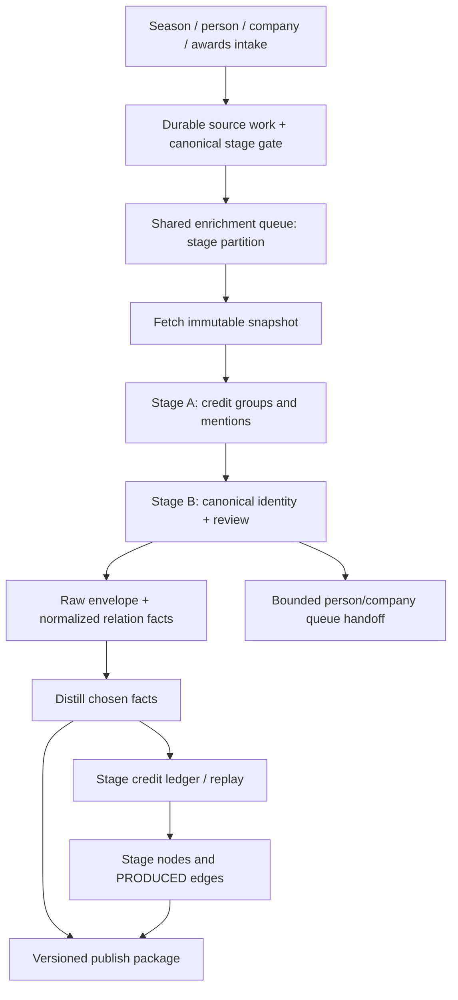

import BakeOffRules from '/snippets/bake-off-rules.mdx';

<Info>
  **Go feasibility harness completed — September 7.** At Mark's request, `cmd/stage-source-harness` now exercises bounded discovery, selected-page capture and local evidence replay. Across six production cases, Parallel and Exa returned **61 distinct candidate URLs**; five Firecrawl captures yielded **four candidate billing spans on three pages**. All 17 provider requests returned HTTP 200; replay made zero requests. These are research results, not complete rosters or accepted identities. The [harness results and expanded source inventory](#september-7-harness-results-and-expanded-source-inventory) distinguish proven capabilities from remaining work. The stage waterfall, pilot import, workers and publication remain unbuilt.
</Info>

**Private-pilot decision — 2026-09-07:** Mark will pursue IBDB permission before commercial launch and wants development/private pilots to proceed now. Use the [private-pilot path](#private-pilot-path) with a bounded cohort, supplied/reviewed evidence and independent source adapters. IBDB licensing is not a prerequisite for building or piloting the common Go pipeline with other suitable inputs. Automated IBDB collection remains held unless its access basis is resolved; private access alone does not establish an exception to its terms. No runtime was built or enabled by this plan update.

**Source audit — 2026-09-07:** the bounded review of three Broadway and three West End production cases is complete; [findings and build requirements are below](#september-7-source-audit). Source and technical gates apply to the inputs/features actually enabled in a private pilot. Full source coverage and commercial distribution remain separate release gates.

**Directory preference — September 7:** Mark favors BroadwayWorld. Make it the **first production-credit directory adapter to evaluate**, alongside Wikidata identity and Tony/programme coverage checks. Its retrieved Cabaret staff section has useful explicit roles but only seven producing entries; it is not a proven complete co-producer roster. This selects evaluation priority, not automatic source acceptance or runtime enablement.

**Storage update — 2026-09-07:** after the readiness audit, Mark authorized creating the tables first. **All 11 direct-credit tables now exist, empty, in development AlloyDB** (`orbiter_universe.universe`), through migration `20260907095520_stage_co_producer_storage.sql`. Isolated migration up/down/up and 14 schema/merge tests passed; live constraints, indexes, ownership and API/worker CRUD grants were verified. The complete live-ingestion preflight remains open. Existing Music/IMDb logging and queue contracts were rechecked against published `origin/main` at `97b242ce5a99f5590eeaa6e8377dc7fb6661e8d5`; see [the readiness results](#september-7-preflight-results) and [the logging contract](#error-logging-and-run-receipts-published-go-contract).

**Status — 2026-09-07: storage and research harness created; the stage waterfall is not built.** Add Broadway and West End producing credits as another waterfall in **`orbiter-universe`**. The development plan is grounded in the actual movie and music implementations through commit `a377c44`, the 990 build record in Basic Memory, and the current source page for the worked example, with the published-code recheck above. It supersedes the 2026-08-21 brief while preserving the two-market scope, production-hub model and agreed weight bands. **Mark’s September 6 correction supersedes the old label decision: theatre needs its own entity types.** The proposals and source-based property contracts are documented in [Graphs → Node Types](/guides/ontology/nodes#theatre-nodes). Storage, entity-FK merge classification, schema tests and the standalone research command have been added; stage runtime work remains pending.

<Note>
  **Go on GCP only, including fixtures, evaluation commands and smoke tests. No Xano.** The eleven SQL tables are created in development AlloyDB. No stage service, adapter, worker, type routing, graph writer or deployment was built or enabled. Other new names below remain proposed contracts unless explicitly marked existing.
</Note>

## Outcome and scope

Capture **who is publicly credited with producing a specific stage production**, the exact billing, and the evidence behind the identity match. Resolve people and companies onto the same canonical Universe entities used by the movie, music and company waterfalls. Materialize accepted credits; derive co-producing paths through their shared production.

A production credit is **not proof of a personal investment, amount invested, ownership share, recoupment or a personal relationship between every pair of producers**. Billing is a role and traversal-cost signal. Investment claims require their own evidence and owning pipeline. Company officers, show-company principals and a credited company's producers are distinct assertions.

| Included in v1 | Separately gated or deferred |
| --- | --- |
| Broadway and West End productions; all explicit producing tiers; direct person and company credits | Off-Broadway, regional productions and national tours |
| Production intake, source snapshots, extraction, resolution, facts, graph replay and correction | Casting, creative crew, employment inferred from a credit, cap tables, grosses and recoupment |
| Person/expertise/movie crossover discovery; company/shingle discovery; season and awards intake | Recursive expansion without budgets; bulk profile enrichment for every name |
| Company identity and independently evidenced principal affiliations | Automatic person-level copies of a company's `PRODUCED` credits |
| Universe consumer contract for stage titles and credits | App UI implementation; direct writes into Orbiter Backend display tables |

**Deliver the direct-credit backbone first.** UK coverage is part of v1 but can be enabled independently after its fixtures pass. Filings, company-principal research and awards improve evidence; their absence must not prevent a well-sourced direct credit from being recorded.

### Private-pilot path

**Decision:** proceed with Go development and a private pilot before commercial launch. The initial implementation must accept evidence without requiring IBDB, SOLT, Theatricalia or a particular scraping vendor. All items below are proposed build requirements, not implemented controls.

| Boundary | Private pilot | Broader/commercial release |
| --- | --- | --- |
| Scope | Recommended first cohort: five Broadway and three West End engagements, admitted individually. Either market may start when its own cases pass; no season sweep or recursive producer expansion. | Expand only after the full coverage report and bounded canary. No implied historical completeness. |
| Input | Producer/production-supplied credit lists, suitable pilot material supplied by participants, and independently reviewed evidence whose intended pilot use is supported. Parallel discovers candidate sources. | Approved continuing access and commercial storage/display terms for every enabled source; Mark pursues IBDB permission before commercial use of IBDB data. |
| Identity | Reviewed stable registry IDs for either market; preserve existing canonical person/company IDs where resolved. New production hubs are allowed after review; new person/company creation remains disabled initially. | Enable validated source aliases and new-entity admission only after the corresponding identity tests. |
| Access | Invite-only pilot consumers and an isolated pilot dataset/graph; evidence and derived credits cannot flow into ordinary commercial publication. | Explicit promotion/re-ingestion after source-use and technical release checks. Private participation alone does not approve public reuse. |
| Quality | Validate every credit in the small cohort; preserve partial/provisional coverage and unknown dates. Run identity, queue, replay, correction and isolation checks before exposing the enabled features. | Complete the ~20 US/~10 UK adapter corpus and held-out evaluations before claims of general coverage or broad unattended collection. |

**Build the structured import first, through the same pipeline.** Add a proposed `pilot_submission` source adapter accepting a versioned JSON credit list through a scoped Go admin command/endpoint. It writes the existing source record/snapshot, group, mention and checkpoint ledgers, then uses ordinary resolution, facts, replay and publication. It must not write graph edges directly or bypass identity review. No extra theatre tables are proposed by this path; validate field support against the existing migration during implementation.

Minimum intake contract:

- Stable `submission_id` and `record_id`, submission revision, received time, submitter/reference and recorded basis for pilot use. Preserve the original attachment or JSON only within its supported retention terms. A manually entered copy does not gain new source rights.
- Reviewed `production_registry_id`, literal title, market, venue and supported dates. Source URLs/IDs remain candidate aliases until verified; an IBDB URL is not evidence that IBDB supplied the imported credits.
- Ordered credit groups with literal `role_raw`, `billed_text`, optional source-party reference, evidence locator and any explicitly supplied credit dates. Do not require a submitter to guess resolved entity IDs or split compound names.
- Completeness/source notices plus reviewer, review time and decision. Preserve whether evidence was supplied, observed or inferred; an attested credit list may still be partial.

Store each received revision and its deterministic normalized text/hash for replay. Repeating the same submission/revision is idempotent; conflicting bytes under the same revision are rejected for review. A correction creates a new evidence revision. Missing credits on a partial submission never delete earlier accepted support.

**Pilot isolation is part of implementation.** Use an isolated development dataset and graph namespace, with scoped storage/queue routing and authenticated pilot readers. Seed needed canonical references consistently. Verify that pilot facts, replay jobs and publication events cannot reach the shared commercial graph or consumer outputs. If the selected environment cannot enforce that boundary, keep graph/publication disabled and use the internal review report until it can. Do not add a second permanent entity identity system for the pilot.

**Technical exit for the first cohort:** every displayed credit has reviewed identity and inspectable evidence; duplicate intake/redelivery creates no duplicate semantic credits; a correction and explicit retraction converge; queue budgets and lease fencing hold; incomplete evidence stays visibly incomplete; and pilot isolation is tested. Search/LLM evaluation gates apply to any automated call site enabled in the pilot. Manual supplied-record intake can run without search, scraping or LLM dependencies. The small cohort does not certify the untested web adapters.

**Later commercial promotion:** Mark resolves IBDB permission for any intended IBDB-backed commercial use, and each other enabled source has its own recorded use basis. Re-evaluate pilot evidence for commercial eligibility, omit or replace unsupported records, and replay only eligible credits through normal fact election. Eligibility follows supporting evidence, not just the production or producer ID. A commercial flag must not automatically promote an entire pilot database.

## September 7 preflight results

This is a dated audit, not a deployment certification. The entire plan had already been reviewed at the design level; the earlier review did not create theatre tables or verify every runtime credential. Today's check distinguishes repository code, development AlloyDB, local environment files and deployed service configuration.

| Check | Verified result | Build consequence |
| --- | --- | --- |
| Published Go reference | Music/IMDb orchestrators, shared `failure`, `stages`, `fanoutlimit` and queue SQL reviewed at [main `97b242c`](https://github.com/Orbiterio/orbiter-universe/tree/97b242ce5a99f5590eeaa6e8377dc7fb6661e8d5). Their inspected versions match the local checkout. | Follow the exact logging/queue contract below; do not equate a pushed feature branch with merged main or a deployed image. |
| Direct-credit SQL | **All 11 `stage_*` tables created and verified empty**, migration `20260907095520_stage_co_producer_storage.sql`. The earlier audit found 0/11; this supersedes that result. | Storage portion completed. Type/config registration, sqlc queries and semantic merge/worker behavior are still required before ingestion. Earlier media tables do not implement theatre storage. |
| Shared SQL | `entities`, `entity_identifiers`, `enrichment_payloads`, `enrichment_attempts`, `enrichment_stages`, `enrichment_queue` and `entity_facts` exist. Shared provider quota tables also exist. | Reuse the ledgers. Table existence does not establish that a stage runner, generic budget service or stage-cap row is implemented. |
| Canonical types and stage configuration | `stage_production`, `theatrical_work`, stage routing and typed `STAGE_*` config are not registered in the inspected Go code. | Add the direct-credit production type/config/dispatch in the initial foundation; optional work/venue/award slices remain separately gated. |
| Local files | The repository uses `.env` through its Makefile; `.env.local` is absent. The credential walkthrough confirmed OpenRouter, Exa, Parallel, Companies House and `SEC_USER_AGENT` are present. OpenCorporates is explicitly deferred. The earlier infrastructure audit found `DB_MODE=local`, `GCS_MODE=noop`, `PUBSUB_MODE=noop` and missing local AlloyDB/GCS deployment fields. | Local provider credentials are prepared. Separately configure and verify the intended development target before a live Go run; the standard AlloyDB Make target needs impersonation configuration such as `ALLOYDB_SA`. Do not add unused `STAGE_*` variables before config wiring exists. No secret values were printed or changed. |
| OpenRouter | Existing local key authenticated successfully (`GET /api/v1/key`, HTTP 200); its key cap was not exhausted. | Authentication checked; model inference, account-wide spend capacity and the required per-call-site evaluations are not established by this check. [Key status contract](https://openrouter.ai/docs/api_reference/limits). |
| Search/capture providers | The later harness completed six Parallel searches, six Exa searches and five Firecrawl captures, all HTTP 200. | Local credentials work; saved observations support replay. The exploratory sample is not the formal search/capture bake-off or proof of identity quality. [Exa](https://exa.ai/docs/reference/search) · [Parallel](https://docs.parallel.ai/api-reference/search/search) · [Firecrawl](https://docs.firecrawl.dev/api-reference/endpoint/scrape). |
| Deployed Universe API/worker | Both declare AlloyDB, GCS and Pub/Sub configuration, plus OpenRouter/Exa secret references. Neither declares Parallel, Companies House or `STAGE_*` settings. | Infrastructure settings exist in Cloud Run despite missing local counterparts. Verify the stage-capable deployment and runtime access when built; add Parallel only if selected/wired. Secret references were inspected, not their values or live runtime validity. |
| Published versus branch dependencies | The local donor branch contains a Parallel client/config addition that is absent from inspected `origin/main`. | A main-based Broadway build must explicitly include or depend on that reviewed shared client if Parallel is used. It cannot assume the branch-only feature is already published. |
| Primary production sources | The [six-case source audit](#september-7-source-audit) confirms useful credit structures and identifies access restrictions, provisional rosters and UK coverage gaps. | IBDB and Official London Theatre automated ingestion require an approved access arrangement. Full Go capture/parser fixtures and UK identity validation remain open. |
| Optional company/filing enrichment | **Credential follow-up, September 7:** `COMPANIES_HOUSE_API_KEY` is now present in local `.env`. Live company search, profile and officer requests all returned HTTP 200; test company was National Theatre Live Limited (`09541676`). Theatre-specific corroboration paths remain unimplemented. | Companies House credential access is verified, superseding its earlier absence in the local-file audit. The adapter remains separately gated; deployed secret/config wiring and PSC access have not been tested. [Companies House API authentication](https://developer.company-information.service.gov.uk/authentication). |

**Recommended starting point today:** implement contracts/type registration, pilot import and the stage queue/receipt contracts, using existing person/company identities with new leaf creation, principal research and optional context disabled. Reviewed new production hubs are allowed. Run source proof for the pilot inputs alongside this foundation; the full IBDB/web-adapter corpus is not a prerequisite for the import path. Keep graph/publication gates closed until their technical and pilot-isolation checks pass. The media project deferred until next week is not a prerequisite for Broadway: Broadway must supply its own required foundation or a shared foundation PR, rather than assume the planned media runtime already exists.

**Local API credential walkthrough complete — September 7:** OpenRouter authentication, Exa/Parallel search, Companies House search/profile/officers and SEC submissions access passed live HTTP 200 checks. No further provider keys are specified for the initial build; OpenCorporates remains deferred. These are connectivity checks, not model evaluations or full adapter certification. The preliminary source audit is now complete; approved source access and the full Go fixture/coverage work remain open. Deployment still needs the appropriate provider secret/config wiring and GCS/Pub/Sub runtime checks. No additional scraping subscription is assumed by this plan.

The shared `provider_quota_buckets` / `provider_quota_reservations` can support a common budget owner implemented with this build. Do not write theatre delivery intents into `media_outbox` or borrow music-private storage merely because those tables exist. Stage's durable checkpoints and recovery contract remain responsible for its pending work unless a reviewed common outbox owner is introduced.

**Table-creation verification:** the exact live table delta was the eleven tables below, with every index and constraint valid, owner `orbiter_migrator`, and CRUD privileges confirmed for both existing Universe API/worker database roles (22 table/role combinations). All were empty. Only this migration was applied; the unrelated pending filings (`20260906105510`) and donors (`20260906212956`) migrations stayed pending. PostgreSQL validation used a disposable local database; the local application database was not migrated. These checks establish storage readiness, not source completeness or runtime behavior.

## What the code changes about the old plan

| Verified implementation / finding | Broadway consequence |
| --- | --- |
| `entitiespub` exposes `FindByStrong`, `Candidates`, `Canonical` and `CreateWithIdentifiers`. Universe owns `entities` and `entity_identifiers`. | No `master_person` / `master_company` lookup or legacy function dependency. Soft names nominate candidates; identifiers and evidence resolve them. |
| `filmtv/gate.go` validates an IMDb **title** before creation; its normal dedup is permanent. | Add a stage-specific gate. Never pass IBDB IDs to the IMDb gate. Stage sources need explicit revision and refresh behavior. |
| Film/TV and music write run/step receipts before work. Music refuses a successful freshness stamp after a degraded run. | Reuse receipts and lineage; distinguish extraction success, resolution coverage, fact election and graph readiness. |
| `queue_drain.go` routes `film_tv` to IMDb and currently falls through other unhandled types to the company runner. Its normal picker admits only tiers 0–1; deletion checks the enqueue count. | Add an explicit `stage_production` type and dispatch branch before enqueueing. Unknown types must fail closed. A P2 backfill is not automatically drainable. |
| `dispatch_variant` is currently a person-run restriction; queue upsert can clear it when requests disagree. | Route by the new canonical `stage_production` entity type, not a person variant or a Film/TV discriminator. |
| `film_tv_credit_replay.go` and `music_credit_replay.go` defer edges until chosen facts and both graph endpoints exist. | Add a stage credit ledger and replay. Stage B does not draw graph edges. |
| `facts/repo.go:planFactDeletes` replaces relationship claims only for the targets in a payload; scalar replacement is broader. | Incremental credits need not erase the producer's other shows. An omitted target does **not** retract an old relation; implement explicit retraction. |
| Film/TV graph creation/sync stamps IMDb provenance. Music `PRODUCED` targets `Recording` at weight 18. | Add `Stage_Production` node sync and a dedicated stage edge writer; preserve the two existing pipelines. |
| `publish.Service.Projection` currently handles person/company packages. | Add a stage-production package; its contract is not an existing Film/TV package to turn on. |
| The 990 adapter uses durable mentions, bounded resolution, chosen-fact IDs and a separate edge gate. | Reuse the pattern and public seams. Do not import its repo or assume its planned Form D reader exists. |
| The current IBDB example includes compound credit links and a notice that credits are not finalized. | Source party IDs can identify groups; completeness and source version must be recorded. Old simulated counts are not goldens. |

### Source manifest for the developer

Review baseline: local `/Users/markpederson/dev_work/orbiter-universe`, clean at inspection, commit **`a377c44`**. These are code references, not claims that a particular environment has deployed the code.

| Read in this order | Contract to reuse or extend |
| --- | --- |
| [`CLAUDE.md`](https://github.com/Orbiterio/orbiter-universe/blob/a377c44/CLAUDE.md) | Modular monolith, feature ownership, public seams, identifier-first identity, facts → distill → graph → publish |
| [`enrichment/filmtv/gate.go`](https://github.com/Orbiterio/orbiter-universe/blob/a377c44/internal/features/enrichment/filmtv/gate.go), [`filmtv/orchestrator.go`](https://github.com/Orbiterio/orbiter-universe/blob/a377c44/internal/features/enrichment/filmtv/orchestrator.go) | Gate, lineage, receipt lifecycle and credit handoff |
| [`enrichment/music/orchestrator.go`](https://github.com/Orbiterio/orbiter-universe/blob/a377c44/internal/features/enrichment/music/orchestrator.go), [`music/identity.go`](https://github.com/Orbiterio/orbiter-universe/blob/a377c44/internal/features/enrichment/music/identity.go), [`music/pacer.go`](https://github.com/Orbiterio/orbiter-universe/blob/a377c44/internal/features/enrichment/music/pacer.go) | Fail-closed completion, source aliases/redirects, shared rate reservations |
| [`enrichment/queries/pipeline.sql`](https://github.com/Orbiterio/orbiter-universe/blob/a377c44/internal/features/enrichment/queries/pipeline.sql), [`queue_drain.go`](https://github.com/Orbiterio/orbiter-universe/blob/a377c44/internal/features/enrichment/queue_drain.go) | Actual queue selection, upsert/promotion, locks and conditional deletion |
| [`enrichment/film_tv_credit_replay.go`](https://github.com/Orbiterio/orbiter-universe/blob/a377c44/internal/features/enrichment/film_tv_credit_replay.go), [`music_credit_replay.go`](https://github.com/Orbiterio/orbiter-universe/blob/a377c44/internal/features/enrichment/music_credit_replay.go) | Pending credits, chosen-fact gates and endpoint readiness |
| [`facts/repo.go`](https://github.com/Orbiterio/orbiter-universe/blob/a377c44/internal/features/facts/repo.go), [`facts/factspub/factspub.go`](https://github.com/Orbiterio/orbiter-universe/blob/a377c44/internal/features/facts/factspub/factspub.go) | Replacement scope and `ElectedRelationFacts` |
| [`graph/film_tv_sync.go`](https://github.com/Orbiterio/orbiter-universe/blob/a377c44/internal/features/graph/film_tv_sync.go), [`platform/graph/film_tv.go`](https://github.com/Orbiterio/orbiter-universe/blob/a377c44/internal/platform/graph/film_tv.go), [`platform/graph/music_edges.go`](https://github.com/Orbiterio/orbiter-universe/blob/a377c44/internal/platform/graph/music_edges.go) | Source-aware stage sync, canonical node key, separate endpoint/weight policy |
| [`enrichment/fanoutlimit/enrichment_fanout_limit.go`](https://github.com/Orbiterio/orbiter-universe/blob/a377c44/internal/features/enrichment/fanoutlimit/enrichment_fanout_limit.go), [`enrichment/cap.go`](https://github.com/Orbiterio/orbiter-universe/blob/a377c44/internal/features/enrichment/cap.go) | Admission before creation, seed/depth accounting and population caps |
| [`entities/merge_inventory.go`](https://github.com/Orbiterio/orbiter-universe/blob/a377c44/internal/features/entities/merge_inventory.go), [`publish/service.go`](https://github.com/Orbiterio/orbiter-universe/blob/a377c44/internal/features/publish/service.go) | Merge-safe references and the actual consumer package boundary |
| [`filings/irs990_resolve.go`](https://github.com/Orbiterio/orbiter-universe/blob/a377c44/internal/features/filings/irs990_resolve.go), [`filings/irs990_edges.go`](https://github.com/Orbiterio/orbiter-universe/blob/a377c44/internal/features/filings/irs990_edges.go) | Recent working mention/resolution/election pattern; verify comments against current facts code |

Basic Memory used: [ORBIT-1862 build record and September 6 follow-up](https://app.basicmemory.com/notes?id=cloud%7Cff28d60c-fe10-40cb-8b13-5ce1fd2406b7%7C2fe7811d-03e2-4b25-870e-57976803f110%7C5aed36ef-2ddd-41a8-a76f-9d4c80ecfd85&explorer=project%3Acloud%7Cff28d60c-fe10-40cb-8b13-5ce1fd2406b7%7C2fe7811d-03e2-4b25-870e-57976803f110). Its later correction on relationship replacement takes precedence over its earlier whole-source description; current code is the final check.

Companion docs: [Go migration architecture](/guides/open-work/orbiter-univers-standalone/enrichment-gcp-migration), [Movie rebuild contract](/guides/enrichment/waterfall/imdb-go-rebuild-spec), [Music rebuild contract](/guides/enrichment/waterfall/music-go-rebuild-spec), [Projection Pattern](/guides/open-work/orbiter-univers-standalone/projection-pattern), [Universe Lookup Tables](/guides/open-work/orbiter-univers-standalone/universe-lookup-tables), [stage ontology](/guides/ontology/edges#produced-stage), [Edge Weights](/guides/ontology/edge-weights), [Donors](/guides/open-work/roadmap/donors). Older design sketches explain intent; do not copy obsolete table names or queue mechanics over current code.

## Decisions and invariants

| Decision | Development contract |
| --- | --- |
| One production hub | Proposed Universe `entity_type = stage_production`, graph `Entity:Stage_Production` with controlled `Play`/`Musical` subtypes. Each credited engagement is its own hub. It is not a Film/TV title. |
| One canonical object per production | Source IDs are aliases; graph identity is canonical `entity_id`. A revival, Broadway transfer and West End original are separate productions. |
| One direct credit edge per producer/production | Preserve multiple supporting mentions and billing roles in SQL; select deterministic current edge metadata. No edge per source, role or retry. |
| Existing weights | Lead 12; producer 16; co-producer 22; associate/executive 28; in-association 35. Lower is stronger. Do not change the music weight of 18. |
| Credit meaning | Preserve literal source role and map it by versioned rules. `Produced by` alone maps to `producer`, not `lead_producer`; first position alone does not prove lead status. |
| Group credits | Retain a group plus independently resolvable members; `group_credit` describes joint billing only. A conjunction does not prove marriage. Separately proven family relationships belong to their own evidence and owner. |
| Shingle bridge | Materialize the company's actual credit. Use evidenced, time-relevant affiliations to traverse to principals; no automatic synthetic personal credit. |
| One fact-authorized write path | Snapshot → mentions → accepted identity → payload/facts → distill → credit ledger → graph replay → publish. |
| No name-only entity creation | Unresolved names remain mentions. Admit any new person/company only through the owning identifier gate, population cap and fanout budget. |
| Reproducibility | Pin source snapshot, parser, mapping, prompt/model and policy revisions. A retry of one revision uses stored artifacts. An intentional refresh creates a new revision. |
| Corrections are first-class | Preserve historical evidence; explicitly supersede/retract current claims and reconcile graph and consumer state. |
| No unbounded cascade | Credit completion never waits for enrichment of every producer. Discovery and paid work have independent limits. |

**Ontology alignment:** [Node Types](/guides/ontology/nodes#theatre-nodes), [Edge Types](/guides/ontology/edges#theatre-edges) and [Edge Weights](/guides/ontology/edge-weights#theatre-weights) now document the same proposed theatre contract. `Stage_Production` replaces the old film/TV target; direct-credit weights stay unchanged. Runtime/API registration and reader enforcement remain implementation work. Do not reintroduce the old inherited credit dates, confidence string, spouse inference or principal-copy behavior.

## Proposed theatre node types

**Proposal requested by Mark, 2026-09-06.** Use [Graphs → Node Types → Master Label List](/guides/ontology/nodes#master-label-list) as the conceptual vocabulary: `Entity` for canonical objects, `Work` for underlying creative works, `Place` for locations, and existing `Person`/`Company` identities. Theatre gets a dedicated production family. A production is neither a screen title nor one dated performance event.

The schema page describes the older graph estate; current Go differs in two relevant places: music works use `Music_Work` to protect ownership/wipe boundaries, and music `Place` nodes are support rows without a canonical `entities` row or `Entity` label. The plan must reconcile those differences explicitly, not assume the master's labels imply an existing Go type.

| Proposed node | What one node means | Go / relational identity | Release scope |
| --- | --- | --- | --- |
| **`Entity:Stage_Production`**, optional `:Play` / `:Musical` | One source-defined, credited production/engagement: e.g. a particular Broadway run, its revival, or its West End original | **New canonical `entity_type = stage_production`**; `entities` + identifiers + stage profile/control records | Required for the direct-credit v1 |
| **`Entity:Work:Theatrical_Work`**, optional `:Play` / `:Musical` | The underlying dramatic work shared by distinct productions; not its cast recording, film adaptation or original novel | **New canonical `entity_type = theatrical_work`**; facts-owned `theatrical_work` cache; reviewed source work identifiers | Optional v1 linking when identity is established; absence never blocks a production |
| **`Place:Venue:Theatre`** | The physical theatre/venue, independent of its owner, operator, brand and productions | Reuse/extend the current **support-place** pattern and source aliases; stable place row/node UUID, not a new company | Venue-context slice; preserve an existing music place rather than minting a rival |
| **`Stage_Award`**, optional `:Winner` / `:Nominee` | One named award result for a specific production or explicitly named recipient, category and award year | Proposed **support record**, like film award rows; no automatic enrichment queue/entity type | Later award slice; metadata/discovery can ship earlier |

These are new graph/domain types, but **only `stage_production` and `theatrical_work` require new canonical Go entity types** in this recommendation. Venues/award results follow the existing support-row architecture. If venues later need their own canonical entity lifecycle, `Entity:Place:Venue:Theatre` is a separate shared-place migration, preserving every existing node UUID and cross-source alias; it is not an incidental stage-waterfall change.

### Production versus work versus performance

- **Production:** the scope of one producing credit block. Broadway and West End versions, revivals and distinct source engagements get different production IDs. A venue rename or corrected date does not mint a new production. A source-defined venue move can add a dated venue association to the same production; a newly defined engagement stays separate.
- **Theatrical work:** the play/musical as a creative object. Connect independently identified productions of the same work without combining their producers. A musical based on a novel is not the novel; a stage adaptation and a movie with the same title are not the same work.
- **Individual performance:** a dated showing within a production. Defer these nodes because the co-producer waterfall does not need thousands of performance instances. If attendance/ticketing later requires them, propose `Entity:Event:Theatre_Performance`, linked to its production and venue, following the master's `Event` family.
- **Venue:** the building or distinct performance space. Its owner/operator is a `Company`; a producing organization of the same name is still a different object. Addresses and names nominate place matches; verified source identity and compatible physical-location evidence establish one.
- **Person/company:** keep the canonical `Person` and `Company` across theatre, movies and music. Store producing role, shingle classification and legal vehicle type as evidence-backed attributes/relationships; no parallel `Theatre_Person` or `Theatre_Company` identity silo.

For theatrical works, do not merge into an existing `music_work` by title or reuse a score/recording MBID as a whole-show identifier. A verified equivalence or adaptation requires an explicit typed relation and reviewed ownership policy. Production/work subtype labels come from a closed whitelist, never arbitrary provider strings. Shared words such as `Play` and `Musical` are modifiers; routing, indexes and wipe predicates always include the owning family/type.

### Proposed structural relationships

| Relationship | Meaning / gate | Scoring policy |
| --- | --- | --- |
| `Person/Company → PRODUCED → Stage_Production` | Accepted direct producing credit | Existing agreed 12/16/22/28/35 bands; new target replaces the old Film/TV proposal |
| `Stage_Production → PRODUCTION_OF → Theatrical_Work` | Explicitly resolved underlying work | New name; proposed 50, evidence context excluded from scoring |
| `Stage_Production → STAGED_AT → Place:Venue:Theatre` | Sourced venue engagement with dates and provenance | New name; proposed 50, evidence context excluded; not the existing event-only `HELD_AT` writer |
| `Theatrical_Work → ADAPTED_FROM → resolved source work` | Explicit attribution and independently resolved target; later optional work slice | New name; proposed 55, evidence context excluded; unsupported novel/book identity remains SQL evidence |
| `Person/Music_Group → WROTE/COMPOSED/WROTE_LYRICS → Theatrical_Work` | Explicit work-level author/composer/lyricist claims; optional slice | Reuse names with dedicated theatre endpoints; proposed 10/8/12, excluded initially |
| `Stage_Production → HAS_AWARD → Stage_Award` | Exact engagement's production or associated-recipient award context | Proposed 40, excluded initially; distinguish the result scope |
| `Explicit Person/Company → WON_AWARD/NOMINATED_FOR → Stage_Award` | Only explicitly named, independently resolved award recipients | Proposed 30/35, excluded initially; no `WON` alias or award copy to every co-producer |

The first release needs only `PRODUCED`. The other weights are proposals, including reused movie/music precedents. [Edge Types contains full property examples and the shared envelope](/guides/ontology/edges#theatre-edges). Co-producing evidence joins on **the same production ID**. Context writes remain disabled until the owning contracts are ratified and every candidate/path/scoring reader enforces `excluded_from_scoring`; retain SQL evidence meanwhile. A property flag or a high weight without reader enforcement cannot prevent shortcuts through a shared work, venue or award.

### Identity, properties and display contracts

The detailed field types, required/optional rules, primary-source mappings and graph-versus-SQL boundary live in [Node Types → Theatre nodes](/guides/ontology/nodes#theatre-nodes). Treat that section as the proposed property contract for this plan. It distinguishes booking horizons, announced closes and confirmed final performances; preserves capacity disputes and dated venue history; and scopes award entries to explicitly named recipients/productions. Primary source mappings were inspected; adapter contracts remain future work.

- `Stage_Production`: canonical production identity, title/form/market, sourced run dates/status, season, optional work ID, venue evidence, source coverage/finality and standard provenance envelope. Strong aliases identify a production, never just a title.
- `Theatrical_Work`: canonical work identity, title/aliases, form, language, description and independently sourced creator/adaptation evidence. Unknown authors or work dates remain unknown. Source work IDs are typed separately from production, music-work and film IDs; title plus author/year is candidate context, not a silently strong key.
- Theatre venue: stable support identity, name/aliases, source venue IDs, address/location/coordinates when supplied, evidence and dated venue-name history. Existing music place matches are mediated by an owner-provided seam, not direct writes to `music_places`. Until a safe shared-place lookup/alias seam exists, preserve `venue_pending` evidence instead of creating a duplicate graph place. One source's thin venue observation cannot blank another's richer data.
- `Stage_Award`: awarding body, award year, category, outcome, production and/or explicitly named recipient, source record and snapshot. A nomination later upgraded to a win is a revision of the same scoped result; an award ceremony is an `Event`, not this result node.
- Production gets a proposed **`stage_production_display`** card contract. Theatrical works may fit existing `work_product_display`; venues and awards remain context by default. A new graph type does not automatically require another standalone card.

The graphical `Entity` label and a row in `universe.entities` must not be conflated. Canonical production/work nodes merge by proposed canonical `entity_id`; support venue/award nodes by their durable owner row IDs. All source identifiers are aliases. Those uniqueness rules, admission semantics and migration/reconciliation behavior are reviewed together before any writer is implemented.

### Go registration checklist for the new types

Before queue admission, add explicit canonical type constants/validation, source identifier strength and type scoping, schema constraints, typed profile caches, facts mapping/distill switches, node-sync dispatch, graph writer whitelists/indexes, merge inventory and generic repair/purge guards. Add type-aware population caps and fanout policy, queue dispatch/manual-drive handling, event/OpenAPI DTOs, publish package dispatch, search/subgraph/path mapping and consumer contract tests.

The theatrical-work type does not inherit a music or IMDb runner; its initial enrichment uses the approved local source payload and its own facts/sync path. Venues and award support records consume separate bounded support replay, not the person/company/production queue. Migrate shared-place identity only in its owner-reviewed slice. **This pass updates this plan and the theatre proposals in Node Types, Edge Types and Edge Weights. Runtime schema, Go registration, graph writers and API changes remain future implementation work.**

## Go architecture and ownership

Build a sibling of `enrichment/filmtv` and `enrichment/music` under **`internal/features/enrichment/stage`**. Reuse the existing API/worker binaries, pgx/sqlc repositories, Pub/Sub registry, GCS client, telemetry, `stages`, `fanoutlimit`, `httpx` and LLM registry. A new deployment or generic workflow engine is unnecessary.



| Owner / proposed location | Responsibility |
| --- | --- |
| `enrichment/stage/{gate,orchestrator,types,parse,resolve}.go` | Pure extraction, typed contracts, resolution ladder and orchestrator decisions |
| `enrichment/stage_gate.go`, `stage_repo.go`, `queries/stage.sql` | Adapt parent repo and public dependencies into narrow stage interfaces; sqlc owns generated code |
| `enrichment/stage_credit_replay.go`, `stage_reconcile.go` | Durable desired credit state, replay and revision recovery |
| `clients/ibdb`, `clients/playbill`, UK adapters | Fetch and decode sources; retries through `platform/httpx`; no entity or graph writes |
| `facts/mapping_stage.go`, `distill_stage_production.go`, stage view | New canonical type, source/field vocabulary, current claims and typed-cache winners |
| `graph/stage_sync.go`, `platform/graph/stage_edges.go` | Stage-aware node synchronization and the sole stage `PRODUCED` writer |
| `publish/stage_production_projection.go` + `enrichment/stage_production_projection_reads.go` | Stage production/credit package and public read seam; no App table access |
| `internal/app` | Construct dependencies and register HTTP/workers only |

Names are proposed, not files created by this plan. Declare narrow interfaces in their consuming packages and share cross-feature DTOs through `entitiespub`, `factspub`, `graphpub`, `enrichmentpub` and any filings-owned public seam. Never import a sibling feature's private service/repo. Update depguard, sqlc configuration, OpenAPI and merge inventory alongside any new surface.

## Entry points and scheduling priority

Every route requests **productions**, or discovery work that finds productions. Only Stage A creates credit mentions. An imported source-person page is a discovery index, not authority to bypass the production's credit block.

| # | Entry point | Behavior | Scheduling class |
| --- | --- | --- | --- |
| 1 | Expertise-domain trigger | A selected/resolved theatre-domain signal on an independently requested person requests a source-person lookup. Freeze qualifying stable taxonomy IDs and evidence in fixtures; a reduced or company-bounded run only parks the signal. | P0 eligible roots |
| 2 | Person enrichment signal | Explicit stage-producing evidence requests the same lookup. Generic `producer` or a music/film role alone is not a confirmed theatre identity. | P0 |
| 3 | Movie/Music crossover | Existing canonical people with specific theatre evidence become bounded discovery candidates. An IMDb/MBID or screen/recording producer role alone is insufficient. Reduced cascade runs park the signal; an independent request or separately enabled batch can admit it. | P0 eligible roots; batch quota |
| 4 | Discover result / admin request | Carry an approved source ref or evidence-backed candidate. Unknown/ambiguous results stay in discovery review. | P0 |
| 5 | Season backfill | Recent/current seasons before older seasons; save inventory and cursor by market/year. | P1 recent, P2 historical intake |
| 6 | Recurring refresh | Weekly inventory/new openings and refresh of open/unfinalized productions; closing/correction checks are explicit refreshes. | P1 |
| 7 | Tony / Olivier sweep | Discover missing productions and store award source/year/category/status. Tony nomination announcements can supply explicit named-producer lists independently of show-page links. Award status and billing specificity remain separate. | P0 source proof for Tony-nominated Broadway; broader sweep P1 |
| 8 | Shingle expansion | Resolve a company first; enumerate its source production references across both markets. Visited-set and seed budget prevent cycles. | P1, bounded |
| 9 | Private-pilot submission | Scoped, versioned structured import; reviewed production registry reference; same source/mention/checkpoint path as adapters. Pilot scope admits this path and explicitly reviewed discoveries; automatic sweeps remain off. | P0, bounded cohort |

**P0/P1/P2 are intake classes, not an assertion that all shared-queue tiers drain.** Submit P0/P1 canonical stage work at tiers 0/1. Keep P2 in the historical source inventory until an explicit bounded backfill batch admits it at tier 1; never widen the global picker to run everyone's tier-4 backlog. Promotion from repeated discovery is disabled for stage work. A repeated unchanged intake is an admission no-op, not a paid-work promotion.

A new source-person lookup needs its own typed source-party reference. A grouped IBDB party page must not be attached as a unique identifier to each member. Negative lookup caches are keyed by source, canonical person, identity-evidence revision and query policy; use a proposed 30-day TTL, invalidated by identity changes or explicit refresh.

### Seed ingestion and subject-triggered discovery converge

**Recommendation:** support both. Start the private pilot with a small reviewed production roster, then add bounded person/company discovery. “Seed the graph” here means seed the **normal evidence pipeline**, which eventually projects production hubs and accepted credits. It does not mean insert a standalone theatre graph or use the reference-taxonomy `gcpseed` job to write producer relationships.

A production seed is useful before we know every producer: the roster becomes a shared hub and unresolved names stay as mentions. A person trigger is useful before we know their productions: theatre expertise starts discovery, not a `PRODUCED` claim. Both paths converge on the same canonical engagement, active input revision and credit ledger. A source-person page and a work-level Wikidata ID remain discovery/identity inputs; the engagement's evidence supplies the actual credit.

```text
Reviewed production/season/award/submission ─────────┐
                                                    ↓
Known person/company → theatre signal → source job → production gate
                                                    ↓
                                      shared stage queue / checkpoint
                                                    ↓
                               snapshot → mentions → reviewed identities
                                                    ↓
                                  facts → election → credit replay → publish
```

### Connections to the existing Go waterfalls

September 7 follow-up inspected local Go HEAD `7fab8e66d1dd1cc6f3819b0ea2e3781ccfed1033`. The entry/queue/person/brake files below match the previously inspected published `origin/main` reference `97b242ce5a99f5590eeaa6e8377dc7fb6661e8d5`; the local company chain additionally has the concurrent donor `filings_request` step. This is code inspection, not a new deployment check. **All theatre hooks in this table are proposed; the harness does not install them.**

| Entry | Existing Go seam | Proposed theatre connection |
| --- | --- | --- |
| Operator production seed / pilot submission | `handler.go:MountAdmin`, `music_seed.go:SeedMusic` provide the operator-seed precedent | Add the stage production admin route already specified below. Persist reviewed source/engagement admission, then queue the production. A source index without a canonical engagement enters `stage_source_job` first. Do not copy Music's optional inline execution into v1. |
| Ordinary person enrichment | `person/orchestrator.go`: `expertise` → `identity_bridges` → credit cascade; `steps_expertise.go` persists and resolves taxonomy evidence | Add a nonrequired `stage_discovery_request` handoff after expertise. Read the resolved theatre taxonomy or explicit verified stage-profile/credit evidence; preserve its evidence revision. The current expertise response has `film_industry` and `music_industry`, **no theatre flag**. Do not assume it exists or treat all “producer” roles as theatre. A stable taxonomy allowlist is still a build fixture, not hard-coded here. |
| Company / producing shingle | `company/orchestrator.go`: `specialties_rebuild` → `about_writer` → `music_label_verify` | Add the same narrow handoff after company evidence is persisted. Explicit theatre-production evidence qualifies; generic entertainment, a name match or a principal's biography does not by itself. Keep the existing Music ownership and donor steps intact. |
| Person reached through Movie or Music | `person/orchestrator_imdb.go`, `person/orchestrator_music.go` contain reduced step lists; each can verify the other domain, while broader credit cascade is excluded | A future theatre detector may save a pending candidate from evidence already held. In a reduced `imdb`/`music` run, or a `current_company_only` run, it starts **no new paid theatre discovery**. An independent full person request or explicitly enabled bounded crossover batch later admits it with its own recorded origin. No automatic promotion to the full person waterfall. |
| Known production refresh / due inventory | `queue_drain.go`, `queries/pipeline.sql`; stage source/control tables already exist | Admit only due or explicitly refreshed revisions. Use tiers 0/1 for canonical stage jobs; keep historical inventory parked. Add explicit stage dispatch to both normal and manual drain paths. Current manual dispatch rejects stage as unregistered; the generic normal dispatch needs a fail-closed default. |
| Review completion / fact election / graph repair | `film_tv_credit_replay.go`, `music_credit_replay.go` are the evidence-gated replay precedent | Resume stored mentions, identities or elected credits at their own checkpoint. A review or graph repair must not restart person enrichment or pay to retrieve the source again. |

The handoff step succeeds when the scoped discovery request is durably recorded, and has an observable failure receipt if recording fails. It does not wait for source discovery or complete producer coverage before the existing person/company run can finish. Attach through an injected public seam in the enrichment composition root; do not call a sibling repository or an inline full waterfall. If the selected taxonomy/evidence revision is unavailable, record `awaiting_dependency` rather than manufacturing a positive signal.

### Entry request, admission and recursion contract

The request must record dataset/pilot scope, entry kind, canonical subject/type when known, source plus typed reference, market, identity-evidence revision, source/query policy version, requested input revision, scheduling class, root source-job ID, seed entity/type, immediate parent/type, effective depth and the existing person-run restrictions. These are a proposed versioned request shape; current `enrichRequestedEvent` is **not** sufficient as-is. It does not carry the full theatre lineage/scope, and person restrictions alone do not encode a stage source job.

1. Canonicalize the subject and re-read its current type/restrictions. Require explicit independently authorized origin for a new root; a discovered child with missing root lineage is held. Effective depth is the greater of persisted admission depth and dispatch depth. Movie/Music reduced variants and bounded executives retain their restrictions.
2. Check pilot/source enablement, identity evidence, taxonomy, depth and spend allowance **before a new lookup**. A credible theatre signal nominates a subject; it does not establish that subject's producing role. Cache a successful no-match for the proposed 30 days by dataset, source/query policy, market, canonical subject and identity-evidence revision. Do not cache 403/429/failed parsing as no-match. A new identity revision or explicit refresh invalidates the result.
3. Review source aliases at the work/production/party level. BroadwayWorld is the preferred first directory evaluation; a reviewed programme/Tony/other alias may converge on the same engagement. Do not merge Broadway, West End, tour or revival by title alone. Preserve list/group and role differences.
4. Maintain **per-root admissions separately from the one shared production job**. Deduplicate typed source records first and canonical production aliases once resolved. Each distinct production counts at most once toward that root's proposed 50-production expansion ceiling; a refresh revision does not masquerade as another production. Separate revision/provider budgets still apply. Two roots can both record interest in one production while sharing one acquisition/enrichment job. Duplicate interest never promotes queue tier.
5. Apply the actual `fanoutlimit.Bound.Offer` before child creation/enqueue; its default maximum depth remains two. The in-memory bound cannot reserve the final root slot across workers. Persist root budget/admission checks atomically under the owning `stage_source_job` root, and preserve the row's generation/lease fencing. `root_job_id`, unique root/admission keys and JSON checkpoints/budgets exist; the future Go repository must define canonical-alias reconciliation and multi-root interest without overwriting lineage. No new table was created by this follow-up.
6. The initial pilot links existing people/companies and leaves other names unresolved. Production → credited company/person → same production reuses the original admission and source observation. No full person/company run is launched just to complete a credit. A genuine independent user request can enrich that person later; rediscovery cannot impersonate that request.
7. Route production work explicitly; preserve conditional queue completion and the active input revision. Failed required phases stay retryable/held even if a wrapper returns nil. A new input revision survives an older worker's completion. Unresolved identities are a separate partial-coverage state. Only elected facts and ready endpoints generate graph-write requests; every direct edge has `description`.

### Offline entry-point and ingestion simulation

**Implemented September 7, harness only:** `cmd/stage-source-harness -mode simulate` exercises 32 synthetic scenarios with independently recorded expected outcomes. It calls the actual shared `fanoutlimit` and `failure` packages, but all aliases, identity decisions, source-use decisions, chosen facts, queues and graph endpoints are fixture inputs or in-memory stores. No theatre runtime handler, adapter, worker or graph writer is installed.

```bash
go test -race ./cmd/stage-source-harness
go vet ./cmd/stage-source-harness
go run ./cmd/stage-source-harness -mode simulate -max-calls 0 \
  -out /private/tmp/stage-entry-simulation
```

Optional `-evidence-dir <saved-harness-directory>` verifies saved provider response hashes and re-runs the existing candidate-span recognizer. The five live captures from the earlier audit yield four candidate spans; those stay **review-only** and never supply synthetic accepted identities/facts. The simulation loads no environment credentials and makes zero API calls, database writes or graph writes. It emits `entry-simulation-report.json` with complete traces/intents and a readable Markdown report.

Coverage includes production submission/seed, person expertise and direct signals, company credits, Movie/Music crossover, reduced-run restrictions, duplicate aliases/roots, a production→company→production return, stale depth zero, missing lineage, zero/exhausted budget, recent/historical seasons, generic Tony role handling, disabled sources, work/wrong-engagement refs, unresolved identity, required descriptions, election/endpoint waits, typed 429/403 failures and refresh during an older run. Additional race tests exercise duplicate admission and contention for one final budget slot in the **single-process fake store**.

This proves the proposed routing decisions and deterministic fake-store behavior, not live ingestion quality or production concurrency. Still required in the build: real BroadwayWorld/other adapter fixtures and coverage scoring, source-party resolution, actual fact election, SQL uniqueness/transactions, multi-worker leases, correction/retraction, durable no-match expiry, graph replay and private publication isolation. Keep the synthetic corpus distinct from the reviewed real-show acceptance corpus.

## Production and source identity

### Canonical production

The proposed `stage_production.entity_id` points to one canonical `universe.entities` row of type **`stage_production`**. Its chosen title, market, dates and optional work reference live in a facts-owned `stage_production_profile` cache. Stage pipeline control/snapshot state remains stage-owned. Do not create or write a `film_tv` row for a theatre production.

Proposed identifier vocabulary, added through the entities feature with normalization and collision tests:

| Key | Scope and admission |
| --- | --- |
| `ibdb_production:537824` | A validated IBDB production reference; never accepted as an IMDb `tt` identifier |
| `ibdb_party:<id>` | One source party record. Attach to a person/company only after its single-entity type is proven. Group IDs remain on the source group. |
| `theatricalia_production:<id>` | UK production alias only after Phase 0 establishes its production granularity and stability |
| `theatricalia_party:<id>` | Same single-entity/type gate as IBDB |
| Playbill / official UK source record | Typed source alias after adapter validation; canonical URL alone must not collapse multiple engagements |
| Reviewed production registry key, either market | Opaque stable ID when no validated source production ID is available, including pilot submissions; retain matching context and candidate aliases. Later approved source aliases attach to the same production. |

Use structured `(kind, normalized_value)` storage, not an overloaded string parser scattered through the code. Source namespace and object kind prevent an identical numeric person/production ID from colliding. A corrected URL or source redirect becomes an alias to the same production, following the music identity-healing pattern.

**Never use `(title, theatre, opening-year)` as a strong production key.** It nominates candidates only: venues change, dates are corrected, and distinct engagements can share those values. Cross-source aliases require exact compatible production context plus an unambiguous match or review. One title can have several canonical productions. A separately resolved `Theatrical_Work` connects those productions through `PRODUCTION_OF`; that shared work never merges the production identities or their producer rosters.

Do not populate `imdb_id`, classify the stage production as a `Movie`, or send it to an IMDb fetcher. Record source disagreements and refuse a cross-market/source collision rather than auto-merging unrelated engagements.

### People and companies

1. Canonicalize every stored entity reference through `merged_into` at read/dispatch time.
2. Reuse an already approved typed source-party → entity link if it remains undisputed and type-compatible.
3. Use existing strong identifiers for deterministic lookup, but independently validate that a **newly discovered** profile belongs to the credited party before attaching it.
4. Names, company names, aliases, domains, locations and credit overlap nominate candidates. None silently becomes a strong identifier.
5. On a conflicting strong key, use the existing collision/review flow. Do not swallow uniqueness errors or create a second node.
6. Company source records are companies; shareholders, PSCs, officers and managing members are separate people/companies with separately sourced roles.

A bare source ID is only strong within the source's actual record semantics. The reviewed single-person/company predicate is part of admission, not an LLM confidence shortcut.

## Sources and access contracts

<Info>
  **OpenCorporates — deferred; enable later.** Mark's September 7 decision: the initial Broadway/West End release must work without an OpenCorporates subscription or token. Treat this optional step as disabled; a missing credential must not block or repeatedly retry a production.

  Revisit after the direct-credit canary identifies company matches that Companies House, official company sources and existing search cannot resolve. **Essentials is the starting recommendation for a limited pilot**, subject to measured call demand and current terms. The pricing screenshot reviewed September 7 shows up to 500 calls/month and 200/day; these are request limits, not counts of companies resolved. Recheck [current plans](https://opencorporates.com/plug-in-our-data/) before subscribing.

  **Later activation:** implement the optional Go adapter and typed enablement flag (off by default); add `OPENCORPORATES_API_TOKEN` locally and to the deployed service's managed secrets; verify account status and a company lookup; enforce shared daily/monthly quotas and test source-use requirements before enabling a bounded pilot. This documentation change adds no runtime flag or adapter.
</Info>

| Source | Intended use | Readiness / restrictions |
| --- | --- | --- |
| Participant/production-supplied material | Private-pilot credit evidence and structured import | Reviewed identity, provenance and intended pilot use; never assume a supplied list is exhaustive or that uploading a third-party page grants reuse rights. No IBDB dependency. |
| BroadwayWorld | Preferred first directory candidate for production-specific producing roles and party links | Cabaret example rechecked: seven producing entries in retrieved staff text (six Producer, one Co-Producer). Validate engagement identity, source-use basis and full section capture; compare missing groups against Tony lists/programmes. |
| IBDB | Broadway production identity and explicit ordered producing blocks | Three production pages inspected. Automated/commercial ingestion is held pending an approved access arrangement; retain source notices and validate full fixtures. See the audit below. |
| Playbill Vault | Priority Broadway credit/role cross-check | Production pages show producing roles in indexed evidence; full-page retrieval failed in the research tool. Access, parser and aliasing need validation; no CC licence or blanket reuse permission was established. |
| Wikidata | CC0 structured identity, work/production aliases and explicitly present credit statements | Public entity API and SPARQL passed a two-work check; no API key needed. Retain statement IDs, qualifiers, rank and references. Work IDs and cast/performer statements do not establish production-specific producing credits. |
| Wikipedia | Reusable article facts, production histories and reference discovery | Text is generally CC BY-SA, with attribution/share-alike requirements for reused/adapted text and separate media licences. Article tables are not automatically present as Wikidata statements or exposed through SPARQL. |
| Official London Theatre / SOLT | West End production discovery | Sample confirms venue and booking horizon, without a producer roster. Automated harvesting is restricted by its terms; discovery intake needs approved access too. |
| Theatricalia | Candidate UK production aliases and corroboration | Indexed documentation describes an open-data component, not uniform rights to every item. Full-page access and exact production granularity remain unverified in this audit. |
| Official production/programme sources | Explicit UK credit evidence | Useful credits found, but no complete co-producer inventory established. Evaluate each publisher's access/reuse terms; an official page is not automatically an approved feed. |
| Tony / Olivier sources | Award metadata; explicit producer lists where published | Official 2024 Tony nomination announcement has substantial named-producer lists for all three audited Broadway cases. Preserve category/year/nomination and generic source role; do not infer original billing tiers, personal wins or an all-productions roster. Olivier coverage still needs evaluation. |
| SEC Form D | Optional show-entity/related-person corroboration | **Access check, September 7:** local `SEC_USER_AGENT` is present with contact-email formatting; a public SEC submissions request for Apple (`0000320193`) returned HTTP 200 and valid filing-history JSON. No API key is needed. This verifies submissions access only; Form D discovery, archive downloads, parser and the filings-owned Go adapter remain future work. Related-person status is not a list of investors. |
| Companies House | UK company identity, officer/PSC evidence | Preserve company number, role and appointment/resignation dates. An officer record does not itself establish a stage credit. |
| OpenCorporates | Optional company/principal corroboration | **Explicitly deferred by Mark, September 7.** No subscription/token required for the initial release. Follow the later-activation callout above. |
| Official shingle sites / reputable reporting | Additional company/principal corroboration | Remain available independently of the deferred OpenCorporates adapter; preserve source evidence and evaluate access before enabling. |

Public readability is not proof of permitted bulk reuse or complete coverage. Phase 0 records source access rules, attribution, caching/retention constraints and the permitted fetch budget. Do not assume sources or vendor enrichment are free.

### September 7 source audit

**Initial audit scope:** a preliminary, read-only review of six production cases using original publisher pages and search-index results where retrieval failed. That initial audit did not create executable fixtures. The subsequently authorized [Go harness](#september-7-harness-results-and-expanded-source-inventory) adds saved provider observations and narrow recognition tests; neither pass completes the planned ~20 US/~10 UK corpus or establishes historical coverage.

<Warning>
  **Source-access gate before live capture.** [IBDB's terms](https://www.ibdb.com/terms-of-use) restrict automated collection and commercial use, with separate written permission contemplated for harvesting. [Official London Theatre's terms](https://officiallondontheatre.com/terms/) prohibit software harvesting and limit the stated use permission to personal, noncommercial purposes. [Cabaret London's terms](https://kitkat.club/terms-and-conditions/) also restrict commercial reuse and require written permission for republication. No separate permission or licence for Orbiter was evidenced in this audit.

  Source review is scoped to the intended use: a private pilot and commercial distribution are separate decisions. The cited IBDB terms do not state a general private-pilot exception to automated collection. Keep affected live adapters disabled until their access basis is resolved; pilot submissions and other suitable sources can proceed independently. Exa, Parallel, Firecrawl or an API key does not itself establish source permission. Mark will pursue IBDB permission before commercial launch; this is not a blanket hold on the Go build or private pilot.
</Warning>

| Production case | Observed evidence | Required interpretation |
| --- | --- | --- |
| [The Outsiders — IBDB `537824`](https://www.ibdb.com/broadway-production/the-outsiders-537824) | Producing blocks, compound links, provisional notice; credit content repeats and a later section contains an additional co-producing credit. | Deduplicate repeated views; inspect later same-engagement producing entries. Opening-night-only extraction is insufficient. |
| [Stereophonic — IBDB `538690`](https://www.ibdb.com/broadway-production/stereophonic-538690) | Produced/co-produced and associate-producer roles; the page still carries a provisional notice despite a closing date. Earlier-premiere credits are separate. | Closure does not establish finality. Preserve role distinctions and exclude credits belonging to an earlier engagement. |
| [Cabaret — Broadway revival, IBDB `538277`](https://www.ibdb.com/broadway-production/cabaret-538277) | August Wilson Theatre engagement; producing blocks contain slash/ampersand groups. No matching finality notice was found in retrieved text. | Separate from the London production; punctuation does not resolve members. Absence of a provisional notice does not certify completeness. |
| [Operation Mincemeat — Fortune Theatre listing](https://officiallondontheatre.com/show/operation-mincemeat-111449209/) and [official credits](https://operationmincemeat.com/cast-creative/) | Listing gives venue and booking horizon; retrieved official credits identify an executive producer. Neither establishes a complete co-producer roster. | Treat explicit credits as partial evidence. The listing number `111449209` is only a candidate alias until its engagement granularity is validated. |
| [Cabaret — London official credits](https://kitkat.club/cast-creative/) | Explicit producing billing names ATG Productions and Underbelly. No exhaustive roster was established. | Retain the billed group and resolve companies with evidence; do not infer individual credits or transfer Broadway co-producers to London. |
| [Hamilton — London official credits](https://hamiltonmusical.com/london/cast-creative/) | Retrieved page supplies cast/creative roles, including production supervision, without an explicit producing section. | Missing producer section means unknown coverage, not zero producers. Production supervision is not a producing credit. |

**Unverified alternatives:** [Playbill's Stereophonic Broadway record](https://playbill.com/production/stereophonic-broadway-john-golden-theatre-2024) and [Theatricalia's Operation Mincemeat record](https://theatricalia.com/play/jd1/operation-mincemeat-a-new-musical/production/1ar0) were located in search, but full-page opens returned research-tool internal errors. These are not verified HTTP 403 responses or proof that the sites are down. Do not approve either adapter from snippets. Theatricalia's path distinguishes play `jd1` from production `1ar0`; the latter still needs venue/date validation before becoming a canonical alias.

The indexed [Theatricalia about page](https://theatricalia.com/about) describes ODbL/DbCL licensing for specified open data, separately retained photo rights, an unfinished API and removal of the National Theatre archive. Confirm current dataset scope, attribution/share-alike obligations and an actual supported access method before selection; do not promise comprehensive National Theatre coverage or a ready API. [Its assistance page](https://theatricalia.com/assistance) also describes community editing and duplicate records, reinforcing the need for alias review.

**Requirements added to the build:**

1. Record source-use evidence and its review date, approved hosts/endpoints, permitted retention/output use and fetch limits in a versioned adapter policy. An unapproved source pauses affected work with a visible reason; it must not generate recurring fetch attempts or fall through to an unapproved fallback.
2. Annotate page section and engagement scope before extracting a role. Collapse duplicated renderings with source locations retained; keep genuinely distinct groups and later same-production additions. Missing credit dates remain unknown.
3. Keep production dates separate from ticket booking limits, page publication dates and observation times. Contradictory source status fields need review; a marketing slug or title is not an engagement identifier.
4. Use a reviewed registry ID for a UK engagement until a source alias is proven stable. Allowlist the actual production site/environment: search also surfaced Hamilton's `testing` host, which is not an approved production authority.
5. Keep completeness conservative. Partial official pages can support listed credits once approved; they cannot justify omitted-credit retractions, exhaustive counts or automatic stronger billing. Evaluate US and UK enablement independently.

**Next build-session work:** start the scoped pilot import and shared Go foundation while selecting evidence for the small cohort. The standalone harness now supplies reproducible observations, but reviewed production-specific goldens and adapter acceptance tests are still required before each web adapter is enabled. The full ~20 US/~10 UK corpus remains the broader-release target. No additional API purchase is required for the import path.

### September 7 harness results and expanded source inventory

**Research is broader, not exhaustive.** The original six cases were investigated through both search providers, selected captures and additional primary-source research. Search returned 71 results representing 61 distinct URLs; those URLs were not all individually inspected. Neither search provider surfaced the useful Outsiders study guide within its six-result case budget. A successful search does not establish recall or a complete inventory of sources.

| Live harness operation | Observed result | Measurement limit |
| --- | --- | --- |
| Parallel Search: six requests | 35 results; median 2,954.5 ms; six `sku_search` usage units | No dollar charge returned. Same objectives as Exa, with additional keyword queries; no formal winner declared. |
| Exa Search: six requests | 36 results; median 2,011 ms; $0.042 total reported cost | Search excerpts remain discovery evidence, including an incorrect-market Cabaret result. |
| Firecrawl: five selected pages | Five HTTP 200 envelopes with origin status metadata 200, Markdown and raw HTML; median 2,314 ms; five reported credits | Basic proxy, no fallback escalation. Dollar cost and commercial account entitlement not certified. |
| Local replay | All 17 saved observations verified and reanalyzed; zero HTTP requests | Proves single-process cached replay, not durable queue concurrency, graph replay or crash-after-paid-call recovery. |

The narrow recognizer found **four review-only billing spans across three captures**: two on the Outsiders announcement, one on the Stereophonic announcement, and one on Avalon's Mincemeat announcement. This is not a count of producers. Compound billing remains intact; identity, membership and canonical role acceptance are future work. Current Stereophonic and Hamilton creative pages yielded no stage-credit candidates and remain **unknown coverage**.

| Production | Additional source evidence | Coverage and next action |
| --- | --- | --- |
| The Outsiders — Broadway 2024 | [Shubert announcement](https://shubert.nyc/press/the-outsiders-announces-initial-casting/) captured; [official educational guide](https://outsidersmusical.com/wp-content/uploads/2024/08/INSIDE-THE-OUTSIDERS-An-Educational-Study-Guide.pdf) billing page inspected in research. | Announcement has separate producing/co-producing text. PDF page 2 has broader billing, but its “present” layout does not establish producing tiers. Preserve dated differences and review the billing page before PDF adapter work. |
| Stereophonic — Broadway 2024 | [Shubert announcement](https://shubert.nyc/press/stereophonic-the-seasons-most-acclaimed-new-play-by-david-adjmi-to-open-on-broadway/) captured; [Concord preview](https://shop.concordtheatricals.com/api/v1/product/document/124510) production-history front matter inspected. | Useful explicit original-Broadway producing evidence. Keep earlier Off-Broadway credits separate. Current [creative page](https://stereophonicplay.com/creatives/) is not a producing roster or proof of original engagement identity. |
| Cabaret — Broadway 2024 | [Theatrical Index record](https://theatricalindex.com/show/cabaret-musical/cabaret-bway-2024) discovered by both providers; existing Playbill/IBDB leads retained. | Theatrical Index research open returned 403. No selected capture or complete independent roster proven. Obtain reviewed billing/programme evidence for this case. |
| Operation Mincemeat — Fortune Theatre | [Avalon West End announcement](https://avalonuk.com/2022/11/18/operation-mincemeat-a-new-musical-gets-first-west-end-run/) captured. | Explicit producing attribution and engagement context; partial historical announcement. A booking horizon is not an actual closing date. Later multi-market releases must not combine tours, Broadway and London. |
| Cabaret — London 2021 | [Underbelly announcement](https://underbelly.co.uk/the-kit-kat-club-takes-over-the-playhouse-theatre/), [Ovrtur](https://ovrtur.com/production/2903362/credits) and [Theatricalia](https://theatricalia.com/play/tf/cabaret/production/1d5w) leads located. | Underbelly page contained an unrelated promotional link; flag document integrity for review. Directory leads are not verified complete rosters. Existing Kit Kat evidence remains subject to its source-use gate. |
| Hamilton — London | [Official cast/creative page](https://hamiltonmusical.com/london/cast-creative/) captured; [Cameron Mackintosh production page](https://www.cameronmackintosh.com/productions/view/hamilton/hamilton-london) inspected. | Supports engagement context; no complete producing roster established. [Ovrtur credit page](https://ovrtur.com/production/2902559/credits) returned a verification challenge through research; no bypass attempted. |

**Additional source families:** [Ovrtur's Outsiders credits](https://ovrtur.com/production/2904169/credits) were readable and listed six producer records, substantially fewer than the official billing page; treat this as partial directory evidence. Theatrical Index and Theatricalia require their own access, granularity and completeness checks. Programmes and publisher front matter need page-aware parsing, usage review and preservation of group layout; this harness did not bulk-capture PDFs or scripts.

The [Tony Stereophonic show page](https://www.tonyawards.com/shows/stereophonic/) links its production-credits action to IBDB, but that does **not** describe the full Tony source family. Mark's follow-up identified the stronger nomination announcements; their producing lists are documented below. Olivier coverage remains to be evaluated. [NYPL's Billy Rose collection](https://www.nypl.org/about/divisions/billy-rose-theatre-division) and [V&A Theatre & Performance Archives](https://www.vam.ac.uk/info/theatre-performance-archives) are historical research candidates; selected items, digitization, access and reuse need review. No complete machine-readable archive feed was established. Companies House/SEC corroborate identity or filings, not producing credits or personal investments.

**Harness-driven requirements:** exclude recording producers and earlier-premiere billing; preserve compound names and adjacent management text as evidence without accepting management as a producing role; validate market/venue aliases independently of title; treat missing sections as unknown; retain source dependency and date disagreement. An official domain or an award-site link must not bypass those checks.

### Additional theatre-specific sources identified September 7

Mark requested concrete theatre-focused additions beyond the initial source inventory. The following candidates were researched after the 17-request harness; none has been added to its capture allowlist or promoted to an enabled adapter. These observations do not change the harness request counts or prove a supported API, licensed export or complete roster.

| Priority / source | Specific evidence and useful fields | Admission / scope |
| --- | --- | --- |
| **Preferred first directory: BroadwayWorld** | [Cabaret 2024 creative/production record](https://www.broadwayworld.com/shows/creative.php?showid=334560) was readable and contains seven producing entries in the retrieved staff section: six Producer and one Co-Producer. Candidate fields: source show ID `334560`, market/year, credited party, literal role and profile URL. | Mark's preferred directory candidate. Useful role detail with limited observed coverage relative to the Tony list. Separate role entries from biographies/related-show credits. Source ID is an alias candidate until engagement stability is verified, not an automatic canonical key. |
| **First: Encore+ digital programmes** | [Seattle Theatre Group's Stereophonic programme](https://www.encoreplus.app/stgpresents/stereophonic-2025-pmt/) was readable with producing, co-producing and executive-producing billing plus company biographies. Candidate fields: programme URL, engagement/venue, edition, billed group, literal role, section and evidence location. | Rich parser fixture, but this example is the **2025 US tour**, outside v1 intake. It must not populate the Broadway 2024 or West End roster. Programme-specific source review required; distinguish show billing from a producing company's internal staff. |
| **First: WhatsOnStage** | [Mincemeat West End extension report](https://www.whatsonstage.com/news/operation-mincemeat-extends-run-into-2025_1603797/) names Avalon in association with SpitLip; [interview with Jon Thoday](https://www.whatsonstage.com/news/operation-mincemeat-producer-jon-thoday-new-york-budgets-are-horrifying_1654668/) adds first-person producing context. Candidate fields: article date, engagement, explicit attribution and original-source dependency. | UK corroboration and discovery, not a full credit directory. “Presented by,” commissioned by and produced by remain distinct. Do not map booking dates to actual closure or count syndicated announcements as independent evidence. |
| **Evaluate structured coverage: Spectra** | Its [official description](https://www.spectra.theater/about) covers productions, companies, theatres, artists and roles and says the former IOBDB/Lucille Lortel archive is now incorporated. [Data partners](https://www.spectra.theater/data-partner) include BroadwayWorld and theatrical licensors. | Evaluate Broadway record depth and potential data partnership/export. Off-Broadway history supports transfer context but remains outside v1 intake. No public API, export entitlement or co-producer completeness verified. Preserve partner provenance to avoid duplicate corroboration. |
| **Identity/history: UKTW / iUKTDb** | [UK Theatre Web archive](https://www.uktw.co.uk/archive/) is described in indexed primary text as the archive of production/performance listings created for UKTW, SeatChoice and WhatsOnStage. Candidate fields: production/work distinction, venue, dated run, tour stop and source ID. | Useful UK identity/engagement candidate; full research open returned 403. Producer-field coverage and supported feed are unverified. Do not promise a producer roster or retry through another capture provider. |
| **Selected history: National Theatre Archive** | [Official catalogue description](https://catalogue.nationaltheatre.org.uk/CalmView/Aboutcatalogue.aspx) was readable and documents production/person/role searches, programmes and production records. | Primary history for National Theatre-originated shows and transfers, not all West End productions. Item digitization/access and producing detail need inspection. |
| **Business reporting: Broadway Journal** | [Cabaret transfer report](https://www.broadwayjournal.com/p/eddie-redmayne-led-cabaret-will-transfer-to-broadway-in-2024-exclusive) was readable and identifies ATG/Underbelly in the reported transfer plan. | Useful producer-company and transfer corroboration. An advance report is not final opening-night billing; financial reporting must not create investor/ownership claims in this credit waterfall. |
| **Later geography: AusStage** | [Search documentation](https://www.ausstage.edu.au/pages/learn/search-ausstage) describes events, works, contributors, organisations and identifiers. | Australian performing-arts expansion candidate, outside the current Broadway/West End scope. Initial documentation read succeeded; a later research fetch returned 403. No adapter, producer completeness or feed access certified. |

**Next source evaluation:** BroadwayWorld first, across the existing six production cases: verify each engagement, enumerate visible producing entries, retain profile/group links, and report missing/extra groups against reviewed Tony/programme evidence. Do not promote one successful Cabaret page to proof of UK or historical coverage. Then evaluate WhatsOnStage for UK gaps; Encore+ as a tour/biography negative-control and programme-layout fixture; Spectra for structured coverage/data access. Primary billing remains preferred where available. More domains must not mean more votes for the same syndicated or partner-sourced claim. About the Artists also surfaced, but robots restrictions and a returned title/body mismatch make it unverified; do not use the mismatched text as credit evidence. Spectra mentions an “Open Broadway Database”; no separate current endpoint or licence was established, so it is not counted as another ready feed.

### Open-data and Tony nomination-list correction

**Mark's correction changes the source priority.** The earlier audit underweighted open Wikimedia data and examined Tony show pages rather than the richer nomination announcements. His subsequent BroadwayWorld preference selects the first directory evaluation while preserving Wikidata and Tony checks. The proposed source flow is **Wikidata identity where available → BroadwayWorld production/role candidates → Tony nominee/programme coverage comparison → reviewed gap resolution**. Playbill and producer-supplied evidence remain useful for billing details; UK and non-nominated cases use their own reviewed inputs. This is evaluation order, not a rule that a directory overrides more authoritative billing or that a missing Wikidata item blocks intake.

The [official 2024 Tony nominations](https://www.tonyawards.com/press/2024-tony-award-nominations/) include producer lists for The Outsiders, Stereophonic and Cabaret. This resolves the earlier discovery gap for those three Broadway cases. It does not measure roster recall: nominated productions are selected coverage, and the general heading “Producers” does not preserve every lead/co/associate billing distinction. Retain award year/category, source revision, named groups and literal heading; keep billing specificity unknown until supported. The existing weight bands must not turn all listed parties into tier `producer` / weight 16. Nomination and winner assertions also remain separate from direct producing credits.

**Reuse differs by source.** [Wikidata structured data is CC0](https://www.wikidata.org/wiki/Wikidata:Licensing), so its normal public-data path does not need IBDB permission. [Wikimedia permits commercial reuse under its licences](https://foundation.wikimedia.org/wiki/Policy:Terms_of_Use#7._Licensing_of_Content); Wikipedia text is generally CC BY-SA, with attribution, licence/change notices and share-alike for adapted text. Media have separate licences. These terms do not apply to Playbill or Tony pages. No Playbill open-data grant was verified; the [Tony copyright notice](https://www.tonyawards.com/copyright/) reserves copying/republication rights. Keep factual claims distinct from reproducing page text; this research does not settle every legal basis for factual reuse or grant a bulk-ingestion licence.

**Live open-data check, September 7:** the public entity API and [SPARQL service](https://www.wikidata.org/wiki/Wikidata:SPARQL_query_service) both returned HTTP 200 without credentials. [The Outsiders work item `Q125293293`](https://www.wikidata.org/wiki/Q125293293) and [Stereophonic work item `Q125371911`](https://www.wikidata.org/wiki/Q125371911) each had zero `producer` (`P162`) and zero `cast member` (`P161`) statements; Stereophonic had one `performer` (`P175`) statement. This is a two-work diagnostic, not a search of every production item, inverse relation or theatre property. It proves access and a concrete coverage gap; it does not establish absence of all cast data or a percentage of Broadway coverage.

**Go intake requirements:** preserve QID, item/statement revision, property, value, rank, qualifiers and references. Resolve whether a QID denotes a work or a particular engagement before choosing the Universe type. In both inspected items, [IBDB show ID `P1219`](https://www.wikidata.org/wiki/Property:P1219) is a **work** alias, not the production ID used by this waterfall. Keep Wikipedia page/revision IDs, article sections and reused-text attribution separately; SPARQL queries Wikidata statements, not arbitrary Wikipedia cast tables. Cast/performer context cannot create a producing credit. Use bounded, cached requests through the future Go adapter and observe the public query service's limits. No new credentials, schema changes or runtime adapter were required for this read-only check.

**Acceptance additions:** named-producer coverage for the three 2024 nominees; multiline/grouped Tony billing without comma-only splitting; nominee-versus-winner semantics; unknown tier without weight promotion; QID work-versus-production separation; P161/P175/P162 distinction; empty structured results as unknown; Wikipedia text/media licence boundaries; and source dependency deduplication. Extend the full evaluation corpus to measure producer-group recall and identity precision. Do not claim a “large share” until that comparison exists.

**Reproduce in the Universe repository:** run `go test -race ./cmd/stage-source-harness` and `go vet ./cmd/stage-source-harness`. Use `go run ./cmd/stage-source-harness -mode replay -max-calls 0 -out <saved-evidence-directory>` for a credential-free replay. The command README describes bounded live modes and private output files. Race tests, vet and build passed. Tests exercise local cache integrity, paid-call ceilings, typed provider/content errors and conservative recognition; they do not certify production identity, queues or publication.

### Parallel and Firecrawl in the pilot

**Parallel is the preferred discovery candidate**, reflecting Mark's experience; retain the existing Exa comparison before automated search admission. Use Search to find exact production pages, programmes and corroboration, preserving returned URLs and excerpts as discovery evidence. Parallel Extract is a capture candidate for selected pages. These capabilities are documented in the [Parallel overview](https://docs.parallel.ai/getting-started/overview). The six-case harness establishes useful discovery, while recall, identity precision and cost on a reviewed evaluation corpus remain unmeasured; Extract was not tested.

**Firecrawl is an optional capture candidate** to compare with direct permitted retrieval and Parallel Extract on the same pilot pages. Its [Scrape API](https://docs.firecrawl.dev/api-reference/endpoint/scrape) exposes HTML/Markdown, `rawHtml` and content-filter controls. Test whether all producing sections, party links, literal billing and provisional notices survive; disable filtering/cleanup that loses evidence. Keep the exact provider response and separately hash the returned document/normalized text. Provider-returned HTML is not automatically a byte-for-byte copy of the origin HTTP response. A successful capture is not an accepted credit or a complete roster. The existing local credential and five selected captures passed in the standalone harness. Production adapter wiring, comparative fidelity and commercial account terms remain unverified; no new subscription was purchased.

Provider selection must preserve the source policy. Parallel's [source filters](https://docs.parallel.ai/resources/source-policy) support domain/path restrictions, but include/exclude lists are not cumulative: exclusions are ignored when an include list is set, and apex domains include subdomains. Enforce a separate exact-host/URL check before accepting evidence or calling Extract/Firecrawl, including the exclusion of testing hosts. Do not set an automated fallback that routes a source-policy hold to another retrieval provider. Evaluate quality, capture fidelity, latency and actual cost before selecting a retrieval winner; do not run all providers on every production.

For deployment, reuse workload identity for AlloyDB/GCS/Pub/Sub and managed secrets for configured providers. `COMPANIES_HOUSE_API_KEY` is required only when that adapter is enabled; search uses the selected provider's key; LLM calls use the existing OpenRouter client/config seam. EDGAR requests belong to its adapter and carry its declared contact User-Agent. Provider keys are not required to run offline fixture tests. [Companies House authentication](https://developer.company-information.service.gov.uk/get-started), [SEC access guidance](https://www.sec.gov/search-filings/edgar-search-assistance/accessing-edgar-data).

### Fetching, caching and completeness

- Admit fetching only after the source-use gate passes. Use one shared rate reservation **per source host/account across all workers and discovery paths**. Initial engineering ceiling: at most one request/second, or a lower source requirement; this ceiling is not permission to scrape. Reuse music's reservation/backoff pattern; do not create a process-local limiter and call it global.
- Centralize retry policy in `httpx`. Respect `Retry-After`, timeouts and shared cooldown. A pacer refusal consumes no provider attempt and releases/reschedules work; an unavailable limiter fails closed.
- Persist exact response bytes to GCS before parsing. Record final URL, requested typed ref, fetch time, status, content type, hash, object key, ETag/Last-Modified when supplied, adapter revision and source notices. Commit the snapshot row only after durable storage succeeds.
- Keep immutable **fetch observations** even when bytes deduplicate by hash. Identical HTML at two times is the same content, not the same observation. Parser/model revisions are independent of fetch revision.
- Explicit refresh may refetch/conditionally fetch. Retry/reparse of a committed revision reads its pinned snapshot; never use `LatestPayload(provider)` where endpoint or snapshot matters.
- Classify `complete`, `partial`, `provisional`, `empty_confirmed`, `blocked`, `not_found` and `parse_failed`. A challenge page or layout drift returning HTTP 200 is not an empty roster.
- A provisional page can support an explicit observed credit with a provisional marker, but cannot authorize absence-based removals or claim exhaustive coverage. `empty_confirmed` requires a valid expected page/section and an explicit empty result, not a missing selector.
- Parse coverage and completeness are separate: all visible credit tokens can be parsed while the source says its roster is unfinished.
- Fetch only allowlisted provider hosts/ref forms; validate redirects and bound bytes/decompression. Provider text is data and cannot instruct the model to write records, reveal secrets or bypass gates.

## Stage A — extraction contract

The deterministic parser finds the production's **producing sections**, preserving original role headings, block order, linked party IDs and literal strings. Include explicit later producing additions for the same engagement, even outside the opening-night section; deduplicate repeated page views while preserving evidence locations. It excludes venue ownership, general management, creative roles, world-premiere credits for a different engagement and unrelated replacement sections. Those can remain in an approved raw snapshot; they do not become this production's `PRODUCED` credits. Parenthetical company personnel do not automatically receive personal producing credits.

Represent three levels:

1. **Credit block**: source heading, original block text, source location and production/snapshot.
2. **Credit group**: one billed unit/link, possibly containing several people or companies; shared source-party ref belongs here until proven individual.
3. **Mention**: one candidate person/company/member, carrying its exact evidence span, group ID, position and extraction status. Unsplit ambiguity remains a group awaiting review.

Every span is validated against the stored normalized source text with byte offsets; retain the normalized-text hash and original HTML hash. Normalization is deterministic and versioned. Names for display remain literal; normalized search names and inferred expansions are separate fields.

### Compound strings

Use linked structure and deterministic rules first. An LLM handles only unresolved token boundaries or entity typing; it cannot resolve identity, create IDs or assign stronger billing. Company suffixes are hints, not proof. Do not split `A & B Productions` merely at `&`.

For `John and Jane Smith`, `John` is the literal fragment and `John Smith` is a candidate expansion requiring corroboration. Two names in one string do not prove a couple. A slash can be a grouped credit; it does not automatically imply `in_association`. Preserve the enclosing heading's role.

Illustrative **synthetic** extraction contract, not a frozen source fixture:

```json
{
  "schema_version": 1,
  "raw_text": "John and Jane Smith",
  "source_role": "Co-Produced by",
  "billing_tier": "co_producer",
  "billing_order": 7,
  "group_kind": "joint_credit",
  "mentions": [
    {
      "member_order": 1,
      "name_as_billed": "John",
      "candidate_name": "John Smith",
      "name_expansion_inferred": true,
      "entity_type_candidate": "person",
      "evidence_quote": "John",
      "span_start": 0,
      "span_end": 4
    },
    {
      "member_order": 2,
      "name_as_billed": "Jane Smith",
      "candidate_name": "Jane Smith",
      "name_expansion_inferred": false,
      "entity_type_candidate": "person",
      "evidence_quote": "Jane Smith",
      "span_start": 9,
      "span_end": 19
    }
  ],
  "unconsumed_fragments": [],
  "requires_review": true
}
```

**Validation:** strict schema; approved enums; unique positive member ordinals; source spans in range; no invented text/URLs/identifiers; no unexplained dropped name-bearing fragments; no entity merge across groups. Truncated/invalid output is a failed extraction, never an empty success. Retain the rejected raw output. One configured fallback pass is allowed after its own evaluation; then park the group.

Cache an accepted split by `(normalized group text, role/context hash, parser version, prompt/config version)`. Persist accepted output and replay it. Temperature zero is not a guarantee of byte-identical model responses.

**Reconcile counts separately:** blocks, billed groups, member mentions, ambiguous groups, excluded roles and accepted distinct producer entities. Never compare “42 tokens” with “42 people” or require two graph edges before both group members resolve. One accepted member can be projected while its peer remains unresolved; group membership remains auditable.

## Stage B — resolution and review

Run the cheapest eligible step first, once per typed party/evidence revision per run. Cache candidate reads and prior accepted source aliases. A repeated name in different groups/productions is not automatically the same person.

| Step | Evidence / action | Stop condition |
| --- | --- | --- |
| 1. Approved source alias | Existing verified, single-entity party mapping; follow canonical merges | Reuse unless disputed, incompatible type or contradicted |
| 2. Existing canonical candidates | Identifier lookup; exact/normalized name and known stage/movie/music/company context nominate candidates | Accept only one unambiguous corroborated candidate; otherwise retain competing candidates |
| 3. Source/official corroboration | Previously stored biography, official shingle page or production-linked evidence | No circular proof from a credit this resolver just inferred |
| 4. Search | Provider-neutral profile/page search with the mention's actual context | Bound queries/results; retain candidates and evidence, not just the top hit |
| 5. Adjudication | Structured verdict over candidate IDs and cited evidence spans | Programmatic identity gate, independent of model self-confidence |
| 6. Review / unresolved | Preserve evidence, candidates, contradiction and reason | No graph write or name-only creation |

**Automatic new links require all of:** compatible entity type; one candidate; no hard contradiction; confidence at least **0.85**; and at least **two independent corroboration categories** beyond the name. Examples are a directly sourced production association plus a separately established company affiliation. City/country are one geography category; syndicated copies of one article are one source; two model-generated statements are zero evidence. An already approved strong alias is a deterministic reuse, not a fresh probabilistic match.

Name-only confidence is capped at **0.59** regardless of model output. Ambiguity or conflicting candidates goes to `needs_review`; no candidate remains `unresolved`. Reject a candidate with contrary evidence without declaring that the mention can never be resolved. Review records include all candidate IDs, provider/prompt/config, source links and quotes, independent categories, numeric scores, decision reason and reviewer/audit identity.

New people are optional, separately gated **strong-key leaves**, proposed tier 4 and depth 1, with the production seed/source lineage. A validated individual source-party or independently confirmed profile can qualify; a bare name or joint-party ID cannot. Add any new identifier kind to the entities feature's strength/type policies before using it. Apply `fanoutlimit.Bound.Offer` **before** entity creation and check the owning population cap. Leave unfunded/refused creation as a mention, not an invisible orphan. Do not call the full person/company run inline.

The shared queue currently promotes some repeated enqueues. For stage-created leaves, use one durable admission record and no-op repeated discoveries; protect the tier-4 parking policy until an explicit independent request promotes the entity. Ordinary person/company requests retain their existing semantics.

### Company principals and filings

Resolve the credited company itself first. Query a filings-owned public reader only when it exists; the inspected 990 implementation does not prove a Form D reader exists. UK registry research is an optional adapter with its own evidence, budget and evaluation.

An officer/PSC/related-person entry supports that stated affiliation at its stated time. It does not prove ownership, a personal check or a personal producing credit. Prefer the honest path **person → evidenced affiliation → credited company → production**. Preserve every intermediate entity and provenance; do not manufacture a person `PRODUCED` edge to shorten the path. A personal credit explicitly printed by a source goes through ordinary extraction/resolution. `via_entity_uuid` remains reserved for a future separately reviewed derived-credit contract, disabled in v1.

## State, storage and transaction boundaries

The eleven durable tables below were created in development **`orbiter_universe.universe`** on September 7 through `20260907095520_stage_co_producer_storage.sql`. UUIDs use the house UUIDv7 helper and timestamps are `TIMESTAMPTZ`. Dates use `DATE` plus per-field source text/precision/basis in `date_evidence`, not invented UTC instants. A single resolved `entity_id` with a subtype guard replaces mutually exclusive person/company foreign keys. Writers and Go validation remain to be implemented.

| Created table | Identity / contents |
| --- | --- |
| `stage_source_job` | Durable discovery/inventory work before a production is known: source, kind, typed ref or season, policy revision, class, cursor, next attempt, lease/generation. One active job per logical key. It never enriches known entities itself. |
| `stage_production` | Unique canonical `entity_id` of type `stage_production`; primary source record, active extraction revision, refresh/finality and lifecycle control. No competing author of chosen facts. |
| `stage_production_profile` | Facts-owned rebuildable cache of chosen production fields and optional theatrical-work identity; distinct from pipeline control state |
| `stage_source_record` | Unique `(source, object_kind, source_id)` or reviewed registry key; aliases to a production or a source party/group; cross-source mapping evidence |
| `stage_source_snapshot` | Immutable observation: source record, fetch key/time/status, body/text hashes, GCS key, headers, completeness and source notices; optional canonical entity/payload link |
| `stage_credit_group` | Unique `(snapshot_id, parser_version, block_ordinal, group_ordinal)`; raw role/text/link, group kind, extraction output/config and review status |
| `stage_credit_mention` | Unique `(group_id, member_ordinal)`; literal/normalized/candidate names, type, spans, source-party ref, resolution state, current accepted entity and revision |
| `stage_credit_resolution_attempts` | Append-only step/verdict/review log by mention and evidence/policy revision; candidates, citations, timing, outcome, provider usage/cost |
| `stage_credit` | Unique `(canonical producer_entity_id, production_entity_id)`; elected fact reference, current role metadata, desired version/hash, graph version/UUID and reconciliation status |
| `stage_credit_evidence` | Unique stable `source_claim_key` and `(credit_id, mention_id)`; accepted support, source/identity revision and active/superseded/retracted state. Nullable credit FK uses `ON DELETE SET NULL`; mandatory mention anchor preserves support after credit dedupe. |
| `stage_work_checkpoint` | Durable phase obligations by `(original production, input_revision, phase)`; run/payload IDs, cursor, desired/completed version, next attempt, fenced lease and dispatch recovery. Optional graph UUID/old endpoints/action retain removal receipts after a credit is deduped. |

Use existing `enrichment_payloads`, `enrichment_attempts`, `enrichment_stages`, `enrichment_queue`, `entity_facts` and curation review infrastructure. Stage source/mention tables are evidence and work state; typed display/cache rows are rebuilt by distill.

**Implemented SQL constraints/indexes:** subtype anchors, positive ordinals, scores in `[0,1]`, ordered spans, paired accepted identity/type/timestamp, nonempty source keys, uniqueness above, lease-pair shape and desired/applied revision bounds; due/expiry indexes, unresolved lookup by candidate type plus normalized-name hash, both credit endpoints and active credit evidence/revision. Source identifiers remain case-sensitive; long keys use SHA-256 indexes with full originals retained. **Go must validate** market/role/state vocabularies, accepted-state/identity consistency, source-kind/type compatibility, exact full-value comparison on hash conflict, span UTF-8 boundaries/length and canonicality. Distinguish SQL `NULL`, unknown and an explicitly cleared value.

Every new entity FK is now classified in `entities/merge_inventory.go`: current identities/control/credits follow the survivor, duplicate credits retain mention-anchored evidence, and the facts-owned profile is rebuilt. Historical snapshot subjects, evaluated IDs and checkpoint production IDs stay unchanged and canonicalize at read/drain time. Retaining original checkpoint identities prevents a production merge from deleting a colliding phase/revision obligation. **Before credit deletion/dedupe, the future stage merge hook must persist old graph UUID/endpoints/action in a checkpoint in the same transaction**; graph checkpoint input revisions include credit ID and desired revision. Reattach orphan support, re-elect facts and reconcile graph/consumer state. Schema tests cover producer-credit dedupe and production-merge evidence/obligation retention; semantic graph repair, collision review and delayed-event tests remain build gates.

### Independent state machines

| State machine | Allowed behavior |
| --- | --- |
| Source work | `queued → fetching → snapshot_stored → extracted`; retryable error → `retry_wait`; access/layout failure → `blocked`; exhausted attempted work → `dead_letter` |
| Mention identity | `unresolved → auto_linked / needs_review / rejected`; reviewer can set `review_linked` or `rejected`; an accepted mapping may become `disputed` on a correction |
| Source membership | `active → superseded / retracted` by an explicit accepted source revision; history remains |
| Credit projection | `awaiting_identity → awaiting_fact → awaiting_nodes → ready → written`; correction → `reconcile_pending`; explicit removal → `retract_pending → retracted` |

`needs_review` and `disputed` never auto-approve on a timer. A reviewed rejection is sticky for that candidate/evidence pair, not a ban on different future evidence. A new snapshot may supersede a mention while retaining its history. `edge_written` is not an identity-resolution state.

The pilot import uses this same lifecycle with an explicit submission acquisition method: preserve received time and attachment/JSON provenance, and do not fabricate HTTP status/headers or a live-source fetch. Distinguish import success from identity acceptance and projection readiness.

### Commit and recovery rules

1. Stage A commits a complete extraction revision, groups/mentions, snapshot linkage and downstream checkpoint in **one transaction**. A crashed half-parse never becomes the active roster. GCS-first may leave an unreferenced object, never a committed row pointing to discarded bytes.
2. Stage B commits its attempt and current decision together. Accepting a decision records a durable fact-publication obligation. Entity creation through its owner and stage writes may not share a transaction: retry by stable identifier/admission key to recover the already created entity.
3. Publish normalization requests only after durable payload/checkpoint state. Pub/Sub is a wake-up, not the source of truth. A scheduled recovery sweep republishes pending obligations if publish/ack is lost. Reuse an owner-provided transactional outbox if one exists at build time; this plan does not assume one already exists.
4. Normalize/distill are asynchronous. Mark the obligation complete only when its revision is applied. A stale delivered revision must not overwrite a newer one; enforce monotonic revision/CAS at the facts boundary for stage payloads.
5. Store a desired graph version/hash before writing. Serialize reconciliation per credit with a fenced lease; graph application must reject older versions, and SQL acknowledges only the same desired version/lease. A graph write followed by a lost SQL acknowledgement is safe to replay.
6. Recovery can always derive unfinished work from SQL without receiving the original event. Missing configured dependencies are `awaiting_dependency`, not successful completion or silent loss.

## Queue and worker integration

**Two different kinds of work:** source inventory/discovery before a canonical production exists, and enrichment of a known production. Use `stage_source_job` for the first and the **existing `enrichment_queue`** for the second. Mention resolution and graph reconciliation drain indexed checkpoints/credit ledgers; they are not additional person/company enrichment queues.

Before enabling any intake:

- Add `entitiespub.TypeStageProduction = stage_production` and a dedicated stage lane/picker using that canonical entity type. The existing Film/TV picker remains `film_tv`. Stage selection works independently of IMDb enablement; neither lane may hold or delete the other’s row. Reject a queue row whose type disagrees with its canonical entity.
- Route all named/manual/direct entry points through an explicit `stage_production` dispatcher branch. Re-read canonical type, source ref and active revision from SQL; a message’s old label/ref is not authoritative. Unhandled types never fall through to company/IMDb enrichment. Theatrical works, venues and awards do not get a paid production run merely because they have a node.
- Keep one queue row per canonical entity and the current count/generation conditional-delete protection. Also fence stage lease releases/completions so a reaped old worker cannot complete a newly leased row. A 60-second debounce is an optimization, not concurrency correctness.
- Check enablement, budgets, source cooldown, attempt limit and dependency wiring **before selecting**, and again before each external-call/create/write boundary. A nil stage runner leaves work pending.
- Retain seed and immediate-parent lineage across enqueue and drain. Track visited typed source records per expansion root. Duplicate admissions consume neither a new entity budget nor a new provider budget.
- Never lower cascade depth by turning a discovered person/company into a fresh root. Movie/music ownership of those entities continues normally.

### Queue and recursion requirements verified against published Go

| Existing behavior / risk | Mandatory stage integration |
| --- | --- |
| `fanoutlimit.Bound.Offer` refuses before `QueueChild`; only an admitted `Queued` value is valid. Child depth is computed by the bound. | Call the shared brake before identity creation, expensive child discovery or enqueue. Never construct an admitted value by hand or resolve thousands of people before offering them. Check `WouldRefuse` before pages whose only purpose is finding more children. |
| `ResolveSeed` preserves an explicit root; a non-root child without one does not become a new root. Orchestrators take the deeper stored/dispatch depth. | Carry `seed_entity_id/type`, immediate parent and depth across every stage/person/company handoff. Use the maximum valid stored/dispatched child depth. A repeated discovery cannot supply default depth zero and reset the allowance. |
| Default shared limits are depth 2, 100 children/run, 25 award-path children/run and 1,000/seed; `Bound` caches seed usage for one run. | Stage's tighter proposed 50-production root budget needs durable, concurrency-safe admission by root plus typed source key. The in-memory bound alone does not prove a global limit across simultaneous workers. Retain the shared rules and add the stage-specific atomic reservation/serialization in its owning repository. |
| Shared upsert promotes company requests by count and IMDb requests by time window; it also min-merges depth and can clear person restrictions when callers disagree. | Stage discoveries use `count_promotes_tier=false` and `promote_window_minutes=0`, explicit lineage and durable admission dedup. Do not re-enqueue unchanged tier-4 leaves. A separate genuine user request can retain existing promotion semantics. |
| Normal picker admits only tiers 0–1; manual drive can select lower-priority rows. The generic normal dispatch falls through unhandled types to company; the manual runner selector rejects unknown types. | Add explicit stage handling to both normal and manual paths. Keep historical intake outside the shared queue until bounded tier-1 admission. Never widen the global picker to consume parked people or use a person `dispatch_variant` as stage routing. |
| Queue deletion checks the captured enqueue `count`; shared release/reap behavior does not supply a stage generation fence. | Preserve count-conditional deletion and add stage lease/generation checks to release, completion and checkpoint updates. Re-enqueue during a run survives; an expired worker cannot release or complete its successor's work. |
| Music/IMDb step failures can be recorded while the orchestrator returns `nil`; the generic drain interprets a nil run error as drain completion. | Stage drain reads a typed outcome or the durable required-phase checkpoint. Delete only completed work or work whose pending obligations are durably handed off. Retry/defer a failed required phase even when its orchestrator call returned nil. No fresh/success stamp from that return value alone. |
| Existing person/company callbacks can rediscover theatre evidence. | Production → producer → production cycles hit the same visited/admission key. No inline full producer waterfall, no depth reset and no fresh provider spend for unchanged evidence. Optional leaves remain parked until an independent approved request. |

Required fixtures: two concurrent discoveries of one producer; production→company→same-production loop; deeper stored lineage with a stale depth-zero message; duplicate tier-4 leaf intake; stage/IMDb mixed queue; unknown/manual dispatch; enqueue during a run; stale lease completion; a failed step returning nil; and simultaneous roots contending for the final allowed admission. Assert entity creation, queue rows, provider calls and completion receipts—not only function return values.

Proposed event types, registered in the existing worker registry (logical types do not require one physical topic per stage):

| Event | Purpose |
| --- | --- |
| `enrichment.stage_discovery_requested` | Persist/resume a typed person/company/season lookup job |
| `enrichment.stage_requested` | Admit a source production through the stage gate |
| `enrichment.stage_queue_drain_requested` | Drain a bounded canonical stage partition |
| `enrichment.stage_resolution_requested` | Resolve a production/revision or bounded due unresolved mentions |
| `enrichment.stage_credit_replay_requested` | Reconcile chosen direct credits and pending retractions |
| `enrichment.stage_recovery_requested` | Resume lost-publication/expired-lease/checkpoint work |

Register handlers only with their dependencies and flags; producers preserve a durable pending request when a consumer is disabled. Validate event schema/version and scope. Malformed messages fail/quarantine; do not copy the older replay behavior that widens invalid JSON into an unscoped sweep.

A run completes extraction when required source/parse commits succeeded; it may report unresolved credits and pending graph projection. It does not mark all downstream work successful because the Go function returned `nil`. Required-step failure prevents a freshness stamp. A provider failure retries the affected phase, not the full extraction/provider ladder.

## Facts, election and correction

Proposed provider/field vocabulary must be registered and tested in `facts` before use:

- Raw source provider names are distinct (`ibdb`, `playbill`, and validated UK sources). A derived extraction/resolution envelope identifies its actual provider, snapshot, parser and policy; it never masquerades as IMDb or MusicBrainz.
- Production scalar claims belong to `entity_type = stage_production`: title, controlled `form`, market, optional `work_entity_id`, source-qualified season, distinct run dates/status, `production_kind` and `credit_coverage`, using the Node Types property names. Venue evidence remains a dated support association. Unknown kind is absent, not a false revival assertion. Add stage-specific mapping, distill, chosen view and node-sync dispatch rather than extending the Film/TV typed cache.
- Direct relationship field **`stage_produced`** lives on the producer entity and targets the production. Extend both person and company relationship election; one unsupported entity type must not silently drop all company credits.
- Keep billing order/roles, evidence and identity confidence per credit in the stage ledger. Do not flatten them into one scalar on a person or company.
- Use `ElectedRelationFacts` as the existing starting seam. Stage replay additionally needs the chosen fact's provenance/revision so it cannot project metadata from a losing source. Add a narrow facts-owned stage election view rather than assuming target membership alone licenses any source row.

An incremental relation claim for one show must preserve the producer's other shows and scalar profile facts. Empty extraction or an omitted target **does not mean delete all stage relations**. Add a facts-owned targeted replace/retract operation for `(producer, source, field, production)`; it removes only that source's claim, re-distills remaining evidence, and schedules reconciliation. Do not write/delete `entity_facts` directly from stage.

**Source selection policy:** retain each source's independent claims. For a field/credit, prefer the reviewed authoritative source for that market and production; use fallback only where the primary has no usable statement. A later observation supersedes only the same source's earlier observation after completeness/parse checks. Contradictory identity or billing remains reviewable. Do not choose the strongest weight across disagreeing sources merely because it makes a better path.

**Removal policy:** an explicit source correction or reviewed complete replacement can retire a credit. Absence from a partial/provisional/challenge page cannot. Withdraw supporting evidence, recompute the pair, and retract the edge only when no elected accepted support remains. Changes to producer identity, billing tier, dates, source choice and production aliases all invalidate the desired projection hash.

**Prevent stale resurrection:** keep a durable tombstone and monotonic desired version for removed stage credits. The proposed stage graph writer stores `stage_credit_version` and `active`; older replay cannot reactivate a newer tombstone. All stage-aware traversal/publish paths must filter inactive edges before this approach is enabled. Historical audit reads expose the retraction explicitly. A retained inactive edge is not a current credit.

## Graph and time contract

### Production node

Use **`Entity:Stage_Production`**, optionally `:Play` or `:Musical` from a closed, evidence-backed vocabulary. Proposed merge key is the **canonical Universe `entity_id`**, with the house `uuid` mapping; all keys/writers remain proposals until the implementation contract is reviewed. Add dedicated stage node sync. Source-ID correction changes aliases, not the graph identity.

| Property | Rule |
| --- | --- |
| `entity_type`, `form` | `stage_production` with graph label `Stage_Production`; form `play/musical/other`, unknown absent. No `Film_TV` label or `stage` discriminator. |
| `title`, `market`, `season_label`, `season_scheme` | Chosen values; required market; season source/derivation retained |
| `work_entity_id` and venue associations | Optional resolved work cache; venue names/IDs/periods remain in support records and proposed `STAGED_AT`, not a destructive single-venue property |
| Run dates and status | Exact fields from [Node Types](/guides/ontology/nodes#stage-production): separate preview/opening/press night, announced/actual close, booking horizon, `run_status`/`run_status_as_of` |
| `production_kind`, `credit_coverage` | Explicit original/revival/return-engagement context and scoped coverage; unknown remains unknown. Award results use separate support records. |
| `ibdb_production_id`, `source_url`, `source_names` | Verified alias projection and selected evidence summary; not graph identity; other typed source aliases remain in their registry |
| Metadata envelope | Stable UUID, entity ID, timestamps, chosen provenance/manifest, projection revision and display policy from Node Types; never invent a node weight from edge tiers |
| Embeddings, if used | Shared embedder and `embedding_model`/`embedding_dimensions`; stable description input, no per-retry embedding calls |

Register the new type in facts/view/sync/publish, generic repair, cap/fanout policy, search/subgraph/path readers, wipe/rebuild allowlists and API schemas. A stage repair never fetches IMDb or stamps IMDb provenance; a movie/music wipe never selects theatre nodes via a shared subtype such as `Musical` or `Play`.

### Direct credit edge

Pattern: **Person or Company → `PRODUCED` → Stage_Production**. Implement a separate closed-whitelist writer/DTO for stage endpoints and tiers. Preserve music's recording-target writer and weight 18.

| Tier | Weight |
| --- | --- |
| `lead_producer` | 12 |
| `producer` | 16 |
| `co_producer` | 22 |
| `associate_producer`, `executive_producer` | 28 |
| `in_association` | 35 |

Require stable credit/edge UUID, producer/production canonical IDs, chosen fact ID, `mention_ref`, billing tier, original source role, 1-based billed-group order, market, source URLs, numeric `identity_confidence`, provenance/version, description and timestamps. Group/member identity stays available through `credit_group_id` and `member_order`; multiple supporting mention IDs remain in SQL. Description: `{Producer} is credited as {source role} on {Title} ({market}, {season}).`

For one producer credited in multiple accepted roles in the selected source, retain all roles and select the lowest-weight **explicitly supported** tier, then the earliest order within that tier. A changed selected tier recomputes the stage edge weight under the pinned policy version; do not copy music's create-only weight behavior for mutable billing metadata. A policy-wide weight change is a separate migration decision.

Do not write `CO_PRODUCED_WITH`. Pair paths use the two direct edges and the existing scoring policy; do not promise that old `WORKED_ON`-specific readers automatically understand them. Add stage-specific reader tests. Larger rosters create more possible paths, not stronger pairwise evidence. Preserve hub/temporal treatment in the scoring owner; do not invent a new weight formula here.

### Time and historical truth

Opening/closing dates describe the **production**, not automatically the producer's service, investment, or relationship period. Store those dates separately from explicitly sourced credit begin/end dates. `valid_from`/`valid_to` on a stage credit are nullable unless the credit's own interval is stated; `observed_at` and source revision remain mandatory. Direct credits use `temporal_basis = explicit_credit_interval | production_context | multiple_intervals | unknown`; retain disjoint intervals in SQL without flattening them into one span. Venue and award variants use their own restricted temporal basis in Edge Types.

A shared production is a historical co-credit signal even if exact contemporaneous involvement is unknown. Closing the show does not delete that signal or prove an investment ended. Correcting/reopening a closing date needs an explicit clear operation; omission alone must not erase a value. Track observation/supersession timestamps independently from domain dates—two date fields alone are not bitemporal history.

## Consumer and admin contracts

All proposed external data access goes through the existing **publish feature**, authenticated and scoped like current `/v1` reads. No new direct-to-DB App dependency. Return canonical `id` plus `requested_id` after merges and a versioned package. Preserve person/company packages; add an explicit **stage-production** package and credit sections where requested by the API contract.

A stage response must carry title/market, source coverage/finality, as-of/input revision, production dates, accepted direct credits, group/order/role, identity/provenance, and graph projection state. Pending resolution is represented by counts/status, not public speculative person identities. Add tombstone/correction semantics and stable pagination. Full raw snapshots, unaccepted candidates and review notes are admin-only.

Do not mark a package graph-ready until its required node/current accepted-credit projections match the desired revision. Resolution can be partial without being a technical failure; publish explicit coverage and pending counts. Propose App Backend `stage_production_display` for the production card and public credit sections; theatrical works can reuse `work_product_display` if their card contract fits. Venue/award support nodes do not require new standalone card tables. This is read-model planning only; the App implementation is separate.

Proposed admin surface under the existing enrichment module, using existing user/admin middleware and validated DTOs:

| Operation | Contract |
| --- | --- |
| `POST /v1/admin/enrichment/stage/productions` | Typed source/ref + market; optional scheduling class and refresh mode; durable admission and job/canonical ID result |
| `GET /v1/admin/enrichment/stage/productions/{id}` | Snapshot/extraction/resolution/fact/graph counts and revision; independent completion states |
| `POST /v1/admin/enrichment/stage/drain` | Optional one production ID or bounded batch; no implicit uncapped sweep |
| `GET /v1/admin/enrichment/stage/mentions` | Filtered keyset pagination by state/market/production |
| Review action through curation | Accept/reject/revoke with expected decision revision; stale review returns conflict |
| Explicit reparse / re-resolve / refresh / replay modes | Distinct operations: stored HTML, stored mentions, new fetch, or elected graph repair; none bypasses admission/write gates |

Illustrative production admission (proposed wire contract):

```json
{
  "source": "ibdb",
  "object_kind": "production",
  "source_id": "537824",
  "market": "broadway",
  "scheduling_class": "P1",
  "refresh_mode": "if_due"
}
```

Return `202` only after durable admission, with `action = queued | already_pending | fresh_existing | awaiting_dependency`, job ID and canonical production ID when available. Invalid ref/type/market is `400`; a contradictory existing source mapping is `409`; disabled intake is a clear unavailable response. An inspection/dry-run mode explicitly performs no provider calls, entity creation, queue mutation or graph write.

## Configuration, limits and observability

### Error logging and run receipts: published Go contract

Use the existing **three layers of recording**, not a new theatre-only crash table: structured application logs, whole-run/provider attempt rows in `enrichment_attempts`, and per-step `enrichment_stages` receipts. Stage-specific resolution attempts/checkpoints retain domain evidence and durable obligations; they do not replace the shared operational ledgers.

| Concern | Contract to implement |
| --- | --- |
| Logger | Inject the existing `slog.Logger` from `platform/telemetry`; production JSON logs include source location. Bind `orchestrator=stage`, run/entity/production IDs, step, source/snapshot/input revision, queue ID and seed/depth. Preserve the existing `CRASH: <step>` error-message convention with structured `step` and `error`, and attach the classified code. Never print source bodies, prompts, credentials or private review payloads. |
| Step lifecycle | Open the run, seed ordered pending receipts before attempting steps, then `stages.Start` and `stages.Finish` for every attempted step. Record counts with `Succeeded`; use `Empty(reason)` only for a valid empty result. A challenge page or malformed payload is not empty success. |
| Failure taxonomy | Use `stages.Errored(err)` and `failure.Classify` / `Normalize`. The existing closed codes are `provider_retryable`, `provider_terminal`, `internal_retryable`, `internal_terminal`, `internal_panic`, `input_invalid`, `budget_exhausted`. Do not introduce a competing string taxonomy in a stage client. |
| Whole-run failure | Accumulate `failure.Summary`, close the attempt with success=false and its bounded step/code/cause summary. Required-step failure supersedes unattempted downstream receipts, stops dependent work and prevents freshness/publication success. Optional pending identity/graph work remains explicitly visible. |
| Panic isolation | Recover at the step boundary with **`failure.Panic(recovered)`**, as published IMDb does. Published Music currently wraps a panic with plain `fmt.Errorf`, losing the dedicated panic classification; do not copy that discrepancy into stage. No changes to Music are made by this audit. |
| Cancellation and closeout | Use IMDb's bounded `context.WithoutCancel` + five-second bookkeeping timeout for recording the final outcome. Published Music currently closes on the original context. Stage should preserve completed-work bookkeeping during request cancellation, while never detaching provider work from its deadline. |
| Receipt write failure | Shared receipts are best-effort telemetry: log their failure clearly. Source snapshots, active revisions, durable obligations and queue/lease checkpoints are correctness state; failures there must prevent completion. Never use a best-effort receipt as the only recovery record. |
| HTTP / provider attempts | Return typed `apperror` at public boundaries; wrap internal causes with the repository's feature/layer/method context and `%w`. `httpx` owns retries, `Retry-After` and attempt hooks. Record provider attempt outcomes and raw permitted payloads through the existing owner; a retry does not create another logical credit. |
| Budget and cooldown | Use the shared budget classification and a durable deferred reason/due time; no HTTP request or entity creation after refusal. Retryable faults use bounded retry policy; terminal auth/input faults pause or quarantine. Missing identity remains review work rather than a provider failure. |

Published references: [Music orchestrator](https://github.com/Orbiterio/orbiter-universe/blob/97b242ce5a99f5590eeaa6e8377dc7fb6661e8d5/internal/features/enrichment/music/orchestrator.go), [IMDb orchestrator](https://github.com/Orbiterio/orbiter-universe/blob/97b242ce5a99f5590eeaa6e8377dc7fb6661e8d5/internal/features/enrichment/filmtv/orchestrator.go), [shared error taxonomy](https://github.com/Orbiterio/orbiter-universe/blob/97b242ce5a99f5590eeaa6e8377dc7fb6661e8d5/internal/platform/failure/failure.go), [run failure summaries](https://github.com/Orbiterio/orbiter-universe/blob/97b242ce5a99f5590eeaa6e8377dc7fb6661e8d5/internal/platform/failure/summary.go), [step receipts](https://github.com/Orbiterio/orbiter-universe/blob/97b242ce5a99f5590eeaa6e8377dc7fb6661e8d5/internal/features/enrichment/stages/enrichment_stages.go), [queue drain](https://github.com/Orbiterio/orbiter-universe/blob/97b242ce5a99f5590eeaa6e8377dc7fb6661e8d5/internal/features/enrichment/queue_drain.go), [fanout limits](https://github.com/Orbiterio/orbiter-universe/blob/97b242ce5a99f5590eeaa6e8377dc7fb6661e8d5/internal/features/enrichment/fanoutlimit/enrichment_fanout_limit.go).

Acceptance must assert the stored code, run failure summary, step outcome and pending-work recovery for provider 429/5xx, auth 401/403, timeout/cancellation, malformed source, recovered panic, budget refusal and bookkeeping failure. Logs alone cannot prove a failed job will retry safely.

### Typed configuration and operational controls

All `STAGE_*` names below are **proposed additions** to the typed Go config and `.env.example`, not existing switches. Validate them at startup and show effective non-secret values on the admin status response.

| Proposed control | Initial behavior |
| --- | --- |
| `STAGE_ENABLED`, `STAGE_DISCOVERY_ENABLED`, `STAGE_DRAIN_ENABLED` | False until the corresponding slice passes |
| `STAGE_RESOLUTION_ENABLED`, `STAGE_LLM_ENABLED` | Deterministic resolution can run without LLM/search; disabled optional steps record deferred reasons |
| `STAGE_EDGE_WRITES_ENABLED`, `STAGE_PUBLISH_ENABLED` | False; edges and consumer release have independent gates |
| `STAGE_NEW_ENTITIES_ENABLED`, `STAGE_PRINCIPAL_RESEARCH_ENABLED` | False for the first direct-credit cohort |
| Market/source enables | Independent US/UK source validation and rollback |
| Batch / time budgets | First source canary at most 50 productions; proposed routine tick at most 10 productions and 120 seconds, whichever comes first |
| Resolution / expansion budgets | Proposed at most 10 unresolved groups per production per paid tick; at most 2 search queries and 5 candidates per mention; 1 LLM fallback; at most 50 newly admitted productions per expansion root and depth 2 |
| Provider/spend budgets | Per-source cooldown plus per-run/day call and cost ceilings. Paid work fails closed until an explicit budget is configured. Store reserved/actual usage so overlapping workers cannot each spend the full cap. |

Budgets pause/checkpoint **remaining** work; they never truncate the stored roster or report it complete. Exact count/time defaults are provisional engineering choices to calibrate on fixtures. Add an explicit `stage_production` population/admission cap. Do not inherit Film/TV’s person-cap mapping or let the new type fail silently because its cap row is absent. The owning person/company caps still apply to leaves; work/venue/award budgets are separate and initially disabled.

Operational counters: inventories discovered/covered, snapshots by completeness, groups/members parsed, unresolved/review/linked by method, canonical entities reused/created/refused, facts pending/elected/retracted, active edges pending/written/retracted, oldest pending age, retries/dead letters, lease recovery, source cooldown and provider cost. Emit `run_id`, production/seed IDs, snapshot hash, parser/resolver version, attempted phase and categorized error. Log references/counters rather than full raw bodies or secrets.

Alert on a zero-credit/layout anomaly, coverage collapse, hard identity contradiction, unexpected duplicate admission/paid calls, stale fact/edge backlog or exhausted budget. Display `pending_no_node`, `pending_not_elected`, `awaiting_dependency`, `source_blocked` and `budget_deferred` separately. One row's provider failure must not poison the next production.

## Real fixtures and evaluations

<BakeOffRules />

Use **Go fixture and evaluation commands in this repository**. No legacy test harness. Mark separately authorized the bounded September 7 provider harness; its exploratory observations do not satisfy the formal evaluation gate. Every formal search task compares Exa and Parallel on identical real queries; every LLM call site compares the proposed model plus at least four alternatives—five distinct models minimum. Another lane's winner is only a candidate. No model calls were made by the source harness.

| Call site, only if needed | Task-specific metric |
| --- | --- |
| Source production/person/company page discovery | Correct exact record and market/engagement, false-page rate, bounded query count |
| Producer profile discovery | Correct person/company, wrong-name collision rate, downstream gate errors |
| Shingle/registry corroboration | Correct legal entity and time-relevant role; reject credit/investment inference |
| Compound splitting / type ambiguity | Exact evidence spans, complete group coverage, no fabricated names or group-ID reuse |
| Billing classification residue | Preserve literal headings; no unsupported promotion to lead/association |
| Identity adjudication and any fallback | Held-out false auto-links, calibrated gate outcomes, review coverage and contradiction rejection |

Keep source/query settings, raw outputs, prompt/config/model IDs, prices at run time, token usage, latency and quality scores. Split train/tuning and held-out fixtures by production/producer group to reduce leakage. Predeclare quality tolerance; wrong-identity auto-links and unsupported credit creation are release-blocking. Deterministic descriptions and deterministic happy-path extraction have no LLM call site to evaluate.

### Worked example: The Outsiders

The [IBDB production page](https://www.ibdb.com/broadway-production/the-outsiders-537824) was inspected on **2026-09-06**. It supplies production ID `537824`, opening date `2024-04-11`, the Bernard B. Jacobs Theatre, separate produced/co-produced headings, compound billed units, and an explicit notice that opening-night credits are not finalized. Use it to exercise source fidelity; do not reuse the old simulated “42 mentions” or presumed graph matches.

Observed structural controls include a shared credit for Sue Gilad and Larry Rogowsky, a slash-separated mixed credit, venue ownership outside the producing block, and a world-premiere credit belonging to an earlier production. Those facts establish parser cases, not accepted personal identities, spouse relationships or finalized totals. [Source credit block](https://www.ibdb.com/broadway-production/the-outsiders-537824).

Expected **invariants** for the frozen fixture:

- All producing groups in the chosen snapshot are represented; exclusions have explicit reason codes; the parser records provisional finality.
- The generic produced heading maps to `producer` unless additional evidence explicitly establishes lead status. No fixed lead count from the old simulation.
- A multi-name source-party ID stays on the group. Each accepted member resolves independently, and ambiguous members remain visible in review.
- The venue-owner appearance generates no additional credit. A world-premiere credit does not create an edge on this Broadway engagement.
- The source notice prevents absence-based removal when comparing revisions. Resolution against a deliberately seeded fixture store has exact expected results; there is no assertion about today's production graph population.
- With the edge gate closed there are zero new graph writes. With elected facts/endpoints and the gate open, one current edge per accepted producer/production; repeating the revision produces the same semantic rows and no extra paid calls.

Once source access and fixture-retention permission are established, keep a saved HTML fixture, manifest hash, normalized text, reviewed groups/members, exclusions and goldens under proposed `enrichment/stage/testdata`. The page observation above is not yet that committed fixture set.

### Required fixture matrix

| Case | Required assertion |
| --- | --- |
| The Outsiders source snapshot | Compound/group typing, provisional roster, mixed roles and venue exclusion |
| Duplicate page views + later same-engagement producing additions | Repeated rendering creates no extra groups/mentions; later credits are retained without invented dates |
| Closed production with provisional notice; missing notice on another page | Closing date and notice absence never certify roster completeness |
| UK booking horizon, publication date, test host and ambiguous listing alias | No invented closing/opening dates, test-site authority or title-only production merge |
| Source permission missing or changed | No fetch or automatic fallback; visible held reason and controlled resume after policy review |
| Pre-2010 production + modern production | Format drift; no silently empty success |
| Revival / same-title separate engagements | Distinct production entities and correct aliases |
| West End original + Broadway transfer | Two production IDs; no title/company-name merge |
| Official UK roster + sparse index-only page | Coverage distinction; no invented producer block |
| Ampersand company, two people, shared surname, initials, diacritics | Exact spans; no invented spouse status; no group identifier attached to several entities |
| Individual source ID with same-name person/company conflict | Typed identifiers, contradiction gate and review |
| Direct company credit + officer before/after the show | Company credit retained; no unlicensed personal credit |
| Changed billing, removed source credit, corrected closing/reopening | Supersession, targeted retraction and explicit clearing |
| Primary/fallback disagreement | Reproducible evidence selection; no strongest-weight cherry-picking |
| HTTP 200 challenge, 403, 404, 429, timeout, changed layout | Correct non-success states, retry/cooldown and no destructive roster replacement |
| Two workers, redelivery, crash after GCS/SQL/publish/graph boundaries | One admission, fenced completion, durable continuation, no duplicate paid work where recoverable |
| Delayed old normalize/replay after new correction | Monotonic facts/graph versions; no stale resurrection |
| Merge after accepted credit / merge both producers on one show | Deduped current edge with all evidence retained, loser references heal |
| P2 intake, tier-4 person leaf, IMDb and stage rows mixed | Only explicitly admitted work drains; no variant leakage or cross-lane starvation |
| Existing movie `WORKED_ON` and music recording `PRODUCED` | Existing routing/provenance/weights preserved; no stage source fields added to those edges |

**Quality gates proposed before scale:** 100% accounted-for billed groups and exact spans on the labelled corpus; zero unsupported automatic links, group-ID collisions or credit/investment conflations; at least 99% precision on accepted auto-links in held-out review, with sample size and uncertainty reported. A small perfect sample does not prove production precision. Report recall/review rate without lowering identity gates to hit a percentage. UK source coverage gets its own pass/fail report.

## Backfill and steady state

1. **Freeze inventories first.** Broadway 2000–present remains the initial target; West End window is selected from measured coverage. Record actual discovered production counts by market/year and source, rather than assuming 1,800–2,000 productions.
2. **Extract first, write gates closed.** Process a source canary of at most 50 productions; retain mentions even without identity matches. Reconcile block/group/member totals against snapshots. Do not hold an enormous source-page transaction while resolving people.
3. **Resolve existing entities first.** Run cheap source alias/candidate paths across the landed corpus, prioritizing known movie/music overlap. Observe the actual reuse rate; do not assume hundreds of thousands of suitable warm records exist.
4. **Sweep the existing person/company population once.** Use a captured `(created_at, id)` high-water mark and keyset cursor for the chosen cohorts. New/live events use the same idempotent admission. Persist sweep checkpoints; repeated seasons/discoveries must not keep incrementing shared-queue promotion counts.
5. **Open elected direct credits for the canary.** Test convergence and replay across two complete cycles, including a correction. Expand in bounded market/season batches only after the source and identity gates pass.
6. **Enable optional paid resolution and new leaves separately.** Measure incremental accepted identities per cost; retain unresolved evidence when budgets stop a pass. Company-principal research is not a prerequisite to the direct-credit rollout.
7. **Keep re-resolution targeted.** New/changed identifiers, canonical merges and approved reviews invalidate affected candidates. Use `(updated_at, id)` cursors with overlap/dedup or the owning change log, not only `created_at`—existing entities acquire new evidence. Initial fallback cadence: weekly cheap unresolved passes during backfill, monthly bounded paid passes; unchanged evidence/config produces no new expensive attempt.
8. **Steady state:** weekly source inventory and due open/provisional production refresh; explicit correction/closing refresh; annual awards pass; periodic bounded recovery. Older stable productions refresh under source/coverage policy, not permanent IMDb dedup.

One drain implementation owns canonical stage queue processing in both modes. Backfill changes intake, quotas and requested revisions; it does not start a competing scheduler. Backfill is complete per market when every inventoried source record has a terminal accounted outcome, required technical work converges and coverage is reported. `needs_review` is a visible residual queue, not a reason to hide partial coverage or keep an infinite backfill running.

## Cost and performance plan

Replace the old fixed-dollar forecast with measured quantities. The review has not run a backfill or established current production count, source parse rate, paid resolution rate or Cloud Run/AlloyDB incremental cost.

```text
source cost = permitted fetches × measured request cost
split cost = ambiguous unique groups × measured split/fallback cost
resolution cost = unique unresolved evidence revisions × bounded search/judge cost
principal cost = separately admitted company investigations × measured research cost
profile cost = explicitly promoted new people/companies × owning waterfall cost
infrastructure = measured worker time + storage + DB + graph + transport increment
```

Track dollars per 1,000 groups, per accepted new identity, per 100 productions and per correction, plus p50/p95 stage latency and pending convergence. Cost-saving order: deterministic parse → approved source alias → batched local candidate reads → cached search → adjudication → optional deep research. Reuse fetched artifacts and accepted split results; batch election reads by producer/field; do not pay for per-edge descriptions.

The source host ceiling bounds throughput regardless of Cloud Run concurrency. Paginate everything, checkpoint within the time budget, and scale across independent sources and provider-free phases. Raw roster ingestion cannot drop names to meet fanout limits; fanout limits govern downstream work only.

## Development slices and release gates

All release checkboxes remain unchecked. The preliminary six-case source audit is complete within slice 0; full Go fixtures remain open. The eleven-table migration and schema/merge inventory tests are completed within slice 1; the rest of that slice and all runtime slices remain pending. Implement the [private-pilot path](#private-pilot-path) through slices 1–6 using scoped evidence/import first; it does not depend on completing every future web adapter or commercial licensing discussion. Technical gates still apply to each enabled feature. Sequence small reviewable changes.

| Slice | Deliverable | Exit gate |
| --- | --- | --- |
| 0 — source proof | Pilot evidence/use review and small-cohort goldens; BroadwayWorld as first directory evaluation with Wikidata identity and Tony/programme coverage checks; per-adapter Go capture/parse harness; expand to ~20 US/~10 UK samples | Validate enabled inputs, engagement/group identity, exact source accounting and measured missing-credit coverage. Missing IBDB permission holds IBDB collection, not independent pilot submissions. |
| 1 — contracts and storage | Ratified theatre node/edge proposal; `stage_production` type registration, identifiers/type guards, migrations/sqlc, merge inventory, source/mention/credit/checkpoint models, typed config off by default | Full migration/schema tests; collision/merge/revision tests; no provider or graph dispatch |
| 2 — stage gate and shared queue | Durable discovery/admission, explicit new-type routing, scoped events/admin inspection, receipts, budgets and recovery | Mixed IMDb/stage queue tests, unknown-type rejection, duplicate/lease/crash tests, P2 and tier-4 guards |
| 3 — extraction | Versioned pilot-submission adapter first; independently gated web capture adapters/GCS snapshots and deterministic parsing; optional evaluated splitter behind config | Goldens for enabled inputs pass; imports and fetches retain honest provenance; partial/blocked evidence cannot retract; no new people or edges |
| 4 — resolution | Existing-entity ladder, optional evaluated search/judge, review integration, separately gated strong-key leaves | Held-out identity report, no group-key duplication, no bare-name creation; Go end-to-end winning-provider smoke |
| 5 — facts and graph | Stage mappings for persons/companies, targeted correction/retraction seam, stage-aware node sync, chosen-credit replay | Zero unauthorized edges; pending recovery; stale revision/retraction tests; music/movie regression checks |
| 6 — publish and reader compatibility | Stage-production package, auth/scopes, canonical IDs, coverage/version/tombstones; isolated pilot readers/dataset and traversal filters | Consumer/isolation tests, inactive-edge exclusion; pilot evidence cannot reach ordinary commercial outputs; no dependence on App tables |
| 7a — private pilot | Reviewed small cohort, no sweeps; two convergence cycles, correction/retraction drill and quality/cost report | All enabled-feature technical checks pass; traceable evidence and reviewed identities; partial coverage disclosed and invite-only isolation verified |
| 7b — broader/commercial canary and backfill | Commercially eligible evidence only; full adapter fixture corpus; first ≤50 productions, two convergence cycles and measured dashboard | Source-specific commercial access/use resolved, including IBDB if enabled; no automatic promotion of pilot-only evidence; bounded expansion per validated market |
| 8 — recurring and optional context | Scheduled intake/refresh/recovery; independently gated work identity/`PRODUCTION_OF`, venue/`STAGED_AT`, work authorship/`ADAPTED_FROM`, award support and principal/filings slices | Ratified endpoint contracts/weights, enforced scoring exclusions, no duplicate music venues or cross-production shortcuts; award transition/retraction and scheduler/rollback drills |

Implementation verification should cover touched packages, required repository checks, generated SQL/OpenAPI contracts and the meaningful fault/merge fixtures above. Run real-source smoke/evaluations only as future development work with configured budgets. A docs-only review should not run migrations, provider batches or code deployment.

### Release acceptance checklist

Apply these checks to enabled pilot features before pilot exposure; commercial source eligibility and the full coverage corpus are additional requirements for broader release, not prerequisites for developing the import path.

- [ ] Pilot submissions use the same ledger, identity, facts and replay path; source provenance and stable submission/revision identity survive retries/corrections without fabricated fetch metadata.
- [ ] Pilot facts, jobs, graph writes and publication are isolated from commercial outputs; commercial promotion rechecks evidence eligibility and cannot be enabled by a blanket pilot flag.
- [ ] Each enabled source has recorded access/retention/output-use approval and approved fixtures; policy holds suppress fetching and automatic fallback, with independent market enablement.
- [ ] The stage waterfall runs in the existing Go service with explicit `stage_production` type routing and no legacy runtime or harness dependency.
- [ ] Production, underlying work, venue, company and individual performance remain distinct; movie/music nodes are never relabelled as theatre to avoid missing type support.
- [ ] Every active direct edge traces to an accepted typed identity, active mention/snapshot, current chosen fact and current projection revision.
- [ ] No `CO_PRODUCED_WITH`, unsupported personal shingle-credit copy, investment amount or spouse assertion is produced.
- [ ] Shared queue routing never sends stage IDs to IMDb or drains unrelated parked people; caps hold at admission and external-work boundaries.
- [ ] Two retries, two concurrent workers and a lost acknowledgement preserve one canonical production and one current edge per producer/production.
- [ ] Corrections and identity merges update/retract facts, graph and published state; delayed old events cannot resurrect them.
- [ ] Source incompleteness, unknown dates, unresolved identities and pending graph work remain distinguishable in responses and metrics.
- [ ] All new entity references have tested merge-inventory decisions; graph rebuilds preserve stage routing/provenance.
- [ ] Movie and music fixtures retain their original identity, routing, credit and weight behavior.
- [ ] Stage consumer responses are scoped, versioned and canonical; review-only evidence is not exposed as public truth.
- [ ] Each enabled search/LLM call site has its own real-data evaluation record and winning-seam smoke result.

### Rollback

Disable stage intake/drain/paid work and pause new stage graph/publish changes independently. Preserve raw snapshots, mentions, decisions and checkpoints. Let valid movie/music/person/company work continue. Review and replay a corrected stage policy from stored revisions. For an incorrect released mapping, record a reviewed retraction/tombstone and reconcile it before resuming; switching a flag off does not undo a wrong edge. A release cohort/run ID must identify affected stage evidence without a global graph wipe.

## Decisions to close with Phase 0 evidence

These are bounded development gates, not requests to begin building now.

| Question | Proposed default | What closes it |
| --- | --- | --- |
| Theatre type proposal | `Stage_Production`, `Work:Theatrical_Work`, support `Place:Venue:Theatre` and `Stage_Award`; individual performances deferred | Node/edge/type/identity review using the master schema and current Go support model |
| Source access arrangement | Proceed with scoped pilot submissions and suitable sources; Mark pursues IBDB permission before commercial launch; unresolved IBDB access holds its adapter | Pilot-use basis for enabled inputs; separate commercial eligibility review, approved capture fixtures and fallback |
| UK production authority/coverage | Prefer a validated stable production ID; otherwise reviewed registry IDs. Never a title/year strong key. | UK sample report and alias collision controls |
| UK historical window | 2000–present where complete evidence exists; report gaps | Source inventory by era and actual producing-credit coverage |
| Billing vocabulary by market | Literal headings → approved tier map; unknown role stays reviewable; generic produced = producer | Labelled role set and synchronized ontology |
| Source completeness/removal authority | Provisional/partial sources cannot support absence-based removals | Per-adapter completeness tests and correction fixtures |
| New individual source-party identifiers | Permit only validated singleton records; all compound IDs stay source groups | Type/admission fixtures and entities-owned strong-key policy review |
| Stage cap and workload defaults | Separate production admission ceiling; bounded intake/paid work; initial flags off | Measured canary throughput, cost and queue fairness |
| Principal-derived shortcut edges | Disabled; preserve explicit affiliation → company → production paths | Separate evidence/temporal/scoring proposal if later requested |
| Display/read compatibility | Dedicated stage-production package/card; work-card reuse; venues/awards remain context | Publish contract review and consuming-reader tests |

The blueprint is ready to drive Go development and the scoped private-pilot path. IBDB licensing does not block the independent import/foundation work. Full coverage, provider winners and runtime cost remain **unmeasured** until tested; automated source access and commercial publication retain their own gates. No private-pilot runtime is implemented or certified by this plan alone.
