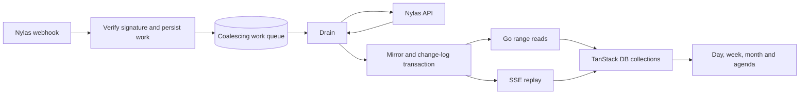

<Danger>
**Updated for using JEV** — QA reviewed 2026-09-19. Two optional pilots cover future Akira calendar intent and evidence support for meeting context; the new [NL Date Picker](/guides/open-work/roadmap/calendar-view/nl-date-picker) adds a separate optional J03 date-mention selection pilot. Akira is spec only, not implemented. The sync engine, date math, permissions and rendering stay deterministic. Read the [Akira scope and prompts](/guides/open-work/roadmap/akira/jev), [Calendar JEV boundaries](/guides/open-work/roadmap/calendar-view/jev) and [build-plan QA findings](/guides/open-work/roadmap/calendar-view/qa-review) before implementation.
</Danger>

<Note>
**Status: new build plan — 2026-09-19.** This section replaces the retired Calendar plan. It combines the four supplied files into a backend mirror plan and a frontend build brief. The SQL and Go files are reference implementations with identified gaps; no migration, provider backfill, frontend build or performance evaluation has been run by this documentation change.
</Note>

The calendar gives an operator a full-screen day, week and month view with Orbiter context beside each meeting. The grid answers “what is my week”; the agenda panel answers “who am I about to see, how do I know them, and what happened last time.” The target is an operator with 20–40 meetings each week across two or three connected calendars.

## Two halves, one contract

| Half | Source and destination | Responsibility |
| --- | --- | --- |
| Backend | `calendar-mirror/schema.sql`, `reconcile.go`, `webhook.go` | Go workers reconcile Nylas into AlloyDB. The UI reads the mirror and follows its change stream. |
| Frontend | Sections 1–6 of `calendar-frontend-agent-brief.md` → `orbiter-frontend/docs/calendar/BRIEF.md` | React 19 and TanStack Router, Query, DB, Virtual and AI provide the custom calendar surface. Temporal handles date/time arithmetic. |
| Execution | Eight prompts from section 7 | Deliver Phases 0–7 in order, with explicit definitions of done. |
| Review | Section 8 plus the integration gates | Explain the prompt structure, record contract gaps and require measured proof before release. |

[Download the complete handoff bundle](/assets/calendar-view/calendar-view-handoff.zip). The bundle preserves the three backend reference files, the complete original frontend brief, and the extracted `BRIEF.md`. The [source register](/guides/open-work/roadmap/calendar-view/sources) identifies exact contents and their status. Copying files into application repositories is a later implementation step.

## QA changes to the build

The [QA pass](/guides/open-work/roadmap/calendar-view/qa-review) found a missing-event nil dereference in the supplied reconciler, differences from Orbiter's existing versioned/enveloped calendar API, ownership checks needed before reusing mutation paths, legacy numeric versus UUID person identifiers, and a widget adapter that drops all-day events. Phase 0 now includes those migration decisions and the missing dependency inventory.

JEV is an optional experiment in Phases 5–6, with exact Decisions prompts, synthetic responses, fallback rules and held-out evaluation gates on the dedicated [Akira page](/guides/open-work/roadmap/akira/jev). It must demonstrate a benefit over an implemented baseline. Existing scoped outcome-chat code is a reuse candidate, not a completed Akira assistant. The core calendar must work with Akira and both pilots unavailable.

## Navigation and shared event data

Open the full Calendar View from **Cmd-K → Navigation → Calendar View**, by typing **`0 0`**, or through the **top-left workspace icon navigation**. A single **`0`** opens the agenda side panel on **today** while preserving the current workspace view. One sequence controller resolves the single/double-zero overlap without flashing the agenda.

The [navigation and shared-cache addendum](/guides/open-work/roadmap/calendar-view/navigation-and-cache) records the implementation seams and source audit. The existing widget warms an in-memory **14-day** feed from the persistent header, but the backend only reads its first **50 events per calendar**, the adapter drops all-day events, and no calendar push-to-browser cache updater is present. Plan a **60-day forward warm window** shared by the widget, full calendar and agenda, with complete mirror coverage and resumable SSE updates. This is proposed build scope, not existing webhook-driven frontend behavior.

The [Agenda and scheduling addendum](/guides/open-work/roadmap/calendar-view/agenda-and-scheduling) locks **no-scroll month paging**, a **context-rich List / visual Timeline** agenda, range-to-scheduler behavior, **fuzzy contact search or direct email invites**, and real **Nylas-backed event creation and invitation delivery**. These decisions supersede the source's infinite month scrolling and bare agenda-list direction. Interactive design previews remain synthetic and disconnected from calendars.

The left panel also has a visible **Calendar account** selector showing the connected email/provider, with switching for multiple accounts and a clear **New events in** calendar destination. Switching shows that account's events and uses it for new meetings. **FREE / OPEN time still checks all calendars selected for availability across connected accounts.** Read the [account-selection rules](/guides/open-work/roadmap/calendar-view/navigation-and-cache#active-calendar-account-in-the-left-panel), including cross-account conflict display and draft preservation.

## Performance is part of the build

The [performance requirements](/guides/open-work/roadmap/calendar-view/performance) make speed an acceptance condition for the implementing agent: immediate local interaction, one normalized cache, incremental rendering, bounded background work, fast guest search and measured provider synchronization. Keep all nine original budget slots, replacing obsolete month scrolling with month paging, and add explicit agenda, scheduler, stream, memory and backend gates. JEV and Nylas must not block local calendar navigation or manual input. These are unmeasured build requirements, not an implementation claim.

## Architecture

The webhook performs signature validation and durable queue admission; it does not fetch Nylas or reconcile events. Provider operations belong to `Drain`. Recurring work is coalesced by `(grant, master_id)`; every new notification moves its scheduled reconcile later without invalidating an active lease.

The supplied Google burst—override `event.created` plus `event.updated`, with no master webhook—and Microsoft burst—master `event.updated` plus override `event.created`—are fixtures for the same result: one quiet-window `ReconcileMaster`, followed by a complete paginated list of that master's window including cancelled instances and a diff against the mirror. Treat these as required provider cases, not an exhaustive guarantee about delivery order. Notifications received during a running reconcile must survive as follow-up work.

Rate limiting pauses the whole grant across replicas. Each mirror mutation and its `calendar_change` row commit together. Exact SSE replay also needs ordered publication and a snapshot/resume contract: atomic insertion alone does not make a `bigserial` cursor safe under concurrent commits. These implementation obligations are spelled out in [reconciliation and SSE](/guides/open-work/roadmap/calendar-view/backend/reconciliation).

Foreground create/move/delete/availability routes still use the fixed Go API. Their provider work must respect the Drain-only rule; the supplied files contain only mirror reads. Resolve command dispatch, completion and timeout behavior under [G02](/guides/open-work/roadmap/calendar-view/integration-gates#g02) before wiring those endpoints. The browser never calls Nylas.

## Read and build

<CardGroup cols={2}>
  <Card title="Backend schema" icon="database" href="/guides/open-work/roadmap/calendar-view/backend/schema">
    Six reference tables, storage ownership and schema changes required before migration.
  </Card>
  <Card title="Webhook and queue" icon="arrows-rotate" href="/guides/open-work/roadmap/calendar-view/backend/webhook">
    Signature handling, burst coalescing, leases, acknowledgements and grant-wide backoff.
  </Card>
  <Card title="Reconciliation and SSE" icon="list-check" href="/guides/open-work/roadmap/calendar-view/backend/reconciliation">
    Master-window diff, cancellation, all-day dates, coverage and exact change delivery.
  </Card>
  <Card title="API integration" icon="plug" href="/guides/open-work/roadmap/calendar-view/api-contract">
    The fixed route/type contract, storage-to-DTO mapping and client/server responsibilities.
  </Card>
  <Card title="Frontend brief" icon="calendar" href="/guides/open-work/roadmap/calendar-view/frontend/brief">
    Sections 1–6: constraints, collections, views, interactions, design and performance budgets.
  </Card>
  <Card title="NL Date Picker" icon="calendar-days" href="/guides/open-work/roadmap/calendar-view/nl-date-picker">
    Shared natural-language and manual date/time input, component contracts, open-source research and JEV evaluation.
  </Card>
  <Card title="Phase 0: read and plan" icon="magnifying-glass" href="/guides/open-work/roadmap/calendar-view/frontend/phase-0">
    Begin with installed type definitions and API-gap review before application code.
  </Card>
</CardGroup>

## NL Date Picker

The [NL Date Picker specification](/guides/open-work/roadmap/calendar-view/nl-date-picker) defines a reusable input combining natural language, a manual calendar, time/zone fields and one validated draft. It includes open-source research, explicit ambiguity/DST behavior and the optional J03 pilot. It is spec only, not implemented, and works independently of Akira. Its separate build slices extend the original Calendar plan; the preserved source prompts remain unchanged.

## Frontend delivery sequence

| Phase | Deliverable | Exit evidence |
| --- | --- | --- |
| [0 — Read and plan](/guides/open-work/roadmap/calendar-view/frontend/phase-0) | File tree, installed exports/signatures, resolved assumptions and API gaps | Reviewable plan; no application code |
| [1 — Data layer and fixture](/guides/open-work/roadmap/calendar-view/frontend/phase-1) | Deterministic fixture, MSW contract, collections, SSE, mutations and `packDay` | Property tests, zero-fetch navigation, live-query update without refetch |
| [2 — Shell, week and day](/guides/open-work/roadmap/calendar-view/frontend/phase-2) | Layout, grid, chips, mini-month, today and now-line | DST tests, screenshots and profiler numbers |
| [3 — Month and agenda](/guides/open-work/roadmap/calendar-view/frontend/phase-3) | No-scroll month paging, context agenda List and visual Timeline | Month-paging/overflow trace and 500-record agenda timing |
| [4 — Interactions](/guides/open-work/roadmap/calendar-view/frontend/phase-4) | Create, move, resize, keyboard, recurrence scope and rollback | Pointer/keyboard tests, no React commits during drag |
| [5 — Event detail](/guides/open-work/roadmap/calendar-view/frontend/phase-5) | People context, join action and shared editing fields | Required detail screenshots, existing resolver reuse |
| [6 — Akira tools](/guides/open-work/roadmap/calendar-view/frontend/phase-6) | Five validated tools over the same queries/mutations | One availability call and one insert in the booking scenario |
| [7 — Performance and critique](/guides/open-work/roadmap/calendar-view/frontend/phase-7) | Production profiling and design refinement | Every applicable gate, raw before/after measurements and named removals |

Fixture-backed frontend work can proceed after Phase 0 while the backend is completed. Live integration requires the relevant [contract and backend gates](/guides/open-work/roadmap/calendar-view/integration-gates). An unresolved API gap is a flagged stub, not permission to invent a field or endpoint.

## Design and measurement

Use one deliberate saturated accent: today's column header and the now-line. Use tabular figures, hairline grid lines and neutral surfaces with restrained calendar-color tints. No calendar-library layout, card containers, chip shadows or gradients. Popovers get one small shadow. Participant “cards” in the supplied brief mean the existing people information presented as flat rows, consistent with the no-cards direction.

The shared fixture contains **5,000 events over 26 weeks and eight calendars**, with fixed recurrence, participant, all-day and multi-day proportions. Every performance report uses the same seed and measurement environment. The [brief's budgets](/guides/open-work/roadmap/calendar-view/frontend/brief#5-performance-budgets) are release gates, not claimed results.

Every visual phase supplies 1440×900 and 1920×1080 screenshots, a concrete critique, and one element removed. A week-view/agenda reference design can be added later; no reference screenshot or completed UI is claimed here.

<Warning>
**First-backfill correction:** current Nylas documentation describes Google/Microsoft `datespan.end_date` as the next day, an exclusive end. The supplied `bounds` helper adds another day. Correct the provider normalization and verify it against real Google and Microsoft grants before enabling backfill. See the [all-day contract](/guides/open-work/roadmap/calendar-view/backend/reconciliation#all-day-and-time-normalization).
</Warning>

## Acceptance record

| Evidence | Current state |
| --- | --- |
| Supplied files reviewed and organized | Documented in this section |
| Source/type and integration gap register | [Open implementation gates](/guides/open-work/roadmap/calendar-view/integration-gates) and [QA findings](/guides/open-work/roadmap/calendar-view/qa-review) |
| JEV opportunities | J01/J02 assistant pilots plus separate NL Date Picker J03; no live evaluation or integration run |
| Backend compilation, migrations and concurrency tests | Not run |
| Google/Microsoft first backfill and all-day fixtures | Not run |
| Frontend installed-type inspection and implementation | Phase 0 onward; not run |
| Performance measurements and UI screenshots | Not run |
