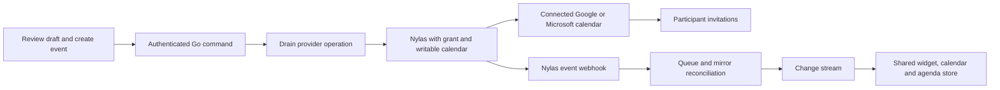

[Calendar View](/guides/open-work/roadmap/calendar-view) · [Navigation and shared cache](/guides/open-work/roadmap/calendar-view/navigation-and-cache) · [NL Date Picker](/guides/open-work/roadmap/calendar-view/nl-date-picker)

<Note>
**Design decisions — 2026-09-19.** These requirements extend the supplied brief. Interactive previews use synthetic events and contacts; they are not connected to Nylas and send no invitations. The production calendar, scheduler and provider integration remain build work.
</Note>

## Full month: no scrolling

The full-screen month view has **no vertical or horizontal scrolling**. Previous/Next moves by **one calendar month**, not a fixed four-week offset. Fit the month's four, five or six week rows into the available canvas while preserving the existing header, top-left icon navigation and command widget. Dense days use “+n more” and a day/detail surface rather than growing the month grid.

This decision **supersedes** the source brief's infinite month scrolling, fixed 120 px month rows and Phase 3's 30-screen month-scroll gate. Use the same deterministic fixture, but measure month paging and overflow at 1440×900 and 1920×1080, including February and six-row months. Inside loaded coverage, paging performs zero network requests. Virtualization may remain for long agenda lists; the no-scroll decision here applies to the full month canvas, not to reading an overflowing event description.

## Agenda: context list and visual timeline

Keep the selected B daily agenda shell and date navigation, with **List / Timeline** modes over the same day, calendars and selection. Match contact/company side-panel sizing and behavior.

- **List uses the context-rich meeting-prep direction**, rather than a bare chronological time/title list: meeting time and duration, title, participant identities, company/relationship context, why the meeting matters when supported, and expandable preparation notes. Keep it chronological and use flat sections. Today starts with ongoing/upcoming meetings. Missing context is absent or labeled unknown; no invented relationship or meeting history.
- **Timeline** uses proportional event blocks, a time gutter, now-line and labeled free gaps. Overlapping events occupy separate columns. Cancelled events do not block time; honor `busy` and the agreed participant/decline policy. All-day busy events must participate in availability.
- Both modes expose open intervals with their time range and duration. Derive availability from complete coverage of the intended calendars and the user's working hours/timezone. Widget visibility filters, absent data and failed grants must never imply that the user is free.
- “Open” means the user's own calendar window is open. It does not claim that prospective guests are available. Guest availability is a separate authorized provider check.

## Opening the scheduler

| Action | Result |
| --- | --- |
| Select a date in the agenda's day strip | Navigate the agenda to that day. Do not unexpectedly open a create form. |
| **New event** for the selected day | Open the shared scheduler on that date with a proposed editable time. |
| Click an open interval in List or Timeline | Open the scheduler with that date and a duration fitting the interval. |
| Drag a time range in Timeline | Preview the selected range, then open the scheduler with its start/end on release. Escape/pointer cancellation makes no event. |
| Click an existing meeting | Open its event detail; Edit reuses the same scheduler fields. |

Date/time controls use the selected **#3 Week planner NL Date Picker** once its core passes: manual date/time, natural language, or a combination, all editing one draft. The picker’s Apply action updates the scheduler draft only. The scheduler owns title, writable calendar/account, guests, location/conferencing and the final Save action. Preserve a fully manual route while the shared picker is unfinished.

Use the [active calendar account and destination rules](/guides/open-work/roadmap/calendar-view/navigation-and-cache#active-calendar-account-in-the-left-panel). New drafts inherit the selected account/calendar, repeat that identity visibly and preserve it when the user changes the rail later. Existing event actions retain the event's original identity. Always verify destination membership/write permission server-side; a connected mailbox alone is not permission to create calendar events.

## Invite people: search or type email

Use one labeled **Invite people** field with removable selected guests:

1. Search by name, email or company with partial and typo-tolerant matching. Each result shows enough identity to disambiguate: name, company and the actual invite email. An explicit selection adds the guest; never silently choose the top fuzzy match.
2. Accept direct external email addresses and pasted comma/semicolon/newline-separated addresses. Validate each address, keep invalid entries editable, and deduplicate according to the application's email-identity rules. Do not strip plus tags or provider-specific dots indiscriminately.
3. If a person has multiple addresses, show the alternatives and let the user select which to invite. If no address is available, ask for one; do not invent it or silently omit the guest. Preserve a known person's UUID alongside the selected address for context.
4. Support keyboard selection, removal, screen-reader announcements, loading/error/no-match states and cancellation of stale search results. A failed search must not prevent direct email entry. Do not silently accept an unresolved name when Save is pressed.
5. Show the exact calendar/account, date/time/timezone and complete guest list before **Create event & send invites**. Date selection, contact search, natural-language interpretation and editing a draft never send anything. No guest is marked accepted until the provider supplies that RSVP.

### Existing reuse points and the fuzzy-search gap

The frontend already has `src/features/contacts/api/use-search-contacts.ts`, used by `src/features/email-composer/components/recipients-sidebar-contents/to-email-input.tsx` and the recipient dropdown. Reuse the contacts transport, identity adapter and recipient interaction patterns, with state owned by the scheduler draft rather than the email composer store. Do not pull collection/team bulk-invite behavior into a simple event guest picker without separate scope.

The inspected search hook requests `/v1/contacts?query=...&limit=20` and describes a case-insensitive **name** filter. That does not establish typo-tolerant name/email/company search. Phase 0 must verify or extend the existing search contract and candidate retrieval. Reranking the first 20 exact-name results cannot recover a typo match that the backend never returned. Require a bounded, authorized fuzzy-search implementation and regression cases; an LLM/JEV is not needed to guess who should receive an invitation.

## Production writes go through Nylas

**Yes: creating a meeting and inviting people must update the selected real connected calendar and send its invitations.** The intended path is:

Pass the selected grant/calendar, validated times and exact participant emails to Nylas. Explicitly request participant notification in the **query parameter** `notify_participants=true`, rather than relying on a default or a similarly named body property. Nylas documents Microsoft as always sending event-change notifications, even when that flag is false. The selected grant must have calendar-write permission. [Nylas Create event](https://developer.nylas.com/docs/reference/api/events/create-event/) · [Events permissions and notifications](https://developer.nylas.com/docs/reference/api/events/)

Edits, time moves, attendee changes, cancellations and RSVP must reach the provider through the same authorized service boundary and return through reconciliation. Invitations do not mean attendees have accepted; the attendee's provider determines how an invitation appears. Real connected calendars are the acceptance target, not a local-only or virtual-calendar substitute.

Respect the existing Drain-only boundary and close [G02](/guides/open-work/roadmap/calendar-view/integration-gates#g02) for foreground command completion. A queued operation is **pending**, not a confirmed provider event or a sent invitation. Replace the optimistic row with the returned provider identity; reconcile webhook-before-response races into one event. Failed or uncertain writes need explicit recovery and deduplication, so retries do not create two meetings or send duplicate invitations. Read-only calendars, expired grants and insufficient permissions must fail with an actionable state.

Audit the existing Go transport before reuse: `internal/clients/nylas/types.go:CreateEventRequest` contains a `notify_participants` JSON body member, while `internal/platform/nylas/events.go:CreateEvent` currently constructs a URL with only `calendar_id`. The live scheduling implementation must test the outgoing query placement and participant payload against the current Nylas contract. The existence of a low-level create helper is not a completed Calendar UI write path.

Follow [Performance requirements](/guides/open-work/roadmap/calendar-view/performance) for immediate agenda/scheduler paint, isolated draft state, bounded debounced guest search, deferred meeting context and pending-versus-confirmed write timing. Nylas and optional AI must never block local editing.

## Phase additions and delivery evidence

- **Phase 0:** settle the scheduler write DTO, writable account/calendar choice, notification policy and contact-search/UUID adapter. Read this alongside the navigation/cache addendum.
- **Phase 3:** implement the context List and proportional Timeline modes. Replace the superseded infinite-month requirement with no-scroll month paging and dense-day overflow checks.
- **Phase 4:** integrate click/range creation, manual/NL draft editing and guest selection with the shared mutation layer. Test valid/invalid external emails, duplicates, typos, ambiguous names, multiple addresses, search failure, stale results, keyboard focus, cancellation and read-only state.
- **Phase 5:** resolve supported context into the List and event detail, and preserve guests when opening Edit. Provider writes remain disabled until their integration gates pass.
- **Live acceptance:** use explicitly authorized test Google and Microsoft calendars and test attendees. Create once, verify the provider event and invitations, move it and verify the update, cancel it and verify cancellation, then process an RSVP. Reopen after a reload and confirm the provider identity, shared-cache state and no duplicate event. Do not use real contacts as incidental test recipients.
- **Synchronization evidence:** external provider edits/deletes update all three surfaces through webhook → mirror → SSE; connection failure is visible. No reload should be needed for a healthy stream.

[Download this addendum](/assets/calendar-view/AGENDA-AND-SCHEDULING.md.txt). It ships as `frontend/docs/calendar/AGENDA-AND-SCHEDULING.md` in the [handoff bundle](/assets/calendar-view/calendar-view-handoff.zip). The original source sections are retained as reference; these decisions supersede their conflicting month-scroll and simple-list requirements.
