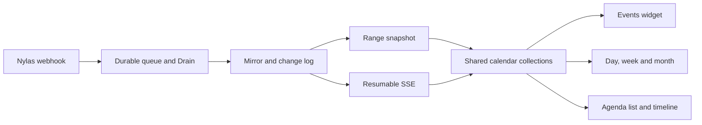

[Calendar View](/guides/open-work/roadmap/calendar-view) · [Frontend brief](/guides/open-work/roadmap/calendar-view/frontend/brief) · [Integration gates](/guides/open-work/roadmap/calendar-view/integration-gates#g14)

<Note>
**Build-plan addition — 2026-09-19.** Navigation requirements are agreed scope. The 60-day warm window is the proposed data policy, with implementation and coverage gates below. Source inspection confirms the current behavior; it does not establish what is deployed. No application code or live calendar data was changed by this review.
</Note>

## Navigation

| Entry point | Required behavior |
| --- | --- |
| **Cmd-K → Navigation → Calendar View** | Open the full-screen Calendar View through the existing command palette. Preserve its Ctrl-K equivalent. |
| **`0 0`** | Type the number zero twice to open the same full-screen Calendar View. This is a sequence, not a chord or the letter O. |
| **`0`** | Open the agenda side panel on **today**, while keeping the current workspace view. If already open, select today and bring the agenda into focus; do not toggle it closed. |
| **Top-left icon navigation → Calendar View** | Add Calendar View to the existing workspace icon switcher, with its usual selected state, tooltip and keyboard behavior. |

All three full-screen entry points call the same navigation action and restore the last calendar date/view; first use opens the month containing today. Here, “full-screen” means the application's full Calendar View, retaining Orbiter's shared header and command widget. It does not invoke browser fullscreen.

The top-left `WorkspaceViewSwitcher` and the centered `Widgets` strip are different components. Extend the existing top-left navigation; keep the header and its event-data subscription mounted when entering or leaving Calendar View. The single-zero action uses the shared agenda panel, including its List/Timeline modes and the same width/layout behavior as contact/company panels. It resets the selected day to today without discarding the user's preferred agenda mode.

### Resolve the single-zero / double-zero overlap

Use one shortcut controller in the authenticated workspace shell. The initial sequence timeout is **400 ms**:

1. First unmodified `0`: hold the action until the timeout; show neither a panel nor a route change yet.
2. Second `0` within 400 ms: cancel the pending single-zero action and navigate to Calendar View exactly once. There must be no agenda flash.
3. Timeout after one `0`: open the agenda on today. A later `0` starts a new sequence.

Ignore key repeat and IME composition. Do not intercept typing in inputs, selects, textareas, contenteditable areas or textboxes, or while the command palette, date picker or another modal owns keyboard focus. Modified keys are not this shortcut. Cancel pending sequences on another key, blur, navigation, scope change or unmount. Provide the palette/icon paths and a way to disable character shortcuts. Do not register `0` and `0 0` as independent `useHotkeys` handlers: both would compete for the first key.

## Active calendar account in the left panel

**Confirmed requirement — 2026-09-19:** place a labeled **Calendar account** selector at the top of the full Calendar View's left rail, above the mini-month/calendar list. Always show the active connected email address and provider. If multiple calendar accounts are connected, let the user switch between them and show a checkmark on the current selection. With one account, keep the identity visible without an empty dropdown. Match the existing Orbiter controls and compact navigation styling.

An email account and a calendar are not interchangeable: one connected account/grant can own several calendars. Under the account control, show that account's calendars and an explicit **New events in** destination. Remember the last valid writable destination for that account. On first use, use its provider-designated primary calendar only if writable; otherwise use its sole writable calendar, or require an explicit choice when several remain. Never fall back silently to a calendar in another connected account. A mailbox's default email-sending flag does not establish the default calendar. Calendar account selection does not change the email inbox's account selection or the default email-sending preference.

| Situation | Required behavior |
| --- | --- |
| Multiple accounts | Show full email/provider in the switcher, the selected account, and connection/permission status. Persist the last selected grant and per-grant destination within the signed-in user/workspace. Do not infer identity from a display name. |
| New scheduler draft | Inherit the active account and its valid writable calendar; repeat both visibly in the scheduler. The user can explicitly choose another authorized destination before Save. |
| Account switched with a draft already open | Preserve the draft's chosen account/calendar. Switching the rail affects future drafts; changing this draft's destination requires its own explicit control. Do not discard entered guests or retarget an in-flight mutation. |
| Existing event opened/edited | Use the event's original grant/calendar for edit, delete and RSVP, regardless of the active account in the rail. Cross-account transfer is not implied by switching or moving a date. |
| Read-only account/calendar | Allow browsing available data and label read-only. Disable creation into that destination and explain the state. Do not create elsewhere automatically. |
| Expired/revoked account or missing calendar access | Show Reconnect or the existing permission/setup flow. A connected email account alone does not prove calendar read/write permission. Keep cached content clearly stale when appropriate; block affected writes. |
| No accounts or selected grant removed | Show Connect calendar or Choose calendar account. Preserve unsent drafts with an invalid-destination message until the user explicitly selects a valid destination. |
| Left rail collapsed or agenda opened from another view | Keep account identity accessible through a compact control in the calendar/agenda header, and show the full destination in the scheduler. Never hide which account will receive a new event. |

Selecting another connected account is a **local selection change**, not an Orbiter login/workspace switch. Keep the shared normalized store, other authorized grants and stream alive. Use stable owner/grant/calendar identities in selectors and pending operations. Switching between already covered accounts performs zero range/provider requests, preserves the selected date/view and meets the warm-control 100 ms p95 paint target. Missing coverage can load in the background with a visible incomplete state.

### Account display and availability decisions

**Confirmed by the user — 2026-09-19:**

| ID | Decision | Required behavior |
| --- | --- | --- |
| A01 | What does switching the active account do to displayed events? | **Show only the selected account's enabled calendars and use that account for new meetings.** Preserve date/view. The Calendar View and its linked agenda change together. The standalone agenda uses the same active account; an explicitly opened existing event detail keeps its own account identity. |
| A02 | Which calendars block FREE / OPEN time? | **Check all calendars selected for availability across connected accounts**, independently of the active account or display visibility. Keep this selection explicit and separate from display toggles. |

Label the free-time scope **Availability across selected calendars** and provide access to that calendar selection grouped by connected email account. An interval occupied only by another account must not appear OPEN. In the Timeline, use a neutral blocked interval labeled **Busy on another calendar**, with the account/calendar identity available to the authorized user; keep its full event out of the active account's event list. In the context List, exclude the other account's meeting from the meeting rows and calculate gaps around its occupied interval. This preserves selected-account event browsing while explaining cross-account conflicts. Details still require their normal authorization; never expose another user's calendar.

For example, with Work active and a Personal meeting at 14:00–15:00 on an availability-selected calendar, the Work event list excludes that Personal meeting, but 14:00–15:00 is unavailable for suggested open time. A Work event created at 15:00 goes to the reviewed Work destination. Switching to Personal changes visible meetings and the default for new drafts, without changing the availability set.

Hiding a calendar for display must not silently change availability membership. On initial setup, propose the user's own calendars with working calendar-read access for inclusion; show the resulting selection and let them exclude calendars such as holidays/shared reference feeds. Existing availability preferences take precedence. Newly connected calendars require a visible inclusion choice. Missing, stale or failed coverage on an included calendar makes availability incomplete; do not silently exclude it to produce OPEN gaps. Manual draft input remains usable with the incomplete/conflict state disclosed. Guest availability remains a separate check.

### Existing account metadata and implementation gate

The inspected frontend `src/features/email-integration/api/use-nylas-grants.ts` already reads `/v1/nylas-grants` and exposes `grant_id`, `email_account`, `provider`, `grant_expired` and `primary_for_sending`. Reuse that authenticated query/metadata through an explicit adapter. `primary_for_sending` is an email preference, not a calendar-write permission or destination. A separate `types/nylas.ts` schema uses different names (`email`, `grant_status`); do not select the wrong shape by name alone.

The supplied `/calendar/grants` contract only lists `grantId, provider, status`, so it cannot supply the requested email label on its own. Phase 0 must approve the metadata join/adapter using trusted matching grant IDs, calendar read/write capability, reconnect actions and persistence for the active account/destination and availability selection. Keep view preference state distinct from server authorization. This addendum does not silently add fields to the fixed HTTP DTOs.

Acceptance includes two accounts on the same provider, mixed providers, multiple calendars per grant, identical event IDs in different grants, no writable destination, expiry/removal, account switching during draft/save, editing another account's event and collapsed-rail access. Verify that writes use the reviewed destination and authorization, and that switching accounts leaves stream count and covered-range request count unchanged.

## What is implemented today

Inspected the canonical `dev_work` checkouts: `orbiter-frontend` at `d78b32f6` and `orbiter-backend` at `0c5b417`. The relevant inspected files had no local modifications. These findings describe source, not a live network capture.

| Finding | Evidence and consequence |
| --- | --- |
| Events load before the widget is opened | `src/components/global/widgets.tsx` calls `useWidgetCalendarEvents()` from the mounted shared header for its badge count. `WorkspaceShell` retains that header across its supported workspace routes. Calendar View must join that lifecycle; the current route allowlist has no calendar entry. |
| The feed covers **the next 14 days** | Frontend `src/features/events/api/use-widget-events.ts` calls parameterless `GET /v1/calendar-events`. Backend `internal/features/calendars/service.go:ListCalendarEvents` sets `start = now` and `end = now + 14 × 24 hours`. This is not a complete local-day or historical window. |
| The current read goes to Nylas | The service lists widget-enabled calendars and calls `nylasapi.ListEvents` for each. This widget read path is not a mirror snapshot or the planned Drain-only implementation. |
| Coverage can stop at the first **50 events per calendar** | That service requests `Limit: 50` once and does not consume `NextCursor`; `internal/platform/nylas/events.go:ListEvents` makes one request. A separate `EachEventPage` helper exists, but this feed does not use it. Changing 14 to 60 alone would not provide complete coverage. |
| The widget cache is in-memory TanStack Query data | `widgetCalendarEventsQueryOptions()` uses `["calendar-events-widget"]`. `WIDGET_QUERY_LIFECYCLE` disables refetch/retry on another component's mount. `root-provider.tsx` sets `staleTime: 0`, focus refetch and reconnect refetch. No calendar persistence layer or explicit `gcTime` is configured in this path; a reload starts a new query cache. |
| There are **two cache entries for the same fetch** | `calendarEventsQueryOptions()` uses `["calendar-events"]` but delegates to `fetchWidgetCalendarEvents()`. It retains the default mount-refetch behavior. Its “Xano-backed” hook comment is stale relative to its actual implementation. Meeting-prep/copilot/person-sheet consumers therefore do not automatically share the widget's cache entry. |
| The rendered widget is a lossy projection | Its adapter skips events without numeric `when.start_time/end_time`, including all-day dates. `selectUpcomingEvents` removes ended events and sorts every minute. Today / 7 days / 14 days are additional UI filters. These results cannot establish full-day availability or month coverage. |
| Provider webhooks do not directly update this browser cache | No calendar SSE/WebSocket subscription or push-to-cache updater was found in the frontend. The one-minute timer only re-filters already cached rows. Focus, reconnect, explicit refresh and mutation invalidations are the current refresh paths. |
| Mutation invalidation is split | RSVP and calendar-preference hooks update/invalidate both keys. The successful connection callback in `use-connect-email.ts` invalidates `["calendar-events"]` but not `["calendar-events-widget"]` or `["calendars"]`. Consolidation must cover connection/reconnection as well as mutations. |

The current event type already carries calendar/grant identity, participants, organizer, `busy`, `read_only`, status and timestamps. Reuse its transport/identity integration where appropriate, but normalize into the fixed Calendar DTO **before** applying a widget-specific display filter. Keep the ownership, all-day and UUID corrections from the [QA review](/guides/open-work/roadmap/calendar-view/qa-review).

## Proposed 60-day warm window

**One shared event store serves the widget, full calendar and agenda.** Reuse the persistent header's eager-loading behavior, then move all consumers onto the same validated collections and live queries from Phase 1. Avoid a third separately fetched calendar cache.

The initial warm range is **`[start of today, start of today + 60 calendar days)` in the user's timezone**, converted to API instants using Temporal. This includes the earlier hours of today, ongoing events crossing its start and all-day/multi-day overlaps. It is a forward preload minimum, not a cap on calendar navigation. Its required calendar set includes the active account's displayed calendars and all calendars selected for availability across accounts; each interval/calendar needs its own completed coverage.

Reconcile this addition with the original four-week margins:

- Warm those 60 forward days once the authenticated shared data owner is ready, without blocking unrelated workspace navigation. Hydrate usable cached data immediately while missing intervals load.
- When Calendar View opens, take the union of that warm range with `[visibleStart - 4 weeks, visibleEnd + 4 weeks]`. Fetch only missing coverage; deduplicate overlapping in-flight requests. Keep the original eight-week edge extension for navigation beyond loaded ranges.
- Retain past rows needed by a visible day/week/month. The widget can still show upcoming-only Today / 7 / 14-day slices without limiting what the shared store retains. Those controls do not need to become a 60-day rendering of event cards.
- Advance the forward minimum at local midnight and recheck on resume, timezone change and calendar/grant changes. Webhooks do not discover every new recurrence occurrence at the advancing horizon; backend horizon extension/backfill remains required.
- Complete the backend range/envelope agreement under [G02](/guides/open-work/roadmap/calendar-view/integration-gates#g02) and [G05](/guides/open-work/roadmap/calendar-view/integration-gates#g05). The existing parameterless feed has no approved 60-day request argument. Serve the agreed range from the webhook-maintained mirror, with provider work through Drain and all pages reconciled; do not implement the proposal by silently adding query parameters or increasing the current provider call's day count.

Use a signed-in Orbiter user/workspace-scoped store, loaded-range metadata and cursor ownership, with rows scoped to their connected grant/calendar. Calendar visibility and widget preference are view filters, not proof that all calendars relevant to availability have been fetched. On an **Orbiter authentication or workspace change**, tear down the stream and clear the previous owner's client rows, pending UI work and cursor; recover already-submitted server operations through their authorized owner instead of replaying them blindly. Switching the active connected calendar account within that owner does **not** clear the store or restart the stream. Record the complete intended calendar set and coverage before labeling gaps “Open.” Partial pages, failed grants, stale snapshots and missing ranges must show incomplete/updating state, not false free time.

## How webhooks keep the shared store current

The missing browser delivery step is the planned `/calendar/stream`, subject to the existing versioned API and authentication decision. Own one subscription in the shared authenticated lifecycle, even when the full calendar is closed. Apply normalized upserts/deletes to the shared collection; widget counts, grid chips and agenda gaps derive from it together. Use the snapshot/cursor handoff, ordering, reconnect and expired-cursor recovery in [G04](/guides/open-work/roadmap/calendar-view/integration-gates#g04). Never resume a saved cursor against an empty cache after a reload without re-establishing a compatible snapshot.

Consolidate RSVP, event edits, connection/reconnection and calendar preferences around the shared store. During migration, legacy hooks may remain as compatibility selectors, but must not keep making parallel network requests for an independent copy of the same events. Preserve a recovery refresh for stale or disconnected data. Healthy covered navigation should not refetch on every mount or provider notification. No JEV or LLM call belongs in these decisions.

Apply the [performance requirements](/guides/open-work/roadmap/calendar-view/performance) to foreground loading, bounded warm-up, cache retention/eviction, incremental changes and measured request counts. Cache speed does not replace coverage correctness.

## Phase instructions and acceptance

| Phase | Addition to the existing build prompt |
| --- | --- |
| **0** | Read this addendum; inspect the named current files, finalize the shared cache owner, route/panel state, 60-day range contract, coverage and snapshot/stream handoff. Resolve G14 without treating the current widget response as a complete calendar. |
| **1** | Warm the forward 60-day range; migrate the widget and other event consumers to shared collections; implement missing-range loads and one stream owner. Keep the 5,000-event benchmark fixture unchanged. |
| **2** | Add Cmd-K → Navigation → Calendar View, the top-left icon entry and the shared `0` / `0 0` controller. Keep the existing header mounted on the calendar route. |
| **3** | Wire `0` to today's agenda, retaining its List/Timeline mode and shared side-panel sizing. Calculate visible free gaps from complete normalized data across the intended calendars. |

Required evidence:

- Keyboard tests for one zero, two zeros within 400 ms, a late second zero, held-key repeat, editable fields, IME, active dialogs and unmount/blur. One sequence produces exactly one action; `0 0` never opens the agenda first.
- Palette, icon and double-zero navigate to the same view; single-zero opens today's agenda from another workspace view and from Calendar View. Existing navigation and command widget remain visually consistent.
- A provider fixture with **more than 50 events on one calendar**, all-day and spanning events, cancellations, recurring instances and a failed final page. A complete 60-day range is claimed only after all calendars/pages are covered.
- Raw fetch counts showing a shared initial load, no duplicate widget/calendar feed, and **zero additional range fetches for navigation inside already loaded coverage**. First opening an uncovered historical month is allowed to load its missing interval.
- One scripted upsert/delete updates widget, calendar, agenda and open-time calculations without a reload. Test a provider-normalized mutation echo, replay duplicates, reconnect, snapshot races and account switching.
- Record 14-day versus 60-day row counts, response bytes, load time and retained client memory; retain the existing render budgets. No performance improvement or production-ready webhook stream is claimed until measured.

[Download this addendum](/assets/calendar-view/NAVIGATION-AND-CACHE.md.txt). It is included as `frontend/docs/calendar/NAVIGATION-AND-CACHE.md` in the [handoff bundle](/assets/calendar-view/calendar-view-handoff.zip). The supplied source brief and original phase prompts remain preserved; this addendum extends their navigation and minimum preload policy.
