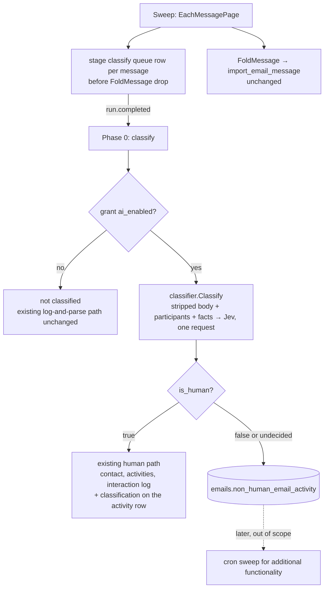

<Danger>
**Not Ready for Dev yet - still scoping.** Design and smoke evidence as of 2026-09-22. The Go classifier package exists and is unit-tested in `orbiter-backend`, but nothing is wired into the sweep, no table exists, and no action is triggered. Thresholds are starting points, not measured settings.
</Danger>

<Info>
**AI accounts only.** The classifier runs **only** on email accounts with AI features enabled (`nylas_grants.ai_enabled = true`). Accounts with AI off are not classified at all: no queue row, no Jev call, no rules-only fallback. Their mail follows today's log-and-parse path unchanged.
</Info>

<Note>
**AI-off accounts: legacy path.** For email accounts that do **not** enable AI features, the legacy log-and-parse process decides human versus marketing (`isMachineAddress`, the marketing-prefix rule with its "unless the user emailed them" exception, and the gate). Their mail is logged **without the email body**, and **nothing** is saved to `non_human_email_activity`.
</Note>

<Warning>
**Attachments policy.** We do **not** download, extract or save files from non-human email. The one exception is receipts: a file on a message classified `receipt` (or whose `attachment_role` is `receipt`) may be pulled for the subscription and expense work. Everything else non-human keeps attachment **metadata only** (`has_attachment`, `attachment_kinds`, filenames). Human email attachments continue through the existing log-and-parse attachment ingestion for promoted contacts.
</Warning>

## Four real Jev responses

Verbatim `POST /api/alpha/decisions` responses from the 2026-09-22 smoke runs against the dev grant (asset versions 2026-09-22.3 and .5, model resolved to `typesafe/jev-1.13-20260917`). Each is the full `answers` map for one message; `probabilities` entries below 0.01 are omitted for length, and the harness did not keep OpenRouter's `id` and `provider` fields. Everything under `answers` is the model's; the composed result described above each block is what our code derives from it.

<Tabs>
<Tab title="Failed payment → pay task">

**Subject:** $1,589.00 payment to Xano, Inc. was unsuccessful

Vendor notice, `failed-payments@xano.com`. Composed result: `is_human=false` (basis jev), family `finance`, kind `subscription_billing` (1.00), `finance_status=amount_due_unpaid`, `requests_payment` 0.9+, task `pay` with `amount_due` selected from candidate `a0` = $1,589.00.

```json
{
  "model": "typesafe/jev-1.13-20260917",
  "answers": {
    "amount_due": {
      "type": "choice",
      "choice": "a0",
      "probabilities": {
        "none": 0.05,
        "a0": 0.95
      },
      "confidence": 0.9
    },
    "calendar_event": {
      "type": "choice",
      "choice": "not_calendar",
      "probabilities": {
        "not_calendar": 1
      },
      "confidence": 1
    },
    "contains_booked_itinerary": {
      "type": "noul",
      "noul": 0.01
    },
    "contains_instructions_to_classifier": {
      "type": "noul",
      "noul": 0.04
    },
    "contains_task_for_recipient": {
      "type": "noul",
      "noul": 0.93
    },
    "finance_status": {
      "type": "choice",
      "choice": "amount_due_unpaid",
      "probabilities": {
        "paid_or_charged": 0.01,
        "amount_due_unpaid": 0.94,
        "informational_no_amount_due": 0.03,
        "overdue_or_late": 0.02
      },
      "confidence": 0.93
    },
    "has_signature_block": {
      "type": "noul",
      "noul": 0.04
    },
    "message_kind": {
      "type": "choice",
      "choice": "subscription_billing",
      "probabilities": {
        "subscription_billing": 1
      },
      "confidence": 1
    },
    "needs_reply": {
      "type": "noul",
      "noul": 0.42
    },
    "proposes_meeting": {
      "type": "noul",
      "noul": 0.02
    },
    "requests_credentials": {
      "type": "noul",
      "noul": 0.63
    },
    "requests_payment": {
      "type": "noul",
      "noul": 0.96
    },
    "sender_kind": {
      "type": "choice",
      "choice": "automated_transactional",
      "probabilities": {
        "automated_transactional": 1
      },
      "confidence": 1
    },
    "shipping_stage": {
      "type": "choice",
      "choice": "not_shipping",
      "probabilities": {
        "not_shipping": 1
      },
      "confidence": 1
    },
    "states_deadline": {
      "type": "noul",
      "noul": 0.06
    },
    "states_overdue": {
      "type": "noul",
      "noul": 0.05
    },
    "task_type": {
      "type": "choice",
      "choice": "pay",
      "probabilities": {
        "pay": 0.91,
        "account_maintenance": 0.09
      },
      "confidence": 0.9
    },
    "travel_event": {
      "type": "choice",
      "choice": "not_travel",
      "probabilities": {
        "not_travel": 1
      },
      "confidence": 1
    },
    "travel_segment": {
      "type": "choice",
      "choice": "not_travel",
      "probabilities": {
        "not_travel": 1
      },
      "confidence": 1
    },
    "urgency": {
      "type": "choice",
      "choice": "action_no_deadline",
      "probabilities": {
        "action_no_deadline": 0.7,
        "action_with_deadline_or_immediate": 0.3
      },
      "confidence": 0.55
    },
    "written_for_recipient": {
      "type": "noul",
      "noul": 0.03
    }
  },
  "usage": {
    "input_tokens": 7251,
    "output_tokens": 1247,
    "cost": 0.000304542
  }
}
```

</Tab>
<Tab title="Human reply">

**Subject:** Re: Workstreet VIP for Orbiter

Reply in an existing thread from a person at `workstreet.com`. Composed result: `is_human=true` (basis jev: `sender_kind=person` 1.00 and `written_for_recipient` 0.93 agree), family `correspondence`, kind `personal_correspondence` (0.96), `has_signature_block` 0.93 (signature extraction trigger), no task.

```json
{
  "model": "typesafe/jev-1.13-20260917",
  "answers": {
    "attachment_role": {
      "type": "choice",
      "choice": "deck_or_proposal",
      "probabilities": {
        "other": 0.01,
        "deck_or_proposal": 0.99
      },
      "confidence": 0.99
    },
    "calendar_event": {
      "type": "choice",
      "choice": "not_calendar",
      "probabilities": {
        "not_calendar": 1
      },
      "confidence": 1
    },
    "contains_booked_itinerary": {
      "type": "noul",
      "noul": 0.01
    },
    "contains_instructions_to_classifier": {
      "type": "noul",
      "noul": 0.03
    },
    "contains_task_for_recipient": {
      "type": "noul",
      "noul": 0.18
    },
    "due_date": {
      "type": "choice",
      "choice": "none",
      "probabilities": {
        "none": 1
      },
      "confidence": 1
    },
    "finance_status": {
      "type": "choice",
      "choice": "not_financial",
      "probabilities": {
        "not_financial": 1
      },
      "confidence": 0.99
    },
    "has_signature_block": {
      "type": "noul",
      "noul": 0.93
    },
    "message_kind": {
      "type": "choice",
      "choice": "personal_correspondence",
      "probabilities": {
        "follow_up_nudge": 0.01,
        "event_promotion": 0.02,
        "personal_correspondence": 0.97
      },
      "confidence": 0.96
    },
    "needs_reply": {
      "type": "noul",
      "noul": 0.14
    },
    "proposes_meeting": {
      "type": "noul",
      "noul": 0.33
    },
    "requests_credentials": {
      "type": "noul",
      "noul": 0.03
    },
    "requests_payment": {
      "type": "noul",
      "noul": 0.02
    },
    "sender_kind": {
      "type": "choice",
      "choice": "person",
      "probabilities": {
        "person": 1
      },
      "confidence": 1
    },
    "shipping_stage": {
      "type": "choice",
      "choice": "not_shipping",
      "probabilities": {
        "not_shipping": 1
      },
      "confidence": 1
    },
    "states_deadline": {
      "type": "noul",
      "noul": 0.09
    },
    "states_overdue": {
      "type": "noul",
      "noul": 0.02
    },
    "task_type": {
      "type": "choice",
      "choice": "none",
      "probabilities": {
        "none": 0.69,
        "review_document": 0.22,
        "schedule_or_attend": 0.09
      },
      "confidence": 0.65
    },
    "travel_event": {
      "type": "choice",
      "choice": "not_travel",
      "probabilities": {
        "not_travel": 1
      },
      "confidence": 1
    },
    "travel_segment": {
      "type": "choice",
      "choice": "not_travel",
      "probabilities": {
        "not_travel": 1
      },
      "confidence": 1
    },
    "travel_start_date": {
      "type": "choice",
      "choice": "none",
      "probabilities": {
        "none": 0.97,
        "d0": 0.01,
        "d1": 0.02
      },
      "confidence": 0.96
    },
    "urgency": {
      "type": "choice",
      "choice": "none",
      "probabilities": {
        "action_no_deadline": 0.07,
        "action_with_deadline_or_immediate": 0.01,
        "none": 0.92
      },
      "confidence": 0.89
    },
    "written_for_recipient": {
      "type": "noul",
      "noul": 0.93
    }
  },
  "usage": {
    "input_tokens": 7379,
    "output_tokens": 1406,
    "cost": 0.000309918
  }
}
```

</Tab>
<Tab title="Receipt with PDF attachment">

**Subject:** Your receipt from OpenRouter, Inc #2066-9989

Stripe-sent receipt, `invoice+statements@openrouter.ai`, one PDF attached. Composed result: `is_human=false`, family `finance`, kind `receipt` (1.00), `finance_status=paid_or_charged`, `attachment_role=receipt`, `amount_due=none` (paid, nothing owed), `confirmation_code` selected from the candidates.

```json
{
  "model": "typesafe/jev-1.13-20260917",
  "answers": {
    "amount_due": {
      "type": "choice",
      "choice": "none",
      "probabilities": {
        "none": 0.77,
        "a0": 0.23
      },
      "confidence": 0.54
    },
    "attachment_role": {
      "type": "choice",
      "choice": "receipt",
      "probabilities": {
        "invoice_or_bill": 0.28,
        "receipt": 0.72
      },
      "confidence": 0.69
    },
    "calendar_event": {
      "type": "choice",
      "choice": "not_calendar",
      "probabilities": {
        "not_calendar": 1
      },
      "confidence": 1
    },
    "confirmation_code": {
      "type": "choice",
      "choice": "c0",
      "probabilities": {
        "none": 0.09,
        "c0": 0.91
      },
      "confidence": 0.83
    },
    "contains_booked_itinerary": {
      "type": "noul",
      "noul": 0.01
    },
    "contains_instructions_to_classifier": {
      "type": "noul",
      "noul": 0.05
    },
    "contains_task_for_recipient": {
      "type": "noul",
      "noul": 0.11
    },
    "due_date": {
      "type": "choice",
      "choice": "none",
      "probabilities": {
        "none": 0.97,
        "d0": 0.03
      },
      "confidence": 0.95
    },
    "finance_status": {
      "type": "choice",
      "choice": "paid_or_charged",
      "probabilities": {
        "paid_or_charged": 1
      },
      "confidence": 1
    },
    "has_signature_block": {
      "type": "noul",
      "noul": 0.04
    },
    "message_kind": {
      "type": "choice",
      "choice": "receipt",
      "probabilities": {
        "receipt": 1
      },
      "confidence": 1
    },
    "needs_reply": {
      "type": "noul",
      "noul": 0.04
    },
    "proposes_meeting": {
      "type": "noul",
      "noul": 0.02
    },
    "requests_credentials": {
      "type": "noul",
      "noul": 0.03
    },
    "requests_payment": {
      "type": "noul",
      "noul": 0.03
    },
    "sender_kind": {
      "type": "choice",
      "choice": "automated_transactional",
      "probabilities": {
        "automated_transactional": 1
      },
      "confidence": 1
    },
    "shipping_stage": {
      "type": "choice",
      "choice": "not_shipping",
      "probabilities": {
        "not_shipping": 1
      },
      "confidence": 1
    },
    "states_deadline": {
      "type": "noul",
      "noul": 0.05
    },
    "states_overdue": {
      "type": "noul",
      "noul": 0.03
    },
    "task_type": {
      "type": "choice",
      "choice": "none",
      "probabilities": {
        "account_maintenance": 0.01,
        "travel_prep": 0.04,
        "none": 0.49,
        "review_document": 0.46
      },
      "confidence": 0.43
    },
    "travel_event": {
      "type": "choice",
      "choice": "not_travel",
      "probabilities": {
        "not_travel": 1
      },
      "confidence": 1
    },
    "travel_segment": {
      "type": "choice",
      "choice": "not_travel",
      "probabilities": {
        "not_travel": 1
      },
      "confidence": 1
    },
    "travel_start_date": {
      "type": "choice",
      "choice": "none",
      "probabilities": {
        "none": 0.99,
        "d0": 0.01
      },
      "confidence": 0.98
    },
    "urgency": {
      "type": "choice",
      "choice": "none",
      "probabilities": {
        "none": 1
      },
      "confidence": 1
    },
    "written_for_recipient": {
      "type": "noul",
      "noul": 0.03
    }
  },
  "usage": {
    "input_tokens": 8213,
    "output_tokens": 1448,
    "cost": 0.000344946
  }
}
```

</Tab>
<Tab title="Human email with a signature block">

**Subject:** Connecting on Email - Orbiter.io, Documentaries & More!

Inbound intro from a person at an outside firm (address redacted) with a full signature block. Composed result: `is_human=true` (basis jev: `sender_kind=person` 0.97 and `written_for_recipient` 0.81 agree), `has_signature_block` 0.95 (this is the trigger the signature extractor would key on), family `correspondence`. The kind stayed below the 0.60 floor (`meeting_request` 0.53, `introduction` 0.38, `cold_outreach` 0.08), so the row reports the family only: a real example of the fallback on a human email that is part introduction, part meeting ask.

```json
{
  "model": "typesafe/jev-1.13-20260917",
  "answers": {
    "calendar_event": {
      "type": "choice",
      "choice": "not_calendar",
      "probabilities": {
        "not_calendar": 1
      },
      "confidence": 1
    },
    "contains_booked_itinerary": {
      "type": "noul",
      "noul": 0.01
    },
    "contains_instructions_to_classifier": {
      "type": "noul",
      "noul": 0.03
    },
    "contains_task_for_recipient": {
      "type": "noul",
      "noul": 0.77
    },
    "finance_status": {
      "type": "choice",
      "choice": "not_financial",
      "probabilities": {
        "not_financial": 1
      },
      "confidence": 1
    },
    "has_signature_block": {
      "type": "noul",
      "noul": 0.95
    },
    "message_kind": {
      "type": "choice",
      "choice": "meeting_request",
      "probabilities": {
        "personal_correspondence": 0.01,
        "meeting_request": 0.53,
        "introduction": 0.38,
        "cold_outreach": 0.08
      },
      "confidence": 0.51
    },
    "needs_reply": {
      "type": "noul",
      "noul": 0.68
    },
    "proposes_meeting": {
      "type": "noul",
      "noul": 0.97
    },
    "requests_credentials": {
      "type": "noul",
      "noul": 0.02
    },
    "requests_payment": {
      "type": "noul",
      "noul": 0.02
    },
    "sender_kind": {
      "type": "choice",
      "choice": "person",
      "probabilities": {
        "unknown": 0.02,
        "person": 0.98
      },
      "confidence": 0.97
    },
    "shipping_stage": {
      "type": "choice",
      "choice": "not_shipping",
      "probabilities": {
        "not_shipping": 1
      },
      "confidence": 1
    },
    "states_deadline": {
      "type": "noul",
      "noul": 0.21
    },
    "states_overdue": {
      "type": "noul",
      "noul": 0.02
    },
    "task_type": {
      "type": "choice",
      "choice": "schedule_or_attend",
      "probabilities": {
        "schedule_or_attend": 0.98,
        "reply_or_decide": 0.02
      },
      "confidence": 0.98
    },
    "travel_event": {
      "type": "choice",
      "choice": "not_travel",
      "probabilities": {
        "not_travel": 1
      },
      "confidence": 1
    },
    "travel_segment": {
      "type": "choice",
      "choice": "not_travel",
      "probabilities": {
        "not_travel": 1
      },
      "confidence": 1
    },
    "urgency": {
      "type": "choice",
      "choice": "action_with_deadline_or_immediate",
      "probabilities": {
        "action_no_deadline": 0.25,
        "action_with_deadline_or_immediate": 0.75
      },
      "confidence": 0.63
    },
    "written_for_recipient": {
      "type": "noul",
      "noul": 0.81
    }
  },
  "usage": {
    "input_tokens": 6520,
    "output_tokens": 1218,
    "cost": 0.00027384
  }
}
```

</Tab>
</Tabs>

Companion files in `orbiter-backend`: `assets/prompts/email-classifier.md` (the Jev question set),
`internal/features/emails/classifier` (the package), and
`docs/qa/email-classifier-seed-cases.json` (labelled regression seeds). Rules
applied: `.claude/skills/jev-classifier/SKILL.md`. Smoke evidence lives outside the repo under
`~/.claude/reports/2026-09-22/email-classifier-smoke/`.

## 1. What it is

One classification per inbound message, produced **before any other
processing** of that message, answering:

1. **Is this from a human?** `is_human` true / false / undecided, with the
   basis (`rules_machine`, `jev`, `uncertain`, `injection_review`, `owner_sent`).
2. **What is it?** `message_kind` (45 labels) grouped into 14 families, with a
   free fallback to the family when the kind is uncertain.
3. **What does it carry?** `has_attachment` and attachment role; flags
   (`needs_reply`, `requests_payment`, `states_overdue`,
   `contains_booked_itinerary`, `proposes_meeting`, `states_deadline`,
   `requests_credentials`); a **task** (`contains_task_for_recipient` +
   `task_type`, title composed in code); `has_signature_block` as the trigger
   for the existing signature extractor; values selected from regex candidates
   (amount due, due date, confirmation code, travel start date).

**Routing rule.** The classification is the fork. `is_human = true` continues
down the existing log-and-parse path (contact, activities, interaction log) and
the classification rides along on that activity row. Everything else (travel
notices, receipts, overdue bills, notifications, marketing) is stored in a
separate table, `emails.non_human_email_activity`, with the full classifier
JSON. A cron can sweep that table later for additional functionality. **No
action is triggered by this work.**

Code owns control flow, arithmetic, dates and thresholds. Jev supplies the
judgments. A Jev verdict is never a new fact.

## 2. Findings that shaped it

| Finding | Where | Consequence |
| --- | --- | --- |
| The supplied non-human prefix list is byte-for-byte the existing `marketingPrefixes` set (138 entries after case-folding). | `imports/logandparse/marketing_prefix.go` | Reused as a signal; no second list. |
| The sweep **hard-drops** machine senders before staging, and the gate drops role-prefix senders unless the user emailed them. | `logandparse/accumulator.go` `FoldMessage`; `gate.go` | Invoices, flight mails, overdue notices never reach storage today. The classifier needs a message-scoped staging row written before that drop. |
| A typed Jev transport exists in api and worker; it validated `choice` only. | `internal/clients/openrouter/decisions.go` | `noul` validation added (finite, 0..1) with tests. |
| Prompts are runtime assets with env-overridable paths; the Discover classifier asset is literally the question JSON. | `assets/prompts/discover-classifier.md`; `config.go:123-125` | Same pattern: `assets/prompts/email-classifier.md`. |
| Staged rows already carry subject, snippet, body, folders and attachment metadata; headers (`fields=include_headers`) are too heavy for a sweep. | `logandparse/sweep.go:17`, `types.go:105` | Body-derived signals come from regex over what is already fetched. |
| A Nylas inbound webhook exists for calendars only. | `internal/features/calendars/webhook.go` `/v1/webhooks/nylas` | A live `message.created` path can extend it later; v1 classifies inside runs. |
| AI-off grants must end with no bodies stored. | `email-signature-extraction-plan.md` decision 2 | The whole lane is gated on `nylas_grants.ai_enabled`; AI-off accounts are not classified at all, so no body leaves the box. |
| Jev via OpenRouter: 1,200 RPM, 32k tokens state + longest question, $0.042/MTok in, output free. | JEV guide §2, §7 | Single-message requests; RPM is the ceiling, not tokens. |

## 3. Shape



Phase-by-phase walkthrough: [Pre and Post Classifier](/guides/open-work/roadmap/email-classifier/pre-and-post-classifier).

Phase 0 runs first in `ProcessRun`; promotion, signatures, summaries and
memory extraction can read the classification of any message they touch.
Classification is not inline in the sweep because the sweep is quota-bound and
must stay short; a staged row lets classification retry on its own.

## 4. Input contract (what the caller hands the classifier)

`classifier.Input`: subject, `from`, `reply_to`, participants (`to`, `cc` with
names and emails, capped at 10 each), date, folders, the **stripped body**
(the existing `cleanBody` output: quotes and forwards removed, HTML gone),
attachment metadata, the owner's addresses, and the sender facts the caller
already computes with its own rules: `SenderIsMachineAddress`,
`SenderPrefixMatchesRoleList`, `SenderIsRelayDomain`, and, when known,
`RecipientHasEmailedSenderBefore` and `SenderIsExistingContact`. The
classifier never re-derives those; it cannot import `logandparse`.

Inside the package, before any request:

- **`has_attachment`** counts only non-inline attachments; `attachment_kinds`
  buckets them (`pdf`, `ics`, `image`, `doc`, `sheet`, `slides`, `archive`,
  `pkpass`, `other`). `ics` is a strong calendar signal, `pkpass` a travel one.
- **Participant signals**: `recipient_is_only_me`, `to_count`, `cc_count`,
  `from_is_owner`, `reply_to_differs_from_from`, `is_reply_or_forward`.
- **Provider labels**: the provider's own labels, normalised (`inbox`, `spam`, `important`, `sent`, `category_promotions`, ...), the Gmail category lifted out on its own (`personal`, `social`, `promotions`, `updates`, `forums`), plus `unread` and `starred`. Custom labels pass through as the caller resolved them (`Label_18` or a name). Gmail's category is the strongest free prior for bulk versus transactional mail, so it is sent in state and stored on every row.
- **Body signals**: `has_unsubscribe_link`, `body_chars`.
- **Candidates** (regex, capped at 12 per map): amounts (`$1,240.00`),
  absolute dates normalised to ISO (relative phrases are not candidates),
  confirmation / order / invoice codes. Jev only *selects* among them.
- **Redaction**: URL query strings and tokens of 32+ characters are stripped;
  digits stay. Body is capped at 2,500 runes, head first.

## 5. The Jev decision

One `DecisionsRequest` per message; 20 static questions, plus
`attachment_role` when there is an attachment, plus one selection question per
non-empty candidate map. Every instruction names the state path it reads and
says that everything under `state.message` is data.

| Question | Primitive | Consumed by |
| --- | --- | --- |
| `sender_kind` | choice: person / staffed_inbox / automated_transactional / bulk_marketing / unknown | `is_human` |
| `message_kind` | choice, 45 labels | kind + family |
| `written_for_recipient` | noul | `is_human` corroboration |
| `has_signature_block` | noul | signature-extractor trigger |
| `needs_reply`, `proposes_meeting`, `states_deadline` | noul | correspondence flags |
| `contains_task_for_recipient` + `task_type` (11 options) | noul + choice | task |
| `requests_payment`, `states_overdue` | noul | finance flags |
| `contains_booked_itinerary` | noul | travel flags |
| `requests_credentials`, `contains_instructions_to_classifier` | noul | guardrails |
| `mentions_legal_action`, `reports_security_incident`, `press_or_media_inquiry` | noul | red flags for prioritisation |
| `urgency` | choice, 3 ordered levels | prioritisation |
| `finance_status`, `travel_segment`, `travel_event`, `calendar_event`, `shipping_stage` | choice branches | read only when the family agrees |
| `attachment_role` | choice, conditional | attachment facts |
| `amount_due`, `due_date`, `confirmation_code`, `travel_start_date` | choice over candidates + none | `extracted` |

### 5.1 Composition (all in `compose.go`)

**Family.** Sum each family's probability mass. `message_kind` is reported only
when its confidence ≥ `KindFloor` (0.60); otherwise the row carries the family
and `message_kind = null`. If the best family's mass is below 0.50 the row is
`unknown`. This mirrors TypeSafe's classification-using-confidence fallback and
costs no second call.

**`is_human`** is set in one place, facts first:

```
from is the owner                              → undecided, basis owner_sent
SenderIsMachineAddress                         → false,     basis rules_machine
provider labeled it spam                       → false,     basis rules_spam
contains_instructions_to_classifier ≥ 0.50     → undecided, basis injection_review, review_reason injection
sender_kind ∈ {person, staffed_inbox}
  ∧ confidence ≥ 0.70 ∧ written_for_recipient ≥ 0.70 → true,  basis jev
sender_kind ∈ {automated_transactional, bulk_marketing}
  ∧ confidence ≥ 0.70                           → false, basis jev
sender_kind machine ∧ written_for_recipient ≥ 0.70 → undecided, basis uncertain, review_reason conflict
otherwise                                      → undecided, basis uncertain
```

The undecided band gets an optional second opinion from the cheap generative
model with the same closed vocabulary, never shown Jev's pick (the Discover
`reviewDecisions` pattern); both answers are recorded.

A role-prefix sender (`support@`) can be `true` only via `staffed_inbox` with
`written_for_recipient` agreeing. The existing contact-promotion gate keeps its
"unless the user emailed them" rule; `is_human` is recorded beside it, not
substituted for it.

**Extracted values.** A candidate answer other than `none` with confidence ≥
0.70 stores the verbatim candidate (amount, code) or its ISO form (dates). Date
comparisons never happen in a question.

**Task.** Emitted when `contains_task_for_recipient ≥ 0.80` and `task_type`
is not `none` with confidence ≥ 0.70. Title is a template: `Pay $1,240.00:
<subject>`, `Sign document: <subject>`; `due` is the extracted due date.

**Validation.** Every answer present, type matches, choice in criteria,
confidence / noul / probabilities finite and in [0,1]. A malformed response or
a transport failure returns an error and no labels; it can never become
`is_human = true`.

### 5.2 Thresholds

`HumanFloor 0.70`, `WrittenFloor 0.70`, `KindFloor 0.60`, `FamilyFloor 0.50`,
`CandidateFloor 0.70`, `TaskFloor 0.80`, `TaskTypeFloor 0.70`,
`InjectionFloor 0.50`. Starting points (`classifier.DefaultOptions`), to be
swept on a labelled set; they belong to `typesafe/jev-1.13` and the asset
version and are re-swept when either changes. Nouls are never compared with
choice confidences.

## 6. Storage (proposed, not built)

Non-human rows, owned by `emails`:

```sql
CREATE TABLE emails.non_human_email_activity (
    id                 UUID PRIMARY KEY,                 -- v7
    user_id            UUID NOT NULL REFERENCES users.users(id) ON DELETE CASCADE,
    grant_id           TEXT NOT NULL,
    nylas_message_id   TEXT NOT NULL,
    nylas_thread_id    TEXT,
    message_date       TIMESTAMPTZ,
    from_email         TEXT NOT NULL,
    from_domain        TEXT NOT NULL,
    has_attachment     BOOLEAN NOT NULL DEFAULT FALSE,
    is_human           BOOLEAN,                          -- NULL = undecided (stored here, not on the human path)
    family             TEXT NOT NULL,
    message_kind       TEXT,                             -- NULL when below KindFloor
    classifier         TEXT NOT NULL,                    -- rules | jev
    prompt_version     TEXT NOT NULL,
    classification     JSONB NOT NULL,                   -- the classifier.Result document
    swept_at           TIMESTAMPTZ,                      -- set by the later cron; NULL = unswept
    created_at         TIMESTAMPTZ NOT NULL DEFAULT NOW(),
    updated_at         TIMESTAMPTZ NOT NULL DEFAULT NOW(),
    CONSTRAINT non_human_email_activity_grant_message_uniq UNIQUE (grant_id, nylas_message_id)
);
CREATE INDEX non_human_email_activity_unswept_idx ON emails.non_human_email_activity (created_at) WHERE swept_at IS NULL;
CREATE INDEX non_human_email_activity_user_family_idx ON emails.non_human_email_activity (user_id, family, message_date DESC);
```

Human rows: `activities.email_activity ADD COLUMN classification JSONB`, written
through the existing `activitiespub.Writer` input, so the row that already
represents the message for the contact carries its flags, task and
`has_signature_block`.

Staging, owned by `imports`, written by the sweep for every non-spam/trash
message **before** the machine-sender drop: `imports.import_classify_queue`
(run, grant, message id, thread id, from, reply_to, participants JSONB, date,
folders, subject, snippet, body for `ai_enabled` grants only, `has_attachment`,
attachments JSONB, `classified_at`, attempts; unique on `(user_id,
nylas_message_id)`). The body is cleared once classified. Migrations via
`make migration name=...`; never hand-written timestamps.

The stored document is `classifier.Result` (see `result.go`): classifier,
model, prompt_version, has_attachment, attachment_kinds, is_human,
human_basis, sender_kind + confidence, family + mass, message_kind + kind_top +
confidence, urgency, review_reason, flags (raw nouls), branches, extracted,
task, signals (provider labels, category, unread, starred, attachment and participant facts; no body text), answers (probabilities), usage and latency.

## 7. Cost and limits

Measured on the smoke runs below: **$0.00027 to $0.00031 per message**, 6.5k
to 7.4k input tokens (the 45-label criteria dominate), p50 latency 309 to 366
ms and p95 425 to 470 ms through OpenRouter, question count independent of
latency. At 1,200 RPM: 5,000 messages (one mailbox, 90 days) ≈ $1.50 and ~4
minutes; 50,000 ≈ $15 and ~42 minutes. RPM is the ceiling. Options in order:
classify only the AI window on all-history runs; request a higher limit;
batch 4 to 8 messages per request only after an eval shows batched accuracy
holds. Enable OpenRouter's ZDR routing for this lane, because bodies leave the
box. The lane never runs for AI-off accounts.

## 8. Smoke evidence (2026-09-22, dev grant mark@orbiter.io)

Four passes with the Python harness in `~/.claude/reports/2026-09-22/email-classifier-smoke/`
(`smoke.py`, `smoke_db.py`, `run*/results.json`), all resolving to
`typesafe/jev-1.13-20260917`, zero transport or validation errors. These are
development smoke results on unlabelled mail, not accuracy claims.

| Pass | Sample | Decided non-human | Human | Undecided | Kind fallback | Notes |
| --- | --- | --- | --- | --- | --- | --- |
| 1 | 39 most recent inbox messages | 37 | 1 (owner's own sent mail) | 1 | 2 | 26 GitHub notifications; task question over-fired on PR threads and newsletter calls-to-action |
| 2 | 60 messages, max 2 per sender (89 senders in 184 raw) | 54 | 0 | 6 | 8 | After tightening the task question: 3 tasks (owner's meeting request, two WorkOS "webhook failed" alerts) |
| 3 | 40 messages whose senders pass the machine and prefix rules | 34 | 0 | 6 | 5 | Substack-style personal-looking senders all correctly non-human; two failed-payment mails got `pay` tasks with the amount extracted |
| 4 | 30 staged `received` messages with bodies (human counterparts) | 2 | 11 | 17 (13 uncertain, 4 owner-sent) | 6 | Zero false non-humans among real people; 13 of 30 carried a signature block ≥ 0.7 |

What the fallback and the uncertain band caught (all judged correct on
inspection): a founder's app-generated daily digest (sender 0.53 automated vs
0.47 person), personalised event promos ("Mark, last few seats"), Zendesk
agent replies (staffed vs automated, written-for 0.55 to 0.60), forwarded
LinkedIn invitations (human forwarder, notification body), a luma reminder
relayed from a person's address, "promotion 0.48 vs newsletter" resolved to
family `marketing`, "$200 added to your balance" resolved to family `finance`.

Two boundary lessons already folded into the asset: `contains_task_for_recipient`
now excludes generic calls to action, and `meeting_request` now excludes sales
or upsell pitches whose ask is a call (they are `cold_outreach`; one
"Ready to buy more credits?" mail scored `meeting_request` 0.92). One
threshold to sweep: `WrittenFloor` 0.70 leaves signed Zendesk agent replies
undecided; the labelled set decides whether 0.60 is safe for `staffed_inbox`.

Zero false humans across 169 machine-side decisions in passes 1 to 3. Human
recall is not yet measured: the recent inbox holds almost no inbound human
mail, so pass 4 used staged counterparts and a labelled set is still required.

## 9. Evaluation plan

1. **Label 400 messages** from the local copied database plus a re-sweep that
   fills the classify queue (so machine-sender mail is represented), stratified
   by prefix hit / miss and folder, plus `docs/qa/email-classifier-seed-cases.json`.
   Hand-label `sender_kind`, `message_kind`, `needs_reply`, `requests_payment`,
   `states_overdue`, `contains_task_for_recipient`, `has_signature_block`
   before looking at model output. 250 dev / 150 held-out.
2. **Baselines on the same harness**: rules only; `google/gemini-2.5-flash-lite`
   one-prompt JSON over the same taxonomy via the System One adapter.
3. **Metrics**: `is_human` precision and recall with false-human rate primary;
   kind accuracy at coverage across a `KindFloor` sweep; family accuracy on the
   fallback slice; noul calibration in 0.1 bins; injection cases must not move
   labels; p50 / p95 latency; cost per message including retries.
4. **Shadow**: classify on real runs, store, act on nothing. Evidence bundle per
   row: prompt version, resolved model, answers, cost.

Freeze `typesafe/jev-1.13`, the asset hash and thresholds together; re-run the
suite on any change to any of the three.

## 10. What exists and what is left

**Built and tested (not wired):**

- `internal/features/emails/classifier`: `LoadAsset`, `New`, `Classify`,
  `Rules`, `DefaultOptions`; signals (including provider labels), candidates,
  request builder, composition; 16 unit tests
  (`go test ./internal/features/emails/classifier/`), lint clean.
- `internal/clients/openrouter/decisions.go`: `noul` range validation + tests.
- `assets/prompts/email-classifier.md` version 2026-09-22.6: 23 questions, one
  conditional, four candidate templates.
- `docs/qa/email-classifier-seed-cases.json`: 25 labelled boundary cases.

**Left, in order, once scoping closes:**

1. Migrations: `imports.import_classify_queue`,
   `emails.non_human_email_activity`, `activities.email_activity.classification`.
2. Sweep: stage the queue row before `FoldMessage`'s drop; body only for
   `ai_enabled` grants.
3. `logandparse` Phase 0: build `classifier.Input` from the queue row (the
   cleaner, `isMachineAddress`, `IsMarketingPrefix`, the emailed-before
   lookup), call `Classify` (`ai_enabled` grants only), route by `is_human`, clear the body.
4. `emails`: repo + `emailspub` writer for the non-human table (a row
   already decided keeps its `prompt_version`; only new messages use the
   current asset); `activities`:
   accept the classification on the email activity input.
5. Config and wiring: `EMAILS_CLASSIFIER_ENABLED`, `EMAILS_CLASSIFIER_MODEL`,
   `EMAILS_CLASSIFIER_PROMPT_PATH`, floors, concurrency; `.env.example`; the
   prompt row in `CLAUDE.md`; inject `openrouter.NewDecisionsClient` into
   `logandparse.Deps` in `wire_worker.go`.
6. Eval harness over the labelled set; opt-in live test.
7. Uncertainty review for the undecided band (cheap model, closed vocabulary,
   both answers kept).
8. Later: `message.created` on the existing Nylas webhook; the cron over
   `non_human_email_activity`; any contact-gate change.

## 11. Open decisions

- AI-off grants: resolved 2026-09-22, not classified at all; the lane is gated on `ai_enabled`.
- Forwarded notifications (a person forwards a LinkedIn invite): classify the
  forwarded content, the forwarder, or both.
- `WrittenFloor` for `staffed_inbox`, pending labels.
- Whether the classify queue is scrubbed after classification (recommended) or
  kept as an "all mail" view.

## 12. Downstream uses (scoped 2026-09-22, nothing started)

Five things the classifications should enable later, and what each needs. None is built; the classifier changes listed here are the only part that touches this page's scope.

### Shared foundation, needed by all five

1. **One place to sweep.** The human / non-human split puts tasks (mostly from human mail) on the activity row while the other four uses read `non_human_email_activity`. Either the task sweeper reads both places, or every classification lands in one `emails.email_classifications` table with `is_human` and `swept_at` columns and "non-human activity" becomes a filter. Recommendation: the single table; it reverses one earlier decision, so it is a call to make before the first migration.
2. **Action ledger.** `email_classification_actions (classification_id, action_key, status, result, attempts)` with a unique key per pair. The cron claims unswept rows, evaluates a versioned policy table, writes ledger rows, then executes through pub seams. Re-runs never double-create a travel or a subscription.
3. **Join keys kept on every row:** `nylas_thread_id`, extracted confirmation code, normalised sender domain, and the owner scope. `nylas_grants.organization_id` decides user versus organization for anything billed or owned.
4. **Labelled travel and receipt sets** (50 each) before any of the new questions below are trusted.

### A. Airline ticket → a travel in Orbiter (size L)

| | |
| --- | --- |
| Classifier today | `flight_booking`, `travel_event=new_booking`, `contains_booked_itinerary`, `confirmation_code`, `travel_start_date` |
| Classifier additions | `travel_end_date` candidate (return leg); `origin` and `destination` selection over regex candidates (IATA codes, "City (SFO)" patterns, "to New York"); `traveler_is_recipient` noul (itineraries booked for someone else, forwarded tickets); flight numbers and airline from regex and sender domain in code |
| Build | `travelspub.Proposer` seam creating a travel in a confirm-me state (`travels.travels` needs `source` and `status`, or a proposals table); coordinates from an airport table or the Universe location client (`internal/clients/universe/location.go`), since the App has no server-side geocoding; dedupe on confirmation code; `flight_change` updates the same travel, `cancellation` marks it |
| Risks | wrong traveler, multi-city itineraries, airline and OTA both mailing the same booking, date-only precision |

### B. Tasks → suggested tags (size M)

| | |
| --- | --- |
| Classifier today | `task {type, title, due}` on human and non-human mail, `needs_reply`, `urgency`, `states_deadline` |
| Classifier additions | none required; optional `sender_commitment` noul ("I'll send the deck Friday") for follow-ups the sender owes |
| Build | map a task to the suggestions surface (`projects.agent_suggestions` or `suggestions.suggestion`; confirm which is "suggested tags"); dedupe on `(thread_id, task_type)` so a nudge thread makes one task; auto-resolve when the owner replies later in the thread (staged rows show it); expire past `due`; attribute to the counterpart contact |
| Risks | tasks from `app_notification` mail are noisy; start with `correspondence`, `finance`, `legal_docs`, `travel` families |

### C. Hotel and car-rental mail pinned to the travel (size M, after A)

| | |
| --- | --- |
| Classifier today | `lodging_booking`, `ground_transport_booking`, `travel_segment`, `travel_event`, `confirmation_code`, `travel_start_date` |
| Classifier additions | `travel_end_date` (check-out, return); `stay_location` selection over city and address candidates; `traveler_is_recipient` |
| Build | `travels.travel_email_links (travel_id, grant_id, nylas_message_id, kind, confirmation_code, role)`; matcher in code: date window overlap (start minus one day to end plus one day) and destination match (Universe location resolve or normalised city string) pins automatically, otherwise an "unmatched" list for the user; `flight_change`, `check_in_or_boarding` and reminders join by confirmation code or flight number; travel detail shows the pinned mail |
| Risks | hotels in a different city than the arrival airport, bookings that span two travels |

### D. All newsletters (size S)

| | |
| --- | --- |
| Classifier today | `newsletter` (family `marketing`), sender, `has_unsubscribe_link` |
| Classifier additions | none in Jev; capture `unsubscribe_url` and `sender_display_name` in code before redaction |
| Build | a query and endpoint over the classification table grouped by sender (count, last seen, unsubscribe link), filterable by family `marketing` or kind `newsletter` |
| Risks | founder mass updates from a company domain look like correspondence (the uncertain band already holds these) |

### E. Subscription receipts → a subscriptions table for the user or organization (size M)

| | |
| --- | --- |
| Classifier today | `receipt`, `subscription_billing`, `finance_status`, `confirmation_code`, `has_attachment`; `amount_due` is `none` for receipts by design |
| Classifier additions | `is_recurring_charge` noul (subscription versus one-off purchase); `amount_paid` candidate for receipts; `billing_period` choice (weekly, monthly, annual, one_time, not_stated); `next_billing_date` candidate; `merchant_name` selection over candidates (Stripe relays send from `invoice+statements@`, the merchant is in the subject); `bill_to` choice over candidates (the owner's name, the grant's organization names, other, not_stated) to decide user versus organization |
| Build | `emails.subscriptions (owner_type, owner_id, vendor_domain, merchant_name, plan, amount, currency, period, status, last_charged_at, next_renewal_at, source_classification_id)`, upsert on `(owner, vendor_domain, plan)`; receipts update `last_charged_at` and amount; `subscription_billing` events move `status` (payment_failed, trial_ending, cancelled, renewed); optional vendor → company entity through Universe get-add by domain |
| Risks | one-off Stripe purchases misread as subscriptions (the noul plus two consecutive charges is the safer rule), currency and tax lines chosen as the amount |

### Consolidated classifier changes

Eight new questions (`travel_end_date`, `origin`, `destination`, `stay_location`, `traveler_is_recipient`, `is_recurring_charge`, `amount_paid`, `billing_period`, `next_billing_date`, `merchant_name`, `bill_to`; several only when candidates exist) add roughly 700 input tokens per message, about $0.00003. Code-side additions: IATA and city candidate extraction, merchant and plan candidates, unsubscribe URL capture. Suggested order once scoping closes: foundation, then E and D (cheap, non-destructive), then B, then A, then C.

## 13. Borrowed from the field (reviewed 2026-09-22)

Four outside sources were read against this design: the `vynnlee/jev-mail` Gmail classifier (a working Apps Script + Jev tool), Beam's Jev-in-agents article (Fredrik Falk, 2026-09-22), and two third-party sites, `jevtypesafeai.com` and `shipwithjev.com`, which are not affiliated with TypeSafe and mostly restate the launch material. Their cost figures (500 emails for $0.035; ~$0.07 per 100 with escalation) match ours. What was worth taking:

| Idea | Source | Landed where |
| --- | --- | --- |
| **No reclassification on policy change.** Existing rows keep the `prompt_version` they were decided under; only new messages (or a new reply in a thread) are classified under the current asset. Backfills are explicit evals, never a side effect of editing the asset. | jev-mail "policy fingerprint" | §6 writer rule (replaces "re-run when the version changes") |
| **Two-sided bands, not one floor.** Accept above a high mark, reject below a low mark, hold the middle for review. Applied to the human decision: a machine-looking sender whose body scores as written for this recipient is now **held** (`review_reason=conflict`) instead of recorded as a confident non-human. | jev-mail thresholds (`actionRequired` 0.55 / `actionNotRequired` 0.20) | `compose.go` + test; §5.1 |
| **Escalate the held band.** 5 to 15 percent of mail lands in the uncertain band (13 of 30 human counterparts in pass 4). Give it a second opinion from the cheap generative model with the same closed vocabulary, never shown Jev's pick, the way Discover's `reviewDecisions` already works. Record both answers. | shipwithjev cascade; Deep Discover pattern | §5.1, §10 left list |
| **Red flags as independent nouls.** `mentions_legal_action`, `reports_security_incident`, `press_or_media_inquiry` feed prioritisation and never touch `is_human` or `message_kind`. | shipwithjev "red flags" | asset v2026-09-22.6 (23 questions) |
| **LLM proposes, Jev verifies.** For values regex cannot pre-parse (merchant, plan name, hotel city), let `gemini-2.5-flash-lite` extract, then ask one noul per field whether the extracted value matches the source. Also a quality gate on the clean step: one noul asking whether `clean_message` kept everything but salutation, sign-off and signature. | Beam article; TypeSafe SDE cascade | §12 A/E; sub-page phase 3b |
| **Re-check provider state before acting.** Before any later action, re-read the thread: if the owner already replied, a needs-reply task is stale. | jev-mail | §12 B, foundation |
| **Body cap as a cost lever.** jev-mail sends at most 1,000 characters; we send 2,500. Sweep the cap on the labelled set before choosing. | jev-mail | §9 eval plan |
| **Priority as a Score** with four concrete levels (whenever, this week, today, immediately) instead of the three-option `urgency` choice. Needs `score` support in the Decisions client first. | jevtypesafeai.com | option, not adopted |

Not taken: Gmail label-writing and archiving (our output is a stored row, not mailbox mutation), bounded in-script receipts (Postgres holds the unique key), thread-level classification (we classify messages and join by thread).
