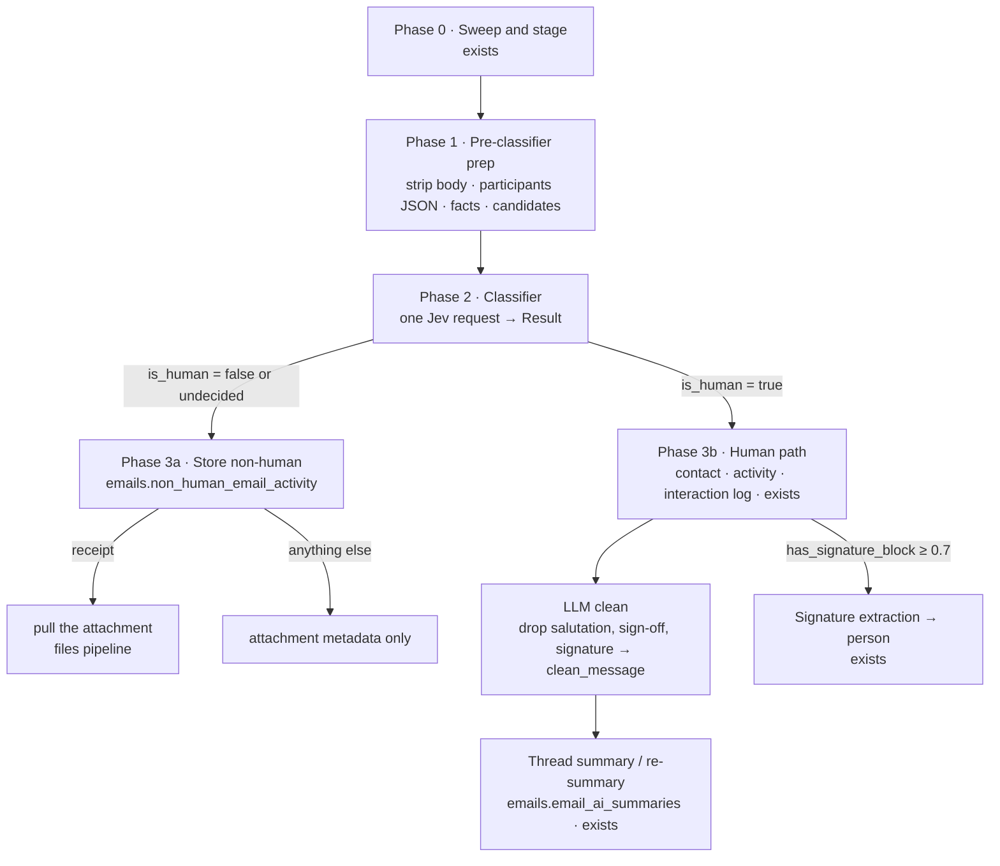

<Danger>
**Not Ready for Dev yet - still scoping.** Companion to the [Email Classifier](/guides/open-work/roadmap/email-classifier) overview. Phases marked *exists* are live in `orbiter-backend` log-and-parse today; everything else is design. The classifier lane runs **only** on accounts with AI features enabled (`nylas_grants.ai_enabled`).
</Danger>

<Note>
**AI-off accounts: legacy path.** For email accounts that do **not** enable AI features, the legacy log-and-parse process decides human versus marketing (`isMachineAddress`, the marketing-prefix rule with its "unless the user emailed them" exception, and the gate). Their mail is logged **without the email body**, and **nothing** is saved to `non_human_email_activity`.
</Note>

Every inbound message goes through the same five phases. Code owns phases 1 and 3, Jev owns the judgment in phase 2, and one cheap LLM appears only on the human branch, after the classification has already decided the message is worth it.



## The phases

<Steps>
<Step title="Phase 0 · Sweep and stage (exists)">
`logandparse/sweep.go` pages every connected grant through Nylas with the body included for all grants. Spam and trash folders are excluded. Today `FoldMessage` drops machine senders before staging; the classifier needs a **message-scoped queue row written before that drop** (`imports.import_classify_queue`), so invoices, receipts and travel mail reach phase 1 at all. A future Nylas `message.created` webhook feeds the same queue.
</Step>

<Step title="Phase 1 · Pre-classifier prep (code, deterministic)">
**Strip the body down.** Reuse the log-and-parse cleaner: Gmail structural strip of quoted trails, HTML to text, then `replyStrip` keeps only the message's own text (everything before the earliest quote or forward marker). One change from today's `cleanBody`: **keep the signature block** at this stage. `cleanBody` removes `gmail_signature` nodes, which would blind the `has_signature_block` question for Gmail senders; the signature is removed later, in phase 3b, once the message is known to be human.

**Add participants JSON.** From, reply-to, to and cc with names and emails (capped at 10 each), the owner's addresses, `recipient_is_only_me`, `to_count`, `cc_count`, `from_is_owner`, `is_reply_or_forward`.

**Add facts the model cannot know.** Attachment metadata (`has_attachment`, kinds; bytes are never read here), provider labels and the Gmail category (`inbox`, `spam`, `important`, `category_promotions`, ...), `unread`, `starred`, the sender rules (`isMachineAddress`, marketing prefix, relay domain), relationship facts (the user has emailed this sender before, the sender is an existing contact), body signals (`has_unsubscribe_link`), and regex candidates for amounts, absolute dates and confirmation codes.

**Redact and cap.** URL query strings and tokens of 32+ characters are removed; the text is cut at 2,500 characters, head first. The lane only runs for accounts with AI features enabled (`nylas_grants.ai_enabled`); AI-off accounts never reach this phase.

```json
{
  "message": {
    "subject": "Re: Q3 deck",
    "from": {"name": "Priya Nair", "email": "priya@acme.io", "local_part": "priya", "domain": "acme.io"},
    "reply_to": "",
    "participants": {
      "to": [{"name": "Mark Pederson", "email": "mark@orbiter.io"}],
      "cc": []
    },
    "date": "2026-09-22T14:02:11Z",
    "folders": ["INBOX", "CATEGORY_PERSONAL", "UNREAD"],
    "labels": ["inbox", "category_personal", "unread"],
    "category": "personal",
    "unread": true, "starred": false,
    "to_count": 1, "cc_count": 0, "recipient_is_only_me": true, "is_reply_or_forward": true,
    "has_attachment": true,
    "attachments": [{"filename": "Q3-deck-v4.pdf", "content_type": "application/pdf", "size_bytes": 812340, "is_inline": false}],
    "body_text": "Hi Mark, slide 7 needs the updated ARR figure. Can you confirm by Thursday?\n\nBest,\nPriya Nair | Head of Data, Acme | +1 415 555 0100"
  },
  "signals": {"sender_prefix_matches_role_list": false, "sender_is_machine_address": false, "recipient_has_emailed_sender_before": true, "sender_is_existing_contact": true, "has_unsubscribe_link": false},
  "candidates": {"amounts": {}, "dates": {}, "codes": {}}
}
```
</Step>

<Step title="Phase 2 · Classifier (Jev, one request)">
`classifier.Classify` sends the envelope above with every question in `assets/prompts/email-classifier.md` (20 static, plus `attachment_role` when there is an attachment, plus one selection question per non-empty candidate map). Answers are validated (keys, types, closed labels, finite probabilities), then composed in code into the `Result` document: `is_human` with its basis, family with the confidence fallback, flags, task, extracted values, provider labels. The routing decision is `is_human`:

| `is_human` | Branch |
| --- | --- |
| `true` | Phase 3b, the human path |
| `false` | Phase 3a, stored as non-human activity |
| undecided (`uncertain`, `injection_review`, `owner_sent`) | Phase 3a storage with `review_reason` set; nothing runs an LLM on it |

Roughly $0.0003 and 350 ms per message through OpenRouter. See the overview for thresholds and smoke evidence.
</Step>

<Step title="Phase 3a · Non-human: store it">
Write one row to `emails.non_human_email_activity` with the full classification JSON, the sender, thread id, `has_attachment` and `swept_at = NULL`. No contact, no activity, no interaction log, **no LLM call**. The queue row's body is cleared.

**Attachments:** metadata only, with one exception. When `message_kind = receipt` or `attachment_role = receipt`, the file is pulled through the existing files pipeline (the log-and-parse attachment downloader, `filespub.Ingester`) and linked to the row, so the subscription and expense work has the PDF. Everything else non-human is never downloaded.

A cron sweeps unswept rows later for the downstream uses listed on the overview. Nothing in this phase triggers an action.
</Step>

<Step title="Phase 3b · Human: promote, clean, summarise">
**Promote (exists).** The existing log-and-parse processing path: resolve the counterpart to a person, ensure the contact, write `activities.email_activity` and the interaction log, stage attachments for the existing downloader. The classification document rides along on the activity row (`classification` JSONB) so tasks, `needs_reply` and the signature flag are queryable per contact.

**LLM clean (new).** One cheap generative call per message (the summarizer's model, `google/gemini-2.5-flash-lite`, with a static, cacheable system prompt and the stripped body as the user message). It removes the salutation ("Dear Mark,", "Hi Mark,"), the sign-off ("Best, Priya"), the signature block (name, title, company, phone, links) and legal or confidentiality footers, and returns the rest **verbatim**. The output is the **clean email**, written to `activities.email_activity.clean_message`, a column that exists today and is never written. Cheap path: when `has_signature_block` is below 0.3 and no salutation regex matches, skip the model and store the stripped text as-is. Quality gate: one Jev noul asks whether `clean_message` kept everything in the stripped body except salutation, sign-off and signature; a low answer keeps the stripped text instead of the model's output.

**Signature extraction (exists, re-gated).** When `has_signature_block ≥ 0.7`, the existing extractor (`logandparse/signature.go`) runs on this message and fills the person's title, phone and links (fill-empty only). Today it picks the newest received body per counterpart behind an automated-sender pre-filter; the classifier flag replaces that guess with a per-message trigger.

**Thread summary / re-summary (exists).** `summaryPhase` → `summarizeThread` upserts one row per `(grant_id, thread_id)` in `emails.email_ai_summaries` (summary, bullet points, sentiment, action items). It is idempotent on `source_message_id`: a thread is re-summarised only when its newest message changed. Two changes: the input becomes the thread's **clean messages** rather than the newest raw trail (today capped at 24,000 characters), and the classifier's flags (`needs_reply`, task) can be surfaced beside the summary.
</Step>
</Steps>

## Who does what

| Phase | Actor | Reads | Writes | Runs on AI-off accounts |
| --- | --- | --- | --- | --- |
| 0 Sweep and stage | code (exists) | Nylas messages | `import_classify_queue`, `import_email_message` | sweep yes (existing, without body); queue row no |
| 1 Prep | code | queue row, sender rules, contact tables | in-memory envelope | no |
| 2 Classify | Jev | envelope | `Result` | no |
| 3a Store non-human | code | `Result` | `non_human_email_activity`; receipt file via files pipeline | no |
| 3b Promote | code (exists) | staged rows | contact, `email_activity`, interaction log | yes (existing path, unchanged) |
| 3b Clean | LLM (`gemini-2.5-flash-lite`) | stripped body | `email_activity.clean_message` | no |
| 3b Signature | LLM (exists) | message with signature | person title, phone, links | no |
| 3b Summary | LLM (exists) | clean messages of the thread | `email_ai_summaries` | no |

## What exists and what is new

| Piece | Status | Where |
| --- | --- | --- |
| Sweep with body, staging, machine-sender drop | exists | `logandparse/sweep.go`, `accumulator.go` |
| HTML to text, quote strip | exists | `logandparse/clean.go` (`cleanBody`, `replyStrip`, `stripGoogleStructure`) |
| Keep-signature variant of the cleaner for phase 1 | new, small | same file |
| Classify queue row before the drop | new | `sweep.go`, migration |
| Classifier package | exists, unwired | `internal/features/emails/classifier` |
| Non-human activity table and writer | new | `emails` feature |
| Receipt-only attachment pull | new, reuses downloader | `logandparse/downloader.go`, `filespub.Ingester` |
| Promotion to contact and activity | exists | `logandparse/processor.go` |
| LLM clean into `clean_message` | new; column exists | `activities_001_init.sql:71` |
| Signature extraction | exists, re-gated by `has_signature_block` | `logandparse/signature.go` |
| Thread summary with `source_message_id` idempotency | exists; input changes to clean messages | `logandparse/summarize.go` |

<Note>
Order matters inside 3b: clean before summarise, so summaries never spend tokens on signatures and salutations, and extract the signature from the **pre-clean** text, since the clean step removes exactly what the extractor needs.
</Note>
