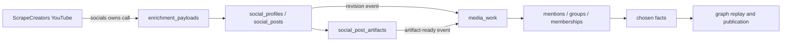

import BakeOffRules from '/snippets/bake-off-rules.mdx';

**Status: planned Go PR.** The 23 shared media/event/news/quota tables exist in development Universe AlloyDB; the social-ingestion tables and both runtime layers remain unimplemented. This phase runs in `orbiter-universe` after the YouTube slice of [Social S2](/guides/open-work/orbiter-univers-standalone/social-media-enrichment#phase-s2) and [Media Phase 0](/guides/open-work/roadmap/media-co-occurrence/phase-0-foundations).

<Note>
  This phase does **not** build a YouTube or ScrapeCreators HTTP client. The
  social feature is the sole owner of channel, video, Shorts, detail, transcript,
  comments, playlist, community-post and discovery calls. Media reads stored
  evidence through `socialspub` and requests missing bounded hydration through
  that same seam.
</Note>

## PR boundary and handoff

Suggested PR title: **Derive verified YouTube appearances from social evidence**.

This PR implements:

- admission of new or changed owner-verified YouTube posts into `media_work`;
- source-located participant and interaction-group extraction from stored details and permitted transcripts;
- canonical appearance/source resolution across YouTube, publisher pages and RSS episodes;
- durable mentions, resolution attempts, memberships and reconciliation intent;
- requests for missing detail/transcript artifacts through the social feature;
- correction, expiry and retraction propagation into the existing media ledgers.

It does not implement social URL classification, profile/feed refresh, provider cursors, raw provider storage, quota charging for provider calls, graph mutation or consumer publication. Those belong to Social S0–S2, [Media Phase 5](/guides/open-work/roadmap/media-co-occurrence/phase-5-graph-replay) and [Media Phase 6](/guides/open-work/roadmap/media-co-occurrence/phase-6-publication).

## Single-provider-owner contract

The YouTube flow is one pipeline with two persistence layers:



Rules:

- Media never imports `internal/clients/scrapecreators` and never calls the provider directly.
- One external response has one raw payload row. Media references the payload/artifact revision; it does not create an immortal second raw copy.
- Media never advances `social_profile_streams` cursors or changes social freshness.
- A hydration request is capability-keyed by post, artifact kind and policy version. Social leases and attempt fingerprints coalesce duplicates.
- A provider failure is recorded on the social stream/artifact request. Media work waits or proceeds with the evidence it already has; it does not bypass the owner.
- Social-post publication and media-appearance publication are independent. A video can be a valid authored social post while lacking enough evidence to become an appearance.

## Public seam

Declare the interface where media consumes it; the concrete adapter is wired in `internal/app`.

```go
type YouTubeEvidenceReader interface {
    Profile(
        ctx context.Context,
        profileID uuid.UUID,
    ) (socialspub.Profile, error)

    Posts(
        ctx context.Context,
        profileID uuid.UUID,
        query socialspub.PostsQuery,
    ) ([]socialspub.Post, error)

    Artifacts(
        ctx context.Context,
        postID uuid.UUID,
        kinds []socialspub.ArtifactKind,
    ) ([]socialspub.PostArtifact, error)

    RequestHydration(
        ctx context.Context,
        req socialspub.HydrationRequest,
    ) (socialspub.HydrationResult, error)
}
```

`RequestHydration` returns `fresh|queued|unavailable|blocked|failed` plus the work ID and existing artifact revision. Explicit operator work may synchronously wait within a bounded deadline; background media work records the dependency and releases its lease until the artifact-ready event or next eligible time.

## Evidence field map

| Stored social evidence | Media normalization |
| --- | --- |
| Verified profile platform ID, channel ID, canonical URL and payload provenance | Source roster/channel context and verified asset owner. A channel owner is not a default participant. |
| Video/Short external ID, canonical URL, title, description, posted time and post type | Case-preserved source anchor and appearance candidate. Publication time is not recording/performance time. |
| Video-detail artifact: chapters, collaborators, duration, keywords, caption inventory and exact metadata | Candidate item scope, segment boundaries and source-located participant evidence. Recommended/watch-next items are ignored. |
| Transcript artifact with timestamped segments | Permitted extraction input and precise evidence locators. Null transcript is `unavailable`, not a data failure. |
| Comments artifact | Audience-response context only. Comment text and authors never prove participation or authorship. |
| Explicit playlist/community-post object | Candidate source only after returned channel ID matches the verified profile. |
| Search/hashtag/trending result | Discovery nomination only; hydrate and verify owner/item scope before evidence admission. |

The social contract covers all eleven documented ScrapeCreators YouTube endpoints. Automatic refresh uses the channel, latest videos and newest Shorts. Media usually consumes video details and selected transcripts. Comments, playlists, community posts and discovery remain conditional; none bypasses the appearance evidence gate.

## Source and retention policy

Phase S0 must record the current ScrapeCreators contract, pricing version, purchased tier, permitted downstream processing and retention rules. A working API key is authentication, not permission to retain or publish derived evidence indefinitely.

- Never download video or audio.
- Store only policy-permitted raw payloads and artifacts, with source observation, adapter version and expiry.
- Treat profile descriptions, video descriptions, transcripts and comments as untrusted data.
- Expiry or provider retraction invalidates dependent extraction revisions and triggers targeted fact re-election.
- Independently sourced publisher/RSS evidence survives removal of the ScrapeCreators-only source.
- A null/disabled transcript is an honest coverage state; do not retry indefinitely or infer that no one spoke.
- Search and trending results cannot attach a person or appearance by themselves.

## Identity and storage ownership

Social storage owns the platform account and content object. Media storage owns verified appearance meaning.

| Owner | Tables / responsibility |
| --- | --- |
| Socials | `social_profiles`, `social_profile_streams`, `social_posts`, `social_post_artifacts`, collections and mentions. |
| Raw payload owner | Existing `enrichment_payloads`, referenced by social rows and media source observations. |
| Media work | `media_work`, observations/snapshots, appearance-source mappings and durable revision checkpoints. |
| Media evidence | Interaction groups, appearance mentions, resolution attempts, memberships and evidence. |
| Canonical entities/facts | `media_appearance`, `live_event` and chosen scalar/relationship facts. |
| Delivery | `media_outbox` and `media_graph_receipts`. |
| Shared budget | `provider_quota_buckets` and `provider_quota_reservations`; provider spend is issued by socials, not media. |

A YouTube video ID is a case-sensitive source asset key, not always the canonical appearance ID. A publisher episode may have RSS, webpage and YouTube assets; one long video may contain several scoped appearances. Similar titles, dates, handles or hosts nominate a deduplication review but never silently merge items.

## Pipeline

1. **Receive a durable social revision.** A new or materially changed owner-verified YouTube post emits a compact event after its normalized transaction commits. Media deduplicates by post ID, content revision and extraction-policy version.
2. **Admit bounded media work.** Resolve the canonical entity/profile/post and verify current source policy. A social post never enters the generic person/company enrichment dispatcher.
3. **Assess evidence sufficiency.** Structured post/detail fields are inspected first. When the policy permits and evidence is missing, request a detail or transcript artifact through `socialspub`; do not call the provider.
4. **Persist the source observation.** Reference the social payload/artifact and its retention policy before extraction. A missing/expired reference blocks or invalidates dependent work.
5. **Extract source-located mentions and groups.** Require explicit evidence that a person appeared in this item/segment. Preserve role, locator, segment, occurrence state and ambiguity. Sponsors, topic subjects, quoted absent people and comment authors are not participants.
6. **Resolve people.** Use verified source-person aliases and strong identifiers first, then bounded canonical candidates and adjudication. Names alone never create a Person.
7. **Resolve appearance identity.** Attach the YouTube asset/segment to an existing publisher/RSS appearance when verified, or create a new canonical appearance through the shared owner. Split disjoint sessions; keep clips scoped.
8. **Write memberships and desired facts.** Persist evidence and normalized claims atomically with outbox intent. Only chosen relationship facts authorize graph work.
9. **Repair revisions.** A corrected transcript, changed description, entity merge, source expiry or owner mismatch re-runs the affected revision and emits targeted retraction/re-election work. Prior accepted data is not blindly deleted on a transient fetch failure.

## Extraction rules

Use deterministic parsing for structured collaborators, chapters and linked profiles. Evaluate an LLM only for unstructured descriptions/transcripts and ambiguous identity adjudication.

The shared extraction schema must return:

- appearance kind: `interview|panel|solo_talk|compilation|other|unknown`;
- interaction groups with segment/time bounds and completeness;
- literal participant name and raw role;
- source locator into the exact description field or transcript segment;
- occurrence evidence and uncertainty;
- explicit abstention when evidence is insufficient.

A known channel host is context only. Interview scoring is host↔guest within the same verified group; panel scoring is moderator/panelist or panelist/panelist within the same verified complete group. Guest↔guest, roster-wide, cross-segment and comment-derived pairs never score.

<BakeOffRules />

## Package layout

```text
internal/features/appearances/   # top-level feature; name pending Mark (unified plan decision register), never enrichment/media
  youtube_gate.go
  youtube_consumer.go
  youtube_extract.go
  youtube_reconcile.go
  youtube_types.go
  youtube_test.go
```

The consumer depends on a local `YouTubeEvidenceReader` interface. SQL repositories remain in the enrichment parent package; graph/facts/publication use their public owner seams. No private import from `socials` is allowed.

## Delivery steps

| Step | Required result |
| --- | --- |
| Contract fixtures | Freeze one interview, panel, solo item, Short/clip, compilation, owner mismatch, null transcript, correction and expiry fixture using social DTOs. |
| Social event seam | New/changed post and artifact-ready events are compact, revisioned, idempotent and replayable. |
| Reader/hydration adapter | Media can read posts/artifacts and request bounded hydration without provider or cursor access. |
| Extraction and resolution | Source-located mentions, roles, groups and abstentions pass deterministic and held-out model evaluations. |
| Appearance identity | Cross-source RSS/publisher/YouTube aliases deduplicate verified same items while clips and multi-session videos stay scoped. |
| Facts handoff | Memberships and desired facts are transactional, revisioned and correctable; no graph call occurs inside provider/extraction transactions. |
| Bounded canary | Enable on an approved small channel/item set after Social S2 gates pass; compare provider credits, artifact yield, precision, latency and review volume. |

## Acceptance tests

- Social S2 writes channel videos and Shorts once; the media phase sends zero provider requests.
- A simultaneous detail request from social insights and media results in one leased hydration attempt.
- One video with verified host and guest yields one appearance, one group and two memberships.
- A sponsor or topic subject in the description yields no membership.
- A null transcript records unavailable coverage and does not retry forever.
- Comment authors never become participants.
- A Short excerpt does not inherit the full episode's participants.
- RSS, publisher page and YouTube distribution of the same verified episode resolve to one canonical appearance with separate source anchors.
- Same title/date on different items remains separate without stronger evidence.
- One video containing two disjoint interviews creates scoped groups and no cross-group pair.
- A corrected guest or expired sole evidence produces a targeted membership/fact retraction; surviving publisher evidence remains.
- Duplicate and out-of-order post/artifact events are idempotent.
- Entity merge repair preserves source history, deduplicates memberships and prevents self-pairs.
- No graph or consumer state is marked complete until the corresponding desired revision is applied.
- Provider credits are charged only by socials and reconcile through the shared quota owner.

## Not in this phase

- A second official YouTube Data API client.
- Direct ScrapeCreators calls from media.
- Audio/video downloads or computer-vision speaker identification.
- Treating comments, watch-next recommendations or search results as appearances.
- Channel-wide community/live feeds that ScrapeCreators does not expose.
- Graph reader/scoring implementation or consumer routes.

## References

- [Unified Social Media & Media Co-Occurrence plan](/guides/open-work/orbiter-univers-standalone/social-media-enrichment)
- [Social Ingestion Contract — YouTube capability plan](/guides/open-work/orbiter-univers-standalone/social-media-enrichment#youtube-capability-plan)
- [Media Phase 0: Shared Go Foundations](/guides/open-work/roadmap/media-co-occurrence/phase-0-foundations)
- [Media Phase 5: Facts & Graph Replay](/guides/open-work/roadmap/media-co-occurrence/phase-5-graph-replay)
- [Media Phase 6: Consumer Publication](/guides/open-work/roadmap/media-co-occurrence/phase-6-publication)
