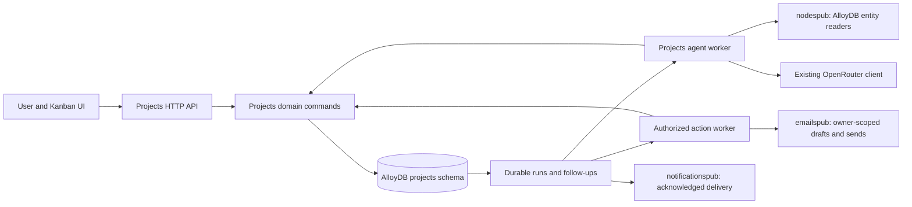

<Note>
**Status: build plan, September 14, 2026.** This is the current implementation specification for Projects, Tasks & Deals. It combines the September 9 scope with the confirmed pipeline and AI-first requirements, and replaces the deprecated August 11 plan. Backend integration was reviewed at `88baf86abd13e57a4d5c2d83c2660e3507b51284`. No product code, migrations, or deployment is claimed by this document.
</Note>

## Outcome and confirmed scope

Give users one workspace for goals, work, and opportunities. A **project** organizes the goal; **tasks** track committed work; a **pipeline** defines a process; **deals** are opportunities moving through that process. A Kanban board shows stages as columns and deals as cards.

Agents should carry as much of the research, preparation, coordination, and authorized execution as possible. For each active deal, surface what would help it advance, why it matters now, the work already prepared, and the action the user can take or authorize. Record actual outcomes before changing the deal's stage.

Confirmed requirements:

- Build in **Go inside `orbiter-backend`, with AlloyDB as the sole database**. This is a 100% AlloyDB build: no Xano storage, FalkorDB dependency, or dual writes.
- Projects can contain nested subprojects. Every task belongs to exactly one project.
- Tasks support multiple assignees and distinct target-completion and committed due dates.
- Subprojects and tasks inherit root-project visibility. Accepted members of a linked team can collaborate without joining another organization.
- Users define pipelines, ordered stages/statuses, and their suggested next steps and actions.
- Users and agents operate on the same deals and transition rules. Agents create work when instructed; changes to existing work require user authorization.
- Suggestions are optional. Users can adopt, edit, save, snooze, dismiss, or ignore them. Ignoring an idea never creates an obligation, task, or stage change.

## Detailed design

The build is organized into this overall plan and two implementation subpages:

<CardGroup cols={2}>
  <Card title="Projects & Tasks Table Design" icon="table" href="/guides/open-work/roadmap/projects-tasks/table-design">
    All 17 AlloyDB schemas, field definitions, keys, constraints, indexes, and migration rules.
  </Card>
  <Card title="Projects & Tasks API Design" icon="code" href="/guides/open-work/roadmap/projects-tasks/api-design">
    Routes, authorization, command rules, stage criteria, agent actions, and response contracts.
  </Card>
</CardGroup>

## Build decisions

These decisions resolve the implementation choices from the earlier drafts.

| Area | Decision for this build |
|---|---|
| Ownership | One `projects` feature owns the workflow, its `projects.*` tables, domain commands, and workers. |
| Database | AlloyDB stores all workflow state, relationships, criteria, suggestions, evidence references, durable jobs, permissions, and receipts. Existing entity/context reads must also use AlloyDB-backed services. |
| Shared access | One root-project access boundary, one optional linked team, explicit organization grants, and no independently private children. |
| Task completion | One shared task status. Any eligible editor can complete it when prerequisites are satisfied. Independent sign-offs use separate tasks. |
| Deals | Every deal belongs to one project. Its tasks, stakeholders, actions, and history stay within that project/root. |
| Pipelines | Each pipeline belongs to a root and can be used by projects inside that root. Reuse across roots is an explicit copy with new IDs; later edits do not propagate between copies. |
| Starter definitions | Versioned JSON assets seed editable Investors/Sales pipelines on request. No template-management table or automatic hidden project. |
| Stages and statuses | A deal's configurable stage is its workflow status. A stable semantic category derives `open`, `won`, or `lost`. Task/project statuses remain separate. |
| Dates | Date-only target/due/expected-close dates. Root IANA timezone defines due-date boundaries; reminder times are UTC `TIMESTAMPTZ`. |
| Ordering | Feature-owned, tested text ranks for stages/cards; versioned board cursors. No new ranking dependency is required. |
| Agent authority | Root opt-in permits bounded research and preparation. An exact authorized command is required for work mutations and external actions. V1 has no general external-agent credential system. |
| Suggestions | One work-suggestion lifecycle across projects, tasks, and deals. Personal responses are keyed by stable intent so regeneration cannot bypass dismissal. |
| Reliability | Durable agent runs, action runs, follow-up occurrences, and command receipts; Pub/Sub is a wake-up mechanism, not the only record of work. |
| Release scope | The first product release includes the board plus useful agent research, prepared next steps, and explicit execution. AI is part of the initial build. |

## Architecture and current backend integration

Keep the modular monolith and existing API/worker binaries. Business logic lives in `internal/features/projects`; `internal/app` constructs modules and injects dependencies.



### AlloyDB-only data boundary

The API and workers use the existing AlloyDB pool. Hierarchies and dependencies use SQL joins/recursive queries; JSONB holds bounded typed documents, and SQL indexes serve boards, reminders, and suggestion queues. Do not add a separate graph, vector, cache, or job database. Pub/Sub may wake work that is already durable in AlloyDB; losing a wake-up cannot lose a command or job.

Canonical people/company records already in AlloyDB remain the identities for deals and stakeholders. `node_uuid` is the existing public identifier name, not a dependency on a graph database. Reuse current IDs and read models; do not duplicate person/company tables inside `projects`.

V1 context comes from permitted AlloyDB entity, contact, team, activity, and stored-path records through their owning features. Stored paths are optional evidence with source/freshness information; missing paths are unknown, not proof that no relationship exists. This feature does not call Universe graph traversal, `nodespub.PathBuilder.BuildPaths`, or `nodespub.SubgraphReader`. Additional context readers must be SQL-backed public contracts. The feature must pass its board, research, and action tests with Xano, FalkorDB, and Universe graph credentials absent. Model, email, and notification APIs remain external execution providers; AlloyDB holds this feature's durable state and receipts.

### Verified seams and required extensions

| Existing code at the reviewed revision | Build treatment |
|---|---|
| `nodespub.Resolver` and `Hydrator` read through the PostgreSQL repository. `PathBuilder.BuildPaths` and `SubgraphReader` call the Universe graph service. | Inject only the AlloyDB-backed read contracts into projects. Store canonical `(entity_type, node_uuid)` references, using `persons` or `companies` for deal targets, and adopt existing IDs unchanged, including non-v7 IDs. Do not inject graph traversal contracts or add a mapping table. |
| `internal/features/suggestions` owns Outcome/Leverage Loop requests and delivered suggestion packages. Its action records describe recommendations; they are not an execution ledger. | Keep that feature's ownership intact. Add a narrow `suggestionspub` reader only for an explicit import from a readable source suggestion. Map into a projects command once; never give both features authority to execute the same action. |
| `emails/service_drafts.go` has draft/send behavior, but shared draft access, some provider errors, and send receipts need stronger service contracts. | Add owner-scoped, idempotent methods through `emailspub`. Enforce grant ownership in the service, return draft/message receipts, propagate sync failures, and retain ambiguous-send state. Projects must not call the Nylas client directly. |
| The notification worker is at-least-once, can ACK when unconfigured, and the Knock trigger returns no delivery receipt. | Add an acknowledged sender through `notificationspub` for projects. Keep an unsent/unknown occurrence observable; do not reuse the invite worker's ACK-on-disabled behavior. Preserve existing invite behavior unless separately changed. |
| Organization membership checking tests active membership; it is not the complete root-project ACL. Team readers have different membership filters. | Implement one projects ACL query using active accounts, non-deleted organizations, active org memberships, and accepted team memberships. Reuse or add narrow public contracts where needed; never import sibling internals. |
| `internal/app/worker.go` registers Pub/Sub handlers and owns durable sweepers. | Wire a projects sweeper with cancellation/cleanup, plus handlers that wake bounded runs by ID. Confirm always-on worker execution or an authenticated scheduled wake in the target environment before enabling periodic assistance. |

No project/pipeline/workflow-deal feature was present in the reviewed tree. Existing `persons.investor_deals` and `fundables.fundable_deals` hold enrichment/investment facts and are not the user's workflow deals.

Use the repository's Go toolchain and dependencies from `go.mod`, chi, pgx, sqlc, Goose, typed `apperror`, UUIDv7 for IDs this feature mints, and the shared authentication middleware. Follow current `CLAUDE.md` and the repository `go-style` skill. Enum-like values live in Go validators and plain text columns, with no new database enum checks or OpenAPI enums.

## User flow and deal progression

1. Create **Seed Round** as a root project, choose its owner/timezone, and optionally link a team or grant another organization access.
2. Create an Investors pipeline from the starter asset. Its stages are Candidate, Outreach, Discovery Meeting, Additional Meeting, Diligence, Investment, and Passed. Users can edit labels, order, criteria, and suggested actions.
3. Add a company or individual angel as a deal in a chosen project. Set an owner, optional value/currency and expected close date, and relevant stakeholders.
4. The agent evaluates the deal's stage and permitted context. It identifies missing information or a useful connection, prepares an introduction request or meeting brief, and presents a small ranked set of next steps.
5. The user may ignore the advice, turn it into a task, or authorize an exact action. An authorized send uses the chosen user's mailbox and records the actual provider outcome.
6. After the required evidence exists, the agent proposes a stage move. The user or an already-authorized exact command performs it through the same service used by a board drag.

A draft is not sent outreach, a sent message is not a reply, and a calendar invitation is not proof a meeting happened. Terminal success and failure retain their history. Reopening is explicit and records a reason. The [API design](/guides/open-work/roadmap/projects-tasks/api-design#stage-criteria-and-suggested-actions) defines stage criteria, shared transition rules, and the Kanban contract.

## Agent and action execution

### Bounded assistance

Only the current root owner can enable background research delegation. Other admins may disable it or adjust its limits; they cannot delegate another user's identity. Ownership transfer disables assistance and cancels undispatched background runs until the new owner opts in. Revalidate the owner each run and pause scheduled assistance for on-hold, completed, canceled, or archived roots. An interactive editor can request a review under their own identity. Shared output must still be safe for every root reader.

Initial operational limits are explicit configuration, persisted on each run: at most 20 deals examined per run, 5 model calls, 20 context/provider reads, 10,000 output tokens in total, 120 seconds wall time, and a configurable billed-cost ceiling of USD 0.50. Atomically reserve call/token/cost allowances before dispatch; account for actual usage afterward, and retain reservations when usage is unknown. Retries consume the same budget. A root has at most one queued/running background run, enforced by a partial unique index. Persist a `(created_at, id)` deal cursor on the root and advance it only after the bounded batch is accounted for; wrap at the end of a cycle so large roots do not repeatedly review only their first deals. These are starting engineering limits, not observed workload measurements.

A review cycle continues in batches, scheduled no more frequently than every five minutes, until its candidates are covered or the root's daily budget is exhausted. The 24-hour interval starts the next cycle; it does not limit a large root to 20 deals per day. Reserve root-wide daily budget in AlloyDB under the root lock, including interactive reviews, so concurrent runs cannot exceed it. Pause observably at the budget limit and continue the saved cursor after reset; use the root timezone for the daily boundary.

The worker selects candidates from real due/stale/stage-change signals, obtains permitted AlloyDB node/context facts, evaluates deterministic criteria, and asks the model for a bounded typed response. Validate references, evidence, action types, intent dedupe, content size, and current versions before creating suggestions. Keep at most five open suggestions per deal; rank by deterministic eligibility/urgency plus explained relevance, not an opaque fabricated probability.

Use the existing OpenRouter client with an explicit configured model and strict structured output. Store prompt/model/policy versions and actual usage. Put prompts in `assets/prompts/projects-*.md` with config path overrides. Model selection is a measured implementation deliverable: run fixed representative fixtures, compare quality/cost/latency, record the selected configuration, and do not claim a model winner before testing. Missing model configuration disables model work observably; deterministic board/work APIs remain available.

Executable action types and their authorization requirements are defined in the [API action registry](/guides/open-work/roadmap/projects-tasks/api-design#registered-actions).

### Durable worker behavior

The sweeper claims due rows with `FOR UPDATE SKIP LOCKED`, stores an expiring lease token and monotonically increasing fence, and commits before network calls. Initial lease: 60 seconds, renewed every 20 seconds; no run exceeds its stored wall-time budget. Completion updates require the current fence/token. Crashed read-only jobs may retry within their remaining budget. Persist attempt/usage accounting so a reclaimed run does not reset its budget.

Before external dispatch, recheck access, principal eligibility, exact authorization/content hash, expiry, resource versions, provider availability, mute rules where applicable, and current suggestion/work state. No transaction stays open across the request. An action already dispatched may finish after revocation; retain its receipt and prevent any subsequent action. Do not promise that an in-flight message can be recalled.

When a provider supports idempotency/reconciliation, use the same stable key on retry and retain its receipt. When acceptance is uncertain and cannot be reconciled, enter `unknown` and require explicit resolution; never guess failure and blindly send again. Expired leases after a send attempt also take the reconciliation/unknown path. An unknown result blocks dependent transitions. There is no claim of distributed exactly-once delivery.

The emails extension must expose confirmed provider message IDs and meaningful errors; the notification extension must expose acknowledged acceptance. A disabled provider leaves work pending/failed with a useful reason, never marked sent. Existing methods that swallow errors or return no receipt are not sufficient adapters.

### Follow-ups and meaningful progress

Create deterministic per-recipient occurrences with semantic dedupe keys. Recheck the recipient's access and eligibility, current work/deal stage, due/check-in basis, archive/terminal state, preferences, quiet hours, cooldown, and suggestion state immediately before sending. Cancel obsolete occurrences. An unrelated version bump is not sufficient reason to drop a valid due reminder.

Task reminders go to eligible assignees; unassigned work falls back to its eligible accountable lead. Deal reminders go to the eligible deal owner, then project lead. Never notify an entire organization by default. Optional ideas have no overdue state or escalation. Suggestion snooze controls display and does not schedule a notification unless explicitly requested. Closing/adoption/expiry/dismissal prevents obsolete resurfacing.

## Implementation layout and build slices

Create `internal/features/projects` with `module.go`, domain `types*.go`, wire `http_types*.go`, `http_mappers*.go`, and focused `handler_*`, `service_*`, `repo_*`, `worker_*` files. Keep files near the repository's 300-line guideline. Put queries in `queries/*.sql` and generated bindings in `db/`; never edit generated code manually. Add only the `projectspub` contracts actually consumed elsewhere.

Add `api/projects.openapi.yaml`, root OpenAPI references/tags, a `sqlc.yaml` block, and a projects depguard rule. Extend `emailspub`, `notificationspub`, and optional `suggestionspub` through their owning features. Keep business logic out of app adapters. Add prompt assets/config paths and deterministic pipeline starter JSON assets; no runtime dependency on old Mintlify pages or Xano schemas.

Table numbers below refer to [Projects & Tasks Table Design](/guides/open-work/roadmap/projects-tasks/table-design#data-model-17-feature-owned-tables). Implement the [API contracts](/guides/open-work/roadmap/projects-tasks/api-design) alongside each slice.

| Slice | Deliverable | Required exit evidence |
|---|---|---|
| 0. Contracts and fixtures | OpenAPI/DTO shapes, typed criteria/action JSON schemas, permission matrix, SQL-only dependency wiring, deterministic clocks/provider fakes, two-user/two-root fixtures. | Expected API/error/idempotency shapes and scope tests reviewed; current base revision recorded; no graph/Xano dependency. |
| 1. Work and access | Tables 1–5, 10, and 16, project/task commands, grants, multiple assignees, dependencies, archive/reopen, activity, command receipts. | Disposable-DB tests prove ACL, cycle prevention, membership revocation, idempotency, and concurrent edits. |
| 2. Pipelines and deals | Tables 6–9, seed/copy configuration, stage criteria, targets/stakeholders, audited board commands, indexes/cursors. | Fundraising scenario works for a company and an angel; invalid moves fail; rank exhaustion and terminal paths pass. |
| 3. Suggestions and research | Tables 11–13, bounded agent worker, personal intent state, typed output validation, explicit task/change adoption using existing command receipts. | Realistic research fixtures produce grounded useful steps; no private-data leak, invented evidence, duplicate adoption, or budget reset. |
| 4. Authorized actions | Table 14, shared registry/service dispatch, emailspub draft/send contracts and receipt handling. | Exact-approval, grant ownership, crash/timeout/unknown-result, and duplicate-send controls pass before enabling live actions. |
| 5. Follow-ups and worker lifecycle | Tables 15 and 17, acknowledged notifications adapter, due scans, scheduling, lease fencing, cancellation, preference handling. | DST/quiet hours, obsolete jobs, revocation, unconfigured providers, and recovery tests pass. |
| 6. Kanban and end-to-end | Frontend consumes the same API commands; shows criteria gaps, prepared actions, adoption, receipts, and stale-state recovery. | Company and angel cases progress through real UI/service paths; optional ideas can be ignored; read-only roles cannot mutate. |
| 7. Release | Model evaluation receipt, migration order, full backend checks, measured query plans, staging acceptance, observability, feature flags. | Every acceptance gate below passes; provider-specific capabilities remain disabled until their own checks pass. |

Follow the [migration sequence](/guides/open-work/roadmap/projects-tasks/table-design#migration-sequence). Backend routes, OpenAPI, SQL, sqlc output, and tests move together. Build the slices incrementally, but do not call the feature complete after only task tables or a passive board exists.

## Acceptance gates and operational checks

| Gate | Required cases |
|---|---|
| AlloyDB | All 17 tables and durable queues live in AlloyDB. Entity/context dependencies use SQL-backed public readers. Board, research, actions, and recovery work with Xano/FalkorDB/Universe graph credentials absent; lost Pub/Sub wake-ups are recovered from SQL. |
| Access | Private root, explicit personal/business-org grants, accepted cross-org team, rejected/pending/inactive members, deleted org/account, revoked route with and without another surviving route. ACL applies to counts/cursors, imports, nodes, agent context, jobs, and artifacts. |
| Work | Nested roots, cycles and simultaneous inverse dependencies, wrong-root references, zero/multiple/ineligible assignees, shared completion, blocked/canceled prerequisite, archive inheritance, explicit completion/reopen. |
| Pipelines | Copy isolates edits and permissions; starters are idempotent; exactly one default and both terminal categories; names/order change without category drift; wrong-pipeline stage rejected; used-stage archive has an explicit replacement. |
| Deals | Company/angel targets, duplicate warnings without false global uniqueness, supported stakeholder roles, optional money, currency default stability, criteria gaps/unknowns, human attestations, won/lost/reopen history. |
| Concurrency | Two humans/agent moving one deal, stale configuration, root/access changes, midpoint exhaustion/rebalance, cursor invalidation, idempotent same-body retry, changed-body conflict, cross-user single adoption. |
| Suggestions | Advice without payload, edit/adopt/link-existing, no task from ignore/save/snooze, private intent state, suppression across regenerated rows, no auto-completion from adoption, shared-safe source import. |
| Agents | Current permitted evidence, structured-output failures, false references, unsupported actions, exhausted budgets, duplicate wakeups, stale-result rejection, no budget reset after crash, measured model quality/cost/latency. |
| Side effects | Grant ownership, changed-content reapproval, expired authorization, provider unavailable, accepted-send/local-ack failure, unknown state, fencing after lease loss, no blind resend, no execution solely from a suggestion payload. |
| Follow-ups | Date-only boundaries and DST, quiet hours, mute/cooldown, owner fallback, removed assignee, closed/archived deal, expired/adopted/dismissed suggestion, opt-in digests/reminders, missing provider config. |
| UI | Same commands as agents, clear action states, no private source data in shared cards, optimistic rollback/refetch on conflicts, correct stage counts and keyboard-operable board actions. |

Use the [Table Design query-plan fixtures](/guides/open-work/roadmap/projects-tasks/table-design#indexes-and-query-plans) to validate storage performance.

Emit structured metrics for queue age, attempts, expired leases, stale outputs, rejected transitions, unknown provider outcomes, receipt conflicts, root-lock wait, query latency, suggestions adopted, verified actions completed, and provider usage. Correlate root/deal/run/command/provider IDs without logging private bodies, credentials, or raw feedback. Agent suggestions and reminders are not progress metrics.

Commands for the implementation branch:

```bash
make sqlc-generate
go test ./internal/features/projects/ ./internal/features/emails/ ./internal/features/notifications/
make test
make lint
go build ./cmd/api ./cmd/worker
npx @redocly/cli lint api/openapi.yaml
npx @redocly/cli bundle api/openapi.yaml -o api/dist/openapi.yaml
```

Run integration, migration up/down, race/concurrency, worker recovery, and query-plan tests against disposable test databases. Use the repository-approved OpenAPI tooling version. Never reset a shared or real-data database to validate this plan. Compare failures against the recorded base before attributing them to this build.

Feature flags independently gate workflow APIs, background assistance, external actions, and notifications. Staging first: work/board, research/drafts, then verified action adapters and notifications. A missing capability returns an honest unavailable state. Rollback disables new work and cancels undispatched jobs while retaining domain history and receipts; an in-flight action is reconciled. No destructive schema rollback is the default recovery mechanism.

## Boundaries and future work

V1 does not include standalone tasks, private children, multiple teams per root, cross-root work moves, recurrence/subtasks, per-assignee sign-off, custom task workflows, billing, forecasting/FX rollups, arbitrary automation scripting, external-agent delegation, or live graph traversal/writes. SMS sending and calendar mutations remain unadvertised capabilities until an owned adapter is implemented and verified. Reuse existing email/files/calendar context through authorized AlloyDB-backed public readers as those actions require; do not build duplicate subsystems.

This plan preserves the useful earlier ideas: reusable process configuration, stable stage semantics, explicit successful/unsuccessful exits, canonical people/company targets, stakeholder roles, board order, stage aging, and an append-only action history. It replaces the old Xano storage assumptions, org-wide visibility, standalone to-dos, eight-table limit, and deferred AI layer.

## Source record

- [September 9 scope in Basic Memory](https://app.basicmemory.com/notes?id=cloud%7Cff28d60c-fe10-40cb-8b13-5ce1fd2406b7%7C2fe7811d-03e2-4b25-870e-57976803f110%7Cf55832a8-76eb-4e87-b415-000fc9eb175c&explorer=project%3Acloud%7Cff28d60c-fe10-40cb-8b13-5ce1fd2406b7%7C2fe7811d-03e2-4b25-870e-57976803f110), followed by the confirmed September 14 pipeline/AI-first scope and this consolidation.
- [Backend conventions at the reviewed revision](https://github.com/Orbiterio/orbiter-backend/blob/88baf86abd13e57a4d5c2d83c2660e3507b51284/CLAUDE.md), plus the feature/service/migration paths named above. The older checkout at `27253e6` was not used as the current backend snapshot.
- [Historical product design](/guides/archive/deal-flow-overview) and [historical Xano backend design](/guides/archive/deal-flow-backend) are retained in Archive for provenance. This plan and its Table Design and API Design subpages define the current build.
