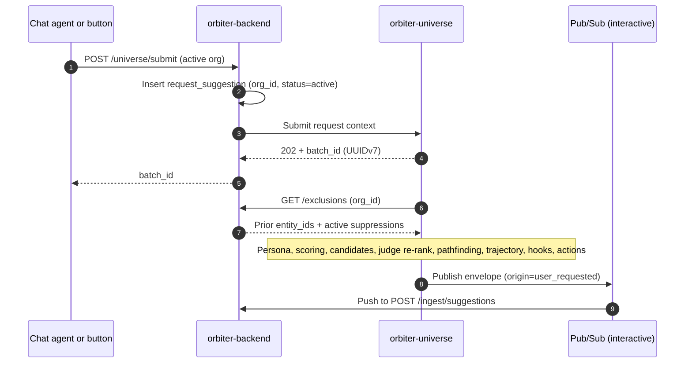
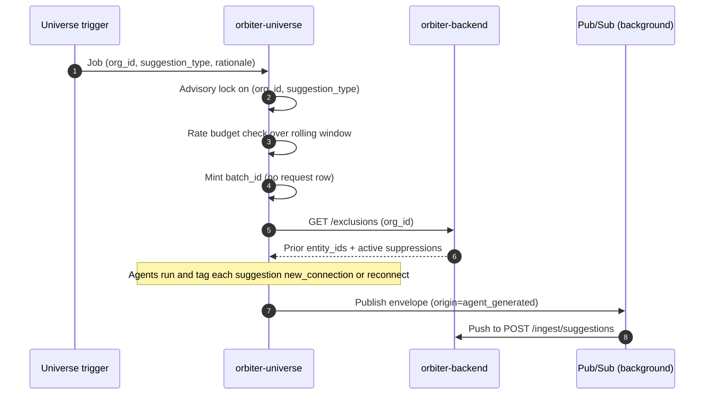
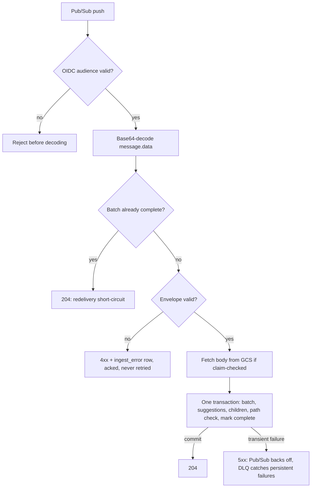

<Danger>
**The Xano-based tables, including `suggestion_request`, are deprecated and are being replaced by the tables on this page.** `request_suggestion` is the replacement for the Xano-based table `suggestion_request`. However, do not delete them until the TanStack AI API endpoints are complete and Mark approves the delete.
</Danger>

<Info>
**Design brief, 2026-09-12, revised the same day for [organization scope](#organization-scope).** Universe generates suggestions. orbiter-backend stores and serves them. This page defines the contract between the two services, the tables that hold results, and the rules that keep the data consistent under retries, resubmits, concurrent triggers, shared orgs, and user dismissal. The full DDL is at the bottom of the page under [Schema](#schema).
</Info>

<Note>
[Leverage Loops v1](/guides/open-work/leverage-loops-v1) documents the first live loop, which delivers through a signed webhook with GET recovery. This page covers Pub/Sub delivery and the result tables for all four suggestion types.
</Note>

## Architecture

Two services, two GCP environments.

| Service | Owns |
| --- | --- |
| **orbiter-backend** (Go, AlloyDB) | `request_suggestion`, all suggestion tables, the dismissal API, the exclusion endpoint, the frontend read API |
| **orbiter-universe** (Go, FalkorDB + AlloyDB) | Agents, scoring, pathfinding, trajectory and hook generation, trigger logic, the rate budget |

### Universe to backend

- Universe publishes one envelope per batch to Pub/Sub. Two push subscriptions point at the same backend ingest endpoint: **interactive** for user-requested batches and **background** for agentic ones, each with its own concurrency cap.
- Bodies over about 5 MB are written to GCS and the message carries a pointer (claim check). The GCS object is transport only and expires after a few days.
- Auth is an OIDC ID token from the Universe service account, audience-scoped to the backend ingest endpoint. There are no shared static keys.
- Both subscriptions raise the ack deadline above the 10 s default.

### Backend to Universe

- **Submit.** The backend POSTs the request context to Universe, which returns 202 and a `batch_id`.
- **Exclusion.** Before generating, Universe calls a backend read endpoint for prior results and active suppressions. See [API surface](#api-surface).

## Taxonomy

### Suggestion types

| `suggestion_type` | Requested by user | What it is |
| --- | --- | --- |
| `outcome` | Yes, in chat | Who can help with what you're trying to accomplish, and the path to reach them |
| `leverage_loop` | Yes, by button (no chat) | Who in your network you should introduce to a specific person, and why |
| `leverage_outcome` | Yes, in chat | An outcome generated for a specific contact. Structured as an outcome, displayed in the leverage loop view |
| `serendipity` | Never | Agentically generated for both the user and their company orgs: either a new person worth connecting with, or someone worth getting back in touch with |

### Other enums

| Enum | Values | Notes |
| --- | --- | --- |
| `suggestion_mode` | `new_connection`, `reconnect` | Serendipity only |
| `batch_origin` | `user_requested`, `agent_generated` | Binary. Trigger detail goes in `trigger_source` |
| `batch_status` | `in_progress`, `complete`, `partial`, `failed` | Terminal state lives on the batch, not the request |
| `suggestion_action_type` | `make_intro`, `draft_email`, `create_task`, `leverage_loop` | Additive |
| `feedback_signal_type` | `relationship_ended`, `already_in_touch` | Signals queued for graph review |
| `feedback_status` | `pending`, `applied`, `rejected` | Review state on the feedback queue |

`trigger_source` is free text used for attribution only: `cron_weekly`, `new_edge`, `enrichment_landed`, `score_threshold`, `manual`, and so on. Adding a trigger is a Universe-side change only.

### Dismissal reasons

| `dismissal_reason` | Scope | Cooldown | Notes |
| --- | --- | --- | --- |
| `not_relevant` | Shared | 180 days | |
| `bad_timing` | Shared | 28 days | |
| `no_reason` | Shared | 60 days | Default |
| `already_in_touch` | Reconnect | 14 days | Recency signal, also enqueues feedback |
| `relationship_ended` | Reconnect | Permanent | Always written to the dismissing member's personal org, also enqueues feedback |
| `not_worth_the_reach` | New connection | 60 days | Pathfinding critique |

The dismissal handler applies these cooldowns when it computes `suppressed_until`.

## Organization scope

Suggestions belong to an organization, not a user. In WorkOS every user has a **personal org** that contains only them, and each company has its own **company org**. A user switches between personal mode and company mode, and whatever they create belongs to the org they are in at the time.

| | Personal org | Company org |
| --- | --- | --- |
| Members | The user only | Everyone in the company |
| `outcome`, `leverage_outcome` | Created in chat in personal mode. Private to the user | Created in chat in company mode. Shared with every member |
| `leverage_loop` | Created from the button in personal mode. Private to the user | Created from the button in company mode. Shared with every member |
| `serendipity` | Generated for the user | Generated for the org, as a separate stream |

- **`org_id` is the owner.** Every request, batch, and suppression carries the owning `org_id`. The scope key is `(org_id, suggestion_type, beneficiary_contact_id)`, so a personal org behaves exactly like a per-user scope.
- **Membership is the access check.** An org's suggestions are returned only to its current members, checked at read time. A new member sees the org's earlier suggestions, and a member who leaves loses them.
- **`requested_by` records who asked.** It is set on user-requested batches and null on agent-generated ones, including company-org serendipity, which has no requesting user.
- **Serendipity runs per org.** Universe generates one stream for each personal org and one for each company org. The streams are independent: the advisory lock, the rate budget, and exclusion are all keyed on `org_id`, and nothing is deduplicated across streams.
- **Company-mode paths** can run through teammates and the org itself, which is what the `team_member` and `organization` path kinds are for.

### Decisions (2026-09-12)

| Question | Decision |
| --- | --- |
| A member dismisses a shared company-org suggestion | It is hidden for every member of the org. `dismissed_by` records who dismissed it, and the suppression is written to the org |
| A member picks `relationship_ended` in company mode | The suggestion is dismissed for the whole org like any other dismissal, but the permanent suppression goes only to that member's personal org, plus the feedback queue. Teammates may still know the person, so future company-org batches can include them |
| Which suggestions company mode shows | Only the active org's. Other orgs the user belongs to are not mixed in |

The last rule differs on purpose from company-mode search on [Edge Sync](/guides/open-work/edge-sync), which spans every org the user belongs to. Search reads the graphs; suggestions are artifacts owned by one org.

### UI viewing rules

<Info>
**What the UI shows in each mode.** The mode switch selects exactly one org, and every suggestion list reads only that org's suggestions.

| Rule | Personal mode (personal org) | Organization mode (company org) |
| --- | --- | --- |
| Lists show | Suggestions owned by the user's personal org | Suggestions owned by the active company org only |
| Who else sees them | No one | Every current member of the org |
| Serendipity | The user's personal stream | The org's stream |
| New outcomes and leverage loops | Private to the user | Shared with every member of the org |
| Dismiss | Hides it for the user | Hides it for every member. `dismissed_by` records who dismissed it |
| `relationship_ended` | Permanently suppresses the person for the user | Hides the suggestion for the org. The permanent suppression goes only to the dismissing member's personal org |
| Switching modes or orgs | Swaps the whole list. Nothing from company orgs is mixed in | Swaps the whole list. Nothing from personal mode or the user's other orgs is mixed in |
| Membership changes | Not applicable | New members see the org's earlier suggestions. Members who leave lose access |
</Info>

## Core concepts

**`entity_id`** is the universal UUID for people and orgs across all graphs and tables. Suggestion tables store a bare `entity_id`, with no FK to `contact` and no display snapshot. The UI resolves name, title, avatar, and logo from `entity_id` alone.

**Scope key** is `(org_id, suggestion_type, beneficiary_contact_id)`. It appears wherever `org_id` appears: batch sequencing, exclusion, suppression, and read queries. `beneficiary_contact_id` is nullable, and null is a legitimate value, not a missing one.

**`suggestion_batch`** is the anchor entity: one row per delivery from Universe. It is the idempotency key, the display grouping, and the scope carrier. It does not hold the payload. Suggestions are shredded into `suggestion` and its children inside the ingest transaction.

**Batches stack.** Resubmitting a request creates a new batch and leaves prior batches untouched. `batch_seq` is monotonic per scope key. Terminal state lives on the batch, not the request.

**Immutability.** `suggestion_batch`, `suggestion`, `suggestion_action`, and all children are write-once. Only `dismissed_*` mutates. Execution state for actions is deferred to a future append-only `suggestion_action_event` table.

{/* TODO: the leverage_loop action click writes spawned_request_id onto suggestion_action, which conflicts with "only dismissed_* mutates". Confirm whether it is a second allowed mutation or moves to suggestion_action_event. */}

## Tables

All tables live in orbiter-backend's AlloyDB. PostgreSQL 15 or later is required for `NULLS NOT DISTINCT`.

| Table | Grain | Role |
| --- | --- | --- |
| `request_suggestion` | One per user request (existing table) | Gains `org_id` (the owning org), `suggestion_type`, `beneficiary_contact_id`, and a coarse `status` (`active` or `archived`). Requests stack, so terminal state stays on the batch |
| `suggestion_batch` | One per delivery from Universe | Anchor row. `id` is the Universe-minted `batch_id`. Carries the scope key, `requested_by`, `origin`, `trigger_source`, `batch_seq`, `status`, and `suggestion_count` |
| `suggestion` | One per suggested entity per batch | Parent row for all four types. `why` and `score` are jsonb because their shape differs per type and will churn; promote a field to a column only when you need to filter on it. Also holds trajectory, key people, hooks, and dismissal state. A dismissal applies to the whole owning org |
| `suggestion_path` | N per suggestion | Structured pathfinding output: `path_kind` (`direct`, `team_member`, `organization`), rank, hop count, score, and ordered hops |
| `suggestion_evidence` | N per suggestion | Supporting facts behind the why |
| `suggestion_entity` | N per suggestion | Entities the suggestion references, by role (`connector`, `target`, `employer`, and so on) |
| `suggestion_action` | Zero to N per suggestion | Recommended actions with Universe-authored CTA copy. Execution state is not stored here |
| `suggestion_suppression` | One per scope key, request, and entity | Durable exclusion instruction for an org, which Universe reads through the exclusion endpoint. Upserted on re-dismissal |
| `ingest_error` | One per rejected delivery | 4xx sink. Acked, never retried. `batch_id` is not an FK because the batch may never have been created |
| `suggestion_feedback_queue` | One per graph signal from a dismissal | Keyed on the member (`user_id`) whose relationship the signal describes. Reviewed before anything reaches FalkorDB, because a dismissal is weaker than an edge source |

The `suggestion` row records the UI event (the dismissal). The `suggestion_suppression` row drives future generation.

## Flows

### Path A: user-requested



1. In personal or company mode, the chat agent (`outcome`, `leverage_outcome`) or the Leverage Loop button handler (`leverage_loop`) creates a `request_suggestion` row with the active org's `org_id`, `suggestion_type`, `beneficiary_contact_id`, and `status = active`.
2. The backend calls Universe with `request_suggestion_id`, `org_id`, the requesting user, `suggestion_type`, and `beneficiary_contact_id`.
3. Universe mints a `batch_id` (UUIDv7) and returns 202. Generation is async.
4. Universe calls the [exclusion endpoint](#api-surface) for the org's prior refs and active suppressions.
5. Agents run: synthetic persona, scoring, candidate generation, LLM-as-judge re-rank, pathfinding, trajectory, hooks, and actions.
6. Universe assembles the envelope with `origin = user_requested`, and with `request_suggestion_id` and `requested_by` set.
7. Universe publishes to the interactive subscription, claim-checking the body if it is large.

### Path B: agentic (serendipity)



1. A Universe trigger fires for a personal org or a company org. Every trigger produces the same job shape: `(org_id, suggestion_type, rationale)`.
2. Universe takes an advisory lock on `(org_id, suggestion_type)` for the duration of generation.
3. Universe checks the rate budget for `(org_id, suggestion_type)` over a rolling window. Excess jobs are deferred or dropped.
4. Universe mints a `batch_id`. No request row exists.
5. Exclusion uses the same endpoint, keyed on `(org_id, suggestion_type, window)`.
6. Agents run and tag each suggestion `new_connection` or `reconnect`.
7. The envelope carries `origin = agent_generated`, a `trigger_source`, `request_suggestion_id = null`, and `requested_by = null`.
8. Universe publishes to the background subscription.

### Ingest handler

One handler serves both paths.



1. Verify the OIDC audience. Reject before decoding.
2. Base64-decode `message.data`.
3. Select the `suggestion_batch` where `id = :batch_id AND status = 'complete'`. If it exists, return 204. This is the redelivery short-circuit.
4. Validate `schema_version`, enum membership, and that the org exists. For `user_requested`, the request must exist, be `active`, and have a stored `org_id`, `suggestion_type`, and `beneficiary_contact_id` that match the envelope, and `requested_by` must be the user who created it. Any failure returns 4xx and writes an `ingest_error` row. The message is acked and never retried.
5. If the message is a pointer, fetch the body from GCS.
6. In one transaction:
   - Insert `suggestion_batch` as `in_progress` with `batch_seq = COALESCE(MAX, 0) + 1` over the scope key. The unique constraint rejects races.
   - Batch-upsert `suggestion` on `(batch_id, source_ref)`.
   - Batch-insert `suggestion_path`, `suggestion_evidence`, `suggestion_entity`, and `suggestion_action`.
   - Verify that every `trajectory_path_ids` entry resolves to a `suggestion_path` in the same suggestion. Fail the transaction otherwise.
   - Set the batch to `complete` with counts.
   - Touch no user-global or org-global aggregates.
7. Commit and return 204. A transient failure returns 5xx, Pub/Sub backs off, and the DLQ catches persistent failures.

### Read

Every read is scoped to one org: the personal org in personal mode, or the active company org in company mode. The caller must be a current member of that org.

| View | Filter |
| --- | --- |
| Outcome | `suggestion_type = outcome` |
| Leverage loop | `beneficiary_contact_id = X` across `leverage_loop` and `leverage_outcome`. The renderer branches on type |
| Serendipity | `suggestion_type = serendipity`, optionally by `suggestion_mode` |

Every read also filters on batch `status = complete` and `dismissed_at IS NULL`, and sorts by `(batch_seq DESC, rank ASC)`.

### Dismissal

- `PATCH /suggestions/{id}` sets `dismissed_at`, `dismissed_by`, and `dismissal_reason`. Soft delete only. Idempotent, returns 204. The dismissal hides the suggestion for every member of the owning org.
- `POST /suggestions/dismiss` takes an array of ids and dismisses them in one transaction.
- Each dismissal upserts a `suggestion_suppression` row (see [Suppression scope](#suppression-scope)). `relationship_ended` and `already_in_touch` also enqueue a `suggestion_feedback_queue` row for the dismissing member.

### Action click

A `leverage_loop` action calls the manual loop endpoint with `target_entity_id`, creates the `request_suggestion` row in the owning org of the source suggestion, and writes `spawned_request_id` back onto the action. This is the provenance link from serendipity to downstream activity.

## Rules and invariants

### Enforced by DDL

| Rule | Constraint |
| --- | --- |
| `origin = user_requested` ⇔ `request_suggestion_id IS NOT NULL` | `suggestion_batch_origin_request_chk` |
| `origin = user_requested` ⇔ `requested_by IS NOT NULL` | `suggestion_batch_origin_requester_chk` |
| `suggestion_type ∈ {leverage_outcome, leverage_loop}` ⇒ `beneficiary_contact_id IS NOT NULL` | `suggestion_batch_beneficiary_chk`, `request_suggestion_beneficiary_chk` |
| `suggestion_type = serendipity` ⇒ `origin = agent_generated` | `suggestion_batch_serendipity_origin_chk` |
| `request_suggestion.suggestion_type ≠ serendipity` | `request_suggestion_serendipity_chk` |
| One `batch_seq` per scope key, nulls not distinct | `suggestion_batch_seq_uq` |
| One `suggestion` per `(batch_id, source_ref)` | `suggestion_batch_source_uq` |
| One action per `(suggestion_id, action_type, target_entity_id)`, nulls not distinct | `suggestion_action_uq` |
| `action_type ∈ {make_intro, leverage_loop}` ⇒ `target_entity_id IS NOT NULL` | `suggestion_action_target_chk` |
| `dismissed_at IS NULL` ⇔ `dismissal_reason IS NULL` | `suggestion_dismissal_chk` |
| `hooks` is null or a JSON array | `suggestion_hooks_shape_chk` |
| `reason = relationship_ended` ⇒ `request_suggestion_id IS NULL AND suppressed_until IS NULL` | `suggestion_suppression_relationship_ended_chk` |

### Enforced by the handlers

These rules cross tables and cannot be expressed as constraints.

1. `suggestion.suggestion_mode IS NOT NULL` ⇔ the batch is `serendipity`.
2. `trajectory_*` and `key_people` appear only on `outcome` and `leverage_outcome`. `hooks` are allowed on any type.
3. Every `trajectory_path_ids` entry resolves to a `suggestion_path` in the same suggestion.
4. For user-requested batches, the envelope `suggestion_type` equals the stored request type.
5. For user-requested batches, the envelope `org_id` and `beneficiary_contact_id` equal the stored request values.
6. `batch_seq` is assigned in the transaction. The unique constraint rejects races.
7. The redelivery short-circuit runs before parsing.
8. `relationship_ended` writes a permanent suppression to the dismissing member's personal org wherever it was clicked, and enqueues feedback for that member. `already_in_touch` keeps its normal scope and cooldown, and also enqueues feedback.
9. No user-global or org-global aggregate rows are touched in the ingest transaction.
10. Each `hooks[]` entry has `entity_id`, `angle`, and `text`, and its `entity_id` is a person the suggestion references.
11. Reads return only batches owned by the caller's active org, and only while the caller is a member of it. A dismissal hides the suggestion for every member of the owning org.
12. A `leverage_loop` action click creates its `request_suggestion` in the owning org of the source suggestion.

### Suppression scope

| Case | `request_suggestion_id` | Written to | Effect |
| --- | --- | --- | --- |
| Serendipity dismissal | Null | The owning org | Org-wide for `(org_id, suggestion_type, entity_id)`. In a personal org, that is the user |
| User-requested dismissal | Set | The owning org | That request's future batches only |
| `relationship_ended`, any type or mode | Forced null | The dismissing member's personal org | Permanent for that member. The company org is not suppressed |

Re-dismissing the same entity upserts on `suggestion_suppression_uq`, which extends the window or escalates the reason.

### Semantics

- **`make_intro`**: the intro is between `suggestion.entity_id` and `action.target_entity_id`. The user is the implied introducer and is never a party in the data.
- **`leverage_loop` action**: `params` is empty, and `target_entity_id` is the loop's beneficiary.
- **Trajectory**: LLM prose synthesized across the ranked paths, which may compare them. It is written after re-ranking, not during pathfinding. `trajectory_entity_ids` is display order (chips), not path order. `trajectory_path_ids` records which paths were reasoned over, so a missing path can be attributed to the ranker or to the narrator.
- **Hooks**: openers or elevator pitches the user can lead with. A flat array where `entity_id` is the person the hook is addressed to. One contact typically gets 3 hooks, two contacts typically get 6, and the UI groups on `entity_id`. Universe authors them and they are immutable.
- **`rank`** is batch-local. Cross-batch ordering uses `batch_seq` first.
- **No cross-deduplication at write time.** If exclusion misses and the same entity lands in two batches, or in both a personal and a company stream, both rows exist. Collapse on read if that is ever needed.

## API surface

| Endpoint | Caller | Purpose |
| --- | --- | --- |
| `POST /universe/submit` (internal) | Frontend, via the backend | Creates or forwards the request in the active org and returns `batch_id` |
| `GET /exclusions` | Universe | Prior `entity_id`s and active suppressions for the scope |
| `POST /ingest/suggestions` | Pub/Sub push | The [ingest handler](#ingest-handler) |
| `PATCH /suggestions/{id}` | Frontend | Dismiss one, for the whole owning org |
| `POST /suggestions/dismiss` | Frontend | Dismiss many |
| `POST /suggestions/{id}/actions/{action_id}/spawn-loop` | Frontend | `leverage_loop` action click |

`GET /exclusions` takes `org_id` and `suggestion_type`, plus optional `beneficiary_contact_id` and `request_suggestion_id`. Every frontend endpoint checks that the caller is a current member of the owning org.

```json Exclusion response
{
  "prior_entity_ids": ["…"],
  "suppressed": [
    {"entity_id": "…", "reason": "not_relevant", "suppressed_until": "2027-03-11T00:00:00Z"},
    {"entity_id": "…", "reason": "relationship_ended", "suppressed_until": null}
  ]
}
```

## Envelope

Universe publishes one envelope per batch. `org_id` is the owning org, personal or company. `requested_by` is the requesting user, or null for agent-generated batches.

```json Envelope contract
{
  "schema_version": 1,
  "batch_id": "uuid-v7",
  "request_suggestion_id": "uuid | null",
  "org_id": "uuid",
  "requested_by": "uuid | null",
  "suggestion_type": "outcome | leverage_loop | leverage_outcome | serendipity",
  "beneficiary_contact_id": "uuid | null",
  "origin": "user_requested | agent_generated",
  "trigger_source": "string | null",
  "status": "complete | partial | failed",
  "generated_at": "RFC3339",
  "suggestions": [
    {
      "source_ref": "string",
      "rank": 1,
      "entity_id": "uuid",
      "suggestion_mode": "new_connection | reconnect | null",
      "why": {},
      "score": {},
      "trajectory_text": "string | null",
      "trajectory_entity_ids": ["uuid"],
      "trajectory_path_refs": ["string"],
      "key_people": ["uuid"],
      "hooks": [{"entity_id": "uuid", "angle": "string", "text": "string"}],
      "paths": [
        {"ref": "string", "path_kind": "direct | team_member | organization", "rank": 1, "hop_count": 2, "path_score": 0.82, "hops": []}
      ],
      "evidence": [
        {"evidence_type": "string", "source_system": "string", "ref_id": "string", "snippet": "string", "weight": 0.7}
      ],
      "entities": [
        {"entity_id": "uuid", "entity_kind": "person | org", "role": "string"}
      ],
      "actions": [
        {"action_type": "make_intro | draft_email | create_task | leverage_loop", "rank": 1, "label": "string", "target_entity_id": "uuid | null", "params": {}}
      ]
    }
  ]
}
```

Paths carry a Universe-side `ref`. The handler mints `suggestion_path.id` and maps `trajectory_path_refs` to `trajectory_path_ids` inside the transaction.

### Claim check

When the body is over about 5 MB, the Pub/Sub message carries only a pointer to the GCS object:

```json Claim-check message
{ "batch_id": "uuid-v7", "payload_ref": "gs://orbiter-suggestions/batches/<batch_id>.json" }
```

## Examples

Entity ids below are placeholders.

<Tabs>
<Tab title="Outcome">

Find a seed investor for a media-tech company.

```json Outcome batch expandable
{
  "schema_version": 1,
  "batch_id": "0192f3a1-6b2e-7c4d-9e8f-0a1b2c3d4e5f",
  "request_suggestion_id": "8d1e…",
  "org_id": "o-…",
  "requested_by": "u-…",
  "suggestion_type": "outcome",
  "beneficiary_contact_id": null,
  "origin": "user_requested",
  "trigger_source": null,
  "status": "complete",
  "generated_at": "2026-09-12T14:03:11Z",
  "suggestions": [
    {
      "source_ref": "cand-0417",
      "rank": 1,
      "entity_id": "e-investor-1",
      "suggestion_mode": null,
      "why": {
        "summary": "Leads pre-seed and seed in media infrastructure; two portfolio companies sell into post-production.",
        "components": {"thesis_fit": 0.91, "stage_fit": 0.88, "path_strength": 0.74}
      },
      "score": {"composite": 0.87, "semantic": 0.90, "brokerage": 0.71},
      "trajectory_text": "Two routes reach this investor. The direct one runs through a former colleague at your last company who now advises one of her portfolio companies; you worked together for three years and the relationship is current. The alternative runs through a conference co-panelist, which is a weaker tie and adds a hop. Lead with the former colleague.",
      "trajectory_entity_ids": ["e-colleague-1", "e-panelist-1"],
      "trajectory_path_refs": ["p-1", "p-2"],
      "key_people": ["e-investor-1", "e-colleague-1"],
      "hooks": [
        {"entity_id": "e-investor-1", "angle": "portfolio_thesis", "text": "You've backed two companies that sell into post-production. We're the data layer they both end up needing."},
        {"entity_id": "e-investor-1", "angle": "peer_precedent", "text": "The last relationship-intelligence company at this stage went from pilot to enterprise in under a year. We're structurally the same bet with a better graph."},
        {"entity_id": "e-investor-1", "angle": "traction", "text": "We're in private beta with three operators in your network. Ask any of them."}
      ],
      "paths": [
        {"ref": "p-1", "path_kind": "direct", "rank": 1, "hop_count": 2, "path_score": 0.81,
         "hops": [{"entity_id": "e-colleague-1", "edge_type": "WORKED_WITH", "valid_from": "2019-01-01", "valid_to": "2022-06-30"},
                  {"entity_id": "e-investor-1", "edge_type": "ADVISES", "valid_from": "2024-03-01", "valid_to": null}]},
        {"ref": "p-2", "path_kind": "team_member", "rank": 2, "hop_count": 3, "path_score": 0.52, "hops": []}
      ],
      "evidence": [
        {"evidence_type": "funding_round", "source_system": "fundable", "ref_id": "fr-…", "snippet": "Led $3.2M seed in …", "weight": 0.8}
      ],
      "entities": [
        {"entity_id": "e-investor-1", "entity_kind": "person", "role": "target"},
        {"entity_id": "e-colleague-1", "entity_kind": "person", "role": "connector"},
        {"entity_id": "e-fund-1", "entity_kind": "org", "role": "employer"}
      ],
      "actions": [
        {"action_type": "draft_email", "rank": 1, "label": "Draft a note to your former colleague", "target_entity_id": "e-colleague-1", "params": {"tone": "warm", "ask": "intro"}},
        {"action_type": "create_task", "rank": 2, "label": "Follow up in one week", "target_entity_id": "e-colleague-1", "params": {"due_in_days": 7}}
      ]
    }
  ]
}
```

</Tab>
<Tab title="Leverage outcome">

An outcome generated for a contact. Same shape as the outcome example, with:

```json Leverage outcome fields
{
  "suggestion_type": "leverage_outcome",
  "beneficiary_contact_id": "e-contact-7"
}
```

`why` is written from the beneficiary's point of view (why this helps them). `hooks[].entity_id` may be the beneficiary or the suggested person, depending on who the user is addressing. `make_intro` actions carry `target_entity_id = "e-contact-7"`.

</Tab>
<Tab title="Leverage loop">

Who to introduce to a contact. This is the payload behind the live "Introduce Ethan Jacks to Katelyn" card. The why text and the action labels are copied from the card. Ids, the timestamp, and the score are placeholders.

The payload does not carry the card header or Ethan's name, title, bio, avatar, or company logo. The UI resolves those from `entity_id` and `beneficiary_contact_id`. `why.body` holds one string per rendered paragraph. `score.judge` carries the judge's `lane`, `mechanism`, and `rationale` from [Leverage Loops v1](/guides/open-work/leverage-loops-v1); the card does not display them, so their values here are placeholders.

```json Leverage loop batch wrap
{
  "schema_version": 1,
  "batch_id": "0192…",
  "request_suggestion_id": "8d1e…",
  "org_id": "o-…",
  "requested_by": "u-…",
  "suggestion_type": "leverage_loop",
  "beneficiary_contact_id": "e-katelyn",
  "origin": "user_requested",
  "trigger_source": null,
  "status": "complete",
  "generated_at": "2026-09-12T15:20:00Z",
  "suggestions": [
    {
      "source_ref": "cand-0088",
      "rank": 1,
      "entity_id": "e-ethan-jacks",
      "suggestion_mode": null,
      "why": {
        "headline": "Katelyn's founder clients mature into Ethan's media-tech M&A pipeline.",
        "body": [
          "Katelyn and Ethan would be ideal referral partners across the full company lifecycle — she raises capital for founders pre-seed through Series B at Grant Drive Group, and he runs M&A and exits for media and technology operators at MediaBridge.",
          "Her clients who are ready to sell become his deals; companies in his pipeline that need a raise before an exit are perfect for her. And Orbiter.io, where she's CFO, is built for exactly the media and tech operators in his network.",
          "They'd also genuinely like each other. Both walked away from institutional careers — her eight years at Citi, his law partnership and Avid C-suite run — to build boutique, founder-led shops. Both lead with trust over transactions: her line about people needing to know how much you care matches his belief that long-standing relationships drive outcomes. Both spend their LinkedIn celebrating clients rather than themselves.",
          "Katelyn gets a warm door into media-tech operators who are literal Orbiter target users, plus a specialist she can send sell-side referrals. Ethan gets first look at Orbiter as a deal-sourcing tool, a steady feed of pre-exit founders, and a credible capital-raising partner for clients stuck below the $10M revenue line his firm targets."
        ]
      },
      "score": {
        "composite": 0.79,
        "judge": {"lane": "peer | complement", "mechanism": "…", "rationale": "…"}
      },
      "trajectory_text": null,
      "trajectory_entity_ids": [],
      "trajectory_path_refs": [],
      "key_people": null,
      "hooks": null,
      "paths": [],
      "evidence": [],
      "entities": [
        {"entity_id": "e-ethan-jacks", "entity_kind": "person", "role": "target"}
      ],
      "actions": [
        {"action_type": "make_intro", "rank": 1, "label": "Double Opt-In Warm Introduction", "target_entity_id": "e-katelyn", "params": {}},
        {"action_type": "draft_email", "rank": 2, "label": "Email Ethan Jacks", "target_entity_id": "e-ethan-jacks", "params": {}}
      ]
    }
  ]
}
```

</Tab>
<Tab title="Serendipity">

Reconnect, triggered by a new edge. Universe sends the same shape for a user, with their personal org's `org_id`, and for a company org, with that org's `org_id`.

```json Serendipity batch
{
  "suggestion_type": "serendipity",
  "org_id": "o-…",
  "requested_by": null,
  "beneficiary_contact_id": null,
  "request_suggestion_id": null,
  "origin": "agent_generated",
  "trigger_source": "new_edge",
  "suggestions": [
    {
      "source_ref": "ser-3391",
      "rank": 1,
      "entity_id": "e-old-contact-4",
      "suggestion_mode": "reconnect",
      "why": {"summary": "Just joined the board of a company in your target list. You last spoke fourteen months ago."},
      "score": {"composite": 0.74, "temporal": 0.88},
      "trajectory_text": null,
      "trajectory_entity_ids": [],
      "trajectory_path_refs": [],
      "key_people": null,
      "hooks": [
        {"entity_id": "e-old-contact-4", "angle": "congratulate", "text": "Saw the board news. Overdue for a catch-up regardless."}
      ],
      "paths": [],
      "evidence": [{"evidence_type": "board_appointment", "source_system": "enrichment", "ref_id": "…", "snippet": "…", "weight": 0.9}],
      "entities": [],
      "actions": [
        {"action_type": "draft_email", "rank": 1, "label": "Send a note", "target_entity_id": "e-old-contact-4", "params": {"tone": "light"}},
        {"action_type": "leverage_loop", "rank": 2, "label": "Find someone to introduce them to", "target_entity_id": "e-old-contact-4", "params": {}}
      ]
    }
  ]
}
```

</Tab>
<Tab title="Dismissal">

Dismiss one:

```http Single dismissal
PATCH /suggestions/6f2a…
{ "reason": "bad_timing" }
→ 204
```

Dismiss many:

```http Batch dismissal
POST /suggestions/dismiss
{ "ids": ["6f2a…", "7b3c…", "8c4d…"], "reason": "no_reason" }
→ 204
```

Resulting suppression row for a `bad_timing` dismissal of the user's own serendipity:

```text Suppression row
org_id=o-… (personal org)  suggestion_type=serendipity  beneficiary_contact_id=NULL
request_suggestion_id=NULL  entity_id=e-old-contact-4
reason=bad_timing  suppressed_until=now()+28d
```

Resulting rows for `relationship_ended` clicked on a company-org outcome suggestion:

```text Dismissal, suppression, and feedback rows
suggestion:                dismissed_at=now(), dismissed_by=u-…   (hidden for every member of the company org)
suggestion_suppression:    org_id=<member's personal org>, request_suggestion_id=NULL, suppressed_until=NULL   (permanent, personal scope)
suggestion_feedback_queue: user_id=u-…, signal_type=relationship_ended, status=pending
```

</Tab>
</Tabs>

## Schema

Full DDL for AlloyDB, revised from the brief's `orbiter_suggestions_schema.sql` for organization scope: `org_id` ownership on every request, batch, and suppression, `requested_by` on the batch, and the org rules in the handler invariants. The handler-enforced invariants and cooldown defaults are at the end of the file.

```sql orbiter_suggestions_schema.sql expandable
-- =============================================================================
-- Orbiter backend — suggestion tables
-- Target: AlloyDB (PostgreSQL 15+; NULLS NOT DISTINCT required)
-- Scope: results pushed from orbiter-universe, plus dismissal/suppression.
-- Revised 2026-09-12 for organization scope: org_id owns every batch,
-- request, and suppression (personal org or company org).
--
-- Conventions
--   entity_id      universal UUID for people/orgs across graphs and tables.
--                  No FK to contact, no display columns. UI resolves display.
--   source_ref     Universe's stable id for a candidate within a batch.
--   owner          org_id, a WorkOS organization. Every user has a personal
--                  org (just them); a company org is shared by all members.
--                  Visibility is org membership, checked at read time.
--   scope key      (org_id, suggestion_type, beneficiary_contact_id) — appears
--                  wherever org_id appears; beneficiary is nullable and null
--                  is a legitimate value.
--   immutability   suggestion_batch, suggestion, suggestion_action, and all
--                  children are write-once. Only dismissed_* mutates.
-- =============================================================================

-- ---------------------------------------------------------------------------
-- Enums
-- ---------------------------------------------------------------------------

CREATE TYPE suggestion_type AS ENUM (
  'outcome',
  'leverage_loop',
  'leverage_outcome',
  'serendipity'
);

CREATE TYPE suggestion_mode AS ENUM (
  'new_connection',
  'reconnect'
);

CREATE TYPE batch_origin AS ENUM (
  'user_requested',
  'agent_generated'
);

CREATE TYPE batch_status AS ENUM (
  'in_progress',
  'complete',
  'partial',
  'failed'
);

CREATE TYPE suggestion_action_type AS ENUM (
  'make_intro',
  'draft_email',
  'create_task',
  'leverage_loop'
);

CREATE TYPE dismissal_reason AS ENUM (
  -- shared
  'not_relevant',          -- long cooldown
  'bad_timing',            -- weeks
  'no_reason',             -- medium (default)
  -- reconnect
  'already_in_touch',      -- short; recency signal -> feedback queue
  'relationship_ended',    -- permanent, user-wide; -> feedback queue
  -- new_connection
  'not_worth_the_reach'    -- medium; pathfinding critique
);

CREATE TYPE feedback_signal_type AS ENUM (
  'relationship_ended',
  'already_in_touch'
);

CREATE TYPE feedback_status AS ENUM (
  'pending',
  'applied',
  'rejected'
);

-- ---------------------------------------------------------------------------
-- request_suggestion — existing table, additions only
-- Terminal state lives on suggestion_batch; this stays coarse because
-- requests stack (resubmit = new batch, same request).
-- ---------------------------------------------------------------------------

ALTER TABLE request_suggestion
  ADD COLUMN org_id                  uuid NOT NULL,      -- owning org: the mode the requester was in
  ADD COLUMN suggestion_type         suggestion_type NOT NULL,
  ADD COLUMN beneficiary_contact_id  uuid NULL,          -- entity_id; required for leverage_outcome / leverage_loop
  ADD COLUMN status                  text NOT NULL DEFAULT 'active',
  ADD CONSTRAINT request_suggestion_status_chk
    CHECK (status IN ('active', 'archived')),
  ADD CONSTRAINT request_suggestion_serendipity_chk
    CHECK (suggestion_type <> 'serendipity'),            -- never user-requested
  ADD CONSTRAINT request_suggestion_beneficiary_chk
    CHECK (suggestion_type NOT IN ('leverage_outcome', 'leverage_loop')
           OR beneficiary_contact_id IS NOT NULL);

-- ---------------------------------------------------------------------------
-- suggestion_batch — anchor entity. One row per delivery from Universe.
-- Idempotency key, display grouping, scope carrier.
-- ---------------------------------------------------------------------------

CREATE TABLE suggestion_batch (
  id                      uuid PRIMARY KEY,                 -- batch_id, minted by Universe (UUIDv7)
  org_id                  uuid NOT NULL,                    -- owner + scope: personal org or company org
  requested_by            uuid NULL,                        -- requesting user; NULL for agent_generated
  suggestion_type         suggestion_type NOT NULL,
  beneficiary_contact_id  uuid NULL,                        -- entity_id
  origin                  batch_origin NOT NULL,
  trigger_source          text NULL,                        -- attribution only: cron_weekly | new_edge | enrichment_landed | score_threshold | manual | ...
  request_suggestion_id   uuid NULL REFERENCES request_suggestion(id),
  batch_seq               integer NOT NULL,                 -- per scope key; assigned in-tx as max+1
  status                  batch_status NOT NULL,
  schema_version          integer NOT NULL,
  suggestion_count        integer NOT NULL DEFAULT 0,
  generated_at            timestamptz NOT NULL,             -- Universe timestamp
  ingested_at             timestamptz NOT NULL DEFAULT now(),

  CONSTRAINT suggestion_batch_origin_request_chk
    CHECK ((origin = 'user_requested') = (request_suggestion_id IS NOT NULL)),
  CONSTRAINT suggestion_batch_origin_requester_chk
    CHECK ((origin = 'user_requested') = (requested_by IS NOT NULL)),
  CONSTRAINT suggestion_batch_beneficiary_chk
    CHECK (suggestion_type NOT IN ('leverage_outcome', 'leverage_loop')
           OR beneficiary_contact_id IS NOT NULL),
  CONSTRAINT suggestion_batch_serendipity_origin_chk
    CHECK (suggestion_type <> 'serendipity' OR origin = 'agent_generated'),

  -- makes max(seq)+1 safe under concurrency: a colliding insert fails the tx
  CONSTRAINT suggestion_batch_seq_uq
    UNIQUE NULLS NOT DISTINCT (org_id, suggestion_type, beneficiary_contact_id, batch_seq)
);

CREATE INDEX suggestion_batch_scope_idx
  ON suggestion_batch (org_id, suggestion_type, beneficiary_contact_id, batch_seq DESC);

CREATE INDEX suggestion_batch_request_idx
  ON suggestion_batch (request_suggestion_id)
  WHERE request_suggestion_id IS NOT NULL;

-- ---------------------------------------------------------------------------
-- suggestion — one parent table, all four types.
-- why / score are jsonb: shape differs per type and will churn. Promote
-- fields to columns only when you need to filter on them.
-- ---------------------------------------------------------------------------

CREATE TABLE suggestion (
  id                      uuid PRIMARY KEY,
  batch_id                uuid NOT NULL REFERENCES suggestion_batch(id) ON DELETE CASCADE,
  source_ref              text NOT NULL,
  rank                    integer NOT NULL,                 -- batch-local
  entity_id               uuid NOT NULL,                    -- who is being suggested
  suggestion_mode         suggestion_mode NULL,             -- serendipity only (handler-enforced, see bottom)
  why                     jsonb NOT NULL,
  score                   jsonb NOT NULL,

  -- trajectory: LLM prose synthesised ACROSS paths (may compare them).
  -- Outcome-family only. Written after re-ranking, not during pathfinding.
  trajectory_text         text NULL,
  trajectory_entity_ids   uuid[] NOT NULL DEFAULT '{}',     -- display order, not path order
  trajectory_path_ids     uuid[] NOT NULL DEFAULT '{}',     -- suggestion_path ids reasoned over (handler-verified)

  -- key_people: entities central to this outcome, display order. Outcome-family only.
  key_people              uuid[] NULL,

  -- hooks: openers / elevator pitches the user can lead with, display order.
  -- Typically three per point of contact. Universe-authored, immutable.
  -- Flat; entity_id is the person the hook is addressed to (UI groups on it).
  -- Shape: [{"entity_id": "...", "angle": "peer_precedent", "text": "..."}, ...]
  hooks                   jsonb NULL,

  dismissed_at            timestamptz NULL,
  dismissed_by            uuid NULL,                        -- member who dismissed; hides the row for the whole owning org
  dismissal_reason        dismissal_reason NULL,
  created_at              timestamptz NOT NULL DEFAULT now(),

  CONSTRAINT suggestion_batch_source_uq UNIQUE (batch_id, source_ref),
  CONSTRAINT suggestion_dismissal_chk
    CHECK ((dismissed_at IS NULL) = (dismissal_reason IS NULL)),
  CONSTRAINT suggestion_hooks_shape_chk
    CHECK (hooks IS NULL OR jsonb_typeof(hooks) = 'array')
);

CREATE INDEX suggestion_render_idx
  ON suggestion (batch_id, rank);

CREATE INDEX suggestion_entity_live_idx
  ON suggestion (entity_id)
  WHERE dismissed_at IS NULL;

CREATE INDEX suggestion_trajectory_entities_gin
  ON suggestion USING gin (trajectory_entity_ids);

CREATE INDEX suggestion_key_people_gin
  ON suggestion USING gin (key_people);

-- ---------------------------------------------------------------------------
-- suggestion_path — structured pathfinding output, N per suggestion.
-- ---------------------------------------------------------------------------

CREATE TABLE suggestion_path (
  id                      uuid PRIMARY KEY,
  suggestion_id           uuid NOT NULL REFERENCES suggestion(id) ON DELETE CASCADE,
  path_kind               text NOT NULL,                    -- direct | team_member | organization
  rank                    integer NOT NULL,
  hop_count               integer NOT NULL,
  path_score              numeric NULL,
  hops                    jsonb NOT NULL,                   -- ordered [{entity_id, edge_type, ...}]
  created_at              timestamptz NOT NULL DEFAULT now(),

  CONSTRAINT suggestion_path_rank_uq UNIQUE (suggestion_id, rank)
);

-- ---------------------------------------------------------------------------
-- suggestion_evidence — supporting facts behind the why.
-- ---------------------------------------------------------------------------

CREATE TABLE suggestion_evidence (
  id                      uuid PRIMARY KEY,
  suggestion_id           uuid NOT NULL REFERENCES suggestion(id) ON DELETE CASCADE,
  evidence_type           text NOT NULL,
  source_system           text NULL,
  ref_id                  text NULL,
  snippet                 text NULL,
  weight                  numeric NULL,
  created_at              timestamptz NOT NULL DEFAULT now()
);

CREATE INDEX suggestion_evidence_suggestion_idx
  ON suggestion_evidence (suggestion_id);

-- ---------------------------------------------------------------------------
-- suggestion_entity — entities referenced by a suggestion, by role.
-- ---------------------------------------------------------------------------

CREATE TABLE suggestion_entity (
  suggestion_id           uuid NOT NULL REFERENCES suggestion(id) ON DELETE CASCADE,
  entity_id               uuid NOT NULL,
  entity_kind             text NOT NULL,                    -- person | org
  role                    text NOT NULL,                    -- connector | target | employer | ...
  PRIMARY KEY (suggestion_id, entity_id, role)
);

CREATE INDEX suggestion_entity_entity_idx
  ON suggestion_entity (entity_id);

-- ---------------------------------------------------------------------------
-- suggestion_action — zero-to-many recommended actions per suggestion.
-- Immutable recommendation. Execution state is NOT here (deferred to a
-- future append-only suggestion_action_event table).
--
-- make_intro:    intro is between suggestion.entity_id and target_entity_id;
--                the user is the implied introducer.
-- leverage_loop: params empty; click calls the manual loop endpoint with
--                target_entity_id and records spawned_request_id.
-- ---------------------------------------------------------------------------

CREATE TABLE suggestion_action (
  id                      uuid PRIMARY KEY,
  suggestion_id           uuid NOT NULL REFERENCES suggestion(id) ON DELETE CASCADE,
  action_type             suggestion_action_type NOT NULL,
  rank                    integer NOT NULL,                 -- display order
  label                   text NULL,                        -- Universe-authored CTA copy
  target_entity_id        uuid NULL,
  params                  jsonb NULL,                       -- action-specific
  spawned_request_id      uuid NULL REFERENCES request_suggestion(id),  -- set on click (leverage_loop)
  created_at              timestamptz NOT NULL DEFAULT now(),

  CONSTRAINT suggestion_action_uq
    UNIQUE NULLS NOT DISTINCT (suggestion_id, action_type, target_entity_id),
  CONSTRAINT suggestion_action_target_chk
    CHECK (action_type NOT IN ('make_intro', 'leverage_loop') OR target_entity_id IS NOT NULL)
);

CREATE INDEX suggestion_action_spawned_idx
  ON suggestion_action (spawned_request_id)
  WHERE spawned_request_id IS NOT NULL;

-- ---------------------------------------------------------------------------
-- suggestion_suppression — durable exclusion instruction, read by Universe
-- via the exclusion endpoint. The suggestion row records the UI event; this
-- row drives future generation.
--
-- Scope rules (org_id is the owning org: personal or company)
--   serendipity:            request_suggestion_id NULL  -> org-wide
--   user-requested types:   request_suggestion_id set   -> that request only
--   relationship_ended:     written to the dismissing member's PERSONAL org,
--                           permanent, wherever clicked; the company org is
--                           not suppressed (request_suggestion_id forced NULL)
-- ---------------------------------------------------------------------------

CREATE TABLE suggestion_suppression (
  id                      uuid PRIMARY KEY,
  org_id                  uuid NOT NULL,                    -- owning org of the suppression
  suggestion_type         suggestion_type NOT NULL,
  beneficiary_contact_id  uuid NULL,                        -- entity_id
  request_suggestion_id   uuid NULL REFERENCES request_suggestion(id),
  entity_id               uuid NOT NULL,                    -- the suppressed person
  source_ref              text NULL,                        -- tracing only; refs vary across batches
  reason                  dismissal_reason NOT NULL,
  suppressed_until        timestamptz NULL,                 -- NULL = permanent
  origin_suggestion_id    uuid NULL REFERENCES suggestion(id),
  created_at              timestamptz NOT NULL DEFAULT now(),
  updated_at              timestamptz NOT NULL DEFAULT now(),

  -- upsert target on re-dismissal (extend window / escalate reason)
  CONSTRAINT suggestion_suppression_uq
    UNIQUE NULLS NOT DISTINCT (org_id, suggestion_type, beneficiary_contact_id, request_suggestion_id, entity_id),
  CONSTRAINT suggestion_suppression_relationship_ended_chk
    CHECK (reason <> 'relationship_ended' OR (request_suggestion_id IS NULL AND suppressed_until IS NULL))
);

CREATE INDEX suggestion_suppression_lookup_idx
  ON suggestion_suppression (org_id, suggestion_type, suppressed_until);

CREATE INDEX suggestion_suppression_entity_idx
  ON suggestion_suppression (org_id, entity_id);

-- ---------------------------------------------------------------------------
-- ingest_error — 4xx sink. Acked, never retried.
-- ---------------------------------------------------------------------------

CREATE TABLE ingest_error (
  id                      uuid PRIMARY KEY,
  batch_id                uuid NULL,                        -- not FK; batch may never have been created
  request_suggestion_id   uuid NULL,
  error_code              text NOT NULL,
  detail                  jsonb NULL,
  payload_ref             text NULL,                        -- GCS path if claim-checked
  created_at              timestamptz NOT NULL DEFAULT now()
);

CREATE INDEX ingest_error_batch_idx ON ingest_error (batch_id);

-- ---------------------------------------------------------------------------
-- suggestion_feedback_queue — graph signals from dismissals. Reviewed, not
-- written straight into FalkorDB; a dismissal is weaker than an edge source.
-- ---------------------------------------------------------------------------

CREATE TABLE suggestion_feedback_queue (
  id                      uuid PRIMARY KEY,
  user_id                 uuid NOT NULL,                    -- member whose relationship the signal describes
  entity_id               uuid NOT NULL,
  signal_type             feedback_signal_type NOT NULL,
  source_suggestion_id    uuid NULL REFERENCES suggestion(id),
  status                  feedback_status NOT NULL DEFAULT 'pending',
  created_at              timestamptz NOT NULL DEFAULT now(),
  reviewed_at             timestamptz NULL,
  reviewed_by             uuid NULL
);

CREATE INDEX suggestion_feedback_queue_pending_idx
  ON suggestion_feedback_queue (status, created_at)
  WHERE status = 'pending';

-- =============================================================================
-- Handler-enforced invariants (cross-table; not expressible as constraints)
-- =============================================================================
--  1. suggestion.suggestion_mode IS NOT NULL  <=>  batch.suggestion_type = 'serendipity'
--  2. suggestion.trajectory_* and key_people populated only for outcome /
--     leverage_outcome batches; hooks allowed on any type
--  3. every id in suggestion.trajectory_path_ids resolves to a suggestion_path
--     row belonging to the same suggestion — fail the tx otherwise
--  4. envelope.suggestion_type must equal request_suggestion.suggestion_type
--     when origin = 'user_requested' (mismatch -> 4xx + ingest_error)
--  5. envelope.beneficiary_contact_id and envelope.org_id must equal the
--     request_suggestion values when origin = 'user_requested'
--  6. batch_seq assigned in-tx as COALESCE(MAX(batch_seq),0)+1 over the scope
--     key; rely on suggestion_batch_seq_uq to reject races
--  7. redelivery: SELECT suggestion_batch WHERE id = :batch_id AND status = 'complete'
--     -> 204 before parsing
--  8. dismissal with reason = 'relationship_ended' writes suppression to the
--     dismissing member's personal org with request_suggestion_id NULL and
--     suppressed_until NULL, and enqueues suggestion_feedback_queue for that
--     member; 'already_in_touch' enqueues only
--  9. no user-global or org-global aggregate rows are touched inside the
--     ingest transaction
-- 10. reads return only batches whose org_id is the caller's active org, and
--     only while the caller is a member of it; a dismissal hides the
--     suggestion for every member of the owning org
-- 11. a leverage_loop action click creates its request_suggestion in the
--     owning org of the source suggestion
--
-- Cooldown defaults (applied by dismissal handler when computing suppressed_until)
--   not_relevant          180d        already_in_touch      14d
--   bad_timing             28d        relationship_ended    permanent
--   no_reason              60d        not_worth_the_reach   60d
-- =============================================================================
```

## Open items (Universe-side)

- Rate budget values per `(org_id, suggestion_type)` and the rolling window length
- Advisory lock implementation for concurrent triggers
- How Universe maps an `org_id` to the graphs it generates over: the user graph for a personal org, the org graph for a company org
- Hook `angle` vocabulary, if it becomes an enum
- Serendipity triggers beyond `cron_weekly` and `new_edge`
