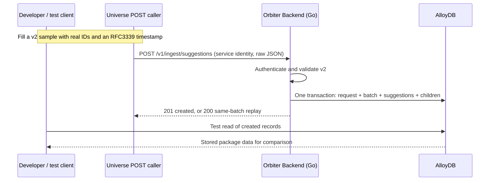

<Danger>
**DESIGN ONLY — ONE FULL-PACKAGE POST FROM UNIVERSE TO ORBITER BACKEND.** We are documenting the delivery mechanism and table designs; implementation has not started in this task.

Universe will send the complete suggestion package in one POST. Backend will create the batch, suggestions, children, and any missing parent request attribution in one transaction. No separate request API or pre-created request row is required.

When implementation begins, manually populated sample packages will test creation. Universe generation, frontend work, and action execution are outside this scope.
</Danger>

<Warning>
**The Xano-based suggestion tables are deprecated.** The new `suggestions.request_suggestion` replaces Xano's `suggestion_request`. Do not delete the Xano tables until the TanStack AI API endpoints are complete and Mark approves the deletion.
</Warning>

[Sample Suggestion Data](/guides/open-work/suggestion-delivery-and-tables/sample-suggestion-data) is the canonical source for both complete POST bodies, including the supplied email addresses and mobile numbers. The contract and table designs on this page now use the same version 2 schema.

[Add Required Entities](/guides/open-work/suggestion-delivery-and-tables/add-required-entities) lists the five people and one company whose entity IDs are needed for the sample packages, with all six supplied LinkedIn or website references.

<CardGroup cols={2}>
  <Card title="Leverage Loop UI" icon="arrows-rotate" href="/guides/open-work/suggestion-delivery-and-tables/leverage-loop-ui">
    Introduction stages, email and SMS actions, screenshots, and HTML/CSS.
  </Card>
  <Card title="Outcome UI" icon="bullseye" href="/guides/open-work/suggestion-delivery-and-tables/outcome-ui">
    WHY, separate trajectories, suggested sequencing, and grouped outreach actions.
  </Card>
</CardGroup>

## Mechanism to implement

| Deliverable | Acceptance |
| --- | --- |
| Backend receiver and storage | A Go POST handler and matching tables accept the full v2 package. The implementation instructions below follow the backend’s existing conventions. |
| Complete package | Owner, requester, request correlation ID, beneficiary, and all suggestion children arrive in the same body. Backend creates the minimal parent request row if it does not exist. |
| Direct ingestion | Universe, or a developer acting as its service identity, sends the raw v2 JSON body to `POST /v1/ingest/suggestions`. |
| Atomic storage | A valid delivery creates the batch, suggestions, and all children in one transaction. Invalid deliveries leave none of these rows behind. |
| Retry handling | Repeating the same batch and content returns the original result. Reusing a batch ID with different content returns a conflict. |
| Verification | An integration test or repository read reconstructs the stored payload. A dedicated HTTP read endpoint can be added later. |
| Manual test | Both sample payloads round-trip, including entity types, paragraphs, local refs, introduction stages, and ordered recipient arrays. |

Universe agents, scoring, graph traversal, trigger budgets, Pub/Sub, GCS claim checks, frontend integration, dismissal handlers, and action execution are later work. The proposed receiver stores email/SMS drafts and introduction instructions; ingestion must not send messages, generate QR codes, launch tasks, or create introductions.

The [Leverage Loops v1](/guides/open-work/leverage-loops-v1) webhook remains a separate existing contract. This new receiver must not assume that its body already matches v2.

## Architecture



The proposed receiver belongs **in Orbiter Backend**. Universe is the caller. For the first test after implementation, its body will be copied from the sample page and filled manually; no generation pipeline is required.

## Organization scope

**`org_id` is the local UUID in `organizations.organizations.id`.** It represents the personal or company organization synchronized with WorkOS. The external `workos_organization_id` is a separate text identifier and must not be sent in this UUID field.

**`requested_by` is the local user UUID in `users.users.id`.** It is the requesting user's `user_id`; do not add a second `user_id` to the envelope. It is distinct from a graph person ID and from a WorkOS user ID.

| Identity | Source and use |
| --- | --- |
| Delivered `org_id` | Universe supplies the existing local organization UUID. Backend validates the organization before creating records. |
| Delivered `requested_by` | Universe supplies an existing local user UUID. Backend verifies that user’s membership in the owning organization for a new user-requested delivery. |
| Existing `request_suggestion_id` | If the request already exists, its org, requester, type, and beneficiary must match the package. Otherwise the same transaction creates the minimal request row from those fields. |
| Graph `entity_id` + `entity_type` | Entity identity and display type. Not the requesting user or the owning tenant. |
| `beneficiary_contact_id` | Despite the historical name, this is the beneficiary's universal person entity UUID, not a user/contact-row ID. |

The scope key is `(org_id, suggestion_type, beneficiary_contact_id)`, with null beneficiary treated as one real scope value. Batch sequence numbers and future exclusions use this key. Each read selects exactly one organization; company membership never grants access to a member's personal organization.

Suggestions belong to the organization. A member joining can see its earlier suggestions; a member leaving loses access. A later dismissal hides the suggestion for the entire owning organization. User attribution FKs use `ON DELETE SET NULL` so deleting a requester does not delete shared suggestions. The required requester rule is enforced when accepting a new user-requested batch; historical rows may later have null attribution.

## Taxonomy

Use Go constants and `ValidX()` service validators for enum-like values, backed by SQL `text`. Follow the backend's policy: no PostgreSQL enum types, enum CHECK constraints, `oneof` tags, or duplicate OpenAPI enums. OpenAPI descriptions list the accepted values.

| Field | Accepted values / rule |
| --- | --- |
| `schema_version` | `2` for this receiver. Reject v1; do not silently coerce it. |
| `suggestion_type` | `outcome`, `leverage_loop`, `leverage_outcome`, `serendipity` |
| `origin` | `user_requested`, `agent_generated` |
| Delivery `status` | `complete`, `partial`, `failed`. `in_progress` is not accepted; a delivery contains a terminal result. |
| Request `status` | `active`, `archived` |
| `suggestion_mode` | `new_connection` or `reconnect` for serendipity; null for other types. |
| `entity_type` | `person`, `company`, plus types explicitly supported by the shared entity taxonomy. Never use legacy `org` for a company. |
| `action_type` | `make_intro`, `draft_email`, `draft_sms`, `create_task`, `leverage_loop`. Only the first three have populated examples today. |
| `path_kind` | `direct`, `team_member`, `organization` |
| `badge` | Optional display text such as `MOONSHOT` or `LEVERAGE LOOP`; independent of `suggestion_mode`. |

`outcome`, `leverage_loop`, and `leverage_outcome` are user-requested. They require a request ID and requester on ingestion. The two leverage types require a beneficiary person ID; ordinary outcome uses null. Serendipity is agent-generated with null request, requester, and beneficiary. `trigger_source` is optional attribution text for agent-generated deliveries and null on user-requested deliveries.

Support storage of these types with the same model. The manual fixtures exercise `outcome` and `leverage_loop`; automated producers and the other UI views are deferred.

## Envelope

Send one raw JSON envelope per batch, with `Content-Type: application/json`. There is no Pub/Sub wrapper, base64 encoding, `payload_ref`, or HTTP `data` wrapper in the POST body.

| Level | Required shape |
| --- | --- |
| Batch | `schema_version`, `batch_id`, `request_suggestion_id`, `org_id`, `requested_by`, `suggestion_type`, `beneficiary_contact_id`, `origin`, `trigger_source`, `status`, `generated_at`, `suggestions[]` |
| Suggestion | `source_ref`, `rank`, `entity_id`, `entity_type`, `suggestion_mode`, `badge`, `why`, `score`, `trajectories[]`, `suggested_sequencing[]`, `key_people`, `hooks`, `paths[]`, `evidence[]`, `entities[]`, `action_groups[]`, `actions[]` |
| WHY | `headline` string and `body[]` paragraph strings. Preserve paragraph boundaries. |
| Trajectory | `ref`, `rank`, `connector_entity_ids[]`, `body[]`, `path_refs[]` |
| Sequencing step | `rank`, `headline`, `body[]`, `trajectory_refs[]` |
| Entity entry | `entity_id`, `entity_type`, `role` |
| Action group | `ref`, `rank`, nullable `trajectory_ref` |
| Action | `ref`, `action_type`, `rank`, `label`, nullable `target_entity_id`, `group_ref`, `params` object |
| Path | `ref`, `path_kind`, `rank`, `hop_count`, nullable `path_score`, `hops[]` |
| Evidence | `evidence_type`, nullable `source_system`, `ref_id`, `snippet`, `weight` |

Nullable fields remain present with null values. Required arrays use `[]` when empty. `key_people` and `hooks` allow null as in the samples. WHY and drafts are plain text, not trusted HTML. `score` remains an object and may be `{}`.

Every object containing an explicit `entity_id` also contains `entity_type`: the suggested entity, entity entries, introduction recipients, hooks, and path hops. ID-only links such as `target_entity_id`, `connector_entity_ids[]`, and `recipient_entity_ids[]` resolve through the owning suggestion's typed `entities[]` entries. The same entity may have multiple roles, but its type must be consistent throughout the batch.

Payload refs are local strings, not database UUIDs. Store them unchanged. The backend generates UUIDv7 IDs for stored rows using `ids.NewUUIDv7()`; the sender supplies the batch UUIDv7 and retains it for retries. Preserve existing entity UUIDs rather than minting replacements for them.

### Action parameters

| Action | `params` contract |
| --- | --- |
| `draft_email` | Nonempty ordered `emails[]`, plus `draft.subject` and `draft.message`. Target is a declared person. |
| `draft_sms` | Nonempty ordered `mobile_phones[]`, plus `draft.message`. Target is a declared person. |
| `make_intro` | `workflow: "double_opt_in"`, typed `recipients[]` with an `emails[]` array per person, and ordered `steps[]` containing `rank`, `step`, `label`, `recipient_entity_ids[]`, and `draft`. |
| `create_task` | Preserve the previously proposed `due_in_days` nonnegative integer. This action is stored only; a task execution contract is later work. |
| `leverage_loop` | Empty object. `target_entity_id` is the person who would benefit from a future loop. Store only. |

A `make_intro` action introduces the suggested person to `target_entity_id`, which must equal the batch beneficiary. Its recipients declare exactly those two distinct people. The three steps are `ask_beneficiary`, `ask_suggested_person`, and `introduce`; the first two address one person each and the last references both. Every step carries its own subject and message. Store instructions, not opt-in results.

Validate email arrays as unique, nonempty address strings, without display names. Validate mobile arrays as unique E.164 strings matching `^\+[1-9]\d{1,14}$`. Do not sort, deduplicate silently, reformat, or merge the supplied contact choices.

The UI uses array index zero by default. It shows a fixed field for one value and a dropdown for multiple values. Each introduction participant gets an independent email choice. An array represents alternatives; it is never an instruction to send to every address or phone number. Selected recipients and later sending/consent state are not mutations to these recommendation arrays.

### UI-to-storage mapping

| Design behavior | Persisted source |
| --- | --- |
| WHY headline and paragraphs | `suggestion.why` JSONB |
| Charlie and Kyle as separate routes | Two `suggestion_trajectory` rows, each with its own connectors and body paragraphs |
| Closed trajectory summary | Names resolved from typed connector IDs, in trajectory rank order; no duplicated name string needed |
| “Start with Charlie” when sequencing is closed | Lowest-ranked `suggestion_sequence_step.headline` |
| One visible action per route | Groups ordered by rank; lowest-ranked action in each group is the top action |
| Additional email/SMS options behind a chevron | Other actions with the same `group_ref` |
| Email and mobile destination options | Ordered arrays in `suggestion_action.params` |
| Leverage Loop introduction stages | `params.recipients[]` and `params.steps[]` on its `make_intro` action |

Accordion state, palette, chevrons, CSS, avatars, bios, and copied card names do not belong in the delivery tables. Entity display data is hydrated by entity type and ID through the existing display/read contracts. Ingestion does not perform graph queries or require display enrichment to finish.

## Tables

All proposed tables are owned by the `suggestions` feature in Orbiter Backend’s AlloyDB. The first eleven support package ingestion; the last two have updated designs reserved for the later dismissal phase. No migration is applied by this documentation pass.

| Table | Grain and v2 design | Phase |
| --- | --- | --- |
| `request_suggestion` | One request. Local organization owner, requester attribution, type, beneficiary, and active/archive status. Created from the package when absent. Create new; the inspected backend has no table to ALTER. | POST mechanism |
| `suggestion_batch` | One delivery. Sender's batch ID, scope, request link, v2 version, terminal status, counts, timestamps, and normalized payload digest for replay conflicts. | POST mechanism |
| `suggestion` | One candidate per batch. Typed entity, badge, structured WHY, score, key people, hooks, and reserved dismissal fields. No aggregate trajectory columns. | POST mechanism |
| `suggestion_entity` | One entity/role per suggestion, with `entity_type` and original array position. Same ID can have multiple roles. | POST mechanism |
| `suggestion_path` | One structured path, preserving its local `ref`, rank, score, and ordered typed hops. | POST mechanism |
| `suggestion_evidence` | One evidence item, with position to preserve the original order. | POST mechanism |
| `suggestion_trajectory` | One route, preserving `ref`, rank, ordered connector IDs, paragraph array, and path refs. | POST mechanism |
| `suggestion_sequence_step` | One sequencing step, preserving rank, headline, paragraphs, and trajectory refs. | POST mechanism |
| `suggestion_action_group` | One action bar, preserving `ref`, rank, and optional route link. | POST mechanism |
| `suggestion_action` | One recommendation, preserving `ref`, `group_ref`, rank, target, CTA, and typed action parameters. | POST mechanism |
| `ingest_error` | One rejected authenticated attempt. Error paths and safe diagnostics; no raw drafts, emails, or phones in logs. | POST mechanism |
| `suggestion_suppression` | Future exclusion instruction, scoped to org/request/entity and carrying entity type. | Later |
| `suggestion_feedback_queue` | Future relationship signal, with the affected local user and typed entity. | Later |

Only the batch carries tenant ownership for its result children; child reads must join through it. Recommendation rows are immutable after commit. Dismissal fields are reserved for the later handler. Remove the old `spawned_request_id` write from this design: action execution and provenance belong in a later action-event model.

## API surface

The delivery mechanism has one write endpoint: `POST /v1/ingest/suggestions`. A user-facing request-creation API and a dedicated read endpoint are outside this mechanism. No endpoint is being implemented in this documentation pass.

| Endpoint | Authentication | Result |
| --- | --- | --- |
| `POST /v1/ingest/suggestions` | Verified, allowlisted Universe service identity | Atomically creates a delivered batch from raw v2 JSON. |

### Request attribution inside the package

`request_suggestion_id` is the sender-supplied UUID that correlates a user-requested package with its parent request. The accompanying `org_id`, `requested_by`, `suggestion_type`, and `beneficiary_contact_id` provide the metadata needed for that parent row.

For a new request ID, Backend creates `request_suggestion` with those values and `status = active` in the same transaction as the batch. If it already exists, validate and reuse it. Do not create another user or organization, invent a prompt, or run an agent. The actual request-generation/user-interface flow is later work. Agent-generated packages use null request/requester IDs and create no request row.

### Ingest a delivery

Use the full [Leverage Loop](/guides/open-work/suggestion-delivery-and-tables/sample-suggestion-data#leverage-loop) or [Outcome](/guides/open-work/suggestion-delivery-and-tables/sample-suggestion-data#outcome) JSON. Fill the existing local org/user IDs and all entity IDs, plus sender-minted UUIDv7 request/batch IDs and the timestamp. The request ID can be new: this single POST creates its minimal attribution row.

Authenticate the service separately from user routes. Validate the Google-signed OIDC ID token's signature, issuer, expiry, configured backend audience, and allowlisted Universe service-account subject. An audience check alone does not identify the authorized caller. The body requester is attribution, not the service principal. Use the same authentication in the manual test; do not add a public fixture endpoint or bypass flag. Cloud Run invocation permission, when applicable, is an additional gate. See [Google's service-to-service authentication guidance](https://docs.cloud.google.com/run/docs/authenticating/service-to-service).

Expose configuration for the expected audience and service-account subject; fail closed when either is missing. Mount this group separately from WorkOS user-session middleware. A developer may obtain a token by impersonating that permitted service account through the normal development credentials flow.

```json Batch created — HTTP 201
{
  "data": {
    "batch_id": "{batch UUID}",
    "batch_seq": 1,
    "status": "complete",
    "suggestion_count": 1,
    "created": true
  },
  "error": null,
  "meta": { "requestId": "{HTTP request ID}" }
}
```

An identical replay returns HTTP 200 with the same stored values and `created: false`. It does not create new children, advance the sequence, or replace dismissed state. Do not return 204; the backend uses `{data, error, meta}` responses via `pmw.OK`.

### Read-back verification

For the implementation test, reconstruct the package through the repository or a database query after the POST. A dedicated HTTP GET endpoint is not needed to prove creation. Preserve explicit nulls, empty arrays, refs, text, and ordering. Return timestamps as UTC RFC3339 values and compare them by instant; use UTC `Z` timestamps in fixtures. Load children in batches, not one query per action/entity.

A future UI read endpoint must verify the authenticated user’s current membership in the selected organization and join children through the owning batch. It must not expose another organization’s records. The later feed filters to `status = complete` and `dismissed_at IS NULL`, orders by `(batch_seq DESC, rank ASC)`, and uses cursor pagination. Partial and failed batches remain available for authorized detail inspection; never silently mark them complete.

### Errors and retries

Use `apperror` and the existing errors middleware. Invalid input maps to HTTP 400 in the current backend, with field paths in `error.details`. For example, a malformed Kyle mobile option identifies `suggestions[0].actions[3].params.mobile_phones[1]`.

| Response | Cause | Caller behavior |
| --- | --- | --- |
| 400 | Invalid JSON, unsupported version/value, unresolved ref, nonmatching request scope, archived request, invalid contacts, or body over the initial 5 MiB application limit | Correct the payload; do not retry unchanged. |
| 401 | Missing or invalid token | Correct authentication. |
| 403 | Authenticated service not allowlisted, or invalid current organization membership | Correct authorization. |
| 409 | Existing `batch_id` with a different normalized payload | Preserve the original; use a new batch ID for a new delivery. |
| 500 | Database or other transient internal failure | Retry the same batch ID and body with backoff. |

Record authenticated validation/conflict failures in `ingest_error` outside a rolled-back result transaction. Log field paths and error categories, not contact values or full payloads. A failure to write the diagnostic row must not mask the original error. Pre-authentication failures need no database write.

## Ingest handler

### Validate before writing

1. Limit the body to 5 MiB, require JSON, reject trailing documents, duplicate object keys, and unknown DTO fields. Decode structured v2 DTOs; do not accept arbitrary unchecked `params` blobs. Extensible `score` objects may contain producer-specific keys.
2. Validate the v2 envelope and every candidate. `complete` and `partial` may have zero or more suggestions; `failed` must have `suggestions: []`. Persist the supplied terminal status and derive `suggestion_count` from the array.
3. Check required strings, positive unique ranks, unique `source_ref` per batch, unique route/path/group/action refs in each suggestion, and unique entity/role pairs. Require ranked arrays in ascending rank order; ranks need not be contiguous.
4. Build a typed entity map per suggestion and verify type consistency across the batch. Resolve the candidate, beneficiary, action targets, connectors, key people, hook targets, path-hop entities, and introduction recipients through it. Beneficiaries, connectors, email/SMS targets, and introduction participants must be people.
5. Resolve route `path_refs`, sequencing `trajectory_refs`, group `trajectory_ref`, and action `group_ref` within the same suggestion. Every group must have at least one action. Refs never resolve to another suggestion or batch.
6. Validate action-specific parameters and recipient arrays. For introduction steps, resolve every recipient ID to exactly one typed `params.recipients[]` entry and verify the two-party workflow described above.
7. Require `why.headline` and nonempty `why.body[]`; preserve text. Allow empty scores, paths, and evidence. Trajectories, sequencing, and non-null key people are Outcome-family fields; Leverage Loop uses empty trajectories/sequencing and null key people. `hooks` may appear on any type, each with `entity_id`, `entity_type`, `angle`, and `text`. Nonempty path hops carry entity type and match the declared `hop_count`.

Do not fabricate path records from prose. The supplied Charlie/Kyle narratives have no verified path data; their `path_refs`, `paths`, and `evidence` stay empty.

### Normalize and identify a retry

After validation, decode the complete JSON into a generic tree with `json.Number` for numbers and marshal it with Go's `encoding/json` for deterministic object-key ordering. Compute SHA-256 over those bytes. This digest ignores whitespace and object-key order; array order, explicit nulls, strings, and number representations remain significant. Do not drop optional-looking fields, sort recipient arrays, or hash only the candidate IDs.

Store the digest on the batch as `payload_sha256`. Do not store a second mutable copy of the entire payload. Reconstruction uses the typed result tables. Test the normalizer with differently formatted JSON and with changed recipient-array order.

### One transaction

Use pgx and sqlc queries on the same transaction/connection, at `READ COMMITTED` isolation.

1. Acquire a transaction-level advisory lock for the batch ID. Use a stable namespaced 64-bit hash of the key, not Go's randomized map hash. This serializes retries of the same batch even if a conflicting body supplies another scope.
2. Re-read that batch. If present, compare its digest: identical returns the stored result after ending the transaction; different returns 409. Authenticate every retry, but do not invalidate a committed result because its request was later archived or its requester deleted.
3. For a new delivery, validate the owning organization and requester membership through the organizations contract. For `user_requested`, acquire a transaction-level advisory lock for the request ID: create its minimal row if absent, or lock and validate its active status, org, type, beneficiary, and requester if present. This handles two batches concurrently creating the same request. Serendipity creates no request row but still requires a valid owning org.
4. Acquire the transaction-level advisory lock for the scope key, encoded unambiguously with a null beneficiary marker. Always acquire locks in this order: batch, request when present, then scope. While holding it, assign `batch_seq = COALESCE(MAX(batch_seq), 0) + 1` for that scope, using `IS NOT DISTINCT FROM` for the nullable beneficiary.
5. Insert the batch with its final status, digest, and count. Insert suggestions; then entity/path/evidence/trajectory rows; then sequencing, action groups, and actions. Keep refs as refs; group-to-trajectory and action-to-group FKs include `suggestion_id`.
6. Commit once. Return 201 only after commit. Any child failure rolls back the entire batch and any request row created by this delivery. Never upsert over an existing candidate or append children on a replay.

The scope unique constraint is a final guard; it does not replace serialization. Retry the entire transaction on a bounded serialization/deadlock retry, then return a transient error if retries are exhausted. If a commit outcome is uncertain, the caller's identical retry resolves it through the batch ID. PostgreSQL documents [transaction-scoped advisory locks](https://www.postgresql.org/docs/15/explicit-locking.html#ADVISORY-LOCKS) and [null-aware uniqueness](https://www.postgresql.org/docs/15/ddl-constraints.html#DDL-CONSTRAINTS-UNIQUE-CONSTRAINTS).

## Go implementation steps

The guidance below was checked against local Orbiter Backend revision `27253e6` on September 14. Recheck the implementation branch before creating files; these paths describe planned additions, not existing suggestion handlers.

| Area | Build instructions |
| --- | --- |
| Feature module | Add `internal/features/suggestions` with `Module`, `Deps`, `New`, `RegisterHTTP`, and the standard worker registration shape. No workers are needed today. Wire the module in `internal/app`; keep business logic in the feature. |
| HTTP types | Put wire DTOs in `http_types.go`, domain types and Go enum validators in `types.go`, and response mapping in `http_mappers.go`. Use typed structs for WHY, routes, steps, groups, recipient options, and each action's parameters. Keep nullable response fields present. |
| Handler | Parse, validate transport, call the ingest service, then use `pmw.OK`. No SQL or business rules in the handler. Verify the service token separately from user-session authentication. |
| Service | Own request-scope validation, recipient validation, ref resolution, normalization/digest, ordering, and idempotency orchestration. Inject organization membership and entity-type contracts through feature interfaces or sibling `*pub` contracts. |
| Repository | Own the single transaction and typed sqlc calls. Return domain objects, not raw pgx rows. Do not open nested independent transactions for children. |
| Queries | Add `internal/features/suggestions/queries/` and a `sqlc.yaml` block generating into its `db/` directory. Preserve array positions; pass empty Go slices for non-null SQL arrays, never nil. |
| Isolation | Add `cross-feature-suggestions` to `.golangci.yml`. Import other features only through their `*pub` packages; use the composition root for injection. |
| Identity | Reuse `organizations.organizations` and `users.users`; do not create another org/user table. Use `ids.NewUUIDv7()` for all new backend row IDs. |
| OpenAPI | Add `api/suggestions.openapi.yaml`, root path references and a tag. Document the v2 POST DTO, service authentication, response envelope, and errors. Plain strings plus descriptions for Go enum-like fields. |
| Tests | Unit-test validation and retry normalization; integration-test transaction rollback, FKs, same-scope concurrency, and full read-back. Keep fixtures in the feature's `testdata/`. |

When implementation is authorized, create the migration using `make migration name=suggestions_001_init`, then put the **Package ingestion tables** SQL below in its Up section. Down drops only these new feature tables in reverse dependency order, then the empty `suggestions` schema; never drop users, organizations, or Xano tables. Re-timestamp an unmerged migration through the repository workflow if newer base-branch migrations land.

The inspected checkout has no `request_suggestion` table. If the implementation branch has since added one, reconcile with that owner using an additive migration; do not run this creation blindly or add non-null columns to populated rows without a backfill plan.

Run the repository's normal checks after implementation:

```bash Backend checks
make sqlc-generate
go test ./internal/features/suggestions/ -short
go test ./internal/features/suggestions/ -run Integration
make test
make lint
npx @redocly/cli lint api/openapi.yaml
```

Run integration tests against an isolated test database. Apply migrations only to the selected development database after review; this documentation update itself does not apply them. Repository guidance: [AGENTS.md](https://github.com/Orbiterio/orbiter-backend/blob/27253e68ca997bc7f2275f2156b6783b1b265207/AGENTS.md) and [migration conventions](https://github.com/Orbiterio/orbiter-backend/blob/27253e68ca997bc7f2275f2156b6783b1b265207/migrations/CLAUDE.md).

## Manual creation test

1. Use an existing verified development user and its local personal or company organization. Resolve the sample people/company to their real entity UUIDs in that environment; do not invent IDs or submit the curly-bracket placeholders.
2. Mint distinct UUIDv7 request IDs and batch IDs for the two user-requested samples. Supply the existing organization/member UUIDs. Leave those new request IDs absent from the database so the test proves the full package can create them.
3. Save the two complete sample JSON blocks as `leverage-loop.json` and `outcome.json`. Substitute the IDs and RFC3339 timestamp; mint a different UUIDv7 batch ID for each. Preserve the supplied draft text and contact arrays.
4. Have Universe POST each body to Orbiter Backend, or use the equivalent manual calls below with a permitted service token. There is no backend-to-Universe submit call in this test.
5. Read each batch and its children through the test repository or database. Compare the reconstructed payload structurally with the submitted JSON, then verify the table counts below. JSON object-key order may change; paragraph, contact, recipient, and step order may not.
6. Repeat each POST unchanged. Expect 200, `created: false`, the original sequence, and unchanged row counts. Then change one draft or recipient option with the same batch ID: expect 409 and the original rows unchanged.

### POST the samples

After the receiver is implemented, set `ORBITER_BACKEND_URL` and `UNIVERSE_ID_TOKEN` to the development endpoint and permitted service identity. These commands describe the intended test; they are not run as part of this design pass.

```bash Full-package POSTs
curl --fail-with-body "$ORBITER_BACKEND_URL/v1/ingest/suggestions" \
  -H "Authorization: Bearer $UNIVERSE_ID_TOKEN" \
  -H 'Content-Type: application/json' \
  --data-binary @leverage-loop.json

curl --fail-with-body "$ORBITER_BACKEND_URL/v1/ingest/suggestions" \
  -H "Authorization: Bearer $UNIVERSE_ID_TOKEN" \
  -H 'Content-Type: application/json' \
  --data-binary @outcome.json
```

### Expected stored rows

Counts are per package when both its request ID and batch ID are new.

| Table | Leverage Loop | Outcome |
| --- | ---: | ---: |
| `request_suggestion` | 1 | 1 |
| `suggestion_batch` | 1 | 1 |
| `suggestion` | 1 | 1 |
| `suggestion_entity` | 2 | 4 |
| `suggestion_path` | 0 | 0 |
| `suggestion_evidence` | 0 | 0 |
| `suggestion_trajectory` | 0 | 2 |
| `suggestion_sequence_step` | 0 | 3 |
| `suggestion_action_group` | 1 | 2 |
| `suggestion_action` | 5 | 4 |
| `ingest_error` on initial success | 0 | 0 |

With no earlier batches in either scope, each fixture receives `batch_seq = 1`; sequences are per scope, not global. A new batch ID in the same scope creates another batch and increments only that scope’s sequence. Reusing the same matching request ID does not create another parent request.

Kyle's email action must read back Gmail first and `kyle@beinghuman.studio` second. His SMS action must read back `+13234526998` first and `+6588333422` second. The introduction action must retain independent email arrays for Ethan and Katelyn and all three draft stages.

### Required acceptance cases

| Case | Expected result |
| --- | --- |
| Both complete fixtures | Exact v2 content round-trip and the row counts above. |
| Missing `entity_type`, wrong entity type, dangling local ref, or cross-suggestion ref | 400 with a field path; no batch or child rows. |
| Empty email/phone choices, invalid email, or non-E.164 number | 400; no result rows. |
| Wrong org/requester/beneficiary/type for a new batch, or archived request | Rejected; no result rows. |
| Same batch and body submitted concurrently | One 201 and one 200; one request, one batch, and one set of children. |
| Two batches referencing the same new request ID | One shared request row, two batches, and no request-creation race. |
| Two different batches concurrently in the same nullable-beneficiary scope | Distinct consecutive sequence numbers; no lost result. |
| Same batch with reordered object keys/whitespace | 200 identical replay. |
| Same batch with changed array order or draft | 409; stored content is unchanged. |
| Injected failure after inserting some children | Complete rollback, including a newly created request row; retry can create the whole package. |
| Partial/failed terminal delivery | Supplied status retained; failed has zero suggestions. |
| Missing/wrong service token or valid token for a different service | Rejected before result storage. |
| Requester is not a current member of the supplied org | New delivery rejected with no result rows. |
| Requester later deleted | Shared batch survives; attribution becomes null. |

## Schema

This is the complete target table design for v2. It replaces the old unqualified tables, DB enums, aggregate trajectory columns, and action uniqueness by type/target. Use PostgreSQL 15 or later for `NULLS NOT DISTINCT`.

FKs and uniqueness enforce structural integrity. Go services enforce enum membership, positive ranks, JSON shapes, typed entity consistency, and cross-array references. The SQL deliberately has no enum CHECKs or enum types. Repeated action types for the same target are allowed when they have different refs; identity is `(suggestion_id, ref)`.

### Package ingestion tables

```sql suggestions_001_init — Up section expandable
CREATE SCHEMA suggestions;

CREATE TABLE suggestions.request_suggestion (
  id uuid PRIMARY KEY,
  org_id uuid NOT NULL REFERENCES organizations.organizations(id) ON DELETE RESTRICT,
  requested_by uuid REFERENCES users.users(id) ON DELETE SET NULL,
  suggestion_type text NOT NULL,
  beneficiary_contact_id uuid,
  status text NOT NULL DEFAULT 'active',
  created_at timestamptz NOT NULL DEFAULT now(),
  updated_at timestamptz NOT NULL DEFAULT now()
);
CREATE INDEX request_suggestion_org_idx
  ON suggestions.request_suggestion (org_id, created_at DESC, id DESC);

CREATE TABLE suggestions.suggestion_batch (
  id uuid PRIMARY KEY,
  org_id uuid NOT NULL REFERENCES organizations.organizations(id) ON DELETE RESTRICT,
  requested_by uuid REFERENCES users.users(id) ON DELETE SET NULL,
  request_suggestion_id uuid REFERENCES suggestions.request_suggestion(id) ON DELETE RESTRICT,
  suggestion_type text NOT NULL,
  beneficiary_contact_id uuid,
  origin text NOT NULL,
  trigger_source text,
  batch_seq bigint NOT NULL,
  status text NOT NULL,
  schema_version integer NOT NULL,
  suggestion_count integer NOT NULL,
  payload_sha256 bytea NOT NULL,
  generated_at timestamptz NOT NULL,
  ingested_at timestamptz NOT NULL DEFAULT now(),
  CONSTRAINT suggestion_batch_seq_uq UNIQUE NULLS NOT DISTINCT
    (org_id, suggestion_type, beneficiary_contact_id, batch_seq)
);
CREATE INDEX suggestion_batch_scope_idx
  ON suggestions.suggestion_batch
    (org_id, suggestion_type, beneficiary_contact_id, batch_seq DESC);
CREATE INDEX suggestion_batch_request_idx
  ON suggestions.suggestion_batch (request_suggestion_id)
  WHERE request_suggestion_id IS NOT NULL;

CREATE TABLE suggestions.suggestion (
  id uuid PRIMARY KEY,
  batch_id uuid NOT NULL REFERENCES suggestions.suggestion_batch(id) ON DELETE CASCADE,
  source_ref text NOT NULL,
  rank integer NOT NULL,
  entity_id uuid NOT NULL,
  entity_type text NOT NULL,
  suggestion_mode text,
  badge text,
  why jsonb NOT NULL,
  score jsonb NOT NULL DEFAULT '{}',
  key_people uuid[],
  hooks jsonb,
  dismissed_at timestamptz,
  dismissed_by uuid REFERENCES users.users(id) ON DELETE SET NULL,
  dismissal_reason text,
  created_at timestamptz NOT NULL DEFAULT now(),
  CONSTRAINT suggestion_batch_source_uq UNIQUE (batch_id, source_ref),
  CONSTRAINT suggestion_batch_rank_uq UNIQUE (batch_id, rank)
);
CREATE INDEX suggestion_entity_live_idx
  ON suggestions.suggestion (entity_id, entity_type)
  WHERE dismissed_at IS NULL;

CREATE TABLE suggestions.suggestion_entity (
  suggestion_id uuid NOT NULL REFERENCES suggestions.suggestion(id) ON DELETE CASCADE,
  entity_id uuid NOT NULL,
  entity_type text NOT NULL,
  role text NOT NULL,
  position integer NOT NULL,
  PRIMARY KEY (suggestion_id, entity_id, role),
  CONSTRAINT suggestion_entity_position_uq UNIQUE (suggestion_id, position)
);
CREATE INDEX suggestion_entity_lookup_idx
  ON suggestions.suggestion_entity (entity_id, entity_type);

CREATE TABLE suggestions.suggestion_path (
  id uuid PRIMARY KEY,
  suggestion_id uuid NOT NULL REFERENCES suggestions.suggestion(id) ON DELETE CASCADE,
  ref text NOT NULL,
  path_kind text NOT NULL,
  rank integer NOT NULL,
  hop_count integer NOT NULL,
  path_score numeric,
  hops jsonb NOT NULL DEFAULT '[]',
  created_at timestamptz NOT NULL DEFAULT now(),
  CONSTRAINT suggestion_path_ref_uq UNIQUE (suggestion_id, ref),
  CONSTRAINT suggestion_path_rank_uq UNIQUE (suggestion_id, rank)
);

CREATE TABLE suggestions.suggestion_evidence (
  id uuid PRIMARY KEY,
  suggestion_id uuid NOT NULL REFERENCES suggestions.suggestion(id) ON DELETE CASCADE,
  position integer NOT NULL,
  evidence_type text NOT NULL,
  source_system text,
  ref_id text,
  snippet text,
  weight numeric,
  created_at timestamptz NOT NULL DEFAULT now(),
  CONSTRAINT suggestion_evidence_position_uq UNIQUE (suggestion_id, position)
);

CREATE TABLE suggestions.suggestion_trajectory (
  id uuid PRIMARY KEY,
  suggestion_id uuid NOT NULL REFERENCES suggestions.suggestion(id) ON DELETE CASCADE,
  ref text NOT NULL,
  rank integer NOT NULL,
  connector_entity_ids uuid[] NOT NULL DEFAULT '{}',
  body text[] NOT NULL DEFAULT '{}',
  path_refs text[] NOT NULL DEFAULT '{}',
  created_at timestamptz NOT NULL DEFAULT now(),
  CONSTRAINT suggestion_trajectory_ref_uq UNIQUE (suggestion_id, ref),
  CONSTRAINT suggestion_trajectory_rank_uq UNIQUE (suggestion_id, rank)
);

CREATE TABLE suggestions.suggestion_sequence_step (
  id uuid PRIMARY KEY,
  suggestion_id uuid NOT NULL REFERENCES suggestions.suggestion(id) ON DELETE CASCADE,
  rank integer NOT NULL,
  headline text NOT NULL,
  body text[] NOT NULL DEFAULT '{}',
  trajectory_refs text[] NOT NULL DEFAULT '{}',
  created_at timestamptz NOT NULL DEFAULT now(),
  CONSTRAINT suggestion_sequence_rank_uq UNIQUE (suggestion_id, rank)
);

CREATE TABLE suggestions.suggestion_action_group (
  id uuid PRIMARY KEY,
  suggestion_id uuid NOT NULL REFERENCES suggestions.suggestion(id) ON DELETE CASCADE,
  ref text NOT NULL,
  rank integer NOT NULL,
  trajectory_ref text,
  created_at timestamptz NOT NULL DEFAULT now(),
  CONSTRAINT suggestion_action_group_ref_uq UNIQUE (suggestion_id, ref),
  CONSTRAINT suggestion_action_group_rank_uq UNIQUE (suggestion_id, rank),
  CONSTRAINT suggestion_action_group_trajectory_fk
    FOREIGN KEY (suggestion_id, trajectory_ref)
    REFERENCES suggestions.suggestion_trajectory (suggestion_id, ref) ON DELETE CASCADE
);

CREATE TABLE suggestions.suggestion_action (
  id uuid PRIMARY KEY,
  suggestion_id uuid NOT NULL REFERENCES suggestions.suggestion(id) ON DELETE CASCADE,
  ref text NOT NULL,
  group_ref text NOT NULL,
  action_type text NOT NULL,
  rank integer NOT NULL,
  label text NOT NULL,
  target_entity_id uuid,
  params jsonb NOT NULL,
  created_at timestamptz NOT NULL DEFAULT now(),
  CONSTRAINT suggestion_action_ref_uq UNIQUE (suggestion_id, ref),
  CONSTRAINT suggestion_action_rank_uq UNIQUE (suggestion_id, rank),
  CONSTRAINT suggestion_action_group_fk
    FOREIGN KEY (suggestion_id, group_ref)
    REFERENCES suggestions.suggestion_action_group (suggestion_id, ref) ON DELETE CASCADE
);
CREATE INDEX suggestion_action_group_order_idx
  ON suggestions.suggestion_action (suggestion_id, group_ref, rank);

CREATE TABLE suggestions.ingest_error (
  id uuid PRIMARY KEY,
  batch_id uuid,
  request_suggestion_id uuid,
  org_id uuid,
  error_code text NOT NULL,
  http_status integer NOT NULL,
  detail jsonb NOT NULL DEFAULT '{}',
  created_at timestamptz NOT NULL DEFAULT now()
);
CREATE INDEX ingest_error_batch_idx ON suggestions.ingest_error (batch_id);
```

`ingest_error` IDs are nullable and deliberately have no FKs: a rejected delivery may name records that do not exist. Its `detail` object contains field paths and safe error codes only. Child `position` values are backend-assigned, one-based array positions; they are not new wire fields.

`body`, connector ID, and ref arrays preserve their order. `params` JSONB preserves email/mobile and introduction arrays. `path_refs` and `trajectory_refs` arrays cannot be protected by a normal element-level FK, so the service validates each entry against the same suggestion before insert. The scalar route/group FKs enforce the same-suggestion rule in the database as well.

### Later dismissal tables

These two definitions update the earlier designs for typed entities and local user/org IDs. Keep them out of the package-ingestion migration unless the dismissal feature is explicitly brought into scope.

```sql Future dismissal migration — design only expandable
CREATE TABLE suggestions.suggestion_suppression (
  id uuid PRIMARY KEY,
  org_id uuid NOT NULL REFERENCES organizations.organizations(id) ON DELETE RESTRICT,
  suggestion_type text NOT NULL,
  beneficiary_contact_id uuid,
  request_suggestion_id uuid REFERENCES suggestions.request_suggestion(id) ON DELETE RESTRICT,
  entity_id uuid NOT NULL,
  entity_type text NOT NULL,
  source_ref text,
  reason text NOT NULL,
  suppressed_until timestamptz,
  origin_suggestion_id uuid REFERENCES suggestions.suggestion(id) ON DELETE SET NULL,
  created_at timestamptz NOT NULL DEFAULT now(),
  updated_at timestamptz NOT NULL DEFAULT now(),
  CONSTRAINT suggestion_suppression_uq UNIQUE NULLS NOT DISTINCT
    (org_id, suggestion_type, beneficiary_contact_id, request_suggestion_id, entity_id)
);
CREATE INDEX suggestion_suppression_lookup_idx
  ON suggestions.suggestion_suppression (org_id, suggestion_type, suppressed_until);
CREATE INDEX suggestion_suppression_entity_idx
  ON suggestions.suggestion_suppression (org_id, entity_id, entity_type);

CREATE TABLE suggestions.suggestion_feedback_queue (
  id uuid PRIMARY KEY,
  user_id uuid REFERENCES users.users(id) ON DELETE SET NULL,
  entity_id uuid NOT NULL,
  entity_type text NOT NULL,
  signal_type text NOT NULL,
  source_suggestion_id uuid REFERENCES suggestions.suggestion(id) ON DELETE SET NULL,
  status text NOT NULL DEFAULT 'pending',
  created_at timestamptz NOT NULL DEFAULT now(),
  reviewed_at timestamptz,
  reviewed_by uuid REFERENCES users.users(id) ON DELETE SET NULL
);
CREATE INDEX suggestion_feedback_queue_pending_idx
  ON suggestions.suggestion_feedback_queue (created_at)
  WHERE status = 'pending';
```

A feedback row's `user_id` identifies whose relationship the signal describes; it is not a duplicate requester field. If that user is deleted, retain the audit row but do not apply a graph signal without a resolvable user.

## Deferred behavior

### Dismissal and suppression

Keep the existing product decisions for a later backend slice. Dismissal changes only `dismissed_at`, `dismissed_by`, and `dismissal_reason` on the immutable suggestion and upserts a suppression in one transaction. It is idempotent, hides the result for the whole owning org, and never edits the original actions or recipient options.

| Reason | Cooldown | Scope |
| --- | --- | --- |
| `not_relevant` | 180 days | Owning org; same request for user-requested suggestions |
| `bad_timing` | 28 days | Owning org; same request for user-requested suggestions |
| `no_reason` | 60 days | Default; owning org and same request where present |
| `already_in_touch` | 14 days | Reconnect signal; normal suppression scope plus user feedback |
| `relationship_ended` | Permanent | Dismissing member's personal org, null request ID, plus user feedback |
| `not_worth_the_reach` | 60 days | New-connection path critique; normal suppression scope |

Serendipity suppression has null request ID and applies to its org stream. A user-requested suppression normally applies only to that request's future batches. `relationship_ended` is the exception: even when clicked in company mode, write the permanent suppression to the member's personal org. It hides the current company suggestion but does not globally suppress the company stream. Preserve an existing permanent suppression when processing a later finite cooldown; repeated dismissals must not shorten it.

Future exclusion reads must include a permanent personal `relationship_ended` suppression across suggestion types and beneficiaries for that personal org; matching only the original request's scope would defeat its intended effect. Company streams remain independent. Feedback statuses are `pending`, `applied`, and `rejected`; signals require review before any graph write.

### Generation, delivery infrastructure, and execution

- Add user-facing request creation, backend-to-Universe request submission, exclusion APIs, generation status, and resubmission orchestration after manual creation passes. A resubmission uses a new batch ID and leaves older batches intact.
- Add automated Universe generation, graph paths, hooks, scores, serendipity triggers, and per-org rate budgets separately. Empty sample graph data must not block the package-creation test.
- Add Pub/Sub adapters and large-payload transport later. The adapter must deliberately translate ingest outcomes into acknowledgments or retries; ordinary HTTP 4xx responses must not be described as automatically acknowledged Pub/Sub messages.
- Add frontend feeds, dismissal/bulk dismissal endpoints, and action events later. Recipient selection, double opt-in responses, sending, QR generation, tasks, and spawned requests are execution state, not ingestion side effects.

## Version 1 transition

| Older design | Version 2 build target |
| --- | --- |
| Pub/Sub/base64 body | Direct authenticated POST of the sample JSON |
| `schema_version: 1` | `schema_version: 2`; explicit rejection of v1 at this receiver |
| `entity_kind: "org"` | `entity_type: "company"`; pair every explicit entity ID with its type |
| `trajectory_text`, `trajectory_entity_ids`, `trajectory_path_refs` | Separate trajectory rows with paragraph arrays and local path refs |
| No sequencing model | Ordered `suggestion_sequence_step` rows |
| Flat ungrouped actions | Action group rows plus each action's `ref` and `group_ref` |
| Empty email/intro params; no SMS | Validated drafts, ordered contact arrays, introduction recipients/stages, and `draft_sms` |
| `spawned_request_id` on recommendation | Deferred execution/event state |
| DB enums and unqualified table names | Go enum validators and the `suggestions` schema |
| Existing-table ALTER for the request | New request table in the inspected backend; reconcile any intervening implementation first |
| Ambiguous WorkOS IDs | Local backend organization and user UUIDs linked to WorkOS |
| Status always forced complete / replay checks only complete | Store all terminal statuses; compare payload digest for every committed batch |

There is no automatic rewrite of existing Xano or v1 data in this scope. If v1 tables or consumers exist in the implementation environment, plan an additive migration and explicit mapping before switching them. The new docs and examples do not claim that migration has run.
