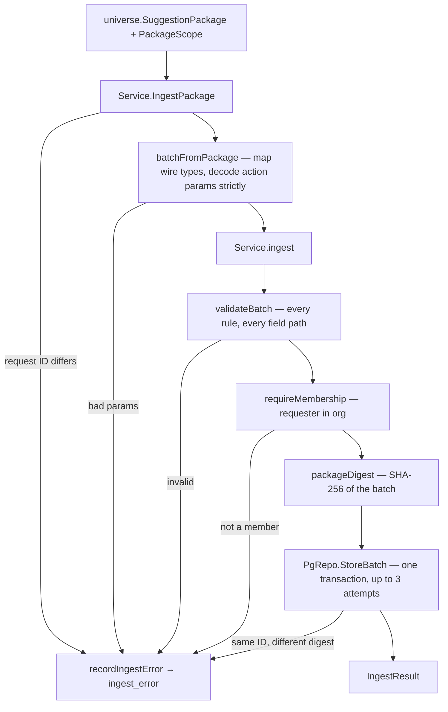

`Service.IngestPackage` is the Go function that takes a decoded v2 suggestion package and writes it into the `suggestions` schema: one batch row, one row per candidate, and the child rows for entities, trajectories, action groups, and actions. It validates the whole package first and writes everything in one transaction, so a package is stored completely or not at all.

<Info>
Checked against `orbiter-backend` `main` at `aa647514` (2026-09-23). Paths are relative to the repo root; everything in `internal/features/suggestions/` is written without that prefix below. The ingest code has not changed since `fd32f8e` (2026-09-17).
</Info>

## Scope for hooks

<Warning>
**Plan — not built.** This section specifies the work. Nothing below exists in `orbiter-backend` yet; the rest of this page describes the code as it is today.
</Warning>

### Goal

When a suggestion in the package carries a `hooks` array, the ingest writes one row per hook into a new child table, `suggestions.suggestion_hook`, the same way it writes `actions[]` into `suggestion_action`. The shape comes from the [Angel Outcome Demo](/guides/open-work/suggestion-delivery-and-tables/angel-outcome-demo): three written hooks per candidate, plus a generated `hook_remix` hook that also records how it was generated. Each hook gains a required `ref`, so an action or draft can later point at the hook it uses.

### The hook shape

The Angel Outcome Demo shape, plus the new `ref`:

```json Two hooks from the Angel Outcome Demo (Laurel Touby), with refs added
"hooks": [
  {
    "ref": "hook-thesis",
    "entity_id": "01a0cdb9-f90b-75cd-b83c-e86c8efe3ca4",
    "entity_type": "person",
    "angle": "thesis",
    "text": "You monetized connecting media people before software could. …"
  },
  {
    "ref": "hook-remix",
    "entity_id": "01a0cdb9-f90b-75cd-b83c-e86c8efe3ca4",
    "entity_type": "person",
    "angle": "hook_remix",
    "text": "For a decade, the most valuable context graph in New York media lived in your head: …",
    "model": "z-ai/glm-5.3-flash",
    "tone_instruction": "more creative",
    "temperature": 0.8,
    "max_tokens": 4000
  }
]
```

| Key | Required | Type | Rule |
| --- | --- | --- | --- |
| `ref` | Yes | text | **New.** Non-empty and unique among the suggestion's hooks, like action and group `ref` values |
| `entity_id` | Yes | UUID | Declared in the suggestion's `entities[]` with the same type (already enforced) |
| `entity_type` | Yes | text | `persons`, `companies`, … in the loaded file (`person` in Mark's JSON) |
| `angle` | Yes | text | Non-empty. Free text, not an enum: `thesis`, `personal`, `provocative`, and `hook_remix` are demo values |
| `text` | Yes | text | Non-empty |
| `model` | No | text | Only on generated hooks. Non-empty when present |
| `tone_instruction` | No | text | Only on generated hooks. Non-empty when present |
| `temperature` | No | number | Only on generated hooks. `0` to `2` when present |
| `max_tokens` | No | integer | Only on generated hooks. Greater than `0` when present |

The four recipe keys are optional and independent: a hook can carry none, some, or all of them. Hooks have no `rank`; array order is the display order and is stored as `position`.

### What happens today

- **The CLI rejects the Angel package.** `cmd/ingestpackage` decodes with `DisallowUnknownFields`, and `universe.PackageHook` has only `entity_id`, `entity_type`, `angle`, and `text`. The first `hook_remix` hook fails the load at `decodePackage` with `json: unknown field "model"`. The Angel Outcome Demo's load note saying the recipe is "decoration" that the contract ignores is wrong for the CLI and needs correcting as part of this work.
- **The Leverage Loop worker drops the recipe silently.** The Universe client decodes leniently, so the four keys are discarded and the hook is stored without them.
- **No package carries a hook `ref` yet.** Once `ref` is required, every package with hooks has to add one: the Angel Outcome Demo, the samples, and whatever Universe sends to the Leverage Loop worker.
- **Hooks are stored only as JSONB** in `suggestion.hooks`, written by `hooksJSON` and read back by `hooksFromJSON` for `ReadBatch` and the feed (`HookResponse` in the API).

### Table spec

New migration `migrations/<timestamp>_suggestions_005_hooks.sql`. It follows `suggestion_action` for the `ref` key and `suggestion_node` for `position`, because hooks have no rank.

```sql suggestions.suggestion_hook
-- +goose Up
-- One hook on a suggestion, in delivered order. ref is the sender's key,
-- unique within the suggestion. The recipe columns are set only on a
-- generated hook. Angle is free text, validated in Go.
CREATE TABLE suggestions.suggestion_hook (
    id               UUID             PRIMARY KEY,
    suggestion_id    UUID             NOT NULL REFERENCES suggestions.suggestion(id) ON DELETE CASCADE,
    ref              TEXT             NOT NULL,
    position         INT              NOT NULL,
    entity_type      TEXT             NOT NULL,
    node_uuid        UUID             NOT NULL,
    angle            TEXT             NOT NULL,
    text             TEXT             NOT NULL,
    model            TEXT,
    tone_instruction TEXT,
    temperature      DOUBLE PRECISION,
    max_tokens       INT,
    created_at       TIMESTAMPTZ      NOT NULL DEFAULT NOW(),
    CONSTRAINT suggestion_hook_ref_uq      UNIQUE (suggestion_id, ref),
    CONSTRAINT suggestion_hook_position_uq UNIQUE (suggestion_id, position)
);
CREATE INDEX suggestion_hook_entity_idx
    ON suggestions.suggestion_hook (entity_type, node_uuid);

-- +goose Down
DROP TABLE IF EXISTS suggestions.suggestion_hook;
```

| Column | Source | Notes |
| --- | --- | --- |
| `id` | `ids.NewUUIDv7()` | Minted, like every child row |
| `suggestion_id` | The parent `suggestion` row | Deleted with the suggestion, so a batch or request delete removes hooks too |
| `ref` | `ref` | `(suggestion_id, ref)` is the key a future action would reference, the way `suggestion_action` references a group |
| `position` | Array index + 1 | Keeps delivered order |
| `entity_type`, `node_uuid` | `entity_type`, `entity_id` | Not checked against the entity table, same as every other node reference |
| `angle`, `text` | Same keys | |
| `model`, `tone_instruction`, `temperature`, `max_tokens` | Same keys | `NULL` when absent |

No uniqueness on `(suggestion_id, node_uuid, angle)`: Universe may send two hooks at the same angle.

### Null and empty hooks

The package treats `"hooks": null` and `"hooks": []` differently (a placeholder must send `null`), and a table cannot tell them apart; both mean zero rows. **Decided:** keep the `suggestion.hooks` JSONB column and write both.

- **JSONB column:** unchanged role — the delivered form, `NULL` or `[]` preserved, now including `ref` and the recipe keys. `ReadBatch` and the feed keep reading it, so the API and the frontend do not change in this phase.
- **`suggestion_hook` table:** one row per hook, for querying and for anything that needs to reference a single hook by `ref`.

Moving the readers to the table and dropping the JSONB column is a later, separate change. It would need another way to record `null` versus `[]`, or a decision that the difference no longer matters.

### Go changes

| # | File | Change |
| --- | --- | --- |
| 1 | `migrations/…_suggestions_005_hooks.sql` | The table above |
| 2 | `queries/ingest.sql` | `CreateSuggestionHook` insert and `ListSuggestionHooksForSuggestions` (ordered by `suggestion_id, position`); run `make sqlc-generate` |
| 3 | `internal/clients/universe/suggestion_package.go` | Add to `PackageHook`: `Ref string` (`json:"ref"`), and `Model *string`, `ToneInstruction *string`, `Temperature *float64`, `MaxTokens *int`, each `json:"…,omitempty"` so a hook without a recipe does not store four `null` keys in the JSONB |
| 4 | `types_ingest.go` | The domain `Hook` already uses `Ref` for the entity (`nodespub.Ref`). Rename that field to `Entity` and add `Ref string`, matching `Action`, `ActionGroup`, and `Trajectory`; then add the four recipe fields. Update every use of the old field: `universe_package.go`, `validate_refs.go`, `repo_ingest_json.go`, `http_mappers_feed.go` |
| 5 | `universe_package.go` | `hooksFromPackage` copies `ref` and the four recipe fields |
| 6 | `validate_refs.go` | `validateHooks` checks `ref` with the existing `refs` helper (`suggestions[i].hooks[j].ref`: `required` or `duplicate`) and adds the recipe rules from the shape table. The existing registry, `angle`, and `text` checks stay |
| 7 | `repo_ingest_rows.go` | `insertSuggestion` inserts one `suggestion_hook` row per hook, in the same transaction, after `suggestion_node` |
| 8 | `repo_ingest_json.go` | `hooksJSON` writes `ref` and the four recipe fields into the JSONB column |
| 9 | `repo_ingest_read.go` | No change needed in this phase: `hooksFromJSON` picks the new fields up through `PackageHook`. Optionally load `suggestion_hook` rows to assert they match the JSONB |
| 10 | `cmd/ingestpackage/report.go` | Add a `hooks` count to `counts` so the load report can be checked against the package |
| 11 | Tests | `universe_package_test.go` (mapping), `validate_package_test.go` (missing and duplicate `ref`, recipe ranges), and the Angel Outcome Demo round-trip in the [acceptance test](#acceptance-test-angel-outcome-demo) |

Placeholders are unaffected: they must still send `hooks: null`, so they never produce hook rows. Suggestions that send `hooks: []` or `null` are unaffected by the `ref` rule.

**Replays of batches already stored with hooks.** Validation runs before the replay check, so an old package whose hooks have no `ref` is now rejected rather than answered with `Created: false`. The rename in step 4 also changes the digest of any batch with non-empty hooks. Batches without hooks keep their digest and replay as before.

### Acceptance test: Angel Outcome Demo

The package on the [Angel Outcome Demo](/guides/open-work/suggestion-delivery-and-tables/angel-outcome-demo) page is **the** test JSON for this work. The change is done when that package, with refs added, loads through `IngestPackage` and every value lands in the right table. That includes each suggestion's hooks in `suggestion_hook`.

**What the fixture contains:** one `outcome` batch with 6 `ready` suggestions (ranks 1–6, badge `NYC ANGEL`). Each suggestion has:
- 3 WHY paragraphs.
- 1 `key_people` entry.
- 2 entities: the person as `target` and a company as `target_org`.
- 4 hooks, all on the suggested person, in the order `thesis`, `personal`, `provocative`, `hook_remix`. Only the `hook_remix` hook carries the recipe (`z-ai/glm-5.3-flash`, `more creative`, `0.8`, `4000`).

There are no trajectories, sequencing, paths, evidence, action groups, or actions, and no beneficiary.

#### Preparing the fixture

1. On the Angel page, add a `ref` to every hook using the agreed convention: `hook-thesis`, `hook-personal`, `hook-provocative`, `hook-remix`. That gives 24 refs, 4 per suggestion. Nothing else in the package changes; the page stays the source.
2. Convert it to the loadable file per [Mark's JSON vs the loaded file](/guides/open-work/suggestion-delivery-and-tables/create-demo-suggestions#marks-json-vs-the-loaded-file): remove the scope keys, rename `request_suggestion_id` to `suggestion_request_id`, and change `person`/`company` to `persons`/`companies`.
3. Check that the fixture is valid before any code runs. Every hook `entity_id` is the suggestion's `entity_id` and is declared as `persons` in `entities[]`, and the refs are unique within each suggestion.

#### Test 1: Go integration test (automated)

Commit the converted file to the backend as `internal/features/suggestions/testdata/angel_outcome.package.json`. Decode it with the same strict decoder the CLI uses, then call `IngestPackage` against the test database with harness-seeded org and user IDs. The existing fixtures in `package_fixtures_test.go` are built in Go; this test uses the JSON file so the wire decoding is covered too. The entity IDs can stay as the real dev IDs, because node references have no foreign keys.

Assert:
- The per-table counts below.
- Each suggestion's `suggestion_hook` rows, read in `position` order, equal its `hooks` JSONB element by element (`ref`, entity, `angle`, `text`, recipe).
- `ReadBatch` returns the package unchanged.
- A second identical call returns `Created: false` and adds no rows.

#### Test 2: dev load through the CLI (manual)

The Angel page's IDs are already resolved on dev, and its `suggestion_request` row exists there with the matching org, user, type, and no beneficiary. Before loading, check read-only that its batch is not already stored:

```sql
SELECT id FROM suggestions.suggestion_batch WHERE id = '01a0cdce-53d4-707d-8ab0-fbbff8fbc34c';
```

If a row comes back, mint a new batch ID with `-mint` instead of reusing the page's. Then load:

```bash
make ingest-package args="-file angel-outcome.json -type outcome \
  -org 01a08264-0ef6-744c-b4f5-5f398dc2f98e \
  -requested-by 01a08264-0bf3-7842-8069-4cd2f6ae39b9 \
  -request-id 01a0cdce-53d4-7079-a21a-1093307f43c3 \
  -batch-id 01a0cdce-53d4-707d-8ab0-fbbff8fbc34c \
  -expect <dev host:port/db>"
```

The report should show `request_existed_before: true`, `result.created: true`, `result.suggestion_count: 6`, and a `hooks` count of 24.

#### Expected rows per table

| Table | Rows | Checks |
| --- | --- | --- |
| `suggestion_request` | 1 (existing; not recreated) | Unchanged apart from being locked and matched |
| `suggestion_batch` | 1 | `copilot_mode = 'outcome'`, `person_id IS NULL`, `status = 'complete'`, `suggestion_count = 6`, `origin = 'user_requested'`, `schema_version = 2`, `generated_at = 2026-09-23T10:50:00Z` |
| `suggestion` | 6 | Ranks 1–6 in the package's order; `content_status = 'ready'`; `why.body` has 3 items; `key_people` has 1 element; `hooks` JSONB has 4 elements with refs; `score = '{}'`; `evidence` and `sequencing` are `[]`; `paths_processing = false` (no `-paths`) |
| `suggestion_node` | 12 | Per suggestion: position 1 `persons`/`target`, position 2 `companies`/`target_org` |
| `suggestion_hook` | **24** | Per suggestion: positions 1–4 with refs `hook-thesis`, `hook-personal`, `hook-provocative`, `hook-remix` and the matching angles; `entity_type = 'persons'`, `node_uuid` = the suggestion's `node_uuid`. Recipe columns set on the 6 `hook_remix` rows only; `NULL` on the other 18 |
| `suggestion_trajectory` | 0 | |
| `suggestion_action_group` | 0 | |
| `suggestion_action` | 0 | |
| `ingest_error` | 0 new | No rows for this batch ID |

```sql Read-only check of the hooks per suggestion
SELECT s.rank,
       s.source_ref,
       count(h.id)                                   AS hook_rows,
       jsonb_array_length(s.hooks)                   AS hooks_in_jsonb,
       count(h.model)                                AS with_recipe,
       string_agg(h.ref, ', ' ORDER BY h.position)   AS refs,
       bool_and(h.node_uuid = s.node_uuid)           AS hooks_on_suggested_person
FROM suggestions.suggestion s
LEFT JOIN suggestions.suggestion_hook h ON h.suggestion_id = s.id
WHERE s.batch_id = '01a0cdce-53d4-707d-8ab0-fbbff8fbc34c'
GROUP BY s.rank, s.source_ref, s.hooks
ORDER BY s.rank;
```

Every row should read `4 | 4 | 1 | hook-thesis, hook-personal, hook-provocative, hook-remix | true`.

#### Negative cases (from the same fixture)

Each case is a one-field edit to the fixture. Each must be rejected with the field path shown, store nothing, and write one `ingest_error` row.

| Edit | Expected field path and message |
| --- | --- |
| Remove the first hook's `ref` | `suggestions[0].hooks[0].ref`: `required` |
| Give two hooks on a suggestion the same `ref` | `suggestions[0].hooks[1].ref`: `duplicate` |
| Set a `hook_remix` `temperature` to `3` | `suggestions[0].hooks[3].temperature`, out of range |
| Set a `max_tokens` to `0` | `suggestions[0].hooks[3].max_tokens`, out of range |
| Point a hook at an entity not in `entities[]` | `suggestions[0].hooks[0].entity_id`: `not in entities with this type` (existing rule) |
| Add an unknown key to a hook | CLI decode error, before `IngestPackage` runs; no `ingest_error` row |

### Decisions

| Decision | Outcome |
| --- | --- |
| Keep the `suggestion.hooks` JSONB column alongside the table? | **Keep both.** Write the table and the JSONB; readers stay on the JSONB this phase |
| Expose the recipe in the feed API (`HookResponse`, `SuggestionHook` in `api/suggestions.openapi.yaml`)? | **Not yet.** Store it; add it to the API when a UI needs it |
| Give hooks a `ref`? | **Required `ref`**, unique within the suggestion |
| Validation of the recipe keys | **Each optional**, range-checked when present |
| Ref naming convention | **`hook-<angle>`** in kebab-case, with a numeric suffix when an angle repeats (`hook-thesis`, `hook-thesis-2`). For the Angel demo: `hook-thesis`, `hook-personal`, `hook-provocative`, `hook-remix`. This is a convention for writers; validation only requires non-empty and unique |
| Rolling out the required `ref` for the Leverage Loop worker | **Coordinate first.** Agree the `ref` addition with the Universe contract and deploy the requirement only once Universe sends it. The backend never makes refs up for missing ones |
| Backfill `suggestion_hook` from hooks already stored as JSONB? | **Check the count, then decide.** Run `SELECT count(*) FROM suggestions.suggestion WHERE hooks IS NOT NULL AND jsonb_array_length(hooks) > 0` read-only on dev and staging. If it is zero, skip the backfill. Otherwise backfill in the migration with `jsonb_array_elements(hooks) WITH ORDINALITY`, assigning `hook-<position>` refs because stored hooks have none |

### Order of work

1. Agree the `ref` addition with Universe, and run the backfill count on dev and staging.
2. Migration, queries, and `sqlc` generation.
3. Wire and domain structs (including the `Hook.Ref` → `Entity` rename), mapping, and validation, with unit tests.
4. The table insert and the JSONB write, with the round-trip integration test.
5. The CLI report count.
6. Add refs to the Angel Outcome Demo package and run the [acceptance test](#acceptance-test-angel-outcome-demo): the Go integration test, then the dev load through the CLI, checking every table against the expected rows.
7. Update the docs: this page's tables section, the Angel Outcome Demo package and load note, the [rejection rules](/guides/open-work/suggestion-delivery-and-tables/create-demo-suggestions#rules-that-reject-a-package), and [Sample Suggestion Data](/guides/open-work/suggestion-delivery-and-tables/sample-suggestion-data).

## Callers

Two callers exist. There is no HTTP receiver; the `POST /v1/ingest/suggestions` endpoint in [Suggestion Delivery and Tables](/guides/open-work/suggestion-delivery-and-tables) was not built.

| Caller | File | Scope comes from | `FlagPaths` | `RequireRequest` |
| --- | --- | --- | --- | --- |
| Demo and fixture loader | `cmd/ingestpackage/main.go` (`run`) | CLI flags | `-paths` | `false` — creates the request row if it is missing |
| Leverage Loop worker | `service_loop_deliver.go` (`deliverLoop`) | The `suggestion_request` row it filed with Universe | `true` | `true` — a deleted request is not brought back |

The worker claims the batch ID on the request row before it ingests (`ClaimLoopBatch`), so a retry stores under the same ID and replays instead of duplicating. [Create Demo Suggestions](/guides/open-work/suggestion-delivery-and-tables/create-demo-suggestions) covers running the CLI.

## Call path



| Step | Function | File | What it does |
| --- | --- | --- | --- |
| 1 | `Service.IngestPackage` | `service_ingest.go` | Rejects a package whose `suggestion_request_id` differs from `scope.RequestID`, then maps it |
| 2 | `batchFromPackage`, `suggestionFromPackage` | `universe_package.go` | Converts wire types to the domain `Batch`. Required arrays become empty slices, never `nil`; `hooks` and `key_people` keep `null` as `nil` |
| 3 | `actionsFromPackage`, `decodeActionParams` | `universe_package_actions.go` | Decodes each action's `params` into the struct for its `action_type`, rejecting unknown keys and trailing data |
| 4 | `Service.ingest` → `validateBatch` | `validate_package.go`, `validate_refs.go`, `validate_actions.go` | Collects every problem as a field path such as `suggestions[0].actions[2].params.mobile_phones[0]` |
| 5 | `requireMembership` | `service_ingest.go` | The requester must be a member of `OrganizationID` (`organizations` `IsMember`). Skipped when `RequestedBy` is `nil` |
| 6 | `packageDigest` | `digest.go` | SHA-256 of the JSON-encoded `Batch`, with `score` canonicalised |
| 7 | `PgRepo.StoreBatch` → `storeBatchOnce` | `repo_ingest.go` | Locks, replay check, request attach, `batch_seq`, batch insert, then `insertSuggestion` per candidate, then commit |
| 8 | `insertSuggestion` | `repo_ingest_rows.go` | Writes one candidate and its child rows |

## Inputs

### `PackageScope`

Defined in `universe_package.go`. Scope is never read from the package file; the backend supplies it.

| Field | Stored as | Notes |
| --- | --- | --- |
| `BatchID` | `suggestion_batch.id` | The retry key. Minted by the caller (UUIDv7) |
| `RequestID` | `suggestion_batch.suggestion_request_id` | Must equal the package's `suggestion_request_id`. Required for every type except `serendipity` |
| `OrganizationID` | `suggestion_batch.organization_id` | The app reads a user's **personal** organization |
| `RequestedBy` | `suggestion_batch.user_id` | `users.users.id`. Required except for `serendipity` |
| `SuggestionType` | `suggestion_batch.copilot_mode` | `outcome`, `leverage_loop`, `leverage_outcome`, or `serendipity` |
| `BeneficiaryPersonID` | `suggestion_batch.person_id` | Required for `leverage_loop` and `leverage_outcome`; must be `nil` otherwise |
| `Origin` | `suggestion_batch.origin` | `user_requested`, or `agent_generated` for `serendipity` only |
| `TriggerSource` | `suggestion_batch.trigger_source` | Must be `nil` when `user_requested` |
| `FlagPaths` | `suggestion.paths_processing` | Marks candidates for the connection-paths walk |
| `RequireRequest` | — | When `true`, a missing request row is `NotFound` instead of being created |

### `universe.SuggestionPackage`

Defined in `internal/clients/universe/suggestion_package.go`: `schema_version`, `suggestion_request_id`, `status`, `generated_at`, and `suggestions[]`. The full shape, with examples, is in [Sample Suggestion Data](/guides/open-work/suggestion-delivery-and-tables/sample-suggestion-data). The CLI decodes the file with `DisallowUnknownFields`, which is why the scope keys have to be removed from Mark's JSON first.

`entity_type` values are the table names from `nodespub.ValidEntityType` (`internal/features/nodes/nodespub/ref.go`): `persons`, `companies`, `film_tv`, `film_tv_award`, `funding_rounds`, `music_group`, `music_recording`, `live_events`, `video_game`, `game_series`, `game_award`, `stage_production`, `stage_award`.

## Tables written

All inserts are in `internal/features/suggestions/queries/ingest.sql`, and the tables are created by `migrations/20260914141151_suggestions_002_ingest.sql`. Row IDs for the candidate and its children are minted UUIDv7s. Nothing in the package supplies them.

### `suggestions.suggestion_request`

Touched only when the batch has a `RequestID`.

| Situation | Effect |
| --- | --- |
| Row exists | Locked `FOR UPDATE` and checked by `requestMatches`: not archived, same type, org, requester, and beneficiary. A request with no org gets `organization_id` backfilled |
| Row missing, `RequireRequest` false | `CreateIngestRequest` inserts `id`, `user_id`, `organization_id`, `copilot_mode`, `status = 'suggestion'`, `person_id`. Titles stay empty |
| Row missing, `RequireRequest` true | `NotFound`; nothing is stored |

<Warning>
The request row spells the Leverage Loop type `loop` (`ModeForSuggestionType`), and the batch row spells it `leverage_loop`. Any query that joins the two on type has to map one spelling to the other with `SuggestionTypeForMode`.
</Warning>

`suggestion_request.person_id` has a foreign key to `persons.persons`, so a new request row is the only place a beneficiary ID is checked against a real person.

### `suggestions.suggestion_batch`

One row per delivery (`CreateSuggestionBatch`).

| Column | Source |
| --- | --- |
| `id`, `suggestion_request_id`, `organization_id`, `user_id`, `copilot_mode`, `person_id`, `origin`, `trigger_source` | `PackageScope` |
| `status`, `schema_version`, `generated_at` | Package envelope |
| `batch_seq` | `NextBatchSeq`: max + 1 within (org, type, beneficiary), with a `null` beneficiary as its own scope |
| `suggestion_count` | `len(suggestions)` |
| `payload_sha256` | `packageDigest` |
| `ingested_at` | Database default |

`person_id` has no foreign key. The feed reads `status = 'complete'` batches in `batch_seq DESC` order, so a newer load appears above an older one.

### `suggestions.suggestion`

One row per `suggestions[]` item, placeholders included (`CreateSuggestion`).

| Column | Source |
| --- | --- |
| `batch_id`, `source_ref`, `rank` | Batch and candidate |
| `entity_type`, `node_uuid` | `entity_type`, `entity_id` — not checked against the entity table |
| `content_status`, `suggestion_mode`, `badge` | As delivered |
| `why` | JSONB `{headline, body[]}`, or `NULL` |
| `score` | JSONB exactly as delivered |
| `key_people` | `UUID[]`, or `NULL` |
| `hooks` | JSONB array, or `NULL`. `null` and `[]` are stored differently |
| `evidence` | JSONB array |
| `sequencing` | JSONB from `suggested_sequencing` |
| `paths_processing` | `FlagPaths` and `content_status = 'ready'` and `entity_type` is `persons` or `companies` (`nodespub.HasPaths`) |

The dismissal columns (`dismissed_at`, `dismissed_by`, `dismissal_reason`) and `paths_retry_at` are not written at ingest. `PATCH /v1/suggestion-batches/{batch_id}/suggestions/{suggestion_id}` sets `dismissed_at` later, and the paths worker uses `paths_retry_at`.

### `suggestions.suggestion_node`

The candidate's `entities[]` registry (`CreateSuggestionNode`): `entity_type`, `node_uuid`, `role`, and `position` (the 1-based array index). Every ID-only reference on the candidate, such as a key person, connector, action target, or introduction recipient, has to resolve to one of these rows. The UI builds the card header from the `beneficiary` and `target_org` roles.

### `suggestions.suggestion_trajectory`

One row per `trajectories[]` item (`CreateSuggestionTrajectory`): `ref`, `rank`, `connector_node_uuids` (`UUID[]` from `connector_entity_ids`), and `body` (`TEXT[]`). The trajectory's `path_refs` are validated but not stored.

### `suggestions.suggestion_action_group`

One row per `action_groups[]` item (`CreateSuggestionActionGroup`): `ref`, `rank`, and `trajectory_ref`. A composite foreign key ties `(suggestion_id, trajectory_ref)` to a trajectory of the same candidate.

### `suggestions.suggestion_action`

One row per `actions[]` item (`CreateSuggestionAction`): `ref`, `group_ref`, `action_type`, `rank`, `label`, `target_node_uuid`, and `params`. A composite foreign key ties `(suggestion_id, group_ref)` to a group of the same candidate.

`params` is a single JSONB column, re-encoded from the typed struct by `paramsJSON` (`repo_ingest_json.go`). Emails, phone numbers, introduction recipients and steps, and every draft live inside it. None of them has its own table.

| `action_type` | `params` shape | Target rule |
| --- | --- | --- |
| `draft_email` | `{emails[], draft: {subject, message}}` | Required; a declared person |
| `draft_sms` | `{mobile_phones[], draft: {message}}` | Required; a declared person |
| `make_intro` | `{workflow, recipients[{entity_id, entity_type, emails[]}], steps[{rank, step, label, recipient_entity_ids[], draft}]}` | Required; must be the batch beneficiary |
| `create_task` | `{due_in_days}` | Optional; any declared entity |
| `leverage_loop` | `{}` | Required; a declared person |

`create_task` and `leverage_loop` are accepted and stored, but nothing runs them yet.

### `suggestions.ingest_error`

Written by `recordIngestError` outside the store transaction, so it survives the rollback. It records `batch_id`, `suggestion_request_id`, `organization_id`, `error_code` (the `apperror` kind), `http_status`, and `detail` (`{message, fields}`: field paths only, never contact values or drafts). It is only written for errors the sender has to fix: `validation`, `conflict`, and `forbidden`. The table has no foreign keys. The loop worker also writes `universe_failed` rows here when Universe cannot produce a loop.

### Not stored

| Package field | Why |
| --- | --- |
| `paths[]` | Validated only. The nodes feature walks each viewer's own paths into `graph.node_path` |
| `trajectories[].path_refs` | Validated against `paths[]`, then dropped |
| Envelope `origin`, `trigger_source`, and scope keys | Come from `PackageScope`, not the file |

## Replays and concurrency

`storeBatchOnce` takes three transaction-scoped advisory locks, always in this order:

1. **Batch** (`batch:<id>`): serialises two stores of the same batch ID. If the batch row already exists, the digest decides the outcome. The same digest returns the stored result with `Created: false` and writes nothing; a different digest is a `Conflict`.
2. **Request**: a `FOR UPDATE` row lock on `suggestion_request` inside `attachRequest`.
3. **Scope** (`scope:<org>|<type>|<beneficiary>`): serialises `batch_seq` assignment.

The digest covers the whole `Batch`, including the scope fields and batch ID. Reusing a batch ID with a different org, requester, or beneficiary is therefore a conflict, even if the content is identical. Key order and whitespace inside `score` do not change the digest; array order, `null` versus `[]`, and text do.

Serialization failures (`40001`), deadlocks (`40P01`), and unique violations from two racing first-time inserts (`23505`) are retried, up to three attempts in total. Every other database error becomes `Internal`.

## Errors

| `apperror` kind | Raised by | Recorded in `ingest_error` |
| --- | --- | --- |
| `validation` | Request ID mismatch, params decode, `validateBatch`, `requestMatches` | Yes |
| `forbidden` | `requireMembership` | Yes |
| `conflict` | Same batch ID with a different digest | Yes |
| `not_found` | Missing request when `RequireRequest` is set | No |
| `internal` | Database failures, retries exhausted | No — logged only |

`validateBatch` collects every problem before returning, and keeps the first message for each field path. For the full rule list, see [Rules that reject a package](/guides/open-work/suggestion-delivery-and-tables/create-demo-suggestions#rules-that-reject-a-package).

The database backs several of these rules with unique constraints on `(batch_id, source_ref)` and `(batch_id, rank)`, on `(suggestion_id, ref)` and `(suggestion_id, rank)` for every child table, and on `(suggestion_id, node_uuid, role)` and `(suggestion_id, position)` for `suggestion_node`. Enum-like columns have no `CHECK` constraints; they are validated only in Go.

## Result and read-back

`IngestResult` (`types_ingest.go`) returns `BatchID`, `BatchSeq`, `Status`, `SuggestionCount`, and `Created`.

`Service.ReadBatch` → `PgRepo.ReadBatch` (`repo_ingest_read.go`) rebuilds a stored `Batch` in five queries: the batch, its candidates in rank order, then nodes, trajectories, groups, and actions for all candidates. It decodes each action's `params` with the same `decodeActionParams` used at ingest. Paths and `path_refs` come back empty. The CLI uses this read-back for its `counts` and `batch` report, and the feed API re-encodes action `params` with the same `paramsJSON`.

## Deleting what was stored

| Table | On delete |
| --- | --- |
| `suggestion` → `suggestion_batch` | `CASCADE` — deleting a batch removes its candidates |
| Every child → `suggestion` | `CASCADE` |
| `suggestion_batch` → `suggestion_request` | `RESTRICT` |
| `suggestion_batch` → `organizations` | `RESTRICT` |

`DELETE /v1/leverage-loops/{loop_id}` (`Service.DeleteRequest`, owner only) runs `DeleteSuggestionRequestCascade`. It deletes the request's batches first and then the request, which gets around the `RESTRICT`. The `deleteLeverageLoop` description in `api/suggestions.openapi.yaml` predates this and still says a delivered loop cannot be deleted.

## Extending the ingest

Most changes touch the same files in the same order. The integration tests `ingest_roundtrip_integration_test.go` and `repo_ingest_integration_test.go` store a package and read it back, so they catch a field that is mapped on the way in but lost on the way out.

<AccordionGroup>
  <Accordion title="Add an action type">
    1. `internal/clients/universe/suggestion_package.go` — add the wire `…Params` struct.
    2. `types_actions.go` — add the `ActionType…` constant, add it to `ValidActionType`, and add a field on `ActionParams` with its domain struct.
    3. `universe_package_actions.go` — add a `decodeActionParams` case, decoded with `decodeStrict`.
    4. `validate_actions.go` — add the type to `paramsMatch`, add its target rule to `validateActionTarget`, and validate its params in the `validateActions` switch.
    5. `repo_ingest_json.go` — add a `paramsJSON` case. Read-back and the feed API both use it.
    6. `cmd/ingestpackage/report.go` — count or project the new type if the CLI report should show it.
    7. Tests: `universe_package_test.go`, `validate_package_test.go`, and the round-trip integration test.

    No migration is needed, because `params` is JSONB.
  </Accordion>

  <Accordion title="Add a field to a candidate or child">
    1. Add it to the wire struct in `suggestion_package.go` and the domain struct in `types_ingest.go` or `types_actions.go`.
    2. Map it in `universe_package.go`. Decide whether `null` and `[]` mean different things (as they do for `hooks`) or should both become empty.
    3. Validate it in `validate_package.go` or `validate_refs.go`, including the placeholder shape in `validatePlaceholder`.
    4. Store it: either a new column (write a new migration, edit `queries/ingest.sql`, run `make sqlc-generate`, update `insertSuggestion`) or inside an existing JSONB column (`repo_ingest_json.go`).
    5. Read it back in `repo_ingest_read.go`.

    Changing the `Batch` struct changes the digest for the same package. A batch stored before the change and replayed afterwards returns `Conflict` rather than `Created: false`.
  </Accordion>

  <Accordion title="Add a new child table">
    Follow `suggestion_action_group`: a `suggestion_id` foreign key with `ON DELETE CASCADE`, a `(suggestion_id, ref)` unique key if other rows refer to it by ref, and a composite foreign key for those references. Add the insert to `insertSuggestion` inside the same transaction, and add a `List…ForSuggestions` query to `ReadBatch`.
  </Accordion>

  <Accordion title="Add a suggestion type or entity type">
    - **Suggestion type:** `types_ingest.go` (`ValidSuggestionType`), the per-type scope rules in `validateScope`, any content rules in `validateSuggestion`, and `SuggestionTypeForMode` / `ModeForSuggestionType` if the request row spells it differently. The CLI's `-type` flag accepts whatever `ValidSuggestionType` accepts.
    - **Entity type:** `internal/features/nodes/nodespub/ref.go` (`ValidEntityType`), and `HasPaths` if the paths walk should cover it. This list is shared with every other feature.
  </Accordion>

  <Accordion title="Add another caller">
    Build a `PackageScope` and call `Service.IngestPackage`. Mint the batch ID once and persist it before calling, as `deliverLoop` does with `ClaimLoopBatch`, so a retry replays instead of creating a second batch. Choose `RequireRequest` based on whether a missing request means "not created yet" or "deleted". Treat `Conflict` as "already stored with different content", not as a transient failure.
  </Accordion>
</AccordionGroup>

Downstream code already refers to stored rows. `migrations/20260921154634_projects_003_suggestions_runs.sql` records `source_suggestion_id` and `source_action_ref` without foreign keys, so keep `suggestion.id` and `suggestion_action.ref` stable when changing the store.

## Related pages

- [Create Demo Suggestions](/guides/open-work/suggestion-delivery-and-tables/create-demo-suggestions) — loading a hand-written package with `cmd/ingestpackage`.
- [Sample Suggestion Data](/guides/open-work/suggestion-delivery-and-tables/sample-suggestion-data) — full v2 package examples.
- [Suggestion Delivery and Tables](/guides/open-work/suggestion-delivery-and-tables) — the original design, which used different table names and entity types.
