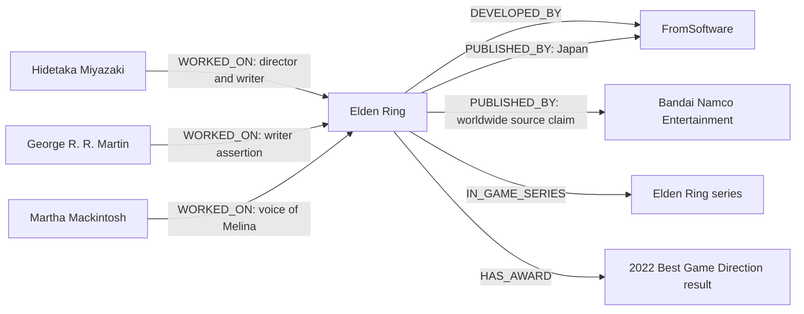
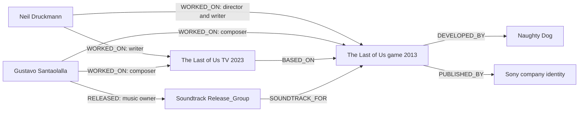
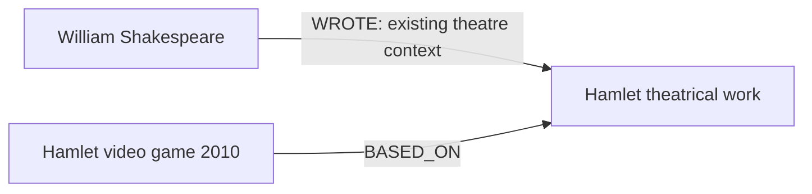

<Info>
**Design simulation, not production graph data.** Researched September 8, 2026. The linked fixture contains **29 nodes and 30 edges**. Names, external IDs and source assertions are real. Internal UUIDs, timestamps, chosen-fact IDs, successful identity/election/readiness states, graph labels, proposed weights and descriptions are simulated. No database or graph was modified.

This is the combined illustration of **three independent game roots plus existing film, music and theatre context**. It is not the output of recursively following one game into every other waterfall. All pictured relationships are excluded from scoring in the proposed pilot. The three game nodes are internal and hidden (`visibility=false`, `game_publication_status=pending`): their shown artwork is not ingested and no successful public game publication is claimed. Their incident edges are also hidden from public readers.
</Info>

[Music → game entry](/guides/open-work/video-game-waterfall#music-waterfall-entry) uses this fixture’s existing Santaolalla → soundtrack → 2013 game path without minting another game.

[The Game Awards adapter and additional source observations](/guides/open-work/video-game-waterfall-game-awards) extend the source plan without adding nodes to this core fixture. Its existing 2022 award keeps the same UUID and now has an outcome-independent nominee-entry key.

[Build plan](/guides/open-work/video-game-waterfall) · [Complete nodes, edges and scoped relation records (JSON)](/assets/video-game-waterfall/graph-simulation.json) · [Frozen source statements and MusicBrainz response (JSON)](/assets/video-game-waterfall/source-evidence.json)

## Game thumbnail example

**Elden Ring — real Steam store header.** The game already has Steam app ID `1245620`; no title search or recursive lookup is needed to locate its exact store page. This is a landscape thumbnail candidate, not a simulated or generated cover.


[Official store page](https://store.steampowered.com/app/1245620/_/) · [Source image](https://shared.akamai.steamstatic.com/store_item_assets/steam/apps/1245620/header.jpg?t=1787868578) · [Thumbnail source and pipeline plan](/guides/open-work/video-game-waterfall#game-thumbnails-and-cover-art)

The following is a **proposed candidate record**, using the observed source URL and real game IDs. No image has been copied to Orbiter's GCS, elected into a production display row or declared licensed by this example. Dimensions and internal media IDs remain absent until the media worker inspects/ingests it. The planned storage key uses the fixture's simulated game UUID and the shared file pipeline's actual source-URL hash algorithm. This supporting record does not change the fixture's 29-node/30-edge count.

```json
{
  "game_wikidata_id": "Q64826862",
  "source": "steam",
  "source_game_id": "1245620",
  "source_page_url": "https://store.steampowered.com/app/1245620/_/",
  "source_image_url": "https://shared.akamai.steamstatic.com/store_item_assets/steam/apps/1245620/header.jpg?t=1787868578",
  "asset_kind": "store_header",
  "orientation": "landscape",
  "storage_prefix": "game-thumbnail/",
  "planned_storage_key": "game-thumbnail/8d718f08-fad1-5f49-9b39-a3ed7678612b/29ac4fcbd692.webp",
  "status": "candidate",
  "observed_on": "2026-09-08",
  "rights_status": "not_evaluated",
  "rehost_status": "not_ingested"
}
```

All candidates use the **same file pipeline as avatars and movie posters**, with the movie-poster aspect-preserving conversion and the `game-thumbnail/` destination. On successful ingestion, persist the returned storage key and serve it through the shared media renderer. For a portrait card, use the enabled IGDB/Moby game cover source. IMDb artwork, including already rehosted copies, is excluded. A game stays hidden until the game flow has prepared its properties, ingested approved artwork and committed publication. Preserve the header's aspect ratio when using this Steam candidate; do not imply that its landscape artwork is a portrait cover.

**Second real game-node image: Hamlet — Q280104 / Steam 222160.**


[Official store page](https://store.steampowered.com/app/222160/) · [Source image](https://shared.fastly.steamstatic.com/store_item_assets/steam/apps/222160/header.jpg?t=1765636960). This artwork belongs to the game's Steam listing; its store-release date does not replace the original-game date in the fixture. It uses the same `game-thumbnail/` pipeline contract. Both images are source candidates, not claimed uploaded GCS objects.

<a id="fixture-breakdown" />

## Entity and edge type breakdown

The fixture contains **29 nodes and 30 edges**. Person sublabels are counted under their canonical Person once. The examples are selected claims, not complete credits or a complete catalog.

| Entity family | Count | Examples |
| --- | ---: | --- |
| `Video_Game` | 3 | Elden Ring, The Last of Us (2013), Hamlet |
| `Person` | 15 | Miyazaki, George R. R. Martin, Shakespeare; includes Santaolalla's Music_Artist subtype |
| `Company` | 4 | FromSoftware, Bandai Namco, Naughty Dog, Sony Interactive Entertainment |
| `Film_TV:TV_Series` | 1 | The Last of Us (2023) |
| `Work:Theatrical_Work` | 1 | Hamlet play |
| `Release_Group` | 1 | The Last of Us soundtrack |
| `Game_Series` | 1 | Elden Ring series |
| `Game_Platform` | 2 | Windows, PlayStation 4 |
| `Game_Award:Winner` | 1 | Scoped 2022 Best Game Direction result |
| **Total** | **29** | 7 game-family nodes + 22 reused endpoints |

| Edge family | Count | Scope |
| --- | ---: | --- |
| `WORKED_ON` | 16 | 14 game credits and 2 existing TV credits |
| `DEVELOPED_BY` | 2 | Named game developers |
| `PUBLISHED_BY` | 3 | Scoped game publishers |
| `BASED_ON` | 2 | TV → game; game → play |
| `SOUNDTRACK_FOR` | 1 | Soundtrack release group → game |
| `RELEASED` | 1 | Existing artist → album relation |
| `IN_GAME_SERIES` | 1 | Game → series |
| `AVAILABLE_ON` | 2 | Game → platform |
| `HAS_AWARD` | 1 | Game → scoped result |
| `WROTE` | 1 | Existing Shakespeare → play relation |
| **Total** | **30** | 10 relationship names |

The locked build also includes evidenced `Game_Engine` and conditional `Game_Release` support types. Their [real source-backed companion examples](/guides/open-work/video-game-waterfall-sources#real-engine-and-release-examples) illustrate the two types without changing this core fixture’s counts. The synchronized Graphs references contain the complete [node families and properties](/guides/ontology/nodes#video-game-nodes), [edge manifest and ownership](/guides/ontology/edges#video-game-edges), and [proposed weights](/guides/ontology/edge-weights#video-game-weights).

## 1. Elden Ring — IMDb and company entry

An IMDb person credit for Hidetaka Miyazaki can supply game `tt10562854`. A Company root for FromSoftware (`Q2414469`), classified as a game developer, can independently discover the same game. Both resolve to `Q64826862`, MobyGames `174989`, IGDB numeric `119133`, Steam `1245620` and the **same internal game UUID**. The paid-provider ID does not replace it.

The source snapshot has **12 person-role statements and 11 people**: one director, two writers and nine voice actors. Miyazaki occupies both director and writer roles. The graph has **11 WORKED_ON edges**, while its scoped credit records preserve all 12 roles. These are selected Wikidata assertions, not a complete list of the game's credits. [Elden Ring source](https://www.wikidata.org/wiki/Q64826862)



FromSoftware has two different relations to the game: development and Japan publishing. Bandai Namco's source statement says worldwide; preserve that literal scope alongside the Japan statement, rather than silently reinterpret it as worldwide-except-Japan. A publishing contract or more precise source could qualify it later. The worldbuilding/writing distinction for Martin also needs a source-specific role mapping: P58 is a broad source predicate, not a substitute for exact production billing.

<AccordionGroup>
<Accordion title="Full game node properties">
```json
{
  "fixture_ref": "Q64826862",
  "labels": [
    "Entity",
    "Video_Game"
  ],
  "properties": {
    "uuid": "8d718f08-fad1-5f49-9b39-a3ed7678612b",
    "name": "Elden Ring",
    "wikidata_qid": "Q64826862",
    "created_at": 1788868800000,
    "updated_at": 1788868800000,
    "source": "wikidata",
    "source_revision": 2519463538,
    "visibility": false,
    "imdb_id": "tt10562854",
    "mobygames_id": "174989",
    "igdb_slug": "elden-ring",
    "igdb_numeric_id": "119133",
    "steam_app_ids": [
      "1245620"
    ],
    "game_kind": "base_game",
    "first_release_date": "2022-02-25",
    "date_precision": "day",
    "description": "Elden Ring is a 2022 action role-playing game developed by FromSoftware.",
    "game_publication_status": "pending"
  }
}
```

</Accordion>
<Accordion title="One edge, two roles — Hidetaka Miyazaki">
```json
{
  "from": "825b8cb1-e1bd-5ead-9ac2-4ae80f7de9f7",
  "type": "WORKED_ON",
  "to": "8d718f08-fad1-5f49-9b39-a3ed7678612b",
  "from_ref": "Q11454590",
  "to_ref": "Q64826862",
  "properties": {
    "uuid": "5c55dca1-9558-573c-89fd-27aa36992f4a",
    "created_at": 1788868800000,
    "updated_at": 1788868800000,
    "source": "wikidata",
    "source_urls": [
      "https://www.wikidata.org/w/index.php?title=Q64826862&oldid=2519463538"
    ],
    "evidence_ids": [
      "Q64826862$9c890f57-4362-70eb-5fbc-ab6bb2ea6c22",
      "Q64826862$f85db7dc-4b95-e63b-71b2-012876b8a455"
    ],
    "chosen_fact_ids": [
      "f0c706c9-26d9-51eb-85f0-e750c1849deb",
      "75336bcc-a047-52a2-b731-139a056c702c"
    ],
    "projection_revision": 1,
    "policy_version": "games-v1-proposed",
    "active": true,
    "weight": 30,
    "layer": "evidence",
    "excluded_from_scoring": true,
    "description": "Hidetaka Miyazaki is credited for director, writer on Elden Ring.",
    "description_generated_at": 1788868800000,
    "roles": [
      "director",
      "writer"
    ],
    "role_labels": [
      "director",
      "screenwriter"
    ],
    "credit_record_ids": [
      "4acdf0d5-13cb-5492-8460-0d112420caf4",
      "3a8fe11d-9d14-5210-80fa-737b8aed31de"
    ],
    "resolution_method": "exact_id_fixture_assumption",
    "credit_coverage": "partial"
  }
}
```

The two `chosen_fact_ids` and `credit_record_ids` preserve two role claims. The UUIDs are simulated; the statement IDs refer to real source claims. Neither role is overwritten by the other.

</Accordion>
<Accordion title="Scoped company edge — FromSoftware publishing in Japan">
```json
{
  "from": "8d718f08-fad1-5f49-9b39-a3ed7678612b",
  "type": "PUBLISHED_BY",
  "to": "0f720938-423c-54f8-aa97-a9ae64cdf168",
  "from_ref": "Q64826862",
  "to_ref": "Q2414469",
  "properties": {
    "uuid": "a0c15c44-8f71-568b-b749-5aa84d74579d",
    "created_at": 1788868800000,
    "updated_at": 1788868800000,
    "source": "wikidata",
    "source_urls": [
      "https://www.wikidata.org/w/index.php?title=Q64826862&oldid=2519463538"
    ],
    "evidence_ids": [
      "Q64826862$bce4bb56-463c-591a-fb10-b7539654cb5b"
    ],
    "chosen_fact_ids": [
      "4c6e0167-76ce-5d40-a7bf-74aba9439ae9"
    ],
    "projection_revision": 1,
    "policy_version": "games-v1-proposed",
    "active": true,
    "weight": 45,
    "layer": "evidence",
    "excluded_from_scoring": true,
    "description": "Elden Ring has a publisher credit for FromSoftware.",
    "description_generated_at": 1788868800000,
    "relation_record_ids": [
      "b193c699-9da3-527f-96c8-f6e04efa8fb7"
    ],
    "territory_qids": [
      "Q17"
    ]
  }
}
```

The matching `relation_record_ids` entry in the JSON keeps the original P291 qualifier. If a source later adds platform-specific rights, store correlated territory/platform records; do not infer combinations from independent summary arrays.

</Accordion>
</AccordionGroup>

The award example is **The Game Awards 2022 — Best Game Direction — Elden Ring**, keyed by ceremony, category, game and result. It emits one `HAS_AWARD`. It emits no personal `WON_AWARD`: the game-level P166 statement does not identify a human recipient. [Award category](https://www.wikidata.org/wiki/Q104117222) · [Ceremony](https://www.wikidata.org/wiki/Q110028874)

The fixtures include Microsoft Windows and PlayStation 4 availability as optional context. They deliberately omit the source's later Switch 2 date: an unreferenced release assertion is not enough to claim confirmed availability. Unknown/announced platforms belong in source evidence until verified.

## 2. The Last of Us — IMDb, adaptation, studio and music

The **2013 game** (`Q1986744`, IMDb `tt2140553`) and **2023 series** (`Q87131973`, IMDb `tt3581920`) are separate nodes. The series has `P144 → Q1986744`; the downloaded game snapshot has no reciprocal P4969. Starting from the game therefore needs bounded **inverse P144** discovery; starting from the series can read its direct P144. [Game](https://www.wikidata.org/wiki/Q1986744) · [Series](https://www.wikidata.org/wiki/Q87131973)



The game stores `P406 → Q55240246`, the soundtrack album. That item carries MusicBrainz release-group ID **`89d11273-7aad-43a0-8ec7-ad5be83286d8`**. MusicBrainz returns Gustavo Santaolalla as its artist with ID **`3abc3eb1-7318-41d2-a52b-cbe14a14d8a0`**; his Wikidata P434 agrees. This is a usable crosswalk to the existing canonical person, not a name-only merge. [Soundtrack item](https://www.wikidata.org/wiki/Q55240246) · [MusicBrainz release group](https://musicbrainz.org/release-group/89d11273-7aad-43a0-8ec7-ad5be83286d8)

**Music distinction:** Gustavo gets `WORKED_ON` with composer role on the game. The album gets `SOUNDTRACK_FOR` to the game. The music owner can retain its independently supported `RELEASED` credit. This fixture emits no `COMPOSED → album`: a release group is not a musical composition. No soundtrack track or artist catalog gets expanded by the game job.

**Date disagreement retained:** Wikidata lists the soundtrack publication as June 11, 2013; MusicBrainz returns its first-release date as June 7, 2013. Both values remain in the evidence file. The simulated album node leaves the date absent pending the music owner's election; it does not silently choose one.

**Historical naming retained:** Wikidata resolves the game publisher to the current Sony Interactive Entertainment company item. Its current display name is not proof that the same name was used on the 2013 release. Preserve source credit wording and effective dates where provided; the fixture does not invent historical legal-entity identity or a corporate acquisition edge.

<Accordion title="Full normalized adaptation edge">
```json
{
  "from": "c6ec9ac6-5a3e-5c57-a001-eefdb414609d",
  "type": "BASED_ON",
  "to": "7ccbbe2d-52c3-5bca-8d8c-5a0193bd669c",
  "from_ref": "Q87131973",
  "to_ref": "Q1986744",
  "properties": {
    "uuid": "c1dd4b74-13db-5842-9f4d-edf4ccda73d1",
    "created_at": 1788868800000,
    "updated_at": 1788868800000,
    "source": "wikidata",
    "source_urls": [
      "https://www.wikidata.org/w/index.php?title=Q87131973&oldid=2537886506"
    ],
    "evidence_ids": [
      "Q87131973$b8552537-44e0-a7ed-46ba-a0b68798723f"
    ],
    "chosen_fact_ids": [
      "928c38ff-2bf6-5b08-9417-a666702ef918"
    ],
    "projection_revision": 1,
    "policy_version": "games-v1-proposed",
    "active": true,
    "weight": 55,
    "layer": "evidence",
    "excluded_from_scoring": true,
    "description": "The 2023 television series adapts the 2013 video game into an episodic screen story; the link records the identified source work without inferring a specific game edition or artistic fidelity.",
    "description_generated_at": 1788868800000,
    "derivation_type": "adaptation",
    "source_property": "wikidata:P144",
    "observed_subject_qid": "Q87131973",
    "observed_object_qid": "Q1986744",
    "derivative_qid": "Q87131973",
    "original_work_qid": "Q1986744"
  }
}
```

</Accordion>

## 3. Hamlet — a real theatre-to-game bridge

The 2010 game **Hamlet** (`Q280104`, Steam `222160`, MobyGames `46506`) has an explicit **P144 → Q41567**, Shakespeare's play. The play's downloaded P4969 list does not contain this game. A theatre work root can find it through bounded inverse P144, then emit **game → BASED_ON → theatrical work**. [Game record](https://www.wikidata.org/wiki/Q280104) · [Play record](https://www.wikidata.org/wiki/Q41567)



The theatrical work is the endpoint. No particular Broadway/West End production, cast or venue is asserted. If discovery starts from a production, the theatre intake may explicitly expose its already resolved underlying work as the anchor; it cannot copy that production's credits onto the game. Shakespeare's authorship belongs to the theatre owner and does not trigger a person waterfall.

<AccordionGroup>
<Accordion title="The game node has real source IDs, including no invented IMDb ID">
```json
{
  "fixture_ref": "Q280104",
  "labels": [
    "Entity",
    "Video_Game"
  ],
  "properties": {
    "uuid": "34783c65-faed-5de7-a990-00bd0d659e76",
    "name": "Hamlet",
    "wikidata_qid": "Q280104",
    "created_at": 1788868800000,
    "updated_at": 1788868800000,
    "source": "wikidata",
    "source_revision": 2534779187,
    "visibility": false,
    "mobygames_id": "46506",
    "igdb_slug": "hamlet-or-the-last-game-without-mmorpg-features-shaders-and-product-placement",
    "igdb_numeric_id": "28221",
    "steam_app_ids": [
      "222160"
    ],
    "game_kind": "base_game",
    "first_release_date": "2010-04-08",
    "date_precision": "day",
    "description": "Hamlet is a 2010 video game based on the Shakespeare play.",
    "game_publication_status": "pending"
  }
}
```

</Accordion>
<Accordion title="Theatre adaptation edge and actual statement GUID">
```json
{
  "from": "34783c65-faed-5de7-a990-00bd0d659e76",
  "type": "BASED_ON",
  "to": "c8b6ad82-787e-55c8-9845-45c5a8f45d0d",
  "from_ref": "Q280104",
  "to_ref": "Q41567",
  "properties": {
    "uuid": "f16f99da-9d41-5365-b4b9-5d9a6f2b28e0",
    "created_at": 1788868800000,
    "updated_at": 1788868800000,
    "source": "wikidata",
    "source_urls": [
      "https://www.wikidata.org/w/index.php?title=Q280104&oldid=2534779187"
    ],
    "evidence_ids": [
      "q280104$890203EB-554C-4E89-8DFB-364B10EF78EB"
    ],
    "chosen_fact_ids": [
      "684ee82b-1201-5939-ab51-a36ce4dd8145"
    ],
    "projection_revision": 1,
    "policy_version": "games-v1-proposed",
    "active": true,
    "weight": 55,
    "layer": "evidence",
    "excluded_from_scoring": true,
    "description": "Released in 2010, this game is based on Shakespeare’s Hamlet; the Wikidata statement identifies the play as its source, without specifying a particular stage production or degree of fidelity.",
    "description_generated_at": 1788868800000,
    "derivation_type": "adaptation",
    "source_property": "wikidata:P144",
    "observed_subject_qid": "Q280104",
    "observed_object_qid": "Q41567",
    "derivative_qid": "Q280104",
    "original_work_qid": "Q41567"
  }
}
```

</Accordion>
</AccordionGroup>

## 4. Elsinore — real connection, missing Wikidata statement

Elsinore (`Q67132199`, Steam `512890`, MobyGames `130401`) is described by its developer as a game set in Hamlet's world. The downloaded Wikidata game record has **no P144**, and Hamlet's downloaded P4969 does not list it. This fixture therefore records **`pending_source_relation` and zero active BASED_ON edges** under the Wikidata-only adaptation policy. [Golden Glitch's game page](https://goldenglitch.itch.io/elsinore) · [Publisher-maintained Steam page](https://store.steampowered.com/app/512890/Elsinore/)

This is a useful coverage gap, not permission to fabricate a Wikidata statement. An independently approved official-source adaptation adapter could support it later through facts/election/replay, preserving its different provenance. The fixture includes the real candidate IDs and empty/missing statement evidence in its `negative_cases` section; Elsinore is not counted among the 29 materialized sample nodes.

## Complete simulated node inventory

Every node also carries its simulated UUID and timestamps. QIDs and source revision IDs remain real. Company, Person, film, music and theatre endpoints are reused canonical identities; no game-specific Person or Company labels are introduced.

| Node | Labels after Entity | Fixture reference | Selected real properties |
| --- | --- | --- | --- |
| Elden Ring | `Video_Game` | `Q64826862` | imdb_id=tt10562854; mobygames_id=174989; steam_app_ids=['1245620']; first_release_date=2022-02-25 |
| The Last of Us | `Video_Game` | `Q1986744` | imdb_id=tt2140553; mobygames_id=60922; first_release_date=2013-06-14 |
| Hamlet | `Video_Game` | `Q280104` | mobygames_id=46506; steam_app_ids=['222160']; first_release_date=2010-04-08 |
| Hamlet | `Work:Theatrical_Work` | `Q41567` | Canonical identity + source revision |
| The Last of Us | `Film_TV:TV_Series` | `Q87131973` | imdb_id=tt3581920 |
| The Last of Us | `Release_Group` | `Q55240246` | musicbrainz_release_group_id=89d11273-7aad-43a0-8ec7-ad5be83286d8 |
| Elden Ring | `Game_Series` | `Q124706366` | Canonical identity + source revision |
| Microsoft Windows | `Game_Platform` | `Q1406` | platform_code=pc_windows |
| PlayStation 4 | `Game_Platform` | `Q5014725` | platform_code=ps4 |
| FromSoftware | `Company` | `Q2414469` | imdb_id=co0110963 |
| Bandai Namco Entertainment | `Company` | `Q1194689` | Canonical identity + source revision |
| Naughty Dog | `Company` | `Q720871` | imdb_id=co0135004 |
| Sony Interactive Entertainment | `Company` | `Q18594` | Canonical identity + source revision |
| Hidetaka Miyazaki | `Person` | `Q11454590` | imdb_id=nm2329298 |
| George R. R. Martin | `Person` | `Q181677` | imdb_id=nm0552333 |
| Martha Mackintosh | `Person` | `Q23751449` | imdb_id=nm0533594 |
| Anthony Howell | `Person` | `Q2656149` | imdb_id=nm0397928 |
| Con O'Neill | `Person` | `Q5157993` | imdb_id=nm0642126 |
| Ramon Tikaram | `Person` | `Q3929913` | imdb_id=nm0863130 |
| Pippa Bennett-Warner | `Person` | `Q7197468` | imdb_id=nm1534733 |
| Pip Torrens | `Person` | `Q1387430` | imdb_id=nm0868476 |
| Simon Gregor | `Person` | `Q97098951` | imdb_id=nm0339671 |
| Aimee-Ffion Edwards | `Person` | `Q272592` | imdb_id=nm2929682 |
| Mali Harries | `Person` | `Q6743287` | imdb_id=nm1036545 |
| Bruce Straley | `Person` | `Q13656882` | imdb_id=nm3656507 |
| Neil Druckmann | `Person` | `Q13655731` | imdb_id=nm3773654 |
| Gustavo Santaolalla | `Person:Music_Artist` | `Q312434` | imdb_id=nm0763395; musicbrainz_artist_id=3abc3eb1-7318-41d2-a52b-cbe14a14d8a0 |
| The Game Awards 2022 — Best Game Direction — Elden Ring | `Game_Award:Winner` | `award:Q110028874:Q104117222:Q64826862:winner` | award_year=2022; result=winner |
| William Shakespeare | `Person` | `Q692` | imdb_id=nm0000636 |

## Complete simulated edge inventory

Every row below expands to the full envelope in the JSON download: UUID, creation/update times, source URL, statement evidence, chosen-fact IDs, projection/policy revision, active state, weight, scoring exclusion and description. Qualifier records carry character QIDs when a character name is not present; missing names are not invented. New game edge names/weights remain proposals.

| Directed relationship | Weight | Role / scope properties |
| --- | ---: | --- |
| Hidetaka Miyazaki → **WORKED_ON** → Elden Ring | 30 | `{"roles": ["director", "writer"]}` |
| George R. R. Martin → **WORKED_ON** → Elden Ring | 30 | `{"roles": ["writer"]}` |
| Martha Mackintosh → **WORKED_ON** → Elden Ring | 30 | `{"roles": ["voice_actor"], "character_names": ["Melina"]}` |
| Anthony Howell → **WORKED_ON** → Elden Ring | 30 | `{"roles": ["voice_actor"], "character_names": ["Margit"]}` |
| Con O'Neill → **WORKED_ON** → Elden Ring | 30 | `{"roles": ["voice_actor"], "character_names": ["Mohg"]}` |
| Ramon Tikaram → **WORKED_ON** → Elden Ring | 30 | `{"roles": ["voice_actor"]}` |
| Pippa Bennett-Warner → **WORKED_ON** → Elden Ring | 30 | `{"roles": ["voice_actor"]}` |
| Pip Torrens → **WORKED_ON** → Elden Ring | 30 | `{"roles": ["voice_actor"]}` |
| Simon Gregor → **WORKED_ON** → Elden Ring | 30 | `{"roles": ["voice_actor"], "character_names": ["Rykard"]}` |
| Aimee-Ffion Edwards → **WORKED_ON** → Elden Ring | 30 | `{"roles": ["voice_actor"]}` |
| Mali Harries → **WORKED_ON** → Elden Ring | 30 | `{"roles": ["voice_actor"]}` |
| Elden Ring → **DEVELOPED_BY** → FromSoftware | 35 | `{}` |
| Elden Ring → **PUBLISHED_BY** → Bandai Namco Entertainment | 45 | `{"territory_qids": ["Q13780930"]}` |
| Elden Ring → **PUBLISHED_BY** → FromSoftware | 45 | `{"territory_qids": ["Q17"]}` |
| Bruce Straley → **WORKED_ON** → The Last of Us (2013 game) | 30 | `{"roles": ["director"]}` |
| Neil Druckmann → **WORKED_ON** → The Last of Us (2013 game) | 30 | `{"roles": ["director", "writer"]}` |
| Gustavo Santaolalla → **WORKED_ON** → The Last of Us (2013 game) | 30 | `{"roles": ["composer"]}` |
| The Last of Us (2013 game) → **DEVELOPED_BY** → Naughty Dog | 35 | `{}` |
| The Last of Us (2013 game) → **PUBLISHED_BY** → Sony Interactive Entertainment | 45 | `{"territory_qids": ["Q13780930"]}` |
| The Last of Us (2023 TV series) → **BASED_ON** → The Last of Us (2013 game) | 55 | `{"source_property": "wikidata:P144"}` |
| Hamlet (2010 game) → **BASED_ON** → Hamlet (play) | 55 | `{"source_property": "wikidata:P144"}` |
| Neil Druckmann → **WORKED_ON** → The Last of Us (2023 TV series) | 30 | `{"roles": ["writer"], "writer_owner": "film_tv"}` |
| Gustavo Santaolalla → **WORKED_ON** → The Last of Us (2023 TV series) | 30 | `{"roles": ["composer"], "writer_owner": "film_tv"}` |
| The Last of Us (soundtrack album) → **SOUNDTRACK_FOR** → The Last of Us (2013 game) | 55 | `{"source_property": "wikidata:P406"}` |
| Gustavo Santaolalla → **RELEASED** → The Last of Us (soundtrack album) | 10 | `{"writer_owner": "music"}` |
| Elden Ring → **IN_GAME_SERIES** → Elden Ring (game series) | 75 | `{"series_ordinal": "1"}` |
| Elden Ring → **AVAILABLE_ON** → Microsoft Windows | 80 | `{}` |
| Elden Ring → **AVAILABLE_ON** → PlayStation 4 | 80 | `{}` |
| Elden Ring → **HAS_AWARD** → The Game Awards 2022 — Best Game Direction — Elden Ring | 40 | `{"award_result": "winner"}` |
| William Shakespeare → **WROTE** → Hamlet (play) | 10 | `{"writer_owner": "theatre"}` |

## What these examples prove, and what remains to test

The artifact was checked for unique node and edge UUIDs, unique directed semantic edges, valid endpoints, source-statement references, the 12-role/11-person Elden Ring distinction and 25–45 word adaptation descriptions. It contains no `KNOWS`, fabricated personal award recipient or unsupported Elsinore adaptation.

These are **fixture-integrity checks**, not passing backend tests. The Go implementation still needs the queue, concurrent admission, lease fencing, stale-generation retraction and cross-waterfall recursion checks in the [build plan](/guides/open-work/video-game-waterfall#required-adversarial-checks). The diagram's finite size does not itself prove that a worker cannot recurse.

On replay of these same elected fixtures, the expected semantic output is still **29 nodes and 30 edges**, with stable UUIDs and creation timestamps. A future implementation must establish that result against its actual database and graph. A broader source pass may legitimately add more evidenced credits; this selected set makes no completeness claim.

Source evidence is retained with revisions and qualifiers. Wikidata structured statements are CC0; the selected MusicBrainz core record follows its [data-license distinction](https://musicbrainz.org/doc/About/Data_License). Images, scraped prose and supplementary licensed data are not included in the fixture bundle.
