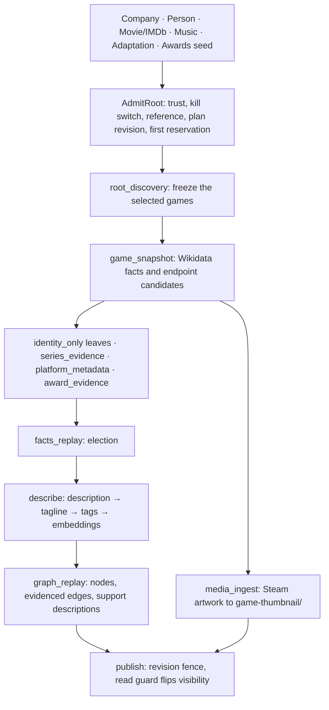

<Info>
  **As built, synchronized 2026-09-13** with the `orbiter-universe` checkout on branch `ORBIT-1879/video-game-waterfall`. Everything on this page is what the Go code does today, with file references into `internal/features/games` unless stated otherwise. The feature ships **disabled by default**: every `GAME_*_ENABLED` flag is false and both producer lists are empty until an environment turns them on. The design rationale, locked contracts and acceptance criteria this was built from are archived at [Video Game Build Plan](/guides/archive/video-game-build-plan).
</Info>

## Overview

A game enters through one of six bounded adapters, is admitted exactly once by `Service.AdmitRoot`, and then runs as a finite plan of typed jobs on an AlloyDB-backed queue woken by Pub/Sub. Jobs fetch permitted sources, elect facts, resolve identities, write the six game node kinds and their edges to the Universe graph, prepare description, tagline, tags, embedding and artwork, and finally publish a revision. Nothing a game discovers can start another root: descendants carry lineage that every adapter refuses.

## Entry points

Every entry converges on `AdmitRoot` (`gate.go:64-163`). Producers never call a provider or create an entity inline: they persist a handoff and return. Each lane is bound at the composition root only when its name appears in `GAME_INTAKE_PRODUCERS` (`internal/app/games_intake.go:143-161`); an unbound lane makes the upstream step log `SKIP` and continue (`person/steps_game_intake.go:176-179`, `filmtv/steps_game_intake.go:50-52`, `music/steps_game_intake.go:52-54`), so the existing company, person, film and music waterfalls are unchanged when the feature is off.

| Lane (`GAME_INTAKE_PRODUCERS`) | Producer step | Adapter | What is admitted |
| --- | --- | --- | --- |
| `company` | The company specialties rebuild emits a completed-classification receipt (`internal/features/graph/specialty_receipt.go:66-76`) | `DetectGameSpecialty` and `AdmitCompanySpecialty` (`adapter_company.go:97-177`) | One `root_discovery` probe keyed `probe:company_title_probe/<company-id>` when the resolved classification is a video game domain or subdomain; ambiguous or incomplete classifications are refused with a reason |
| `movie` | Person credit intake splits game-classified credits before movie tiering (`person/steps_game_intake.go:95-157`); the film pipeline hands off a late title classification (`filmtv/steps_game_intake.go:49-71`) | `AdmitMovieCredit` and `AdmitTitle` (`adapter_movie.go:142-199`) | The exact `tt…` title as a game reference; every distinct role and character combination becomes a `WORKED_ON` mention (`adapter_movie.go:201-238`) |
| `person` | After work rows are stored, before closeout (`person/steps_game_intake.go:174-232`) | `AdmitPersonProbe` (`adapter_person.go:83-117`) with the ten role families in `person_roles.go:28-68` | One `root_discovery` probe under scope `person_credit_probe`, reading at most 50 original work rows |
| `music` | Release-group step checks MusicBrainz secondary type `Soundtrack` (`music/steps_game_intake.go:51-84`) | `AdmitMusicEvidence` (`adapter_music.go:88-135`) | An exact game reference straight through, or a bounded `music_game_probe`; the anchor type decides the bridge edge: Release_Group and Music_Work map to `SOUNDTRACK_FOR`, Recording to `USED_IN` (`adapter_music.go:76-84`) |
| `adaptation` | Stage and film adaptation steps (`enrichment/stage_adaptation.go:335,503`, `stage_adaptation_films.go:197`) | `AdmitAdaptation` (`adapter_adaptation.go`) | A film or theatrical subject with an explicit P144 or P4969 statement naming a game |
| `award_review` | A trusted admin event | `AdmitAwardSeed` (`adapter_awards.go:46`) | A reviewed ceremony year and category batch under scope `award_seed` |

<a id="company-specialization-entry" />
<a id="movie-person-credit-entry" />
<a id="movie-to-game-handoff" />
<a id="person-role-entry" />
<a id="music-waterfall-entry" />

Two rules hold for every lane. A game reached from inside another game's plan carries blocked lineage and every adapter refuses it (`adapter_movie.go:51-53`). And a game that already exists as `Film_TV:Video_Game` is reused through its verified IMDb alias rather than duplicated (`adapter_movie.go:156-158`; the graph writer MERGEs on `(g:Entity {entity_id})` and adds the `Video_Game` label, `internal/platform/graph/game.go:128-131`).

## Admission and plans

`AdmitRoot` validates producer trust (`gate.go:68`), the admission kill switch (`gate.go:71`) and the reference namespace, then in one transaction records the demand receipt, opens or finds the plan, freezes a plan revision with its hash (`gate.go:223-237`) and reserves the first job. Admission returns one of `queued`, `existing`, `pending_identity`, `duplicate_event`, `budget_deferred`, `blocked` or `unsupported_type` (`types.go`).

References resolve through `canonicalReference` (`gate.go:167-195`): follow `merged_into` to the survivor, resolve strong aliases with `FindByStrong`, and treat a bare Steam app id as a soft alias that nominates a candidate but never resolves on its own. Tiers clamp to 0–4 and preserve an explicit zero (`gate.go:197-208`).

## Queue, jobs and budgets

**Topics.** `games.job_wake`, `games.queue_drain_requested`, `games.recovery_requested` and `games.outbox_tick` (`gate.go:48`, `worker.go:18-22`), registered in `module.go:40-51`. The database is authoritative for eligible work; Pub/Sub only wakes a row. Game work never runs from the shared `enrichment_queue`: `RunEntityQueueRow` refuses every row for the six game types (`dispatch.go:103-111`).

**Job kinds** (`types.go:26-55`, in dependency-rank order) and the runner registered for each (`service.go:148-203`):

| Kind | Runner | Does |
| --- | --- | --- |
| `root_discovery` | `Discovery` | One bounded enumeration for the root's origin; freezes the selected games |
| `game_snapshot` | `Snapshot` | Fetches one selected game's Wikidata statements; emits facts and endpoint candidates |
| `series_evidence` | `SeriesEvidence` | One admitted series record: membership, developers, logo candidates (`stage_series.go`) |
| `identity_only` | `IdentityLeaf` | Resolves or creates a named endpoint through the non-enriching identity seam; no cascade |
| `media_ingest` | `Media` | Ranks Steam artwork candidates and stores the selected asset under `game-thumbnail/` (`stage_media.go:86-113`) |
| `award_evidence` | `AwardEvidence` | Reads The Game Awards pages for an admitted game or person (`stage_awards.go`) |
| `facts_replay` | `FactsReplay` | Elects facts from retained mentions |
| `describe` | `Describe` | Description, tagline, tags and embedding in that order (`stage_describe.go`) |
| `platform_metadata` | `PlatformMetadata` | Exact-platform metadata for `AVAILABLE_ON` endpoints (`stage_platform.go`) |
| `graph_replay` | `Graph` | Writes nodes and evidenced edges; also generates the support-node descriptions inline (`stage_relations.go:646`, per-type writers at `:771-858` and `:1742`) |
| `publish` | `Publication` | Promotes the staged revision (`publish.go:66-183`) |

The five `*_description` kinds (`series_description`, `platform_description`, `engine_description`, `release_description`, `award_description`) are declared in `types.go` and routed by the kill switch in `worker.go:55`, but no runner is registered for them and nothing schedules them; their work runs inside `graph_replay` through `describeSupports` (`stage_relations.go:646`). A kind with no runner fails closed: `runnerFor` returns `ErrUnsupportedType` (`dispatch.go:84-92`) and `runClaimed` parks the job as `internal_terminal` (`worker.go:144-152`).

**Claim, lease, retry, recovery.** Claims use `SKIP LOCKED` with a fence and a random lease token (`worker.go:107,127`); the lease length is `GAME_LEASE_SECONDS` (default 300). `runClaimed` classifies failures with `failure.Classify` and routes to retry-wait, blocked, dead-letter or parked (`worker.go:158-184`) with exponential backoff capped at 30 minutes (`worker.go:249-255`). A missing prerequisite defers five minutes without spending an attempt (`worker.go:171-174`); a switched-off kind defers fifteen (`worker.go:166`). `RecoverOnce` (`worker.go:279-316`), driven by Cloud Scheduler through `games.recovery_requested`, reaps expired leases, expires roots past their active lifetime and parks unfinished work with reason `root_expired`; it never deletes.

**Budgets.** `DefaultLimits()` (`types.go:245-253`):

| Limit | Value |
| --- | ---: |
| Selected games per root | 20 |
| Discovery pages / candidates per page | 3 / 50 |
| New leaf identities per root / per game | 60 / 20 |
| Non-replay jobs per root | 100 |
| Network attempts per root | 200 |
| LLM attempts per root | 100 |
| Retained relation mentions per root | 2,000 |
| Downloaded source bytes per root | 10 MiB |
| Graph replay batch | 50 relations |
| Job attempts / active root lifetime | 5 / 24 h |

`allocateTx` (`budget.go:106-254`) locks the plan row, orders candidates deterministically (required, then core, rank, order, reference key) and `refuse()` names the first overrun dimension (`budget.go:257-277`). `SpendAttempt` (`budget.go:337-362`) charges network, LLM and byte usage before a provider call and refuses on a closed root even mid-lease. Stage rank is forward-only: a job cannot reserve a same- or lower-rank capability (`budget.go:144-147`, `capabilities.go:54-68`).

<a id="shared-universe-error-logging-required" />

### Error logging

Games reuse the Universe facilities rather than a parallel system: stage receipts through `s.RecordStage` and the `stages` package (`worker.go:193`), failure classification through `failure.Classify`, `failure.Panic` and `failure.Budget` (`worker.go:159,243`, `budget.go:229,354`), and the injected structured logger. `runGuarded` converts a panic in any job kind into a parked job instead of a dead drain loop (`worker.go:240-247`).

## Sources

The games feature imports two provider clients, plus a direct Steam store fetch:

- **Wikidata** (`source_wikidata.go:20-57`): identity crosswalks (P345 IMDb, P1733 Steam, P1933 and P11688 MobyGames, P5794 and P9043 IGDB, P436 MusicBrainz release group), credits (P57, P58, P86, P725, P453), developer and publisher (P178, P123), platform (P400), release (P577, P291), series (P179, P1545), adaptation (P144, P4969), soundtrack (P406), awards (P166 with P585 and P805 qualifiers), engine (P408), genre (P136).
- **Steam** (`tags.go:55-99`, `stage_media.go:86-108`): the exact app store page for the `InitAppTagModal` tag block (mismatched app id or non-JSON block is rejected), and `library_600x900.jpg` with `header.jpg` as the letterboxed fallback for artwork.
- **The Game Awards** (`internal/clients/thegameawards`, used from `stage_awards.go:72-75`): category and archive pages, with `ErrLoadingShell`, `ErrNoYear` and `ErrTooLarge` reported as distinct outcomes rather than empty results.

IMDb is not fetched by the games feature; it consumes credit and title evidence already stored by the person and film pipelines. **IGDB and MobyGames have no client code.** They exist only as identifier kinds for aliasing, and the source registry (`sources.go:36-100`) carries `not_entitled` and `disabled` states, but there is no ladder entry to switch on.

<a id="the-game-awards-adapter" />

### The Game Awards

`AdmitAwardSeed` (`adapter_awards.go:46`) admits a reviewed year and category batch; `award_evidence` jobs read the pages, corroborate against Wikidata P166 statements, and shape one `Game_Award` entry per nominee (award body, ceremony year, category, subject). Nomination to win updates the same entry: the graph writer toggles the `Winner` and `Nominee` labels with `REMOVE` and `SET` so they stay mutually exclusive (`internal/platform/graph/game_award.go:90-97`). The award card reuses the associated game's processed artwork through `game_entity_id`; the schema has no award image column.

## Identity and merges

Entity types `video_game`, `game_series`, `game_platform`, `game_engine`, `game_release` and `game_award` are registered in `entitiespub` (`entitiespub.go:119-136`). `Identity.Resolve` (`identity.go:123-260`) partitions strong from soft aliases, ranks strong ones, and rejects a wrong-kind IMDb id such as an `nm` or `co` on a game (`identity.go:323`).

On an entity merge, `FollowUpGameMerge` (`corrections.go:270-303`) canonicalizes relation keys under the survivor, re-elects owners and withdraws an inherited stale publication. Every `universe.game_*` foreign key is registered in the merge inventory with a repoint or dedupe-and-repoint decision (`entities/merge_inventory.go:99-132`).

## Graph output

**Nodes.** One writer per family in `internal/platform/graph`: `game.go` (Video_Game), `game_series.go`, `game_platform.go`, `game_engine.go`, `game_release.go` and `game_award.go` over the shared `game_support.go` builder. All MERGE on `entity_id`, write hidden, and carry `game_publication_status`, `game_publication_revision` and `visibility`. Properties are on [Node Types](/guides/ontology/nodes#video-game-nodes).

<a id="relationship-output-manifest" />

**Edges.** `game_edges.go:23-45` allow-lists fourteen families with their endpoint label pairs: `WORKED_ON`, `DEVELOPED_BY`, `PUBLISHED_BY`, `IN_GAME_SERIES`, `AVAILABLE_ON`, `USES_ENGINE`, `RELEASE_OF`, `SOUNDTRACK_FOR`, `USED_IN`, `EDITION_OF`, `EXPANSION_OF`, `HAS_AWARD`, `WON_AWARD` and `NOMINATED_FOR`. `BASED_ON` is deliberately absent from that list because `MergeBasedOn` in `stage.go` is its single writer for film, stage and game endpoints. `buildGameEdge` (`game_edges.go:86-156`) refuses an unknown type, a disallowed label pair, a non-positive weight and, structurally, any edge without `evidence_ids`, `chosen_fact_ids` and `source_urls`; every game edge is written with `layer = 'evidence'` and `excluded_from_scoring = true` (`game_edges.go:106-108`). Both endpoints are MATCHed by `entity_id`, and a missing endpoint returns `ErrEndpointMissing` so the relation stays pending rather than creating a stub (`game_edges.go:70-84`). Weights and per-family properties are on [Edge Types](/guides/ontology/edges#game-edge-contract-v1).

## Text, tags, embedding and artwork

`stage_describe.go` prepares the four display properties in a fixed order because each derives from the previous one: `description` (at most two model attempts, validated against elected facts), `tagline` (with the pinned failover `moonshotai/kimi-k3` on empty content), `tags` (top ten Steam tags by vote on the node, all twenty in evidence), then `embeddings` with `google/gemini-embedding-2` (`text.go:29`). `textInputRevision` (`stage_describe.go:204`, applied at `:124`) binds the text to the election, prompt and model versions so a stale input cannot publish.

Model configuration lives in `internal/platform/llm/game_text.go`: the game lane has its own low-effort line on `z-ai/glm-5.3-flash` with `reasoning.effort = low` and `provider.sort = throughput` (`game_text.go:30-53`), separate from the shared edge-description configuration. `GameDescription()`, `GameTagline()`, `GameEdgeDescription()` and `GameSupportDescription()` all read it. Support-node descriptions for series, platform, engine, release and award run inside `graph_replay` (`stage_relations.go:771-858` and `:1742`) with the same 127-code-point limit.

<a id="game-thumbnails-and-cover-art" />

Artwork uses the shared image and upload packages: `SteamArtwork.Candidates` (`stage_media.go:95-108`) ranks the 2:3 library portrait first and the landscape header second, and the object key prefix is `game-thumbnail` (`stage_media.go:34`). A media failure after a game is public cascades into a withdrawal (`publish.go:214`).

<a id="game-publication-gate" />

## Publication and the read guard

A game is written hidden and stays hidden until `Publication.Run` (`publish.go:66-183`) confirms the description, tagline, embedding and election receipts (`stage_graph.go:132`) and flips exactly the staged revision: `PublishVideoGame` and `PublishGameSupport` set `game_published`, `game_publication_status = 'published'` and `visibility = true` only where `game_publication_revision` matches (`internal/platform/graph/game.go:138-148`, `game_support.go:84-96`). `Withdraw` (`publish.go:195-211`) hides in SQL first, then in the graph, with a `withdrawn_reason`.

Reads enforce the same gate. `Guard.GameVisibility` (`guard.go:21-30`) answers the publish feature's `GameVisibilityReader`, and an unknown entity is treated as not public. In the graph, every consumer read splices the `game_guard.go` predicates so a node carrying any of the six game labels, or an award node behind a hidden game, is filtered out of neighbourhoods, paths and search until published (`internal/platform/graph/game_guard.go:11-28`).

## API surface

The games module registers no HTTP routes of its own (`module.go:37`); it registers only the four Pub/Sub events. Games reach consumers through the existing publish feature: `internal/features/publish/game_projection.go` builds the game projection (`BuildGameCandidate`, `buildVideoGameProjection`) and the publish module wires the game visibility and projection readers (`publish/module.go:45-48,82`), so games appear on the same entity, subgraph, paths and search endpoints as every other type.

## Configuration

Parsed in `internal/platform/config/config.go:546-576` and listed in `.env.example`:

| Variable | Default | Effect |
| --- | --- | --- |
| `GAME_ADMISSION_ENABLED` | false | Allows `AdmitRoot` to accept new roots |
| `GAME_FETCH_ENABLED` | false | Allows provider and network work |
| `GAME_TEXT_ENABLED` | false | Allows model calls |
| `GAME_REPLAY_ENABLED` | false | Allows facts and graph replay and corrections |
| `GAME_PUBLISH_ENABLED` | false | Allows promotion and the outbox |
| `GAME_LEAVES_ENABLED` | false | Allows leaf predeclaration |
| `GAME_TRUSTED_PRODUCERS` | empty | Producers whose admissions are accepted |
| `GAME_INTAKE_PRODUCERS` | empty | Lanes to bind: `movie`, `person`, `company`, `music`, `adaptation`, `award_review` |
| `GAME_LEASE_SECONDS` | 300 | Job lease length |
| `GAME_CLAIM_MAX_ROWS` | 10 | Rows claimed per drain |

Each switch is checked independently at admission, claim, reservation and commit (`worker.go:45-68`, `budget.go:337-339`), so spend can be stopped while correction and retraction replay keep running.

## Storage

Six additive goose migrations own the `universe.game_*` tables:

| Migration | Tables |
| --- | --- |
| `20260909225643_games_phase1_scope_accounting` | `game_demand`, `game_plan`, `game_plan_revision`, `game_plan_game`, `game_job`, `game_reservation`, `game_outbox`, `game_source_generation`, `game_relation`, `game_profile` |
| `20260910031533_games_phase2_source_snapshots` | `game_source_record`, `game_relation_mention`, `game_negative_cache` |
| `20260910044940_games_phase3_text_media` | text, tags, embedding and media columns on `game_profile` |
| `20260910103103_games_phase4_support_relations` | `game_series`, `game_platform`, `game_engine`, `game_release` |
| `20260910143524_games_phase5_recognition_versions` | `game_award_entry`, `game_award_recipient` |
| `20260910211630_games_phase7_recovery` | `game_recovery_tick` |

## Verification harness and status

`scripts/game-eval` runs the phase-gated evaluation catalog (`testdata/video-game/build-evals.json`) in offline, integration or live mode and writes one receipt per case plus a roll-up per phase under `artifacts/video-game/`. Phases 0 through 7 report passed in integration mode. Phase 8 (live capability qualification, canary, activation and the coverage cohort) reports blocked: the canary environment, activation and the cohort run await authorization, and the sign-off packet is under `artifacts/video-game/handoff/`. No `cmd/` binary is game-specific; the feature compiles into `cmd/api` and `cmd/worker` (`internal/app/api.go:229`, `internal/app/worker.go:272`).

## Related pages

- [Video Game Build Plan](/guides/archive/video-game-build-plan): the archived design, locked contracts, adversarial checks and rollout plan.
- [Build guide](/guides/open-work/video-game-waterfall-build-guide), [worked examples](/guides/open-work/video-game-waterfall-examples) and [sources](/guides/open-work/video-game-waterfall-sources).
- [Node Types](/guides/ontology/nodes#video-game-nodes) and [Edge Types](/guides/ontology/edges#game-edge-contract-v1) for the graph contracts.
