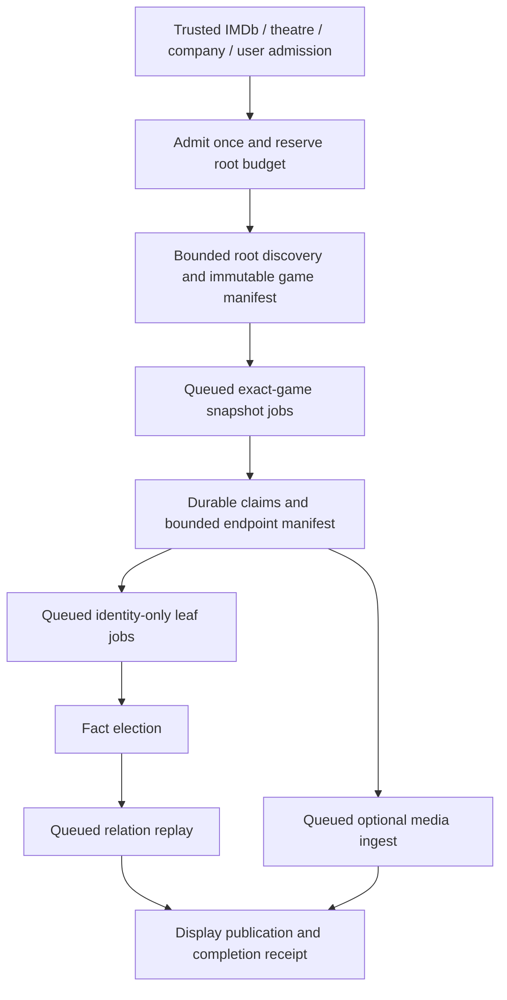

<Info>
**Build plan — revised September 8, 2026.** Implementation target: **Go in Orbiter Universe on GCP**, with AlloyDB, Pub/Sub, Cloud Run, GCS and the Universe FalkorDB graph. This page specifies proposed work; it does not claim game migrations, workers or graph writers are built. **No Xano implementation or dependency.**

The user constraint is stronger than a depth cap: **no recursive waterfall execution**. A root owns a finite staged plan. Every fan-out is queued, every job has a fixed capability, and discovered people, companies, games and works cannot restart discovery.
</Info>

<Card title="Real-data graph simulation" icon="diagram-project" href="/guides/open-work/video-game-waterfall-examples">
Elden Ring; The Last of Us game, TV series and soundtrack; Hamlet's theatre-to-game bridge; and an honest missing-data case. Inspect node and edge properties plus downloadable, reproducible evidence.
</Card>

## Outcome and scope

Make a game a useful professional relationship hub: who worked on it, which studio developed it, who published it in which market, what source work it adapts, and how its music and recognition connect to the existing graph. A credit is evidence of participation; it is not proof that every credited person knows every other person.

The first release delivers game identity, person credits, developer/publisher relationships, IMDb handoff, Wikidata adaptation intake, company intake, pending-edge replay, corrections and public display projections. The soundtrack, award and series slices follow through the same queues. Platform/engine and edition context are optional additions with explicit budgets. Broad catalog crawling, automatic franchise expansion and inferred interpersonal edges are outside this plan.

**Graph references are synchronized:** [Node Types — six game families, reused endpoints and real image examples](/guides/ontology/nodes#video-game-nodes) · [Edge Types — endpoint/weight/property manifest](/guides/ontology/edges#video-game-edges) · [simulation breakdown by type](/guides/open-work/video-game-waterfall-examples#fixture-breakdown). The fixture has 7 game-family nodes plus 22 reused endpoints, totaling 29 nodes and 30 edges. These pages specify the proposed Go build, not deployed writers.

## What changes from the original scope

| Original assumption | Revised build decision |
| --- | --- |
| Mirror legacy tables, integer sentinel FKs and task IDs | Reuse Universe UUID entities, identifier aliases, attempts/stages, facts, projections and source-owned SQL. Nullable FK means unknown; no `0` sentinel. |
| Games are just `WORKED_ON` pointing at another label | Preserve that credit family, and add explicit studio, publishing, adaptation, music and recognition relationships. Each endpoint extension needs its own dispatch and replay contract. |
| Replace `wd:Q…` with a MobyGames key later | Stable internal UUID forever; source IDs are aliases. Adding a provider cannot change graph identity or queue identity. |
| Title plus first release year is identity | Search aid only. Ports, editions, remakes and same-name games require source-aware resolution. |
| Wikidata only provides MobyGames/IGDB slugs | Read numeric **P11688** and **P9043**, including P9043 qualifiers on P5794. Preserve old slugs without making them canonical. |
| Missing English labels require treating platform QIDs as unusable | Use `en → mul → configured language fallback`, retain the QID, and map known platforms through a versioned registry. |
| Every publication date is trustworthy; take `MIN` | Preserve precision, calendar, rank, qualifiers, release state and conflicting evidence. Compute earliest confirmed release for the correct game/edition scope. |
| Eleven Elden Ring credits | Snapshot has **12 role statements involving 11 distinct people**: one director, two writers, nine voice actors. Two roles for one person must survive. |
| Bronze provides alternate titles, groups and all external identifiers | Current tier listing puts AKAs, groups and identifiers in Silver. Do not assume Bronze entitlement from fields shown in generic API docs. |
| Buy Bronze, crawl the whole catalog | Start with roots users can reach; make commercial adapters optional. No upfront catalog sweep. |
| Follow only source-side “derivative works” | Read P4969 and P144 in their actual directions, plus a bounded inverse lookup. Either side may be missing. |
| Copy the IMDb/Music depth-two cascades | Reuse admission, queue, fact and replay frameworks; replace expansion behavior with a finite job DAG for games. |

The identifier corrections are directly supported by [P1933's deprecation notice](https://www.wikidata.org/wiki/Property:P1933), [P11688](https://www.wikidata.org/wiki/Property:P11688) and [P9043](https://www.wikidata.org/wiki/Property:P9043). The examples retain source revisions so these findings are reproducible.

## Frameworks and code baseline

Use the [IMDb Go rebuild specification](/guides/enrichment/waterfall/imdb-go-rebuild-spec), [Music Go rebuild specification](/guides/enrichment/waterfall/music-go-rebuild-spec), [Go migration architecture](/guides/open-work/orbiter-univers-standalone/enrichment-gcp-migration), [theatre plan](/guides/open-work/roadmap/broadway-co-producers) and [projection pattern](/guides/open-work/orbiter-univers-standalone/projection-pattern). July rebuild documents explain the lineage; the newer Go implementation is the integration reference.

Code inspection on September 8 used a clean local Universe checkout at **`31a2fa5da41f8d07b4999bb26eb7a6baddf34fa7`**. This is an inspected revision, not a deployment assertion. Recheck the implementation branch before coding.

| Existing seam | Reuse / required extension |
| --- | --- |
| `internal/features/entities/entitiespub` | Identifier-first canonical person/company/film/music/stage identities. Register `video_game` explicitly; no second game-person identity system. |
| `enrichment/filmtv`, `enrichment/music` | Gate → attempt/stage receipts → source payload → facts → graph → publish; freshness only after successful required stages. |
| `enrichment/fanoutlimit` | Admission **before** creating or enriching an entity. Existing defaults: depth 2, 100 per run, 1,000 per seed; music sets 60 per run. These defaults alone do not meet this plan's non-recursion contract. |
| `enrichment/queries/pipeline.sql`, `queue_drain.go` | One queue-upsert owner; explicit zero preserved; min-tier and optional promotion policy. Current general picker drains tiers 0–1, not every tier. |
| `film_tv_credit_replay.go`, `music_credit_replay.go` | Durable pending relations; election and ready endpoints precede graph edges. Extend typed replay, not provider-to-graph shortcuts. |
| `facts/factspub`, `features/graph/graphpub` | Feature boundaries; source claims are not elected facts. Give game relations exact chosen-fact/qualifier scope. |
| `entities/merge_inventory.go` | Register every game FK, identifier, queue dependency and projection pointer in merge handling. |
| Shared provider quota, failure and stage facilities | Global pacing, bounded retries, fail-closed receipts; no private clients or silent success on failed graph writes. |

The `BASED_ON` proposal in the local docs draft **`7636024`** was also reviewed. It postdates the ontology content in this plan's starting `origin/main` (`19dac6f`). This plan carries its relevant direction, weight and description contract explicitly; merging that separate draft must not silently drop the game endpoint extension below.

## Entry points

All entries call one proposed Go `GameGate.Admit` boundary. HTTP/event names below are new contracts, not existing endpoints. Every request includes a trusted upstream event ID, origin, policy version and immutable ancestry; the server derives execution scope. A caller cannot grant itself a fresh root by supplying `depth: 0`.

| Entry | Identity/evidence required | Admitted work |
| --- | --- | --- |
| **IMDb person credit** | An already resolved IMDb person and a credit with `tt…` classified as a video game | Preserve the credit assertion; admit that title once. Reuse person identity. The game cannot enumerate that person's other credits. |
| **IMDb title** | IMDb extraction says `videoGame`, or a verified game alias matches the title | Route through the game gate **before** a new Film/TV entity is minted. Transfer the already paid-for title/credit snapshot. |
| **Movie/TV adaptation** | Resolved film QID and explicit P144/P4969 statement involving a supported game | Admit the game and the relationship evidence. Preserve film → game or game → film according to the statement. |
| **Forthcoming theatre adaptation** | Resolved theatrical work or production QID and explicit Wikidata relation | Admit the directly connected game. A play and one production of that play are not interchangeable endpoints. |
| **Company classified as a game creator** | Canonical Company plus chosen classification evidence: game developer/studio/creator | One bounded catalog discovery pass, keyed to the company QID/vendor ID. Every development/publishing edge still needs title-level evidence. |
| **Existing person enrichment** | Explicit named-game participation in a permitted profile/project source | Resolve title and role; keep an unresolved mention if identity is ambiguous. Employment dates alone do not prove game participation. |
| **Music handoff** | Already resolved artist/work/release group with an explicit game/score relation | Resolve that exact game; never expand the artist's catalog from the game job. |
| **User/admin direct game** | Strong ID or a title/year/platform candidate for review | One game root; ambiguous matches return candidates, not an automatic merge. |

**Company classification is not a name/industry substring check.** A chosen `video_game_developer` classification, such as Wikidata Q210167, can authorize discovery. Publisher-only companies get the explicitly enabled publisher-catalog scope; retailers, esports teams, investment firms and engines do not become developers. A parent company's classification does not authorize recursively discovering every subsidiary. A retracted classification stops new discovery without deleting independently supported game credits.

### Admission and worker interfaces

Proposed admission payload (IDs prefixed `example:` are explanatory placeholders, not production UUIDs):

```json
{
  "schema_version": 1,
  "upstream_event_id": "example:imdb-credit-event",
  "origin": "imdb_person_credit",
  "upstream_root_id": "example:original-imdb-root",
  "subject_entity_id": "example:resolved-person-uuid",
  "game_reference": { "namespace": "imdb", "value": "tt10562854" },
  "evidence_reference": "example:stored-credit-assertion",
  "requested_priority_tier": 0
}
```

Validate producer authority, namespace/kind, stored evidence and ancestry before admission. The response returns `status`, canonical game UUID when resolved, root/job IDs, admitted/deferred counts and a reason code. Status is one of `queued`, `existing`, `pending_identity`, `duplicate_event`, `budget_deferred`, `blocked` or `unsupported_type`; it must never claim synchronous full enrichment. Unknown fields cannot override worker scope or root budgets.

The stored work envelope names `job_id`, `root_job_id`, `job_kind`, `generation`, `policy_version` and `plan_hash`; Pub/Sub only wakes that row. Expose separate Go interfaces for root admission, exact-game snapshot collection, non-enriching identity resolution and relation replay. A leaf receives its own immutable job scope and narrow resolver, **not** the root gate or a service object capable of full enrichment. Server-side checks remain necessary even with interface separation.

### IMDb ownership and duplicate prevention

Register an explicit `video_game` dispatcher and graph/publish handlers before any enqueue is enabled. Unknown types must return `unsupported_type`, never fall through to a company runner.

If a game already exists as `Film_TV:Video_Game`, resolve its verified IMDb alias and reuse its UUID. A controlled compatibility change can add the new canonical type while retaining old labels/read-model discriminators until readers are migrated. Repoint pending credit rows through the canonical resolver and choose one owner for game credits. **Never create a second Video_Game node for the same verified game because its first entry was IMDb.** A movie that shares its title remains a separate entity.

### Adaptation normalization

| Observed statement | Canonical relation |
| --- | --- |
| derivative `P144` source | derivative → `BASED_ON` → source |
| source `P4969` derivative | derivative → `BASED_ON` → source |
| Both directions are present | One semantic edge; retain both evidence statements. |
| Same title, franchise, character or author only | Candidate context; no adaptation edge. |
| Unsupported source type or unresolved endpoint | Persist a pending relation with a reason; no invented node. |

Read the root's direct claims, then a bounded inverse index/query for `P144 = root_qid` and, where needed, `P4969 = root_qid`. These are **fixed one-hop predicates**, never a transitive property path. Page limits, timeout and truncation are explicit. Do not demand both reciprocal statements: [P4969](https://www.wikidata.org/wiki/Property:P4969) and [P144](https://www.wikidata.org/wiki/Property:P144) describe opposite views of the same relation, but Wikidata coverage is incomplete.

A theatre production may expose its **already resolved** underlying work as a named discovery anchor. Record `anchor_kind=theatrical_work` and keep the adaptation endpoint on the work. This explicit intake rule does not authorize following the work's other adaptations, their source works, or their casts. Chains remain separately evidenced edges; no transitive shortcut.

## Execution contract: a finite plan, not a recursive crawl



Only the root coordinator can admit the game manifest. A game snapshot job emits facts and endpoint candidates; it cannot call `GameGate.Admit`, the generic full person/company gate, or a movie/music/theatre discovery runner. The coordinator can schedule only predeclared **later** stages from those candidates. Its dependency ranks never move backwards.

| Job scope | May do | Must not do |
| --- | --- | --- |
| `root_discovery` | One bounded company/IMDb/adaptation enumeration; freeze selected game references | Follow a discovered studio's catalog, game sequels or another work's derivatives |
| `game_snapshot` | Fetch one selected game and bounded permitted source details; extract its direct relationships | Start another root or fetch another game's detail as a discovered child |
| `identity_only` | Resolve/create the named endpoint through a non-enriching public identity seam; one bounded direct profile lookup if needed | Full person/company enrichment, filmography/catalog/ownership cascades, expertise-triggered cross-waterfall kickoff |
| `media_ingest` | Use the shared avatar/movie-poster file pipeline for a declared artwork candidate; save under `game-thumbnail/` and publish through the shared media renderer | Search galleries, traverse linked games, admit roots or reset network/byte budgets |
| `facts_replay` / `graph_replay` / `publish` | Consume existing bounded claims and elected facts; repair the same objects | Source discovery or extending the manifest |
| `describe` | Describe an already elected relation with evidence and bounded enrichment of the sentence | Decide that a relation exists, invent endpoints or launch discovery |

**Enforcement is in Go and the database, not just a payload flag.**

1. `AdmitRoot` is exposed only to authenticated external/root producers. Descendant handlers receive no root-admission interface. A consumed upstream event cannot create another root after redelivery.
2. Every job retains `root_job_id`, `upstream_root_id`, `causation_id`, `job_kind`, `policy_version`, `plan_hash` and `generation`. Missing ancestry is an error. A cross-waterfall handoff does not reset ancestry or budgets.
3. Admission checks parent capability, allowed next stage, root state and all budgets in the same transaction as the reservation, job row and outbox event. Reject **before** provider spend, entity creation or enqueue.
4. Immutable plan revisions preserve the selected references, sort order, evidence references, limits and hash. Retry reads the existing plan; it does not repeat discovery to select a different set.
5. Identity-only scope is immutable per job. Do not put it solely in the existing `dispatch_variant`: the current generic queue can clear that field when unlike requests collide. An unrelated full enrichment request is a separate job, never a scope upgrade of this leaf.
6. Metadata/identifier writes from leaves carry `suppress_discovery` internally and cannot reenter company, IMDb, music, theatre or expertise triggers. Receivers validate this from stored lineage, not untrusted event booleans.
7. Finishing a root never converts deferred candidates into new roots. Explicit later user/admin admission is separate demand and remains subject to rate and daily caps.

The stored relationship graph can contain cross-media cycles or reciprocal evidence. **The job dependency graph cannot.** A visited set alone, queue dedup alone, or “maximum depth 2” alone does not satisfy this contract.

### Proposed pilot budgets

These are versioned game-specific starting limits, not claims that IMDb/music use the same numbers. Shared admission primitives enforce them; do not change sibling pipelines' limits.

| Limit | Default | Accounting |
| --- | ---: | --- |
| Selected game snapshots per root | 20 (direct-game root: 1) | Across all entry sources and aliases combined |
| Root discovery pages | 3 total | Across direct/inverse/catalog discovery, not three per provider; max 50 candidates per page |
| New leaf identities | 60 per root; 20 per game | People, companies and support entities combined; existing identities still consume resolution work budget |
| Non-replay work jobs | 100 per root | Includes discovery, game, leaf, media and description jobs; no budget reset on retry or cross-waterfall handoff |
| Network attempts | 100 per root | Includes searches, page fetches, profile lookups, media downloads, LLM attempts and retries; separate provider quota also applies |
| LLM attempts | 10 per root | A subset of the network budget; extraction and descriptions compete within it |
| Retained relation mentions | 2,000 per root | Dedup first; rank/truncate deterministically; no unbounded credit response |
| Downloaded source body bytes | 10 MiB per root | Stream size enforcement and recorded `source_too_large` outcome |
| Graph replay batch | 50 relations per tick | Replays the bounded ledger; never triggers provider work |
| Job attempts / active root lifetime | 5 / 24 hours | Exhaustion parks work; no automatic budget renewal |

A 20-game company run cannot become 20 separate budgets of 100 jobs. The root ledger caps the total. Provider throttling, population caps, active-root limits and daily spend limits apply in addition. Stops produce `partial_budget`, including selected/deferred counts and cursors. They do not produce “complete catalog.”

## Queue, lease and failure contracts

Use the existing AlloyDB-backed queue framework and Pub/Sub wakeups. Add a game lane/type plus a **job-scope ledger** where the entity-level queue cannot preserve distinct immutable scopes. This is a feature extension in the modular monolith, not a second queue service. Cloud Scheduler provides a bounded recovery tick; no new Cloud Tasks system is required.

The database is authoritative for eligible work and priority. Pub/Sub events carry IDs, not scraped bodies. Push delivery can repeat; Google explicitly limits its exactly-once feature to pull subscriptions. Idempotent consumers and durable receipts remain necessary. [Pub/Sub delivery contract](https://docs.cloud.google.com/pubsub/docs/exactly-once-delivery)

| Concern | Contract |
| --- | --- |
| Queue identity | Root + canonical endpoint/reference + job kind + generation + policy version. Canonicalize aliases before accounting; merge reservations if independent sources are later proven identical. |
| Tiers | Clamp 0–4, preserve zero. T0 explicit request/required dependencies; T1 admitted bounded work; T2–4 deferred candidates. Ordinary game drain admits 0–1, matching the current shared picker. |
| Promotion | One writer. Explicit better tier uses min; retries/replayed pages are not new discovery. Default game automatic count/window promotion is off. If later enabled, retain debounced provenance and never broaden scope/budget. |
| Fairness | Stable tier/created-ID ordering within root; bounded round-robin across roots. Global provider reservations prevent one busy company starving individual requests. |
| Claim | Short transaction using row locks / `SKIP LOCKED`; increment fence, assign random lease token and expiry. Do network work outside the transaction. |
| Lease | Proposed 5 minutes with heartbeat; each HTTP step has a smaller timeout. Reclaim after expiry. Old workers may not commit under a new fence. |
| Completion | Compare lease token, generation, expected enqueue revision/count and required-stage receipt. Never delete/complete newly requested work using an older worker's result. |
| Transactional dispatch | Persist state + outbox event together; publish/retry outbox independently. A crash after commit but before publish cannot lose the next stage. |
| Retry | Typed transient failures get bounded exponential backoff with jitter and `Retry-After`. 400/schema/identity conflicts park for correction; 401/403 disable the adapter until config is fixed. |
| Not found | Source-specific negative cache, not a permanent tombstone for the whole game. Respect verified redirects. Delisted storefront ≠ nonexistent game. |
| Kill switch | Checked at admission, claim, provider reservation and commit. Separate fetch, replay and publish switches; stopping spend must still allow corrective retractions. |
| Expiry | At 24 hours, unresolved work becomes `partial` or `blocked`, with durable pending reasons; a new trusted admission must explicitly authorize more spend. |

Store separate `core_status`, `relationship_status`, `graph_status`, `projection_status` and `coverage_status`. A valid sparse game may complete with partial relationship coverage. A failed required graph write cannot stamp full enrichment success. Optional art/description failures do not erase identity or successful credits. A fresh existing node does not imply that its pending relations have replayed.

### Shared Universe error logging — required

**Games must use the same error-logging and failure-recording facilities as the Universe movie and music waterfalls.** Reuse the injected logger, shared stage recorder, attempt repository and failure classifier. Register the game type/stages in the existing operational views and retry workflow; do not introduce a separate game error table, logger, error-code vocabulary or alert destination.

This contract follows the inspected `filmtv/orchestrator.go`, `music/orchestrator.go`, `enrichment_stages_repo.go`, `film_tv_gate.go`, `music_gate.go`, `internal/platform/failure` and `internal/platform/telemetry/logger.go` implementations.

| Shared facility | Required game behavior |
| --- | --- |
| Structured logging | Inject the normal Universe `slog.Logger` from `telemetry`; retain its production JSON output, levels, source locations and configured destination. Add `orchestrator=video_game`, `entity_id`, `entity_type=video_game`, `run_id` and `step`; attach the existing game job/root/generation correlation fields. Use the movie/music `CRASH: <step>`, `WARN: ...`, `SKIP: ...`, `SAVED: ...` and run-completion conventions, with structured `error` and the shared classified `error_code` for failures. `qa_passed` must describe the actual outcome. |
| Stage receipts | Use `stages.Recorder` and the existing `universe.enrichment_stages` repository: seed the planned stages before work, then `Start` and `Finish`. Failures use `stages.Errored(err)`, retaining `error_code` and `error_message`. Keep the shared `pending`, `running`, `success`, `error`, `superseded` statuses; game job states such as `blocked` do not become new receipt statuses. On an abort, supersede unattempted stages in that aborted run, without cancelling independent authorized jobs. |
| Run attempts | Open/close through the existing `enrichment_attempts` repository, following the movie/music run-store adapters. Accumulate caught step failures with `failure.Summary.Add(step, err)` and close the affected attempt as failed with `Summary.Message()`. Preserve the step, classified code and bounded cause text; a generic “game waterfall failed” loses the evidence. A caught error followed by a nil Go return or Pub/Sub acknowledgment is not proof of a successful attempt. |
| Failure classification and retry | Reuse `failure.Classify`, `failure.Normalize` and `Code.Retryable()`. The current closed vocabulary is `provider_retryable`, `provider_terminal`, `internal_retryable`, `internal_terminal`, `internal_panic`, `input_invalid`, `budget_exhausted`. Preserve typed provider errors through wrapping; use `failure.Panic` for recovered panics and `failure.Budget` for exhausted budgets. Any job failure columns mirror these codes. Retry eligibility still respects the immutable game manifest and remaining root budget. |
| Empty or deferred outcomes | A successful empty lookup uses `stages.Empty(reason)` and a meaningful result/count, matching movie/music. Budget refusal, missing coverage, unsupported identity and provider failure remain distinguishable; no empty-success receipt for a failed request. A budget ceiling is not a provider outage. |
| Thumbnail and replay failures | Route `game-thumbnail/` fetch/convert/upload failures through the shared avatar/movie-poster rehost ledger and retry/retirement handling, with the same logger and a correlated game-stage outcome. Credits, graph replay and projection failures also retain their shared classified receipts. An optional image failure can leave the core game usable while the media job/attempt records its failure; it cannot be silently stamped successful. |
| Recorder failures | Keep the shared recorder's best-effort warning behavior when a diagnostic receipt cannot be written. Log the failed recording operation with run/stage context; do not repeat paid provider work just to recreate a log entry. This does not relax the required durable game job, budget, lease or completion transactions. |

**Acceptance:** the same injected provider timeout/429, provider authorization failure, invalid input, recovered panic and exhausted-budget cases produce the same shared classification and retry decision as movie/music. A game failure must be traceable from structured log → run attempt → stage receipt → source/job evidence in the existing Universe error views. Include an optional thumbnail failure and a receipt-write failure; verify that each remains visible and no replay creates a new root. Redact credentials, signed URL query strings and raw provider bodies before logging; keep bounded causes and safe evidence references.

## Identity, releases and source data

Canonical games use `entities.id` UUID and graph UUID following the existing shared identity contract. Source aliases live in `entity_identifiers`; normalize within namespace, never across namespaces by accident. Strong-ID disagreement is a conflict, not a fuzzy merge.

| Identifier | Wikidata property | Handling |
| --- | --- | --- |
| Wikidata item | QID | Follow redirects through the identity resolver and preserve original observation. |
| IMDb | P345 | Distinguish `tt` title, `nm` person and `co` company; reject wrong kind. |
| MobyGames numeric game ID | P11688 | Usable numeric string, e.g. Elden Ring `174989`; no purchase needed to read this Wikidata assertion. |
| MobyGames legacy key | P1933 | Deprecated scheme; preserve slug as an alias. |
| IGDB slug / numeric ID | P5794 / P9043 | Numeric ID may be a qualifier on the slug statement; retain qualifier scope. |
| Steam app ID | P1733 | Preserve platform/edition qualifiers. Apps include games, DLC, demos and soundtracks; do not assume one app equals one base game. |
| MusicBrainz release group | P436 | Exact music endpoint identity; distinguish album group from a specific release and recording. |

**Recommended node choice:** `Entity:Video_Game`, canonical type `video_game`; `game_kind` distinguishes base game, remake, remaster, expansion, DLC and compilation when evidenced. `Game_Release` is a support node only when platform/territory/date/edition context needs independently addressable relationships. A port may remain a release of the same game; a remake with its own strong identity remains separate. Freeze this decision with examples before migration.

Missing fields remain absent. Source `novalue`, `somevalue`, deprecated claims, partial dates and time calendars have explicit representations in SQL. Unknown rank/type is quarantined. Do not take a global preferred-rank filter that loses distinct regional publisher statements. An announced release date is not a shipped date. Earliest dates can change after better evidence without changing identity.

## Source waterfall and capability gates

The provider ladder is **per missing field or relationship**, not “run every provider for every game.” Stop when required evidence is present, cache by source ID and revision, and reuse upstream snapshots. Identity/catalog/credits/art have separate coverage states.

| Order | Source | Useful coverage | Build posture |
| --- | --- | --- | --- |
| 1 | Wikidata structured statements | Identity crosswalks, notable credits, developer/publisher, adaptation, series, dates, soundtrack references | First adapter; preserve rank, qualifiers, statement GUIDs and references. Structured data is CC0; this does not license linked cover images. |
| 2 | Already acquired IMDb and permitted person/company data | Existing named title credits; explicit shipped-title assertions | Reuse the owning pipeline's lawful snapshot and source provenance. Job-history overlap alone creates no credit. |
| 3 | Official studio/publisher/creator/store/award pages | Missing role details, release scope and named recognition | Exact-page, bounded extraction using shared Go provider clients. Search discovers a candidate URL; it is not the fact. |
| 4 | MobyGames commercial adapter | Catalog/release/company detail; full credits only with the appropriate entitlement | Optional, disabled until source capability and intended-use terms are confirmed. |
| Alternative | IGDB commercial partnership | Rich catalog, franchise, platform, engine and company detail | Reconsider as a catalog alternative; it does not solve individual-credit coverage. |
| Later | Licensed full credits, including MobyGames Gold or a separately quoted IMDb dataset | Long-tail named production credits | Evaluate against a held-out people/game corpus before procurement. Do not assume matching coverage or price across vendors. |

Current MobyGames listed monthly tiers are Bronze **\$99.99 / 1 req/s**, Silver **\$499.99 / 4 req/s**, Gold **\$4,999.99 / 8 req/s**. Its tier page puts groups, identifiers and AKAs in Silver; its Gold announcement describes person credits. Storage, attribution, permitted use and post-termination rights must be explicit in the adapter's contract; the published terms also restrict direct competition and repackaging. No subscription is authorized by this plan. [Tier listing](https://www.mobygames.com/api/subscribe/) · [Gold announcement](https://www.mobygames.com/forum/3/thread/270120/important-changes-to-mobypro-subscription-service/)

IGDB should not remain categorically “ruled out”: its official FAQ offers commercial partnerships, says the API is free, requires fair attribution, and permits retained downloaded data after partnership termination. Secure the required partnership before production use; compare it with Bronze on coverage and integration effort. [IGDB API documentation](https://api-docs.igdb.com/)

Delete the earlier unmeasured “full catalog in four days” promise. Budget using measured pages, enabled endpoint entitlements, source quotas and retries. The runtime should cache selected game detail, never block roots behind a global bootstrap crawl. Capability absence is `not_entitled`, not an endless retry. Keep Moby/IGDB key-bearing URLs out of logs.

### Game thumbnails and cover art


*Elden Ring: actual landscape thumbnail from [Steam](https://store.steampowered.com/app/1245620/_/). The shared avatar/movie-poster file pipeline will save the selected game artwork under `game-thumbnail/`.*


*Hamlet: a second real game-node thumbnail from [Steam](https://store.steampowered.com/app/222160/), matched by app ID `222160`. The store-release scope stays distinct from the game's original release date. See [Node Types](/guides/ontology/nodes#video-game-nodes) for the image/property contract.*

**Recommendation:** reuse a suitable, permitted poster already acquired by the IMDb title pipeline first. If it is missing, use **IGDB for a consistent portrait-cover source**, or **MobyGames if that adapter is already enabled**. A verified Steam store image is a useful landscape fallback for games with a Steam app ID. Do not buy a credits tier solely to obtain a thumbnail.

| Source | What we can obtain | Selection rule |
| --- | --- | --- |
| Existing IMDb title snapshot/media asset | The game title's already acquired poster, when present | Reuse it as the source input with its provenance for the same canonical game; store the game thumbnail under `game-thumbnail/` through the shared file pipeline. No extra IMDb crawl. Never inherit the poster of its movie adaptation. |
| IGDB `cover` | Cover identifier, image ID, dimensions and image URL; portrait variants including `cover_small` (maximum 90 × 128), `cover_big` (maximum 264 × 374), and `_2x` variants | Resolve by the stored numeric game ID. Prefer the matching base-game/localization cover. API use requires credentials and the commercial partnership described above. [Cover fields](https://api-docs.igdb.com/#cover) · [Image variants](https://api-docs.igdb.com/#images) |
| MobyGames covers | Front-cover scans, with platform/release context; screenshots and promotional images are also available | Bronze lists cover images; Silver adds original full-size images. Choose a front cover, not a back cover, disc, compilation or unrelated edition. Keep the required MobyGames attribution. [Tier capabilities](https://www.mobygames.com/api/subscribe/) |
| Steam / official publisher press kit | Store header/capsule or explicitly supplied game artwork | Use the exact known app/page and its returned asset URL. Steam has portrait library assets as well, but this does not prove a particular file URL exists. Prefer title artwork to an arbitrary screenshot. [Steam asset formats](https://partner.steamgames.com/doc/store/assets?l=english) |
| Wikidata-linked Commons file | An image or logo when present, with a separately inspectable file license | Optional fallback only; an item may have a logo rather than cover art. Wikidata's CC0 metadata does not establish image reuse rights. |

For an IGDB-enabled game snapshot, request the cover in that exact lookup, for example the body `fields name,cover.id,cover.image_id,cover.width,cover.height,cover.url; where id = 119133; limit 1;` on `POST /v4/games`. This is an illustrative request for Elden Ring, not a claimed authenticated API response. Build the documented image variant from the returned `image_id`; never invent it. Use `cover_big_2x` for a sharp small portrait card and preserve its aspect ratio. A landscape header should remain landscape or be contained within the card; do not crop away the title to force a portrait.

**Real example:** Elden Ring's stored Steam app ID is `1245620`. Its [official store page](https://store.steampowered.com/app/1245620/_/) exposes [this header image](https://shared.akamai.steamstatic.com/store_item_assets/steam/apps/1245620/header.jpg?t=1787868578), observed September 8, 2026. See the [illustrated candidate and properties](/guides/open-work/video-game-waterfall-examples#game-thumbnail-example). An observed public URL is an artwork candidate; production display/rehosting follows the enabled source's applicable rights and media policy.

Artwork is an optional later stage in the **same finite plan**: at most three ranked candidates and one selected asset per game. Source metadata requests, downloads and retries count toward the existing root network/byte budgets; no gallery enumeration or separate budget. One bounded `media_ingest` job routes an approved candidate through the **same Go file pipeline used for avatars and movie posters**, stores it under **`game-thumbnail/`**, then publishes the shared `film_tv_display` image field. It has no discovery capability and cannot launch another waterfall. A missing, rejected or over-budget image publishes the deterministic placeholder and leaves credits/relationships usable.

The required object-key contract is `game-thumbnail/<canonical-game-uuid>/<source-url-hash>.webp`, relative to the existing configured media bucket. Reuse the shared `internal/platform/images` converter and deterministic `ObjectKey` helper, the existing GCS uploader, rehost ledger/retry facilities and `internal/platform/media` renderer. Use the movie-poster `ConvertPoster` path: preserve portrait or landscape aspect ratio, cap width at the shared limit (currently 500 px), and encode WebP. The avatar square crop does not apply to game artwork. The current shared filename is the first 12 hexadecimal characters of SHA-256 of the exact source URL; retain source revision/content hash separately as described below.

Persist the returned `storage_key` and use the shared configured CDN/signed-URL renderer at read/projection time. The bucket/serving host comes from shared configuration. An already hosted input can reuse the existing file, but the game's final object must still be under `game-thumbnail/<canonical-game-uuid>/`; only skip ingestion when the existing object is already at that destination. Acceptance requires the correct prefix, preserved aspect ratio, one deterministic key on retry, and the normal avatar/poster file-pipeline failure and delivery behavior.

Preserve candidate `source`, `source_game_id`, `source_page_url`, `source_image_url`, `asset_kind`, platform/edition/locale scope, observed dimensions, attribution, rights-policy reference and verification status. After ingestion, also retain the shared asset ID, content hash, MIME type, output dimensions, GCS object generation and source fact/revision. Keep provider URLs as provenance; project the approved serving URL. Replacing or withdrawing an image must invalidate the old selection and respect generation fencing. IGDB documents a 30-day removal window for replaced/deleted source images, so a raw CDN URL is not permanent storage. [IGDB image lifecycle](https://api-docs.igdb.com/#images)

## AlloyDB and Go ownership

Reuse shared `entities`, `entity_identifiers`, `enrichment_payloads`, `enrichment_attempts`, `enrichment_stages`, `enrichment_queue` and `entity_facts`. Exact migrations below are proposed; check existing reusable schemas first.

| Proposed logical storage | Key / responsibility |
| --- | --- |
| `game_profile` | One row per canonical game UUID; selected fields, source coverage, successful refresh timestamps. |
| `game_release` | Game + provider release identifier, or a reviewed composite of platform/territory/edition/date precision. Never a guessed date-based global identity. |
| `game_source_record` / snapshot | Source + external record ID + revision/hash; GCS object/generation, retrieval status, permitted retention, completeness scope. Reuse the existing payload ledger if it can express this. |
| `game_relation_mention` | Unique source snapshot + statement/credit ID. Typed subject/predicate/object, literal role, qualifiers, evidence locator, resolution state. |
| `game_relation` / pending replay | Stable semantic relation key, chosen-fact scope, exact qualifier rows, source generation, node readiness, graph revision, active/retracted state. |
| `game_plan` / `game_job` / reservations | Root admission key, immutable manifests, stage order, budgets, fence/lease, attempts, outbox and completion proof. Extend shared durable job facilities rather than duplicate them. |
| Shared outbox / projection receipt | Revisioned graph and display events; compare-and-set completion and repair. |

Use `pgx`/`sqlc` and normal Go transactions through existing feature repositories. JSONB holds structured claim evidence; indexed columns carry identities/status/timing. Every FK is registered in merge inventory. Source fact storage and graph/read models are distinct.

Proposed code boundary: `internal/features/enrichment/games` owns adapters, gate, planning and workers; narrow public entities/facts/graph/publish seams own their respective writes. Shared provider clients, LLM registry, quota reservations, embedding policy and structured failure receipts remain shared. Production workers are Go; no Xano, Python or Node orchestration.

## Relationship output manifest

Weights use the existing **lower = stronger** convention. Reused weights below are preserved; new weights and endpoint extensions are proposed. Keep **all new game-domain outputs excluded from relationship scoring during the pilot**. Evidence/context hubs remain excluded after activation unless separately evaluated. Weight is not identity confidence or factual confidence.

| Edge and direction | Weight | Evidence and scope | Delivery |
| --- | ---: | --- | --- |
| Person → `WORKED_ON` → Video_Game | 30, reused | Explicit role; all roles/languages/characters/versions retained. One edge per person/game pair; detailed credit records in SQL. | Core |
| Video_Game → `DEVELOPED_BY` → Company | 35, new | Named developer; lead/co-development/porting/support role if stated. Specific studio, not automatically its parent. | Core |
| Video_Game → `PUBLISHED_BY` → Company | 45, game endpoint extension | Named publisher; preserve territory, platform and dates in scoped records. Existing publication → company uses weight 20 and remains unchanged. Distribution is not silently publishing. | Core |
| derivative → `BASED_ON` → source | 55, adaptation proposal | Explicit P144/P4969, normalized once. Endpoints add Video_Game to existing film/stage/work support. | Core bridge |
| Release_Group or Music_Work → `SOUNDTRACK_FOR` → Video_Game | 55, new | Explicit score/soundtrack relation. Album ≠ composition ≠ recording. | Music slice |
| Recording → `USED_IN` → Video_Game | 60, new | Exact named recording and game use, with scene/usage/version when known. Album membership alone is insufficient. | Later music slice |
| Person/Music_Group → existing `RELEASED`, `COMPOSED`, `PERFORMED`, etc. → music endpoint | Existing weights | Only the music owner emits its independently supported facts; no composer → Music_Work edge pointing at an album. | Music reuse |
| Video_Game → `IN_GAME_SERIES` → Game_Series | 75, new | P179 or equivalent typed series membership; series/franchise are not a game. | Context slice |
| Video_Game → `EDITION_OF` → Video_Game | 60, new | Explicit remake/remaster/edition relation with `edition_kind`. Do not synthesize from a similar name. | Release slice |
| Video_Game → `EXPANSION_OF` → Video_Game | 60, new | Expansion/DLC and its base game identified separately. | Release slice |
| Game_Release → `RELEASE_OF` → Video_Game | 30, endpoint extension | Release/platform/territory record belongs to this game; separate dispatch from the music release writer. | Release slice |
| Video_Game or Game_Release → `AVAILABLE_ON` → Game_Platform | 80, new | Confirmed release availability, with release context. Announced platforms remain pending availability. | Optional context |
| Video_Game → `USES_ENGINE` → Game_Engine | 80, new | Explicit engine and version evidence. | Optional context |
| Video_Game → `HAS_AWARD` → Game_Award | 40, reused | Scoped category + ceremony/year + game + result. Distinguish winner and nomination; never an eternal category hub. | Award slice |
| Explicit Person/Company → `WON_AWARD` / `NOMINATED_FOR` → Game_Award | 30 / 35, reused | Named recipient only. A game's win does not award every employee or credited person. | Award slice |
| Person → `HAS_EXPERTISE` → existing expertise taxonomy | Existing policy | Versioned role-to-expertise mapping with game evidence. Expertise writer gets no discovery capability. | Follow-on slice |

`Game_Platform`, `Game_Engine`, `Game_Series`, `Game_Release` and `Game_Award` are support entities with stable scoped identities, not automatic standalone cards. Genres/themes remain properties, following Music. An affinity for a game is private user-graph data referencing the same public game UUID; the enrichment pipeline cannot infer it from employment or credits.

**Shared names have endpoint-specific owners.** The game extension of `PUBLISHED_BY` does not change the publication writer or its weight. `RELEASE_OF` dispatch distinguishes game releases from music releases. For this build, `BASED_ON` edges have at least one `Video_Game` endpoint and use one shared adaptation replay owner; the older theatre-only `ADAPTED_FROM` proposal is not a second writer for the same game relationship. A stage work ↔ game adaptation uses `BASED_ON` exactly once. Any later unification of the non-game adaptation names requires an explicit migration, not dual emission.

All graph writes use the shared parameterized writer, stable UUID keys, preserved `created_at`, application-managed `updated_at`, omitted empty optional fields and real errors. Allowlist labels/edge types; source text cannot become executable query syntax. Store complex nested qualifiers in SQL; project primitive scalar/list fields and relation-record IDs to FalkorDB, rather than pretending arbitrary JSON objects are graph property values.

### Credit and edge properties

Common envelope: `uuid`, `created_at`, `updated_at`, `source`, `source_urls`, `evidence_ids`, `chosen_fact_ids`, `projection_revision`, `policy_version`, `active`, `weight`, `layer`, `excluded_from_scoring`, `description`, `description_generated_at`. UUIDs and descriptions are generated by the proposed system; source identifiers, literals and qualifications must have evidence.

For `WORKED_ON`, add `roles`, `role_labels`, `character_names`, `credit_record_ids`, optional language/platform/edition summaries, `resolution_method` and `credit_coverage`. The scalar primary role is a display choice only; it must not replace the role set. A source claim's reliability and a person's identity resolution are separate decisions. No name-only automatic attachment. A high-confidence extraction attached to the wrong human is still wrong.

For company relationships, keep **correlated scope tuples** in SQL: publisher + territory + platform + time interval + source. Flattened territory and platform arrays are display summaries only; joining those arrays must never assert every territory/platform combination. Regional publisher variants can coexist. Ownership, acquisition, employment and licensing belong to their own independently evidenced relations, never inferred from these edges.

For `BASED_ON`, retain `source_property` as actually observed (`wikidata:P144` or `wikidata:P4969`), the observed subject/object QIDs and normalized `derivative_qid` / `original_work_qid`. Do not overwrite provenance to P144 after inversion. One edge per ordered endpoint pair can have multiple supporting statements. Its owner is the adaptation replay lane, not both the film and game writers.

The adaptation draft's one-sentence **25–45 word** description convention is retained. The description characterizes the derivation. A model can propose `derivation_type` or `fidelity` only when grounded; neither a sentence nor a `sequel` guess authorizes an edge. If the model returns `SKIP`, keep the elected relation pending description review, not silently erased. Preserve description source URLs/hash/version and refresh it after endpoint or evidence correction. Never insert an unverified “faithful” claim merely to fill the field.

### Highest-value paths without invented relationships

| User question | Traversal / evidence needed |
| --- | --- |
| Which film/TV actors also worked on this game? | Person's separately evidenced Film_TV and Video_Game `WORKED_ON` edges; preserve character/language/version. |
| Which studios make games adapted from theatre or screen works? | Studio ← DEVELOPED_BY ← game → BASED_ON → source work; do not copy a production's staff onto the game. |
| Who bridges games and music? | Composer's game credit plus independently resolved music works/release groups/recordings. |
| Which partner studio delivered a port or localization? | Explicit company contribution and scoped release/credit evidence, not the parent publisher's identity. |
| Which people have repeated substantive collaboration? | Query distinct games and compatible role/time evidence. Do not materialize an O(n²) “knows” clique from a cast list. |
| How do titles in a series share creative teams? | Existing credited games plus series context; traversal does not enqueue undiscovered series titles. |
| Who actually received an award? | Named recipient-to-scoped-result edges, separate from the game's recognition. |

Potential later edges—rights licensor, localization, outsourcing, middleware supplier, distribution and development funding—are worth collecting as typed pending evidence. Add active predicates only after exact semantics, reliable source fixtures, owner, endpoints, weights and correction behavior are specified. A rights-owner inference from a publishing credit is not a shortcut.

## Corrections, election and replay

Preserve all permitted mentions; elect claims using source/identity/scope policy. Exactly one feature writer owns each edge family. Game producers cannot bypass election or write the same shared credit from two source lanes.

A replay row waits with a specific reason: `identity_unresolved`, `fact_not_chosen`, `endpoint_not_ready`, `unsupported_type`, `description_pending`, `source_not_entitled` or `budget_deferred`. Endpoint readiness wakes a bounded replay; it never launches discovery.

Omission from a partial page does not retract a relationship. Only a successfully committed complete snapshot of the **same source and scope**, or an explicit correction, can retire its missing mentions. Preserve other sources' support. Election/retraction must identify the precise role/qualifier relation, not merely the endpoint pair.

Serialize updates through a durable per-source/object generation row. An empty replacement still advances the generation. Late older pages cannot resurrect removed credits. Graph writers compare projection revision; a stale write arriving after retraction must not reactivate the edge. Recompute the role/territory union from surviving elected mentions, and deactivate/remove an edge only when its last eligible support is gone. The source→facts→graph→display pipeline must also repair deletions.

## Projections and product behavior

Reuse the **`film_tv_display` physical card contract** with a `video_game` discriminator as the default, following current docs conventions. The new canonical entity type does not require a new card table. A first-class game panel would be a separate UI decision. Do not assume the existing publish service already supports it: add a typed projection package and prove round-trip identity/type handling.

Use existing `person_display` and `company_display` for endpoints. Music keeps its own existing card contracts; support series/platform/release/award nodes do not automatically create new display tables. Projections carry schema version, source/graph revision, canonical UUID, generation and run receipt; apply updates monotonically. They cannot overwrite private notes, contacts or user affinity data.

Show partial credits as partial, future games as announced when verified, and unresolved relationships as pending only in an appropriate review view. A missing cover image has a deterministic placeholder. Rehost permitted art through the shared avatar/movie-poster file pipeline into `game-thumbnail/`, retaining its storage key for the shared media renderer; CC0 catalog metadata does not make game artwork CC0.

## Implementation sequence and acceptance

| Phase | Concrete deliverable | Exit check |
| --- | --- | --- |
| 0. Contracts and replay fixtures | Type registration, aliases, role map, output manifest, source capability registry, frozen examples | Same-name game/movie/remake cases and all identity aliases resolve correctly; missing Wikidata edge stays missing. |
| 1. Finite scheduler | Root admission, immutable manifests, budget reservations, scoped jobs, leases/outbox, explicit game dispatcher | Company/game/person cycles cannot enqueue a new root; retries cannot replenish budget or broaden scope. |
| 2. Wikidata + IMDb intake | Reused IMDb snapshots, typed claims, identifiers, game/credit/company ledgers | Elden Ring retains both Miyazaki roles, 11 distinct people, regional publishers and numeric aliases. |
| 3. Election and graph | Required node/edge registration, pending replay, exact fact scope, merge handling | Flat counts/stable UUIDs on replay; no edge before election; source withdrawal repairs graph. |
| 4. Company + adaptation entries | Bounded company catalog and both Wikidata relation directions; theatre callback contract | The Last of Us and Hamlet inverse-P144 fixtures pass; mixed company business and wrong endpoint types are rejected. |
| 5. Music + recognition + context | Soundtrack mapping, scoped award result, optional series/releases | No album-as-composition mistake; no award-to-everyone; no catalog expansion by music leaves. |
| 6. Publication and bounded canary | Display package, source attribution/retention, metrics/runbook | Public projections match active elected graph state; all production feature flags are deliberate. |
| 7. Optional commercial adapter | Entitlement-aware Moby/IGDB adapter and held-out coverage comparison | Measure incremental correct edges per cost; no dependency on a paid provider for core operation. |

### Required adversarial checks

- Same game enters concurrently from IMDb, Wikidata and company discovery: one canonical UUID, one semantic credit, all evidence retained; distinct remakes stay distinct.
- A company root with 20 games and thousands of credit candidates never exceeds root budgets under concurrent admission. Reserve before identity creation/provider calls.
- A company discovered by a game is itself a developer; a person has IMDb and MusicBrainz IDs; a soundtrack points back to its game; two works form a cycle: **zero new roots or recursive dispatches**.
- Concurrent full person request and game identity-only leaf cannot clear the leaf restriction. Missing lineage, forged root flags and unknown dispatch types fail closed.
- Duplicate page, same event with a new Pub/Sub delivery ID and late retry cannot promote tiers, consume duplicate entity slots, regenerate discovery or mint a new root.
- Crash after SQL commit/before event publish; after graph write/before receipt; lease expiry; stale worker completion; concurrent reenqueue: recovery converges without lost or duplicate semantic work.
- Identity-only leaf count, network attempts, LLM calls and bytes stop at their independent ceilings. Large responses are truncated or rejected with evidence of incomplete coverage.
- Multiple roles, characters, languages, regional publishers and platform-specific releases survive election and corrections without a Cartesian-product inference.
- Complete empty replacement retracts only its own scoped evidence; partial extraction and provider failure retract nothing; old-generation pages cannot resurrect evidence.
- P144 only, P4969 only, reciprocal duplicate, unsupported source, conflicting QID and missing relation each produce the specified distinct outcome.
- No developer→parent substitution, employee→game inference, composer→album COMPOSED edge, everybody→award edge, or cast→KNOWS clique.
- Movie/music regression fixtures retain their original dispatch, tier, limits, graph weights and projection behavior.

### Coverage and rollout

Evaluate a fixed, reviewed cohort of about **500 relevant industry people**, stratified across AAA/indie/mobile, disciplines, languages and eras. Report credit precision, identity precision, correct game/company/role coverage, unresolved rate, regional/edition coverage, provenance completeness, incremental correct relationships per provider dollar and per root. Keep a held-out set; measure currently relevant and historical coverage separately instead of assuming older creators have no value.

Begin with the explicit example roots in an isolated development graph. Then a bounded canary of 10 roots across all enabled entry types. Required production gate: zero recursive admissions, zero unexplained duplicate identities, all materialized edges elected and attributable, replay/retraction tests passing, and published partial-coverage status. Provider-specific precision thresholds and rate budgets belong to the versioned evaluated policy; do not invent calibrated confidence scores from three examples.

## Operations, IAM and runbook

Use Cloud Run API/worker identities, authenticated Pub/Sub push, private AlloyDB/FalkorDB connectivity, GCS evidence objects and Secret Manager through existing GCP patterns. Scope service accounts to their APIs, topics, object prefixes and database roles. No provider keys in source, payload URLs or logs. The worker's public seam cannot grant root-admission capability to a leaf.

Use the [shared Universe error-logging contract](#shared-universe-error-logging-required) for every game worker, provider adapter, thumbnail job and replay. Log `root_job_id`, upstream lineage, job kind, game UUID, attempt, lease fence, source revision, policy version, selected/deferred counts, refusal reason and stage outcome alongside its shared run/stage fields. Metrics separate true failures from ordinary pending work: root spend, queue age, saturation, unresolved identities, elected-vs-materialized relations, graph/projection lag, lease reclaims, stale-generation skips, duplicate admissions, blocked recursion and source coverage.

To stop spend, disable admission/fetch; keep correction/retraction replay available. To retry, inspect the root receipt, fix the specific blocked cause and resume only unfinished authorized jobs under the same manifest and remaining budget. A deliberate new root requires a new trusted demand event; do not reset counters or delete proof rows. To recover from a bad adapter revision, disable it, retire its affected evidence generation, re-elect surviving facts, replay graph and projections, then re-enable against passing fixtures. Nothing in this runbook requires Xano.
