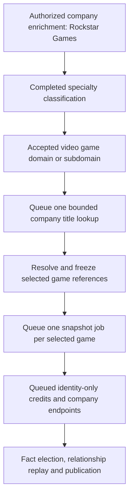
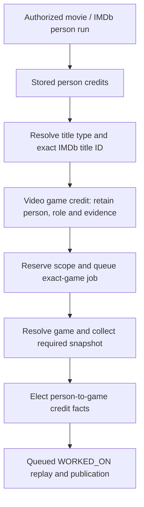
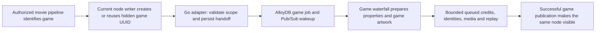
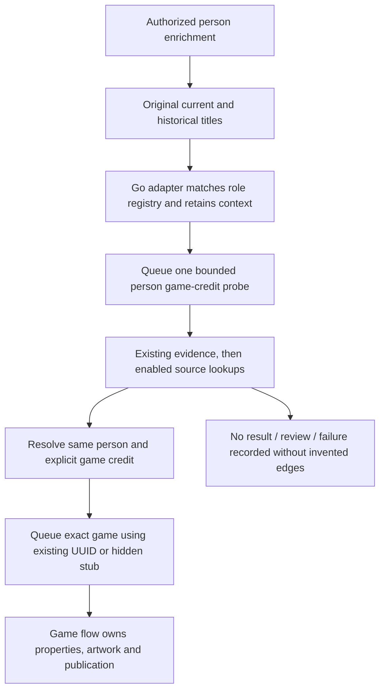
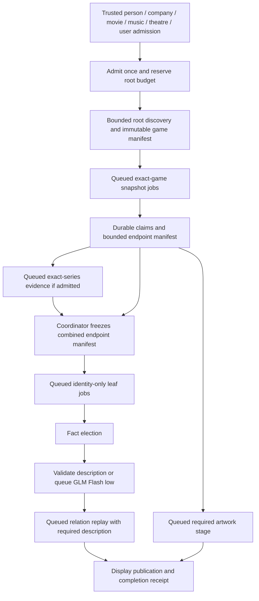

<Info>
**Build plan — build-agent handoff revised September 9, 2026.** Implementation target: **Go in Orbiter Universe on GCP**, with AlloyDB, Pub/Sub, Cloud Run, GCS and the Universe FalkorDB graph. This page specifies proposed work; it does not claim the dedicated game migrations, workers or graph writers are built. Existing IMDb/Film-TV writers can already create video game subtype nodes. **No Xano implementation or dependency.**

The user constraint is stronger than a depth cap: **no recursive waterfall execution**. A root owns a finite staged plan. Every fan-out is queued, every job has a fixed capability, and discovered people, companies, games and works cannot restart discovery.
</Info>

## Build agent: start here

Follow the [phased implementation guide](/guides/open-work/video-game-waterfall-build-guide) before changing runtime code. It defines **nine ordered phases (0–8)**, explicit dependencies, executable-eval requirements and a receipt that must pass before moving forward. The [machine-readable phase/eval catalog](/assets/video-game-waterfall/build-evals.json) is the checklist; its `not_run` state must never be presented as runtime validation.

Read this page for behavior, Graphs → [Node Types](/guides/ontology/nodes#game-type-contract-v1) and [Edge Types](/guides/ontology/edges#game-edge-contract-v1) for graph contracts, and the [sources page](/guides/open-work/video-game-waterfall-sources) for source admission. The build guide resolves stale examples and fixes the implementation order; it does not grant permission to alter locked graph semantics, buy providers or deploy. Preserve existing local edits. Normal engineering choices may proceed within the contract; missing credentials block only the dependent live-source gate.

The deliverable includes all **six game-specific node families and fifteen game-domain edge families** in the output manifest, plus all four primary entry adapters. Related Person/Company/music/movie/theatre identities reuse existing contracts. No extra node/edge family is admitted by discovery. Optional evidence may be absent; silently omitting a required writer, registration, correction path or eval is not optional coverage.

**Locked source/type review:** [Sources & Graph Contract](/guides/open-work/video-game-waterfall-sources) maps every proposed source to the six entity families. Graphs → [Node Types](/guides/ontology/nodes#game-type-contract-v1) and [Edge Types](/guides/ontology/edges#game-edge-contract-v1) hold the `games-v1` identity, property and replay rules. All six types are in the intended build; supporting nodes are created only when evidenced.

**Game series card contract — locked September 9:** `description`, `developers`, `official_website` and `image_url`; no tagline. Store a **400 × 267 WebP**, using a 3:2 frame with whole-pixel height rounding, white canvas and 32 px padding through the shared image pipeline. [Final parameters, image sources/fallbacks and three design node JSONs](#game-series-card-contract).

**Game platform parameters — locked September 9:** short `description` (≤127 characters) and optional verified `official_website`, alongside the existing platform identity/code/kind. **No standalone card or image pipeline for platforms.** [Parameters and PlayStation 4 / Windows JSON](#game-platform-parameters).

**Game engine node and edge — locked September 9:** `Game_Engine` has a short description and no standalone card; `Video_Game → USES_ENGINE → Game_Engine` uses weight 80, mandatory edge description/provenance and scoped version records. [Node and execution details](#game-engine-description) · [Authoritative Edge Types contract](/guides/ontology/edges#uses-engine).

**Game award node and edge — locked September 9:** the reviewed `Game_Award` properties, short description, outcome and card are fixed. `HAS_AWARD` uses weight 40, the full description/provenance envelope, required award-evidence record IDs and a synchronized `award_result`. Its card reuses the game's stored 2:3 artwork. [Build sequence](#game-award-node-and-edge-contract) · [Node Types](/guides/ontology/nodes#game-award-properties) · [Edge Types](/guides/ontology/edges#game-has-award).

## Entry points

All entries call one proposed Go `GameGate.Admit` boundary. HTTP/event names below are new contracts, not existing endpoints. Every request includes a trusted upstream event ID, origin, policy version and immutable ancestry; the server derives execution scope. A caller cannot grant itself a fresh root by supplying `depth: 0`.

| Entry | Identity/evidence required | Admitted work |
| --- | --- | --- |
| **1. Company enrichment: video game specialization** | Canonical Company with a completed, accepted video game domain/subdomain classification behind `SPECIALIZES_IN` | Queue one bounded company-to-title lookup, then exact-game jobs for the selected titles. Broad video game relevance admits a probe; each company/game relationship needs its own evidence. [Detailed review below](#company-specialization-entry). |
| **2. Movie/IMDb pipeline: person has a game credit** | An already resolved person, stored IMDb credit and exact `tt…` classified as a video game | Save the person/game credit evidence and queue that exact game. Preserve roles and characters; reuse the person. [Detailed review below](#movie-person-credit-entry). |
| **3. Person pipeline: relevant job title** | Existing canonical person with a matching current or past role from the proposed game-role intake registry | Queue one bounded search for this person’s game credits, then hand verified game results to the existing game queue. No IMDb ID or known game required. [Detailed review below](#person-role-entry). |
| **4. Music waterfall: game soundtrack, score or recording use** | An authorized music run with a resolved music endpoint and explicit game evidence, or a bounded soundtrack/game-credit candidate needing resolution | Queue the [music-to-game adapter](#music-waterfall-entry), then the exact hidden game. Preserve soundtrack/use/credit evidence; no game → music → game rediscovery. |
| **IMDb title** | IMDb extraction says `videoGame`, or a verified game alias matches the title | Use the [same movie-to-game handoff](#movie-to-game-handoff). Create/reuse identity with the current node writer, then queue the game adapter with that UUID and already paid-for snapshot; skip movie-only enrichment for the game. |
| **Movie/TV adaptation** | Resolved film QID and explicit P144/P4969 statement involving a supported game | Admit the game and the relationship evidence. Preserve film → game or game → film according to the statement. |
| **Forthcoming theatre adaptation** | Resolved theatrical work or production QID and explicit Wikidata relation | Admit the directly connected game. A play and one production of that play are not interchangeable endpoints. |
| **Reviewed Game Awards seed batch** | Trusted user/admin event with explicit ceremony year and category/page allowlist | Freeze a bounded set of nominated/winning games and queue the existing game flow. [Official-source adapter](/guides/open-work/video-game-waterfall-game-awards); no archive recursion. |
| **User/admin direct game** | Strong ID or a title/year/platform candidate for review | One game root; ambiguous matches return candidates, not an automatic merge. |

<a id="company-specialization-entry" />

### 1. Company enrichment through SPECIALIZES_IN

**Decision: yes — any accepted specialization in the video game domain can be a company entry point.** It need not be classified narrowly as a developer. Company enrichment resolves the company's specialties, identifies video game relevance, and queues a bounded search for titles connected to that exact company. The selected titles enter the game waterfall as queued jobs within the same authorized plan.



#### What classification we read

The existing Go company classifier produces `industry` and `specialties`. The facts-backed company view supplies the specialty rebuild, which resolves those specialties to `DomainExpertise` or `SubDomainExpertise` targets and writes `SPECIALIZES_IN`. A subdomain can have its parent linked by `HAS_SUBDOMAIN`. Here, **domain means the expertise taxonomy**; the company's website domain is an identity/source hint.

The game detector must recognize both a **direct video game domain match** and a **video game subdomain match**, including its resolved immediate parent. Read the resolved classification snapshot; do not recursively traverse the taxonomy. Bind eligibility to canonical taxonomy IDs through a versioned registry. The labels below illustrate intended coverage; exact existing IDs and aliases must be verified before enabling the detector.

| Classification result | Entry behavior | Relationship rule |
| --- | --- | --- |
| Video games; game development/design; video game publishing | Eligible for one bounded title probe | Developer and publisher are separately evidenced roles; publishing is enabled as part of this company entry |
| Other confirmed video game specialties: game art, audio, localization, QA, middleware, esports or video game retail | Also eligible for the bounded probe, scoped to titles the company explicitly made, published or contributed to | A category match, stocking a title, or hosting its tournament does not prove development/publishing; unsupported company contribution roles remain pending evidence |
| Ambiguous “gaming”, generic entertainment/software, or an unresolved taxonomy match | Preserve a classification-review result; no automatic title enumeration until video game relevance is resolved | Do not silently treat gambling, board games or a general retailer as a video game creator |
| No accepted video game classification | No company-triggered title probe | An independently evidenced exact-game entry from another lane remains valid |

**Eligibility and title evidence are separate decisions.** Broad video game relevance grants a small, bounded lookup. It grants no company/game edge by itself. Wikidata company classes can corroborate classification, but a Wikidata developer class or even a company QID is not mandatory when canonical company identity and accepted specialty evidence already exist. Name substrings, edge descriptions and vector distance alone do not authorize the trigger.

#### When the company waterfall queues it

The inspected Go implementation calls `RequestSpecialtiesRebuild` from the company's `specialties_rebuild` step and publishes `graph.specialties_rebuild_requested`. The graph consumer can clear and rebuild specialties asynchronously; a request, a partial graph, a missing dependency or a successful no-op is **not** proof of a completed classification. The current music bridge separately reads `industry`/`specialties` from the stored about-writer payload; its probe pattern is useful, but it is not already a game detector.

The company-entry review additionally inspected Universe revision **`8871eb8ed2d024de3c2bdb0d2f07ff8016a53036`**: `company/steps_about.go`, `company/steps_closing.go`, `company_gate.go`, `graph/specialties.go` and `company/steps_music_label_verify.go`. This identifies the integration work; it does not claim the proposed game trigger exists.

**Required Go extension:** persist a versioned, completed specialty-resolution snapshot and readiness receipt, then emit a correlated company-game evaluation job through the shared outbox. The receipt binds the accepted company facts to the resolved taxonomy targets. A classifier failure or incomplete rebuild waits/retries with the shared Universe failure records; it must not be cached as “not a video game company.” A successful empty classification is a distinct recorded outcome.

| Trigger contract | Required behavior |
| --- | --- |
| Origin and identity | Origin `company_specialty` (built spelling; the eval catalog's coverage label `company_specialization` is unchanged); canonical company UUID, verified aliases, classification snapshot/revision and qualifying taxonomy IDs |
| Durable scope | Persist the company run ID, upstream event ID, root/job lineage, policy version and remaining shared budget. The existing entity-only graph trigger does not supply this whole contract; add correlated durable context before enabling the game handoff |
| Root authority | Only an already authorized company run with game-discovery capability may schedule the probe. An identity-only company found inside a game has no such capability, even if it specializes in video games |
| One evaluation | Collect qualifying specialties into one company-level decision. Three matching specialties do not produce three probes |
| Deduplication | Uniquely reserve one probe per canonical company + authorized root + job kind under its immutable policy. Store the eligibility digest/revision as a validation fence, not as another reservation slot. Rebuilt edge UUIDs, aliases, classification revisions and Pub/Sub delivery IDs cannot authorize a second pass within that root |
| Refresh and retraction | Check the current classification generation before admission/provider spend. A changed classification cannot expand a frozen manifest or replenish budget; a retraction stops new discovery while independently supported game facts survive |
| Producer behavior | Persist the handoff and return `queued`; do not run title lookup or game enrichment inline in the company worker |

#### Finding titles: Rockstar Games example

**Real company and titles; simulated pipeline behavior.** If a completed Rockstar Games classification qualifies, its [official games catalog](https://store.rockstargames.com/view-all-games) provides candidates such as [Grand Theft Auto V](https://www.rockstargames.com/gta-v) and [Red Dead Redemption 2](https://www.rockstargames.com/games/RedDeadRedemption2). These source pages were checked on September 8, 2026; this does not claim a live Orbiter classification or queued run for Rockstar.

1. Reuse the canonical Rockstar Games company, its verified website and any existing provider IDs. Resolve additional company aliases only within this probe's budget; a brand, parent company and development studio are not interchangeable identities.
2. Look for exact-company title associations in an entitled provider's company catalog, bounded Wikidata inverse lookups for [developer P178](https://www.wikidata.org/wiki/Property:P178) / [publisher P123](https://www.wikidata.org/wiki/Property:P123), or the verified company's own title/portfolio pages. All sources share the same limits. A company without a QID can start from its verified official portfolio; do not crawl its whole website or a retailer's entire stock list.
3. Retain source URLs, source company IDs, claimed role, game identifiers and edition/platform qualifiers. Official catalog inclusion supplies a discovery candidate; the title snapshot must verify any developer/publisher assertion. A brand catalog must not silently turn every title into that brand's development credit.
4. Resolve game identity, deduplicate aliases and freeze the selected manifest. The pilot permits **at most 3 discovery pages total and 20 selected games**, subject to the root's remaining **100 non-replay jobs / 200 network attempts** and all other shared limits. No separate allowance per provider, specialty or game.
5. Queue the selected GTA V and Red Dead Redemption 2 snapshot jobs. Each emits facts and bounded endpoint candidates. `PUBLISHED_BY` / `DEVELOPED_BY` are written only after the relevant title-level evidence is elected; unresolved roles stay pending. Newly discovered studios receive identity-only jobs.
6. Finish with selected/deferred counts and explicit partial coverage. Do not follow studios, subsidiaries, sequels or sibling titles to create another catalog run. Future catalog discovery requires a new trusted demand event under the normal admission policy.

**Stopping example:** if a selected title names Rockstar North as its developer, that studio can be resolved and linked from the title's evidence. Its own video game specialization cannot trigger Rockstar North's catalog from this run. The same applies if a studio points back to Rockstar Games.

<a id="movie-person-credit-entry" />

### 2. Movie/IMDb pipeline through a person's video game credit

**Decision: when the movie/IMDb person pipeline adds a credit for a video game, it queues that exact game into this waterfall.** This entry needs a credited person and an identified game; it does not require a company specialization or an adaptation relationship. Reuse the person's canonical UUID and IMDb `nm…` alias.

**Agreed adapter design:** keep the current shared identity/node creation path. It creates or reuses the game node; a Go adapter then queues the dedicated video game waterfall with that same UUID. The internal node starts hidden. The game worker supplies its displayed properties and game-source artwork, schedules the permitted queued fan-outs, and makes it visible only through its successful publication gate. The adapter does not run the waterfall inline, and a later graph update does not call the adapter again.

#### Already-created game nodes: reuse them

**Video game nodes already appear in recorded sandbox output from the existing title pipeline.** The [Warner Bros. QA fixture](/guides/enrichment/waterfall/qa-smoke-tests/warner-bros#sandbox-test-results) records these two nodes with `Entity`, `Film_TV` and `Video_Game` labels, alongside David Haddad's `WORKED_ON` credits:

| Existing title | IMDb ID | Recorded graph UUID |
| --- | --- | --- |
| Lego Harry Potter: Years 5–7 (2011) | `tt1954614` | `ddfc9d12-c0d4-42af-a8ed-794033126528` |
| Lego Star Wars: The Force Awakens (2016) | `tt5430544` | `ed0d89b5-b35e-4720-8f6b-29feb57f750f` |

The fixture's node/edge timestamps are July 31, 2026. It is historical sandbox evidence, not a count of today's Universe production graph. The inspected Go implementation also supports the shape: `graph/film_tv_sync.go` maps title type `video game` to `Video_Game`, and `platform/graph/film_tv.go` allows that subtype on the Film/TV node.

**The new work extends an existing game identity and credit path.** Resolve the verified IMDb alias first and retain the same UUID and existing credit/identifier evidence. Movie metadata may remain in source history but does not supply the published game card. Register the dedicated game job/credit owner; migrate labels and reader discriminators only through the compatibility plan. Do not create a second game because its first node carries `Film_TV`, and do not launch a full catalog scan merely because it predates this waterfall. Existing IMDb image URLs are excluded from game artwork selection, including already rehosted IMDb posters. The game flow selects new artwork from its enabled game sources.

“Credit added” means **the source credit has been durably stored**, including a pending credit whose game endpoint is unresolved. The trigger must not wait for a `WORKED_ON` graph edge: game identity and endpoint readiness may be the very work the queued job needs to perform. Credit existence and full game enrichment have separate completion states.



<a id="movie-to-game-handoff" />

#### Existing node writer → Go adapter → queued game waterfall

**Required connection:** after an authorized movie/person run creates or resolves the game through the existing identity/node writer, its Go adapter records a durable game-enrichment demand for **that same canonical entity**. Reuse the current `Entity:Film_TV:Video_Game` node shape and reader compatibility for IMDb-created games; a label cleanup is not a prerequisite for enrichment. The new game worker consumes the demand through the shared queue and updates that node. A legacy game node is an intake endpoint, not evidence that the dedicated game waterfall has already run.

Budget admission still precedes creating a new entity or spending with a provider. Once identity is admitted, keep the current node writer and pass its UUID to the adapter. A pending graph projection does not require a replacement entity: the job keeps the UUID, and publication/replay waits for node readiness. Other entry points use the same canonical identity contract without requiring an IMDb ID.



| Producer / moment | Connection to the game lane |
| --- | --- |
| Person credit intake identifies the exact title as a game | Persist the credit and `imdb_person_credit` handoff before movie-only dispatch. Reuse the canonical game UUID if already resolved; otherwise admit the verified reference through the same resolver |
| A queued IMDb title check identifies the title as a game later | Persist an `imdb_title` handoff with the original run's ancestry, title payload and existing entity UUID. Transfer any already reserved unfinished title work into the game scope exactly once, with prior spend retained; do not leave parallel movie and game enrichment jobs |
| The movie path finds an already enriched `Film_TV:Video_Game` | Evaluate game-lane requirements **before** returning a movie freshness/no-op result. A legacy movie `enriched` flag or image does not satisfy game facts, game replay or game publication receipts |
| Another person's game credit arrives while game work is queued/running | Attach that person's evidence and pending replay dependency to the existing scoped game work. Do not enqueue a second snapshot or lose the new credit when an older worker completes |
| The required game snapshot is already fresh | Queue only missing credit/fact/replay/publication stages under the authorized scope. Fresh game detail never suppresses a newly added person's credit |
| Graph sync, credit replay, image refresh or an identity-only descendant rewrites the node | No new game demand. These consumers can finish existing dependencies but cannot act as root/discovery producers |

**One Go admission owner handles both movie entry routes.** The person-credit adapter and the late title-classification adapter converge on the same root + canonical game + job-kind/generation reservation. Provider aliases and two entry origins are not two games or two budgets. If classification arrives before canonical identity is ready, keep an unresolved reference handoff and let the admitted identity stage resolve it; do not use `tt…` as a fabricated graph UUID.

The durable handoff carries the upstream run/event and root IDs, canonical entity UUID when known, verified IMDb title ID, classification evidence reference, source payload revision, credit references/person UUID when applicable, policy/manifest/generation, and a reservation/receipt reference. Pub/Sub carries only the handoff/job ID. Resolve ancestry and permitted stages from stored state; neither an event boolean nor the presence of the `Video_Game` label grants authority.

**Close the persistence gap:** when the source credit/type evidence commits, record its handoff intent in the same transaction/outbox. The admission consumer then atomically reserves or finds the scoped game job and marks that intent admitted/deferred. Recovery retries the same intent; it cannot repeat discovery or treat each delivery as new demand. Existing game UUIDs from a graph-only record must first be reconciled through the owning entity/identifier resolver while preserving their identity; a missing relational registration is a recorded compatibility issue, not permission to mint a replacement.

**Credit ownership moves with the game lane.** Keep one active writer for each game/person relationship through the transition. Preserve existing credit UUIDs where possible and record any required key migration; importing old rows does not automatically elect unsupported claims. Old movie game-credit rows and new game credit evidence reconcile under one typed replay owner. No delete-and-recreate cycle, duplicate `WORKED_ON` edge, loss of role/character evidence or new discovery from the replay itself.

**Existing-node rollout:** first verify a small, explicitly selected set of existing game entities in the target environment, including their IMDb aliases, credits and current game-lane receipts. Submit a bounded user/admin admission for that set and use this same handoff/queue contract. The historical Warner Bros. UUIDs above are test evidence, not production IDs to enqueue blindly. Do not trigger a whole-graph sweep from deployment, label migration or an ordinary graph update.

**Acceptance:** a newly admitted IMDb game uses the current node writer once, and its adapter queues game work that updates the exact returned UUID; an existing game with movie enrichment complete but no game-lane receipt queues its missing game work; a second credit or duplicate title event adds evidence without a second snapshot; fresh game detail still gets the new credit replayed; and every game-written node/credit update produces **zero return handoffs**. All resulting work retains the original identity, ancestry and remaining budget.

<a id="game-publication-gate" />

#### Visibility and display ownership: publish only after the game flow

**Required: create internally, enrich through the game flow, then reveal.** A game stub created by the movie pipeline has `visibility=false` and `game_publication_status=pending`. Preserve its UUID, aliases and source credit records internally. The Go adapter queues the game waterfall; it cannot publish the movie-derived card or reuse its IMDb image while that work runs.

| Stage | Internal state | User-visible behavior |
| --- | --- | --- |
| Movie pipeline creates/resolves game and stores credit | Same UUID; game publication pending; IMDb identifiers and credit evidence retained | Game node/card and incident graph relationships remain hidden |
| Queued/running game waterfall | Game-owned candidate properties, elected credits and thumbnail ingestion are in progress | No partially populated game or IMDb poster appears |
| Required game stages succeed | Game facts and required graph/replay receipts are ready; game-source artwork has passed the shared file pipeline; matching display revision is prepared | Game publication atomically activates that revision and sets visibility true |
| Fetch, thumbnail, required replay or publication fails/is budget-blocked | Keep partial work and classified failure/pending receipts for bounded retry | First publication stays hidden; no IMDb or movie-property fallback |
| Refresh of a previously game-published node | Build the next generation separately; retain the last successful game publication | Continue serving that prior complete game version until replacement is ready, unless it is explicitly retracted |

**The game flow owns the displayed parameters:** title/name, description, release dates, game kind, genres, platforms, source links and artwork are selected from the enabled game-source facts and the game projection contract. An IMDb title label can be an internal identity hint; it is not a finished game description, release record, rating or image. IMDb IDs and explicit person credits remain legitimate identifiers/relationship evidence. Unavailable optional fields remain absent; do not fill them from the movie display row.

**Scoped support also inherits the gate.** A `Game_Release` or `Game_Award` and all of its incident edges remain hidden until its associated game has a matching published revision. This includes person → award and release → platform paths that bypass a direct game endpoint. Internal graph replay may finish while hidden; the public projection/read policy checks the game dependency without making publication depend on prior public visibility.

**Artwork is required for first publication.** Choose an exact-game asset through enabled IGDB/MobyGames, Steam, official game artwork, an approved exact-game award tile or a game-linked Commons source. Exclude IMDb source images and rehosted copies of those images. Store the approved result through the shared avatar/movie-poster file pipeline at `game-thumbnail/<game-uuid>/<source-url-hash>.webp`. Missing or rejected art yields a recorded pending reason; exhausted retries/budget park first publication. A placeholder may appear in an internal review view, but it does not satisfy this public publication gate.

**Visibility must be enforced at read time as well as write time.** Game cards, search, people/company credit lists, graph neighborhoods, paths and counts expose only the last successfully published game revision. Both endpoints must be public before an incident edge appears. `Film_TV` compatibility labels, a movie `enriched` flag, node existence or a missing visibility property cannot bypass the game gate. Operational review can still inspect pending evidence and internal nodes.

Only the game publisher may set game visibility true. The current node writer therefore needs a game-specific hidden-stub mode, and movie sync/publish must defer game display fields and visibility to the game owner. Add a durable `game_publication_status`/revision receipt and generation fencing through the existing publication framework. Stage graph/projection data before activation; readers require the matching committed publication revision so a crash between stores cannot expose half a game. Late movie syncs and stale workers cannot restore IMDb artwork, overwrite game parameters or reveal a pending node.

A legacy movie-visible game with no successful game-publication receipt is unready under this contract: exclude it from public game surfaces until the bounded migration/admission process completes its game flow. Preserve its identity and historical evidence. Missing game-publication state defaults to pending for game subtypes; it does not change visibility rules for genuine movies or TV series.

#### Detect the game before movie-only enrichment

The inspected Go `person/steps_credit_cascade.go` reads the already stored IMDb profile and offers titles to the Film/TV path. Its root-person branch can run the top two titles inline. `person/credit_tiers.go` reads each credit's `type`, demotes `video game` as a weak format, and then retains a title/roles structure without that type. It deduplicates repeated title IDs by keeping the first occurrence. `person/credit_roles.go` maps only a small crew vocabulary; person-side cast/character credits are deliberately omitted by the existing movie mapper.

**Required Go extension:** split classified game credits from the raw stored credit collection **before** movie-only tiering, first-occurrence deduplication and inline enrichment. Reuse the shared canonical resolver and current node writer, then pass the resulting UUID and credit evidence to the queued game adapter. A game can retain its existing Film/TV compatibility labels; the split changes its enrichment owner, not its identity. These seams were reviewed at Universe revision **`8871eb8ed2d024de3c2bdb0d2f07ff8016a53036`**, alongside `film_tv_credit_replay.go`. The existing movie behavior remains owned by the movie pipeline; this is a proposed game-specific dispatch branch.

| Credit intake case | Required game behavior |
| --- | --- |
| Source explicitly classifies the exact `tt…` as a video game | Normalize the source's type through a versioned mapping and admit the game reference. An IMDb title ID alone does not distinguish a game from a movie |
| Type missing, ambiguous or conflicting | Preserve the credit and queue one bounded identity/type check if authorized. Keep reason `title_type_unresolved` or an identity conflict until resolved; a familiar title/name match must not mint a Film/TV or game duplicate |
| Actor, voice, performance, writer, director, producer or another supported game role | Retain raw credit category, role text, character, credited-as name, language and other supplied qualifiers. Apply the game role map; do not pass through the movie-only crew filter |
| Character name without a trustworthy performance category | Keep the character text and pending role evidence. Do not guess voice acting versus performance capture from the character name or the game's medium |
| Several roles/characters for one person and game | One selected game job; distinct normalized credit records keep each evidenced role/character/qualifier combination. No first-credit-wins loss |
| Existing canonical game, including legacy `Film_TV:Video_Game` | Reuse the UUID through the verified IMDb alias. Add the new person's credit evidence and wake bounded replay; fetch game detail only when a required snapshot is absent or stale under policy |

A selected automatic game job is **tier 1**, so it is eligible for the shared tier 0–1 drain; an explicit user request can supply tier 0. Do not inherit the movie weak-format demotion or inline-top-two path. Ranking selects within the root's cap; overflow remains deferred with its credit evidence and reason. Game classification never turns all of a person's credits into an unlimited queue.

#### Credit handoff, queue and ownership

1. **Store evidence first.** Reuse the IMDb profile payload already fetched by the movie/person run. Retain payload ID/revision, credit locator, source URL, person UUID/IMDb ID, exact title ID, observed title type and every supplied role/qualifier. A refused admission keeps a bounded pending source reference; it does not create an unfunded entity.
2. **Admit once through Go.** Use origin `imdb_person_credit` and a stable upstream credit event ID. Validate the producer's stored scope and the original root's remaining budget before game identity creation or provider work. Persist the credit-to-game handoff, job reservation and outbox transactionally so a crash between credit persistence and delivery cannot lose the request.
3. **Queue each selected game.** Preserve upstream run/root IDs, causation, policy, manifest and generation. Several people or sources crediting the same title within one root share one game snapshot job while retaining every person's claims. Separate authorized roots still share canonical identity and source-cache/freshness rules; their receipts and budgets remain attributable.
4. **Preserve and elect the credit.** A valid person-side assertion can support the edge even if another provider omits that credit. Normalize/elect exact role and qualifier evidence through the shared facts framework. Missing corroboration is not a retraction; contradictory evidence follows election policy. Unknown roles stay pending instead of being dropped.
5. **Replay through one owner.** When both endpoints and elected evidence are ready, the game credit replay materializes `Person → WORKED_ON → Video_Game` using the game contract: weight 30, evidence layer, excluded from scoring. Movie and game replays must not both write this same game credit. Endpoint readiness or a fresh existing game cannot suppress newly pending credit work.
6. **Finish without discovery callbacks.** Game failure or budget deferral is visible through shared Universe attempts/stages and pending reasons while the person's saved credit survives. A graph retry, duplicate credit event or game completion cannot call the person/movie enrichment gate or refill the filmography.

The [admission payload below](#admission-and-worker-interfaces) shows this exact entry origin. Extend its evidence reference to the complete stored credit record; event-supplied flags cannot grant discovery authority. The game lane may use the already paid-for title snapshot when available, and any remaining title fetch is queued and charged to the same root.

#### Example and stopping point

The [existing real-data simulation](/guides/open-work/video-game-waterfall-examples) includes **Martha Mackintosh** (`nm0533594`) credited as **voice actor / Melina** on **Elden Ring** (`tt10562854`). Its frozen evidence is Wikidata; it illustrates the endpoint and credit properties, not a captured IMDb person response. Given the equivalent explicit IMDb credit, this entry reuses Martha's person identity, queues Elden Ring once and retains the role/character for the elected `WORKED_ON` relationship.

**Stopping example:** Elden Ring may reveal other credited people and its studio. Those endpoints receive bounded identity-only resolution. Their IMDb aliases, filmographies and video game specialties do not restart movie, person, company or game discovery. An identity-only person reached from a game cannot emit this entry even if a lookup exposes another game credit; that source mention can remain evidence without new discovery.

<a id="person-role-entry" />

### 3. Person pipeline through relevant job titles

**Decision: add a Go person-to-game adapter that tries to find game results for people with these roles.** A matching current or historical title qualifies for one bounded game-credit probe; an IMDb profile, known game or confirmed game employer is not required to try. Several matching titles still produce one person-level probe. Its results must resolve the person and name a game contribution before they become a credit.



#### Role coverage and matching

All **ten supplied role families** are included. The complete [proposed intake registry (JSON)](/assets/video-game-waterfall/person-role-intake.json) retains every supplied title group, including adjacent disciplines. It is a build artifact, not an enabled runtime configuration or a replacement for the graph credit-role taxonomy.

| Family | Examples that qualify for the probe |
| --- | --- |
| Engineering / Programming | Gameplay/engine/tools/network/AI programmers, Unity/Unreal developers, technical directors, build/release/DevOps engineers |
| Art | Technical artists, riggers, character/environment artists, animators, VFX/lighting/UI artists, art directors |
| Design | Game/systems/level/combat/economy/narrative designers, writers, UX, game/creative/design directors |
| Production / Leadership | Producers, development/project/program managers, studio heads, general managers, founders and executives |
| Audio | Sound designers, composers, music supervisors, dialogue/voice/audio directors and leads |
| QA / Player Support | QA, SDET/test automation, compliance/certification and player/community support |
| Live Ops / Product / Analytics | LiveOps, product, data/game/monetization analysts, user acquisition and growth |
| Publishing / Business / Marketing | Publishing, brand/community/creator relations, PR, partnerships, licensing and publishing leadership |
| Esports / Adjacent | Esports/tournament operations, broadcast, shoutcasters, players, team managers, coaches and analysts |
| Localization & Ops | Localization/LQA/translators, IT/studio operations, games recruiting and talent acquisition |

<AccordionGroup>
<Accordion title="Engineering / Programming — complete supplied list">

- Gameplay Programmer / Gameplay Engineer
- Engine Programmer, Graphics Programmer, Rendering Engineer
- Tools Programmer / Tools Engineer, Pipeline Engineer
- Network Programmer, Multiplayer Engineer, Backend Engineer (Live Services)
- AI Programmer, Physics Programmer, Audio Programmer
- Technical Director (TD), Lead Engineer, Principal Engineer
- Build Engineer, Release Engineer, DevOps / Infrastructure Engineer
- Generalist: Game Developer, Unity Developer, Unreal Developer, Game Programmer

</Accordion>
<Accordion title="Art — complete supplied list">

- Concept Artist, Character Artist, Environment Artist, Prop Artist
- 3D Artist, Modeler, Texture Artist, Material Artist
- Technical Artist (very common, distinct discipline), Rigger, Character TD
- Animator, Gameplay Animator, Cinematic Animator, Motion Capture Specialist
- VFX Artist, Lighting Artist, UI Artist / UI Designer
- Art Director, Lead Artist, Visual Development Artist

</Accordion>
<Accordion title="Design — complete supplied list">

- Game Designer, Systems Designer, Level Designer, Encounter Designer
- Combat Designer, Economy Designer, Monetization Designer (F2P/mobile)
- Narrative Designer, Writer, Game Writer, Story Lead
- UX Designer, UI/UX Designer, Player Experience Designer
- Creative Director, Game Director, Design Director, Lead Designer

</Accordion>
<Accordion title="Production / Leadership — complete supplied list">

- Producer, Associate Producer, Senior Producer, Executive Producer
- Development Director (Ubisoft/EA-flavored term for producer-ish roles)
- Project Manager, Program Manager, Scrum Master / Agile Coach
- Studio Head, Studio Director, General Manager, Head of Studio
- COO / CEO / Co-Founder (indie studios especially)

</Accordion>
<Accordion title="Audio — complete supplied list">

- Sound Designer, Audio Designer, Technical Sound Designer
- Composer, Music Supervisor, Audio Director
- Dialogue Supervisor, Voice Director, Audio Lead

</Accordion>
<Accordion title="QA / Player Support — complete supplied list">

- QA Tester, QA Analyst, QA Lead, QA Manager
- Test Automation Engineer, SDET
- Compliance / Certification Specialist (first-party cert: Sony, MS, Nintendo)
- Player Support Specialist, Community Support Agent

</Accordion>
<Accordion title="Live Ops / Product / Analytics — complete supplied list">

- Live Operations Manager, LiveOps Producer
- Product Manager, Senior Product Manager, Director of Product
- Game Analyst, Data Analyst, Data Scientist, Monetization Analyst
- UA Manager (User Acquisition), Growth Manager, Performance Marketing Manager

</Accordion>
<Accordion title="Publishing / Business / Marketing — complete supplied list">

- Publishing Manager, Product Marketing Manager, Brand Manager
- Community Manager, Social Media Manager, Content Creator Manager
- Influencer / Creator Relations Manager
- PR Manager, Communications Manager
- Business Development Manager, Partnerships Manager
- Licensing Manager, Head of Publishing, VP of Publishing

</Accordion>
<Accordion title="Esports / Adjacent — complete supplied list">

- Esports Manager, Tournament Organizer, Esports Operations Manager
- Broadcast Producer, Shoutcaster / Commentator
- Pro Player, Team Manager, Coach, Analyst

</Accordion>
<Accordion title="Localization &amp; Ops — complete supplied list">

- Localization Manager, Localization QA (LQA) Tester, Translator
- IT / Studio Operations, Talent Acquisition (Games), Recruiter — Games

</Accordion>
</AccordionGroup>

Match case, punctuation, known spelling variants and seniority modifiers without losing the source title. Treat `TD`, `SDET`, `LQA`, `UA` and `LiveOps` as contextual aliases, not arbitrary substring matches. Preserve Technical Artist as its own discipline. These matches are **search eligibility**, not assertions that a programmer wrote a particular game or that a QA tester has the same relationship as an esports player.

Broad titles such as Backend Engineer, Producer, Data Analyst, Recruiter, CEO or Coach can still receive this bounded probe. Use already stored employer identity, accepted game specialization, work dates, geography, portfolio and known source IDs to disambiguate and rank candidates. A weak-context result can be `review_required`; do not auto-attach the first same-name result. Reading an employer's stored classification must not launch company enrichment or its catalog discovery.

#### Person pipeline hook

The inspected Go person pipeline's `stepRoles` reads original work rows through `RecordStore.ListWork`, current first and then past roles, but its reduced output uses a closed vocabulary and drops unknown labels. The new adapter must read the **original current and past work records and existing profile evidence**, not depend on the role reducer retaining “Gameplay Programmer” or “Technical Artist.” The `rolesAlreadyWritten` shortcut must not suppress new game-probe eligibility when work history changes.

Add a proposed `person_game_probe` handoff step after the run has persisted its available work/profile/identifier evidence and before closeout. It records origin `person_role` (built spelling; catalog coverage label `person_game_role`) through the shared outbox and returns `queued`; provider searches happen in the game lane, never inline in the person worker. The step is independent of movie-domain classification and can run when no IMDb ID exists. A failed unrelated optional role-reduction/identity-bridge step must not erase valid stored title evidence.

Use `job_kind=root_discovery`, immutable scope `person_credit_probe`, under the **existing authorized root**. The name identifies the first discovery stage of that finite plan; it does not create a new root for each role. Store person UUID, stable source aliases, work/profile snapshot IDs and role-row references, matched registry family/terms, context/evidence digest, upstream run/event/root IDs, policy, plan hash and budget reservation. The API reads those records to validate scope; user payload flags cannot enable a leaf.

#### How the game adapter looks for results

1. **Read what is already known.** Check canonical identifiers and the existing elected/pending game-credit ledger for this person. Reuse exact game and person aliases and already acquired IMDb credits. An exact named-game assertion goes directly to the same admission/replay path as entry two; do not repeat a provider search for that assertion.
2. **Use strong person IDs when available.** Query enabled sources for that person's direct game credits: bounded Wikidata role predicates against the resolved person QID, an already stored IMDb person snapshot, or a licensed provider's person-credit endpoint when its capability is enabled. Never assume a catalog/cover subscription includes person credits; IGDB company/game metadata alone is not evidence of an individual's contribution.
3. **For people without a credit-provider ID, run targeted discovery.** Search the person's name/credited aliases with known employer, discipline and optional named project; inspect exact portfolio, official credit, studio biography or permitted provider pages. Search snippets supply candidates only. Freeze at most five candidate person identities and retain corroborating profile links, employers, role/date context and source identifiers. Name equality or a job-title match alone cannot merge people.
4. **Require an explicit person-to-game assertion.** Extract the credited name, game ID/title, literal role, source URL/snapshot/locator and any version, language or character qualifiers. Resolve both endpoints and elect the scoped relationship. Employment during a release year, a games-domain specialty or a staff directory does not prove work on every studio title. Date mismatch is a review signal; release dates do not define the whole development period.
5. **Queue only resolved, admitted results.** Each selected game uses the existing canonical UUID or an admitted hidden stub, then the queued game waterfall. Retain the initiating person's credit evidence. Reuse an already fresh game snapshot while replaying new credits; the game flow still owns its public parameters and non-IMDb artwork. Identity or relationship ambiguity remains pending without creating a speculative game credit.

**Adjacent roles remain eligible for discovery.** A marketing, recruitment, player-support or esports title must not be rewritten as game development. An explicit in-game production/support credit can use the appropriate accepted game credit role. Merely playing, streaming, coaching, selling or covering a game stays scoped evidence for its proper relationship; this entry does not introduce `WORKED_ON` for those activities or invent new edge names. A future relationship extension needs its own owner and evidence contract.

#### Bounds, deduplication and results

One person probe is uniquely reserved per canonical person + authorized root + `person_credit_probe`, with the policy and evidence digest stored as fences. Roles, aliases, current/past jobs, source providers and redeliveries do not get separate probes. Read at most **50 work rows**, with explicit truncated coverage; inspect at most **5 candidate identities**, **3 discovery pages total** and **10 network attempts including retries** for the probe. Select at most **20 games** shared with any IMDb/company/adaptation intake in that root. These are sublimits of the existing root budgets; the adapter cannot mint a new allowance of 100 jobs or requests.

The coordinator freezes the selected games before scheduling later stages. Queue only those games and their bounded identity-only leaves. A person discovered while enriching a game **cannot run this adapter**, even when their title matches. Game results cannot cause company-catalog discovery, another person's credit search, or a second game-discovery stage. A deliberately separate later person request is new trusted demand under the normal admission policy.

| Result | Meaning / next action |
| --- | --- |
| `matched` | Resolved person plus explicit named game credit(s); return canonical game IDs, credit/evidence references and admitted/deferred counts; queue admitted work |
| `no_match` | Enabled, attempted sources returned no supported result within the completed probe scope; no credit edge and no claim of complete career coverage |
| `review_required` | Ambiguous person, game identity, role or unsupported relationship; preserve candidate evidence without a speculative graph link |
| `coverage_unavailable` | Needed person-credit source is disabled/not entitled or could not supply that coverage; not a negative career result |
| `budget_deferred` | Remaining root/probe budget prevents completion; retain counts/cursor and resume only within the authorized plan |
| `provider_failed` | Shared classified failure and retry receipt; do not cache as no match |
| `scope_blocked` | Identity-only/descendant scope or missing trusted lineage; no provider spend or new discovery |

Store probe outcomes in the shared job/payload/attempt facilities, with the same Universe logger and failure vocabulary. Proposed negative-cache lifetime is **30 days**, keyed to person identity, work/profile evidence digest, registry policy and enabled-source capabilities; a failed/incomplete probe is never a negative cache hit. New substantive evidence or an expired cache can be reconsidered on a later authorized run, not by an automatic recursive retry. Repeated pipeline passes can reuse the stored result without spending again; an override remains subject to normal admission limits.

**Review cases:** a Technical Artist with explicit portfolio game credits can match without IMDb; a Unity Developer with no credits gets a recorded scoped no-match; a generic Data Analyst with a same-name game-credit candidate requires identity corroboration; a Studio CEO gains no credit from the studio catalog alone; a QA or localization credit retains its exact discipline; a Pro Player or Coach is not turned into a developer; and a game-discovered artist triggers zero person probes.

<a id="music-waterfall-entry" />

### 4. Music waterfall → video game

**Yes: Music is a primary entry, alongside person, company and movie.** Add a Go music-to-game adapter to the authorized music run. It hands exact game evidence or a bounded matching candidate to the same game admission/queue boundary. This is a planned extension; the inspected music implementation does not currently contain a game handoff or `SOUNDTRACK_FOR` writer.

| Music evidence | Intake and eventual relationship |
| --- | --- |
| A soundtrack `Release_Group` explicitly linked to a game | Resolve/admit that game; elected `Release_Group → SOUNDTRACK_FOR → Video_Game` (55) |
| An exact `Music_Work` composed as a score for a named game | Resolve/admit that game; elected `Music_Work → SOUNDTRACK_FOR → Video_Game` (55) |
| An exact `Recording` explicitly used in a named game | Resolve/admit that game; elected `Recording → USED_IN → Video_Game` (60), retaining usage/version scope |
| An explicitly named artist/person game credit found in a permitted music source | Resolve the game and person; `Person → WORKED_ON → Video_Game` (30) only for the independently supported production role |
| Soundtrack classification, game-music context or title-only match without an exact game relationship | May authorize the bounded matching probe; creates no game node or bridge edge until evidence and identity resolve |

**Do not turn every album contributor into game staff.** An artist's existing `RELEASED`, `COMPOSED` or `PERFORMED` edge stays owned by music. The music-to-game bridge supplies a useful path without copying credits onto the game. A licensed song's performer need not have worked on the game. Reuse `Music_Group` for an actual group; do not split it into invented people or extend `WORKED_ON` beyond its locked Person endpoint contract.

#### Where to attach the Go adapter

Review reference: Universe **`06428412a30f0336b87cbb0c298fe97e500e9568`**, inspected September 8, 2026: `music_gate.go` (`musicPayloads.LandLookup`, `LandCreditClaim`), `music/orchestrator.go`, `music/steps_release_group.go`, `steps_work.go`, `steps_recording.go`, and `clients/musicbrainz/endpoints.go`.

The music flow already retains provider payloads and requests asynchronous fact normalization. Attach a **durable handoff intent** to a committed music source/claim snapshot, carrying origin `music_bridge` (built spelling; catalog coverage label `music_game_evidence`), the original root/causation, music entity UUID/type, exact source aliases, payload/revision/locator, candidate game reference and intended relationship kind. Persist intent/outbox atomically with its owning stage's accepted evidence, or through an idempotent durable reconciliation if normalization completes later. The producer returns after queuing; it never runs the game worker inline. Graph writes and music card publication are not the trigger.

Current release-group/work/recording MusicBrainz lookup include sets **do not request URL relationships**. Do not assume a Wikidata/game crosswalk is already in those responses. Use an already retained verified alias first; any required bounded URL-relation lookup needs an explicitly supported client change and fixture. The current canonical music release is a `music_release` support row; use its **already resolved parent release-group** when the evidence applies there. It does not become `Game_Release`, and the adapter cannot enumerate every pressing or track to find games.

#### Match once, queue once, replay evidence independently

1. **Validate original scope before spending.** The persisted parent manifest must authorize music-to-game intake for that music anchor. Root-origin person/company runs may include their already selected music anchors; identity-only music reached from a game cannot invoke this adapter. Music `Depth`, `AtHead`, priority or a payload flag alone is not permission.
2. **Read retained evidence first.** Reuse game IDs, explicit credits, qualified Wikidata statements and permitted official-source links. A soundtrack classification alone does not distinguish a film, TV series, play or game. Same-title adaptations, covers, “inspired by” albums and fan playlists need independent exact-work evidence.
3. **Resolve the game relationship.** For an identified soundtrack item, a fixed bounded inverse lookup of [Wikidata P406](https://www.wikidata.org/wiki/Property:P406) can find an already asserted game → soundtrack relation. Normalize once to soundtrack → game, preserving observed subject/object and `source_property=wikidata:P406`. No transitive music/work/game search. Recording use must identify the recording; an album/score relation cannot be copied to every track.
4. **Freeze selected games and reserve queued work.** The coordinator reuses an existing game UUID or admits a hidden game stub, then queues the declared game stages. Dedupe with company/person/movie intake by canonical game + root + scope/generation. A freshly enriched game needs only missing bridge/credit replay, never a second snapshot just because music discovered it.
5. **Elect and replay through one owner.** The music/game bridge owner holds the pending `SOUNDTRACK_FOR` / `USED_IN` relation. Explicit person/game credits go to the single game credit owner. Source withdrawal repairs only the affected source/scope; music completion and game publication have separate receipts. A music record can remain valid while a game match is pending.

**Bounds:** at most **10 selected music anchors per root**, one `music_game_probe` reservation per canonical anchor + original root; **3 discovery pages and 10 network attempts total for the music intake**, including retries, with the shared 50-candidates/page and 20-selected-game ceilings. These are sublimits of the same root ledger and remaining upstream budget, not additional allowances. Preserve existing music fan-out limits too. No catalog expansion, recording browse, pressing enumeration or replenished budget. A later source fact may repair a selected game's relation; an unselected game arriving after the game manifest is frozen stays deferred for separately authorized demand.

Use the shared stage/attempt/error facilities. Record `matched`, scoped `no_match`, `review_required`, `coverage_unavailable`, `budget_deferred`, `provider_failed` or `scope_blocked` as intake outcomes, not new error codes. Failed extraction and missing URL/credit coverage are not successful no-match. Required game publication still uses game-owned parameters and processed artwork under `game-thumbnail/`; a soundtrack cover is not automatically game artwork.

#### Real example: Gustavo Santaolalla → The Last of Us

The frozen MusicBrainz record identifies **The Last of Us** release group `89d11273-7aad-43a0-8ec7-ad5be83286d8` as an album/soundtrack credited to Gustavo Santaolalla. That album type/title alone cannot choose between game and television. The separate retained game statement **`Q1986744 — P406 → Q55240246`** ties the soundtrack to the **2013 game**, providing the exact bridge. [Source snapshots](/assets/video-game-waterfall/source-evidence.json) · [Existing simulated edge and properties](/assets/video-game-waterfall/graph-simulation.json)


The adapter queues game UUID `7ccbbe2d-52c3-5bca-8d8c-5a0193bd669c`, reusing the existing fixture identity. The soundtrack's date remains a music date. The game stays hidden until its own waterfall finishes; the music artist/album are not re-enriched by its completion.

**Acceptance:** soundtrack → exact game, score work → exact game and recording → exact game use preserve their distinct endpoint types; soundtrack-only/same-title matches create no guessed edge; a soundtrack with multiple artists creates no automatic game crew; a fresh game receives a new bridge exactly once; a game-discovered album queues zero music-to-game probes; delayed normalization cannot extend a frozen manifest or reset budgets; game failure preserves the music evidence and its pending bridge.

<Card title="Real-data graph simulation" icon="diagram-project" href="/guides/open-work/video-game-waterfall-examples">
Elden Ring; The Last of Us game, TV series and soundtrack; Hamlet's theatre-to-game bridge; and an honest missing-data case. Inspect node and edge properties plus downloadable, reproducible evidence.
</Card>

## Outcome and scope

Make a game a useful professional relationship hub: who worked on it, which studio developed it, who published it in which market, what source work it adapts, and how its music and recognition connect to the existing graph. A credit is evidence of participation; it is not proof that every credited person knows every other person.

The intended `games-v1` build delivers four primary adapters—person, company, movie and music—plus direct/adaptation/approved-award intake, canonical game identity, the six typed node contracts, explicit company/credit/music/context relationships, pending replay, corrections and game-owned publication. Implement in the phases below; support coverage is optional when evidence is absent, not a requirement to buy every provider. Broad catalog crawling, automatic franchise expansion and inferred interpersonal edges are outside this plan.

**Graph references are synchronized:** [Node Types — six game families, reused endpoints and real image examples](/guides/ontology/nodes#video-game-nodes) · [Edge Types — endpoint/weight/property manifest](/guides/ontology/edges#video-game-edges) · [simulation breakdown by type](/guides/open-work/video-game-waterfall-examples#fixture-breakdown). The fixture has 7 game-family nodes plus 22 reused endpoints, totaling 29 nodes and 30 edges. These pages specify the proposed Go build, not deployed writers.

## What changes from the original scope

| Original assumption | Revised build decision |
| --- | --- |
| Mirror legacy tables, integer sentinel FKs and task IDs | Reuse Universe UUID entities, identifier aliases, attempts/stages, facts, projections and source-owned SQL. Nullable FK means unknown; no `0` sentinel. |
| Games are just `WORKED_ON` pointing at another label | Preserve that credit family, and add explicit studio, publishing, adaptation, music and recognition relationships. Each endpoint extension needs its own dispatch and replay contract. |
| Replace `wd:Q…` with a MobyGames key later | Stable internal UUID forever; source IDs are aliases. Adding a provider cannot change graph identity or queue identity. |
| Title plus first release year is identity | Search aid only. Ports, editions, remakes and same-name games require source-aware resolution. |
| Wikidata only provides MobyGames/IGDB slugs | Read numeric **P11688** and **P9043**, including P9043 qualifiers on P5794. Preserve old slugs without making them canonical. |
| Missing English labels require treating platform QIDs as unusable | Use `en → mul → configured language fallback`, retain the QID, and map known platforms through a versioned registry. |
| Every publication date is trustworthy; take `MIN` | Preserve precision, calendar, rank, qualifiers, release state and conflicting evidence. Compute earliest confirmed release for the correct game/edition scope. |
| Eleven Elden Ring credits | Snapshot has **12 role statements involving 11 distinct people**: one director, two writers, nine voice actors. Two roles for one person must survive. |
| Bronze provides alternate titles, groups and all external identifiers | Current tier listing puts AKAs, groups and identifiers in Silver. Do not assume Bronze entitlement from fields shown in generic API docs. |
| Buy Bronze, crawl the whole catalog | Start with roots users can reach; make commercial adapters optional. No upfront catalog sweep. |
| Follow only source-side “derivative works” | Read P4969 and P144 in their actual directions, plus a bounded inverse lookup. Either side may be missing. |
| Copy the IMDb/Music depth-two cascades | Reuse admission, queue, fact and replay frameworks; replace expansion behavior with a finite job DAG for games. |

The identifier corrections are directly supported by [P1933's deprecation notice](https://www.wikidata.org/wiki/Property:P1933), [P11688](https://www.wikidata.org/wiki/Property:P11688) and [P9043](https://www.wikidata.org/wiki/Property:P9043). The examples retain source revisions so these findings are reproducible.

## Frameworks and code baseline

Use the [IMDb Go rebuild specification](/guides/enrichment/waterfall/imdb-go-rebuild-spec), [Music Go rebuild specification](/guides/enrichment/waterfall/music-go-rebuild-spec), [Go migration architecture](/guides/open-work/orbiter-univers-standalone/enrichment-gcp-migration), [theatre plan](/guides/open-work/roadmap/broadway-co-producers) and [projection pattern](/guides/open-work/orbiter-univers-standalone/projection-pattern). July rebuild documents explain the lineage; the newer Go implementation is the integration reference.

Code inspection on September 8 used a clean local Universe checkout at **`31a2fa5da41f8d07b4999bb26eb7a6baddf34fa7`**. This is an inspected revision, not a deployment assertion. Recheck the implementation branch before coding.

**Final handoff check — September 9:** the local Go checkout is clean at `df230509cb5b354f46a13ebe43c9d7adaffaf6c8`. Its generic queue rejects unknown runners, but no dedicated game runner was found. The shared edge-description config still uses GLM Flash at `max`; game work targets `low` and must pass the injection/regression gate. The shared embedder now uses `google/gemini-embedding-2`, 1536 dimensions. Older July rebuild/vector notes are historical integration context; [phase 0](/guides/open-work/video-game-waterfall-build-guide#phase-0-freeze-contracts-and-build-the-eval-harness) pins actual code and the current game contract before building. No Xano extraction is needed for this new Go feature.

| Existing seam | Reuse / required extension |
| --- | --- |
| `internal/features/entities/entitiespub` | Identifier-first canonical person/company/film/music/stage identities. Register `video_game` explicitly; no second game-person identity system. |
| `enrichment/person/steps_roles.go`, `person/service.go` | Read original current/past work records for the role-triggered game probe; do not depend on the closed reduced-role vocabulary. Add a durable queued handoff with immutable root scope. |
| `enrichment/company`, `graph/specialties.go` | Reuse stored classification and resolved `SPECIALIZES_IN` taxonomy; add completed-classification receipt and correlated queued game probe as specified above. |
| `enrichment/filmtv`, `enrichment/music` | Gate → attempt/stage receipts → source payload → facts → graph → publish; freshness only after successful required stages. |
| `enrichment/fanoutlimit` | Admission **before** creating or enriching an entity. Existing defaults: depth 2, 100 per run, 1,000 per seed; music sets 60 per run. These defaults alone do not meet this plan's non-recursion contract. |
| `enrichment/queries/pipeline.sql`, `queue_drain.go` | One queue-upsert owner; explicit zero preserved; min-tier and optional promotion policy. Current general picker drains tiers 0–1, not every tier. |
| `film_tv_credit_replay.go`, `music_credit_replay.go` | Durable pending relations; election and ready endpoints precede graph edges. Extend typed replay, not provider-to-graph shortcuts. |
| `facts/factspub`, `features/graph/graphpub` | Feature boundaries; source claims are not elected facts. Give game relations exact chosen-fact/qualifier scope. |
| `entities/merge_inventory.go` | Register every game FK, identifier, queue dependency and projection pointer in merge handling. |
| Shared provider quota, failure and stage facilities | Global pacing, bounded retries, fail-closed receipts; no private clients or silent success on failed graph writes. |

The `BASED_ON` proposal in the local docs draft **`7636024`** was also reviewed. It postdates the ontology content in this plan's starting `origin/main` (`19dac6f`). This plan carries its relevant direction, weight and description contract explicitly; merging that separate draft must not silently drop the game endpoint extension below.

## Admission and worker interfaces

Proposed admission payload (IDs prefixed `example:` are explanatory placeholders, not production UUIDs):

```json
{
  "schema_version": 1,
  "upstream_event_id": "example:imdb-credit-event",
  "origin": "imdb_person_credit",
  "upstream_root_id": "example:original-imdb-root",
  "subject_entity_id": "example:resolved-person-uuid",
  "game_reference": { "namespace": "imdb", "value": "tt10562854" },
  "evidence_reference": "example:stored-credit-assertion",
  "requested_priority_tier": 0
}
```

Validate producer authority, namespace/kind, stored evidence and ancestry before admission. The response returns `status`, canonical game UUID when resolved, root/job IDs, admitted/deferred counts and a reason code. Status is one of `queued`, `existing`, `pending_identity`, `duplicate_event`, `budget_deferred`, `blocked` or `unsupported_type`; it must never claim synchronous full enrichment. Unknown fields cannot override worker scope or root budgets.

The stored work envelope names `job_id`, `root_job_id`, `job_kind`, `generation`, `policy_version` and `plan_hash`; Pub/Sub only wakes that row. Expose separate Go interfaces for root admission, exact-game snapshot collection, non-enriching identity resolution and relation replay. A leaf receives its own immutable job scope and narrow resolver, **not** the root gate or a service object capable of full enrichment. Server-side checks remain necessary even with interface separation.

### IMDb ownership and duplicate prevention

Register an explicit `video_game` dispatcher and graph/publish handlers before any enqueue is enabled. Unknown types must return `unsupported_type`, never fall through to a company runner.

If a game already exists as `Film_TV:Video_Game`, resolve its verified IMDb alias and reuse its UUID. A controlled compatibility change can add the new canonical type while retaining old labels/read-model discriminators until readers are migrated. Repoint pending credit rows through the canonical resolver and choose one owner for game credits. **Never create a second Video_Game node for the same verified game because its first entry was IMDb.** A movie that shares its title remains a separate entity.

### Adaptation normalization

| Observed statement | Canonical relation |
| --- | --- |
| derivative `P144` source | derivative → `BASED_ON` → source |
| source `P4969` derivative | derivative → `BASED_ON` → source |
| Both directions are present | One semantic edge; retain both evidence statements. |
| Same title, franchise, character or author only | Candidate context; no adaptation edge. |
| Unsupported source type or unresolved endpoint | Persist a pending relation with a reason; no invented node. |

Read the root's direct claims, then a bounded inverse index/query for `P144 = root_qid` and, where needed, `P4969 = root_qid`. These are **fixed one-hop predicates**, never a transitive property path. Page limits, timeout and truncation are explicit. Do not demand both reciprocal statements: [P4969](https://www.wikidata.org/wiki/Property:P4969) and [P144](https://www.wikidata.org/wiki/Property:P144) describe opposite views of the same relation, but Wikidata coverage is incomplete.

A theatre production may expose its **already resolved** underlying work as a named discovery anchor. Record `anchor_kind=theatrical_work` and keep the adaptation endpoint on the work. This explicit intake rule does not authorize following the work's other adaptations, their source works, or their casts. Chains remain separately evidenced edges; no transitive shortcut.

## Execution contract: a finite plan, not a recursive crawl



Only the root coordinator can admit the game manifest. The person-role adapter is a bounded `root_discovery` scope in that same plan, never a capability given to game-discovered people. A game snapshot job emits facts and endpoint candidates; it cannot call `GameGate.Admit`, the generic full person/company gate, or a movie/music/theatre discovery runner. The coordinator can schedule only predeclared **later** stages from those candidates. Its dependency ranks never move backwards.

| Job scope | May do | Must not do |
| --- | --- | --- |
| `root_discovery` | One bounded company, person-credit, IMDb, music, adaptation or reviewed award-seed enumeration; freeze selected game references | Follow a discovered studio's catalog, game sequels or another work's derivatives |
| `game_snapshot` | Fetch one selected game and bounded permitted source details; extract its direct relationships | Start another root or fetch another game's detail as a discovered child |
| `series_evidence` | Fetch one admitted exact series record once; extract permitted display/developer facts; for insufficient description, reuse cached official text or fetch at most one additional verified series/about page; reuse retained elected member facts | Enumerate members, fetch unselected games, schedule jobs itself or call full company enrichment |
| `identity_only` | Resolve/create the named endpoint through a non-enriching public identity seam; one bounded direct profile lookup if needed | Full person/company enrichment, filmography/catalog/ownership cascades, expertise-triggered cross-waterfall kickoff |
| `media_ingest` | Use the shared avatar/movie-poster file pipeline for a declared artwork candidate; save under `game-thumbnail/` and publish through the shared media renderer | Search galleries, traverse linked games, admit roots or reset network/byte budgets |
| `award_evidence` | Read bounded approved award snapshots/pages for the already admitted game/person; record scoped evidence | Admit unrelated nominees, follow archive years, or launch person/company discovery |
| `facts_replay` / `graph_replay` / `publish` | Consume existing bounded claims and elected facts; repair the same objects | Source discovery or extending the manifest |
| `series_description` | Summarize retained public-eligible series facts; validate one sentence ≤127 characters; at most two model attempts within original limits | Browse, create entities/edges, enumerate members, or start another waterfall |
| `platform_metadata` | Reuse admitted exact-platform metadata; if required for website verification/description evidence, fetch at most one additional verified exact-platform official product/support page per canonical platform per root | General search, game catalog/family enumeration, endpoint creation or scheduling jobs itself |
| `platform_description` | Use retained elected facts for one required short platform description, ≤127 characters; `z-ai/glm-5.3-flash`, nested effort `low`, at most two total model attempts | Browse, create entities/edges, claim game availability or launch another waterfall |
| `engine_description` | Use retained elected engine-family facts for one required short description, ≤127 characters; `z-ai/glm-5.3-flash`, nested effort `low`, at most two total model attempts | Browse, create entities/edges, infer game-engine use or launch another waterfall |
| `release_description` | Use this exact `game_release` scope's elected facts for one short description, ≤127 characters; `z-ai/glm-5.3-flash`, nested effort `low`, at most two total model attempts | Browse, enumerate releases, invent release dates/status/territory, create entities/edges or invoke music processing |
| `award_description` | Use one exact elected `game_award` entry's facts/outcome for a short description, ≤127 characters; `z-ai/glm-5.3-flash`, nested effort `low`, at most two total model attempts | Browse award archives, invent recipients/outcomes, promote nominees to winners, create endpoints/edges or start another waterfall |
| `describe` | Before first edge write, reuse suitable evidence-grounded text or generate a required non-empty description with `z-ai/glm-5.3-flash`, reasoning effort `low`; consume only retained evidence and the original budget | Decide that a relation exists, invent endpoints, publish an empty description or launch discovery |

**Enforcement is in Go and the database, not just a payload flag.**

1. `AdmitRoot` is exposed only to authenticated external/root producers. Descendant handlers receive no root-admission interface. A consumed upstream event cannot create another root after redelivery.
2. Every job retains `root_job_id`, `upstream_root_id`, `causation_id`, `job_kind`, `policy_version`, `plan_hash` and `generation`. Missing ancestry is an error. A cross-waterfall handoff does not reset ancestry or budgets.
3. Admission checks parent capability, allowed next stage, root state and all budgets in the same transaction as the reservation, job row and outbox event. Reject **before** provider spend, entity creation or enqueue.
4. Immutable plan revisions preserve the selected references, sort order, evidence references, limits and hash. Retry reads the existing plan; it does not repeat discovery to select a different set.
5. Identity-only scope is immutable per job. Do not put it solely in the existing `dispatch_variant`: the current generic queue can clear that field when unlike requests collide. An unrelated full enrichment request is a separate job, never a scope upgrade of this leaf.
6. Metadata/identifier writes from leaves carry `suppress_discovery` internally and cannot reenter company, IMDb, music, theatre or expertise triggers. Receivers validate this from stored lineage, not untrusted event booleans.
7. Finishing a root never converts deferred candidates into new roots. Explicit later user/admin admission is separate demand and remains subject to rate and daily caps.

The stored relationship graph can contain cross-media cycles or reciprocal evidence. **The job dependency graph cannot.** A visited set alone, queue dedup alone, or “maximum depth 2” alone does not satisfy this contract.

**Required series developer branch:** the coordinator predeclares `game_snapshot → series_evidence → identity_only → facts_replay → describe if needed → graph_replay → publish` for admitted series. The series evidence stage emits claims only; the coordinator freezes and reserves its Company endpoints before entity creation. Each accepted developer association must create/reuse its Company identity and produce its series edge with a validated non-empty description, or remain explicitly pending/deferred. Company leaves cannot schedule work. Deduplicate Company identity/jobs across game and series evidence within the root, and charge each new endpoint to its deterministically recorded originating game as well as the root; no separate series budget or recursive expansion. [Authoritative edge properties and creation sequence](/guides/ontology/edges#developed-by).

### Proposed pilot budgets

These are versioned game-specific starting limits, not claims that IMDb/music use the same numbers. Shared admission primitives enforce them; do not change sibling pipelines' limits.

| Limit | Default | Accounting |
| --- | ---: | --- |
| Selected game snapshots per root | 20 (direct-game root: 1) | Across all entry sources and aliases combined |
| Root discovery pages | 3 total | Across direct/inverse/catalog discovery, not three per provider; max 50 candidates per page |
| New leaf identities | 60 per root; 20 per game | People, companies and support entities combined; existing identities still consume resolution work budget |
| Non-replay work jobs | 100 per root | Includes discovery, game, leaf, media and description jobs; no budget reset on retry or cross-waterfall handoff |
| Network attempts | 200 per root | Includes searches, page fetches, profile lookups, media downloads, LLM attempts and retries; separate provider quota also applies |
| LLM attempts | 100 per root | A subset of the network budget; extraction and every required node/edge description compete within it (raised from 10 on 2026-09-10: one game's roster plus its support nodes needs ~25 sentences, each at most two attempts; GLM 5.3 Flash at low effort is cheap and the 127-code-point and two-attempt rules still bound each text) |
| Retained relation mentions | 2,000 per root | Dedup first; rank/truncate deterministically; no unbounded credit response |
| Downloaded source body bytes | 10 MiB per root | Stream size enforcement and recorded `source_too_large` outcome |
| Graph replay batch | 50 relations per tick | Replays the bounded ledger; never triggers provider work |
| Job attempts / active root lifetime | 5 / 24 hours | Exhaustion parks work; no automatic budget renewal |

A 20-game company run cannot become 20 separate budgets of 100 jobs. The root ledger caps the total. Provider throttling, population caps, active-root limits and daily spend limits apply in addition. Stops produce `partial_budget`, including selected/deferred counts and cursors. They do not produce “complete catalog.”

## Queue, lease and failure contracts

Use the existing AlloyDB-backed queue framework and Pub/Sub wakeups. Add a game lane/type plus a **job-scope ledger** where the entity-level queue cannot preserve distinct immutable scopes. This is a feature extension in the modular monolith, not a second queue service. Cloud Scheduler provides a bounded recovery tick; no new Cloud Tasks system is required.

The database is authoritative for eligible work and priority. Pub/Sub events carry IDs, not scraped bodies. Push delivery can repeat; Google explicitly limits its exactly-once feature to pull subscriptions. Idempotent consumers and durable receipts remain necessary. [Pub/Sub delivery contract](https://docs.cloud.google.com/pubsub/docs/exactly-once-delivery)

| Concern | Contract |
| --- | --- |
| Queue identity | Root + canonical endpoint/reference + job kind + generation + policy version. Canonicalize aliases before accounting; merge reservations if independent sources are later proven identical. |
| Tiers | Clamp 0–4, preserve zero. T0 explicit request/required dependencies; T1 admitted bounded work; T2–4 deferred candidates. Ordinary game drain admits 0–1, matching the current shared picker. |
| Promotion | One writer. Explicit better tier uses min; retries/replayed pages are not new discovery. Default game automatic count/window promotion is off. If later enabled, retain debounced provenance and never broaden scope/budget. |
| Fairness | Stable tier/created-ID ordering within root; bounded round-robin across roots. Global provider reservations prevent one busy company starving individual requests. |
| Claim | Short transaction using row locks / `SKIP LOCKED`; increment fence, assign random lease token and expiry. Do network work outside the transaction. |
| Lease | Proposed 5 minutes with heartbeat; each HTTP step has a smaller timeout. Reclaim after expiry. Old workers may not commit under a new fence. |
| Completion | Compare lease token, generation, expected enqueue revision/count and required-stage receipt. Never delete/complete newly requested work using an older worker's result. |
| Transactional dispatch | Persist state + outbox event together; publish/retry outbox independently. A crash after commit but before publish cannot lose the next stage. |
| Retry | Typed transient failures get bounded exponential backoff with jitter and `Retry-After`. 400/schema/identity conflicts park for correction; 401/403 disable the adapter until config is fixed. |
| Not found | Source-specific negative cache, not a permanent tombstone for the whole game. Respect verified redirects. Delisted storefront ≠ nonexistent game. |
| Kill switch | Checked at admission, claim, provider reservation and commit. Separate fetch, replay and publish switches; stopping spend must still allow corrective retractions. |
| Expiry | At 24 hours, unresolved work becomes `partial` or `blocked`, with durable pending reasons; a new trusted admission must explicitly authorize more spend. |

Store separate `core_status`, `relationship_status`, `graph_status`, `projection_status` and `coverage_status`. A valid sparse game may complete with partial relationship coverage. A failed required graph write cannot stamp full enrichment success. Art/description failures do not erase internal identity or successful credit evidence. Failed required artwork or publication keeps first publication hidden. A fresh existing node does not imply that its pending relations have replayed.

### Shared Universe error logging — required

**Games must use the same error-logging and failure-recording facilities as the Universe movie and music waterfalls.** Reuse the injected logger, shared stage recorder, attempt repository and failure classifier. Register the game type/stages in the existing operational views and retry workflow; do not introduce a separate game error table, logger, error-code vocabulary or alert destination.

This contract follows the inspected `filmtv/orchestrator.go`, `music/orchestrator.go`, `enrichment_stages_repo.go`, `film_tv_gate.go`, `music_gate.go`, `internal/platform/failure` and `internal/platform/telemetry/logger.go` implementations.

| Shared facility | Required game behavior |
| --- | --- |
| Structured logging | Inject the normal Universe `slog.Logger` from `telemetry`; retain its production JSON output, levels, source locations and configured destination. Add `orchestrator=video_game`, `entity_id`, `entity_type=video_game`, `run_id` and `step`; attach the existing game job/root/generation correlation fields. Use the movie/music `CRASH: <step>`, `WARN: ...`, `SKIP: ...`, `SAVED: ...` and run-completion conventions, with structured `error` and the shared classified `error_code` for failures. `qa_passed` must describe the actual outcome. |
| Stage receipts | Use `stages.Recorder` and the existing `universe.enrichment_stages` repository: seed the planned stages before work, then `Start` and `Finish`. Failures use `stages.Errored(err)`, retaining `error_code` and `error_message`. Keep the shared `pending`, `running`, `success`, `error`, `superseded` statuses; game job states such as `blocked` do not become new receipt statuses. On an abort, supersede unattempted stages in that aborted run, without cancelling independent authorized jobs. |
| Run attempts | Open/close through the existing `enrichment_attempts` repository, following the movie/music run-store adapters. Accumulate caught step failures with `failure.Summary.Add(step, err)` and close the affected attempt as failed with `Summary.Message()`. Preserve the step, classified code and bounded cause text; a generic “game waterfall failed” loses the evidence. A caught error followed by a nil Go return or Pub/Sub acknowledgment is not proof of a successful attempt. |
| Failure classification and retry | Reuse `failure.Classify`, `failure.Normalize` and `Code.Retryable()`. The current closed vocabulary is `provider_retryable`, `provider_terminal`, `internal_retryable`, `internal_terminal`, `internal_panic`, `input_invalid`, `budget_exhausted`. Preserve typed provider errors through wrapping; use `failure.Panic` for recovered panics and `failure.Budget` for exhausted budgets. Any job failure columns mirror these codes. Retry eligibility still respects the immutable game manifest and remaining root budget. |
| Empty or deferred outcomes | A successful empty lookup uses `stages.Empty(reason)` and a meaningful result/count, matching movie/music. Budget refusal, missing coverage, unsupported identity and provider failure remain distinguishable; no empty-success receipt for a failed request. A budget ceiling is not a provider outage. |
| Thumbnail and replay failures | Route `game-thumbnail/` fetch/convert/upload failures through the shared avatar/movie-poster rehost ledger and retry/retirement handling, with the same logger and a correlated game-stage outcome. Credits, graph replay and projection failures also retain their shared classified receipts. An image failure preserves internal core facts but blocks first public game publication while the media job/attempt records its failure; it cannot be silently stamped successful. |
| Recorder failures | Keep the shared recorder's best-effort warning behavior when a diagnostic receipt cannot be written. Log the failed recording operation with run/stage context; do not repeat paid provider work just to recreate a log entry. This does not relax the required durable game job, budget, lease or completion transactions. |

**Acceptance:** the same injected provider timeout/429, provider authorization failure, invalid input, recovered panic and exhausted-budget cases produce the same shared classification and retry decision as movie/music. A game failure must be traceable from structured log → run attempt → stage receipt → source/job evidence in the existing Universe error views. Include a publication-blocking thumbnail failure and a receipt-write failure; verify that each remains visible and no replay creates a new root. Redact credentials, signed URL query strings and raw provider bodies before logging; keep bounded causes and safe evidence references.

## Identity, releases and source data

Canonical games use `entities.id` UUID and graph UUID following the existing shared identity contract. Source aliases live in `entity_identifiers`; normalize within namespace, never across namespaces by accident. Strong-ID disagreement is a conflict, not a fuzzy merge.

| Identifier | Wikidata property | Handling |
| --- | --- | --- |
| Wikidata item | QID | Follow redirects through the identity resolver and preserve original observation. |
| IMDb | P345 | Distinguish `tt` title, `nm` person and `co` company; reject wrong kind. |
| MobyGames numeric game ID | P11688 | Usable numeric string, e.g. Elden Ring `174989`; no purchase needed to read this Wikidata assertion. |
| MobyGames legacy key | P1933 | Deprecated scheme; preserve slug as an alias. |
| IGDB slug / numeric ID | P5794 / P9043 | Numeric ID may be a qualifier on the slug statement; retain qualifier scope. |
| Steam app ID | P1733 | Preserve platform/edition qualifiers. Apps include games, DLC, demos and soundtracks; do not assume one app equals one base game. |
| MusicBrainz release group | P436 | Exact music endpoint identity; distinguish album group from a specific release and recording. |

**Locked node choice (`games-v1`):** `Entity:Video_Game`, canonical type `video_game`; `game_kind` distinguishes base game, remake, remaster, expansion, DLC and compilation when evidenced. `Game_Release` is a support node only when platform/territory/date/edition context needs independently addressable relationships. A port may remain a release of the same game; a remake with its own strong identity remains separate. Use the [locked identity boundaries and source-backed examples](/guides/open-work/video-game-waterfall-sources); migrate only after the typed acceptance fixtures pass.

Missing fields remain absent. Source `novalue`, `somevalue`, deprecated claims, partial dates and time calendars have explicit representations in SQL. Unknown rank/type is quarantined. Do not take a global preferred-rank filter that loses distinct regional publisher statements. An announced release date is not a shipped date. Earliest dates can change after better evidence without changing identity.

## Source waterfall and capability gates

The [complete source inventory and locked mappings](/guides/open-work/video-game-waterfall-sources#complete-source-inventory) cover catalog, credits, releases, awards, music and media sources. Provider gates stay separate from the six type contracts; optional support coverage cannot silently require a paid provider.

The provider ladder is **per missing field or relationship**, not “run every provider for every game.” Stop when required evidence is present, cache by source ID and revision, and reuse upstream identity/credit snapshots. Game display fields are selected by the game flow from game-source facts; IMDb artwork and movie display parameters are excluded. Identity/catalog/credits/art have separate coverage states.

| Order | Source | Useful coverage | Build posture |
| --- | --- | --- | --- |
| 1 | Wikidata structured statements | Identity crosswalks, notable credits, developer/publisher, adaptation, series, dates, soundtrack references | First adapter; preserve rank, qualifiers, statement GUIDs and references. Structured data is CC0; this does not license linked cover images. |
| 2 | Already acquired IMDb and permitted person/company data | Existing named title credits; explicit shipped-title assertions | Reuse the owning pipeline's lawful snapshot and source provenance. Job-history overlap alone creates no credit. |
| 3 | Official studio/publisher/creator/store/award pages, including [The Game Awards adapter](/guides/open-work/video-game-waterfall-game-awards) | Missing role details, release scope and named recognition | Exact-page, bounded extraction using shared Go provider clients. Search discovers a candidate URL; it is not the fact. |
| 4 | MobyGames commercial adapter | Catalog/release/company detail; full credits only with the appropriate entitlement | Optional, disabled until source capability and intended-use terms are confirmed. |
| Alternative | IGDB commercial partnership | Rich catalog, franchise, platform, engine and company detail | Reconsider as a catalog alternative; it does not solve individual-credit coverage. |
| Later | Licensed full credits, including MobyGames Gold or a separately quoted IMDb dataset | Long-tail named production credits | Evaluate against a held-out people/game corpus before procurement. Do not assume matching coverage or price across vendors. |

Current MobyGames listed monthly tiers are Bronze **\$99.99 / 1 req/s**, Silver **\$499.99 / 4 req/s**, Gold **\$4,999.99 / 8 req/s**. Its tier page puts groups, identifiers and AKAs in Silver; its Gold announcement describes person credits. Storage, attribution, permitted use and post-termination rights must be explicit in the adapter's contract; the published terms also restrict direct competition and repackaging. No subscription is authorized by this plan. [Tier listing](https://www.mobygames.com/api/subscribe/) · [Gold announcement](https://www.mobygames.com/forum/3/thread/270120/important-changes-to-mobypro-subscription-service/)

IGDB should not remain categorically “ruled out”: its official FAQ offers commercial partnerships, says the API is free, requires fair attribution, and permits retained downloaded data after partnership termination. Secure the required partnership before production use; compare it with Bronze on coverage and integration effort. [IGDB API documentation](https://api-docs.igdb.com/)

Delete the earlier unmeasured “full catalog in four days” promise. Budget using measured pages, enabled endpoint entitlements, source quotas and retries. The runtime should cache selected game detail, never block roots behind a global bootstrap crawl. Capability absence is `not_entitled`, not an endless retry. Keep Moby/IGDB key-bearing URLs out of logs.

### The Game Awards: official awards and person/game evidence

Add a Go adapter for [The Game Awards](https://thegameawards.com/) as a primary source for its own results. Use it to enrich admitted games, feed the person-credit probe from explicitly named performance/music entries, and optionally seed an explicitly reviewed year/category batch. The [full adapter contract and real examples](/guides/open-work/video-game-waterfall-game-awards) specify source-year validation, queued scopes, identity and corrections.

The official [2022 archive](https://thegameawards.com/rewind/year-2022) corroborates Elden Ring's existing Best Game Direction result. The [2025 performance page](https://thegameawards.com/nominees/best-performance) exposes a critical identity case: multiple people nominated for the same game/category/year need **separate nominee-entry results**. Game + category + year alone is not a sufficient `Game_Award` key. Winner/nominee is a mutable outcome, not part of that key.

Official category pages are reusable URLs; bind each snapshot to its verified ceremony year. Archive winners pages do not supply complete historical nominees. Resolve named people independently, preserve joint billing, and never copy a game's win to every credited person. Best Adaptation and esports/creator subjects require their correct type/scope; the award category cannot itself create a `BASED_ON` edge or game credit.

### Game thumbnails and cover art


_Elden Ring: the locked 2:3 portrait candidate from [Steam](https://store.steampowered.com/app/1245620/_/), 300×450 as served. The shared avatar/movie-poster file pipeline will save the selected game artwork under `game-thumbnail/`._


_Hamlet: a second real game-node portrait from [Steam](https://store.steampowered.com/app/222160/), matched by app ID `222160` — the same 300×450 2:3 asset resolves for this 2010 indie title. The store-release scope stays distinct from the game's original release date. See [Node Types](/guides/ontology/nodes#video-game-nodes) for the image/property contract._

**Locked 2026-09-09 — one frame, 2:3 portrait.** Every game card uses the same 2:3 frame as a movie poster, so it renders in the same card component as `film_tv_display` with no orientation special case. The **primary source is Steam's library portrait, `library_600x900.jpg`** (measured 300×450), resolved by the stored app ID. Other sources (IGDB cover, MobyGames front cover, official press kit, an exact-game award tile, a Commons file) are fallback candidates and are accepted only as contained inside the 2:3 frame; a landscape asset is letterboxed within it, never served as a different card ratio. The existing conversion preserves aspect ratio: accept an exact 2:3 source directly, or apply the explicitly tested shared containment option before conversion for a non-2:3 fallback. CSS alone does not satisfy stored-image normalization. IMDb posters are excluded, including already rehosted copies and movie-adaptation artwork. Do not buy a credits tier solely to obtain a thumbnail.

| Steam asset (measured 2026-09-09 on app IDs `730`, `1245620`, `222160`) | Pixels | Ratio | Role |
| --- | --- | --- | --- |
| `library_600x900.jpg` | 300×450 | 2:3 | **Primary — locked** |
| `library_600x900_2x.jpg` | 600×900 | 2:3 | Same asset at 2×; optional hi-DPI variant, not the locked source |
| `header.jpg` | 460×215 | 2.14:1 | Landscape fallback, letterboxed into 2:3 |
| `capsule_616x353.jpg` | 616×353 | 1.75:1 | Not used for cards |
| `library_hero.jpg` | 1920×620 | 3.1:1 | Not used for cards |

| Source | What we can obtain | Selection rule |
| --- | --- | --- |
| IGDB `cover` | Cover identifier, image ID, dimensions and image URL; portrait variants including `cover_small` (maximum 90 × 128), `cover_big` (maximum 264 × 374), and `_2x` variants | Resolve by the stored numeric game ID. Prefer the matching base-game/localization cover. API use requires credentials and the commercial partnership described above. [Cover fields](https://api-docs.igdb.com/#cover) · [Image variants](https://api-docs.igdb.com/#images) |
| MobyGames covers | Front-cover scans, with platform/release context; screenshots and promotional images are also available | Bronze lists cover images; Silver adds original full-size images. Choose a front cover, not a back cover, disc, compilation or unrelated edition. Keep the required MobyGames attribution. [Tier capabilities](https://www.mobygames.com/api/subscribe/) |
| **Steam library portrait** (primary) / official publisher press kit | `library_600x900.jpg` (300×450, 2:3) by app ID; `header.jpg` (460×215) as a letterboxed landscape fallback; explicitly supplied press-kit artwork | Use the exact known app ID. **The library path is convention-derived — `appdetails` does not return it** — and the `header_image` the API _does_ return now carries a content-hash path segment, so treat the hash-less library URL as an observed candidate that may migrate: fetch-verify at ingest, record `image_observed_at`, and never assume it exists. Prefer title artwork to an arbitrary screenshot. [Steam asset formats](https://partner.steamgames.com/doc/store/assets?l=english) |
| The Game Awards exact-game tile | Game artwork on a verified award entry, when the image really depicts that game | Optional candidate under the source/media policy. Exclude performer portraits, event branding and adaptation stills; route through the same `game-thumbnail/` pipeline. [Adapter rules](/guides/open-work/video-game-waterfall-game-awards#artwork-and-publication) |
| Wikidata-linked Commons file | An image or logo when present, with a separately inspectable file license | Optional fallback only; an item may have a logo rather than cover art. Wikidata's CC0 metadata does not establish image reuse rights. |

For an IGDB-enabled game snapshot, request the cover in that exact lookup, for example the body `fields name,cover.id,cover.image_id,cover.width,cover.height,cover.url; where id = 119133; limit 1;` on `POST /v4/games`. This is an illustrative request for Elden Ring, not a claimed authenticated API response. Build the documented image variant from the returned `image_id`; never invent it. Every candidate is judged against the locked 2:3 frame. An IGDB `cover_big_2x` (528×748, ≈0.71) is close but not 2:3 and is contained, not cropped; a landscape header is letterboxed inside the frame. Never crop away the title to force a fit, and never serve a card at a different ratio.

**Real example:** Elden Ring's stored Steam app ID is `1245620`. Its [official store page](https://store.steampowered.com/app/1245620/_/) exposes [this header image](https://shared.akamai.steamstatic.com/store_item_assets/steam/apps/1245620/header.jpg?t=1787868578), observed September 8, 2026, and its [library portrait](https://shared.akamai.steamstatic.com/store_item_assets/steam/apps/1245620/library_600x900.jpg) — 300×450, the locked primary candidate — resolved and measured September 9, 2026. See the [illustrated candidate and properties](/guides/open-work/video-game-waterfall-examples#game-thumbnail-example). An observed public URL is an artwork candidate; production display/rehosting follows the enabled source's applicable rights and media policy.

Artwork readiness is a required stage before first publication in the **same finite plan**: at most three ranked candidates and one selected asset per game. Source metadata requests, downloads and retries count toward the existing root network/byte budgets; no gallery enumeration or separate budget. One bounded `media_ingest` job routes an approved candidate through the **same Go file pipeline used for avatars and movie posters**, stores it under **`game-thumbnail/`**, then prepares the shared `film_tv_display` image field for the final game publication gate. It has no discovery capability and cannot launch another waterfall. A missing, rejected or over-budget image leaves first publication pending and hidden. Internal credits/relationships remain available for repair; no public placeholder or IMDb fallback satisfies artwork readiness.

The required object-key contract is `game-thumbnail/<canonical-game-uuid>/<source-url-hash>.webp`, relative to the existing configured media bucket. Reuse the shared `internal/platform/images` converter and deterministic `ObjectKey` helper, the existing GCS uploader, rehost ledger/retry facilities and `internal/platform/media` renderer. Exact 2:3 inputs can use `ConvertPoster` with proportional resizing and the existing width cap (currently 500 px). For other approved fallback shapes, first contain the complete image inside a 2:3 canvas through a shared converter option, then encode WebP; `ConvertPoster` alone does not letterbox. Use a white canvas, centered containment, no crop/stretch, and an even output width no greater than 500 or the decoded source width; output height is width × 3 / 2. Reject unusably small/invalid images. The 300×450 Steam example stays 300×450. Until this fallback transform passes the media gate, skip non-2:3 candidates instead of publishing inconsistent artwork. Record the transform version and output receipt in the existing media ledger; the avatar square crop does not apply. The current shared filename is the first 12 hexadecimal characters of SHA-256 of the exact source URL; retain source revision/content hash separately as described below.

Persist the returned `storage_key` and use the shared configured CDN/signed-URL renderer at read/projection time. The bucket/serving host comes from shared configuration. An already hosted, approved game-source input can reuse the existing file; an IMDb-origin asset cannot. The game's final object must still be under `game-thumbnail/<canonical-game-uuid>/`; only skip ingestion when the existing object is already at that destination. Acceptance requires the correct prefix, preserved aspect ratio, one deterministic key on retry, and the normal avatar/poster file-pipeline failure and delivery behavior.

Preserve candidate `source`, `source_game_id`, `source_page_url`, `source_image_url`, `asset_kind`, platform/edition/locale scope, observed dimensions, attribution, rights-policy reference and verification status. After ingestion, also retain the shared asset ID, content hash, MIME type, output dimensions, GCS object generation and source fact/revision. Keep provider URLs as provenance; project the approved serving URL. Replacing or withdrawing an image must invalidate the old selection and respect generation fencing. IGDB documents a 30-day removal window for replaced/deleted source images, so a raw CDN URL is not permanent storage. [IGDB image lifecycle](https://api-docs.igdb.com/#images)

### Display text, tags and embedding

**Locked 2026-09-09.** Four node properties are prepared in a fixed order before game publication, because each derives from the one before it. The stage order is not optional: the embedding must be computed from the _final_ description and tags.

| Order | Property | Source | Rule |
| :-: | --- | --- | --- |
| 1 | `description` | Generated from elected facts | One neutral sentence, ≤127 characters, following the music `create-node-description` (#13112) pattern: name, first release year, genre, developer, publisher, series or predecessor. **Store copy is never the description.** Steam `short_description` is retained as `store_description` with `store_description_rights: publisher_marketing_copy` — evidence only, never embedded. Elden Ring's store copy is `THE CRITICALLY ACCLAIMED FANTASY ACTION RPG. Rise, Tarnished…`; embedding that retrieves on hype, not on what the game is. |
| 2 | `tagline` | `z-ai/glm-5.3-flash` over the description | `reasoning.effort: low`; `provider.sort: throughput`; `moonshotai/kimi-k3` is the existing pinned **tagline-only** failover on empty content, subject to capability and the original attempt/network budget. Prompt targets **10–14 words**, with **≤112 characters enforced in code** at a word boundary; reject a trim that leaves an incomplete or unsupported assertion. **Do not restate the release year** — the card renders `first_release_year` separately. Model, effort, length, trim flag and timestamp belong in the shared Universe `tagline` stage/attempt telemetry, not a Xano log enum or node properties. Preserve shared provider restrictions and validate actual responses; do not copy historical cost estimates into budgets. |
| 3 | `tags` | Steam store page, `InitAppTagModal` block | Exact app, one request; `appdetails` does **not** return user tags — its `genres`/`categories` are storefront facets. Top **10** tag names by vote count on the node; all 20 as `{tagid, name, count, observed_at}` in the scoped evidence record so the cut is reproducible. `tagid` is a Steam-wide controlled vocabulary (`Multiplayer` = `3859`, `Online Co-Op` = `3843` on every game), so tags are a filterable facet across the catalog — consistent with the no-genre-hub rule. SteamSpy is a cross-check only: it lags the store and still names app `730` "Counter-Strike: Global Offensive". |
| 4 | `embeddings` | `"{name}: {description} Tags: {tags, comma-joined}"` | Use the **shared Universe embedder and query space**, verified at the handoff commit as `google/gemini-embedding-2`, **1536** dimensions; validate finite values and L2 normalization. Persist model/dimensions/input hash in the shared vector provenance. Do not introduce a separate 3072 space, use the historical `001` model for games, or compare different models merely because dimensions match. The phase-0/phase-3 gates verify storage/index/query compatibility. Appending the final tags makes game facets searchable. |

Genre stays `wikidata:P136`, not Steam: Steam returns storefront facets such as `Free To Play`, which is a business model, not a genre.

**Missing tags:** an exact game without a supported Steam record or with no returned tags gets `tags=[]` and explicit coverage, not invented generic tags. An unavailable/failed tag source is recorded as such; optional coverage does not block a valid game. Freeze the selected tag revision before embedding; omit the ` Tags: ...` suffix when empty. A later authorized tag correction regenerates the embedding from the new final input. Tag acquisition can share a retained snapshot; the finalization order above does not require a second request. **Build note (Phase 3, 2026-09-10):** the exact store-page request is made by the `describe` stage's tag source (`games.SteamStoreSource`, retained as an `official_page` record with `retention_scope: page`), not by the Phase 2 official-page observation adapter. `first_release_year` comes from the elected release fact when known; `developer` is only a display projection of evidenced company credits, never proof for creating one.

**Description stage — pending.** The Go description-generation stage is not wired. The Counter-Strike 2 and Elden Ring descriptions used for this QA run were hand-drafted from elected facts, not generated by that stage. The CS2 input below is **157 characters**, exceeding the locked 127-character publication limit; it is an input fixture, not a publication-ready node. Production must generate and validate the final description before the downstream tagline, tags, embedding and node-creation stages.

**Worked example — Counter-Strike 2** (real values from Wikidata `Q111165107` and Steam app `730`, observed 2026-09-09; hand-drafted description input, live-generated tagline and illustrative embedding):

```json
{
  "name": "Counter-Strike 2",
  "description": "Counter-Strike 2 is a 2023 free-to-play first-person shooter developed and published by Valve Corporation, the successor to Counter-Strike: Global Offensive.",
  "description_source": "hand_drafted_from_elected_facts",
  "store_description": "For over two decades, Counter-Strike has offered an elite competitive experience, one shaped by millions of players from across the globe. And now the next chapter in the CS story is about to begin. This is Counter-Strike 2.",
  "store_description_rights": "publisher_marketing_copy",
  "tagline": "Free-to-play first-person shooter from Valve and successor to Counter-Strike: Global Offensive",
  "tags": ["FPS", "Shooter", "Multiplayer", "Competitive", "Action", "Team-Based", "eSports", "Tactical", "First-Person", "PvP"],
  "embeddings": "<vecf32 — from \"Counter-Strike 2: Counter-Strike 2 is a 2023 free-to-play … Tags: FPS, Shooter, Multiplayer, …\">"
}
```

Tag vote counts on app `730` are inherited from CS:GO (92,683 votes on `FPS` accumulated since 2012). The tag identities still describe CS2 accurately; the counts and ranking are the predecessor's — one more consequence of the shared storefront ID recorded in the [identity fixture](/guides/open-work/video-game-waterfall-sources#real-engine-and-release-examples).

#### Card rendering


These supplied PNGs preserve the card design reference. Their text predates the live tagline run; the HTML cards below use the accepted generated taglines.

The card is the consumer these four properties are prepared for. Every element maps to one locked property — nothing on the card is derived at render time.

<div style={{display:'flex', gap:'16px', flexWrap:'wrap', margin:'16px 0'}}>
  <div style={{display:'flex', gap:'14px', width:'384px', padding:'12px', borderRadius:'12px', background:'#1c1c1e', color:'#f2f2f2', fontFamily:'system-ui, -apple-system, sans-serif', boxSizing:'border-box'}}>
    
    <div style={{flex:1, minWidth:0, display:'flex', flexDirection:'column'}}>
      <div style={{display:'flex', justifyContent:'space-between', alignItems:'baseline', gap:'8px'}}>
        <span style={{fontSize:'15px', fontWeight:700}}>Elden Ring</span>
        <span style={{fontSize:'11px', opacity:0.6}}>2022</span>
      </div>
      <p style={{margin:'4px 0 8px', fontSize:'13px', lineHeight:1.35}}>Action role-playing game developed by FromSoftware and published by Bandai Namco Entertainment.</p>
      <div style={{display:'flex', flexWrap:'wrap', gap:'6px', marginBottom:'8px'}}>
        <span style={{fontSize:'11px', padding:'3px 8px', borderRadius:'6px', background:'#2c2c2e'}}>Souls-like</span>
        <span style={{fontSize:'11px', padding:'3px 8px', borderRadius:'6px', background:'#2c2c2e'}}>Open World</span>
        <span style={{fontSize:'11px', padding:'3px 8px', borderRadius:'6px', background:'#2c2c2e'}}>Dark Fantasy</span>
      </div>
      <div style={{display:'flex', justifyContent:'space-between', alignItems:'center', marginTop:'auto'}}>
        <span style={{fontSize:'11px', padding:'3px 8px', borderRadius:'6px', background:'#2c2c2e'}}>+7 more</span>
        <span style={{fontSize:'11px', padding:'3px 8px', borderRadius:'6px', border:'1px solid #8b5cf6', color:'#d8ccff'}}>FromSoftware</span>
      </div>
    </div>
  </div>
  <div style={{display:'flex', gap:'14px', width:'384px', padding:'12px', borderRadius:'12px', background:'#1c1c1e', color:'#f2f2f2', fontFamily:'system-ui, -apple-system, sans-serif', boxSizing:'border-box'}}>
    
    <div style={{flex:1, minWidth:0, display:'flex', flexDirection:'column'}}>
      <div style={{display:'flex', justifyContent:'space-between', alignItems:'baseline', gap:'8px'}}>
        <span style={{fontSize:'15px', fontWeight:700}}>Counter-Strike 2</span>
        <span style={{fontSize:'11px', opacity:0.6}}>2023</span>
      </div>
      <p style={{margin:'4px 0 8px', fontSize:'13px', lineHeight:1.35}}>Free-to-play first-person shooter from Valve and successor to Counter-Strike: Global Offensive.</p>
      <div style={{display:'flex', flexWrap:'wrap', gap:'6px', marginBottom:'8px'}}>
        <span style={{fontSize:'11px', padding:'3px 8px', borderRadius:'6px', background:'#2c2c2e'}}>FPS</span>
        <span style={{fontSize:'11px', padding:'3px 8px', borderRadius:'6px', background:'#2c2c2e'}}>Shooter</span>
        <span style={{fontSize:'11px', padding:'3px 8px', borderRadius:'6px', background:'#2c2c2e'}}>Multiplayer</span>
      </div>
      <div style={{display:'flex', justifyContent:'space-between', alignItems:'center', marginTop:'auto'}}>
        <span style={{fontSize:'11px', padding:'3px 8px', borderRadius:'6px', background:'#2c2c2e'}}>+7 more</span>
        <span style={{fontSize:'11px', padding:'3px 8px', borderRadius:'6px', border:'1px solid #8b5cf6', color:'#d8ccff'}}>Valve</span>
      </div>
    </div>
  </div>
</div>

| Card element | Property | Rule it exercises |
| --- | --- | --- |
| Portrait | `thumbnail_image_url` | Locked 2:3 Steam library asset, rendered at 90×135 — the same frame as a movie-poster card |
| Title | `name` | |
| Year badge | `first_release_year` | Sourced from Wikidata `P577`, never the storefront — the CS2 card would otherwise say 2012 |
| Body text | `tagline` | ≤112 chars, no release year (the badge carries it); a trailing period is added at render |
| Three chips | `tags[0..2]` | Top three by Steam vote count |
| "+7 more" | `tags[3..9]` | The top-10 lock: three shown, seven behind the disclosure |
| Outlined badge | `developer` | Display name resolved through the `enwiki` sitelink fallback for entities without an English label (Valve) |

Both taglines were generated live on September 9, 2026 by `z-ai/glm-5.3-flash` with `reasoning.effort: low` and `provider.sort: throughput`; no failover or trimming was needed for the accepted outputs. CS2 is **11 words / 94 characters**, and Elden Ring is **12 words / 94 characters**, with no release year. The [QA run receipts](/assets/video-game-waterfall/tagline-qa.json) record the input descriptions, exact prompts and output telemetry outside the node properties. Initial outputs that introduced unsupported promotional claims or lore were rejected; the accepted prompt explicitly restricts generation to the supplied facts. This local QA run does not wire the production stages.

The portraits in the HTML cards are the real Steam assets loaded directly from the CDN, so this block renders the same source files the pipeline will ingest.

## Game award node and edge contract

**Locked September 9, 2026.** Implement the exact reviewed [Game_Award properties and full JSON](/guides/ontology/nodes#game-award-properties) with the [HAS_AWARD contract and full edge JSON](/guides/ontology/edges#game-has-award). Stored node fields are `uuid`, `name`, `description`, authority/ceremony/category/entry keys, source-confirmed `award_year`, `subject_kind`, canonical `game_entity_id`, elected `result`, source/timestamps and `visibility`; resolved ceremony/category QIDs are optional crosswalks. Extra website or display-label properties are outside this approved field set. The card uses the same game artwork as described below; UI layout and Go implementation remain pending.

The edge is `Video_Game → HAS_AWARD → Game_Award`, with `source="video_game"`, weight 40, evidence layer and scoring exclusion. Require the common envelope including a non-empty description, `award_evidence_record_ids` and `award_result` matching the award's current elected result. Real source qualifiers and nominee/recipient scope remain correlated in AlloyDB; another source or nomination-to-win change reuses the same node and edge UUIDs.

**Fixed queued sequence:** the bounded `award_evidence` stage retains exact entry evidence; resolve canonical identity and elect facts; reuse suitable text or have the original coordinator queue typed `game_award` / `award_description` and required edge `describe` work; the `game_recognition` owner replays the resolved node and edge; public projection waits for consistent result/labels/descriptions and the associated game's published media revision. Node description generation uses shared GLM 5.3 FLASH at nested effort `low`, one factual sentence ≤127 Unicode code points, at most two total model attempts and deduplication by root + award UUID + input fact revision. No new budget, archive crawl or recursive game/person/company dispatch is permitted.

Record actual model/prompt/input/fact provenance and outcomes using the shared movie/music stage/attempt logging. A missing outcome or invalid description keeps only the optional award and its public links pending; it does not block an independently valid game. Outcome correction refreshes the same entry and related projections under one fenced recognition revision; stale text or labels cannot remain public. Partial or winners-only coverage cannot retract nominations. Retraction does not wait for text generation. [Complete source-backed simulation](/guides/open-work/video-game-waterfall-game-awards#complete-award-node-and-game-edge).

**Acceptance checks:** nomination → win and correction back preserve UUIDs while updating every affected outcome/description projection; two named nominees for one game stay separate entries; node and edge evidence references resolve to the exact retained ceremony/category claim; invalid text keeps the award pending; hidden games expose no award path; artwork reuse creates zero media jobs/uploads; all retries obey original budgets and reject stale input revisions.

## Game award card artwork

**Locked September 9:** the `Game_Award` card reuses its associated game's processed artwork. Resolve `game_entity_id` to the canonical published `Video_Game` and expose that game's approved `image_url` in the award card display projection. Keep the same shared renderer, **2:3 portrait frame**, stored `game-thumbnail/` object and media receipt. Do not persist a separate award image URL or schedule another image lookup, transform or upload.

The award and all incident public links inherit the associated game's publication gate; the card also requires its own elected readiness. Game artwork corrections and withdrawals refresh/invalidate the award card projection through the game publication/media revision. Use the shared placeholder for a display failure on an otherwise eligible card; a pending game's missing artwork does not authorize showing its award. No fallback to a raw provider URL or recursive enrichment. [Authoritative Node Types artwork contract](/guides/ontology/nodes#game-award-card-artwork).

For Elden Ring's 2022 Best Game Direction award, use the same stored portrait as the Elden Ring game card. The reviewed [node/edge field set is locked](#game-award-node-and-edge-contract); visual layout and Go/UI implementation remain pending.

## Game series card contract

**Locked September 9, 2026.** `Game_Series` has its own identity, distinct from the individual `Video_Game`. These are the reviewed card parameters; the Go worker and shared series-image transform remain to be implemented.

| Property | Contract |
| --- | --- |
| `name` | Verified series name |
| `series_kind` | `video_game_series` |
| `wikidata_qid` | Exact typed series identity when available |
| `description` | One useful neutral sentence, maximum 127 characters. Generic type-only text triggers the evidence-backed fallback below; no separate tagline |
| `developers` | Optional sorted name array projected from eligible series developer associations. Elected exact-series developer claims or an elected admitted member's developer credit plus membership require queued Company creation/reuse and `Game_Series → DEVELOPED_BY → Company` replay. The list does not mean every studio worked on every game |
| `official_website` | Optional verified series website or official series hub |
| `image_url` | Shared media serving URL after successful normalization, upload and matching output receipt |
| `source` | Primary identity source; field-level description, developer and media evidence remains in the shared evidence ledger |

`aliases` and `genres` remain under review. Developer names alone are not evidence, but **accepted developer evidence must seed/reuse Company identities and create the series edges**. The `developers` property is their display projection. Unknown optional properties stay absent; full company enrichment and series catalog enumeration remain prohibited.

### Series description fallback

**Required quality check:** a blank description, the series name alone, or generic type-only wording such as `video game series`, `game series` or `video game franchise` is insufficient card copy. Normalize case, whitespace and punctuation before this check; reject name-plus-type restatements too. A useful description needs at least one evidenced distinguishing fact beyond the name and entity type. Length alone is not the quality test.

1. Reuse an existing accepted, useful series description when its supporting facts remain current. Otherwise assemble a bounded packet of elected exact-series facts and already retained official series text: genre, known developer, setting or defining gameplay where actually supported for the series.
2. If coverage is still too thin, the predeclared `series_evidence` stage may fetch **at most one additional verified official series/about page**, selected by the supported exact-series resolver. Reuse a page already fetched for the website/logo. An enabled catalog's retained exact-series summary can supplement the packet; do not launch another catalog lookup or an unrestricted web search. Never follow member links or treat a single game's features as universal series facts.
3. Queue one scoped `series_description` job through the same Go description provider registry and stage/attempt logging used by the movie/music framework. Produce **one neutral sentence, at most 127 Unicode characters**, solely from the retained facts. Target roughly 60–127 characters when the evidence supports it; do not pad sparse evidence. Omit hype, unsupported superlatives, boilerplate and a separate tagline. Provider prose is evidence to summarize, not copy verbatim.
4. Validate length, non-generic content, subject match and factual support. Allow at most **two model attempts total**, including any repair or shared-registry failover, within the original root's 100-LLM / 200-network-attempt limits. The job cannot browse, create entities, infer edges or initiate another waterfall. Public text may use only public-eligible facts; preserve any member-publication dependency.
5. If evidence or budget is insufficient, retain an older still-supported useful description if available; otherwise omit the display property and record scoped insufficient coverage or pending work. Keep the raw generic source text in the source ledger. Do not publish generic filler as a successful enriched description. Actual source/model failures use shared failure records, never a fabricated success or a new ad hoc error code.

Record the input description, rejection reason, source URLs/revisions, accepted fact IDs, prompt/model version, attempt outcome and selected text in the shared source/description receipt, outside node properties. A changed or withdrawn supporting fact invalidates the relevant receipt. This is a **Go build requirement**, not a claim that the description worker is already wired.

**Zelda example:** Wikidata's `video game series` fails the quality check. [Nintendo's series overview](https://www.nintendo.com/jp/character/zelda/en/index.html) explicitly supports action-adventure, Link and Hyrule's fields/dungeons. The updated design description below is an editorial demonstration of the expected fallback output.

### Evidenced series developers

**Required output:** elected evidence → queued canonical Company identity creation/reuse → required evidence-grounded description → `Game_Series → DEVELOPED_BY → Company` → the matching `developers` name projection. Use the existing game company replay owner, weight **35**, and `excluded_from_scoring=true`. Do not stop after storing a name. Existing companies are reused; only missing canonical identities are created. Unresolved identities, rejected/conflicting claims and exhausted budgets retain explicit pending/deferred evidence and do not receive a successful completion receipt. **Graphs → Edge Types is the source of truth:** [complete properties, creation sequence and Zelda → Nintendo JSON](/guides/ontology/edges#developed-by).

Accept an explicit exact-series developer statement, or both an exact admitted member's elected development credit and its elected series membership. Preserve the distinction in `development_scopes` (`series_explicit`, `member_credit`, or both) and correlated `series_developer_record_ids`; member support additionally references the exact `supporting_game_ids`, `company_role_record_ids` and `membership_record_ids`. Do not spread a series claim to member games, infer parent-company development, or use publisher/employer names as developer evidence.

**Counter-Strike:** its exact series item `Q15717790` has P178 claims for the following six organisations. If all six claims pass the pinned source/identity election policy and budget admission, the required result is **six distinct canonical Company endpoints and six series development edges**. The number of newly created companies is zero to six, depending on which already exist. Source claims are evidence candidates, not a claim that these graph writes have already run.

| Company | Exact source identity | Required series association when elected |
| --- | --- | --- |
| Gearbox Software | `Q1046593` | Counter-Strike → `DEVELOPED_BY` → Gearbox Software |
| Hidden Path Entertainment | `Q1956256` | Counter-Strike → `DEVELOPED_BY` → Hidden Path Entertainment |
| Nexon | `Q562078` | Counter-Strike → `DEVELOPED_BY` → Nexon |
| Ritual Entertainment | `Q1806887` | Counter-Strike → `DEVELOPED_BY` → Ritual Entertainment |
| Turtle Rock Studios | `Q1193116` | Counter-Strike → `DEVELOPED_BY` → Turtle Rock Studios |
| Valve Corporation | `Q193559` | Counter-Strike → `DEVELOPED_BY` → Valve Corporation |

This creates no blanket set of six Counter-Strike 2 developer credits. Each individual game's edges require its own elected evidence. A newly seeded company receives an identity-only job, never a company waterfall or catalog-discovery trigger. Retries reuse canonical IDs and semantic edge keys.

Public projection requires both endpoints ready. Member-supported associations additionally depend on that member's publication; filter hidden member IDs, facts and descriptions even if direct series support makes the same edge public. When its last eligible support is withdrawn, retire the series edge and remove that developer from the series property; preserve Company identity and unrelated edges. [Normative evidence, queue, projection and retraction contract](/guides/ontology/edges#game-series-developers).

### Series image: locked output and fallback order

- **Stored width:** 400 px. **Stored height:** 267 px (`round(400 × 2 / 3)`). Keep the UI frame at **3:2**; the small whole-pixel rounding is intentional.
- **Format:** WebP, white (`#FFFFFF`) opaque canvas, **32 px padding** on each side. Center and proportionally contain the real artwork within 336 × 203 px. Do not crop, stretch, recolor or generate a replacement logo.
- **Source order:** exact-series Wikidata P154 / approved P18 with Commons file metadata and a supported raster rendition → verified official series-hub artwork → enabled catalog artwork explicitly linked to the same series. An individual game's cover is not automatically series artwork; IMDb images are excluded.
- **No usable source:** omit `image_url`, retain the coverage/failure evidence and use the common 3:2 UI placeholder. Missing optional series artwork does not block series identity or membership. Do not upload the placeholder as source artwork.
- **Shared pipeline:** add `series-3x2-v1` normalization inside the existing Go image package, then reuse the avatar/movie-poster GCS bucket, `ObjectKey`, uploader, media ledger, retries, shared Universe failure/stage logging and media renderer. Current `ConvertPoster` preserves source aspect ratio; it does not yet create this fixed canvas. SVG sources need a verified provider-supplied raster rendition supported by the existing decoder.
- **Finite work:** at most three ranked candidates and one selected output per series, inside the original root's queue and remaining budgets. No member enumeration, fresh roots or recursive waterfall calls.

Namespace the shared deterministic key by canonical series identity and transform version, retaining the source-URL hash. Require a matching **400 × 267 WebP** upload receipt before setting `image_url`; retain source URL, rights, transform parameters and output/storage receipts outside node properties. The UI displays the normalized image without adding the padding again. [Detailed source selection, failure handling and replay rules](/guides/open-work/video-game-waterfall-sources#series-image-selection-and-fallbacks).

### Three series design nodes

These are **source-backed design previews**, without UUIDs, timestamps or embeddings. Their real external image URLs show the selected input artwork; production replaces them with the serving URLs from the shared pipeline. The fuller Elden Ring and Zelda descriptions are source-based editorial previews, not completed runtime generation results.

The series images below simulate the normalized canvas at 300 px display width. They have not been processed or uploaded by the proposed worker.

<div style={{display:'flex', flexWrap:'wrap', gap:'16px', margin:'16px 0'}}>
  <div>
    <div role="img" aria-label="Counter-Strike series logo in the locked 3:2 frame" style={{"width": "300px", "maxWidth": "100%", "aspectRatio": "3 / 2", "boxSizing": "border-box", "padding": "24px", "backgroundColor": "#ffffff", "border": "1px solid #d4d4d8", "borderRadius": "12px", "backgroundImage": "url(https://thumb.wikimedia.org/wikipedia/commons/thumb/2/26/Counter-Strike_vertical_logo_%282023%29.svg/330px-Counter-Strike_vertical_logo_%282023%29.svg.png)", "backgroundSize": "contain", "backgroundRepeat": "no-repeat", "backgroundPosition": "center", "backgroundOrigin": "content-box"}} />
    <p><strong>Counter-Strike</strong></p>
  </div>
  <div>
    <div role="img" aria-label="Elden Ring series logo in the locked 3:2 frame" style={{"width": "300px", "maxWidth": "100%", "aspectRatio": "3 / 2", "boxSizing": "border-box", "padding": "24px", "backgroundColor": "#ffffff", "border": "1px solid #d4d4d8", "borderRadius": "12px", "backgroundImage": "url(https://static.bandainamcoent.eu/high/elden-ring/brand-setup/ER-UNIVERSE-PAGE/ELDEN-RING-LOGO.png)", "backgroundSize": "contain", "backgroundRepeat": "no-repeat", "backgroundPosition": "center", "backgroundOrigin": "content-box"}} />
    <p><strong>Elden Ring</strong></p>
  </div>
  <div>
    <div role="img" aria-label="The Legend of Zelda series logo in the locked 3:2 frame" style={{"width": "300px", "maxWidth": "100%", "aspectRatio": "3 / 2", "boxSizing": "border-box", "padding": "24px", "backgroundColor": "#ffffff", "border": "1px solid #d4d4d8", "borderRadius": "12px", "backgroundImage": "url(https://thumb.wikimedia.org/wikipedia/commons/thumb/2/2a/Zelda_Logo.svg/330px-Zelda_Logo.svg.png?utm_source=commons.wikimedia.org&utm_campaign=index&utm_content=thumbnail)", "backgroundSize": "contain", "backgroundRepeat": "no-repeat", "backgroundPosition": "center", "backgroundOrigin": "content-box"}} />
    <p><strong>The Legend of Zelda</strong></p>
  </div>
</div>

Counter-Strike's series record supplies its logo and six developer organisations; that list spans the series and is not Counter-Strike 2's credits. Elden Ring has a separate series identity even though its Wikidata record lacks image/website/developer fields. Its official Universe hub supplies the logo and website, and official developer evidence for verified members supports FromSoftware. [Verified source records and field provenance](/guides/open-work/video-game-waterfall-sources#game-series-card-parameters).

The Legend of Zelda's [exact series record](https://www.wikidata.org/wiki/Q12393) supplies its short description, Nintendo developer claim (`Q8093`), official website and P154 logo. Its generic source description triggers the fallback: the example now uses a neutral summary of [Nintendo's official series overview](https://www.nintendo.com/jp/character/zelda/en/index.html). The developer list is observed coverage, not a claim of completeness.

[Download all three node JSONs](/assets/video-game-waterfall/game-series-card-preview.json).

<Tabs>
<Tab title="Counter-Strike">

```json
{
  "labels": [
    "Entity",
    "Game_Series"
  ],
  "properties": {
    "name": "Counter-Strike",
    "series_kind": "video_game_series",
    "wikidata_qid": "Q15717790",
    "description": "video game series by Valve Corporation",
    "developers": [
      "Gearbox Software",
      "Hidden Path Entertainment",
      "Nexon",
      "Ritual Entertainment",
      "Turtle Rock Studios",
      "Valve Corporation"
    ],
    "official_website": "https://counter-strike.net",
    "image_url": "https://thumb.wikimedia.org/wikipedia/commons/thumb/2/26/Counter-Strike_vertical_logo_%282023%29.svg/330px-Counter-Strike_vertical_logo_%282023%29.svg.png",
    "source": "wikidata"
  }
}
```

</Tab>
<Tab title="Elden Ring">

```json
{
  "labels": [
    "Entity",
    "Game_Series"
  ],
  "properties": {
    "name": "Elden Ring",
    "series_kind": "video_game_series",
    "wikidata_qid": "Q124706366",
    "description": "Video game series by FromSoftware, including Elden Ring and Elden Ring Nightreign.",
    "developers": [
      "FromSoftware"
    ],
    "official_website": "https://en.bandainamcoent.eu/eldenring",
    "image_url": "https://static.bandainamcoent.eu/high/elden-ring/brand-setup/ER-UNIVERSE-PAGE/ELDEN-RING-LOGO.png",
    "source": "wikidata"
  }
}
```

</Tab>
<Tab title="The Legend of Zelda">

```json
{
  "labels": [
    "Entity",
    "Game_Series"
  ],
  "properties": {
    "name": "The Legend of Zelda",
    "series_kind": "video_game_series",
    "wikidata_qid": "Q12393",
    "description": "Action-adventure game series from Nintendo, following Link's quests through Hyrule's fields and dungeons.",
    "developers": [
      "Nintendo"
    ],
    "official_website": "https://www.zelda.com/",
    "image_url": "https://thumb.wikimedia.org/wikipedia/commons/thumb/2/2a/Zelda_Logo.svg/330px-Zelda_Logo.svg.png?utm_source=commons.wikimedia.org&utm_campaign=index&utm_content=thumbnail",
    "source": "wikidata"
  }
}
```

</Tab>
</Tabs>

### Game platform parameters

**Locked September 9, 2026.** `Game_Platform` remains a shared support identity with **no standalone card**. Graphs → [Node Types → Game_Platform properties](/guides/ontology/nodes#game-platform-properties) is the source of truth.

| Parameter | Locked behavior |
| --- | --- |
| `name`, `platform_code`, `platform_kind` | Required exact-platform identity fields; retain existing registered codes/kinds |
| `description` | Required for public platform readiness. One short, factual sentence, maximum **127 Unicode code points**; no generic type-only copy or padding |
| `official_website` | Optional verified official platform/product URL; exact-platform official support page as fallback. Match the node's console/OS-family granularity |
| `wikidata_qid` | Optional exact typed alias; canonical UUID and other aliases stay in the shared registry |
| System fields | Existing UUID, source/revision, timestamps and visibility envelope |

**Platform edge locked:** [Graphs → Edge Types → AVAILABLE_ON](/guides/ontology/edges#available-on) fixes the two directions (`Video_Game` / `Game_Release` → `Game_Platform`), weight 80, required scoped evidence/description, readiness and correction behavior. Platform metadata alone is not evidence that a game was released on it.

Reuse suitable source/previous text and metadata from the admitted platform lookup. If necessary, the coordinator reserves `identity_only → platform_metadata → facts_replay → platform_description if needed → graph_replay`; a missing description uses shared **GLM 5.3 FLASH at low effort**, up to two total model attempts. Resolve one canonical platform once per root and reuse it across all selected games. At most one additional official product/support page may be read for missing evidence or website verification, within the original root network/byte/job limits. Every later job is predeclared and queued by the coordinator; metadata/description leaves cannot schedule work, enumerate games or start a platform/company waterfall.

Website absence is optional coverage. If a supported description cannot be produced, preserve valid existing text or retain an internal pending identity and hide its public platform link; optional platform metadata does not block the game itself from publishing. Missing/failed generation uses shared Universe stage/attempt logging and never becomes a successful empty description. Descriptive metadata neither proves `AVAILABLE_ON` nor creates a maker/developer edge. No platform tagline, image field, media job or new card/display table.

**Examples:** real platform identities and verified official websites, with editorial descriptions based on [PlayStation's PS4 page](https://www.playstation.com/en-us/ps4/) and [Microsoft's Windows hub](https://www.microsoft.com/en-us/windows). These are expected metadata outputs, not live node reads or model-generation receipts. UUIDs, timestamps, visibility and embeddings are omitted. Field-level evidence is in the [downloadable examples](/assets/video-game-waterfall/game-platform-examples.json); `source="wikidata"` names the primary identity source.

```json
{
  "labels": ["Entity", "Game_Platform"],
  "properties": {
    "name": "PlayStation 4",
    "wikidata_qid": "Q5014725",
    "platform_code": "ps4",
    "platform_kind": "console",
    "description": "Sony home video game console for games, streaming and entertainment.",
    "official_website": "https://www.playstation.com/en-us/ps4/",
    "source": "wikidata"
  }
}
```

```json
{
  "labels": ["Entity", "Game_Platform"],
  "properties": {
    "name": "Microsoft Windows",
    "wikidata_qid": "Q1406",
    "platform_code": "pc_windows",
    "platform_kind": "operating_system_family",
    "description": "Microsoft's operating system family for personal computers.",
    "official_website": "https://www.microsoft.com/en-us/windows",
    "source": "wikidata"
  }
}
```

### Game engine description

**Node and edge locked September 9:** `Game_Engine` retains its engine-family identity and `engine_kind="game_engine"`, with one factual `description` **≤127 Unicode code points** required for public engine readiness. Graphs → [Node Types → Game_Engine properties](/guides/ontology/nodes#game-engine-properties) and [Edge Types → USES_ENGINE](/guides/ontology/edges#uses-engine) are authoritative.

The locked edge is `Video_Game → USES_ENGINE → Game_Engine`, weight **80**, `layer="evidence"`, `excluded_from_scoring=true`, replay owner `game_context`. Require exact-game use evidence, `engine_use_record_ids`, a non-empty description and the full shared envelope including `source="video_game"` and `evidence_ids`. Optional `engine_versions` contains only evidenced strings, such as `["5"]`; detailed version/platform/build/time correlations stay in AlloyDB. Reuse one semantic edge per canonical game/engine pair. Engine homepages can support node descriptions but do not establish game-use edges.

Reuse useful retained exact-engine source text or an existing supported description. Otherwise the coordinator queues `engine_description` after fact election using shared GLM 5.3 FLASH at low effort, with at most two model attempts inside the original root budget. Deduplicate per canonical engine/root. No worker browsing or cascading work. Invalid/missing text keeps the optional engine/link pending without blocking an otherwise valid game; use shared movie/music logging and actual description provenance. No standalone card is added.

The original coordinator reserves the finite identity → facts → node/edge descriptions → graph replay → public projection dependencies. The edge's missing text uses the shared `describe` job before first write. Public reads require a published game, ready engine and active edge. Replay checks canonical identities and current revisions; corrections re-elect source scope and version summaries, preserve UUIDs and other support, and retire only after the final eligible claim is withdrawn. Description retries and graph repair never trigger new discovery. The [completed Hellblade II example](/guides/open-work/video-game-waterfall-sources#real-engine-and-release-examples) includes its formerly missing source/evidence references; it remains a simulation.

Updated expected node, omitting system UUIDs/timestamps and embeddings. The description is editorial text based on the [official Unreal Engine overview](https://www.unrealengine.com/); the original Xbox source still supports the engine identity/use example. Field-level source evidence is retained in the [companion JSON](/assets/video-game-waterfall/support-type-examples.json). No runtime model call is claimed.

```json
{
  "labels": ["Entity", "Game_Engine"],
  "properties": {
    "name": "Unreal Engine",
    "engine_kind": "game_engine",
    "description": "Real-time 3D engine for building video games and interactive experiences.",
    "source": "official_xbox",
    "source_urls": [
      "https://news.xbox.com/en-us/2024/05/16/hellblade-2-performance-capture-next-level-combat-design/",
      "https://www.unrealengine.com/"
    ]
  }
}
```

### Game release description

**Added September 9:** include description creation in the Go `Game_Release` pipeline. After release identity/scope resolution and fact election, reuse suitable supported source/existing text or queue a typed `game_release` / `release_description` job. Use shared **GLM 5.3 FLASH (`z-ai/glm-5.3-flash`), nested effort `low`**, and validate one factual sentence **≤127 Unicode code points**. [Graphs → Node Types is authoritative](/guides/ontology/nodes#game-release-description).

Use only the exact release's retained elected game, platform, territory/edition, date precision and status. Do not invent a date component, treat unknown territory as worldwide or describe an announced/delayed release as launched. At most two total model attempts share the original root limits; the original coordinator alone schedules this predeclared later stage. Deduplicate by root, canonical release UUID and input fact revision. The job cannot browse, create endpoints/edges, enumerate a catalog or start another waterfall.

Only validated output matching the current input revision proceeds to bounded graph/public projection replay. Keep model/prompt/input/evidence and actual outcomes in the shared ledger with movie/music stage/attempt logging. The release must have a valid description **and** inherit its parent game's publication before the node or any incident edge becomes public. Failed/insufficient output preserves only still-supported prior text; otherwise keep this optional release/link pending while an independently valid game may publish. Date/status/scope changes refresh the same release's description; stale jobs cannot overwrite the correction. No new card or changes to release identity are introduced.

Updated expected text from the existing Last of Us PS3 fixture:

```json
{
  "description": "PlayStation 3 release of The Last of Us, released on June 14, 2013."
}
```

This is an editorial example, not a completed model call. The [rendered release JSON and source evidence](/guides/open-work/video-game-waterfall-sources#real-engine-and-release-examples) are synchronized. This is a build requirement; the Go stage remains to be implemented.

## AlloyDB and Go ownership

Reuse shared `entities`, `entity_identifiers`, `enrichment_payloads`, `enrichment_attempts`, `enrichment_stages`, `enrichment_queue` and `entity_facts`. Exact migrations below are proposed; check existing reusable schemas first.

| Proposed logical storage | Key / responsibility |
| --- | --- |
| `game_profile` | One row per canonical game UUID; selected fields, source coverage, successful refresh timestamps. |
| `game_release` | Canonical game + exact platform + evidenced territory/edition or source-local unspecified scope; opaque immutable `release_scope_key` per Node Types. Dates, precision, status and outcome are mutable facts, never identity components. A verified provider release ID is a typed alias; a provider date-assertion ID is not automatically a release identity. |
| `game_source_record` / snapshot | Source + external record ID + revision/hash; GCS object/generation, retrieval status, permitted retention, completeness scope. Reuse the existing payload ledger if it can express this. |
| `game_relation_mention` | Unique source snapshot + statement/credit ID. Typed subject/predicate/object, literal role, qualifiers, evidence locator, resolution state. |
| `game_relation` / pending replay | Stable semantic relation key, chosen-fact scope, exact qualifier rows, source generation, node readiness, graph revision, active/retracted state. |
| `game_plan` / `game_job` / reservations | Root admission key, immutable manifests, stage order, budgets, fence/lease, attempts, outbox and completion proof. Extend shared durable job facilities rather than duplicate them. |
| Shared outbox / projection receipt | Revisioned graph and display events; compare-and-set completion and repair. |

Use `pgx`/`sqlc` and normal Go transactions through existing feature repositories. JSONB holds structured claim evidence; indexed columns carry identities/status/timing. Every FK is registered in merge inventory. Source fact storage and graph/read models are distinct.

Proposed code boundary: `internal/features/enrichment/games` owns adapters, gate, planning and workers; narrow public entities/facts/graph/publish seams own their respective writes. Shared provider clients, LLM registry, quota reservations, embedding policy and structured failure receipts remain shared. Production workers are Go; no Xano, Python or Node orchestration.

## Relationship output manifest

Weights use the existing **lower = stronger** convention. Reused weights below are preserved; new weights and endpoint extensions are proposed. Keep **all new game-domain outputs excluded from relationship scoring during the pilot**. Evidence/context hubs remain excluded after activation unless separately evaluated. Weight is not identity confidence or factual confidence.

| Edge and direction | Weight | Evidence and scope | Delivery |
| --- | ---: | --- | --- |
| Person → `WORKED_ON` → Video_Game | 30, reused | Explicit role; all roles/languages/characters/versions retained. One edge per person/game pair; detailed credit records in SQL. | Core |
| Video_Game → `DEVELOPED_BY` → Company | 35, new | Named developer; lead/co-development/porting/support role if stated. Specific studio, not automatically its parent. | Core |
| Game_Series → `DEVELOPED_BY` → Company | 35, series endpoint extension | Elected exact-series developer statement or exact admitted member development + membership. Preserve direct/member scope; create/reuse Company identity and write the edge. Never expand to all member games. | Required when evidenced |
| Video_Game → `PUBLISHED_BY` → Company | 45, game endpoint extension | Named publisher; preserve territory, platform and dates in scoped records. Existing publication → company uses weight 20 and remains unchanged. Distribution is not silently publishing. | Core |
| derivative → `BASED_ON` → source | 55, adaptation proposal | Explicit P144/P4969, normalized once. Endpoints add Video_Game to existing film/stage/work support. | Core bridge |
| Release_Group or Music_Work → `SOUNDTRACK_FOR` → Video_Game | 55, new | Explicit score/soundtrack relation. Album ≠ composition ≠ recording. | Music slice |
| Recording → `USED_IN` → Video_Game | 60, new | Exact named recording and game use, with scene/usage/version when known. Album membership alone is insufficient. | Music slice |
| Person/Music_Group → existing `RELEASED`, `COMPOSED`, `PERFORMED`, etc. → music endpoint | Existing weights | Only the music owner emits its independently supported facts; no composer → Music_Work edge pointing at an album. | Music reuse |
| Video_Game → `IN_GAME_SERIES` → Game_Series | 75, new | P179 or equivalent typed video-game series membership; generic franchises/groups remain pending context. | Context slice |
| Video_Game → `EDITION_OF` → Video_Game | 60, new | Explicit remake/remaster/edition relation with `edition_kind`. Do not synthesize from a similar name. | Release slice |
| Video_Game → `EXPANSION_OF` → Video_Game | 60, new | Expansion/DLC and its base game identified separately. | Release slice |
| Game_Release → `RELEASE_OF` → Video_Game | 30, endpoint extension | Release/platform/territory record belongs to this game; separate dispatch from the music release writer. | Release slice |
| Video_Game or Game_Release → [`AVAILABLE_ON`](/guides/ontology/edges#available-on) → Game_Platform | 80, locked proposed contract | Confirmed exact-platform availability; required availability records and description. Published game plus ready platform; announcements remain pending. | Optional context |
| Video_Game → [`USES_ENGINE`](/guides/ontology/edges#uses-engine) → Game_Engine | 80, locked proposed contract | Explicit game-use records; optional evidenced version strings; required description/source/evidence and endpoint readiness. | Optional context |
| Video_Game → [`HAS_AWARD`](/guides/ontology/edges#game-has-award) → Game_Award | 40, locked endpoint extension | Exact nominee-entry evidence, mandatory description/full envelope, `award_evidence_record_ids` and synchronized `award_result`; outcome changes preserve identity | Award slice |
| Explicit Person/Company → `WON_AWARD` / `NOMINATED_FOR` → Game_Award | 30 / 35, reused | Named recipient only. A game's win does not award every employee or credited person. | Award slice |
| Person → `HAS_EXPERTISE` → existing expertise taxonomy | Existing policy | Versioned role-to-expertise mapping with game evidence. Expertise writer gets no discovery capability. | Follow-on slice |

`Game_Platform`, `Game_Engine`, `Game_Series`, `Game_Release` and `Game_Award` are support entities with stable scoped identities. Cards require explicit contracts: series parameters are reviewed above, and the award card now [reuses the associated game's artwork](#game-award-card-artwork). Platforms, engines and releases have no standalone cards. Genres/themes remain properties, following Music. An affinity for a game is private user-graph data referencing the same public game UUID; the enrichment pipeline cannot infer it from employment or credits.

**Shared names have endpoint-specific owners.** The game extension of `PUBLISHED_BY` does not change the publication writer or its weight. `RELEASE_OF` dispatch distinguishes game releases from music releases. For this build, `BASED_ON` edges have at least one `Video_Game` endpoint and use one shared adaptation replay owner; the older theatre-only `ADAPTED_FROM` proposal is not a second writer for the same game relationship. A stage work ↔ game adaptation uses `BASED_ON` exactly once. Any later unification of the non-game adaptation names requires an explicit migration, not dual emission.

All graph writes use the shared parameterized writer, stable UUID keys, preserved `created_at`, application-managed `updated_at`, omitted empty optional fields and real errors. Allowlist labels/edge types; source text cannot become executable query syntax. Store complex nested qualifiers in SQL; project primitive scalar/list fields and relation-record IDs to FalkorDB, rather than pretending arbitrary JSON objects are graph property values.

### Credit and edge properties

Common envelope: `uuid`, `created_at`, `updated_at`, `source`, `source_urls`, `evidence_ids`, `chosen_fact_ids`, `projection_revision`, `policy_version`, `active`, `weight`, `layer`, `excluded_from_scoring`, `description`, `description_generated_at`. UUIDs and descriptions are generated by the proposed system; source identifiers, literals and qualifications must have evidence.

**Required edge descriptions — September 9:** every edge must have a non-empty evidence-grounded `description` before first materialization. Reuse still-valid existing/source text; otherwise queue `describe` through the shared registry using **GLM 5.3 FLASH (`z-ai/glm-5.3-flash`), effort `low`**, with `ReasoningEffortNested: "low"`. Keep the original root's job/LLM/attempt budgets and shared movie/music error logging. Failure leaves the relation pending, not an empty completed edge. Store model/prompt/input provenance in the description ledger and refresh invalidated text after fact correction; retractions do not wait for generation. **Runtime gap:** the shared Go edge-description configuration currently uses this model at `max`; low effort and pre-write description gating still require implementation and validation. [Normative description and creation contract](/guides/ontology/edges#required-description-and-queued-creation).

For `WORKED_ON`, add `roles`, `role_labels`, `character_names`, `credit_record_ids`, optional language/platform/edition summaries, `resolution_method` and `credit_coverage`. The scalar primary role is a display choice only; it must not replace the role set. A source claim's reliability and a person's identity resolution are separate decisions. No name-only automatic attachment. A high-confidence extraction attached to the wrong human is still wrong.

For company relationships, keep **correlated scope tuples** in SQL: publisher + territory + platform + time interval + source. Flattened territory and platform arrays are display summaries only; joining those arrays must never assert every territory/platform combination. Regional publisher variants can coexist. Ownership, acquisition, employment and licensing belong to their own independently evidenced relations, never inferred from these edges.

For `DEVELOPED_BY`, follow the [authoritative typed property table and creation contract](/guides/ontology/edges#developed-by). A game edge requires `company_role_record_ids`. A direct series edge requires `development_scopes` and `series_developer_record_ids`; member support additionally requires the exact `supporting_game_ids`, `company_role_record_ids` and `membership_record_ids`. One shared game company owner elects both variants; `source="video_game"` identifies its lane and provider provenance remains in the ledger. `developers` is a name projection, not another fact source. [Series evidence and Company creation](#evidenced-series-developers).

For `BASED_ON`, retain `source_property` as actually observed (`wikidata:P144` or `wikidata:P4969`), the observed subject/object QIDs and normalized `derivative_qid` / `original_work_qid`. Do not overwrite provenance to P144 after inversion. One edge per ordered endpoint pair can have multiple supporting statements. Its owner is the adaptation replay lane, not both the film and game writers.

The adaptation draft's one-sentence **25–45 word** description convention is retained. The description characterizes the derivation. A model can propose `derivation_type` or `fidelity` only when grounded; neither a sentence nor a `sequel` guess authorizes an edge. If the model returns `SKIP`, keep the elected relation pending description review, not silently erased. Preserve description source URLs/hash/version and refresh it after endpoint or evidence correction. Never insert an unverified “faithful” claim merely to fill the field.

### Highest-value paths without invented relationships

| User question | Traversal / evidence needed |
| --- | --- |
| Which film/TV actors also worked on this game? | Person's separately evidenced Film_TV and Video_Game `WORKED_ON` edges; preserve character/language/version. |
| Which studios make games adapted from theatre or screen works? | Studio ← DEVELOPED_BY ← game → BASED_ON → source work; do not copy a production's staff onto the game. |
| Who bridges games and music? | Composer's game credit plus independently resolved music works/release groups/recordings. |
| Which partner studio delivered a port or localization? | Explicit company contribution and scoped release/credit evidence, not the parent publisher's identity. |
| Which people have repeated substantive collaboration? | Query distinct games and compatible role/time evidence. Do not materialize an O(n²) “knows” clique from a cast list. |
| How do titles in a series share creative teams? | Existing credited games plus series context; traversal does not enqueue undiscovered series titles. |
| Which studios have evidenced development involvement in this series? | Series → DEVELOPED_BY → Company, with direct-series or exact-member evidence; do not imply every studio worked on every title. |
| Who actually received an award? | Named recipient-to-scoped-result edges, separate from the game's recognition. |

Potential later edges—rights licensor, localization, outsourcing, middleware supplier, distribution and development funding—are worth collecting as typed pending evidence. Add active predicates only after exact semantics, reliable source fixtures, owner, endpoints, weights and correction behavior are specified. A rights-owner inference from a publishing credit is not a shortcut.

## Corrections, election and replay

Preserve all permitted mentions; elect claims using source/identity/scope policy. Exactly one feature writer owns each edge family. Game producers cannot bypass election or write the same shared credit from two source lanes.

A replay row waits with a specific reason: `identity_unresolved`, `fact_not_chosen`, `endpoint_not_ready`, `unsupported_type`, `description_pending`, `source_not_entitled` or `budget_deferred`. Endpoint readiness wakes a bounded replay; it never launches discovery.

Omission from a partial page does not retract a relationship. Only a successfully committed complete snapshot of the **same source and scope**, or an explicit correction, can retire its missing mentions. Preserve other sources' support. Election/retraction must identify the precise role/qualifier relation, not merely the endpoint pair.

Serialize updates through a durable per-source/object generation row. An empty replacement still advances the generation. Late older pages cannot resurrect removed credits. Graph writers compare projection revision; a stale write arriving after retraction must not reactivate the edge. Recompute the role/territory union from surviving elected mentions, and deactivate/remove an edge only when its last eligible support is gone. The source→facts→graph→display pipeline must also repair deletions.

## Projections and product behavior

Reuse the **`film_tv_display` physical card contract** with a `video_game` discriminator as the default, following current docs conventions. The new canonical entity type does not require a new card table. Series and award cards also require typed versioned payloads and a proven consumer mapping; platform, engine and release remain cardless. A first-class game panel would be a separate UI decision. Do not assume the existing publish service already supports it: add a typed projection package and prove round-trip identity/type handling.

Use existing `person_display` and `company_display` for endpoints. Music keeps its own existing card contracts; series and award cards reuse compatible projection infrastructure or add a typed consumer mapping; support-node existence alone never creates a physical display table. Projections carry schema version, source/graph revision, canonical UUID, generation and run receipt; apply updates monotonically. They cannot overwrite private notes, contacts or user affinity data.

Apply the [game publication gate](#game-publication-gate): no public game node, card or incident relationship before the required game facts, game-source artwork and publication receipts succeed. After publication, show partial credit coverage as partial and future games as announced when verified. Unresolved relationships and placeholder artwork belong only in internal review. Rehost permitted game-source art through the shared avatar/movie-poster file pipeline into `game-thumbnail/`; IMDb artwork and movie display fields are excluded.

## Implementation sequence and acceptance

The [phased build guide](/guides/open-work/video-game-waterfall-build-guide) replaces the earlier coarse phase table. Complete its phase 0–8 gates in order, record machine-readable receipts, and rerun affected predecessor gates after shared-contract changes. Publication guards are implemented in phase 1, before an upstream hook or provider worker can expose a game. Full support and bridge behavior is tested before live intake or rollout. Optional commercial sources have their own capability gates and never block the core build.

The adversarial checks below remain requirements; their executable case IDs and phase ownership are in [build-evals.json](/assets/video-game-waterfall/build-evals.json). A documentation fixture is not evidence that those runtime checks have passed.

### Required adversarial checks

- Official award pages preserve year/category/nominee-entry identity: three people nominated for one game produce separate results, a joint nomination stays one entry, and winners-only archives never retract historical nominees. Award evidence cannot discover unrelated games or reveal an unpublished game.
- All ten supplied role families remain probe-eligible from original current/past work titles, including specialist titles omitted by role reduction. Several roles, unchanged refreshes and aliases produce one probe per person/root.
- A relevant person with no IMDb ID can match an explicit portfolio game credit. Generic titles, same-name candidates and company employment alone never manufacture game credits; esports participation is not a development credit.
- Probe failure/not-entitled/partial coverage cannot become a cached no-match. Role/evidence/capability changes are reconsidered only within authorized runs; retries preserve original budgets.
- A person-role probe, IMDb credit handoff and company source identifying the same game share its identity and scoped snapshot job. Game-derived people and employers cannot restart either probe or catalog discovery.
- An IMDb-created game stays hidden across queueing, provider work, credit replay and failed media ingestion; only a matching successful game publication reveals it.
- IMDb source artwork, rehosted IMDb posters and movie descriptions/ratings cannot populate game display fields. The approved image key starts with `game-thumbnail/` and its provenance names an allowed game-art source.
- Search, direct cards, person/company credits and graph paths/counts all exclude unpublished game endpoints, including legacy `Film_TV:Video_Game` nodes with missing visibility/publication state.
- A crash between graph and display writes cannot reveal an incomplete revision; late movie sync and stale game completion cannot replace game art/properties or change its publication status.
- A mixed movie/person credit payload routes explicit video games before movie-only tiering and inline enrichment, while retaining the shared identity/node writer. A game that ranks in the top two is still queued at tier 1; movie regression behavior is unchanged.
- Two roles or characters for one game survive deduplication. Explicit voice/performance categories survive the movie crew-filter boundary; character-only input remains pending without inventing a role.
- A persisted credit with no game node queues its identity/snapshot work without waiting for a graph edge. Crash-before-publish, fresh existing game and duplicate deliveries converge on one game job per root plus all valid credits.
- Several game credits on an authorized person's IMDb payload share one capped manifest and upstream budget. The same credits observed by an identity-only game descendant produce zero new discovery jobs.
- Same game enters concurrently from IMDb, Wikidata and company discovery: one canonical UUID, one semantic credit, all evidence retained; distinct remakes stay distinct.
- Direct-domain and subdomain/parent video game matches each admit one company probe; several qualifying specialties, rebuilt edge UUIDs and duplicate completion events still produce one probe. Ambiguous gaming and unrelated classifications produce the specified review/no-match outcome.
- A delayed, partially failed or no-op specialty rebuild cannot trigger a probe or create a false negative cache; a complete classification receipt recovers through the same root. Correlated lineage survives the graph-event handoff.
- A video game publisher can enter without a developer classification or company QID; official portfolio candidates still need exact-title identity and separate role evidence. A retailer/esports specialty does not become a developer credit.
- A company root with 20 games and thousands of credit candidates never exceeds root budgets under concurrent admission. Reserve before identity creation/provider calls.
- A company discovered by a game is itself a developer; a person has IMDb and MusicBrainz IDs; a soundtrack points back to its game; two works form a cycle: **zero new roots or recursive dispatches**.
- Concurrent full person request and game identity-only leaf cannot clear the leaf restriction. Missing lineage, forged root flags and unknown dispatch types fail closed.
- Duplicate page, same event with a new Pub/Sub delivery ID and late retry cannot promote tiers, consume duplicate entity slots, regenerate discovery or mint a new root.
- Crash after SQL commit/before event publish; after graph write/before receipt; lease expiry; stale worker completion; concurrent reenqueue: recovery converges without lost or duplicate semantic work.
- Identity-only leaf count, network attempts, LLM calls and bytes stop at their independent ceilings. Large responses are truncated or rejected with evidence of incomplete coverage.
- Multiple roles, characters, languages, regional publishers and platform-specific releases survive election and corrections without a Cartesian-product inference.
- Complete empty replacement retracts only its own scoped evidence; partial extraction and provider failure retract nothing; old-generation pages cannot resurrect evidence.
- P144 only, P4969 only, reciprocal duplicate, unsupported source, conflicting QID and missing relation each produce the specified distinct outcome.
- No developer→parent substitution, employee→game inference, composer→album COMPOSED edge, everybody→award edge, or cast→KNOWS clique.
- `DEVELOPED_BY` retries converge on one canonical pair/UUID; source additions and multiple roles retain correlated records. Direct-only series evidence creates no member records; member support must join the same game. A missing Company is seeded through queued identity-only work and receives no full waterfall. Hidden member support cannot leak through a mixed-support edge.
- No new edge can be written with a missing/blank description. Suitable text is reused; otherwise the request uses exactly `z-ai/glm-5.3-flash` with nested reasoning effort `low`. Invalid/empty output, injected instructions in source text, timeout and exhausted LLM budget leave explicit pending/failure states. Stale descriptions cannot pass a newer fact revision; final-support retraction succeeds without a model call.
- Platform metadata reuses one canonical identity across selected games, with no standalone card/image job. Descriptions are useful, factual and ≤127 Unicode code points; generic/empty output cannot mark the platform ready. A missing website stays absent; a PS4 URL redirected to PS5 or a generic company page is rejected. One additional official page and two model attempts are per-platform ceilings within the unchanged shared root limits; missing metadata hides only the optional platform projection/link, not an otherwise valid game.
- Movie/music regression fixtures retain their original dispatch, tier, limits, graph weights and projection behavior.
- A game-release description uses only one correlated release scope, stays ≤127 Unicode code points and preserves source date precision/status. Unknown territory and missing date parts remain unstated. Empty/invalid output, timeout and exhausted model budget leave the optional release/link pending; a stale description cannot overwrite a newer release-date/status revision or change the release UUID. The parent game can publish independently, and no generation/retry launches another waterfall.
- `USES_ENGINE` examples resolve every `engine_use_record_ids` and `evidence_ids` entry to the same exact game/engine evidence. A missing version emits no version field; correcting a version preserves the edge UUID and other scoped support. Engine product pages, trailers or middleware do not create inferred game-use edges. Both node and edge descriptions gate public readiness, with no new root on metadata/description/replay work.

### Coverage and rollout

Evaluate a fixed, reviewed cohort of about **500 relevant industry people**, stratified across AAA/indie/mobile, disciplines, languages and eras. Report credit precision, identity precision, correct game/company/role coverage, unresolved rate, regional/edition coverage, provenance completeness, incremental correct relationships per provider dollar and per root. Keep a held-out set; measure currently relevant and historical coverage separately instead of assuming older creators have no value.

Begin with the explicit example roots in an isolated development graph. Then a bounded canary of 10 roots across all enabled entry types. Required production gate: zero recursive admissions, zero unexplained duplicate identities, all materialized edges elected and attributable, replay/retraction tests passing, and published partial-coverage status. Provider-specific precision thresholds and rate budgets belong to the versioned evaluated policy; do not invent calibrated confidence scores from three examples.

## Operations, IAM and runbook

Use Cloud Run API/worker identities, authenticated Pub/Sub push, private AlloyDB/FalkorDB connectivity, GCS evidence objects and Secret Manager through existing GCP patterns. Scope service accounts to their APIs, topics, object prefixes and database roles. No provider keys in source, payload URLs or logs. The worker's public seam cannot grant root-admission capability to a leaf.

Use the [shared Universe error-logging contract](#shared-universe-error-logging-required) for every game worker, provider adapter, thumbnail job and replay. Log `root_job_id`, upstream lineage, job kind, game UUID, attempt, lease fence, source revision, policy version, selected/deferred counts, refusal reason and stage outcome alongside its shared run/stage fields. Metrics separate true failures from ordinary pending work: root spend, queue age, saturation, unresolved identities, elected-vs-materialized relations, graph/projection lag, lease reclaims, stale-generation skips, duplicate admissions, blocked recursion and source coverage.

To stop spend, disable admission/fetch; keep correction/retraction replay available. To retry, inspect the root receipt, fix the specific blocked cause and resume only unfinished authorized jobs under the same manifest and remaining budget. A deliberate new root requires a new trusted demand event; do not reset counters or delete proof rows. To recover from a bad adapter revision, disable it, retire its affected evidence generation, re-elect surviving facts, replay graph and projections, then re-enable against passing fixtures. Nothing in this runbook requires Xano.
