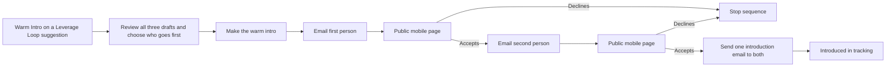

**Design proposal · September 25, 2026.** A Warm Intro action on a Leverage Loop suggestion opens a dedicated full-screen workspace with both contacts and the suggestion’s WHY already loaded. AI prepares the complete communication sequence together. The sender reviews it once; each later message waits for the required acceptance.

The visual reference is the current [Leverage Loop UI](/guides/open-work/suggestion-delivery-and-tables/leverage-loop-ui) and [Outcome UI](/guides/open-work/suggestion-delivery-and-tables/outcome-ui): Midnight surfaces, outlined WHY panels, compact profile cards, and petrol action controls. The 13 older Warm Intro screenshots supplied for this work inform the concept and useful details; their layouts and styling are superseded by this proposal.

[Open the interactive design reference](/images/warm-intro/warm-intro-reference.html) · [Download the self-contained prototype (ZIP)](/images/warm-intro/warm-intro-reference.zip)

<Note>
**Design only.** The prototype uses illustrative contacts and local interactions. It does not call AI, send email, store real consent, or connect to the application. Its toolbar switches between Setup, Recipient page, Emails, and Tracking. Edits survive view changes within the preview and reset on refresh. Screenshots below show the product views without the preview toolbar. The [Warm Intro Build Plan](/guides/open-work/warm-intro-feature/warm-intro-build-plan) remains a placeholder.
</Note>

## The experience at a glance

There are **three primary product surfaces** and a supporting email family:

| Surface | Main job | Primary action |
| --- | --- | --- |
| Full-screen setup in Orbiter | Review the people, order, and complete message sequence | **Make the warm intro** |
| Public mobile invitation | Understand the person and the reason, then give or withhold consent | **Yes, introduce me** / **No, thank you** |
| In-app tracking modal | See who is waiting, what has happened, and which introductions completed | Open a sequence’s detail |
| Email | Bring someone to their invitation; connect both people after consent | **Review introduction**; final email supports Reply all |

**Opening an email or public page is never acceptance.** The first person must explicitly accept before the second invitation sends. Both must explicitly accept before the final shared introduction sends. “Introduced” describes the final email being sent, not a meeting or business outcome.

## 1. Full-screen setup

<Frame caption="Dedicated setup workspace using the current Orbiter Midnight styling. The WHY and sequence remain visible while one message is edited.">
  
</Frame>

### Arrival and first-recipient choice

The user clicks the existing **Double Opt-In Warm Introduction / Make Intro** action on a Leverage Loop suggestion. This proposal replaces that action’s small inline composer with the full-screen workspace; the rest of the suggestion remains its source context.

- Both contacts, their preferred email addresses, the suggestion title, and the rich WHY are prefilled. There is no contact search or repeat explanation step.
- The default first recipient is the person with the **strongest relationship to the sender: the lowest relationship weight**, as specified for this flow. The product label is **“Avery has the closer relationship with you.”** Raw weights are not shown.
- **Ask Sarah first instead** swaps the sequence before launch. The recommendation remains distinguishable from a manual choice.
- Equal or unavailable weights must not create a false “closer relationship” claim. Keep a stable initial order, omit the Suggested badge, and say **“Choose who you’d like to ask first.”** The sender can proceed with either person first.
- All three drafts begin generating in parallel when the workspace opens. Each step can become ready independently; the sender can start reviewing the first ready draft while the others finish.

### Screen organization

| Area | Design and behavior |
| --- | --- |
| Header | Orbiter identity, Leverage Loop breadcrumb, **Save & close**, and **Warm introductions** |
| Title | Both people’s names and small profile avatars. “Review the messages, choose who goes first, and start the introduction.” |
| WHY panel | Existing suggestion headline and a concise rationale, using the current outlined Midnight blue treatment. **View the suggestion context** expands the full private context. |
| Sequence rail | **1 Ask Avery**, **2 Ask Sarah**, **3 Introduce them**. Every item names its trigger and review status. Selecting any item opens its draft; later drafts are never locked during setup. |
| Order control | Shows the first person, why they were suggested, and the explicit switch action. The subdued amber treatment follows Orbiter’s sequencing palette. |
| Draft workspace | Recipient, subject, personal note, **Edit message**, **Preview email**, and **Preview public page**. The invitation button is included automatically in email. |
| Review footer | **Mark reviewed & next** advances through drafts. Review is a sender action, distinct from a recipient accepting the introduction. |
| Start area | Review count, a plain-language sequence summary, and **Make the warm intro**. It describes exactly what the sender is authorizing. |

One spacious editor keeps attention on the message being reviewed. The rail makes all three communications and their dependency order visible together. The useful concept of reviewing all three messages from the early designs is retained.

### Drafts, edits, and approval

**Three AI drafts are prepared together:** the first request, the second request, and the final introduction. Each request’s personal note is reused on its public invitation page. The email subject stays email-specific. Standard consent and closure text is also previewable; it is not silently generated after launch.

| Interaction | Result |
| --- | --- |
| Edit subject or note | Save the draft and mark that message **Edited · Review again**. |
| Choose another email for a contact | Update that person’s request and the final email recipients; both affected reviews must be repeated. Offer a dropdown when multiple saved addresses exist. |
| Missing or invalid address | Inline field error and **Add email** or address correction; start remains disabled. Never infer an email address. |
| Same address selected for both people | Explain that each person needs a distinct address; do not start. |
| Switch who is asked first | Preserve edits with their intended recipient, update sequencing labels and conditional copy, and reset all three review states. The sender reviews the new order. |
| Regenerate a draft | If the draft has human edits, ask before replacing them. Keep the current text available until the replacement succeeds. |
| Mark reviewed | Validate the current draft and mark it reviewed. Blank subjects or notes cannot be approved. |
| Save & close | Preserve the prelaunch draft and return to the originating suggestion. Reopening resumes the saved draft. |
| Make the warm intro | Available when both addresses are usable, all drafts are ready, and all three are reviewed. Starts the first request and opens tracking detail. |

The second invitation’s **“Avery is open to connecting”** statement is conditional system context outside the editable note. It appears only when Avery has actually accepted. This prevents switching the order from leaving a false acceptance claim in edited prose.

The start action is the sender’s authorization for the reviewed sequence. It needs no second generic confirmation. Its pending state is **Starting introduction…**, with repeat clicks disabled. If starting fails, keep the approved drafts and show **“Your introduction hasn’t started. Try again.”** An uncertain result is checked before offering another start.

After launch, the reviewed messages, recipients, and order are a read-only record. Changes to the people or the sequence require cancelling and creating a new introduction. This keeps later automated communications aligned with what was reviewed and accepted.

### Setup states

| State | What the sender sees |
| --- | --- |
| Drafting | Person cards and WHY available immediately; separate skeletons and **Drafting…** labels for all three messages. Start disabled. |
| Partially ready | Ready drafts editable; remaining steps show their own drafting state. |
| One draft fails | **Couldn’t draft this message** in that step with **Try again**. Successful drafts and edits remain intact. |
| Edited | Current text retained, affected review indicator reset. |
| Ready | **3 of 3 messages reviewed**; the action becomes available. |
| Saving problem | **Changes haven’t saved** with retry; prevent starting from a version that has not been saved. |
| First request queued | Detail opens with **Sending request to Avery**. Show **Waiting for Avery** only when the request has been sent. |

The prototype opens in the ready-to-review state. Generation, durable autosave, and sending are specified states for the application, not simulated backend capabilities.

## 2. Public invitation on a phone

<Columns cols={2}>
  <Frame caption="First recipient: context and a clear choice. The page follows Orbiter’s current dark visual language.">
    
  </Frame>
  <Frame caption="Second recipient: only reached after the first person agrees. Acceptance now authorizes the shared introduction.">
    
  </Frame>
</Columns>

### Information hierarchy

1. **Trust and sender:** Orbiter identity and **Mark Pederson has someone in mind for you**. The recipient should recognize who is making the request immediately.
2. **Personal invitation:** **Avery, meet Sarah.** This is an invitation, not a claim that the introduction has already happened.
3. **Who they would meet:** A compact profile with name, role, company, short relevant description, and a few useful topic labels. Longer approved background can expand beneath it.
4. **Why Mark is suggesting it:** The sender-reviewed personal note, using the familiar outlined WHY treatment. It is not a raw dump of the sender’s private suggestion context.
5. **Consent and next step:** Plain-language disclosure of what saying yes does, followed by two visible actions.

The page requires **no Orbiter account, app install, or login**. It is accessible through the recipient’s private invitation link. Only the invited person’s page is presented; there is no directory or public contact search.

### Consent language

| Recipient | Before accepting | After accepting |
| --- | --- | --- |
| First person | **Your email stays private until you both agree to connect.** Expanding “What happens if I say yes?” explains that the other person is asked next. | **You’re open to it. We’ll ask Sarah next. If they agree, you’ll both receive Mark’s introduction email.** |
| Second person | **Avery is open to connecting.** The disclosure says that accepting shares their name and email with Avery in the introduction email. | **You’ve both said yes.** The email is being prepared; show a sent confirmation only after sending is confirmed. |
| Either person declining | **No, thank you** opens a small confirmation view with an optional private note for Mark. | **Thanks for letting Mark know. This introduction won’t go ahead. Your contact details haven’t been shared.** |

The affirmative action is **Yes, introduce me**. The decline action is **No, thank you**, with comparable tap space and a quieter visual emphasis. No required reason, guilt-inducing copy, or signup prompt follows a decline.

### Accepted, declined, and closed states

<Columns cols={3}>
  <Frame caption="First acceptance: a saved decision and an honest waiting state.">
    
  </Frame>
  <Frame caption="Decline: an optional private note to the introducer.">
    
  </Frame>
  <Frame caption="Completion: both agreed and the shared email has been sent.">
    
  </Frame>
</Columns>

| Situation | Required experience |
| --- | --- |
| Decision is saving | Disable both decision buttons; show **Saving your response…**. Do not optimistically trigger the next step. |
| Decision saves successfully | Replace the invitation actions with the applicable confirmation. No repeat acceptance control. |
| Response fails | **We couldn’t save your response. Your decision hasn’t been recorded. Try again.** Preserve an optional decline note. |
| First person reopens their accepted invitation | Show the saved acceptance and the current sequence state. |
| Both accepted; final email pending | **You’ve both said yes. Your introduction is on its way.** Do not claim completion yet. |
| Introduction sent | **You’re introduced. Check your inbox.** Name the subject of the final email. |
| Declined or cancelled sequence | A closed state without decision controls. The other person never sees a private decline note. |
| Expired invitation | Explain that the link can no longer record a decision and suggest asking Mark for a new invitation. |
| Invalid or superseded link | Generic unavailable state, no private profile or context. |

An already accepted person may receive neutral closure copy if the other person declines, the sender cancels, or the sequence expires. The copy says the introduction is not going ahead; it does not disclose the other person’s private note or characterize their reason.

### Mobile layout and content boundaries

- Design at **390 px** and validate at **320, 390, and 430 px**. Public desktop access keeps a centered reading column rather than expanding to a desktop dashboard.
- Use 20–24 px horizontal content padding, a compact profile, and a single vertical reading order. No profile-history tabs or large relationship graph.
- Place the consent actions together in a bottom action region; keep them reachable while reading and above device safe areas. They must never cover the final lines of content or the on-screen keyboard.
- Use 48 px primary and secondary action heights. Any editable field uses at least 16 px text on mobile.
- Long names wrap, missing portraits use initials, absent profile details disappear cleanly, and long notes remain readable without horizontal scrolling.
- Share only the sender-reviewed note and approved profile details. Private notes, relationship weights, contact lists, and internal WHY evidence do not appear on the public page. Email addresses become shared only in the final introduction after both accept.

## 3. The communication family

<Columns cols={2}>
  <Frame caption="Invitation email: a personal note and one Review introduction button. The email does not contain a one-click consent action.">
    
  </Frame>
  <Frame caption="Final introduction: one shared thread after both accept, with the sender copied.">
    
  </Frame>
</Columns>

The in-app and public web views use Orbiter’s current dark palette. The email reference uses a restrained light email canvas for readability in inboxes; the product controls and consent sequence stay the same.

| Communication | Recipient and trigger | Content |
| --- | --- | --- |
| Request 1 | First chosen person, when the sender starts | Reviewed subject and personal note; **Review introduction** opens that recipient’s public page. |
| Request 2 | Second person, only after first acceptance | Their reviewed note; truthful **Avery is open to connecting** context; their own invitation link. |
| Final introduction | Both people, only after both accept | Reviewed final message in **one shared email**, both recipients visible, sender copied, Reply all supported. |
| Acceptance acknowledgement | Person who just accepted, on the public page | Saved-decision confirmation and the next step. No extra email required for this acknowledgement. |
| Closure, when needed | An already-accepted person whose introduction stops | Neutral, prewritten closure. Contact details and private decline notes remain withheld. |
| Sender status | The sender, in Orbiter tracking | First acceptance, second acceptance, introduction sent, decline, expiry, cancellation, or delivery issue. |

**Delivery is planned through Resend**, as requested. The visible sender treatment is **Mark Pederson via Orbiter**. The verified sending address, reply routing, and provider mechanics belong in the later build plan. The final email must make replying to both newly connected people straightforward.

Draft preview and actual delivery must use the same approved copy. Recipients’ names, the current order, and any first-acceptance statement must match the actual sequence. No new AI wording is introduced between approval and send.

The prototype includes a **Closure** email example in the Emails view. Its default wording is:

> This introduction won’t be going ahead this time. Thank you for being open to it. Your contact details haven’t been shared.

## 4. Warm introductions tracking modal

<Frame caption="A compact history modal with explicit stage labels. Pending introductions show exactly who is being asked and whether the other person has been contacted.">
  
</Frame>

Open **Warm introductions** from the app’s introduction entry point or from the setup header. When an originating suggestion already has an active introduction, **View introduction** opens its existing detail instead of starting a duplicate sequence.

### List view

- **All / In progress / Introduced / Closed / Drafts** filters and a search across people and introduction context.
- Each row shows the two people, a brief purpose, a plain-language current stage, and last activity.
- A small three-segment progress cue supports the text. Color is supplementary; it never carries the meaning alone.
- The first pending state says **Waiting for Avery — Sarah hasn’t been contacted**. The second says **Waiting for Sarah — Avery accepted**.
- **Introduced** means both accepted and the final shared email was sent. It never means merely “two green checkmarks.”
- Sort by most recent activity. Keep stopped and completed introductions available in history; do not silently remove them.
- Open a row’s detail within the modal. **Back to all introductions** preserves the current filter, search, and list position.

### Tracking states

| Label | Meaning | Available action |
| --- | --- | --- |
| Draft | Setup saved; no request sent | Resume setup |
| Sending request to Avery | Start accepted; first delivery pending | View detail |
| Waiting for Avery | First request sent; no first response yet | View / cancel |
| Sending request to Sarah | Avery accepted; second delivery pending | View detail |
| Waiting for Sarah | Avery accepted; second request sent | View / cancel |
| Sending introduction | Both accepted; final email pending | View detail |
| Introduced | Final shared email sent to both | View the communication record |
| Declined | One person declined; sequence stopped | View stage and private note, if supplied |
| Expired | A pending request expired without the required response | View / create a fresh invitation |
| Cancelled | Sender stopped the sequence before completion | View record |
| Delivery issue | A required email could not be delivered | Show the affected message and a recovery action |

Pending sending states remain distinct from waiting for a person. A final email that fails must not be marked Introduced. If a delivery problem is reported later, retain the acceptance and send history and surface the problem with its affected recipient.

### Sequence detail

<Frame caption="The detail view makes the dependency explicit: Avery has accepted, Sarah is waiting, and the final introduction has not been sent.">
  
</Frame>

The left column shows the current stage and a chronological sequence: started, first request and response, second request and response, then the final introduction. The production record includes timestamps for events that have occurred; future events are labeled as waiting, not assigned estimated times.

The right column contains the approved communication record, actual sending state, the originating Leverage Loop context, and any private response intended for the sender. Sent messages remain read-only. Cancelling preserves everything already sent or accepted.

**Cancel introduction** explains that future messages stop and previously delivered messages cannot be recalled. It is unavailable once the final send has begun or completed. If consent or sending changes while the cancellation is being confirmed, show the actual current state rather than promising a recall.

The empty history state says **“Your introductions will appear here.”** A filtered empty state says **“No introductions match this view.”** Neither implies an error. Loading uses row skeletons; a load failure keeps filters and offers **Try again**.

## Visual and interaction specification

### Match the current product

| Token / component | Reference value or treatment |
| --- | --- |
| Page | `--orb-page: #080a0b` |
| Profile, header, and modal surface | `--orb-panel: #0e1420` |
| Structural border | `--orb-border: #202d47` |
| Primary text / secondary text | `#f1f3f8` / `#bfc3ce` |
| WHY panel | `#172440` fill, `#7899da` border, `#adc9ff` accent |
| Sequence choice | `#292316` fill, `#635334` border, `#d8bb7a` accent |
| Action area and button | `#14323b` area, `#1a424b` button, `#3e7380` border, `#b0dce3` text |
| Draft fields | `#111a2b` fill, `#354668` border, 6 px radius |
| Panel radius | Existing 8–10 px product treatment; no new large rounded-card language |
| Typography | Existing system sans stack; 14–15 px body, 12–13 px supporting text, 24–26 px view titles |
| Spacing | 4 / 8 / 12 / 16 / 24 / 32 px steps; use existing product spacing tokens where available |

The full-screen workspace uses a 300 px context rail and a flexible editor at desktop widths. At approximately 1,000 px the rail narrows; at 740 px the content becomes a single column with compact sequence controls above the editor. The editor never shrinks below a usable reading width. The setup’s final action follows the editor on small screens.

The history modal is approximately 1,150 px maximum width with a restrained scrim over the app. Its list and details scroll within the available viewport. Below 740 px, the same modal becomes a full-height sheet; rows stack, and sequence detail becomes a single column. Close and Back remain reachable.

### Interaction and accessibility

- Use real buttons, links, inputs, labels, and disclosure controls. Preserve visible keyboard focus.
- The history modal traps focus, has a named dialog role, closes with Escape, and returns focus to its opener. Closing a saved draft returns to the originating suggestion.
- Selecting a sequence step is a view change, not approval. The review and launch controls have explicit action labels.
- Status changes are announced politely. Input errors are announced next to the affected field; move focus to the first error when a blocked action is attempted.
- The public decision controls have 48 px targets and sufficient spacing. No critical information depends on hover, color alone, or an animation.
- Keep motion to subtle control transitions; respect reduced-motion preferences. Avoid animated progress implying work is occurring while merely waiting for a person.
- Support keyboard-only completion, long names and translated labels, text zoom, missing images, slow generation, failed saving, and repeat visits to a decided invitation.

## Design defaults and boundaries

These choices make the current proposal concrete and remain reviewable before implementation:

| Choice | Proposed behavior |
| --- | --- |
| Review model | Three explicit message reviews followed by one sequence-level start action. |
| Editing after start | Preserve the approved sequence; cancellation and a new introduction are needed for changes. |
| Public identity and context | Sender identity, approved profile summary, and the reviewed personal note. No private relationship metrics or notes. |
| Contact sharing | Name and profile context are visible in the invitation; email addresses are shared only in the final email after both accept. |
| Final communication | One shared email to both people, sender copied. |
| Decline note | Optional, visible only to the sender. Other-party closure is neutral. |
| Reminders | No automatic reminder in the initial design. Adding one requires its own reviewed communication and clear timing. |
| Expiry | An expired-link state is designed. The duration and any renewal policy are still to be chosen; the interface must show an actual expiry date once policy exists. |

This page covers the experience, copy, state model, and visual reference. Backend orchestration, consent-link mechanics, Resend integration, storage, and delivery recovery implementation will be addressed in the [Warm Intro Build Plan](/guides/open-work/warm-intro-feature/warm-intro-build-plan) after the design is reviewed.

## Reference package

The [downloadable prototype](/images/warm-intro/warm-intro-reference.zip) contains a single HTML file with no external dependencies. Open it in a browser and use its preview toolbar to explore the setup, public recipient states, all email variants, and history. The three message subjects and notes are editable; the first-recipient switch preserves edits; reviewed messages unlock the local start preview. Recipient actions update the illustrative tracking record within the page.

The screens use **Avery Stone, Sarah Chen, Fieldwork, and Northline Ventures as fictional sample content**. They describe a design scenario, not actual people’s relationships or a real proposed introduction. The earlier screenshots are retained as source reference outside this published page; the new screens are the design proposal.
